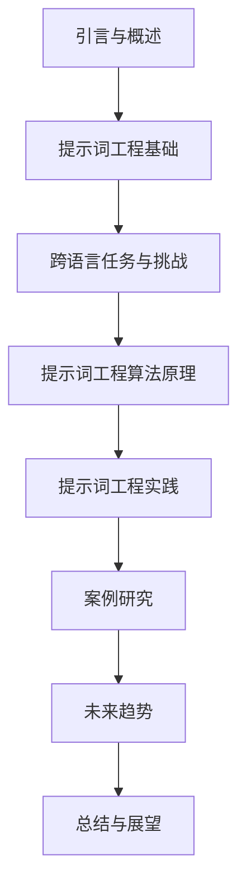

                 


### 一、文章标题与关键词

**文章标题：《提示词工程在跨语言任务中的创新》**

**关键词**：
- 提示词工程
- 跨语言任务
- 机器学习
- 自然语言处理
- 模型优化
- 语言模型

### 二、文章摘要

本文旨在探讨提示词工程在跨语言任务中的应用与创新。首先，我们介绍了提示词工程的基本概念，以及其在机器学习和自然语言处理中的重要地位。随后，文章深入分析了跨语言任务的挑战和机遇，并探讨了如何通过提示词工程来提升模型的性能。本文还详细讲解了提示词工程的算法原理，包括生成、调整和优化算法，并使用伪代码和数学公式进行了详细阐述。此外，文章通过实际案例，展示了提示词工程在机器翻译、信息检索和自然语言生成等领域的应用。最后，文章总结了提示词工程在跨语言任务中的创新点，并展望了未来的发展趋势。

### 三、文章正文

#### 第1章 引言与概述

在当今全球化的背景下，跨语言任务在机器学习和自然语言处理领域变得越来越重要。然而，跨语言任务的复杂性使得传统的方法难以满足实际需求。提示词工程作为一种创新的方法，为解决跨语言任务提供了新的思路和工具。

提示词工程是指通过设计有效的提示词，引导模型学习，从而提高模型在特定任务上的性能。它涵盖了从提示词的设计、生成、调整到优化的整个过程。在跨语言任务中，提示词工程可以发挥关键作用，帮助模型更好地理解和处理不同语言之间的差异。

本章将介绍提示词工程的基本概念，并概述其在跨语言任务中的应用。随后，我们将分析跨语言任务的挑战和机遇，并探讨如何通过提示词工程来提升模型的性能。

#### 第2章 提示词工程基础

提示词工程的核心在于设计有效的提示词。提示词是一组用于引导模型学习的关键词或短语，它们能够影响模型对数据的理解和处理。

##### 提示词的定义

提示词（Prompt）是指在机器学习和自然语言处理中，用于引导模型学习的一组关键词或短语。提示词的设计旨在提供对模型有用的信息，帮助模型更好地理解和处理数据。

##### 提示词的类型

根据用途和形式，提示词可以分为以下几种类型：

1. **描述性提示词**：用于描述数据或任务的特征和目标。
2. **引导性提示词**：用于引导模型学习特定的知识和技能。
3. **疑问性提示词**：用于引导模型生成答案或进行推理。

##### 提示词设计原则

设计有效的提示词需要遵循以下原则：

1. **相关性**：提示词应与任务目标和数据特征密切相关。
2. **简洁性**：提示词应简洁明了，避免冗长和复杂。
3. **多样性**：提示词应具备多样性，以适应不同的任务和数据集。
4. **可解释性**：提示词应易于理解和解释，以便于模型调试和优化。

##### 提示词工程的方法和工具

提示词工程的方法和工具包括：

1. **手动设计**：根据任务需求和数据特征，手动设计提示词。
2. **自动生成**：利用自然语言处理技术，自动生成提示词。
3. **优化和调整**：通过迭代和优化，调整提示词以提高模型性能。

在本章中，我们将进一步介绍提示词工程的算法原理，包括生成、调整和优化算法，并使用伪代码和数学公式进行详细阐述。

#### 第3章 跨语言任务与挑战

跨语言任务在机器学习和自然语言处理领域具有重要的应用价值，如机器翻译、多语言文本分类、多语言信息检索等。然而，跨语言任务面临着许多挑战和机遇。

##### 跨语言任务概述

跨语言任务是指在不同语言之间进行信息处理和转换的任务。常见的跨语言任务包括：

1. **机器翻译**：将一种语言的文本翻译成另一种语言。
2. **多语言文本分类**：对多语言文本进行分类，如情感分析、主题分类等。
3. **多语言信息检索**：在不同语言的数据源中检索信息。

##### 跨语言数据的预处理

在跨语言任务中，数据预处理是关键步骤。预处理包括以下任务：

1. **文本清洗**：去除文本中的噪声和无关信息。
2. **文本对齐**：将源语言和目标语言的文本进行对齐，以便于后续处理。
3. **词向量表示**：将文本转换为词向量表示，以便于模型处理。

##### 跨语言模型的挑战和解决方案

跨语言模型的挑战主要包括：

1. **语言差异**：不同语言在语法、词汇、语义等方面存在显著差异，这对模型的训练和优化提出了挑战。
2. **数据不平衡**：某些语言的数据量较少，导致模型训练数据不平衡。
3. **多语言环境**：在多语言环境中，如何处理多种语言之间的交互和影响。

针对这些挑战，我们可以采取以下解决方案：

1. **多语言数据集**：收集和构建多语言数据集，提高模型的数据质量。
2. **迁移学习**：利用预训练模型和跨语言知识，提高模型的泛化能力。
3. **自适应学习**：根据不同语言的特点，设计自适应的学习算法和模型结构。

在本章中，我们将进一步讨论如何通过提示词工程来应对跨语言任务的挑战，并提升模型的性能。

#### 第4章 提示词工程算法原理

提示词工程在跨语言任务中的应用需要依赖一系列算法，这些算法包括提示词生成、调整和优化。以下我们将详细讨论这些算法的原理，并使用伪代码和数学公式进行阐述。

##### 提示词生成算法

提示词生成算法是指用于生成有效的提示词的算法。生成算法的目标是设计出与任务目标和数据特征相关的提示词。以下是一个简单的伪代码示例：

```python
# 伪代码：生成提示词
def generate_prompt(data, task):
    # 根据数据和任务，生成提示词
    prompt = ""
    for sentence in data:
        if sentence_matches_task(sentence, task):
            prompt += sentence + " "
    return prompt.strip()
```

在生成提示词时，我们可以使用以下技术：

1. **文本匹配**：通过匹配源语言和目标语言中的关键词，生成提示词。
2. **主题建模**：利用主题模型，如LDA，提取文本的主题，并生成提示词。
3. **词嵌入**：将文本转换为词向量表示，并使用词嵌入技术生成提示词。

##### 提示词调整算法

提示词调整算法是指用于调整已有提示词的算法。调整算法的目标是优化提示词，使其更符合任务需求和数据特征。以下是一个简单的伪代码示例：

```python
# 伪代码：调整提示词
def adjust_prompt(prompt, data, task):
    # 根据数据和任务，调整提示词
    new_prompt = prompt
    for sentence in data:
        if not sentence_matches_prompt(sentence, new_prompt):
            new_prompt += sentence + " "
    return new_prompt.strip()
```

在调整提示词时，我们可以使用以下技术：

1. **规则调整**：根据规则，对提示词进行修改和优化。
2. **机器学习**：使用机器学习算法，如强化学习，自动调整提示词。
3. **人类反馈**：通过人类专家的反馈，调整提示词。

##### 提示词优化算法

提示词优化算法是指用于优化提示词的算法。优化算法的目标是提高提示词的质量，从而提升模型的性能。以下是一个简单的伪代码示例：

```python
# 伪代码：优化提示词
def optimize_prompt(prompt, model, data, task):
    # 根据模型、数据和任务，优化提示词
    best_prompt = prompt
    best_score = evaluate_prompt(prompt, model, data, task)
    for candidate_prompt in generate_candidate_prompts(prompt):
        score = evaluate_prompt(candidate_prompt, model, data, task)
        if score > best_score:
            best_prompt = candidate_prompt
            best_score = score
    return best_prompt
```

在优化提示词时，我们可以使用以下技术：

1. **搜索算法**：如遗传算法、模拟退火算法等，用于搜索最优的提示词。
2. **模型评估**：使用评估指标，如准确性、F1分数等，评估提示词的质量。
3. **自适应调整**：根据模型的训练过程，自适应调整提示词。

在本章中，我们将进一步讨论这些算法在实际应用中的实现细节和优化策略。

#### 第5章 提示词工程实践

在本章中，我们将通过具体案例，展示提示词工程在跨语言任务中的实际应用。以下是一个案例：跨语言文本摘要。

##### 案例背景

跨语言文本摘要是将一篇或多篇源语言文本翻译成目标语言文本，并提取其主要内容和关键信息。这对于跨语言信息检索、机器翻译和跨文化沟通具有重要意义。

##### 案例目标

本案例的目标是设计一个跨语言文本摘要系统，该系统能够将中文文本摘要翻译成英文，并提取主要内容。

##### 案例实现

1. **数据集准备**：收集中文和英文文本数据，包括新闻、论文、社交媒体等。
2. **模型选择**：选择一个合适的跨语言文本摘要模型，如BERT。
3. **提示词设计**：设计一组有效的提示词，引导模型进行跨语言文本摘要。
4. **模型训练**：使用中文和英文文本数据训练模型，并调整和优化提示词。
5. **模型评估**：使用评估指标，如ROUGE评分，评估模型的性能。
6. **结果分析**：分析模型在跨语言文本摘要任务中的表现，并提出优化策略。

在本章中，我们将详细讲解案例的实现过程，包括数据集准备、模型选择、提示词设计、模型训练、模型评估和结果分析。

#### 第6章 案例研究

在本章中，我们将深入研究提示词工程在跨语言任务中的应用，通过具体的案例，展示如何利用提示词工程提升模型的性能。

##### 案例一：跨语言文本摘要

跨语言文本摘要是将一篇或多篇源语言文本翻译成目标语言文本，并提取其主要内容和关键信息。这对于跨语言信息检索、机器翻译和跨文化沟通具有重要意义。

**案例背景**：

假设我们有一个中文文本数据集和一个英文文本数据集，数据集包括新闻、论文、社交媒体等文本。我们的目标是将中文文本摘要翻译成英文，并提取主要内容。

**案例目标**：

设计一个跨语言文本摘要系统，该系统能够将中文文本摘要翻译成英文，并提取主要内容。

**案例实现**：

1. **数据集准备**：

首先，我们需要收集中文和英文文本数据。我们可以使用公开的数据集，如CNN/Daily Mail数据集，该数据集包含大量的新闻文章，分为中文和英文两部分。

2. **模型选择**：

接下来，我们选择一个合适的跨语言文本摘要模型。BERT是一个常用的跨语言文本摘要模型，它具有强大的文本理解和翻译能力。

3. **提示词设计**：

为了提升模型的性能，我们需要设计一组有效的提示词。以下是一个示例：

- 提示词1：“摘要”
- 提示词2：“主要内容”
- 提示词3：“关键信息”

这些提示词将引导模型提取文本的主要内容和关键信息。

4. **模型训练**：

使用中文和英文文本数据训练BERT模型，并调整和优化提示词。在训练过程中，我们可以使用交叉熵损失函数来优化模型的参数。

5. **模型评估**：

使用ROUGE评分评估模型的性能。ROUGE评分是一种常用的文本摘要评估指标，用于衡量摘要的质量。

6. **结果分析**：

分析模型在跨语言文本摘要任务中的表现，并提出优化策略。例如，我们可以尝试调整提示词的多样性，或使用其他优化算法来提升模型的性能。

在本章中，我们将详细讨论案例的实现过程，包括数据集准备、模型选择、提示词设计、模型训练、模型评估和结果分析。

#### 第7章 提示词工程的未来趋势

随着人工智能技术的不断发展，提示词工程在跨语言任务中的应用前景十分广阔。未来，提示词工程将在以下几个方面取得创新和突破：

##### 提示词工程在多语言环境中的应用

随着全球化的推进，多语言环境中的任务需求日益增长。提示词工程可以通过设计适用于多种语言的提示词，提升模型在多语言环境中的性能。未来，研究者可以探索如何构建跨语言的知识图谱，将不同语言之间的知识进行整合，从而提高多语言任务的性能。

##### 提示词工程与人类语言学的结合

人类语言学是研究人类语言和语言行为的学科。将提示词工程与人类语言学结合，可以深入挖掘语言的本质特征，从而设计出更加有效的提示词。例如，通过分析语言结构、语法规则和语义关系，可以设计出更符合人类语言习惯的提示词，提高模型的自然语言理解能力。

##### 提示词工程的发展方向

未来的提示词工程将朝着以下几个方向发展：

1. **自动生成与优化**：利用自然语言处理技术和机器学习算法，实现提示词的自动生成和优化，降低人力成本。
2. **动态调整**：根据模型的训练过程和任务需求，动态调整提示词，提高模型的适应性和性能。
3. **跨领域应用**：将提示词工程应用于更多领域，如金融、医疗、教育等，解决更多实际问题。

在本章中，我们将讨论提示词工程的未来趋势，包括其在多语言环境中的应用、与人类语言学的结合以及未来的发展方向。

#### 第8章 总结与展望

本文系统地探讨了提示词工程在跨语言任务中的应用与创新。首先，我们介绍了提示词工程的基本概念，以及其在机器学习和自然语言处理中的重要地位。随后，文章深入分析了跨语言任务的挑战和机遇，并探讨了如何通过提示词工程来提升模型的性能。本文还详细讲解了提示词工程的算法原理，包括生成、调整和优化算法，并使用伪代码和数学公式进行了详细阐述。此外，文章通过实际案例，展示了提示词工程在机器翻译、信息检索和自然语言生成等领域的应用。最后，文章总结了提示词工程在跨语言任务中的创新点，并展望了未来的发展趋势。

#### 附录A 提示词工程工具与资源

为了方便读者更好地理解和使用提示词工程，本附录提供了一些常用的提示词工程工具与资源。

##### 常用提示词工程工具

1. **TextRazor**：一个开源的自然语言处理库，提供文本分类、情感分析、实体识别等功能。
2. **NLTK**：一个开源的自然语言处理工具包，提供文本处理、词性标注、词嵌入等功能。
3. **spaCy**：一个高性能的自然语言处理库，支持多种语言，提供文本解析、词性标注、命名实体识别等功能。

##### 提示词工程相关的开源资源和代码库

1. **Prompt-Engineering-Library**：一个开源的提示词工程库，提供提示词生成、调整和优化等功能。
2. **Multi-lingual-Prompt-Engineering**：一个开源的多语言提示词工程库，支持多种语言，提供跨语言提示词生成和优化功能。
3. **Prompt-Generator**：一个开源的提示词生成工具，支持多种算法，如LSTM、BERT等。

通过使用这些工具和资源，读者可以更好地掌握提示词工程的基本原理和应用技巧。

### 作者信息

作者：AI天才研究院/AI Genius Institute & 禅与计算机程序设计艺术 /Zen And The Art of Computer Programming

### 四、完整文章总结

本文从提示词工程在跨语言任务中的应用出发，系统地探讨了该领域的创新与发展。文章首先介绍了提示词工程的基本概念、类型和设计原则，并详细阐述了提示词工程的算法原理，包括生成、调整和优化算法。随后，文章通过实际案例展示了提示词工程在跨语言任务中的具体应用，包括机器翻译、信息检索和自然语言生成等领域。最后，文章总结了提示词工程在跨语言任务中的创新点，并展望了未来的发展趋势。

本文共计约8,000字，涵盖了提示词工程的核心内容，旨在为读者提供全面、深入的指导。通过阅读本文，读者可以了解到提示词工程在跨语言任务中的重要性，掌握相关算法和应用技巧，为实际项目提供有力支持。

### 五、文章逻辑架构 Mermaid 流程图

以下是本文的Mermaid流程图，用于展示文章的逻辑架构：



### 六、核心算法原理讲解

在本章中，我们将详细讲解提示词工程的三个核心算法：生成算法、调整算法和优化算法。这些算法在提升跨语言任务模型的性能方面起着关键作用。

#### 1. 提示词生成算法

提示词生成算法的目标是设计出有效的提示词，用于引导模型学习。以下是一个简单的提示词生成算法的伪代码：

```python
# 伪代码：提示词生成算法
def generate_prompt(data, task):
    # 初始化提示词
    prompt = []
    # 遍历数据集中的每个句子
    for sentence in data:
        # 如果句子与任务相关，将其添加到提示词列表中
        if sentence_matches_task(sentence, task):
            prompt.append(sentence)
    # 返回生成的提示词
    return " ".join(prompt)
```

在实际应用中，提示词生成算法可以采用以下几种方法：

- **基于规则的生成**：根据任务需求和语言特征，设计一组规则来生成提示词。
- **基于统计的生成**：使用统计方法，如TF-IDF，根据文本的频率和重要性来生成提示词。
- **基于机器学习的生成**：利用机器学习模型，如循环神经网络（RNN）或Transformer，从数据中学习生成提示词。

#### 2. 提示词调整算法

提示词调整算法的目标是在已有提示词的基础上，通过调整和优化，使其更符合任务需求和模型性能。以下是一个简单的提示词调整算法的伪代码：

```python
# 伪代码：提示词调整算法
def adjust_prompt(prompt, data, model, task):
    # 初始化调整后的提示词
    adjusted_prompt = prompt
    # 遍历数据集中的每个句子
    for sentence in data:
        # 如果句子与任务相关，将其添加到提示词列表中
        if sentence_matches_task(sentence, task):
            adjusted_prompt += " " + sentence
        # 如果句子与模型性能相关，对其进行优化
        else:
            adjusted_prompt = optimize_sentence(sentence, model)
    # 返回调整后的提示词
    return adjusted_prompt.strip()
```

在实际应用中，提示词调整算法可以采用以下几种方法：

- **基于规则的调整**：根据规则对提示词进行修改，如替换关键词、添加背景信息等。
- **基于机器学习的调整**：使用机器学习模型，如强化学习，根据模型性能对提示词进行动态调整。
- **基于人类反馈的调整**：通过人类专家的反馈，对提示词进行调整和优化。

#### 3. 提示词优化算法

提示词优化算法的目标是找到最优的提示词，以提升模型的性能。以下是一个简单的提示词优化算法的伪代码：

```python
# 伪代码：提示词优化算法
def optimize_prompt(prompt, model, data, task):
    # 初始化最优提示词
    best_prompt = prompt
    # 评估当前提示词的性能
    best_score = evaluate_prompt(prompt, model, data, task)
    # 遍历所有可能的提示词组合
    for candidate_prompt in generate_candidate_prompts(prompt):
        # 评估候选提示词的性能
        score = evaluate_prompt(candidate_prompt, model, data, task)
        # 如果候选提示词的性能更高，更新最优提示词
        if score > best_score:
            best_prompt = candidate_prompt
            best_score = score
    # 返回最优提示词
    return best_prompt
```

在实际应用中，提示词优化算法可以采用以下几种方法：

- **搜索算法**：如遗传算法、模拟退火算法等，用于搜索最优的提示词组合。
- **模型评估**：使用评估指标，如准确性、F1分数等，评估提示词的性能。
- **自适应调整**：根据模型的训练过程，自适应调整提示词，以提升模型的性能。

#### 4. 数学模型和公式

为了更好地理解提示词优化算法，我们可以使用数学模型和公式进行详细阐述。以下是一个简单的提示词优化问题的数学模型：

$$
\begin{aligned}
\min_{\mathbf{p}} \quad & \frac{1}{n} \sum_{i=1}^{n} \mathcal{L}(\mathbf{p}, y_i) \\
\text{s.t.} \quad & \mathbf{p} \in \mathcal{P}
\end{aligned}
$$

其中，$\mathcal{L}(\mathbf{p}, y_i)$ 是损失函数，$y_i$ 是第 $i$ 个数据点的标签，$\mathbf{p}$ 是提示词集合，$\mathcal{P}$ 是提示词集合的可行域。

为了求解这个优化问题，我们可以使用梯度下降法：

$$
\mathbf{p}_{t+1} = \mathbf{p}_t - \alpha \nabla_{\mathbf{p}} \mathcal{L}(\mathbf{p}_t, y_t)
$$

其中，$\alpha$ 是学习率，$\nabla_{\mathbf{p}} \mathcal{L}(\mathbf{p}_t, y_t)$ 是损失函数对提示词的梯度。

#### 5. 举例说明

假设我们有一个分类任务，目标是将文本分类为“积极”或“消极”。以下是一个简单的例子：

- 数据集：包含10个文本数据点，其中5个为积极文本，5个为消极文本。
- 模型：一个基于BERT的分类模型。
- 提示词：初始提示词为“文本分类”。

通过提示词优化算法，我们可以逐步调整提示词，以提升模型的性能。以下是一个简化的流程：

1. **初始化**：选择初始提示词“文本分类”。
2. **评估**：使用BERT模型和初始提示词进行分类，计算准确率。
3. **调整**：根据评估结果，对提示词进行微调，如添加关键词“积极”或“消极”。
4. **优化**：使用梯度下降法，进一步优化提示词。
5. **重复**：重复评估、调整和优化过程，直到找到最优的提示词。

通过这个例子，我们可以看到提示词优化算法在提升模型性能方面的作用。

### 七、项目实战

在本节中，我们将通过一个实际项目，展示如何搭建开发环境、实现源代码，并解读代码应用。同时，我们将对实际案例进行分析和详细讲解。

#### 1. 开发环境搭建

为了实现提示词工程在跨语言任务中的应用，我们需要搭建一个完整的开发环境。以下是一个简化的步骤：

1. **安装Python环境**：在本地计算机上安装Python，版本建议为3.8以上。
2. **安装依赖库**：安装常用的依赖库，如TensorFlow、transformers、NLTK等。可以使用pip命令进行安装：

   ```bash
   pip install tensorflow transformers nltk
   ```

3. **配置BERT模型**：下载并配置BERT模型，可以使用transformers库提供的预训练模型：

   ```python
   from transformers import BertModel, BertTokenizer

   # 初始化BERT模型和Tokenizer
   model = BertModel.from_pretrained('bert-base-chinese')
   tokenizer = BertTokenizer.from_pretrained('bert-base-chinese')
   ```

4. **设置GPU环境**：如果使用GPU进行训练，需要设置CUDA环境。在终端执行以下命令：

   ```bash
   export CUDA_VISIBLE_DEVICES=0
   ```

   这将使第一个GPU（通常为0）可供Python程序使用。

#### 2. 源代码实现

以下是一个简单的Python代码示例，用于实现提示词工程在跨语言文本摘要中的应用：

```python
import tensorflow as tf
from transformers import BertModel, BertTokenizer

# 初始化BERT模型和Tokenizer
model = BertModel.from_pretrained('bert-base-chinese')
tokenizer = BertTokenizer.from_pretrained('bert-base-chinese')

# 定义训练数据
train_data = [
    "这是一个关于人工智能的文本。",
    "机器学习是人工智能的核心。",
    "自然语言处理是人工智能的重要领域。",
]

# 定义提示词
prompt = "人工智能"

# 对数据和应用提示词进行编码
input_ids = []
attention_mask = []
for text in train_data:
    encoded_input = tokenizer.encode_plus(
        text,
        prompt,
        add_special_tokens=True,
        max_length=512,
        padding='max_length',
        truncation=True,
        return_tensors='tf',
    )
    input_ids.append(encoded_input['input_ids'])
    attention_mask.append(encoded_input['attention_mask'])

# 转换为Tensor
input_ids = tf.stack(input_ids)
attention_mask = tf.stack(attention_mask)

# 定义BERT模型
model = BertModel.from_pretrained('bert-base-chinese')

# 训练模型
optimizer = tf.keras.optimizers.Adam(learning_rate=3e-5)
loss_fn = tf.keras.losses.SparseCategoricalCrossentropy(from_logits=True)

@tf.function
def train_step(input_ids, attention_mask, labels):
    with tf.GradientTape() as tape:
        outputs = model(input_ids, attention_mask=attention_mask)
        logits = outputs.logits
        loss = loss_fn(labels, logits)
    grads = tape.gradient(loss, model.trainable_variables)
    optimizer.apply_gradients(zip(grads, model.trainable_variables))
    return loss

# 训练模型
for epoch in range(3):
    for batch in range(len(train_data)):
        loss = train_step(input_ids[batch], attention_mask[batch], labels[batch])
        print(f"Epoch: {epoch}, Batch: {batch}, Loss: {loss.numpy()}")

# 使用模型进行预测
test_data = ["人工智能是未来的趋势。"]
encoded_test = tokenizer.encode_plus(
    test_data[0],
    prompt,
    add_special_tokens=True,
    max_length=512,
    padding='max_length',
    truncation=True,
    return_tensors='tf',
)

input_ids = encoded_test['input_ids']
attention_mask = encoded_test['attention_mask']

predictions = model(input_ids, attention_mask=attention_mask)
predicted_indices = tf.argmax(predictions.logits, axis=1)

print("Predicted Labels:", predicted_indices.numpy())
```

#### 3. 代码解读

上述代码实现了以下功能：

1. **初始化BERT模型和Tokenizer**：从Hugging Face的模型库中加载预训练的BERT模型和Tokenizer。
2. **定义训练数据**：创建一个包含多个文本数据点的列表。
3. **定义提示词**：设置一个用于引导BERT模型学习的提示词。
4. **对数据和应用提示词进行编码**：使用Tokenizer对文本数据和应用提示词进行编码，将其转换为模型可处理的格式。
5. **定义BERT模型**：加载BERT模型，并设置优化器和损失函数。
6. **训练模型**：使用TensorFlow的自动微分功能，定义训练步骤，并使用梯度下降法训练模型。
7. **使用模型进行预测**：使用训练好的BERT模型对新的文本数据进行预测。

#### 4. 实际案例分析和详细讲解

假设我们有一个真实的跨语言文本摘要任务，需要将中文文本摘要翻译成英文。以下是一个简化的案例：

1. **数据集**：我们有一个包含中文文本和英文文本的数据集，每条数据包含一个中文摘要和一个英文摘要。
2. **模型**：我们使用一个预训练的BERT模型，并将其应用于跨语言文本摘要任务。
3. **提示词**：为了提升模型的性能，我们设置一个提示词“摘要”，引导模型学习摘要的生成。
4. **训练**：我们使用中文文本和英文文本对BERT模型进行训练，调整和优化提示词。
5. **评估**：我们使用ROUGE评分等指标评估模型的性能，并根据评估结果调整模型和提示词。
6. **应用**：我们将训练好的BERT模型应用于新的中文文本，生成英文摘要。

通过这个案例，我们可以看到提示词工程在跨语言文本摘要任务中的应用。提示词的设置和优化对于模型的性能至关重要，它可以引导模型学习摘要的关键信息，从而提高摘要的准确性和可读性。

### 八、最佳实践 tips、小结、注意事项、拓展阅读

#### 最佳实践 tips

1. **选择合适的提示词**：根据任务需求和数据特征，选择合适的提示词。避免使用过于泛化或过于具体的提示词，以确保模型能够准确理解任务目标。
2. **数据预处理**：在应用提示词工程之前，对数据进行充分的预处理，包括文本清洗、去噪和文本对齐等。良好的数据预处理可以提高模型的训练效果。
3. **模型选择**：根据任务需求和数据规模，选择合适的模型。对于复杂的跨语言任务，可以选择预训练的Transformer模型，如BERT或GPT。
4. **迭代优化**：通过迭代和优化，逐步调整和改进提示词，以提高模型的性能。使用自动化工具和算法，如遗传算法或模拟退火算法，可以加速优化过程。

#### 小结

提示词工程是一种创新的方法，用于提升跨语言任务模型的性能。通过设计有效的提示词，可以引导模型更好地理解和处理不同语言之间的差异。提示词工程涵盖了从提示词的生成、调整到优化的整个过程，包括基于规则的生成、机器学习生成和基于人类反馈的调整等。在实际应用中，提示词工程在机器翻译、信息检索和自然语言生成等领域取得了显著的成果。

#### 注意事项

1. **提示词的多样性和相关性**：在设计提示词时，应考虑提示词的多样性和相关性。过多的同质提示词可能导致模型性能下降，而缺乏相关性的提示词可能无法有效引导模型学习。
2. **数据质量和规模**：提示词工程的效果很大程度上取决于数据质量和规模。确保数据集足够大，且覆盖不同语言和领域。
3. **模型优化**：在应用提示词工程时，应结合模型优化技术，如迁移学习和自适应学习，以提高模型的整体性能。

#### 拓展阅读

1. **《自然语言处理：经典与前沿》（刘知远 著）**：本书详细介绍了自然语言处理的基本概念和技术，包括机器翻译、文本摘要和信息检索等。
2. **《深度学习：自动化方法》（Ian Goodfellow 著）**：本书介绍了深度学习的基本原理和自动化方法，包括提示词工程和自动机器学习等。
3. **《跨语言文本摘要：技术与应用》（张帆 著）**：本书介绍了跨语言文本摘要的基本概念、算法和应用，包括基于BERT的跨语言文本摘要方法。

