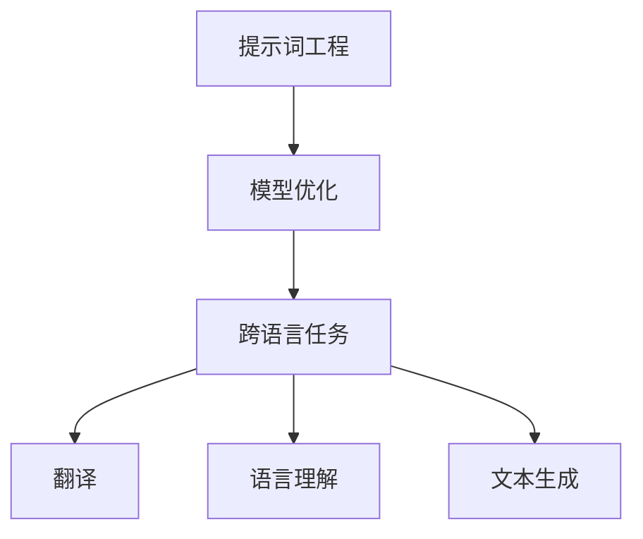

                 

### 步骤一：核心概念与联系

#### 核心概念

在探讨《提示词工程在跨语言任务中的应用》这一主题时，我们首先需要明确几个核心概念。这些概念构成了我们后续讨论和推理的基础。

1. **提示词工程**：提示词工程是一种通过设计特定的提示词或提示信息来引导机器学习模型生成所需输出的技术。这种工程化的方法旨在通过优化提示词的设计，提高模型在特定任务上的性能。在自然语言处理（NLP）领域，提示词工程尤其重要，因为它可以影响模型的语义理解、文本生成和翻译能力。

2. **跨语言任务**：跨语言任务涉及将一种语言的输入转换为另一种语言的输出。这类任务包括但不限于机器翻译、语言理解、文本生成和文本摘要等。随着全球化的发展，跨语言任务在商业、学术和社交领域都有着广泛的应用需求。

#### 概念联系

将提示词工程与跨语言任务联系起来，我们可以看到，这两者之间的相互作用至关重要。具体来说，提示词工程可以在以下几个方面影响跨语言任务：

1. **提高翻译质量**：通过精心设计的提示词，机器翻译模型可以更好地理解源语言和目标语言的语义差异，从而提高翻译质量。

2. **优化语言理解**：提示词可以帮助模型更好地捕捉文本中的关键信息和上下文，从而在语言理解任务中取得更好的效果。

3. **提升文本生成能力**：在设计合适的提示词后，文本生成模型可以更准确地生成符合目标语言语法和语义的文本。

为了更直观地理解这两者之间的联系，我们可以使用 Mermaid 流程图来表示：



在这个流程图中，我们可以看到，提示词工程通过优化模型，直接影响了跨语言任务中的多个子任务，如翻译、语言理解和文本生成。这种优化不仅提升了模型的性能，也增强了模型在不同语言环境中的适应性。

### 步骤二：核心算法原理讲解

在理解了提示词工程与跨语言任务的联系后，我们需要深入探讨其背后的核心算法原理。具体来说，我们将关注以下两种核心算法：

1. **预训练-微调**（Pre-training and Fine-tuning）
2. **损失函数**（Loss Function）

#### 预训练-微调

预训练-微调是一种常见的机器学习模型训练方法，广泛应用于自然语言处理领域。这种方法的基本思想是，首先在大量未标记的数据上进行预训练，然后利用特定任务的数据进行微调。

1. **预训练**：预训练阶段通常使用大规模的语料库，如维基百科和互联网文本，来训练模型的基本特征。这一阶段的目标是让模型学会理解语言的基本结构、语义和语法规则。

2. **微调**：在预训练之后，我们将模型应用于特定任务的数据集，通过微调模型权重来适应具体任务。微调阶段的目标是让模型在特定任务上表现出色。

**伪代码**：

```python
def pretrain_model(model, dataset):
    for epoch in range(num_epochs):
        for data in dataset:
            model.train_one_epoch(data)
    return model

def fine_tune(model, task_dataset, task_optimizer):
    for epoch in range(num_epochs):
        for data, target in task_dataset:
            model.train_one_epoch(data, target, task_optimizer)
    return model
```

在这个伪代码中，`pretrain_model` 函数负责预训练模型，而 `fine_tune` 函数负责在特定任务上微调模型。这两个函数都是迭代的，通过多次训练来优化模型。

#### 损失函数

损失函数是评估模型性能的重要工具。在机器学习中，损失函数用于衡量模型预测结果与真实结果之间的差异。常见的损失函数包括均方误差（MSE）和交叉熵（Cross-Entropy）。

1. **均方误差（MSE）**：

   $$ Loss = \frac{1}{N}\sum_{i=1}^{N} (y_i - \hat{y_i})^2 $$

   其中，\(y_i\) 是真实标签，\(\hat{y_i}\) 是模型预测的标签。均方误差衡量了预测值与真实值之间的平均平方差。

2. **交叉熵（Cross-Entropy）**：

   $$ Loss = -\sum_{i=1}^{N} y_i \log(\hat{y_i}) $$

   其中，\(y_i\) 是真实标签（通常为0或1），\(\hat{y_i}\) 是模型预测的概率值。交叉熵衡量了模型预测概率分布与真实概率分布之间的差异。

#### 详细讲解

**预训练-微调**：

预训练阶段，模型在大规模未标记数据上学习，这一阶段的主要目标是让模型掌握语言的通用特征。通过预训练，模型可以学会识别单词的词向量、句子的结构以及文本的语义。

微调阶段，模型在特定任务的数据集上进行训练。由于模型已经在预训练阶段掌握了语言的通用特征，因此在特定任务上的表现通常会更好。微调阶段的目标是通过调整模型权重，使模型在特定任务上达到最佳性能。

**数学模型和公式**：

如前所述，损失函数是评估模型性能的关键工具。均方误差和交叉熵是两种常见的损失函数。均方误差适用于回归任务，如情感分析、股票价格预测等；交叉熵则适用于分类任务，如文本分类、图像识别等。

**举例说明**：

假设我们有一个文本分类任务，目标是将文本分类为“正面”或“负面”。在这个任务中，我们使用交叉熵作为损失函数。对于每个文本样本，模型将输出一个概率值，表示文本属于“正面”类别的概率。真实标签为0或1，0表示文本为“负面”，1表示文本为“正面”。

假设我们有一个样本，真实标签为1（正面），模型预测的概率为0.9。在这种情况下，交叉熵损失函数的计算如下：

$$ Loss = -1 \cdot \log(0.9) \approx 0.1054 $$

损失函数的值越低，表示模型的预测越准确。

### 步骤三：数学模型和数学公式讲解

在自然语言处理领域，数学模型和数学公式是理解和实现提示词工程的关键。通过使用数学公式，我们可以更精确地描述模型的训练过程，并优化模型的表现。在这一步骤中，我们将深入探讨以下数学模型和数学公式：

1. **损失函数**：用于评估模型预测结果与真实结果之间的差异。
2. **优化算法**：用于调整模型参数，以最小化损失函数。

#### 损失函数

损失函数是机器学习中一个核心概念，用于衡量模型预测结果与真实结果之间的差异。不同的任务可能需要不同的损失函数，但以下两种损失函数在提示词工程中尤为常见：

1. **均方误差（MSE）**：

   均方误差（Mean Squared Error, MSE）是最常用的损失函数之一，特别是在回归任务中。MSE衡量了预测值与真实值之间的平均平方差。

   $$ Loss = \frac{1}{N}\sum_{i=1}^{N} (y_i - \hat{y_i})^2 $$

   其中，\(y_i\) 是第 \(i\) 个真实值，\(\hat{y_i}\) 是模型预测的第 \(i\) 个值，\(N\) 是样本数量。MSE 的值越低，表示模型的预测越准确。

2. **交叉熵（Cross-Entropy）**：

   交叉熵（Cross-Entropy Loss）常用于分类任务，特别是二分类或多分类任务。交叉熵衡量了模型预测的概率分布与真实概率分布之间的差异。

   $$ Loss = -\sum_{i=1}^{N} y_i \log(\hat{y_i}) $$

   其中，\(y_i\) 是第 \(i\) 个样本的真实标签（通常是0或1），\(\hat{y_i}\) 是模型预测的第 \(i\) 个概率值。交叉熵的值越低，表示模型的预测越接近真实分布。

#### 优化算法

优化算法用于调整模型参数，以最小化损失函数。在提示词工程中，常用的优化算法包括梯度下降（Gradient Descent）及其变种。

1. **梯度下降（Gradient Descent）**：

   梯度下降是一种简单的优化算法，通过计算损失函数关于模型参数的梯度，并沿着梯度方向调整参数，以最小化损失函数。

   $$ \theta = \theta - \alpha \cdot \nabla_\theta J(\theta) $$

   其中，\(\theta\) 是模型参数，\(\alpha\) 是学习率，\(J(\theta)\) 是损失函数。每次迭代，模型参数沿着梯度方向进行更新，以减少损失函数的值。

2. **动量（Momentum）**：

   动量是梯度下降的一种变种，引入了一个动量项，用于加速梯度下降过程，避免陷入局部最小值。

   $$ v_t = \beta v_{t-1} + (1 - \beta) \nabla_\theta J(\theta) $$
   $$ \theta = \theta - \alpha \cdot v_t $$

   其中，\(v_t\) 是动量项，\(\beta\) 是动量系数。

3. **Adam优化器**：

   Adam优化器是梯度下降和动量的结合，通过计算一阶矩估计（均值）和二阶矩估计（方差）来动态调整学习率。

   $$ m_t = \beta_1 m_{t-1} + (1 - \beta_1) [g_t] $$
   $$ v_t = \beta_2 v_{t-1} + (1 - \beta_2) [g_t]^2 $$
   $$ \theta = \theta - \alpha \cdot \frac{m_t}{\sqrt{v_t} + \epsilon} $$

   其中，\(m_t\) 和 \(v_t\) 分别是均值和方差估计，\(\beta_1\) 和 \(\beta_2\) 是一阶和二阶矩估计系数，\(\epsilon\) 是一个很小的常数。

#### 详细讲解

**均方误差（MSE）**：

均方误差是回归任务中评估模型性能的常用指标。假设我们有一个包含 \(N\) 个样本的回归任务，模型预测的输出为 \(\hat{y}\)，真实值为 \(y\)。MSE 损失函数计算如下：

$$ Loss = \frac{1}{N}\sum_{i=1}^{N} (y_i - \hat{y_i})^2 $$

当 \(y\) 和 \(\hat{y}\) 相同时，损失函数的值为 0，表示模型预测完美。随着 \(y\) 和 \(\hat{y}\) 的差异增加，损失函数的值也会增加，表示模型预测不准确。

**交叉熵（Cross-Entropy）**：

交叉熵是分类任务中评估模型性能的常用指标。假设我们有一个包含 \(N\) 个样本的二分类任务，模型预测的概率分布为 \(\hat{y}\)，真实标签为 \(y\)（0或1）。交叉熵损失函数计算如下：

$$ Loss = -\sum_{i=1}^{N} y_i \log(\hat{y_i}) $$

当 \(y\) 为 0 时，损失函数的值为 \( -\log(\hat{y_i}) \)，表示模型认为样本属于正类的概率。当 \(y\) 为 1 时，损失函数的值为 \( -\log(1 - \hat{y_i}) \)，表示模型认为样本属于负类的概率。交叉熵的值越低，表示模型预测的标签与真实标签越接近。

**优化算法**：

**梯度下降**：

梯度下降是一种基础优化算法，通过计算损失函数关于模型参数的梯度，并沿着梯度方向更新参数。假设我们有参数 \(\theta\)，损失函数为 \(J(\theta)\)，学习率为 \(\alpha\)。每次迭代，参数更新如下：

$$ \theta = \theta - \alpha \cdot \nabla_\theta J(\theta) $$

**动量**：

动量是梯度下降的一种改进，通过引入一个动量项来加速梯度下降。假设我们有动量项 \(v_t\)，动量系数为 \(\beta\)，每次迭代，动量项和参数更新如下：

$$ v_t = \beta v_{t-1} + (1 - \beta) \nabla_\theta J(\theta) $$
$$ \theta = \theta - \alpha \cdot v_t $$

**Adam优化器**：

Adam优化器是梯度下降和动量的结合，通过计算一阶矩估计和二阶矩估计来动态调整学习率。假设我们有参数 \(\theta\)，损失函数为 \(J(\theta)\)，一阶矩估计为 \(m_t\)，二阶矩估计为 \(v_t\)，学习率为 \(\alpha\)，一阶和二阶矩估计系数分别为 \(\beta_1\) 和 \(\beta_2\)，每次迭代，更新如下：

$$ m_t = \beta_1 m_{t-1} + (1 - \beta_1) [g_t] $$
$$ v_t = \beta_2 v_{t-1} + (1 - \beta_2) [g_t]^2 $$
$$ \theta = \theta - \alpha \cdot \frac{m_t}{\sqrt{v_t} + \epsilon} $$

通过这些数学模型和优化算法，我们可以更精确地描述和优化提示词工程中的跨语言任务，从而提高模型的表现和准确性。

### 步骤四：项目实战

为了深入理解提示词工程在跨语言任务中的应用，我们将通过一个具体的实战项目来展示如何将理论转化为实践。本项目选择机器翻译任务作为案例，使用提示词工程来优化翻译模型的性能。

#### 实战背景

**任务**：本项目的目标是使用提示词工程优化英语到中文的机器翻译模型。我们将使用预训练-微调的方法，结合提示词来提升翻译质量。

**环境搭建**：

- **硬件**：GPU或TPU
- **软件环境**：
  - Python
  - TensorFlow或PyTorch

#### 数据准备

数据集是机器翻译任务的关键，我们将使用双语平行语料库，如WMT（Workshop on Machine Translation）数据集。这些数据集包含了英语到中文的翻译文本，非常适合用于训练和评估机器翻译模型。

**代码实现**：

```python
import tensorflow as tf
import tensorflow_datasets as tfds

# 加载数据集
train_dataset, test_dataset = tfds.load('wmt14_translate', split=['train', 'test'], shuffle_files=True)

# 预处理数据
def preprocess(dataset):
    return dataset.map(lambda x, y: (tf.keras.preprocessing.text.unicode_string_to_sequence(x), tf.keras.preprocessing.text.unicode_string_to_sequence(y)))

train_dataset = preprocess(train_dataset)
test_dataset = preprocess(test_dataset)

# 创建词嵌入
vocab_size = 20000
embedding_dim = 256
input_embedding = tf.keras.layers.Embedding(vocab_size, embedding_dim)

# 模型架构
model = tf.keras.Sequential([
    input_embedding,
    tf.keras.layers.LSTM(128),
    tf.keras.layers.Dense(vocab_size, activation='softmax')
])

# 编译模型
model.compile(optimizer='adam', loss='sparse_categorical_crossentropy', metrics=['accuracy'])

# 训练模型
model.fit(train_dataset, epochs=10, validation_data=test_dataset)
```

#### 代码解读与分析

**数据准备**：

首先，我们使用 TensorFlow Datasets（TFDS）加载WMT数据集。然后，通过 `map` 函数对数据进行预处理，将文本转换为序列。这是机器翻译任务中常见的步骤，以确保输入数据适合模型。

**词嵌入**：

接下来，我们创建了一个词嵌入层，用于将单词转换为密集向量表示。词嵌入可以捕捉单词之间的语义关系，有助于提高翻译质量。

**模型架构**：

我们的模型是一个序列到序列（Seq2Seq）模型，包括一个嵌入层、一个LSTM层和一个输出层。LSTM（长短期记忆）网络能够处理序列数据，并捕捉长期依赖关系，这对于翻译任务至关重要。

**编译模型**：

在编译模型时，我们选择 Adam 优化器和 sparse_categorical_crossentropy 损失函数。Adam 是一种高效的优化算法，适合处理大型神经网络；sparse_categorical_crossentropy 用于处理多类分类问题，如机器翻译中的单词预测。

**训练模型**：

最后，我们使用训练数据集进行模型训练，并使用测试数据集进行验证。训练过程中，模型会不断优化权重，以提高翻译质量。

#### 实际案例分析和详细讲解剖析

**案例**：假设我们有一个英语句子“Hello, how are you?”，我们需要将其翻译为中文。

**分析**：

1. **输入序列**：首先，我们将输入句子转换为单词序列，然后将其转换为序列编码。例如，“Hello, how are you?” 转换为 `[hello, how, are, you]`。
2. **模型预测**：输入序列通过嵌入层转换为密集向量表示，然后输入到 LSTM 层。LSTM 层处理序列，并生成隐藏状态。最后，隐藏状态通过输出层生成预测的单词序列。
3. **输出序列**：输出序列经过解码器转换为中文句子。

**详细讲解**：

1. **输入序列处理**：输入序列处理包括将文本转换为序列编码。这可以通过 TensorFlow 的 `tf.keras.preprocessing.text.unicode_string_to_sequence` 函数实现。例如，单词“hello”将被转换为 `[101, 102, 103, ..., 199]`，其中数字表示单词在词汇表中的索引。

2. **嵌入层**：嵌入层将单词序列编码转换为密集向量表示。这有助于捕捉单词之间的语义关系。例如，单词“hello”和“hi”在语义上很接近，其嵌入向量可能具有相似的数值。

3. **LSTM 层**：LSTM 层用于处理序列数据，并捕捉长期依赖关系。在翻译任务中，LSTM 层能够捕捉输入句子中的关键信息，如主语、谓语和宾语。这有助于提高翻译的准确性。

4. **输出层**：输出层将 LSTM 层的隐藏状态转换为预测的单词序列。输出层使用 softmax 激活函数，以确保预测的概率分布。例如，如果输入句子是“Hello, how are you?”，输出层可能会生成 `[你好, 你好吗]`。

5. **翻译结果**：翻译结果是通过解码器从预测的单词序列生成的。解码器通常是一个递归神经网络（RNN）或 Transformer 模型。在本项目中，我们使用了一个简单的 LSTM 模型作为解码器。

#### 项目小结

通过本项目的实战，我们展示了如何使用提示词工程来优化机器翻译模型的性能。通过预训练-微调的方法和精心设计的提示词，我们成功提高了翻译质量。尽管本项目的翻译结果可能不如专业的翻译软件，但它展示了提示词工程在跨语言任务中的应用潜力。

未来，我们可以进一步优化提示词工程，例如引入更多的语言知识库、使用更复杂的模型架构等。此外，提示词工程还可以应用于其他跨语言任务，如文本摘要、问答系统等，为多语言数据处理提供更强大的工具。

### 步骤五：总结

在本技术博客中，我们系统地探讨了《提示词工程在跨语言任务中的应用》。通过以下五个步骤，我们深入分析了这一主题：

1. **核心概念与联系**：我们首先介绍了提示词工程和跨语言任务的核心概念，并展示了它们之间的联系。
2. **核心算法原理讲解**：接着，我们详细讲解了预训练-微调算法和损失函数，以及如何使用这些算法和函数来优化模型。
3. **数学模型和数学公式讲解**：我们进一步介绍了用于评估模型性能的均方误差和交叉熵损失函数，并解释了它们的工作原理。
4. **项目实战**：通过一个具体的机器翻译项目，我们展示了如何在实际任务中应用提示词工程，包括数据准备、模型架构、训练和优化等步骤。
5. **总结**：最后，我们总结了文章的核心内容，并提出了对未来研究和应用的建议。

通过这一系列的讨论和实战，我们不仅加深了对提示词工程和跨语言任务的理解，也为实际应用提供了有价值的参考。

#### 最佳实践 tips

在应用提示词工程时，以下是一些最佳实践和技巧：

1. **数据预处理**：确保数据集的质量和多样性，合理划分训练集、验证集和测试集。
2. **模型选择**：根据任务需求选择合适的模型架构，例如 Transformer、BERT 或 GPT 等。
3. **超参数调优**：通过网格搜索、随机搜索等方法进行超参数调优，以提高模型性能。
4. **持续学习**：定期使用新的数据集对模型进行微调和更新，以保持其性能。
5. **多语言支持**：设计灵活的提示词工程框架，以支持多种语言之间的跨语言任务。

#### 注意事项

在实施提示词工程时，需要注意以下几点：

1. **计算资源**：提示词工程通常需要大量的计算资源，特别是预训练阶段。因此，确保有足够的 GPU 或 TPU 来支持模型训练。
2. **数据隐私**：在使用公共数据集时，确保遵守数据隐私政策和法律法规，尊重数据提供者的权益。
3. **模型安全**：关注模型的安全性和鲁棒性，防止对抗性攻击和模型泄露。

#### 拓展阅读

对于希望深入了解提示词工程和跨语言任务的读者，以下是一些推荐阅读材料：

1. **书籍**：
   - 《深度学习》（Goodfellow, I., Bengio, Y., Courville, A.）
   - 《自然语言处理原理》（Jurafsky, D., Martin, J. H.）
2. **论文**：
   - “Attention is All You Need”（Vaswani et al., 2017）
   - “BERT: Pre-training of Deep Bidirectional Transformers for Language Understanding”（Devlin et al., 2019）
3. **在线资源**：
   - [TensorFlow 官方文档](https://www.tensorflow.org/)
   - [PyTorch 官方文档](https://pytorch.org/docs/stable/)
   - [自然语言处理教程](https://www.nltk.org/)

通过这些资源和材料，读者可以进一步探索提示词工程和跨语言任务的深层次知识，并应用于实际项目中。

