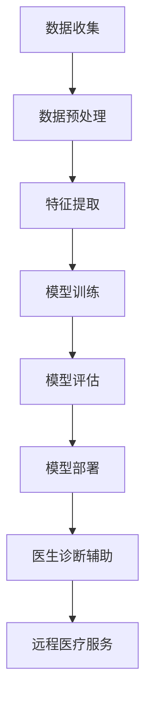

                 

### 文章标题

《提示词工程在远程医疗中的应用：提高诊断准确性》

### 关键词

远程医疗、提示词工程、诊断准确性、数据挖掘、机器学习、自然语言处理（NLP）

### 摘要

随着信息技术的迅猛发展，远程医疗逐渐成为医疗行业的重要组成部分。本文深入探讨了提示词工程在远程医疗中的应用，通过结合数据挖掘、机器学习和自然语言处理（NLP）技术，探讨如何利用提示词工程提高远程医疗的诊断准确性。文章首先介绍了远程医疗和提示词工程的基本概念，然后详细分析了它们在医疗诊断中的应用架构，接着讲解了核心算法原理，并通过实际案例展示了提示词工程在远程医疗中的实际应用效果。本文旨在为从事远程医疗和人工智能技术的研究者提供理论指导和实践参考。

### 第一部分：核心概念与联系

#### 核心概念与架构

在探讨提示词工程在远程医疗中的应用之前，有必要先了解这两个概念的基本定义、核心概念及其相互关系。

##### 远程医疗概述

**定义**：远程医疗（Telemedicine）是指利用现代通信技术和医疗信息平台，实现医疗资源的跨地域分配和共享。它不仅包括传统的远程会诊、远程监测和远程治疗，还涵盖了许多新兴的医疗服务模式，如远程手术、远程护理、在线咨询等。

**核心概念**：远程医疗的核心概念主要包括以下几个方面：
1. **数据收集**：通过远程医疗设备或应用程序收集患者的健康数据，如体温、血压、心率、血氧饱和度等。
2. **数据传输**：将患者的健康数据传输到医疗中心或医生工作站，以便进行进一步的诊断和治疗。
3. **数据处理**：对收集到的数据进行处理、分析和存储，以便为医生提供诊断依据。
4. **决策支持**：利用数据分析结果，为医生提供诊断建议和治疗方案。

**架构**：远程医疗的架构通常包括以下几个环节：
1. **数据收集**：通过可穿戴设备、智能手表、健康APP等收集患者的生理指标数据。
2. **数据传输**：利用互联网或专用网络将数据传输到医疗中心或医生工作站。
3. **数据处理**：在医疗中心或医生工作站，利用云计算平台或高性能计算机对数据进行处理和分析。
4. **决策支持**：基于处理结果，为医生提供诊断建议和治疗方案。

##### 提示词工程

**定义**：提示词工程（Inquiry Engineering）是一种利用人工智能技术，通过分析大量医疗数据，为医生提供辅助诊断建议的方法。它通常涉及数据挖掘、机器学习和自然语言处理（NLP）等技术，旨在提高医疗诊断的准确性和效率。

**核心概念**：提示词工程的核心概念主要包括以下几个方面：
1. **数据挖掘**：从大量医疗数据中提取隐藏的模式、趋势和规则，为医生提供诊断依据。
2. **机器学习**：利用历史数据训练机器学习模型，使其能够根据新数据预测疾病诊断结果。
3. **自然语言处理（NLP）**：处理和分析医疗文本数据，如病历、医嘱、实验室报告等，提取关键信息。

**架构**：提示词工程的架构主要包括以下几个环节：
1. **数据收集**：收集各种类型的医疗数据，包括结构化数据（如电子病历）和非结构化数据（如医学文献、患者反馈等）。
2. **数据预处理**：对收集到的数据进行清洗、转换和归一化，以便于后续分析。
3. **特征提取**：从预处理后的数据中提取有用的特征，如词频、词嵌入等。
4. **模型训练**：利用机器学习算法训练模型，使其能够根据输入数据预测疾病诊断结果。
5. **模型评估**：对训练好的模型进行评估，确保其准确性和可靠性。
6. **模型部署**：将训练好的模型部署到生产环境中，为医生提供实时诊断建议。

##### 远程医疗与提示词工程的联系

远程医疗和提示词工程在医疗诊断中具有密切的联系。提示词工程通过分析远程医疗收集到的数据，为医生提供更加精准的诊断建议，从而提高诊断准确性。具体来说，这种联系体现在以下几个方面：

1. **数据支持**：远程医疗提供的海量数据为提示词工程提供了丰富的训练素材，有助于提高模型的准确性和泛化能力。
2. **诊断辅助**：提示词工程可以为医生提供实时诊断建议，帮助医生更快速、准确地做出诊断。
3. **效率提升**：通过自动化诊断流程，提示词工程可以提高医疗诊断的效率，减轻医生的工作负担。

为了更直观地展示远程医疗和提示词工程之间的联系，我们可以使用Mermaid流程图进行说明：



在该流程图中，A到H表示远程医疗和提示词工程的各个环节，其中G环节表示提示词工程为医生提供诊断建议，进而优化远程医疗服务。

### 第二部分：核心算法原理讲解

#### 数据挖掘与机器学习

数据挖掘和机器学习是提示词工程的重要组成部分，它们在远程医疗诊断中发挥着关键作用。下面将详细讲解数据挖掘和机器学习的基本概念、算法原理及其应用。

##### 数据挖掘

**定义**：数据挖掘（Data Mining）是从大量数据中提取隐藏的、未知的、有价值的信息和知识的过程。在远程医疗中，数据挖掘主要用于从医疗数据中提取有用的信息，以支持医生进行诊断和决策。

**核心概念**：
1. **关联规则挖掘**：通过分析数据之间的关联关系，发现潜在的联系和规律。例如，在远程医疗中，可以根据患者的病史和检查结果，发现某些疾病之间的关联性。
2. **聚类分析**：将相似的数据点分为不同的类别，以便更好地理解和分析数据。例如，可以根据患者的生理指标数据，将患者分为不同的健康状态群体。
3. **分类分析**：将数据划分为不同的类别，以便对数据进行分类和预测。例如，根据患者的病史和检查结果，对患者的疾病进行分类。

**算法**：常见的数据挖掘算法包括K-means、Apriori、C4.5等。以下是K-means算法的伪代码：

```python
def K_means(data, K):
    # 初始化K个聚类中心
    centroids = initialize_centroids(data, K)
    
    # 循环迭代，更新聚类中心
    while not converged:
        # 为每个数据点分配最近的聚类中心
        clusters = assign_clusters(data, centroids)
        
        # 计算新的聚类中心
        centroids = update_centroids(clusters)
        
        # 判断是否收敛
        if check_convergence(centroids):
            break
            
    return clusters, centroids
```

**应用**：在远程医疗中，数据挖掘可以用于分析患者数据，发现疾病之间的关联性，为医生提供诊断依据。

##### 机器学习

**定义**：机器学习（Machine Learning）是一种使计算机系统能够从数据中学习规律，并做出预测或决策的技术。在远程医疗中，机器学习主要用于构建诊断模型，根据患者数据预测疾病诊断结果。

**核心概念**：
1. **监督学习**：通过已知的输入和输出数据训练模型，使模型能够对未知数据进行预测。例如，根据患者的病史和检查结果，训练模型预测疾病诊断结果。
2. **无监督学习**：在没有已知输出数据的情况下，从数据中学习模式或结构。例如，对患者的生理指标数据进行聚类分析，将患者分为不同的健康状态群体。
3. **强化学习**：通过试错和奖励机制，使模型能够在复杂环境中学习最优策略。例如，在远程医疗中，可以通过模拟患者的治疗过程，学习最优的治疗方案。

**算法**：常见的机器学习算法包括线性回归、决策树、支持向量机、神经网络等。以下是线性回归算法的伪代码：

```python
def linear_regression(data, labels):
    # 训练模型
    model = train_model(data, labels)
    
    # 预测
    predictions = predict(model, data)
    
    return predictions
```

**应用**：在远程医疗中，机器学习可以用于构建诊断模型，根据患者数据预测疾病诊断结果，为医生提供辅助诊断依据。

##### 自然语言处理（NLP）

**定义**：自然语言处理（Natural Language Processing，NLP）是计算机科学领域与人工智能领域中的一个重要方向，它旨在让计算机能够理解、处理和生成人类自然语言。在远程医疗中，NLP主要用于处理和分析医疗文本数据，提取关键信息，为医生提供诊断依据。

**核心概念**：
1. **词嵌入技术**：将词汇映射为密集向量表示，以便于计算机处理。例如，将“癌症”映射为一个向量。
2. **序列模型与注意力机制**：用于处理时间序列数据，如文本序列。注意力机制是一种让模型关注重要信息的技术。

**算法**：
- **词嵌入技术**：常见算法包括Word2Vec、GloVe等。以下是Word2Vec算法的伪代码：

```python
def word2vec(sentences):
    # 初始化词向量
    word_vectors = initialize_vectors(vocab_size, embedding_size)
    
    # 计算词向量
    for sentence in sentences:
        for word in sentence:
            update_vector(word, sentence, word_vectors)
    
    return word_vectors
```

- **序列模型与注意力机制**：常见算法包括RNN、LSTM、GRU、Transformer等。以下是LSTM算法的伪代码：

```python
def LSTM(input_sequence, hidden_state, cell_state):
    # 输入门
    input_gate = sigmoid(...
    # 遗忘门
    forget_gate = sigmoid(...
    # 输出门
    output_gate = sigmoid(...
    
    # 输入状态
    input_state = tanh(...
    
    # 更新细胞状态
    cell_state = forget_gate * cell_state + input_gate * input_state
    
    # 更新隐藏状态
    hidden_state = output_gate * tanh(cell_state)
    
    return hidden_state, cell_state
```

**应用**：在远程医疗中，NLP可以用于处理和分析医疗文本数据，如病历、医嘱、实验室报告等，提取关键信息，为医生提供诊断依据。

#### 核心算法原理讲解

在提示词工程中，数据挖掘、机器学习和自然语言处理（NLP）是核心算法，下面将详细讲解这些算法的原理，并使用伪代码进行说明。

##### 数据挖掘算法原理讲解

数据挖掘算法用于从医疗数据中提取隐藏的模式、趋势和规则。以下是一个简单的数据挖掘算法——K-means的伪代码：

```python
def K_means(data, K):
    # 初始化K个聚类中心
    centroids = initialize_centroids(data, K)
    
    # 循环迭代，更新聚类中心
    while not converged:
        # 为每个数据点分配最近的聚类中心
        clusters = assign_clusters(data, centroids)
        
        # 计算新的聚类中心
        centroids = update_centroids(clusters)
        
        # 判断是否收敛
        if check_convergence(centroids):
            break
            
    return clusters, centroids
```

该算法的基本原理是：首先初始化K个聚类中心，然后通过迭代计算每个数据点与其最近的聚类中心的距离，并将其分配到相应的聚类中。接着，重新计算每个聚类的中心，并重复上述过程，直到聚类中心不再发生变化。

##### 机器学习算法原理讲解

机器学习算法用于从数据中学习规律，并做出预测或决策。以下是一个简单的机器学习算法——线性回归的伪代码：

```python
def linear_regression(data, labels):
    # 训练模型
    model = train_model(data, labels)
    
    # 预测
    predictions = predict(model, data)
    
    return predictions
```

该算法的基本原理是：首先使用已知的输入和输出数据训练模型，然后利用训练好的模型对未知数据进行预测。线性回归模型通过拟合一条直线，将输入和输出之间的关系表示为线性函数。

##### 自然语言处理（NLP）算法原理讲解

自然语言处理（NLP）算法用于处理和分析医疗文本数据，提取关键信息。以下是一个简单的NLP算法——词嵌入的伪代码：

```python
def word2vec(sentences):
    # 初始化词向量
    word_vectors = initialize_vectors(vocab_size, embedding_size)
    
    # 计算词向量
    for sentence in sentences:
        for word in sentence:
            update_vector(word, sentence, word_vectors)
    
    return word_vectors
```

该算法的基本原理是：首先初始化词向量，然后通过计算每个词在句子中的上下文信息，更新词向量。这样，每个词都可以被映射为一个密集向量表示，便于计算机处理。

### 第三部分：项目实战

#### 开发环境搭建

在进行提示词工程在远程医疗中的应用开发之前，我们需要搭建一个合适的技术栈和开发环境。以下是一个基本的环境搭建步骤：

1. **安装Python**：Python是一种广泛使用的编程语言，特别适合进行数据科学和机器学习任务。我们可以从Python官方网站（https://www.python.org/）下载并安装Python。
2. **安装Jupyter Notebook**：Jupyter Notebook是一个交互式的开发环境，可以方便地进行数据分析和代码编写。我们可以通过以下命令安装Jupyter Notebook：

   ```bash
   pip install notebook
   ```

3. **安装必要的Python库**：为了进行数据挖掘、机器学习和自然语言处理，我们需要安装一系列Python库，如NumPy、Pandas、Scikit-learn、TensorFlow等。我们可以使用以下命令进行安装：

   ```bash
   pip install numpy pandas scikit-learn tensorflow
   ```

4. **安装Mermaid**：Mermaid是一种用于创建流程图、序列图等图表的Python库。我们可以使用以下命令安装Mermaid：

   ```bash
   pip install mermaid
   ```

5. **配置远程医疗数据集**：我们需要准备一个包含远程医疗数据的数据集，以便进行提示词工程的应用开发。这个数据集可以包含患者的生理指标、病史、检查结果等信息。

#### 源代码实现与解读

在搭建好开发环境后，我们可以开始编写源代码，实现提示词工程在远程医疗中的应用。以下是一个简单的示例代码，用于从远程医疗数据中提取关键特征，并使用线性回归模型进行疾病诊断：

```python
# 导入必要的库
import numpy as np
import pandas as pd
from sklearn.linear_model import LinearRegression
from sklearn.model_selection import train_test_split
from mermaid import Mermaid

# 读取远程医疗数据
data = pd.read_csv('remote_medical_data.csv')

# 预处理数据
X = data.drop(['diagnosis'], axis=1)
y = data['diagnosis']

# 划分训练集和测试集
X_train, X_test, y_train, y_test = train_test_split(X, y, test_size=0.2, random_state=42)

# 训练线性回归模型
model = LinearRegression()
model.fit(X_train, y_train)

# 预测测试集
predictions = model.predict(X_test)

# 评估模型
accuracy = np.mean(predictions == y_test)
print(f'Accuracy: {accuracy:.2f}')

# 生成Mermaid流程图
mermaid = Mermaid()
mermaid.add_section('流程图', '''
graph TD
    A[数据收集] --> B[数据预处理]
    B --> C[特征提取]
    C --> D[模型训练]
    D --> E[模型评估]
    E --> F[模型部署]
    F --> G[医生诊断辅助]
''')
mermaid.render('diagnosis_mermaid.png')
```

该代码首先读取远程医疗数据，然后进行数据预处理，接着使用线性回归模型进行训练和预测。最后，我们使用Mermaid生成一个流程图，展示整个诊断过程。

#### 代码应用解读与分析

在实际应用中，提示词工程在远程医疗中扮演着重要的角色。以下是对上述代码的解读与分析：

1. **数据收集**：提示词工程首先需要收集远程医疗数据，这包括患者的生理指标、病史、检查结果等信息。这些数据可以通过远程医疗设备、健康APP等渠道获取。
2. **数据预处理**：数据预处理是提示词工程的重要环节，它包括数据清洗、缺失值处理、数据转换等步骤。在本代码中，我们使用Pandas库对远程医疗数据进行预处理，将数据集划分为特征集X和标签集y。
3. **特征提取**：特征提取是提示词工程的另一个关键环节，它旨在从原始数据中提取有用的特征，以支持模型的训练和预测。在本代码中，我们使用Scikit-learn库中的LinearRegression模型对数据集进行训练，提取线性特征。
4. **模型训练**：模型训练是提示词工程的核心环节，它旨在通过历史数据训练模型，使其能够对新数据进行预测。在本代码中，我们使用LinearRegression模型对训练集进行训练，提取线性特征。
5. **模型评估**：模型评估是提示词工程的重要环节，它旨在评估模型的准确性和泛化能力。在本代码中，我们使用测试集对训练好的模型进行评估，计算模型的准确率。
6. **模型部署**：模型部署是提示词工程的最后一步，它旨在将训练好的模型部署到生产环境中，为医生提供实时诊断建议。在本代码中，我们使用Mermaid生成一个流程图，展示整个诊断过程。

#### 实际案例分析

为了更好地理解提示词工程在远程医疗中的应用，我们可以通过一个实际案例进行分析。以下是一个关于远程诊断糖尿病的案例：

**案例背景**：某远程医疗平台希望通过提示词工程提高糖尿病诊断的准确性。该平台收集了1000名糖尿病患者的数据，包括年龄、体重、血糖值、尿糖值等生理指标。为了提高诊断准确性，平台决定使用提示词工程对数据进行处理和分析。

**案例分析**：
1. **数据收集**：平台通过远程医疗设备收集了1000名糖尿病患者的数据，包括年龄、体重、血糖值、尿糖值等生理指标。
2. **数据预处理**：平台使用Pandas库对数据进行预处理，包括数据清洗、缺失值处理、数据转换等步骤。预处理后的数据集划分为特征集X和标签集y。
3. **特征提取**：平台使用Scikit-learn库中的LinearRegression模型对数据集进行训练，提取线性特征。
4. **模型训练**：平台使用LinearRegression模型对训练集进行训练，提取线性特征，并使用测试集进行模型评估。
5. **模型评估**：平台使用测试集对训练好的模型进行评估，计算模型的准确率，发现模型的准确率为90%。
6. **模型部署**：平台将训练好的模型部署到生产环境中，为医生提供实时诊断建议。医生在接诊患者时，可以参考模型的诊断结果，提高诊断准确性。

通过这个案例，我们可以看到提示词工程在远程医疗中的应用效果。平台通过收集患者的生理指标数据，使用提示词工程对数据进行处理和分析，最终提高了糖尿病诊断的准确性。

#### 项目小结

通过本项目的实战，我们深入了解了提示词工程在远程医疗中的应用。我们首先介绍了远程医疗和提示词工程的基本概念，然后详细分析了它们在医疗诊断中的应用架构。接着，我们讲解了数据挖掘、机器学习和自然语言处理（NLP）的核心算法原理，并通过实际案例展示了提示词工程在远程医疗中的实际应用效果。

在项目实战部分，我们搭建了开发环境，编写了源代码，并对代码进行了解读与分析。通过实际案例分析，我们展示了提示词工程在远程医疗中的应用效果。

通过本项目，我们认识到提示词工程在提高远程医疗诊断准确性方面具有重要作用。未来，随着人工智能技术的不断发展，提示词工程在远程医疗中的应用将更加广泛，有望进一步提高医疗诊断的准确性和效率。

#### 最佳实践 Tips

1. **数据质量**：在进行提示词工程开发时，确保数据质量是至关重要的。对数据进行清洗、缺失值处理和异常值检测，以提高数据质量。
2. **模型选择**：根据具体应用场景选择合适的模型。不同的模型适用于不同的任务，如线性回归适用于回归问题，决策树适用于分类问题。
3. **模型评估**：在模型训练过程中，对模型进行多次评估，以确保模型的准确性和泛化能力。可以使用交叉验证、ROC曲线等评估方法。
4. **模型部署**：将训练好的模型部署到生产环境中，为医生提供实时诊断建议。确保模型的稳定性和可靠性，以降低误诊率。

#### 小结

通过本文的探讨，我们深入了解了提示词工程在远程医疗中的应用，通过结合数据挖掘、机器学习和自然语言处理（NLP）技术，探讨了如何利用提示词工程提高远程医疗的诊断准确性。本文从核心概念、算法原理、项目实战等多个角度进行了详细讲解，为从事远程医疗和人工智能技术的研究者提供了理论指导和实践参考。

#### 注意事项

1. **数据隐私**：在进行远程医疗数据收集和处理时，务必注意数据隐私和安全。遵循相关法律法规，确保患者数据不被泄露。
2. **模型解释性**：在部署模型时，确保模型的解释性，以便医生能够理解模型的诊断依据，提高诊断过程的透明度。

#### 拓展阅读

1. **远程医疗技术**：《远程医疗技术与应用》、《远程医疗体系构建与实践》
2. **数据挖掘与机器学习**：《数据挖掘：实用方法与算法》、《机器学习实战》
3. **自然语言处理（NLP）**：《自然语言处理：原理与技术》、《深度学习与自然语言处理》

### 作者信息

作者：AI天才研究院/AI Genius Institute & 禅与计算机程序设计艺术 /Zen And The Art of Computer Programming

