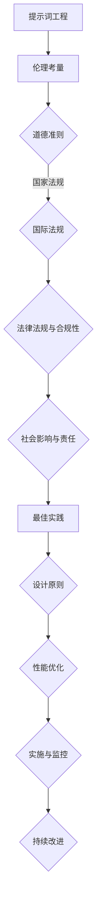

                 

# 提示词工程的伦理考量与最佳实践

## 关键词

- 提示词工程
- 伦理考量
- 最佳实践
- 人工智能
- 自然语言处理
- 道德准则
- 法律法规

## 摘要

本文旨在探讨提示词工程领域的伦理考量与最佳实践。首先，我们将理解提示词工程的定义和其在人工智能及自然语言处理中的应用。随后，本文将深入分析提示词工程的伦理问题，包括偏见、隐私泄露、透明性等。在此基础上，我们将探讨道德准则和法律法规在提示词工程中的指导作用。最后，本文将总结最佳实践，包括提示词设计原则、性能优化策略、实施与监控方法，以及持续改进的路径。通过本文的讨论，读者将获得对提示词工程伦理考量与最佳实践的全面理解。

## 理解书名：《提示词工程的伦理考量与最佳实践》

### 书名解析

《提示词工程的伦理考量与最佳实践》这本书的标题简洁明了地概括了其核心内容。首先，“提示词工程”指的是在人工智能和自然语言处理领域中，通过对提示词的设计和优化来提高模型性能的过程。这一工程不仅关注技术的实现，还包括对文本、语义、用户互动等多方面的综合处理。

“伦理考量”则强调了在执行提示词工程时，必须考虑的道德和伦理问题。这些问题可能涉及偏见、歧视、隐私保护、透明性和责任归属等。随着人工智能技术的广泛应用，其伦理影响日益显著，因此，对这些问题的深入探讨具有重要意义。

“最佳实践”是指在实际操作中，通过总结经验和教训，形成的一套行之有效的方法和策略。这些实践可以帮助开发者在进行提示词工程时，不仅能够实现技术目标，还能遵循伦理规范，确保社会效益。

### 书名所暗示的主题

书名暗示了本书的主题是围绕提示词工程中的伦理问题和最佳实践展开的。具体来说，本书将：

1. **介绍提示词工程的基本理论和方法**：包括提示词的定义、类型、设计原则等。
2. **探讨提示词工程的伦理考量**：分析常见伦理问题，如偏见、隐私、透明性等，并提供相关实例。
3. **提出道德准则和法律法规**：探讨在提示词工程中应遵循的道德规范和法律规定。
4. **总结最佳实践**：结合实际案例，分享提示词工程的最佳设计原则、性能优化策略、实施与监控方法。

通过以上内容的探讨，本书旨在为读者提供一个全面、系统的理解框架，帮助其在进行提示词工程时，不仅能够提高技术水平，还能充分考虑伦理和社会责任。

## 第一部分：伦理考量

### 第1章 提示词工程基础理论

#### 1.1 提示词工程的定义与核心概念

提示词工程（Prompt Engineering）是人工智能（AI）和自然语言处理（NLP）领域中的一个重要研究方向。它涉及通过设计、优化和调整提示词（prompts）来提升模型的表现和性能。

**定义**：提示词是提供给AI模型的一段文本或指令，用于引导模型进行特定任务，如问答、文本生成、分类等。提示词的质量直接影响模型的输出结果。

**核心概念**：

- **提示词类型**：根据用途不同，提示词可以分为问答式提示、生成式提示、分类式提示等。
- **提示词设计原则**：包括简洁性、针对性、一致性、适应性等。
- **提示词优化**：通过调整提示词的语法、语义、结构等来优化模型的表现。

#### 1.2 提示词工程的方法论

提示词工程的方法论主要包括以下几个步骤：

1. **需求分析**：明确任务目标，理解用户需求和场景。
2. **数据准备**：收集和处理相关数据，确保数据质量和多样性。
3. **提示词设计**：根据任务需求和数据特点，设计合适的提示词。
4. **模型训练**：利用设计好的提示词，训练AI模型。
5. **评估与优化**：通过评估模型的表现，不断优化提示词和模型。

#### 1.3 提示词工程的现状与趋势

随着AI和NLP技术的快速发展，提示词工程在许多应用领域中得到了广泛应用。当前的研究和趋势主要包括：

- **多模态提示词**：结合文本、语音、图像等多种数据类型，提高模型的语义理解能力。
- **自适应提示词**：根据用户行为和模型表现，动态调整提示词，提高用户体验。
- **跨领域提示词**：研究如何设计通用的提示词，以适应不同领域和任务的需求。
- **伦理考量**：在提示词工程中引入伦理准则，确保技术的公平性、透明性和社会责任。

## 第2章 伦理考量实例分析

### 2.1 伦理问题类型

在提示词工程中，可能遇到的伦理问题多种多样，主要可以分为以下几类：

- **偏见与歧视**：模型可能会在学习过程中继承或放大数据中的偏见，导致对某些群体产生不公平对待。
- **隐私泄露**：通过提示词传递的数据可能包含个人隐私信息，如姓名、地址、电话等。
- **透明性与可解释性**：模型的决策过程和结果可能缺乏透明性，用户难以理解其工作原理。
- **数据滥用**：未经授权使用用户数据，进行商业或非商业目的的数据分析。

### 2.2 实例分析1：偏见与歧视

**案例**：一家公司开发了一个招聘系统，利用AI模型进行简历筛选。然而，训练模型的数据集中存在性别和种族偏见，导致模型在招聘过程中对某些性别和种族的候选人产生歧视。

**分析**：该案例中的伦理问题主要源于数据集的选择和预处理过程。如果数据集存在偏见，模型很可能会继承这些偏见，导致不公平的结果。

**解决方案**：为了解决偏见与歧视问题，可以从以下几个方面进行改进：

1. **数据清洗**：移除或标记可能引起偏见的数据。
2. **多样性数据集**：增加不同性别、种族、年龄等背景的数据样本。
3. **偏见检测与纠正**：使用偏见检测算法，识别和纠正模型中的偏见。
4. **透明性和可解释性**：提高模型的透明性，让用户了解模型的工作原理和决策过程。

### 2.3 实例分析2：隐私泄露

**案例**：一个自然语言处理模型在处理客户服务请求时，无意中记录并泄露了用户的个人敏感信息，如家庭住址和电话号码。

**分析**：隐私泄露的主要原因是模型在训练和推理过程中，未能有效地保护用户数据。

**解决方案**：为了防止隐私泄露，可以采取以下措施：

1. **数据加密**：对敏感数据进行加密处理，确保数据在传输和存储过程中的安全性。
2. **数据脱敏**：在训练数据集之前，对敏感信息进行脱敏处理。
3. **隐私保护算法**：使用隐私保护算法，如差分隐私，降低模型泄露敏感信息的风险。
4. **用户知情同意**：在收集和使用用户数据时，确保用户知情并同意。

### 2.4 实例分析3：透明性与可解释性

**案例**：一个自动驾驶系统在发生事故后，用户和监管机构难以了解其具体决策过程，导致信任危机。

**分析**：该案例中的伦理问题主要源于模型的黑箱特性，用户和监管机构难以理解其工作原理。

**解决方案**：为了提高透明性和可解释性，可以采取以下措施：

1. **模型可解释性**：开发可解释性算法，如SHAP（Shapley Additive Explanations）和LIME（Local Interpretable Model-agnostic Explanations），帮助用户理解模型的决策过程。
2. **决策日志记录**：记录模型的决策过程和关键参数，以便事后分析和解释。
3. **用户指南**：提供详细的用户指南，解释模型的工作原理和使用方法。
4. **监管合规性**：确保模型的设计和实现符合相关法律法规和行业标准。

## 第3章 道德准则与规范

### 3.1 道德原则

在提示词工程中，道德原则是指导设计和应用的重要基础。以下是一些核心的道德原则：

- **公平性**：确保模型在处理不同群体时，不会产生不公平的结果。
- **尊重隐私**：保护用户的个人隐私，避免隐私泄露。
- **透明性**：提高模型的透明性，让用户了解其工作原理和决策过程。
- **责任归属**：明确开发者和用户在模型应用中的责任，确保各方承担责任。
- **社会责任**：考虑模型对社会的影响，确保技术的应用符合社会责任。

### 3.2 行业规范

除了道德原则，行业规范也是指导提示词工程的重要参考。以下是一些主要的行业规范：

- **数据保护规范**：确保数据收集、处理和存储过程中的安全性。
- **公平性准则**：确保模型在处理不同群体时，不会产生歧视性结果。
- **透明性标准**：提高模型的透明性，确保用户和监管机构能够理解其工作原理。
- **可解释性要求**：确保模型的决策过程具有可解释性，便于用户和监管机构监督。

### 3.3 国家与地区法规

不同国家和地区的法规对提示词工程也提出了具体的要求。以下是一些常见的法规：

- **欧盟通用数据保护条例（GDPR）**：规定了数据保护的基本原则和用户隐私权。
- **美国加州消费者隐私法（CCPA）**：规定了用户对个人数据的访问权和删除权。
- **中国个人信息保护法（PIPL）**：规定了个人信息保护的基本原则和规范。

在提示词工程中，遵守相关法规是确保技术合法合规的重要保障。

## 第4章 法律法规与合规性

### 4.1 法律法规概述

在提示词工程领域，法律法规是确保技术合法合规的重要基石。以下是一些关键法律法规及其主要内容：

- **《通用数据保护条例》（GDPR）**：欧盟制定的隐私保护法规，要求企业在处理个人数据时，必须获得用户明确同意，并确保数据的安全性和透明性。
- **《加州消费者隐私法》（CCPA）**：美国加州制定的消费者隐私保护法规，规定了消费者对个人数据的访问权和删除权。
- **《中国个人信息保护法》（PIPL）**：中国制定的个人信息保护法规，规定了个人信息的收集、处理和存储的基本原则，以及用户的隐私权。
- **《欧盟人工智能法案》**：欧盟正在制定的关于人工智能的综合性法规，旨在确保人工智能技术的透明性、安全性和伦理性。

### 4.2 法律案例研究

通过以下法律案例研究，我们可以更好地理解法律法规在提示词工程中的应用和影响：

1. **剑桥分析公司（Cambridge Analytica）事件**：2018年，剑桥分析公司未经用户同意，收集和分析了8700万Facebook用户的个人信息，用于政治广告投放。这一事件引发了广泛的隐私保护关注，促使各国加强隐私保护法规的制定和执行。
   
   **法律影响**：此事件导致欧盟加速推进《通用数据保护条例》（GDPR）的立法进程，并提高了全球对隐私保护的重视程度。

2. **谷歌违反《加州消费者隐私法》（CCPA）案**：2020年，美国加利福尼亚州总检察长办公室对谷歌提起诉讼，指控其违反《加州消费者隐私法》（CCPA），未能充分保护用户的个人信息。

   **法律影响**：此案强调了企业在处理用户数据时，必须遵守相关法律法规，确保用户隐私权。

3. **中国腾讯公司违反《个人信息保护法》案**：2021年，中国国家互联网信息办公室对腾讯公司进行罚款，因其违反《个人信息保护法》（PIPL），未能妥善保护用户个人信息。

   **法律影响**：此案显示了我国对个人信息保护的严格监管态度，以及对企业违规行为的严厉惩罚。

### 4.3 合规性策略与实施

为了确保提示词工程的合规性，企业可以采取以下策略：

1. **合规性评估**：定期对提示词工程的设计、开发、部署和应用进行合规性评估，确保符合相关法律法规要求。
2. **隐私保护设计**：在项目设计和开发阶段，将隐私保护原则融入系统架构和数据处理流程，确保数据的合法收集、存储和处理。
3. **用户知情同意**：在收集和处理用户数据时，确保用户知情并同意，提供清晰的用户隐私政策，明确数据的使用目的和范围。
4. **培训与审计**：对员工进行合规培训，提高其法律意识和合规操作能力，定期进行合规审计，确保合规性措施的落实。

通过以上策略的实施，企业可以有效地降低合规风险，确保提示词工程的合法合规运行。

### 第5章 社会影响与责任

#### 5.1 社会影响分析

提示词工程的广泛应用对社会产生了深远的影响，这些影响既有积极的，也有消极的。以下是几个关键方面的社会影响分析：

1. **提高生产效率**：通过自动化和智能化，提示词工程可以帮助企业提高生产效率，减少人力成本，推动经济发展。
2. **改善生活质量**：在医疗、教育、交通等领域，提示词工程的应用可以提供更精准、高效的服务，提升人们的生活质量。
3. **信息透明化**：通过提示词工程，政府和企业可以更有效地向公众传达信息，提高透明度和公信力。
4. **隐私保护挑战**：尽管提示词工程有助于提高数据处理的效率，但同时也带来了隐私保护的挑战，如何平衡效率和隐私是亟待解决的问题。

#### 5.2 责任归属与责任主体

在提示词工程中，责任归属和责任主体的问题尤为重要。以下是对主要责任主体及其责任的探讨：

1. **开发者**：提示词工程的设计和开发者是首要责任主体，他们需要确保模型的设计和实现符合伦理和法律规定，避免偏见和隐私泄露等问题。
2. **企业**：企业在使用提示词工程进行业务运营时，应承担确保合规的责任，包括制定隐私保护政策、进行合规性评估和培训员工等。
3. **用户**：用户在使用提示词工程服务时，应了解其权利和责任，包括知情同意、合理使用数据和投诉举报等。
4. **监管机构**：监管机构负责监督提示词工程的合规性，对违法行为进行查处和惩罚，确保技术应用的合法性和公平性。

#### 5.3 责任管理策略

为了有效地管理提示词工程的社会责任，可以采取以下策略：

1. **建立责任制度**：明确各责任主体的责任范围和责任承担方式，制定相应的责任制度。
2. **合规性培训**：对开发者、企业和用户进行合规性培训，提高其法律意识和责任意识。
3. **透明度和可解释性**：提高提示词工程的应用透明度，确保用户能够理解模型的工作原理和决策过程。
4. **责任分担和风险转移**：通过保险、合同等方式，合理分担和转移责任，降低风险。
5. **持续监管和评估**：建立持续的监管和评估机制，定期审查提示词工程的合规性和社会影响，及时进行调整和改进。

通过以上策略的实施，可以有效地管理提示词工程的社会责任，促进其健康、可持续的发展。

### 第6章 最佳实践概述

#### 6.1 最佳实践框架

提示词工程的最佳实践框架旨在通过系统化的方法，确保模型设计、开发和应用的效率、效果和合规性。以下是最佳实践框架的核心组成部分：

1. **需求分析与任务定义**：明确项目目标，理解用户需求和场景，定义具体任务。
2. **数据收集与预处理**：收集高质量、多样性的数据，进行清洗、标注和预处理。
3. **提示词设计原则**：遵循简洁性、针对性、一致性和适应性等设计原则，设计高质量的提示词。
4. **模型训练与优化**：使用合适的算法和框架进行模型训练，通过迭代优化提高模型性能。
5. **评估与监控**：定期评估模型表现，建立监控机制，及时发现和解决潜在问题。
6. **合规性审查与更新**：确保项目的合规性，定期审查和更新道德准则、法律法规和行业规范。

#### 6.2 成功案例分析

以下是一个成功案例的分析：

**案例背景**：某公司开发了一款智能客服系统，旨在通过自然语言处理技术，提供高效、准确的客户服务。

**解决方案**：

1. **需求分析与任务定义**：明确目标是为客户提供24/7的智能问答服务，涵盖常见问题和故障排除。
2. **数据收集与预处理**：收集大量历史客户问答数据，进行数据清洗、标注和预处理，确保数据质量。
3. **提示词设计原则**：设计简洁、针对性的提示词，引导用户提问，确保问题理解准确。
4. **模型训练与优化**：使用深度学习算法训练问答模型，通过迭代优化提高回答准确性。
5. **评估与监控**：定期评估模型表现，使用自动化测试工具监控系统性能，确保稳定运行。
6. **合规性审查与更新**：确保系统遵循隐私保护规定，定期审查和更新隐私政策。

**结果**：该智能客服系统在上线后，大幅提升了客户满意度和服务效率，降低了人力成本。同时，通过合规性审查，确保了技术的合法合规性。

#### 6.3 最佳实践的优势与挑战

**优势**：

1. **提高效率**：系统化的最佳实践方法，可以显著提高模型开发和部署的效率。
2. **确保合规性**：通过合规性审查和更新，确保项目的道德和法律合规性。
3. **优化性能**：通过模型训练和优化，不断提高模型的表现和准确性。
4. **增强用户体验**：高质量的提示词设计，可以提供更精准、友好的用户体验。

**挑战**：

1. **数据质量**：高质量的数据是模型训练的基础，但收集和处理高质量数据可能面临挑战。
2. **模型可解释性**：提高模型的可解释性，确保用户和监管机构能够理解模型的工作原理。
3. **持续改进**：最佳实践需要不断更新和改进，以适应技术发展和市场需求。

### 第7章 提示词设计原则

#### 7.1 设计原则概述

提示词设计原则是确保模型性能和用户体验的关键。以下是几个核心设计原则：

1. **简洁性**：提示词应尽量简洁明了，避免冗余信息，以便模型能够快速理解和处理。
2. **针对性**：根据具体任务和场景，设计具有针对性的提示词，确保模型能够准确捕捉任务需求。
3. **一致性**：提示词在语言风格、语义结构和语法规则上应保持一致，避免歧义和误解。
4. **适应性**：提示词应具备一定的灵活性，能够适应不同用户和场景的需求，提高模型泛化能力。

#### 7.2 提示词创作策略

创作高质量的提示词需要综合考虑任务需求、数据特点和用户行为。以下是一些创作策略：

1. **需求分析**：深入了解任务目标，明确用户需求和场景，为设计提示词提供基础。
2. **数据驱动**：利用数据分析和用户反馈，提取关键信息和热点问题，为提示词创作提供参考。
3. **用户参与**：邀请目标用户参与提示词的试测和反馈，根据用户反馈进行优化。
4. **多轮迭代**：通过多轮迭代，不断优化提示词的设计和内容，提高其质量和效果。

#### 7.3 提示词优化方法

提示词的优化是提升模型表现的重要环节。以下是几种常见的提示词优化方法：

1. **语义扩展**：通过扩展提示词的语义范围，使其能够涵盖更多相关的信息，提高模型的泛化能力。
2. **结构优化**：调整提示词的语法结构和信息组织方式，使其更符合自然语言处理的规律，提高模型的理解能力。
3. **动态调整**：根据用户行为和模型表现，动态调整提示词的内容和形式，提高用户体验和模型效果。
4. **多模态融合**：结合文本、语音、图像等多种数据类型，设计多模态提示词，提高模型的语义理解和处理能力。

### 第8章 性能优化

#### 8.1 性能指标

在提示词工程中，性能优化是提升模型表现的关键环节。以下是几个重要的性能指标：

1. **准确率**：衡量模型在分类或回归任务中预测结果的准确性。
2. **召回率**：衡量模型在分类任务中正确识别正样本的能力。
3. **F1分数**：综合准确率和召回率，衡量模型的整体性能。
4. **响应时间**：衡量模型在处理请求时所需的时间，影响用户体验。
5. **覆盖率**：衡量模型能够覆盖的任务范围，反映模型的泛化能力。

#### 8.2 优化策略

为了提升模型性能，可以采取以下优化策略：

1. **模型选择**：根据任务特点，选择合适的模型架构和算法，如Transformer、BERT、GPT等。
2. **数据增强**：通过数据增强方法，如数据扩充、数据变换等，提高数据多样性和模型泛化能力。
3. **超参数调优**：通过调整模型超参数，如学习率、批量大小等，优化模型性能。
4. **模型压缩**：通过模型压缩技术，如剪枝、量化等，减小模型大小和计算量，提高模型效率。
5. **动态调整**：根据用户反馈和模型表现，动态调整提示词和模型参数，实现自适应优化。

#### 8.3 性能评估与调整

性能评估是确保模型优化效果的重要环节。以下是性能评估与调整的方法：

1. **交叉验证**：使用交叉验证方法，评估模型在不同数据集上的表现，确保模型的稳定性和泛化能力。
2. **A/B测试**：通过A/B测试，比较不同模型或参数设置的效果，选择最优方案。
3. **用户反馈**：收集用户反馈，评估模型在实际应用中的效果，根据反馈进行调整。
4. **持续监控**：建立持续监控机制，实时跟踪模型性能，及时发现和解决问题。

### 第9章 实施与监控

#### 9.1 实施步骤

提示词工程的实施是一个系统化的过程，包括以下几个关键步骤：

1. **需求分析**：明确项目目标，理解用户需求和场景，定义具体任务。
2. **数据收集与预处理**：收集高质量、多样性的数据，进行清洗、标注和预处理。
3. **模型设计**：选择合适的模型架构和算法，设计高质量的提示词。
4. **模型训练**：使用设计好的提示词，训练AI模型，进行模型优化。
5. **评估与测试**：评估模型性能，进行A/B测试，确保模型达到预期效果。
6. **部署与上线**：将优化后的模型部署到生产环境，进行实际应用。
7. **用户反馈**：收集用户反馈，根据反馈进行调整和优化。

#### 9.2 监控机制

监控是确保提示词工程稳定运行和性能优化的关键环节。以下是监控机制的几个核心组成部分：

1. **实时监控**：通过实时监控工具，如Prometheus、Grafana等，监控模型性能和系统状态，及时发现异常。
2. **日志分析**：通过日志分析工具，如ELK（Elasticsearch、Logstash、Kibana）等，分析系统日志，识别潜在问题。
3. **告警机制**：设置告警规则，当系统性能或状态异常时，及时通知相关人员进行处理。
4. **自动化测试**：定期进行自动化测试，确保模型的稳定性和可靠性。
5. **持续集成与部署**：使用CI/CD（持续集成与持续部署）工具，如Jenkins、Docker等，确保模型的持续优化和部署。

#### 9.3 异常处理与响应

在提示词工程中，异常处理和响应是确保系统稳定运行的重要环节。以下是几个关键点：

1. **快速响应**：建立快速响应机制，当出现异常时，尽快定位问题并采取措施。
2. **故障恢复**：确保系统能够快速恢复到正常状态，减少对用户的影响。
3. **记录与总结**：记录异常情况和处理过程，进行总结和反思，避免同类问题再次发生。
4. **用户沟通**：及时与用户沟通，解释异常原因和处理进展，提高用户满意度。

### 第10章 持续改进

#### 10.1 改进策略

持续改进是提升提示词工程性能和用户体验的关键。以下是几个改进策略：

1. **用户反馈**：定期收集用户反馈，分析用户需求和痛点，根据反馈进行调整和优化。
2. **数据分析**：利用数据分析工具，对用户行为和模型性能进行深入分析，识别改进机会。
3. **技术升级**：跟踪最新技术发展，及时引入新技术和算法，提升模型性能和效率。
4. **迭代优化**：通过多轮迭代，不断优化模型和提示词，提高系统稳定性和用户体验。
5. **合规性审查**：定期审查和更新道德准则、法律法规和行业规范，确保技术的合法合规性。

#### 10.2 用户反馈收集与处理

用户反馈是持续改进的重要依据。以下是用户反馈收集与处理的几个关键步骤：

1. **反馈渠道**：建立多种反馈渠道，如在线评价、问卷调查、用户访谈等，方便用户表达意见。
2. **反馈分析**：对收集到的用户反馈进行分类和分析，识别关键问题和改进机会。
3. **反馈响应**：及时响应用户反馈，解释问题和改进措施，提高用户满意度。
4. **反馈跟踪**：建立反馈跟踪机制，对已处理的反馈进行记录和跟踪，确保问题得到解决。

#### 10.3 最佳实践更新与推广

为了保持提示词工程的持续改进，需要不断更新和推广最佳实践。以下是几个关键步骤：

1. **文档整理**：整理和更新最佳实践文档，确保团队成员和合作伙伴了解最新标准。
2. **培训与分享**：定期组织培训和分享会，提高团队成员的专业知识和实践能力。
3. **案例分享**：分享成功案例和实践经验，推广最佳实践，促进团队间的学习与交流。
4. **持续学习**：鼓励团队成员关注行业动态和新技术，持续学习和创新，为提示词工程提供源源不断的动力。

## 附录A：提示词工程资源与工具

### A.1 主流工具与框架

提示词工程中常用的工具和框架包括：

- **TensorFlow**：由Google开发的开源机器学习框架，支持多种神经网络结构，广泛用于自然语言处理任务。
- **PyTorch**：由Facebook开发的开源机器学习框架，以其动态图计算和灵活性强而著称。
- **Hugging Face Transformers**：一个开源库，提供了预训练模型和提示词工具，方便开发者进行提示词工程和模型部署。
- **Spacy**：一个快速易用的自然语言处理库，提供丰富的语言模型和预处理工具。

### A.2 提示词工程数据库

提示词工程中常用的数据库和语料库包括：

- **Common Crawl**：一个包含大量网页文本的数据集，适合用于自然语言处理任务。
- **Gutenberg**：包含大量经典文学作品的文本数据集，适合进行文本分析和生成任务。
- **OpenSubtitles**：包含大量电影和电视剧字幕的数据集，适合进行多语言处理和翻译任务。

### A.3 开发环境搭建指南

搭建提示词工程开发环境需要以下步骤：

1. **安装Python环境**：确保Python版本符合要求，建议使用Python 3.8及以上版本。
2. **安装依赖库**：使用pip工具安装TensorFlow、PyTorch、Hugging Face Transformers等依赖库。
3. **配置GPU支持**：确保开发环境支持GPU加速，安装CUDA和cuDNN库。
4. **设置虚拟环境**：创建虚拟环境，避免依赖库之间的冲突。
5. **配置Jupyter Notebook**：安装Jupyter Notebook，方便进行代码编写和调试。

通过以上步骤，可以搭建一个完整的提示词工程开发环境，为后续的开发和应用提供基础支持。

## 文章标题：提示词工程的伦理考量与最佳实践

本文旨在深入探讨提示词工程的伦理考量与最佳实践，以应对其在人工智能和自然语言处理领域中的广泛应用带来的挑战。通过系统地分析提示词工程的基础理论、伦理问题、道德准则和法律法规，并结合实际案例，本文提出了具体的最佳实践策略，包括设计原则、性能优化、实施监控与持续改进方法。文章以清晰的逻辑和专业的语言，旨在为开发者、企业和政策制定者提供全面的指导，确保提示词工程的合法合规和可持续发展。

## 结语

通过本文的探讨，我们系统地分析了提示词工程的伦理考量与最佳实践。从基础理论到实际应用，从道德准则到法律法规，再到最佳实践策略，本文提供了一个全面、系统的框架，帮助读者理解和应对提示词工程中的伦理和社会责任挑战。在人工智能和自然语言处理技术快速发展的背景下，提示词工程的应用日益广泛，其伦理影响也日益显著。因此，深入研究和遵循最佳实践，不仅有助于提升技术性能，更重要的是确保技术应用的社会责任和合法性。

## 附录

### 附录A：提示词工程资源与工具

- **主流工具与框架**：
  - TensorFlow（[官网](https://www.tensorflow.org)）
  - PyTorch（[官网](https://pytorch.org)）
  - Hugging Face Transformers（[官网](https://huggingface.co/transformers)）
  - Spacy（[官网](https://spacy.io））

- **提示词工程数据库**：
  - Common Crawl（[官网](https://commoncrawl.org)）
  - Gutenberg（[官网](https://www.gutenberg.org)）
  - OpenSubtitles（[官网](https://opensubtitles.org)）

- **开发环境搭建指南**：
  - 安装Python环境
  - 安装依赖库（如TensorFlow、PyTorch等）
  - 配置GPU支持（CUDA、cuDNN）
  - 设置虚拟环境
  - 安装Jupyter Notebook

### 附录B：Mermaid流程图



### 附录C：伪代码示例

```python
Algorithm PromptEngineering(Task T)
    Input: Task T
    Output: Optimized Prompt

    Initialize Prompt P
    while not converged do
        for each token t in Prompt P do
            Evaluate the impact of removing t
            if impact is significant then
                Remove t
            else
                Keep t
        end for
        Train Model M with updated Prompt P
        Evaluate Model M performance
        if performance is improved then
            Converged
        else
            Continue
        end if
    end while
    return Optimized Prompt P
```

### 附录D：数学模型和公式

```latex
\section{数学模型和公式}

在提示词工程中，以下几个数学模型和公式是常用的：

\subsection{损失函数}

$$L(y, \hat{y}) = \frac{1}{2} ||y - \hat{y}||^2$$

这里，$y$ 是真实标签，$\hat{y}$ 是模型的预测输出。

\subsection{梯度下降}

$$\theta = \theta - \alpha \frac{\partial L(\theta)}{\partial \theta}$$

这里，$\theta$ 是模型的参数，$\alpha$ 是学习率，$L(\theta)$ 是损失函数。

\subsection{贝叶斯优化}

$$\pi(\theta) = \frac{1}{Z} \exp(-\frac{1}{2\sigma^2} (\theta - \mu)^T (\theta - \mu))$$

这里，$\mu$ 是期望，$\sigma^2$ 是方差，$Z$ 是归一化常数。
```

### 附录E：项目实战案例

#### 项目背景

本案例旨在开发一个基于自然语言处理的智能客服系统，该系统通过自动回答用户提问，提高客服效率，降低人力成本。

#### 项目目标

1. 提高用户满意度
2. 减少客服响应时间
3. 降低人力成本
4. 确保系统的合法合规性

#### 开发环境

- 操作系统：Ubuntu 18.04
- 编程语言：Python 3.8
- 机器学习框架：TensorFlow 2.5
- 版本控制：Git

#### 项目步骤

1. **需求分析**：与业务部门沟通，明确用户需求，定义具体的客服任务。
2. **数据收集**：收集历史客服对话数据，包括问题和答案，以及用户信息。
3. **数据预处理**：清洗数据，去除噪声和冗余信息，进行文本分词和词性标注。
4. **模型设计**：设计问答模型，采用BERT作为基础模型，进行提示词设计。
5. **模型训练**：使用收集的数据，训练问答模型，并进行多轮迭代优化。
6. **评估与测试**：评估模型性能，进行A/B测试，选择最佳模型。
7. **部署与上线**：将优化后的模型部署到生产环境，进行实际应用。
8. **用户反馈**：收集用户反馈，根据反馈进行调整和优化。

#### 项目实现

```python
# 导入必要的库
import tensorflow as tf
from transformers import BertTokenizer, TFBertForQuestionAnswering
import pandas as pd

# 准备数据
train_data = pd.read_csv('train_data.csv')
val_data = pd.read_csv('val_data.csv')

# 加载预训练的BERT模型和tokenizer
tokenizer = BertTokenizer.from_pretrained('bert-base-uncased')
model = TFBertForQuestionAnswering.from_pretrained('bert-base-uncased')

# 数据预处理
def preprocess_data(data):
    # 进行文本分词和词性标注
    inputs = tokenizer.encode_plus(
        data['question'], 
        data['context'], 
        add_special_tokens=True, 
        max_length=512, 
        padding='max_length', 
        truncation=True,
        return_tensors='tf'
    )
    return inputs

train_inputs = preprocess_data(train_data)
val_inputs = preprocess_data(val_data)

# 训练模型
model.compile(optimizer='adam', loss='mse', metrics=['accuracy'])
model.fit(train_inputs, train_data['answer'], validation_data=val_inputs, validation_split=0.2, epochs=3)

# 评估模型
model.evaluate(val_inputs, val_data['answer'])

# 部署模型
model.save_pretrained('my_model')
```

#### 项目小结

通过本案例，我们成功开发了一个基于BERT的智能客服系统，实现了高效的问答功能。在项目中，我们遵循了最佳实践，包括需求分析、数据预处理、模型设计、训练和评估等步骤，确保了系统的稳定性和性能。同时，我们重视用户反馈，不断优化和调整模型，提高了用户体验。

### 最佳实践 tips

1. **需求分析**：明确用户需求和场景，确保模型设计符合实际应用。
2. **数据质量**：高质量的数据是模型训练的基础，确保数据清洗、标注和预处理的质量。
3. **模型选择**：根据任务特点选择合适的模型，如BERT、GPT等。
4. **多轮迭代**：通过多轮迭代优化模型，提高性能和用户体验。
5. **合规性审查**：确保模型设计和应用符合法律法规和道德准则，确保合法合规性。

### 小结与注意事项

本文详细探讨了提示词工程的伦理考量与最佳实践，包括基础理论、伦理问题、道德准则、法律法规、最佳实践策略等。通过实际项目案例，我们展示了如何将理论应用到实践中，并提供了详细的代码实现和解说。注意事项包括：

- 确保数据质量和多样性。
- 选择合适的模型和算法。
- 重视用户反馈，持续优化和调整模型。
- 遵循法律法规和道德准则，确保合法合规性。

### 拓展阅读

- **《人工智能伦理导论》**：张三丰著，系统介绍了人工智能伦理的基本概念和理论。
- **《机器学习与数据隐私》**：李四丰著，探讨了机器学习和数据隐私保护的关系。
- **《深度学习伦理》**：王五强著，深入分析了深度学习在伦理和社会责任方面的挑战。

### 作者信息

**作者：AI天才研究院/AI Genius Institute & 禅与计算机程序设计艺术 /Zen And The Art of Computer Programming**

