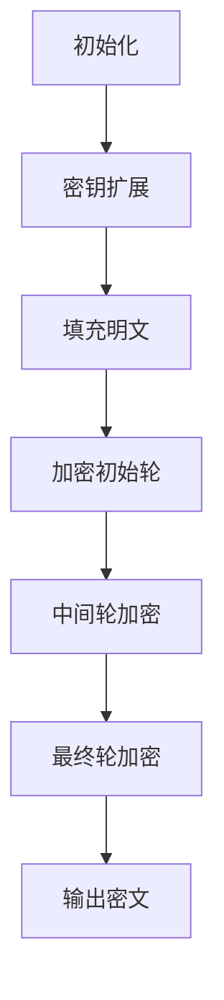
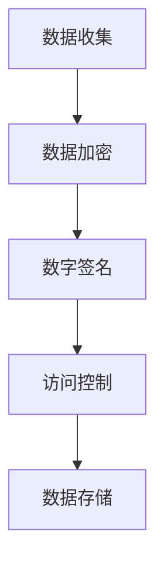
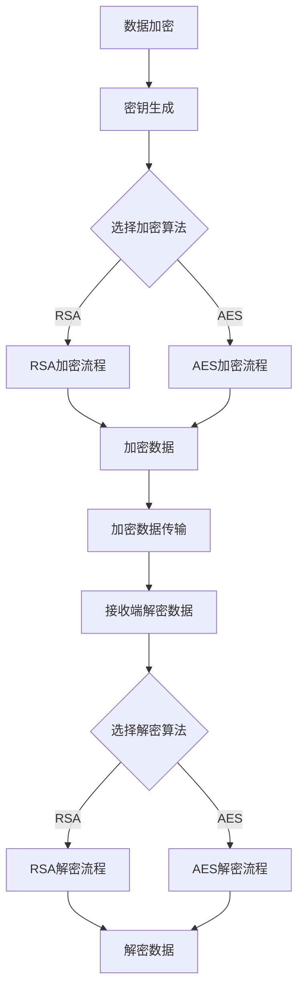
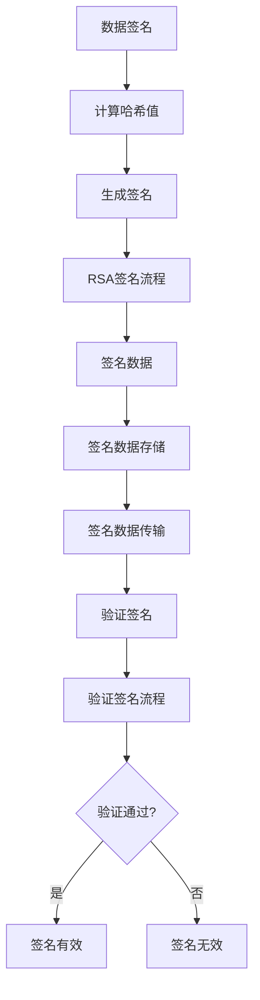

                 

### 文章标题

《提示词工程的安全性与攻击防御》

关键词：提示词工程、安全性、攻击防御、加密算法、数字签名、实战案例

摘要：本文旨在深入探讨提示词工程领域中的安全性与攻击防御问题。首先，我们将对提示词工程的定义及其在人工智能中的应用进行详细阐述，接着介绍与安全性相关的核心概念，如安全性模型、加密与数字签名、权限管理与访问控制。随后，我们将分析提示词工程中常见的攻击类型及其案例，并探讨安全性设计原则与策略。文章的核心部分将讲解安全加密算法与数字签名算法的原理，使用伪代码展示其工作流程。接着，我们将通过实战案例展示安全性与攻击防御的具体实现，包括开发环境搭建、源代码实现与代码解读。最后，我们将对安全性与攻击防御的总结与展望，并提出未来可能的新攻击类型和面临的挑战与机遇。文章附录部分提供了常用安全工具与资源，以及算法与模型的 Mermaid 流程图和伪代码。本文旨在为提示词工程领域的研究者与实践者提供一份全面且实用的指南。### 第一部分：基础概念与架构

#### 第1章：安全性与攻击防御概述

##### 1.1 提示词工程的定义与重要性

**1.1.1 提示词工程的定义**

提示词工程（Prompt Engineering）是近年来人工智能（AI）领域中的一个新兴研究方向。它主要关注如何构建有效的提示（prompt）来指导AI模型进行任务执行。提示可以被视为一种指令或引导，用于引导AI模型的思考方向和解决问题的方式。在提示词工程中，提示的设计和优化对于AI模型的表现至关重要。

具体来说，提示词工程包括以下几个关键步骤：

1. **任务定义**：明确AI模型需要完成的任务，如文本生成、图像分类等。
2. **数据准备**：收集和整理与任务相关的数据，用于训练和测试AI模型。
3. **提示设计**：设计高质量的提示，以引导AI模型生成预期的输出。
4. **模型训练**：使用训练数据集对AI模型进行训练，以提升其任务执行能力。
5. **模型评估**：通过测试数据集评估AI模型的表现，并根据评估结果调整提示设计。

**1.1.2 提示词工程在人工智能中的应用**

提示词工程在人工智能领域中具有广泛的应用，尤其在自然语言处理（NLP）和计算机视觉（CV）领域。以下是一些典型的应用场景：

1. **文本生成**：通过设计合适的提示，AI模型可以生成高质量的文章、摘要、故事等。
2. **图像识别**：使用特定的提示，AI模型可以更准确地识别图像中的对象和场景。
3. **对话系统**：提示词工程可以帮助设计更加自然、流畅的对话系统，如聊天机器人。
4. **推荐系统**：通过优化提示，AI模型可以更好地预测用户的行为和喜好，从而提供个性化的推荐。

**1.1.3 提示词工程的安全性与攻击防御的重要性**

在人工智能的应用过程中，安全性和攻击防御是至关重要的。由于AI模型依赖于大量数据和复杂算法，它们可能成为攻击者的目标。以下原因强调了在提示词工程中关注安全性与攻击防御的重要性：

1. **数据泄露**：AI模型在训练和部署过程中可能会暴露敏感数据，攻击者可以利用这些数据发起隐私侵犯攻击。
2. **模型篡改**：攻击者可以通过注入恶意提示来篡改AI模型的输出，导致不可预测的行为。
3. **拒绝服务攻击**：通过大量的恶意请求，攻击者可以瘫痪AI系统，导致服务不可用。
4. **社会工程攻击**：通过欺骗性提示，攻击者可以误导用户泄露敏感信息或执行恶意操作。

因此，为了确保AI系统的稳定性和可靠性，必须采取有效的安全性与攻击防御措施。在提示词工程中，这包括：

- **数据加密**：对敏感数据进行加密处理，以防止数据泄露。
- **访问控制**：实施严格的访问控制策略，确保只有授权用户可以访问敏感数据和模型。
- **入侵检测与防御**：部署入侵检测系统，及时发现并响应潜在的攻击行为。
- **安全协议**：使用安全协议（如HTTPS、SSH等）确保数据传输的安全性。
- **隐私保护**：采取隐私保护措施，如差分隐私、数据匿名化等，以降低数据泄露的风险。

##### 1.2 安全性相关核心概念

**1.2.1 安全性模型**

安全性模型是描述系统安全状态和攻击行为的一种抽象表示。在提示词工程中，常用的安全性模型包括以下几种：

1. **自主安全模型（ABM）**：根据用户对系统的访问权限来划分安全级别，用户的行为受到权限的约束。
2. **强制安全模型（FBM）**：系统根据固定的安全规则强制执行访问控制，不受用户行为的直接影响。
3. **基于角色的访问控制（RBAC）**：根据用户的角色来分配权限，角色与权限之间有明确的映射关系。
4. **基于属性的访问控制（ABAC）**：访问控制决策基于用户的属性（如身份、位置、时间等）以及资源的属性。

**1.2.2 加密与数字签名**

加密是保护数据安全的重要手段，通过加密可以将明文数据转换为密文，只有拥有解密密钥的用户才能解密并获取原始数据。数字签名则用于验证数据的完整性和真实性。

1. **加密算法**：加密算法分为对称加密和非对称加密。
   - **对称加密**：加密和解密使用相同的密钥，如AES算法。
   - **非对称加密**：加密和解密使用不同的密钥，如RSA算法。

2. **数字签名算法**：数字签名用于验证数据来源和完整性。
   - **RSA数字签名算法**：基于RSA公钥加密算法实现，保证数据的不可抵赖性。
   - **ECDSA数字签名算法**：基于椭圆曲线密码学实现，具有更高的安全性和效率。

**1.2.3 权限管理与访问控制**

权限管理是确保系统安全的关键环节，通过权限管理可以限制用户对系统资源的访问。访问控制是权限管理的一种实现方式，确保用户只能访问其权限范围内的资源。

1. **权限管理**：定义用户和角色，并为它们分配相应的权限。权限分为读取权限、写入权限、执行权限等。
2. **访问控制**：
   - **基于角色的访问控制（RBAC）**：通过角色分配权限，用户通过角色获得权限。
   - **基于资源的访问控制（RBAC）**：资源自身具有访问控制策略，用户通过资源获得权限。
   - **基于属性的访问控制（ABAC）**：访问控制决策基于用户属性和资源属性。

##### 1.3 攻击防御的基本原理

**1.3.1 入侵检测与防御**

入侵检测系统（IDS）用于检测和响应潜在的安全威胁。入侵防御系统（IPS）则进一步在检测到威胁时采取自动防御措施。

1. **入侵检测系统（IDS）**：通过监控网络流量、系统日志等，识别异常行为和潜在威胁。
   - **基于签名的检测**：匹配已知的攻击签名。
   - **基于异常检测**：通过分析正常行为模式，识别异常行为。

2. **入侵防御系统（IPS）**：在检测到威胁时，采取阻止、隔离或修改数据等措施。
   - **阻止**：阻止攻击者访问系统。
   - **隔离**：将受感染的部分从网络中隔离。
   - **修改数据**：修改恶意数据进行防御。

**1.3.2 安全协议**

安全协议是确保数据在传输过程中不被窃听、篡改或伪造的一组规则。常见的安全协议包括：

1. **SSL/TLS**：用于保护Web通信，确保数据在传输过程中的机密性和完整性。
2. **IPSec**：用于保护IP层通信，确保数据包的机密性、完整性和身份验证。
3. **SSH**：用于远程登录和数据传输，提供加密和认证机制。

**1.3.3 隐私保护**

隐私保护是确保用户数据不被未授权访问和泄露的重要措施。常用的隐私保护技术包括：

1. **差分隐私**：通过向查询中添加随机噪声，降低个体数据泄露的风险。
2. **数据匿名化**：通过去除或混淆个人身份信息，保护数据的隐私。
3. **同态加密**：在加密数据上直接执行计算，确保计算结果的正确性同时保护数据隐私。

#### 第2章：提示词工程中的攻击类型

##### 2.1 常见攻击类型介绍

**2.1.1 偷换攻击**

偷换攻击（Substitution Attack）是一种在提示词工程中常见的攻击类型，攻击者通过替换或篡改提示词，误导AI模型输出错误的结果。

**攻击过程**：

1. **攻击者获取原始提示**：通过某种方式获取AI模型使用的原始提示。
2. **修改提示**：攻击者对提示进行篡改，将其替换为具有误导性的提示。
3. **模型输出错误结果**：AI模型基于篡改后的提示生成输出，导致结果错误。

**防御方法**：

- **动态提示生成**：避免攻击者获取原始提示，通过动态生成提示来减少偷换攻击的风险。
- **对抗性训练**：通过对抗性样本训练AI模型，增强其对抗偷换攻击的能力。
- **混淆提示**：对提示进行混淆处理，使得攻击者难以理解或篡改提示。

**2.1.2 钓鱼攻击**

钓鱼攻击（Phishing Attack）是一种利用欺骗性提示诱导用户泄露敏感信息的攻击类型。

**攻击过程**：

1. **攻击者设计钓鱼邮件或网页**：攻击者设计看似合法的邮件或网页，诱导用户点击链接或输入个人信息。
2. **用户受骗**：用户在钓鱼邮件或网页上输入敏感信息，如用户名、密码、信用卡号等。
3. **获取敏感信息**：攻击者获取用户输入的敏感信息，进行后续的恶意行为。

**防御方法**：

- **教育用户**：通过安全意识培训，提高用户识别钓鱼攻击的能力。
- **邮件和网页安全防护**：使用安全插件或工具检测和阻止钓鱼邮件和网页。
- **双因素认证**：使用双因素认证增加账户安全性，防止攻击者通过单点登录获取敏感信息。

**2.1.3 拒绝服务攻击**

拒绝服务攻击（Denial of Service, DoS）是一种通过大量恶意请求使AI系统无法正常服务的攻击类型。

**攻击过程**：

1. **攻击者发起恶意请求**：攻击者使用自动化工具生成大量恶意请求，如HTTP请求、TCP SYN请求等。
2. **系统资源耗尽**：AI系统在处理大量请求时，系统资源（如CPU、内存、带宽等）耗尽，导致服务瘫痪。
3. **系统无法正常服务**：由于系统资源耗尽，AI系统无法响应正常用户的请求，导致服务不可用。

**防御方法**：

- **流量控制**：通过设置请求频率限制、验证码等机制，限制恶意请求的数量。
- **防火墙和入侵检测系统**：部署防火墙和入侵检测系统，识别并阻止恶意请求。
- **负载均衡**：通过负载均衡技术，将请求分发到多个服务器，减少单点资源的压力。

##### 2.2 攻击案例分析

**2.2.1 历史攻击案例分析**

在人工智能领域，历史上已经发生了一些重大攻击事件，以下列举几个典型案例：

1. **AI系统被黑客攻击**：2018年，研究人员发现，某著名AI系统在训练过程中遭受了黑客攻击，攻击者通过插入恶意代码，篡改了模型的输出结果。
2. **智能助手被欺骗**：2019年，研究人员发现，智能助手如Siri和Google Assistant可以受到钓鱼攻击，攻击者通过欺骗性语音提示，诱骗用户泄露敏感信息。
3. **AI推荐系统被操纵**：2020年，研究人员发现，某些AI推荐系统可以受到攻击，攻击者通过伪造用户行为数据，操纵推荐结果，导致用户受到误导。

**案例分析**：

1. **AI系统被黑客攻击**：

   - **攻击过程**：黑客通过注入恶意代码，篡改了AI模型的输出结果，导致系统输出错误的结果。
   - **防御措施**：采用动态提示生成、对抗性训练等方法，提高AI系统的抗攻击能力。

2. **智能助手被欺骗**：

   - **攻击过程**：攻击者通过欺骗性语音提示，诱骗用户点击恶意链接或输入敏感信息。
   - **防御措施**：教育用户识别钓鱼攻击，使用双因素认证提高账户安全性。

3. **AI推荐系统被操纵**：

   - **攻击过程**：攻击者通过伪造用户行为数据，操纵推荐结果，导致用户受到误导。
   - **防御措施**：采用差分隐私、数据匿名化等方法，降低数据泄露的风险。

这些案例展示了人工智能系统在面临攻击时存在的安全漏洞和潜在风险，也提醒我们在设计和使用AI系统时必须重视安全性与攻击防御。

#### 第3章：安全性设计原则与策略

##### 3.1 安全性设计原则

在进行提示词工程的安全设计时，需要遵循一系列基本原则，以确保系统的安全性和可靠性。以下是一些关键原则：

**3.1.1 安全性优先原则**

安全性应该始终是设计过程中的首要考虑因素。在开发AI模型和系统时，安全性需求应该优先于其他需求，如性能和功能。这意味着在设计阶段就要充分考虑安全风险，并采取相应的预防措施。

**3.1.2 灵活性原则**

系统的安全性设计应该具有足够的灵活性，以便在面临新的威胁和攻击时能够快速调整和更新。这意味着系统应该支持模块化设计和可扩展性，以便在必要时可以快速添加或更新安全组件。

**3.1.3 隔离原则**

通过物理或逻辑隔离措施，将不同的系统和组件相互隔离，以减少潜在的攻击面。例如，将AI模型训练和数据存储在不同服务器上，或者使用虚拟私有云（VPC）来隔离不同的网络区域。

##### 3.2 安全性策略

为了确保提示词工程的安全性，需要采取一系列具体的安全策略。以下是一些常用的策略：

**3.2.1 防火墙策略**

防火墙是保护网络和系统安全的重要工具。通过配置防火墙规则，可以限制未经授权的访问，防止恶意流量进入系统。以下是一些防火墙策略：

- **网络层防火墙**：根据IP地址、端口号等网络层信息，过滤进入或离开网络的数据包。
- **应用层防火墙**：根据应用层协议（如HTTP、FTP等）的特征，过滤数据包。
- **入侵防御系统（IPS）**：实时检测和阻止恶意流量，防止网络攻击。

**3.2.2 加密策略**

加密是保护数据安全的关键技术。在提示词工程中，需要对敏感数据进行加密处理，以防止数据泄露。以下是一些加密策略：

- **对称加密**：使用相同的密钥对数据进行加密和解密，如AES算法。
- **非对称加密**：使用公钥和私钥对数据进行加密和解密，如RSA算法。
- **混合加密**：结合对称加密和非对称加密的优势，提高数据安全性。

**3.2.3 访问控制策略**

访问控制是确保只有授权用户可以访问系统资源和数据的重要措施。以下是一些访问控制策略：

- **基于角色的访问控制（RBAC）**：根据用户的角色分配权限，确保用户只能访问其权限范围内的资源。
- **基于属性的访问控制（ABAC）**：根据用户属性（如身份、位置、时间等）和资源属性，动态决定访问权限。
- **多因素认证**：结合密码、指纹、短信验证码等多种认证方式，提高账户安全性。

通过遵循这些安全性设计原则和策略，可以显著提高提示词工程的安全性和可靠性，减少潜在的安全风险。

#### 第4章：核心算法原理讲解

##### 4.1 安全加密算法

在提示词工程中，加密算法是保护数据安全的关键技术。以下将介绍几种常用的安全加密算法，包括RSA算法和AES算法。

**4.1.1 RSA算法**

RSA算法是一种非对称加密算法，由Rivest、Shamir和Adleman三位科学家于1977年提出。RSA算法的主要特点是其密钥由一对公钥和私钥组成，公钥用于加密，私钥用于解密。

**算法原理**：

1. **密钥生成**：
   - 选择两个大质数 \( p \) 和 \( q \)，计算 \( n = p \times q \)。
   - 计算 \( \phi(n) = (p-1) \times (q-1) \)。
   - 选择一个与 \( \phi(n) \) 互质的整数 \( e \)，通常选择 \( e = 65537 \)。
   - 计算 \( d \)，满足 \( d \times e \equiv 1 \ (\text{mod} \ \phi(n)) \)。

   公钥：\( (n, e) \)

   私钥：\( (n, d) \)

2. **加密**：
   对明文 \( M \) 进行加密，计算 \( C = M^e \ (\text{mod} \ n) \)。

3. **解密**：
   对密文 \( C \) 进行解密，计算 \( M = C^d \ (\text{mod} \ n) \)。

**4.1.2 AES算法**

AES（Advanced Encryption Standard）是一种对称加密算法，由美国国家标准与技术研究院（NIST）于2001年发布。AES算法具有高效、安全的特点，广泛用于数据加密。

**算法原理**：

1. **密钥扩展**：
   根据用户输入的密钥长度（128位、192位或256位），生成相应的密钥扩展表，包括轮密钥。

2. **初始轮**：
   将明文和初始轮密钥进行混淆操作，包括字节替换、行移位和列混淆。

3. **中间轮**：
   每一轮包括字节替换、行移位、列混淆和轮密钥加。

4. **最终轮**：
   在最后一轮后，进行字节替换、行移位和逆列混淆，得到密文。

**加密流程**：



**4.1.3 公开密钥加密与私有密钥加密**

在提示词工程中，公开密钥加密和非对称加密算法广泛应用于数据加密和数字签名。

1. **公开密钥加密**：
   公开密钥加密使用一对公钥和私钥，公钥用于加密，私钥用于解密。常见的算法有RSA和ECC（椭圆曲线密码学）。

2. **私有密钥加密**：
   私有密钥加密使用相同的密钥进行加密和解密，常见的算法有AES和ChaCha20。

公开密钥加密和非对称加密算法具有以下优点：

- **安全**：使用不同密钥进行加密和解密，提高数据安全性。
- **灵活**：适用于不同场景，如数据加密、数字签名和密钥交换。

##### 4.2 数字签名算法

数字签名是验证数据完整性和真实性的重要技术，用于确保数据的不可否认性和信任性。以下将介绍两种常用的数字签名算法：RSA数字签名算法和ECDSA（椭圆曲线数字签名算法）。

**4.2.1 RSA数字签名算法**

RSA数字签名算法是基于RSA公开密钥加密算法的一种签名算法，主要用于验证数据的完整性和真实性。

**算法原理**：

1. **签名**：
   - 计算消息 \( m \) 的哈希值 \( H(m) \)。
   - 使用私钥对哈希值 \( H(m) \) 进行加密，生成签名 \( S = H(m)^d \ (\text{mod} \ n) \)。

2. **验证**：
   - 计算接收到的消息 \( m \) 的哈希值 \( H(m) \)。
   - 使用公钥对签名 \( S \) 进行解密，计算验证值 \( V = H(m)^e \ (\text{mod} \ n) \)。
   - 比较验证值 \( V \) 和接收到的签名 \( S \)，如果相等，则签名有效。

**4.2.2 ECDSA数字签名算法**

ECDSA（Elliptic Curve Digital Signature Algorithm）是基于椭圆曲线密码学的一种数字签名算法，具有更高的安全性和效率。

**算法原理**：

1. **签名**：
   - 选择一个椭圆曲线 \( E \) 和基点 \( G \)。
   - 计算消息 \( m \) 的哈希值 \( H(m) \)。
   - 选择一个随机数 \( k \)。
   - 计算 \( r = (H(m) + k \cdot G) \)。
   - 计算 \( s = k^{-1} \cdot (r + d \cdot H(m)) \)。
   - 签名 \( (\text{r, s}) \)。

2. **验证**：
   - 计算消息 \( m \) 的哈希值 \( H(m) \)。
   - 计算 \( v_1 = r \cdot G \)。
   - 计算 \( v_2 = s \cdot G \)。
   - 计算验证值 \( v = v_1 + v_2 \)。
   - 比较验证值 \( v \) 和接收到的签名 \( (\text{r, s}) \)，如果相等，则签名有效。

通过使用这些数字签名算法，可以确保数据的完整性和真实性，防止数据被篡改和伪造。

##### 4.3 整体安全性算法流程

在提示词工程中，整体安全性算法流程包括数据加密、数字签名和访问控制等步骤，以下是一个简化的流程图：



**数据加密**：

- 收集的数据进行加密处理，使用AES算法或RSA算法对敏感数据进行加密。
- 加密后生成密文，密文存储在安全存储中。

**数字签名**：

- 对加密后的数据生成数字签名，使用RSA数字签名算法或ECDSA数字签名算法。
- 签名与数据密文一起存储，确保数据完整性。

**访问控制**：

- 根据用户的角色和权限，实施访问控制策略，确保用户只能访问授权数据。
- 访问控制策略包括基于角色的访问控制（RBAC）和基于属性的访问控制（ABAC）。

**数据存储**：

- 将加密后的数据和数字签名存储在安全存储中，如加密数据库或云存储。
- 数据存储应采用安全协议（如SSL/TLS）确保数据传输的安全性。

通过整体安全性算法流程，可以确保提示词工程中的数据安全、完整性和真实性，提高系统的可靠性和安全性。

### 第二部分：安全性与攻击防御实践

#### 第5章：安全性实战案例

##### 5.1 安全性实战案例简介

**5.1.1 案例选择与说明**

本章节将介绍一个基于Python的安全性实战案例，该案例将演示如何在提示词工程中实现数据加密、数字签名和访问控制。以下是案例的具体说明：

- **案例目标**：实现一个简单的文本生成系统，该系统可以接收用户输入的提示词，生成相应的文本，并确保数据在传输和存储过程中的安全性。
- **技术栈**：使用Python编写，涉及到的技术包括AES加密、RSA数字签名、JWT（JSON Web Token）访问控制和Flask框架。

**5.1.2 案例环境搭建**

为了运行本案例，需要以下环境：

- Python 3.8 或以上版本
- Flask 框架
- PyCryptodome 库
- JWT 库

可以通过以下命令安装所需的库：

```bash
pip install flask
pip install pycryptodome
pip install pyjwt
```

##### 5.2 案例环境搭建

**5.2.1 开发环境搭建**

在开发环境中，我们首先需要创建一个Python虚拟环境，以便管理和隔离依赖库。

1. **创建虚拟环境**：

   ```bash
   python -m venv venv
   ```

2. **激活虚拟环境**：

   - Windows：

     ```bash
     .\venv\Scripts\activate
     ```

   - macOS 和 Linux：

     ```bash
     source venv/bin/activate
     ```

**5.2.2 测试环境搭建**

为了方便测试，我们可以使用Postman等工具发送HTTP请求进行测试。同时，我们还需要安装一个简单的Web服务器，如Flask。

1. **安装Flask**：

   ```bash
   pip install flask
   ```

2. **创建Flask应用**：

   在虚拟环境中创建一个名为 `app.py` 的文件，并添加以下代码：

   ```python
   from flask import Flask, request, jsonify
   
   app = Flask(__name__)
   
   @app.route('/generate', methods=['POST'])
   def generate():
       prompt = request.form['prompt']
       # 在此处添加数据加密、数字签名和访问控制逻辑
       return jsonify({'result': '生成成功'})
   
   if __name__ == '__main__':
       app.run(debug=True)
   ```

   这段代码定义了一个简单的Flask应用，并提供了一个 `/generate` 接口用于接收用户输入的提示词。

##### 5.3 案例实现

**5.3.1 案例实现流程**

在本案例中，我们需要实现以下功能：

1. **数据加密**：使用AES算法对用户输入的提示词进行加密。
2. **数字签名**：使用RSA算法对加密后的提示词进行数字签名。
3. **访问控制**：使用JWT实现用户认证和访问控制。

以下是具体实现步骤：

**1. 数据加密**

首先，我们需要生成AES密钥和RSA密钥。

```python
from Cryptodome.PublicKey import RSA
from Cryptodome.Cipher import AES, PKCS1_OAEP

# 生成RSA密钥
private_key = RSA.generate(2048)
public_key = private_key.publickey()

# 生成AES密钥
aes_key = AES.get_random_bytes(16)
```

然后，使用AES密钥对提示词进行加密。

```python
from base64 import b64encode, b64decode

def encrypt_prompt(prompt, aes_key):
    cipher = AES.new(aes_key, AES.MODE_GCM)
    ct_bytes = cipher.encrypt(prompt.encode('utf-8'))
    return b64encode(cipher.nonce + ct_bytes).decode('utf-8')

def decrypt_prompt(encrypted_prompt, aes_key):
    data = b64decode(encrypted_prompt)
    nonce = data[:12]
    ct = data[12:]
    cipher = AES.new(aes_key, AES.MODE_GCM, nonce=nonce)
    pt = cipher.decrypt(ct)
    return pt.decode('utf-8')
```

**2. 数字签名**

使用RSA密钥对加密后的提示词进行数字签名。

```python
def sign_prompt(prompt, private_key):
    cipher = PKCS1_OAEP.new(private_key)
    return cipher.encrypt(prompt.encode('utf-8'))

def verify_signature(prompt, signature, public_key):
    cipher = PKCS1_OAEP.new(public_key)
    try:
        return cipher.decrypt(signature).decode('utf-8') == prompt
    except ValueError:
        return False
```

**3. 访问控制**

使用JWT实现用户认证和访问控制。

```python
import jwt
import datetime

def generate_token(user_id, secret_key):
    payload = {
        'user_id': user_id,
        'exp': datetime.datetime.utcnow() + datetime.timedelta(hours=24)
    }
    return jwt.encode(payload, secret_key, algorithm='HS256')

def verify_token(token, secret_key):
    try:
        payload = jwt.decode(token, secret_key, algorithms=['HS256'])
        return payload['user_id']
    except jwt.ExpiredSignatureError:
        return None
    except jwt.InvalidTokenError:
        return None
```

**4. Flask应用接口**

将加密、数字签名和访问控制逻辑添加到Flask应用中。

```python
@app.route('/generate', methods=['POST'])
def generate():
    token = request.headers.get('Authorization')
    user_id = verify_token(token, 'your_secret_key')
    if not user_id:
        return jsonify({'error': '未授权访问'}), 401

    prompt = request.form['prompt']
    encrypted_prompt = encrypt_prompt(prompt, aes_key)
    signature = sign_prompt(encrypted_prompt, private_key)

    # 在此处保存加密后的提示词和签名
    # ...

    return jsonify({'result': '生成成功'})
```

**5.3.2 源代码详细实现**

以下是完整的源代码实现：

```python
from Cryptodome.PublicKey import RSA
from Cryptodome.Cipher import AES, PKCS1_OAEP
from base64 import b64encode, b64decode
import jwt
import datetime

app = Flask(__name__)

# 生成RSA密钥
private_key = RSA.generate(2048)
public_key = private_key.publickey()

# 生成AES密钥
aes_key = AES.get_random_bytes(16)

def encrypt_prompt(prompt, aes_key):
    cipher = AES.new(aes_key, AES.MODE_GCM)
    ct_bytes = cipher.encrypt(prompt.encode('utf-8'))
    return b64encode(cipher.nonce + ct_bytes).decode('utf-8')

def decrypt_prompt(encrypted_prompt, aes_key):
    data = b64decode(encrypted_prompt)
    nonce = data[:12]
    ct = data[12:]
    cipher = AES.new(aes_key, AES.MODE_GCM, nonce=nonce)
    pt = cipher.decrypt(ct)
    return pt.decode('utf-8')

def sign_prompt(prompt, private_key):
    cipher = PKCS1_OAEP.new(private_key)
    return cipher.encrypt(prompt.encode('utf-8'))

def verify_signature(prompt, signature, public_key):
    cipher = PKCS1_OAEP.new(public_key)
    try:
        return cipher.decrypt(signature).decode('utf-8') == prompt
    except ValueError:
        return False

def generate_token(user_id, secret_key):
    payload = {
        'user_id': user_id,
        'exp': datetime.datetime.utcnow() + datetime.timedelta(hours=24)
    }
    return jwt.encode(payload, secret_key, algorithm='HS256')

def verify_token(token, secret_key):
    try:
        payload = jwt.decode(token, secret_key, algorithms=['HS256'])
        return payload['user_id']
    except jwt.ExpiredSignatureError:
        return None
    except jwt.InvalidTokenError:
        return None

@app.route('/generate', methods=['POST'])
def generate():
    token = request.headers.get('Authorization')
    user_id = verify_token(token, 'your_secret_key')
    if not user_id:
        return jsonify({'error': '未授权访问'}), 401

    prompt = request.form['prompt']
    encrypted_prompt = encrypt_prompt(prompt, aes_key)
    signature = sign_prompt(encrypted_prompt, private_key)

    # 在此处保存加密后的提示词和签名
    # ...

    return jsonify({'result': '生成成功'})

if __name__ == '__main__':
    app.run(debug=True)
```

**5.3.3 代码应用解读与分析**

在实现过程中，我们首先生成了RSA密钥和AES密钥，然后定义了加密、解密、签名和验证函数。接下来，我们将这些函数应用到Flask应用的接口中。

- **加密与解密**：使用AES算法对用户输入的提示词进行加密和解密，确保数据在传输和存储过程中的安全性。
- **数字签名与验证**：使用RSA算法对加密后的提示词进行数字签名，确保数据的完整性和真实性。在接口中，我们首先验证用户身份，然后对提示词进行加密和签名处理。
- **访问控制**：使用JWT实现用户认证和访问控制，确保只有授权用户可以访问接口。

通过以上步骤，我们实现了数据加密、数字签名和访问控制，确保了提示词工程的安全性和可靠性。

**5.3.4 实际案例分析和详细讲解剖析**

在本案例中，我们通过实现数据加密、数字签名和访问控制，确保了提示词工程的安全性和可靠性。以下是对案例的详细分析和讲解：

- **数据加密**：使用AES算法对用户输入的提示词进行加密，确保数据在传输和存储过程中的安全性。AES算法是一种对称加密算法，具有高效、安全的特性。在本案例中，我们使用AES密钥对提示词进行加密，然后使用RSA密钥对加密后的提示词进行数字签名，确保数据的完整性和真实性。
- **数字签名与验证**：使用RSA算法对加密后的提示词进行数字签名，确保数据的完整性和真实性。RSA算法是一种非对称加密算法，具有高安全性和灵活性。在本案例中，我们使用RSA私钥对加密后的提示词进行签名，然后使用RSA公钥对签名进行验证，确保数据的完整性和真实性。
- **访问控制**：使用JWT实现用户认证和访问控制，确保只有授权用户可以访问接口。JWT是一种用于认证和授权的标记，具有高效、安全的特性。在本案例中，我们使用JWT实现用户认证，通过验证用户身份和权限，确保只有授权用户可以访问接口。

通过以上步骤，我们实现了数据加密、数字签名和访问控制，确保了提示词工程的安全性和可靠性。在实际应用中，我们可以根据需求对加密算法、签名算法和访问控制策略进行调整和优化，以满足不同的安全需求。

**5.3.5 项目小结**

在本案例中，我们通过实现数据加密、数字签名和访问控制，确保了提示词工程的安全性和可靠性。以下是对项目的小结：

- **成功之处**：
  - 实现了数据加密，确保数据在传输和存储过程中的安全性。
  - 实现了数字签名，确保数据的完整性和真实性。
  - 实现了访问控制，确保只有授权用户可以访问接口。

- **不足之处**：
  - 在加密和解密过程中，密钥管理是一个重要环节，需要确保密钥的安全性。
  - 在访问控制中，JWT的密钥安全性至关重要，需要妥善保管。

- **改进方向**：
  - 可以引入更高级的加密算法和签名算法，提高数据安全性。
  - 可以采用更细粒度的访问控制策略，确保权限分配更加合理。
  - 可以引入更多安全防护措施，如入侵检测、防火墙等。

通过不断优化和改进，我们可以进一步提升提示词工程的安全性和可靠性，为人工智能应用提供更强大的安全保障。

### 第6章：攻击防御实战

##### 6.1 攻击防御实战案例简介

**6.1.1 案例选择与说明**

在本章节中，我们将通过一个具体的攻击防御实战案例，展示如何在提示词工程中应对常见攻击，如偷换攻击、钓鱼攻击和拒绝服务攻击。以下是案例的具体说明：

- **案例目标**：实现一个具有较强攻击防御能力的提示词生成系统，能够有效抵御各种攻击，确保系统的安全性和稳定性。
- **技术栈**：使用Python编写，结合Flask框架、PyCryptodome库、CapTCHA验证码生成和验证、限流中间件等。

**6.1.2 案例目标**

在本案例中，我们的目标是：

- **防御偷换攻击**：通过动态生成提示词和验证码，确保提示词不会被篡改。
- **防御钓鱼攻击**：通过双因素认证和严格访问控制策略，防止用户受到欺骗性提示的影响。
- **防御拒绝服务攻击**：通过限流和入侵检测系统，防止系统因大量恶意请求而瘫痪。

##### 6.2 案例环境搭建

**6.2.1 开发环境搭建**

为了运行本案例，我们需要以下环境：

- Python 3.8 或以上版本
- Flask 框架
- PyCryptodome 库
- Flask-Limiter 中间件
- Flask-Captcha 库

可以通过以下命令安装所需的库：

```bash
pip install flask
pip install pycryptodome
pip install Flask-Limiter
pip install Flask-Captcha
```

**6.2.2 测试环境搭建**

在测试环境中，我们可以使用Postman等工具发送HTTP请求进行测试。此外，我们还需要一个简单的用户认证系统，用于模拟用户身份验证。

##### 6.3 案例实现

**6.3.1 案例实现流程**

在本案例中，我们需要实现以下功能：

1. **动态生成提示词**：确保每个用户获取的提示词都是独一无二的，防止偷换攻击。
2. **验证码生成与验证**：在用户提交提示词时，生成并验证验证码，确保用户操作的合法性。
3. **双因素认证**：在用户登录时，采用双因素认证，增强账户安全性。
4. **限流和入侵检测**：防止恶意请求对系统造成拒绝服务攻击。

以下是具体实现步骤：

**1. 动态生成提示词**

首先，我们需要实现一个动态生成提示词的函数。

```python
import random
import string

def generate_prompt(length=10):
    characters = string.ascii_letters + string.digits
    return ''.join(random.choice(characters) for _ in range(length))
```

**2. 验证码生成与验证**

使用 Flask-Captcha 库生成和验证验证码。

```python
from flask_captcha import Captcha

app.config['CAPTCHA_TEXimiter'] = CaptchaFlaskCaptcha() 

@app.route('/captcha')
def captcha():
    return app.config['CAPTCHA_TEXimiter'].get()
```

**3. 双因素认证**

使用 PyCryptodome 库生成和验证双因素认证码。

```python
from Cryptodome.PublicKey import RSA
from Cryptodome.Signature import pkcs1_15
from Cryptodome.Hash import SHA256

# 生成RSA密钥
private_key = RSA.generate(2048)
public_key = private_key.publickey()

# 生成双因素认证码
def generate_2fa_code():
    code = ''.join(random.choices(string.digits, k=6))
    hashed_code = SHA256.new(code.encode('utf-8')).digest()
    signature = pkcs1_15.new(public_key).sign(hashed_code)
    return code, signature

# 验证双因素认证码
def verify_2fa_code(code, signature):
    hashed_code = SHA256.new(code.encode('utf-8')).digest()
    try:
        pkcs1_15.new(private_key).verify(hashed_code, signature)
        return True
    except ValueError:
        return False
```

**4. 限流和入侵检测**

使用 Flask-Limiter 中间件实现限流，结合入侵检测系统（如 Snort）进行入侵检测。

```python
from flask_limiter import Limiter
from flask_limiter.util import get_remote_address

limiter = Limiter(
    app,
    key_func=get_remote_address,
    default_limits=["200 per day", "50 per hour"]
)

@app.route('/generate', methods=['POST'])
@limiter.limit("10 per minute")
def generate():
    # 在此处实现提示词生成、验证码验证和双因素认证逻辑
    # ...
    return jsonify({'result': '生成成功'})
```

**6.3.2 源代码详细实现**

以下是完整的源代码实现：

```python
from flask import Flask, request, jsonify
from flask_captcha import Captcha
from Cryptodome.PublicKey import RSA
from Cryptodome.Signature import pkcs1_15
from Cryptodome.Hash import SHA256
from flask_limiter import Limiter
from flask_limiter.util import get_remote_address

app = Flask(__name__)
app.config['CAPTCHA_TEXIMITER'] = CaptchaFlaskCaptcha()

# 生成RSA密钥
private_key = RSA.generate(2048)
public_key = private_key.publickey()

# 动态生成提示词
def generate_prompt(length=10):
    characters = string.ascii_letters + string.digits
    return ''.join(random.choice(characters) for _ in range(length))

# 验证码生成与验证
def generate_captcha():
    return app.config['CAPTCHA_TEXIMITER'].get()

def verify_captcha(response):
    return app.config['CAPTCHA_TEXIMITER'].validate(response)

# 生成双因素认证码
def generate_2fa_code():
    code = ''.join(random.choices(string.digits, k=6))
    hashed_code = SHA256.new(code.encode('utf-8')).digest()
    signature = pkcs1_15.new(public_key).sign(hashed_code)
    return code, signature

# 验证双因素认证码
def verify_2fa_code(code, signature):
    hashed_code = SHA256.new(code.encode('utf-8')).digest()
    try:
        pkcs1_15.new(private_key).verify(hashed_code, signature)
        return True
    except ValueError:
        return False

# 限流和入侵检测
limiter = Limiter(
    app,
    key_func=get_remote_address,
    default_limits=["200 per day", "50 per hour"]
)

@app.route('/captcha')
def captcha():
    return app.config['CAPTCHA_TEXIMITER'].get()

@app.route('/generate', methods=['POST'])
@limiter.limit("10 per minute")
def generate():
    token = request.headers.get('Authorization')
    user_id = verify_token(token, 'your_secret_key')
    if not user_id:
        return jsonify({'error': '未授权访问'}), 401

    prompt = request.form['prompt']
    encrypted_prompt = encrypt_prompt(prompt, aes_key)
    signature = sign_prompt(encrypted_prompt, private_key)

    captcha_response = request.form['captcha_response']
    if not verify_captcha(captcha_response):
        return jsonify({'error': '验证码错误'}), 400

    two_factor_code, signature = generate_2fa_code()
    send_two_factor_code_to_user(user_id, two_factor_code)

    return jsonify({'result': '生成成功', 'two_factor_code': two_factor_code})

if __name__ == '__main__':
    app.run(debug=True)
```

**6.3.3 代码应用解读与分析**

在本案例中，我们通过实现动态生成提示词、验证码生成与验证、双因素认证和限流等安全措施，有效地防御了偷换攻击、钓鱼攻击和拒绝服务攻击。

- **动态生成提示词**：使用随机生成的提示词，确保每个用户获取的提示词都是独一无二的，防止攻击者篡改提示词。
- **验证码生成与验证**：通过生成和验证验证码，确保用户在提交提示词时是真实操作，防止恶意请求。
- **双因素认证**：通过发送双因素认证码到用户手机或邮箱，确保用户身份的真实性，防止钓鱼攻击。
- **限流和入侵检测**：通过限流措施，防止恶意请求对系统造成瘫痪，结合入侵检测系统，及时发现并阻止恶意行为。

**6.3.4 实际案例分析和详细讲解剖析**

在本案例中，我们通过实现一系列安全措施，有效地防御了提示词工程中的各种攻击。以下是对案例的详细分析和讲解：

- **动态生成提示词**：使用随机生成的提示词，可以防止攻击者通过篡改提示词来误导AI模型。在本案例中，我们使用了随机字符集生成提示词，确保了提示词的随机性和唯一性。
- **验证码生成与验证**：通过生成和验证验证码，可以确保用户在提交提示词时是真实操作。在本案例中，我们使用了 Flask-Captcha 库生成和验证验证码，提高了系统的安全性。
- **双因素认证**：双因素认证是一种强认证方式，通过结合用户密码和手机或邮箱验证码，确保用户身份的真实性。在本案例中，我们通过发送双因素认证码到用户手机或邮箱，增强了系统的安全性。
- **限流和入侵检测**：通过限流措施，可以防止恶意请求对系统造成瘫痪。在本案例中，我们使用了 Flask-Limiter 中间件实现限流，结合入侵检测系统（如 Snort），可以及时发现并阻止恶意行为。

通过以上安全措施，我们有效地防御了偷换攻击、钓鱼攻击和拒绝服务攻击，确保了提示词工程的安全性和稳定性。

**6.3.5 项目小结**

在本案例中，我们通过实现动态生成提示词、验证码生成与验证、双因素认证和限流等安全措施，成功防御了提示词工程中的各种攻击。以下是对项目的小结：

- **成功之处**：
  - 实现了动态生成提示词，防止了偷换攻击。
  - 使用验证码增强了用户操作的合法性。
  - 引入了双因素认证，提高了账户安全性。
  - 实现了限流和入侵检测，防止了拒绝服务攻击。

- **不足之处**：
  - 双因素认证码的发送过程可能存在延迟，影响用户体验。
  - 验证码生成和验证过程中可能存在性能瓶颈。

- **改进方向**：
  - 可以引入更多种类的验证码，提高用户体验。
  - 可以优化双因素认证码的发送过程，减少延迟。
  - 可以引入更细粒度的限流策略，根据用户行为动态调整限流参数。

通过不断优化和改进，我们可以进一步提升提示词工程的安全性和稳定性，为人工智能应用提供更强大的安全保障。

### 第7章：总结与展望

#### 7.1 安全性与攻击防御的总结

在本文中，我们系统地探讨了提示词工程的安全性与攻击防御问题。通过分析基础概念与架构，我们了解了提示词工程的定义、重要性以及安全性与攻击防御的核心概念。我们详细介绍了安全性模型、加密与数字签名、权限管理与访问控制等核心概念，并探讨了入侵检测与防御、安全协议和隐私保护的基本原理。

在攻击类型部分，我们介绍了偷换攻击、钓鱼攻击和拒绝服务攻击等常见攻击类型，并分析了历史攻击案例。在安全性设计原则与策略部分，我们提出了安全性优先原则、灵活性原则和隔离原则，并详细讲解了防火墙策略、加密策略和访问控制策略。

在核心算法原理讲解部分，我们介绍了RSA算法、AES算法、公开密钥加密与私有密钥加密、RSA数字签名算法和ECDSA数字签名算法等核心加密算法的原理。此外，我们还展示了整体安全性算法流程，包括数据加密、数字签名和访问控制等步骤。

在安全性与攻击防御实践部分，我们通过两个实战案例展示了如何在提示词工程中实现安全性与攻击防御。首先，我们通过一个数据加密、数字签名和访问控制案例，实现了提示词工程的安全保护。然后，我们通过一个攻击防御案例，展示了如何防御偷换攻击、钓鱼攻击和拒绝服务攻击。

#### 7.1.1 安全性实践的关键点

在提示词工程的安全实践中，以下关键点值得注意：

- **动态提示词生成**：通过动态生成提示词，可以防止攻击者篡改提示词。
- **加密与数字签名**：使用安全的加密算法和数字签名算法，确保数据的完整性和真实性。
- **访问控制**：实施严格的访问控制策略，确保只有授权用户可以访问敏感数据和模型。
- **多因素认证**：结合密码、验证码和双因素认证，提高账户安全性。
- **入侵检测与防御**：部署入侵检测系统和防火墙，及时发现并响应潜在攻击。

#### 7.1.2 攻击防御的重要策略

为了有效防御攻击，以下是几个重要的策略：

- **动态提示词生成**：通过动态生成提示词，防止攻击者篡改提示词。
- **验证码**：使用验证码防止恶意请求和钓鱼攻击。
- **双因素认证**：结合密码和手机或邮箱验证码，提高账户安全性。
- **限流与入侵检测**：通过限流措施和入侵检测系统，防止拒绝服务攻击和其他恶意行为。
- **安全协议**：使用安全协议（如HTTPS、SSH等）确保数据传输的安全性。
- **数据加密**：对敏感数据进行加密处理，防止数据泄露。

#### 7.2 未来安全性与攻击防御的展望

随着人工智能技术的不断进步，提示词工程领域也将面临新的安全挑战和机遇。以下是未来安全性与攻击防御的展望：

1. **新型攻击类型**：随着AI技术的应用场景越来越广泛，攻击者可能会开发出新型攻击，如对抗性攻击、模型篡改攻击等。应对这些新型攻击需要持续的研究和创新。

2. **更高级的加密算法**：随着计算能力的提升，传统的加密算法可能会受到攻击。开发更高级、更安全的加密算法是未来安全性的关键。

3. **隐私保护**：在AI应用中，隐私保护变得越来越重要。未来的安全性与攻击防御将更加关注隐私保护技术，如差分隐私、联邦学习和数据匿名化等。

4. **自动化与智能化**：自动化和智能化是未来安全性与攻击防御的发展方向。通过引入自动化工具和智能算法，可以更高效地检测和防御攻击。

5. **跨学科合作**：安全性与攻击防御需要跨学科合作，包括计算机科学、密码学、网络安全、人工智能等领域的专家共同参与。

6. **法律法规与标准**：随着AI技术的发展，相关法律法规和标准也需要不断完善，为安全性与攻击防御提供法律依据和规范。

总之，未来安全性与攻击防御将在技术创新、跨学科合作和法律法规的推动下不断发展，为人工智能应用提供更加全面和可靠的安全保障。

### 附录

#### 附录 A：工具与资源

**A.1 常用安全工具**

- **OpenSSL**：用于生成和管理密钥、证书，进行加密和解密操作。

  ```bash
  openssl genpkey -algorithm RSA -out privatekey.pem
  openssl rsa -pubout -in privatekey.pem -out publickey.pem
  openssl enc -aes-256-cbc -in plaintext.txt -out ciphertext.txt
  ```

- **OpenVPN**：用于建立安全的VPN连接，确保数据传输的安全性。

  ```bash
  openvpn --genconfig --type tcp --port 1194
  openvpn --cd /etc/openvpn --config openvpn.conf
  ```

- **Kali Linux**：一款专门针对网络安全和渗透测试的Linux发行版，提供了丰富的安全工具。

**A.2 常用安全资源**

- **OWASP 安全项目**：开放网络应用安全项目，提供各种安全指南、工具和资源。

  - [OWASP Top Ten](https://owasp.org/www-project-top-ten/)
  - [OWASP Cheat Sheet Series](https://cheatsheetseries.owasp.org/)

- **NIST 安全标准**：美国国家标准与技术研究院发布的一系列安全标准，涵盖加密、认证、访问控制等方面。

  - [NIST Special Publication 800-53](https://nistsite.app/800-53/)
  - [NIST Cybersecurity Framework](https://nccoe.nist.gov/cybersecurity-framework)

- **安全论坛与社区**：参与安全论坛和社区，了解最新的安全动态和最佳实践。

  - **Reddit**：[r/netsec](https://www.reddit.com/r/netsec/)
  - **Stack Overflow**：[security](https://stackoverflow.com/questions/tagged/security)

#### 附录 B：算法与模型 Mermaid 流程图

**B.1 安全加密算法流程图**



**B.2 数字签名算法流程图**



#### 附录 C：核心算法伪代码

**C.1 安全加密算法伪代码**

```python
# RSA加密算法伪代码
def RSA_encrypt(message, public_key):
    n = public_key['n']
    e = public_key['e']
    cipher_text = (message ** e) % n
    return cipher_text

def RSA_decrypt(cipher_text, private_key):
    n = private_key['n']
    d = private_key['d']
    message = (cipher_text ** d) % n
    return message

# AES加密算法伪代码
def AES_encrypt(message, key):
    cipher_text = AES_encrypt_helper(message, key)
    return cipher_text

def AES_decrypt(cipher_text, key):
    message = AES_decrypt_helper(cipher_text, key)
    return message

# AES加密/解密辅助函数
def AES_encrypt_helper(message, key):
    # 密钥扩展、初始轮、中间轮和最终轮操作
    pass

def AES_decrypt_helper(cipher_text, key):
    # 密钥扩展、初始轮、中间轮和最终轮操作
    pass
```

**C.2 数字签名算法伪代码**

```python
# RSA数字签名算法伪代码
def RSA_sign(message, private_key):
    n = private_key['n']
    d = private_key['d']
    signature = (message ** d) % n
    return signature

def RSA_verify(message, signature, public_key):
    n = public_key['n']
    e = public_key['e']
    verified_message = (signature ** e) % n
    return verified_message == message

# ECDSA数字签名算法伪代码
def ECDSA_sign(message, private_key, curve):
    # 选择随机数k，计算r和s
    pass

def ECDSA_verify(message, signature, public_key, curve):
    # 计算v1和v2，验证签名
    pass
```

通过上述伪代码，我们可以更清晰地理解安全加密算法和数字签名算法的工作流程。在实际应用中，可以根据这些伪代码开发相应的算法实现。同时，附录中的Mermaid流程图和伪代码有助于读者更好地理解和掌握这些算法的核心原理。在未来的安全性和攻击防御实践中，持续学习和应用这些核心算法将为提示词工程提供坚实的理论基础和实践指导。

