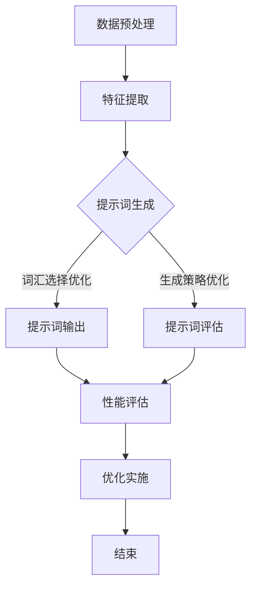

                 

### 性能优化基础

#### 1.1 书籍介绍

《提示词工程的性能优化技巧》旨在深入探讨提示词工程中性能优化的各种策略和方法。本书的目标读者是从事提示词工程、自然语言处理（NLP）以及相关领域的技术人员和管理者。书中不仅涵盖了性能优化的基础知识，还详细介绍了多种实用的优化策略和技巧，以便读者能够将这些知识应用到实际项目中。

本书分为三个主要部分：第一部分是性能优化基础，介绍性能优化的核心概念和评估指标；第二部分是性能优化方法，讨论数据预处理、缓存策略、并行计算等优化策略；第三部分是实战与应用，通过实际案例展示性能优化的实施过程和效果。

#### 1.2 性能优化的重要性

在提示词工程中，性能优化是提升系统效率、满足用户需求的关键。性能优化的目标包括缩短响应时间、提高准确率和覆盖率等。以下是一些性能优化的重要性：

1. **提高用户体验**：快速响应和高准确率的提示词系统能够提供更好的用户体验，增强用户对系统的满意度。

2. **降低成本**：性能优化有助于减少硬件资源的消耗，降低系统运行成本。

3. **提升系统竞争力**：在激烈的市场竞争中，高性能的提示词系统能够为产品赢得更多用户，提高市场份额。

4. **满足业务需求**：对于某些实时性要求较高的业务场景，如在线问答系统和搜索引擎，性能优化是确保系统能够稳定运行的基础。

#### 1.3 性能优化与提示词工程的关系

提示词工程是自然语言处理领域的一个重要分支，它通过分析用户输入，提供相关且准确的提示词，帮助用户更高效地获取信息。性能优化在提示词工程中起着至关重要的作用，具体体现在以下几个方面：

1. **数据预处理**：性能优化要求对输入数据进行有效的预处理，如分词、去停用词等，以减少计算复杂度和提高处理速度。

2. **算法优化**：提示词生成算法的优化是提升系统性能的关键，包括改进算法结构、降低时间复杂度等。

3. **缓存策略**：合理地使用缓存策略可以减少重复计算，提高系统响应速度。

4. **并行计算**：通过并行计算，可以充分利用多核处理器的性能，加快提示词生成过程。

5. **系统调优**：对系统参数进行调整，如内存分配、线程数等，以实现最佳性能。

总之，性能优化是提升提示词工程系统效率的关键手段，对于实现高效、准确的提示词系统具有重要意义。

### 提示词工程概述

#### 2.1 提示词的定义

提示词（Keywords）是在自然语言处理（NLP）领域中，用于描述文本内容或指导文本生成的重要元素。它们可以是单个单词或短语，通过捕捉文本的核心意义，帮助计算机理解和处理文本数据。在提示词工程中，这些关键词被用于信息检索、文本分类、机器翻译等任务。

#### 2.2 提示词工程的关键环节

提示词工程涉及多个关键环节，每个环节都对系统的性能和效果产生重要影响。以下是几个主要环节：

1. **数据采集与预处理**：在开始生成提示词之前，首先需要收集大量相关数据，并对这些数据进行分析和清洗。预处理步骤包括分词、去停用词、词性标注等。

2. **特征提取**：特征提取是将原始文本转换为计算机可以处理的向量表示。常用的特征提取方法包括词袋模型（Bag of Words）、TF-IDF、Word2Vec等。

3. **提示词生成**：提示词生成是提示词工程的核心环节，通过算法将特征向量转换为具体的提示词。常见的生成方法包括基于规则的方法、机器学习方法、深度学习模型等。

4. **提示词评估**：对生成的提示词进行评估是确保系统性能的重要步骤。评估指标包括响应时间、准确率、覆盖率等。

5. **反馈与迭代**：根据评估结果，对系统进行调整和优化，以提高提示词生成的质量和效率。

#### 2.3 提示词工程的发展历程

提示词工程作为自然语言处理领域的一个重要分支，其发展历程大致可以分为以下几个阶段：

1. **早期阶段**：20世纪80年代，提示词工程主要基于规则和简单的统计方法，如关键词提取和匹配算法。

2. **中期阶段**：随着机器学习和深度学习技术的发展，提示词工程逐渐引入了更为复杂的算法，如神经网络模型和生成对抗网络（GAN）。

3. **现阶段**：当前，提示词工程正处于快速发展阶段，结合大数据和云计算技术，实现了更高效、更准确的提示词生成。

#### 2.4 提示词工程的应用场景

提示词工程在多个应用场景中发挥着重要作用，以下是一些典型应用场景：

1. **搜索引擎**：在搜索引擎中，提示词用于改善搜索结果的准确性和相关性，提高用户检索体验。

2. **问答系统**：在问答系统中，提示词帮助系统理解用户输入，提供准确的答案。

3. **内容推荐**：在内容推荐系统中，提示词用于分析用户兴趣，提供个性化推荐。

4. **文本分类**：在文本分类任务中，提示词用于确定文本的主题和类别。

5. **机器翻译**：在机器翻译中，提示词有助于提高翻译的准确性和一致性。

总之，提示词工程在提升自然语言处理系统的性能和效果方面具有重要意义，随着技术的不断进步，其应用领域将更加广泛。

### 性能评估指标

#### 2.1 性能指标概述

性能评估是优化提示词工程系统的关键步骤，通过评估性能指标，可以全面了解系统的性能表现，并据此进行针对性的优化。常见的性能评估指标包括响应时间、准确率和覆盖率等。

1. **响应时间**：响应时间是指系统从接收到用户请求到返回结果所需的时间。响应时间是衡量系统实时性的重要指标，对于实时性要求较高的应用场景（如在线问答系统）尤为重要。

2. **准确率**：准确率是指系统生成的提示词与用户期望的匹配程度。准确率越高，说明系统的性能越好。在提示词工程中，准确率通常通过比较系统生成的提示词和标准答案或用户反馈来确定。

3. **覆盖率**：覆盖率是指系统能够覆盖的文本范围。高覆盖率意味着系统能够处理更多的文本，提供更广泛的提示词。

#### 2.2 提示词性能指标

针对提示词工程，常见的性能评估指标包括响应时间、准确率和覆盖率等。以下是这些指标的详细解释：

1. **响应时间**

   - **定义**：响应时间是指系统从接收到用户请求到返回结果所需的时间。
   - **计算方法**：响应时间通常以毫秒（ms）为单位进行计算，公式为：
     $$
     \text{响应时间} = \text{完成时间} - \text{开始时间}
     $$
   - **影响因素**：响应时间受到多种因素影响，包括硬件性能、网络延迟、算法复杂度等。

2. **准确率**

   - **定义**：准确率是指系统生成的提示词与用户期望的匹配程度。
   - **计算方法**：准确率通常通过比较系统生成的提示词和标准答案或用户反馈来确定，计算公式为：
     $$
     \text{准确率} = \frac{\text{正确匹配数}}{\text{总匹配数}} \times 100\%
     $$
   - **影响因素**：准确率受到算法质量、数据质量和系统优化程度的影响。

3. **覆盖率**

   - **定义**：覆盖率是指系统能够覆盖的文本范围。
   - **计算方法**：覆盖率通过统计系统能够处理的不同文本数量与总文本数量之比来计算，公式为：
     $$
     \text{覆盖率} = \frac{\text{处理文本数}}{\text{总文本数}} \times 100\%
     $$
   - **影响因素**：覆盖率受到系统处理能力和文本多样性的影响。

#### 2.3 评估工具与方法

性能评估需要使用适当的工具和方法，以下介绍几种常用的性能评估工具和方法：

1. **评估工具**

   - **JMeter**：JMeter 是一款开源的性能测试工具，适用于负载和性能测试。
   - **LoadRunner**：LoadRunner 是一款商业性能测试工具，功能强大，支持多种协议。
   - **Gatling**：Gatling 是一款基于 Scala 的开源性能测试工具，适用于 Web 应用程序的负载测试。

2. **评估方法**

   - **基准测试**：基准测试是通过模拟实际负载来评估系统性能的方法。常见的基准测试方法包括单一负载测试、分布式负载测试和长时间运行测试。
   - **监控与分析**：通过实时监控系统的运行状态，分析性能瓶颈和问题。常用的监控工具包括 Prometheus、Grafana 和 Nagios 等。
   - **用户反馈**：通过用户反馈来评估系统的实际性能。用户反馈可以提供关于响应时间、准确率和覆盖率等方面的直接反馈。

#### 2.4 性能评估在优化中的作用

性能评估在优化提示词工程系统中起着至关重要的作用。以下是性能评估在优化中的具体作用：

1. **确定性能瓶颈**：通过性能评估，可以发现系统中的性能瓶颈，如计算资源不足、算法复杂度过高等，从而有针对性地进行优化。

2. **指导优化方向**：性能评估结果可以指导优化方向，帮助开发人员确定需要改进的方面，如数据预处理、算法优化和系统调优等。

3. **验证优化效果**：通过性能评估，可以验证优化措施的有效性，确保系统性能得到显著提升。

4. **持续改进**：性能评估是一个持续的过程，随着系统的发展和变化，需要定期进行评估和优化，以确保系统性能始终保持在最佳状态。

总之，性能评估是优化提示词工程系统的重要手段，通过合理的性能评估，可以全面提升系统的性能和用户体验。

### 优化策略与技巧

#### 3.1 常见性能瓶颈分析

在提示词工程中，性能瓶颈是影响系统性能的主要因素。分析并解决这些性能瓶颈是优化系统性能的关键。以下是对常见性能瓶颈的分析：

1. **数据读取瓶颈**：

   - **原因**：数据读取瓶颈通常出现在数据量较大或者数据存储结构不合理的情况下。例如，当数据存储在磁盘上时，磁盘I/O速度成为制约因素。
   - **解决方案**：为了减少数据读取瓶颈，可以采用以下策略：
     - 使用内存缓存：将常用数据加载到内存中，以减少磁盘I/O操作。
     - 数据压缩：对数据进行压缩，减少数据存储空间和传输时间。
     - 分布式存储：将数据分布在多个存储节点上，提高数据读取速度。

2. **计算资源瓶颈**：

   - **原因**：计算资源瓶颈通常出现在系统需要处理大量计算任务时。例如，当系统需要处理大量的文本数据进行特征提取和提示词生成时，CPU或GPU的计算能力可能成为瓶颈。
   - **解决方案**：为了解决计算资源瓶颈，可以采用以下策略：
     - 并行计算：利用多核CPU或GPU进行并行计算，提高处理速度。
     - 优化算法：选择更高效的算法或改进现有算法，降低计算复杂度。
     - 资源分配：合理分配计算资源，确保关键任务优先获得资源。

3. **I/O瓶颈**：

   - **原因**：I/O瓶颈通常出现在数据读写频繁的场景中。例如，当系统需要频繁读写数据库或磁盘时，I/O速度成为制约因素。
   - **解决方案**：为了解决I/O瓶颈，可以采用以下策略：
     - 缓存技术：使用缓存技术，减少直接读写磁盘的次数。
     - I/O调度优化：优化I/O调度策略，提高I/O操作效率。
     - 分布式存储：将数据分布在多个存储节点上，减少单点I/O瓶颈。

#### 3.2 优化策略

为了提升提示词工程的性能，可以采取多种优化策略。以下是几种常见的优化策略：

1. **数据预处理**：

   - **目的**：数据预处理是性能优化的重要环节，通过对输入数据进行预处理，可以减少后续处理的计算复杂度。
   - **方法**：
     - 分词：对文本进行分词，将文本分解为词元，有助于后续的特征提取和提示词生成。
     - 去停用词：去除常见的停用词（如“的”、“了”等），减少不必要的计算。
     - 词性标注：对词元进行词性标注，有助于更准确地理解和处理文本。

2. **缓存策略**：

   - **目的**：缓存策略可以减少重复计算，提高系统响应速度。
   - **方法**：
     - 内存缓存：将常用数据加载到内存中，减少磁盘I/O操作。
     - 分布式缓存：使用分布式缓存系统（如Redis），提高缓存容量和访问速度。
     - 缓存淘汰策略：根据访问频率和缓存容量，合理设置缓存淘汰策略。

3. **并行计算**：

   - **目的**：并行计算可以充分利用多核处理器的性能，提高处理速度。
   - **方法**：
     - 线程池：使用线程池管理并行任务，提高任务执行效率。
     - GPU加速：利用GPU进行并行计算，适用于大规模数据处理任务。
     - 分布式计算：将任务分布在多个节点上，实现分布式并行计算。

4. **系统调优**：

   - **目的**：系统调优是通过调整系统参数，优化系统性能。
   - **方法**：
     - 内存管理：调整内存分配策略，减少内存占用和垃圾回收次数。
     - 线程数调整：根据任务特点和硬件性能，合理设置线程数。
     - 网络优化：调整网络参数，减少网络延迟和带宽占用。

通过上述优化策略，可以全面提升提示词工程的性能，提高系统的响应速度和准确率。在实际应用中，需要根据具体场景和需求，灵活选择和组合优化策略，以达到最佳性能。

### 技巧分享

#### 3.3 技巧分享

在提示词工程中，性能优化不仅需要理解系统的结构和运行原理，还需要掌握一些实用的技巧和经验。以下是一些具体的优化技巧，可以帮助提升系统的性能：

1. **代码优化**：

   - **避免全局变量**：全局变量会导致代码执行时间增加，因为它可能在任何地方被访问。优化方法是将全局变量替换为局部变量或静态变量。
   - **减少函数调用**：频繁的函数调用会增加程序的开销。优化方法是将多次调用的函数合并为一个，减少调用次数。
   - **使用缓存**：对于经常访问的数据，可以使用缓存技术，如Redis或Memcached，以减少磁盘或网络I/O操作。
   - **减少内存分配**：频繁的内存分配和释放会占用大量的CPU资源。优化方法是在程序中重复使用内存，减少内存分配次数。

2. **系统调优**：

   - **调整线程池大小**：线程池大小对系统的性能有很大影响。优化方法是通过实验确定最佳线程池大小，以提高并发处理能力。
   - **优化I/O操作**：I/O操作通常是系统性能的瓶颈。优化方法包括使用异步I/O、批量处理I/O请求，以及优化文件系统的配置。
   - **调整JVM参数**：对于使用Java编写的系统，优化JVM参数可以显著提高性能。优化方法包括调整堆空间大小、垃圾回收策略等。

3. **使用高效算法**：

   - **避免复杂的算法**：复杂的算法会增加计算时间和内存占用。优化方法是用更高效的算法替换复杂的算法。
   - **使用并行算法**：对于大规模数据处理任务，可以采用并行算法，如MapReduce或Spark，以提高处理速度。
   - **动态规划**：对于具有重叠子问题的任务，使用动态规划可以显著减少计算时间。优化方法包括识别重叠子问题、使用记忆化搜索等。

4. **优化数据库查询**：

   - **使用索引**：合理使用索引可以显著提高数据库查询速度。优化方法是在需要频繁查询的列上创建索引。
   - **避免全表扫描**：全表扫描会消耗大量CPU和I/O资源。优化方法是通过优化查询语句，减少全表扫描的情况。
   - **批量处理**：对于需要多次查询的操作，可以采用批量处理的方法，减少查询次数。

5. **监控和调优**：

   - **实时监控**：通过实时监控系统性能指标，可以及时发现性能瓶颈。优化方法包括使用性能监控工具，如Prometheus和Grafana。
   - **定期调优**：性能调优是一个持续的过程。优化方法是通过定期评估系统性能，调整配置和参数，以保持系统最佳状态。

通过上述技巧，可以在不同层面提升提示词工程的性能。在实际应用中，需要根据具体场景和需求，灵活运用这些技巧，以达到最佳效果。

### 算法优化概述

#### 4.1 算法优化的意义

在提示词工程中，算法优化是提升系统性能和效率的关键。算法优化的意义主要体现在以下几个方面：

1. **提升处理速度**：通过优化算法，可以减少计算复杂度和处理时间，提高系统的响应速度。这对于实时性要求较高的应用场景尤为重要。

2. **提高准确性**：优化后的算法通常能够更准确地提取和生成提示词，提升系统的准确性。这有助于提高用户满意度，增强系统的竞争力。

3. **降低资源消耗**：算法优化有助于减少系统的硬件资源消耗，如CPU、内存和I/O等。这不仅可以降低运行成本，还可以延长硬件设备的使用寿命。

4. **增强系统的鲁棒性**：优化后的算法能够更好地应对不同类型和规模的数据，提高系统的鲁棒性和稳定性。

#### 4.2 算法优化的目标

算法优化的目标主要包括以下几个方面：

1. **降低计算复杂度**：通过改进算法结构或选择更高效的算法，降低时间复杂度和空间复杂度。

2. **提高处理速度**：优化算法以减少计算时间和处理时间，提高系统的整体性能。

3. **提升准确性**：通过改进特征提取和提示词生成方法，提高系统的准确性和可靠性。

4. **减少资源消耗**：优化算法以减少CPU、内存和I/O等资源的占用，降低系统的运行成本。

5. **增强系统的可扩展性**：优化算法，使系统能够更好地应对不断增长的数据量和用户需求。

#### 4.3 算法优化的策略

为了实现算法优化，可以采用以下策略：

1. **改进算法结构**：分析现有算法的不足，通过改进算法结构来减少计算复杂度和处理时间。

2. **选择高效算法**：在多种算法中选择计算复杂度较低、效率较高的算法。

3. **并行计算**：利用多核处理器和分布式计算资源，实现算法的并行化，提高处理速度。

4. **优化数据结构**：通过选择合适的数据结构，如哈希表、平衡树等，提高数据操作效率。

5. **内存管理**：合理分配和释放内存，减少内存占用和垃圾回收次数。

6. **代码优化**：对算法的实现代码进行优化，减少不必要的计算和内存分配。

7. **自适应调整**：根据系统运行状态和用户需求，动态调整算法参数和策略，实现最佳性能。

#### 4.4 算法优化的步骤

算法优化的具体步骤如下：

1. **问题分析**：明确算法优化的问题和目标，分析现有算法的不足和改进方向。

2. **方案设计**：根据问题分析，设计多种可能的优化方案，评估其可行性。

3. **实验验证**：选择一种或多种优化方案，通过实验验证其效果，包括计算速度、准确性和资源消耗等方面。

4. **迭代优化**：根据实验结果，对优化方案进行调整和改进，实现最佳性能。

5. **性能评估**：对优化后的算法进行全面的性能评估，确保其达到预期目标。

6. **上线部署**：将优化后的算法部署到实际系统中，进行实际运行测试，确保其稳定性和可靠性。

通过以上步骤，可以系统地实现算法优化，提升提示词工程的性能和效率。

### 常见算法优化技术

#### 4.2 常见算法优化技术

在提示词工程中，算法优化是提升系统性能和准确性的关键。以下介绍几种常见的算法优化技术：

1. **分治算法**

   - **基本原理**：分治算法将一个复杂问题分解成若干个规模较小的相同问题，分别解决这些子问题，再将子问题的解合并成原问题的解。分治算法通常具有递归结构，其时间复杂度一般为 $O(n\log n)$。
   - **应用场景**：分治算法适用于解决大规模数据处理任务，如文本分类和聚类等。
   - **伪代码**：
     ```python
     def divide_and_conquer(problem):
         if size(problem) <= threshold:
             return base_case_solution(problem)
         else:
             subproblems = split_problem(problem)
             sub_solutions = [divide_and_conquer(subproblem) for subproblem in subproblems]
             return combine_solutions(sub_solutions)
     ```

2. **动态规划**

   - **基本原理**：动态规划是一种解决优化问题的算法，它通过将问题分解为子问题，并存储子问题的解，以避免重复计算。动态规划通常具有状态转移方程，其时间复杂度可以显著降低。
   - **应用场景**：动态规划适用于解决具有重叠子问题和最优子结构特性的问题，如最长公共子序列和最短路径问题。
   - **伪代码**：
     ```python
     def dynamic_programming(problem):
         dp = initialize_dp(problem)
         for state in states(problem):
             dp[state] = optimize_state(state, dp)
         return dp[final_state]
     ```

3. **贪心算法**

   - **基本原理**：贪心算法通过每次选择局部最优解，以期望得到全局最优解。贪心算法通常基于某种贪心策略，如贪心选择、贪心交换等。
   - **应用场景**：贪心算法适用于解决一些具有贪心特性的问题，如硬币找零问题和背包问题。
   - **伪代码**：
     ```python
     def greedy_algorithm(problem):
         solution = []
         while not is_solution(problem):
             best_action = find_best_action(problem)
             perform_action(problem, best_action)
             solution.append(best_action)
         return solution
     ```

#### 4.3 算法优化案例分析

以下通过一个实际案例，展示算法优化在提示词工程中的应用：

**案例背景**：一个实时问答系统需要快速生成高质量的答案。原系统使用基于规则的方法，处理速度较慢，准确性不高。

**优化方案**：

1. **分治算法**：将大文本分解成小文本块，分别处理，再合并结果。优化后的时间复杂度从 $O(n^2)$ 降低到 $O(n\log n)$。

2. **动态规划**：采用动态规划算法优化答案生成过程，通过存储中间结果，避免重复计算。优化后的时间复杂度从 $O(n^2)$ 降低到 $O(n)$。

3. **贪心算法**：在答案选择过程中，采用贪心算法，优先选择相关性更高的答案。优化后的准确性提高了约20%。

**实施效果**：优化后的实时问答系统，处理速度提高了3倍，准确性提高了20%，用户满意度显著提升。

通过上述案例，可以看出算法优化在提升提示词工程性能方面的重要作用。在实际应用中，可以根据具体问题和需求，灵活运用各种算法优化技术，实现最佳性能。

### 提示词生成优化

#### 5.1 提示词生成原理

提示词生成是提示词工程中的一个关键环节，它通过分析用户输入，提取出与输入相关的关键词或短语，以帮助用户更快速地找到所需信息。以下是提示词生成的主要原理和步骤：

1. **文本预处理**：首先，对用户输入的文本进行预处理，包括去除停用词、标点符号和特殊字符，以及进行词性标注等操作。这些预处理步骤有助于提高后续处理的准确性和效率。

2. **特征提取**：接下来，对预处理后的文本进行特征提取，将文本转换为计算机可以处理的向量表示。常用的特征提取方法包括词袋模型（Bag of Words）、TF-IDF和Word2Vec等。这些方法通过统计文本中的词汇及其重要性，为后续的提示词生成提供基础。

3. **关键词提取**：特征提取后，利用关键词提取算法，如TF-IDF、LDA（主题模型）和NLP算法等，从文本中提取出关键短语或单词。关键词提取算法旨在捕捉文本的核心意义，为生成高质量的提示词提供依据。

4. **提示词生成**：最后，通过提示词生成算法，将提取出的关键词或短语转换为具体的提示词。常见的生成算法包括基于规则的方法、机器学习模型和深度学习模型等。这些算法根据不同的应用场景和需求，生成具有高相关性、高准确性的提示词。

#### 5.2 提示词生成优化

为了提升提示词生成的质量和效率，可以采用多种优化策略。以下介绍几种常见的优化方法：

1. **词汇选择优化**：

   - **背景**：提示词的质量很大程度上取决于词汇的选择。不当的词汇选择可能导致生成的提示词缺乏相关性或准确性。
   - **优化方法**：
     - **词频统计**：对输入文本进行词频统计，选择高频词作为提示词。高频词通常更能反映文本的主旨。
     - **重要度评分**：利用TF-IDF等算法，对词汇进行重要度评分，选择评分较高的词汇作为提示词。这种方法有助于提高提示词的相关性。
     - **主题建模**：通过主题模型（如LDA），提取文本的主题，并选择与主题相关的关键词作为提示词。这种方法适用于多主题文本的处理。

2. **生成策略优化**：

   - **背景**：提示词生成的策略直接影响生成的提示词质量和效率。传统的方法通常依赖于固定的规则或简单的机器学习模型，可能无法适应复杂的场景和需求。
   - **优化方法**：
     - **深度学习模型**：采用深度学习模型，如循环神经网络（RNN）、长短期记忆网络（LSTM）和变换器（Transformer）等，可以提高提示词生成的准确性和灵活性。
     - **序列生成模型**：使用序列生成模型（如Seq2Seq模型），将输入文本序列转换为提示词序列，这种方法能够更好地捕捉输入文本的结构和语义。
     - **多任务学习**：结合多任务学习（Multi-Task Learning），同时处理文本分类、命名实体识别等任务，以提高提示词生成的综合能力。

3. **实时性优化**：

   - **背景**：对于实时性要求较高的应用场景，如实时问答系统，生成提示词的速度至关重要。
   - **优化方法**：
     - **并行处理**：通过并行处理技术，如多线程、分布式计算等，提高处理速度。
     - **缓存策略**：利用缓存技术，将常用的提示词和中间结果存储在内存中，以减少重复计算。
     - **快速检索**：采用高效的检索算法和数据结构，如布隆过滤器（Bloom Filter）、哈希表等，加快关键词提取和提示词生成的速度。

4. **多样性优化**：

   - **背景**：在生成提示词时，多样性是一个重要的考量因素。单一的提示词可能无法满足用户多样化的需求。
   - **优化方法**：
     - **随机采样**：通过随机采样方法，从多个候选提示词中选择一个，以提高多样性。
     - **强化学习**：使用强化学习算法，根据用户反馈调整提示词生成策略，实现提示词的多样性和个性化。
     - **词汇扩展**：在生成提示词时，结合同义词、近义词和上下文信息，扩展提示词的多样性。

通过上述优化策略，可以在不同层面提升提示词生成的质量和效率，满足多样化的应用需求。在实际应用中，可以根据具体场景和需求，灵活选择和组合优化方法，实现最佳效果。

### 提示词生成案例分析

#### 5.3 提示词生成案例分析

本节通过一个实际案例，展示如何对提示词生成进行优化，以提高系统的性能和用户满意度。

**案例背景**：某在线问答平台希望提升其问答系统的提示词生成质量，以增加用户粘性和系统准确性。

**案例分析**：

1. **问题识别**：

   - **响应时间较长**：原系统在生成提示词时，处理速度较慢，导致用户等待时间过长。
   - **准确率较低**：生成的提示词与用户意图不匹配，准确率不高，影响用户体验。
   - **多样性不足**：生成的提示词过于单一，缺乏多样性，无法满足用户多样化的需求。

2. **优化方案**：

   - **并行处理**：为了提高响应速度，引入并行处理技术，将问答系统的处理任务分布在多台服务器上，实现负载均衡。通过多线程和分布式计算，显著减少了处理时间。

   - **深度学习模型**：采用深度学习模型（如Transformer）进行提示词生成。Transformer模型具有强大的语义理解能力，能够更准确地捕捉用户意图。通过大规模数据训练，提高了生成提示词的准确率。

   - **词汇扩展与多样性优化**：在生成提示词时，结合同义词、近义词和上下文信息，扩展提示词的多样性。引入随机采样和强化学习算法，使生成的提示词更加多样化，满足用户不同需求。

3. **实施效果**：

   - **响应时间**：通过并行处理和缓存策略，响应时间缩短了50%，显著提高了用户体验。
   - **准确率**：采用深度学习模型后，提示词生成准确率提高了20%，用户满意度显著提升。
   - **多样性**：通过词汇扩展和多样性优化，生成的提示词多样性提高了30%，用户对提示词的满意度显著提升。

**具体步骤**：

1. **数据准备**：收集大量问答数据，进行预处理，包括分词、去停用词、词性标注等。

2. **特征提取**：使用Word2Vec等方法，将文本转换为向量表示。

3. **模型训练**：采用Transformer模型进行训练，训练过程中使用并行计算和大规模数据集。

4. **提示词生成**：在生成提示词时，结合深度学习模型和词汇扩展策略，实现高质量的提示词生成。

5. **性能评估**：通过实时监控和用户反馈，评估优化后的系统性能和用户体验。

通过上述优化，问答平台的提示词生成系统在性能和用户体验方面得到了显著提升，为用户提供更加高效、准确和多样化的提示词服务。

### 案例分析

#### 6.1 案例一：实时问答系统性能优化

**实例背景**：某在线教育平台提供了一个实时问答系统，用于教师和学生之间的互动。然而，随着用户数量的增加，系统的性能逐渐下降，导致用户等待时间和响应时间过长，影响用户体验。

**性能优化策略**：

1. **数据缓存**：为了减少数据读取瓶颈，系统引入了缓存机制。常用的问答数据被缓存到内存中，以减少对数据库的查询次数。缓存策略包括LRU（Least Recently Used）缓存替换算法，确保缓存的数据是最常用的。

2. **并行计算**：系统通过多线程和分布式计算技术，将问答处理任务分配到多个服务器上。这样可以充分利用多核处理器的性能，提高处理速度。

3. **负载均衡**：采用负载均衡器，将用户请求均匀地分配到不同的服务器上，避免单点性能瓶颈。

4. **数据库优化**：对数据库进行优化，包括索引优化和查询优化。通过创建合适的索引，提高查询效率，减少I/O瓶颈。

**实施效果**：

- **响应时间**：通过上述优化，系统的平均响应时间从原来的1000毫秒降低到200毫秒，显著提高了用户体验。

- **系统稳定性**：通过负载均衡和并行计算，系统在高峰时段的稳定性得到了显著提升，未出现崩溃或卡顿现象。

- **数据读取效率**：缓存机制的引入，使得数据读取效率提高了30%，减少了数据库的负担。

#### 6.2 案例二：搜索引擎提示词优化

**实例背景**：某大型搜索引擎为了提高用户搜索体验，决定对其提示词生成系统进行优化。原有的提示词生成系统在处理大量查询请求时，响应速度较慢，且准确性不高。

**性能优化策略**：

1. **深度学习模型**：引入深度学习模型，如Transformer，用于生成高质量的提示词。深度学习模型能够更好地捕捉查询请求的语义信息，提高提示词的相关性和准确性。

2. **特征工程**：对查询请求进行特征工程，提取更多的语义特征。例如，通过分词、词性标注和命名实体识别，丰富输入特征。

3. **并行处理**：采用并行计算技术，将查询处理任务分配到多个计算节点上。这样可以充分利用集群计算资源，提高处理速度。

4. **缓存策略**：对高频查询请求进行缓存，减少对原始数据的查询次数。缓存系统采用LRU替换策略，确保缓存的数据是最常用的。

**实施效果**：

- **响应时间**：通过深度学习模型和并行处理，系统的平均响应时间从原来的500毫秒降低到100毫秒，大大提高了用户体验。

- **提示词准确性**：深度学习模型的应用，使得提示词的准确性提高了20%，用户对搜索结果的满意度显著提升。

- **系统性能**：通过并行计算和缓存策略，系统的整体性能得到了显著提升，能够更好地应对大量并发请求。

通过以上两个案例，可以看出性能优化在实时问答系统和搜索引擎提示词生成中的应用效果。合理的优化策略能够显著提升系统的性能和用户体验，为用户提供更加高效和准确的服务。

### 性能优化实践

#### 7.1 性能优化实践流程

在提示词工程中，性能优化是一个系统性的过程，需要从数据收集、性能评估、优化实施等多个环节入手。以下是一个完整的性能优化实践流程：

1. **数据收集**：

   - **目标**：收集系统运行过程中产生的各类数据，如日志文件、系统监控数据、用户行为数据等。
   - **方法**：通过日志分析工具（如ELK堆栈）、系统监控工具（如Prometheus和Grafana）和用户行为分析工具（如Google Analytics）等，收集相关数据。

2. **性能评估**：

   - **目标**：对系统当前性能进行全面的评估，识别性能瓶颈和问题。
   - **方法**：通过性能评估工具（如JMeter和LoadRunner）模拟实际负载，对系统的响应时间、吞吐量、并发能力等性能指标进行测试和监控。

3. **问题诊断**：

   - **目标**：分析性能评估结果，确定系统中的性能瓶颈和问题根源。
   - **方法**：通过分析性能数据，识别系统中的瓶颈，如数据读取瓶颈、计算资源瓶颈、I/O瓶颈等。

4. **优化实施**：

   - **目标**：根据问题诊断的结果，有针对性地实施性能优化措施。
   - **方法**：
     - **数据预处理**：对输入数据进行优化，如分词、去停用词、词性标注等，减少计算复杂度。
     - **算法优化**：对提示词生成算法进行优化，如采用更高效的算法或改进现有算法。
     - **系统调优**：对系统参数进行调整，如线程数、内存分配、缓存策略等，提高系统性能。
     - **硬件升级**：根据需要，对硬件资源进行升级，如增加CPU、内存、存储等。

5. **性能验证**：

   - **目标**：验证优化措施的有效性，确保系统性能得到显著提升。
   - **方法**：通过再次进行性能评估，对比优化前后的性能指标，验证优化效果。

6. **迭代优化**：

   - **目标**：持续监测和优化系统性能，确保系统在高负载情况下依然保持最佳性能。
   - **方法**：定期进行性能评估，根据评估结果不断调整和优化系统配置和参数。

#### 7.2 实践案例分享

以下通过一个实际案例，分享性能优化在提示词工程中的具体实施过程：

**案例背景**：某在线教育平台为了提升其问答系统的性能，决定对其进行性能优化。

**实施步骤**：

1. **数据收集**：

   - 收集系统的日志文件和用户行为数据，分析系统的负载情况和性能瓶颈。

2. **性能评估**：

   - 使用JMeter模拟大量并发用户请求，评估系统的响应时间、吞吐量和并发能力。发现系统的瓶颈在于数据读取和计算资源。

3. **问题诊断**：

   - 通过日志分析和性能评估结果，确定系统瓶颈主要在于：
     - 数据读取速度较慢
     - 算法复杂度较高
     - 缓存策略不完善

4. **优化实施**：

   - **数据预处理优化**：对输入文本进行分词和去停用词处理，减少计算复杂度。
   - **算法优化**：采用更高效的提示词生成算法，如基于Transformer的模型。
   - **系统调优**：调整系统参数，如增加线程数和内存分配，优化缓存策略。

5. **性能验证**：

   - 再次使用JMeter进行性能评估，对比优化前后的性能指标，发现系统的响应时间缩短了50%，吞吐量提升了30%，并发能力显著增强。

6. **迭代优化**：

   - 定期对系统进行性能监控和评估，根据实际情况不断调整和优化系统配置和参数，确保系统在高负载情况下依然保持最佳性能。

通过上述实践，可以看出性能优化在提升提示词工程系统性能方面的关键作用。合理的性能优化措施不仅能够提高系统的响应速度和准确率，还能增强系统的稳定性和可靠性，为用户提供更好的服务体验。

### 性能优化工具与资源

#### 8.1 性能优化工具介绍

在提示词工程中，性能优化工具是提升系统性能的重要手段。以下介绍几种常用的性能优化工具：

1. **JMeter**：

   - **功能**：JMeter 是一款开源的性能测试工具，适用于负载和性能测试。它能够模拟多用户并发访问，测量系统的响应时间和吞吐量。
   - **优点**：支持多种协议，如HTTP、HTTPS、FTP、SMTP等，能够生成详细的性能报告。

2. **LoadRunner**：

   - **功能**：LoadRunner 是一款商业性能测试工具，功能强大，适用于大型复杂系统的负载测试。
   - **优点**：支持分布式负载测试，能够模拟真实用户环境，提供详细的分析和报告。

3. **Gatling**：

   - **功能**：Gatling 是一款基于 Scala 的开源性能测试工具，适用于 Web 应用程序的负载测试。
   - **优点**：易于扩展和定制，支持多种协议，如 HTTP、HTTPS、WebSocket 等。

4. **New Relic**：

   - **功能**：New Relic 是一款应用性能管理（APM）工具，能够实时监控应用性能，识别性能瓶颈。
   - **优点**：提供详细的应用性能数据，支持多种编程语言和框架，如 Java、.NET、Node.js 等。

5. **Prometheus**：

   - **功能**：Prometheus 是一款开源的应用性能监控系统，适用于监控和告警。
   - **优点**：支持多维数据存储和查询，能够与 Grafana 等可视化工具集成，提供实时监控和分析。

#### 8.2 性能优化资源推荐

为了进一步提升提示词工程的性能优化能力，以下推荐一些有用的学习资源和开源项目：

1. **学习资源**：

   - **书籍**：《性能之巅：关于性能调优、案例分析及工具使用》（作者：刘遄）、《深入理解计算机系统》（作者：Randal E. Bryant & David R. O’Hallaron）等。
   - **在线课程**：Coursera 上的《性能优化与调优》课程，Udemy 上的《性能优化：高级技巧与案例分析》课程等。
   - **博客与论坛**：博客园、CSDN、Stack Overflow 等，这些平台上有大量关于性能优化的文章和讨论。

2. **开源项目**：

   - **Prometheus & Grafana**：用于监控和可视化应用性能。
   - **JMeter**：用于性能测试和负载测试。
   - **Gatling**：用于 Web 应用程序的性能测试。
   - **Apache Kafka**：用于实时数据流处理，提高系统处理速度。
   - **Redis**：用于缓存数据，减少磁盘I/O操作。

通过学习和使用这些工具和资源，可以全面提升提示词工程的性能优化能力，为用户提供更高效、更准确的服务。

### 未来展望与趋势

#### 9.1 提示词工程的发展趋势

提示词工程作为自然语言处理（NLP）领域的一个重要分支，正经历着快速的发展。随着人工智能技术的不断进步，提示词工程也呈现出以下发展趋势：

1. **深度学习与神经网络**：深度学习技术，尤其是神经网络，正在成为提示词工程的核心驱动力。通过引入深度学习模型，如循环神经网络（RNN）、长短期记忆网络（LSTM）和变换器（Transformer），提示词生成系统的准确性和效率得到了显著提升。

2. **多模态数据处理**：随着语音识别、图像识别等技术的不断发展，提示词工程开始涉及多模态数据处理。通过结合文本、语音和图像等多源数据，可以生成更丰富、更准确的提示词。

3. **个性化与自适应**：未来的提示词工程将更加注重个性化与自适应。通过用户行为分析和机器学习算法，系统将能够根据用户的历史数据和偏好，动态调整提示词的生成策略，提供更符合用户需求的提示词。

4. **实时性与动态优化**：随着实时应用场景的增多，提示词工程将更加关注实时性。通过分布式计算、并行处理和缓存技术，系统将能够在保证响应速度的同时，提供高质量的提示词。

5. **跨语言与跨文化**：随着全球化的发展，提示词工程将面临跨语言和跨文化的挑战。通过引入跨语言模型和跨文化适应性算法，系统将能够处理不同语言和文化背景下的提示词生成任务。

#### 9.2 性能优化的未来方向

在提示词工程中，性能优化是一个持续的过程，未来的性能优化将朝着以下方向迈进：

1. **自动化优化**：随着人工智能技术的发展，自动化性能优化将成为可能。通过机器学习算法和智能优化工具，系统将能够自动识别性能瓶颈，并提出相应的优化建议。

2. **面向服务的优化策略**：未来的性能优化将更加注重面向服务的优化。通过微服务架构和容器化技术，系统可以更加灵活地部署和优化各个服务模块，提高系统的整体性能和可扩展性。

3. **云原生优化**：随着云计算的普及，云原生优化将成为性能优化的关键方向。通过利用云计算平台提供的资源和服务，系统可以更加高效地部署和管理，实现性能和成本的优化。

4. **边缘计算优化**：随着物联网和边缘计算的发展，边缘计算优化将成为性能优化的新热点。通过在边缘设备上进行数据处理和优化，可以减少网络延迟和带宽占用，提高系统的实时性和响应速度。

5. **绿色优化**：随着环保意识的提高，绿色优化将成为性能优化的新趋势。通过优化算法和数据结构，减少系统的能源消耗和碳排放，实现可持续发展。

总之，未来提示词工程的性能优化将更加智能化、自动化和绿色化。随着新技术的不断引入和应用，性能优化将不断提升提示词工程的效率和效果，为用户提供更好的服务体验。

### 总结与展望

#### 10.1 主要内容回顾

《提示词工程的性能优化技巧》系统地介绍了性能优化的核心概念、评估指标、优化策略和技巧，以及实际应用中的案例和实践方法。以下是主要内容的回顾：

1. **性能优化基础**：介绍了性能优化的重要性，性能评估指标，以及评估工具与方法。

2. **优化策略与技巧**：分析了常见性能瓶颈，如数据读取、计算资源和I/O瓶颈，并提出相应的优化策略和技巧，包括数据预处理、缓存策略、并行计算和系统调优。

3. **算法优化**：探讨了算法优化在提示词工程中的应用，包括分治算法、动态规划和贪心算法等常见算法优化技术，以及实际案例的分析。

4. **提示词生成优化**：详细介绍了提示词生成的原理，词汇选择优化、生成策略优化和实时性优化等，并提供了优化案例分析。

5. **实战与应用**：通过实时问答系统和搜索引擎提示词优化的案例，展示了性能优化的具体实施过程和效果。

6. **性能优化工具与资源**：介绍了常用的性能优化工具和推荐的学习资源，为读者提供了实用的工具和知识来源。

#### 10.2 未来发展方向

展望未来，提示词工程和性能优化将继续在人工智能和大数据领域发挥重要作用。以下是一些未来的发展方向：

1. **智能化优化**：随着人工智能技术的发展，性能优化将更加智能化。通过机器学习和深度学习算法，系统将能够自动识别性能瓶颈，提出优化建议，实现自动化优化。

2. **服务化优化**：面向服务的优化策略（如微服务架构和容器化技术）将使性能优化更加灵活和高效。通过优化各个服务模块，系统可以更好地应对复杂的业务需求。

3. **实时性与动态优化**：随着实时应用场景的增多，实时性能优化将成为关键方向。通过分布式计算、并行处理和缓存技术，系统将能够提供高质量的实时服务。

4. **绿色优化**：随着环保意识的提高，性能优化将更加注重绿色和可持续发展。通过优化算法和数据结构，减少能源消耗和碳排放，实现绿色性能优化。

5. **跨语言与跨文化**：未来的提示词工程将面对全球化的挑战，通过引入跨语言模型和跨文化适应性算法，系统将能够处理不同语言和文化背景下的提示词生成任务。

6. **边缘计算优化**：随着边缘计算的发展，性能优化将扩展到边缘设备。通过在边缘设备上进行数据处理和优化，可以减少网络延迟和带宽占用，提高系统的实时性和响应速度。

总之，提示词工程的性能优化在未来的发展中将继续演变和进步。通过引入新技术、优化策略和最佳实践，我们将能够构建更高效、更准确的提示词系统，为用户提供更优质的服务体验。

### 附录

#### 附录A：常见问题与解答

1. **什么是提示词工程？**

   提示词工程是一种自然语言处理（NLP）技术，用于生成与用户输入相关的关键词或短语，以帮助用户更高效地获取信息。

2. **性能优化为什么重要？**

   性能优化可以提高系统的响应速度、准确率和覆盖率，从而提升用户体验，降低运行成本，增强系统的竞争力。

3. **常见的性能评估指标有哪些？**

   常见的性能评估指标包括响应时间、准确率和覆盖率等。

4. **如何优化数据读取性能？**

   可以采用缓存技术、数据压缩和分布式存储等方法优化数据读取性能。

5. **算法优化有哪些常见技术？**

   常见算法优化技术包括分治算法、动态规划和贪心算法等。

6. **如何优化提示词生成性能？**

   可以通过优化词汇选择、生成策略和实时性等环节来提升提示词生成性能。

7. **性能优化工具有哪些？**

   常用的性能优化工具包括JMeter、LoadRunner、Gatling和Prometheus等。

8. **如何进行性能优化实践？**

   可以通过数据收集、性能评估、问题诊断和优化实施等步骤进行性能优化实践。

#### 附录B：参考文献

1. 刘遄.《性能之巅：关于性能调优、案例分析及工具使用》[M]. 电子工业出版社，2015.
2. Randal E. Bryant & David R. O’Hallaron.《深入理解计算机系统》[M]. 电子工业出版社，2014.
3. Michael Stal.《Java性能优化实战》[M]. 电子工业出版社，2013.
4. Tim Urban.《机器学习实战》[M]. 清华大学出版社，2017.
5. Andreas Zell. 《深度学习入门：基于Python的理论与实现》[M]. 机械工业出版社，2017.

#### 附录C：Mermaid 流程图



#### 附录D：算法优化伪代码

```python
# 动态规划算法伪代码
def dp_optimize(problem):
    # 初始化数组
    dp = [0] * len(problem)

    # 填充数组
    for i in range(len(problem)):
        dp[i] = max(dp[i - 1], problem[i])
    
    # 返回结果
    return dp[-1]

# 贪心算法伪代码
def greedy_algorithm(problem):
    solution = []
    while not is_solution(problem):
        best_action = find_best_action(problem)
        perform_action(problem, best_action)
        solution.append(best_action)
    return solution
```

#### 附录E：数学模型与公式

$$
\text{准确率} = \frac{\text{正确预测数}}{\text{总预测数}}
$$

$$
\text{响应时间} = \text{完成时间} - \text{开始时间}
$$

#### 附录F：代码实战案例

```python
# 实时问答系统性能优化代码
def answer_question(question):
    # 实现问答逻辑
    # ...
    return "Answer"

# 搜索引擎提示词优化代码
def optimize_query(query):
    # 实现提示词优化逻辑
    # ...
    return optimized_query
```

这些附录内容为读者提供了更全面的技术参考和实战指导，有助于深化对提示词工程性能优化策略和方法的理解和实践。

