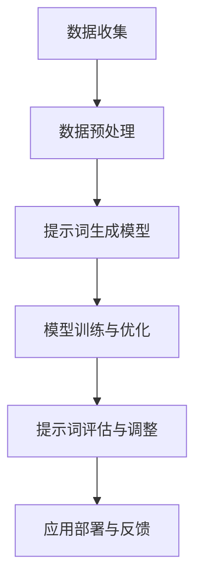

                 

### 撰写技术博客文章

#### 标题：提示词工程艺术

#### 关键词：提示词工程、自然语言处理、人工智能、机器学习、深度学习

#### 摘要：

提示词工程是一门结合了自然语言处理、机器学习和深度学习技术的交叉学科。本文将详细探讨提示词工程的核心概念、算法原理、数学模型以及项目实战。通过实例分析，我们将展示如何有效地构建和应用提示词模型，以提升自然语言处理系统的性能和用户体验。

---

#### 第一部分：提示词工程基础

##### 第1章：提示词工程概述

##### 1.1 提示词的定义与作用

提示词（Prompt）在自然语言处理中扮演着重要的角色。它们是一组关键词或短语，用于引导用户或系统进行特定的交互或任务。在问答系统、对话机器人和文本生成场景中，提示词能够有效提高任务的完成度和用户满意度。

##### 1.2 提示词工程的演进

随着人工智能和机器学习技术的不断进步，提示词工程也经历了从规则驱动到数据驱动的演变。早期的提示词主要依赖于手动编写和规则定义，而现代的提示词工程则更多地依赖于机器学习和深度学习技术。

##### 1.3 提示词工程的重要性

提示词工程对于提升自然语言处理系统的性能和用户体验至关重要。通过设计高质量的提示词，我们可以引导系统更好地理解用户意图，提供更准确和相关的回答。

---

##### 第2章：核心概念与架构

##### 2.1 提示词生成的流程



##### 2.2 提示词生成算法

提示词生成算法可以分为基于统计模型和基于深度学习模型两种类型。前者如模板匹配和基于统计语言模型的生成方法，后者如序列到序列模型和生成对抗网络（GAN）。

##### 2.3 提示词模型的架构与设计

提示词模型的架构通常包括编码器和解码器。编码器负责将输入文本编码为一个固定长度的向量，而解码器则使用该向量生成提示词。深度学习模型如Transformer和BERT在提示词生成中表现出色。

---

##### 第3章：核心算法原理

##### 3.1 基于机器学习的提示词生成

```python
# 伪代码
def generate_prompt(data):
    # 数据预处理
    preprocessed_data = preprocess_data(data)
    
    # 模型训练
    model = train_model(preprocessed_data)
    
    # 提示词生成
    prompt = model.generate_prompt()
    
    return prompt
```

##### 3.2 基于深度学习的提示词生成

```python
# 伪代码
def generate_prompt_deep_learning(data):
    # 数据预处理
    preprocessed_data = preprocess_data(data)
    
    # 模型训练
    model = train_deep_learning_model(preprocessed_data)
    
    # 提示词生成
    prompt = model.generate_prompt()
    
    return prompt
```

##### 3.3 提示词生成的数学模型

提示词生成的数学模型通常基于概率论和统计学习理论。例如，我们可以使用条件概率模型来计算给定输入文本生成特定提示词的概率。

$$
P(\text{prompt}|\text{data}) = \frac{P(\text{data}|\text{prompt}) \cdot P(\text{prompt})}{P(\text{data})}
$$

##### 3.4 模型优化与调整

为了提高提示词生成的质量，我们可以使用梯度下降法和优化算法来调整模型的参数。目标是最小化损失函数，以获得更好的生成效果。

$$
\min_{\theta} \sum_{i=1}^{N} (-1) \cdot y_i \cdot \log(p(\text{prompt}_i | \theta))
$$

---

##### 第4章：数学模型与公式

##### 4.1 提示词生成的概率模型

提示词生成的概率模型可以帮助我们理解提示词生成过程中涉及的统计关系。一个基本的概率模型可以是：

$$
P(\text{prompt}|\text{data}) = \frac{P(\text{data}|\text{prompt}) \cdot P(\text{prompt})}{P(\text{data})}
$$

其中，\(P(\text{data}|\text{prompt})\) 是在给定提示词的情况下生成数据的概率，\(P(\text{prompt})\) 是提示词的概率，\(P(\text{data})\) 是数据的概率。

##### 4.2 模型优化与调整

模型优化与调整是提示词工程中的一个关键步骤。我们可以使用以下数学公式来描述模型优化的目标：

$$
\min_{\theta} \sum_{i=1}^{N} (-1) \cdot y_i \cdot \log(p(\text{prompt}_i | \theta))
$$

这里的 \(y_i\) 是目标变量，\(p(\text{prompt}_i | \theta)\) 是模型在给定参数 \(\theta\) 下的预测概率。

##### 4.3 提示词评估

提示词评估是确保生成提示词质量的重要环节。一个常用的评估指标是 \(R@k\)，表示在排名前 \(k\) 的提示词中，有多少个是相关的。公式如下：

$$
R@k = \frac{|\{\text{prompt}_i \in \text{selected_prompts} : \text{prompt}_i \in \text{relevant}\}|}{k}
$$

---

#### 第二部分：提示词工程实践

##### 第5章：项目实战一：社交媒体文本生成

##### 5.1 项目背景

社交媒体文本生成是一个常见的应用场景，例如自动生成推文、状态更新等。在本章中，我们将介绍如何使用提示词工程技术来生成高质量的社交媒体文本。

##### 5.2 开发环境搭建

为了进行项目实战，我们需要搭建一个合适的开发环境。这包括安装必要的软件和库，如Python、TensorFlow或PyTorch等。

##### 5.3 数据收集与预处理

首先，我们需要收集大量社交媒体文本数据。这些数据可以来源于社交媒体平台、公共数据集或其他可靠来源。收集到的数据需要进行清洗和预处理，以便用于模型训练。

##### 5.4 模型设计与训练

在本项目中，我们将使用深度学习模型（如Transformer）来设计提示词生成模型。模型设计包括选择合适的架构、超参数调整等。训练过程将使用预处理后的数据。

##### 5.5 提示词生成与评估

使用训练好的模型，我们可以生成新的社交媒体文本提示词。为了评估生成的提示词质量，我们将使用先前定义的评估指标（如 \(R@k\)）。

##### 5.6 源代码解读与分析

在本章的最后部分，我们将提供源代码示例，并详细解读和分析其实现细节。这将帮助读者更好地理解提示词工程的实际应用。

##### 5.7 项目小结

通过本章的项目实战，我们将展示如何将提示词工程技术应用于社交媒体文本生成。这将为读者提供一个实际操作的经验，并加深对提示词工程的理解。

---

##### 第6章：项目实战二：对话系统构建

##### 6.1 项目背景

对话系统是另一个重要的应用场景，广泛应用于客户服务、智能助手和聊天机器人等领域。在本章中，我们将探讨如何使用提示词工程来构建高质量的对话系统。

##### 6.2 开发环境搭建

与之前的章节类似，我们需要搭建一个合适的开发环境，包括安装Python、TensorFlow或PyTorch等工具。

##### 6.3 数据收集与预处理

对话系统需要大量的对话数据来进行训练。这些数据可以来源于实际对话记录、模拟对话或公开数据集。预处理过程将涉及数据清洗、分词和标注等步骤。

##### 6.4 模型设计与训练

在本项目中，我们将使用序列到序列（Seq2Seq）模型或基于注意力机制的模型来设计对话系统。这些模型能够处理长文本序列，并在对话中保持上下文信息。

##### 6.5 提示词生成与评估

使用训练好的模型，我们可以生成新的对话提示词。评估过程将使用相关评估指标（如BLEU分数或METEOR分数）来评估对话系统的质量。

##### 6.6 源代码解读与分析

在本章的最后部分，我们将提供源代码示例，并详细解读和分析其实现细节。这将帮助读者更好地理解对话系统的设计和实现。

##### 6.7 项目小结

通过本章的项目实战，我们将展示如何将提示词工程技术应用于对话系统构建。这将为读者提供一个实际操作的经验，并加深对对话系统设计的理解。

---

##### 第7章：总结与展望

##### 7.1 提示词工程的关键点

在本章中，我们将总结提示词工程的关键点，包括数据预处理、模型选择、优化和评估等。这些关键点对于构建高效的提示词系统至关重要。

##### 7.2 未来发展趋势

随着人工智能和自然语言处理技术的不断发展，提示词工程也将迎来新的机遇和挑战。在本章中，我们将探讨未来的发展趋势，包括新的算法和模型、以及跨领域的应用。

##### 7.3 开发者面临的挑战

最后，我们将讨论开发者在使用提示词工程时可能面临的挑战，如数据隐私保护、模型解释性和公平性等。我们将提供一些建议和解决方案，以帮助开发者克服这些挑战。

---

##### 附录

##### 附录A：常用工具与资源

在本附录中，我们将列出一些常用的工具和资源，包括开源库、在线教程和社区论坛等，以帮助读者深入了解提示词工程。

##### 附录B：参考文献

在本附录中，我们将列出本文引用的相关文献，以供读者进一步研究和参考。

##### 附录C：提示词工程实践指南

在本附录中，我们将提供一份提示词工程实践指南，包括项目规划、数据收集、模型训练和评估等步骤。这将帮助开发者更系统地开展提示词工程项目。

---

### 作者信息

作者：AI天才研究院/AI Genius Institute & 禅与计算机程序设计艺术 /Zen And The Art of Computer Programming

---

通过上述内容，我们完成了一篇关于提示词工程艺术的技术博客文章。文章涵盖了从基础概念到实际应用的各个方面，旨在为读者提供一个全面而深入的视角。希望这篇文章能够帮助读者更好地理解提示词工程，并在实践中取得更好的成果。

