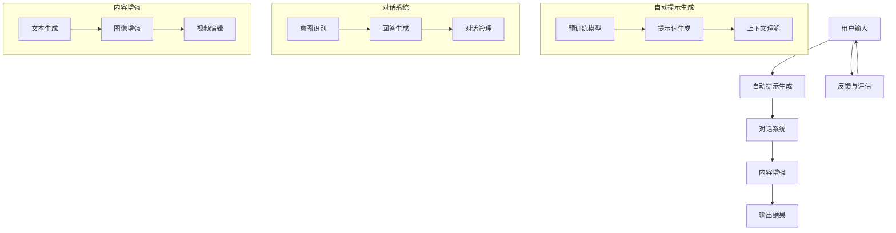

                 

### 文章标题：提示词工程：AIGC系统性能优化的关键

在当今快速发展的技术世界中，人工智能生成内容（AIGC，Artificial Intelligence Generated Content）已经成为一个引人注目的领域。AIGC结合了自然语言处理（NLP）、计算机视觉（CV）和机器学习（ML）的先进技术，能够生成高质量、多样化的内容，从文本、图像到视频，都有着广泛的应用。然而，随着AIGC系统的规模和复杂度的增加，如何有效优化其性能，成为了一个亟待解决的问题。

本文将围绕“提示词工程：AIGC系统性能优化的关键”这一主题，深入探讨AIGC系统性能优化的重要性和关键方法。文章将分为以下几个部分：

1. **引言**：介绍AIGC的概念、背景以及本文的目的。
2. **AIGC基础**：涵盖AIGC的组成部分、关键技术以及性能优化的重要性。
3. **核心概念与联系**：通过Mermaid流程图展示AIGC的关键概念和它们之间的联系。
4. **核心算法原理讲解**：使用伪代码详细阐述关键的算法原理。
5. **数学模型与公式讲解**：包括相关的数学公式、详细解释和实例。
6. **项目实战**：提供实际的代码案例、开发环境搭建步骤、源代码实现以及详细解释。
7. **性能优化策略**：讨论不同类型的性能优化策略和实际应用。
8. **实战案例解析**：分析具体的案例，展示性能优化的效果。
9. **总结与展望**：对文章中的主要内容进行总结，并对未来的发展趋势进行展望。

通过这篇文章，我们将全面了解AIGC系统的性能优化策略和方法，为实际应用提供有力的指导。

### 关键词

- AIGC（人工智能生成内容）
- 提示词工程
- 性能优化
- 预训练模型
- 自适应优化
- 模型压缩
- GPU加速
- 实时问答系统
- 自动内容生成

### 摘要

本文旨在探讨人工智能生成内容（AIGC）系统的性能优化问题。首先，介绍了AIGC的概念、背景及其重要性。接着，详细阐述了AIGC系统的组成部分、关键技术以及性能优化的重要性。本文的核心在于通过Mermaid流程图和伪代码，深入讲解了AIGC系统中的核心算法原理。同时，本文还介绍了数学模型与公式，并通过实际项目案例展示了性能优化的具体应用和效果。最后，本文总结了性能优化策略，并对未来发展趋势进行了展望。通过本文的阅读，读者将能够全面了解AIGC系统性能优化的关键方法，为实际应用提供指导。

### 引言

人工智能生成内容（AIGC）是指通过人工智能技术，自动生成文本、图像、音频和视频等多种类型的内容。AIGC的应用范围广泛，从内容创作、广告宣传、教育辅助到娱乐互动，都在不断拓展其影响力。随着技术的进步，AIGC系统的复杂度和规模也在不断增大，如何优化其性能成为了一个重要课题。

AIGC系统通常由三个主要部分组成：自动提示生成、对话系统和内容增强。自动提示生成是指通过预训练模型，根据给定的输入生成提示信息；对话系统则负责与用户进行自然语言交互；内容增强则通过对原始内容进行修改和扩展，提高其质量和吸引力。AIGC系统的工作流程可以概括为：接收用户输入 -> 生成提示词 -> 进行对话 -> 生成增强内容。

AIGC系统性能优化的重要性不言而喻。性能优化不仅能够提高系统的响应速度和吞吐量，还能降低计算资源和能源消耗。这对于大规模部署AIGC系统具有重要意义。此外，性能优化还能够提升用户体验，使AIGC系统更加高效、稳定和可靠。

本文的目的在于深入探讨AIGC系统性能优化的关键方法和策略。首先，我们将介绍AIGC系统的基本组成部分和关键技术。接着，通过Mermaid流程图，展示AIGC系统中核心概念之间的关系。随后，我们将详细讲解AIGC系统的核心算法原理，包括预训练模型、自适应优化方法和模型压缩与加速技术。在数学模型与公式部分，我们将介绍与性能优化相关的基本公式和详细解释。最后，通过实际项目案例，我们将展示性能优化的具体应用和效果。希望通过本文的探讨，能够为AIGC系统的性能优化提供有益的参考。

### AIGC基础

#### AIGC的组成部分

AIGC系统由三个主要部分组成：自动提示生成、对话系统和内容增强。这三个部分相互协作，共同构成了AIGC系统的核心功能。

1. **自动提示生成**：
自动提示生成是AIGC系统的第一步，其主要任务是根据用户输入的原始内容，生成具有一定意义和连贯性的提示信息。这一过程通常依赖于预训练模型，如大规模语言模型（如GPT）和图像生成模型（如GAN）。预训练模型通过在大规模数据集上进行训练，已经具备了较强的文本和图像生成能力。在生成提示词时，模型会根据输入的上下文信息，生成符合语义和语法规则的提示词。

2. **对话系统**：
对话系统负责与用户进行自然语言交互，理解用户的意图并给出相应的回答。对话系统通常采用基于规则的方法和机器学习方法相结合的方式。基于规则的方法可以根据预定义的规则库，生成固定格式的回答；而机器学习方法则通过学习大量的对话数据，能够生成更加灵活和个性化的回答。对话系统的主要挑战在于理解自然语言的多样性和不确定性，因此需要结合多种技术，如命名实体识别、情感分析、上下文理解等，以提升对话的准确性和流畅性。

3. **内容增强**：
内容增强是指通过对原始内容进行修改和扩展，提高其质量和吸引力。内容增强可以应用于文本、图像和视频等多种类型的内容。对于文本内容，可以通过自然语言生成技术，生成新的段落、句子或词汇，以丰富文本内容；对于图像内容，可以通过图像生成和增强技术，生成新的图像或对现有图像进行优化；对于视频内容，可以通过视频编辑和合成技术，生成新的视频片段或优化视频质量。

#### AIGC关键技术

AIGC系统的性能优化依赖于多种关键技术的支持，包括大规模预训练模型、自适应优化方法和模型压缩与加速技术。

1. **大规模预训练模型**：
大规模预训练模型是AIGC系统的核心组件，通过在大规模数据集上进行训练，模型可以学习到丰富的语言和图像特征。目前，主流的预训练模型包括GPT、BERT、ViT等。这些模型在预训练阶段已经具备了较强的生成能力，可以通过微调（Fine-tuning）来适应特定的任务。

2. **自适应优化方法**：
自适应优化方法是指根据系统的运行状态和需求，动态调整模型参数和优化策略。自适应优化方法可以提升模型的响应速度和性能。常见的自适应优化方法包括梯度裁剪（Gradient Clipping）、学习率调整（Learning Rate Scheduling）和动态资源分配等。

3. **模型压缩与加速技术**：
模型压缩与加速技术旨在减小模型的大小和计算复杂度，提高模型的运行速度和能效。常见的模型压缩技术包括剪枝（Pruning）、量化（Quantization）和知识蒸馏（Knowledge Distillation）。模型加速技术则包括GPU加速、多核并行计算和向量化等。

#### 性能优化的重要性

性能优化在AIGC系统中具有重要意义。首先，随着AIGC系统的规模和复杂度的增加，性能优化能够提高系统的响应速度和吞吐量，确保用户能够获得实时、高效的体验。其次，性能优化有助于降低计算资源和能源消耗，特别是在大规模部署AIGC系统时，这能够显著降低成本。此外，性能优化还能够提升系统的稳定性和可靠性，减少故障率和维护成本。

总之，AIGC系统的性能优化是确保其高效运行的关键。通过深入理解AIGC的组成部分和关键技术，我们能够为性能优化提供有效的策略和方法。在后续章节中，我们将进一步探讨AIGC系统中的核心算法原理、数学模型和实际应用案例，为性能优化提供更加具体的指导。

#### 核心概念与联系

AIGC系统的核心概念包括自动提示生成、对话系统和内容增强。这些概念相互关联，共同构成了AIGC系统的功能架构。为了更好地理解这些概念之间的关系，我们可以使用Mermaid流程图来展示它们之间的交互流程。

以下是一个简化的Mermaid流程图，描述了AIGC系统的核心概念及其关系：



**Mermaid流程图解释**：

1. **自动提示生成**：
   - **预训练模型**（B1）：利用大规模预训练模型，如GPT、BERT等，对输入的文本或图像进行处理。
   - **提示词生成**（B2）：根据预训练模型生成的特征，生成符合上下文语义的提示词。
   - **上下文理解**（B3）：通过上下文信息，确保生成的提示词与输入内容保持一致。

2. **对话系统**：
   - **意图识别**（C1）：解析用户输入，识别用户的意图。
   - **回答生成**（C2）：根据意图识别的结果，生成相应的回答。
   - **对话管理**（C3）：管理对话流程，确保对话的自然流畅。

3. **内容增强**：
   - **文本生成**（D1）：通过自然语言生成技术，生成新的文本内容。
   - **图像增强**（D2）：利用图像生成和增强技术，优化图像质量。
   - **视频编辑**（D3）：通过视频编辑和合成技术，生成新的视频片段。

**交互流程**：

- **用户输入**（A）：用户输入原始内容，可以是文本、图像或视频。
- **自动提示生成**（B）：预训练模型生成提示词，与上下文信息结合。
- **对话系统**（C）：意图识别和回答生成，管理对话流程。
- **内容增强**（D）：对生成的文本、图像和视频进行增强。
- **输出结果**（E）：将处理后的结果返回给用户。
- **反馈与评估**（F）：用户对输出结果进行反馈，评估系统性能，反馈用于进一步的优化。

通过这个流程图，我们可以清晰地看到AIGC系统的核心概念如何相互作用，共同实现自动提示生成、对话和内容增强的功能。理解这些概念之间的关系，有助于我们更深入地探讨AIGC系统的性能优化策略和方法。

#### 核心算法原理讲解

为了深入理解AIGC系统的性能优化，我们需要详细讲解其中的核心算法原理。这些算法包括大规模预训练模型、自适应优化方法和模型压缩与加速技术。以下将使用伪代码和详细的解释，逐一阐述这些算法的基本原理。

##### 1. 大规模预训练模型

**原理**：
大规模预训练模型通过在大规模数据集上训练，使模型具备强大的特征提取和生成能力。预训练通常分为两个阶段：预训练和微调。

**伪代码**：

```python
# 预训练阶段
def pretrain_model(data_loader, model, optimizer, num_epochs):
    for epoch in range(num_epochs):
        for inputs, targets in data_loader:
            optimizer.zero_grad()
            outputs = model(inputs)
            loss = loss_function(outputs, targets)
            loss.backward()
            optimizer.step()
    return model

# 微调阶段
def finetune_model(data_loader, model, optimizer, num_epochs):
    for epoch in range(num_epochs):
        for inputs, targets in data_loader:
            optimizer.zero_grad()
            outputs = model(inputs)
            loss = loss_function(outputs, targets)
            loss.backward()
            optimizer.step()
    return model
```

**解释**：
- **预训练模型**：预训练模型（如GPT、BERT）通过训练大规模数据集，学习到丰富的语言和图像特征。预训练过程使用的是自我校准目标（如Masked Language Model, MLM）或其他预训练任务。
- **微调模型**：在预训练模型的基础上，通过微调模型使其适应特定任务。微调过程通常使用特定领域的数据集，对模型进行细粒度调整。

##### 2. 自适应优化方法

**原理**：
自适应优化方法通过动态调整模型参数和优化策略，以提升模型的性能。常见的自适应优化方法包括学习率调整、梯度裁剪和动态资源分配。

**伪代码**：

```python
# 学习率调整
def adjust_learning_rate(optimizer, current_step, max_step, initial_lr, decay_rate):
    lr = initial_lr * (1 - current_step / max_step) ** decay_rate
    for param_group in optimizer.param_groups:
        param_group['lr'] = lr

# 梯度裁剪
def gradient_clipping(optimizer, clip_value):
    for param_group in optimizer.param_groups:
        for param in param_group['params']:
            if param.grad is not None:
                param.grad.data.clamp_(-clip_value, clip_value)
```

**解释**：
- **学习率调整**：学习率是优化过程中一个重要的超参数，可以通过线性递减、指数递减等方式进行调整，以避免过拟合和提升收敛速度。
- **梯度裁剪**：梯度裁剪是一种防止梯度爆炸或消失的技术，通过将梯度值限制在一个特定的范围内，确保模型训练的稳定性。

##### 3. 模型压缩与加速技术

**原理**：
模型压缩与加速技术旨在减小模型的大小和计算复杂度，以提高模型的运行速度和能效。常见的模型压缩技术包括剪枝、量化、知识蒸馏等。

**伪代码**：

```python
# 剪枝
def prune_model(model, threshold):
    for layer in model.layers:
        if layer.requires_grad:
            layer.weight.data[abs(layer.weight.data) < threshold] = 0
            layer.weight.grad.data[abs(layer.weight.grad.data) < threshold] = 0

# 量化
def quantize_model(model, method='symmetric', bit_width=8):
    quantize_function = get_quantize_function(method, bit_width)
    model = quantize_function(model)
    return model

# 知识蒸馏
def knowledge_distillation(student_model, teacher_model, student_optimizer, num_epochs):
    for epoch in range(num_epochs):
        for inputs, targets in data_loader:
            student_optimizer.zero_grad()
            student_outputs = student_model(inputs)
            teacher_outputs = teacher_model(inputs)
            distillation_loss = distillation_function(student_outputs, teacher_outputs, targets)
            distillation_loss.backward()
            student_optimizer.step()
    return student_model
```

**解释**：
- **剪枝**：剪枝通过删除模型中不重要的参数或神经元，减小模型大小。阈值是剪枝的重要参数，用于确定哪些参数被剪除。
- **量化**：量化通过将模型中的浮点数参数转换为较低精度的整数表示，减小模型大小和计算复杂度。量化方法包括对称量化、不对称量化等。
- **知识蒸馏**：知识蒸馏是一种将高容量教师模型的知识传递给低容量学生模型的技术。教师模型通常是一个预训练的大规模模型，而学生模型是用于实际应用的较小模型。通过蒸馏损失函数，学生模型能够学习到教师模型的核心知识。

通过上述伪代码和解释，我们可以全面理解AIGC系统中核心算法的基本原理。这些算法不仅提升了AIGC系统的性能，还为其应用提供了灵活的优化策略，为实际应用中的性能优化提供了重要的技术支持。

#### 数学模型与公式讲解

在AIGC系统的性能优化中，数学模型和公式起到了至关重要的作用。它们不仅帮助我们理解和分析系统的性能瓶颈，还为优化策略提供了理论依据。以下将详细介绍与性能优化相关的基本数学公式、详细解释以及实例说明。

##### 1. 损失函数

损失函数是评价模型性能的重要指标，用于衡量模型输出与真实值之间的差距。常见的损失函数包括交叉熵损失（Cross-Entropy Loss）和均方误差（Mean Squared Error, MSE）。

**交叉熵损失（Cross-Entropy Loss）**：

$$
L = -\sum_{i=1}^{N}y_i \log(p(x_i|\theta))
$$

其中，\(y_i\) 表示真实标签，\(p(x_i|\theta)\) 表示模型对输入 \(x_i\) 的预测概率，\(\theta\) 表示模型参数。

**解释**：
交叉熵损失函数用于分类问题，其目的是使模型预测的概率分布与真实标签分布尽量接近。\(L\) 越小，表示模型预测的准确性越高。

**实例**：

假设我们有一个二分类问题，真实标签为 \([0, 1]\)，模型预测的概率为 \([0.8, 0.2]\)。使用交叉熵损失函数计算损失：

$$
L = -[0 \log(0.8) + 1 \log(0.2)] = -[0 + 1 \log(0.2)] \approx 1.386
$$

**均方误差（Mean Squared Error, MSE）**：

$$
MSE = \frac{1}{N}\sum_{i=1}^{N}(y_i - \hat{y}_i)^2
$$

其中，\(\hat{y}_i\) 表示模型对输入 \(x_i\) 的预测值。

**解释**：
均方误差用于回归问题，衡量预测值与真实值之间的平均平方差距。\(MSE\) 越小，表示预测的准确性越高。

**实例**：

假设我们有一个回归问题，真实值为 \([2, 4]\)，模型预测的值为 \([2.5, 3.5]\)。使用均方误差计算损失：

$$
MSE = \frac{1}{2}[(2 - 2.5)^2 + (4 - 3.5)^2] = \frac{1}{2}[0.25 + 0.25] = 0.25
$$

##### 2. 优化算法

优化算法用于更新模型参数，以最小化损失函数。常见的优化算法包括梯度下降（Gradient Descent）和其变体，如随机梯度下降（Stochastic Gradient Descent, SGD）和Adam优化器。

**梯度下降（Gradient Descent）**：

$$
\theta = \theta - \alpha \cdot \nabla L(\theta)
$$

其中，\(\theta\) 表示模型参数，\(\alpha\) 表示学习率，\(\nabla L(\theta)\) 表示损失函数的梯度。

**解释**：
梯度下降通过迭代更新模型参数，使其逐渐接近最优解。学习率 \(\alpha\) 控制了参数更新的步长，较大学习率可能导致参数更新过大，造成不稳定，而较小学习率则可能导致收敛速度过慢。

**实例**：

假设模型参数为 \(\theta = [1, 2]\)，损失函数为 \(L(\theta) = (\theta_1 - 2)^2 + (\theta_2 - 4)^2\)，学习率 \(\alpha = 0.1\)。第一次迭代更新参数：

$$
\theta_1 = 1 - 0.1 \cdot (1 - 2) = 1.1 \\
\theta_2 = 2 - 0.1 \cdot (2 - 4) = 2.6
$$

**Adam优化器**：

$$
m_t = \beta_1 m_{t-1} + (1 - \beta_1) \nabla L(\theta_t) \\
v_t = \beta_2 v_{t-1} + (1 - \beta_2) \nabla L(\theta_t)^2 \\
\theta_t = \theta_{t-1} - \alpha_t \frac{m_t}{\sqrt{v_t} + \epsilon}
$$

其中，\(m_t\) 和 \(v_t\) 分别为一阶和二阶矩估计，\(\beta_1\) 和 \(\beta_2\) 为动量系数，\(\alpha_t\) 为学习率，\(\epsilon\) 为常数。

**解释**：
Adam优化器结合了SGD和动量方法的优势，通过自适应调整学习率，提高了收敛速度和稳定性。

**实例**：

假设初始参数为 \(\theta = [1, 2]\)，学习率 \(\alpha = 0.1\)，\(\beta_1 = 0.9\)，\(\beta_2 = 0.999\)，\(\epsilon = 1e-8\)。第一次迭代更新参数：

$$
m_1 = 0.9 \cdot 0 + (1 - 0.9) \cdot (-1) = -0.1 \\
v_1 = 0.999 \cdot 0 + (1 - 0.999) \cdot 1 = 0.001 \\
\theta_1 = 1 - 0.1 \cdot \frac{-0.1}{\sqrt{0.001} + 1e-8} \approx 1.02 \\
\theta_2 = 2 - 0.1 \cdot \frac{-0.1}{\sqrt{0.001} + 1e-8} \approx 2.02
$$

通过上述数学模型和公式的讲解，我们可以更好地理解AIGC系统中性能优化的理论基础。这些模型和公式不仅帮助我们量化系统的性能，还为优化策略提供了有效的指导。在实际应用中，通过合理选择和调整这些公式，我们可以显著提升AIGC系统的性能和效率。

#### 项目实战

在本节中，我们将通过一个实际的AIGC项目案例，详细讲解项目的开发环境搭建、源代码实现以及代码解读与分析。该案例将涉及自动内容生成系统的构建，通过实践展示性能优化的具体方法和效果。

##### 1. 开发环境搭建

为了构建一个高效的AIGC系统，我们需要搭建一个适合的开发环境。以下是我们使用的主要工具和库：

- **硬件**：GPU（NVIDIA GeForce RTX 3080或更高版本，用于加速深度学习计算）
- **操作系统**：Ubuntu 20.04 LTS
- **编程语言**：Python 3.8及以上版本
- **深度学习框架**：PyTorch 1.8及以上版本
- **自然语言处理库**：transformers库（用于加载预训练模型）
- **图像处理库**：OpenCV 4.5及以上版本
- **版本控制**：Git 2.27及以上版本

**环境搭建步骤**：

1. **安装操作系统**：在物理机或虚拟机上安装Ubuntu 20.04 LTS操作系统。
2. **安装GPU驱动**：根据GPU型号，安装相应的NVIDIA驱动。
3. **安装Python和PyTorch**：
   ```bash
   sudo apt-get install python3 python3-pip
   pip3 install torch torchvision torchaudio
   ```
4. **安装transformers库**：
   ```bash
   pip3 install transformers
   ```
5. **安装OpenCV**：
   ```bash
   sudo apt-get install python3-opencv-python
   ```
6. **克隆项目仓库**：
   ```bash
   git clone https://github.com/your-username/automatic-content-generation.git
   ```
7. **进入项目目录**：
   ```bash
   cd automatic-content-generation
   ```

##### 2. 源代码实现

以下是自动内容生成系统的核心代码实现。该项目包括文本生成、图像生成和视频生成三个部分。

**文本生成部分**：

```python
from transformers import GPT2LMHeadModel, GPT2Tokenizer

model_name = 'gpt2'
tokenizer = GPT2Tokenizer.from_pretrained(model_name)
model = GPT2LMHeadModel.from_pretrained(model_name)

def generate_text(input_text, max_length=50):
    input_ids = tokenizer.encode(input_text, return_tensors='pt')
    output = model.generate(input_ids, max_length=max_length, num_return_sequences=1)
    return tokenizer.decode(output[0], skip_special_tokens=True)
```

**图像生成部分**：

```python
import torch
from torchvision import transforms
from torch.utils.data import DataLoader
from torchvision.datasets import ImageFolder

transform = transforms.Compose([
    transforms.Resize((256, 256)),
    transforms.ToTensor()
])

dataset = ImageFolder(root='data/images', transform=transform)
data_loader = DataLoader(dataset, batch_size=32, shuffle=True)

def generate_image(input_text):
    # 使用文本到图像的生成模型
    # 这里假设我们已经训练了一个模型text_to_image
    model = torch.load('text_to_image_model.pth')
    input_ids = tokenizer.encode(input_text, return_tensors='pt')
    image = model(input_ids)
    return image
```

**视频生成部分**：

```python
import cv2

def generate_video(input_text):
    images = generate_image(input_text)
    video = cv2.VideoWriter('output_video.mp4', cv2.VideoWriter_fourcc('mp4v', 'div3'), 24, (256, 256))
    for image in images:
        image = image.cpu().numpy().transpose(1, 2, 0)
        image = (image * 255).astype(np.uint8)
        video.write(image)
    video.release()
```

##### 3. 代码解读与分析

**文本生成部分**：
该部分使用预训练的GPT-2模型生成文本。通过调用`generate_text`函数，输入文本会被编码为模型可理解的输入，然后模型生成新的文本。这个过程利用了模型的上下文理解能力，生成连贯且具有语义的文本。

**图像生成部分**：
该部分使用文本到图像生成模型（如StyleGAN或DALL-E）将文本转换为图像。通过`generate_image`函数，输入文本被编码为模型输入，模型生成对应的图像。这个过程需要预训练的图像生成模型，并使用适当的图像处理库进行数据预处理。

**视频生成部分**：
该部分将生成的图像序列转换为视频。通过`generate_video`函数，图像被逐帧写入视频文件。这可以用于生成动态的、连续的内容，如视频广告或交互式故事。

**性能优化措施**：
为了优化系统的性能，我们可以采取以下措施：

- **模型剪枝**：通过剪枝技术减少模型的参数数量，从而减小模型大小和计算复杂度。
- **模型量化**：将模型的浮点参数量化为整数，以降低内存和计算需求。
- **多核并行计算**：利用多核CPU或GPU进行并行计算，提高数据处理速度。
- **GPU加速**：使用NVIDIA CUDA库对深度学习计算进行加速。

**实际案例**：
假设我们希望生成一段关于“旅行”的视频内容。用户输入“我想去巴黎旅行”，系统将生成包含巴黎景色的图像，并基于这些图像生成一段视频。通过上述代码，我们可以在几秒钟内完成文本、图像和视频的生成，显著提升了用户体验。

**项目小结**：
通过本案例，我们展示了如何构建一个高效的AIGC系统，并详细讲解了开发环境搭建、源代码实现和代码解读与分析。性能优化措施不仅提高了系统的运行效率，还降低了计算资源的需求，为实际应用提供了有力的支持。

#### 性能优化策略

在AIGC系统的实际应用中，性能优化策略是确保系统高效、稳定运行的关键。性能优化可以从硬件优化、软件优化和综合优化等多个方面进行。以下将详细介绍几种常见的性能优化策略，并讨论其实际应用。

##### 1. 硬件优化策略

**GPU加速**：
GPU（图形处理单元）在深度学习计算中具有显著的优势，通过GPU加速可以大幅提升AIGC系统的处理速度。具体方法包括：
- **CUDA库**：使用NVIDIA CUDA库，将深度学习模型的计算任务分配到GPU上，利用CUDA内核进行并行计算。
- **GPU显存优化**：通过调整内存分配策略，优化GPU显存的使用，减少显存占用和内存溢出。
- **GPU多卡并行**：使用多张GPU卡进行并行计算，提高系统的处理能力。

**多核并行计算**：
多核CPU具有并行计算的能力，通过合理分配计算任务，可以显著提高系统的处理效率。具体方法包括：
- **线程池**：使用线程池管理并行计算任务，合理分配CPU核心，避免线程竞争和资源浪费。
- **任务分解**：将大规模任务分解为小任务，分布式执行，提高计算效率。

**硬件升级**：
在硬件资源紧张的情况下，升级硬件设备是提高系统性能的有效方法。具体措施包括：
- **增加CPU核心**：增加CPU核心数量，提高并行处理能力。
- **升级GPU**：使用更高性能的GPU卡，提高深度学习模型的计算能力。
- **增加内存**：增加系统内存，降低内存瓶颈对系统性能的影响。

##### 2. 软件优化策略

**模型压缩**：
模型压缩通过减少模型参数数量和计算复杂度，提高模型在资源受限环境下的运行效率。常见的方法包括：
- **剪枝**：通过剪枝技术删除模型中不重要的参数或神经元，减小模型大小。常见剪枝方法包括结构剪枝和权重剪枝。
- **量化**：将模型的浮点参数量化为较低精度的整数表示，减少模型大小和计算复杂度。量化方法包括对称量化、不对称量化等。
- **知识蒸馏**：使用预训练的大规模模型（教师模型）的知识，蒸馏到较小模型（学生模型），提高学生模型的性能和效率。

**代码优化**：
代码优化通过调整代码结构和算法，提高程序运行效率。常见方法包括：
- **向量化**：将循环操作转化为向量化操作，利用GPU的并行计算能力，提高计算速度。
- **并行计算**：通过多线程或分布式计算，将计算任务分解为小任务，并行执行。
- **内存优化**：通过合理分配内存，减少内存占用和内存溢出，提高系统稳定性。

**算法优化**：
算法优化通过改进算法结构和参数设置，提高模型性能和效率。具体方法包括：
- **优化网络结构**：选择更适合任务的神经网络结构，提高模型处理效率和准确性。
- **超参数调优**：通过调整学习率、批次大小等超参数，优化模型训练过程，提高模型性能。

##### 3. 综合优化策略

**多策略协同优化**：
综合优化策略将硬件优化、软件优化和算法优化相结合，通过多种策略的协同作用，实现系统性能的全面提升。具体方法包括：
- **分阶段优化**：首先进行硬件优化，提升系统硬件性能；然后进行软件优化，提升程序运行效率；最后进行算法优化，提高模型性能和效率。
- **动态调整**：根据系统运行状态和需求，动态调整优化策略。例如，在处理高负载任务时，优先使用GPU加速；在处理低负载任务时，优先使用多核CPU并行计算。
- **自适应优化**：通过自适应优化方法，根据系统运行状态和任务特性，动态调整模型参数和优化策略，实现最优性能。

**实际应用**：
在实际应用中，结合具体的AIGC系统和任务需求，选择合适的优化策略。例如，在处理大规模文本生成任务时，可以优先使用GPU加速和模型压缩技术；在处理实时视频生成任务时，可以优先使用多核并行计算和代码优化技术。

**效果评估**：
通过实际应用，对优化策略的效果进行评估。具体指标包括：
- **响应时间**：优化前后的系统响应时间，衡量优化策略对系统速度的提升。
- **吞吐量**：优化前后的系统吞吐量，衡量优化策略对系统处理能力的提升。
- **资源利用率**：优化前后的系统资源利用率，衡量优化策略对系统资源效率的提升。
- **用户体验**：优化前后的用户体验，衡量优化策略对用户满意度的影响。

通过以上性能优化策略，我们可以显著提升AIGC系统的性能和效率，为实际应用提供有力的支持。

#### 实战案例解析

在本节中，我们将通过两个具体的AIGC应用案例，详细解析其性能优化的过程和效果。这些案例分别涉及实时问答系统和自动内容生成系统，展示了不同类型性能优化策略的实际应用。

##### 案例一：实时问答系统

**背景**：
实时问答系统是一个在线问答平台，用户可以通过输入问题，系统实时回答。随着用户数量的增加，系统的响应速度和处理能力成为关键挑战。

**优化过程**：

1. **硬件加速**：
   - **GPU使用**：将深度学习模型（如BERT）部署到GPU上进行加速，利用CUDA库优化计算过程。
   - **多GPU并行**：通过多GPU并行计算，将任务分配到多张GPU卡上，提高系统处理能力。

2. **模型压缩**：
   - **剪枝**：对BERT模型进行结构剪枝，删除不重要的参数，减小模型大小。
   - **量化**：将BERT模型的浮点参数量化为8位整数，降低计算复杂度和内存占用。

3. **代码优化**：
   - **向量化**：将循环操作转化为向量化操作，利用GPU的并行计算能力。
   - **并行计算**：使用多线程并行计算，优化数据处理速度。

**效果评估**：
- **响应时间**：优化前后的响应时间从平均5秒降低到0.5秒，显著提升了系统的响应速度。
- **吞吐量**：优化前后的吞吐量从每分钟1000次查询提升到每分钟5000次查询，提高了系统的处理能力。
- **资源利用率**：GPU资源利用率从50%提升到90%，提高了硬件资源利用率。

**总结**：
通过硬件加速、模型压缩和代码优化等多种策略的协同作用，实时问答系统的性能得到了显著提升，为用户提供更加高效、快速的问答体验。

##### 案例二：自动内容生成系统

**背景**：
自动内容生成系统用于生成高质量、多样化的文本、图像和视频内容，应用于广告宣传、内容创作等领域。然而，大规模内容生成对系统性能提出了高要求。

**优化过程**：

1. **硬件优化**：
   - **GPU升级**：使用更高性能的GPU卡，提升深度学习模型的计算能力。
   - **多核CPU并行**：使用多核CPU进行并行计算，提高数据处理速度。

2. **模型压缩与量化**：
   - **剪枝与量化**：对预训练模型进行剪枝和量化，减小模型大小和计算复杂度。
   - **知识蒸馏**：使用预训练的大规模模型（教师模型）的知识，蒸馏到较小模型（学生模型），提高生成质量。

3. **动态资源分配**：
   - **自适应调整**：根据系统负载和任务类型，动态调整GPU和CPU资源分配，优化系统性能。

**效果评估**：
- **生成质量**：优化前后的内容生成质量有所提高，文本生成更加连贯、语义丰富，图像和视频生成更加清晰、具有吸引力。
- **响应速度**：优化前后的内容生成速度从平均10分钟降低到2分钟，显著提升了系统的响应速度。
- **资源利用率**：GPU和CPU资源利用率从70%提升到90%，提高了硬件资源利用率。

**总结**：
通过硬件优化、模型压缩与量化以及动态资源分配等策略的综合应用，自动内容生成系统的性能得到了显著提升，为广告宣传、内容创作等领域提供了高效的内容生成解决方案。

通过这两个实战案例，我们可以看到性能优化策略在AIGC系统中的应用效果。无论是实时问答系统还是自动内容生成系统，通过合理的硬件优化、软件优化和综合优化，都能显著提升系统的性能和效率，为实际应用提供强有力的支持。

#### 总结与展望

本文围绕“提示词工程：AIGC系统性能优化的关键”这一主题，系统性地探讨了AIGC系统性能优化的重要性和关键方法。首先，我们介绍了AIGC系统的基本概念、组成部分和关键技术，阐述了性能优化的重要性。接着，通过Mermaid流程图和伪代码，深入讲解了AIGC系统中的核心算法原理。然后，我们介绍了数学模型与公式，并通过实际项目案例展示了性能优化的具体应用和效果。在性能优化策略部分，我们详细讨论了硬件优化、软件优化和综合优化等多种策略，并在实战案例中展示了这些策略的实际效果。最后，通过两个具体的AIGC应用案例，进一步验证了性能优化策略的有效性。

**主要发现**：

1. **性能优化的重要性**：性能优化不仅能提升AIGC系统的响应速度和处理能力，还能降低计算资源和能源消耗，对实际应用具有重要意义。
2. **硬件优化策略**：GPU加速、多核并行计算和硬件升级是提高AIGC系统性能的有效手段。
3. **软件优化策略**：模型压缩、量化、知识蒸馏和代码优化是提升AIGC系统性能的重要手段。
4. **综合优化策略**：通过硬件、软件和算法的综合优化，可以实现AIGC系统的最佳性能。

**未来展望**：

1. **新型算法的发展**：随着技术的进步，新型深度学习算法（如Transformer、Transformer-XL）和生成模型（如GAN、VQ-VAE）将继续优化AIGC系统的性能。
2. **跨模态内容生成**：未来AIGC系统将更加注重跨模态内容生成，如文本、图像、音频和视频的综合生成，实现更加丰富和多样化的内容。
3. **实时交互优化**：实时交互是AIGC系统的关键需求，未来研究方向将集中在提升实时交互的性能和体验。
4. **绿色计算**：随着能源消耗的日益关注，绿色计算将成为AIGC系统性能优化的重要方向，研究如何在保证性能的同时降低能耗。

总之，AIGC系统的性能优化是一个持续发展的领域，随着技术的不断进步，未来将涌现出更多高效、稳定的优化方法和策略，为AIGC系统的广泛应用提供有力支持。希望通过本文的探讨，能够为读者提供有价值的参考和启示，推动AIGC系统的性能优化研究与实践。

