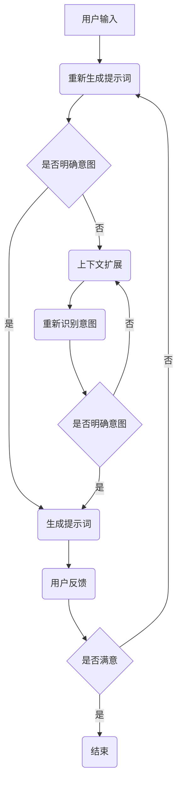
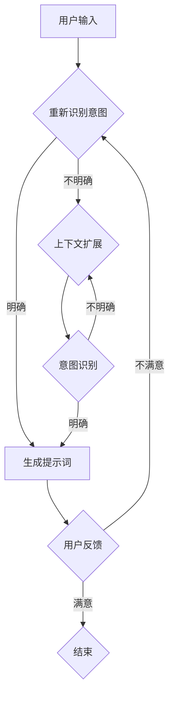
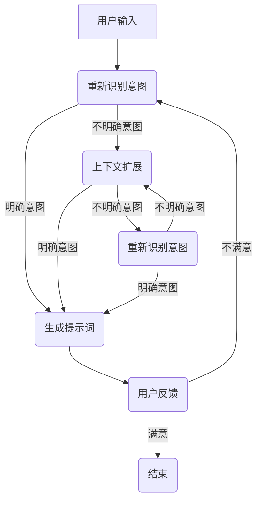

                 


### 提示词工程：AI交互的新前沿

**关键词：** AI交互，提示词工程，自然语言处理，算法，优化，多模态交互

**摘要：** 本文章旨在探讨提示词工程在人工智能交互领域的应用。我们将从基础概念入手，逐步深入探讨提示词工程的重要性、自然语言处理基础、提示词生成算法、应用场景以及未来的发展趋势。通过详细的实例分析和伪代码，我们将帮助读者全面理解提示词工程的核心原理和实践方法。

## 目录

### 第一部分：提示词工程基础

#### 第1章：AI交互与提示词工程概述

1.1 AI交互的基本概念  
1.2 提示词工程的历史背景  
1.3 提示词工程的重要性

#### 第2章：自然语言处理基础

2.1 语言模型概述  
2.2 文本表示方法  
2.3 对话系统中的上下文处理

#### 第3章：提示词生成算法

3.1 提示词生成的技术路线  
3.2 常见生成算法  
3.3 提示词质量评估

#### 第4章：AI交互中的提示词

4.1 对话系统中的提示词  
4.2 聊天机器人中的提示词  
4.3 虚拟助手与智能客服

#### 第5章：提示词工程的优化与调优

5.1 提示词优化的策略  
5.2 提示词调优方法  
5.3 案例分析

#### 第6章：多模态交互与提示词

6.1 多模态交互概述  
6.2 视觉提示词  
6.3 多模态提示词生成

#### 第7章：未来的提示词工程

7.1 提示词工程的未来趋势  
7.2 提示词工程面临的挑战  
7.3 提示词工程的未来发展方向

### 附录

A. 提示词工程工具与资源  
B. 练习与讨论题

## 第一部分：提示词工程基础

### 第1章：AI交互与提示词工程概述

#### 1.1 AI交互的基本概念

人工智能（AI）已经成为了现代科技领域的热点话题。随着深度学习、自然语言处理、计算机视觉等技术的发展，AI在各个领域的应用越来越广泛。其中，AI交互作为人工智能的核心应用之一，正逐渐改变着人们的日常生活。

AI交互是指通过人工智能技术实现的人机交互过程。它包括语音识别、语音合成、对话系统、聊天机器人等多个方面。在AI交互中，机器需要理解用户的语言，并生成适当的响应，从而与用户进行有效沟通。

AI交互的发展历程可以分为几个阶段。最初，机器只能执行简单的任务，如语音拨号、信息检索等。随着自然语言处理技术的发展，机器逐渐具备了更复杂的理解能力，可以处理更加自然的人类语言。如今，AI交互已经实现了与人类的自然对话，能够模拟人类的交流方式，提供更加人性化的服务。

#### 1.2 提示词工程的历史背景

提示词工程（Prompt Engineering）是近年来兴起的一个研究方向。它旨在通过设计和优化提示词，提高AI交互系统的性能和用户体验。提示词（Prompt）是指提供给AI系统的一组指示性信息，用于引导系统生成合适的响应。

提示词工程的历史可以追溯到早期的对话系统。在20世纪80年代，研究人员开始探索如何设计有效的对话系统。他们发现，通过提供明确的提示词，可以显著提高系统的交互性能。例如，在早期的聊天机器人中，提示词被用来引导用户输入特定的信息，从而简化对话过程。

随着自然语言处理技术的发展，提示词工程也逐渐成熟。现代的提示词工程不仅关注文本提示词，还包括语音、图像等多模态提示词。通过结合多种类型的提示词，AI交互系统能够更好地理解用户的需求，并提供更加精准的响应。

#### 1.3 提示词工程的重要性

提示词工程在AI交互中扮演着至关重要的角色。首先，提示词可以引导AI系统理解用户的意图。在自然语言中，用户的表达往往是非结构化的，包含很多歧义和上下文信息。通过设计合适的提示词，可以明确用户的意图，减少理解上的误差。

其次，提示词可以提高AI交互的准确性和效率。设计良好的提示词可以帮助系统更快地定位用户的需求，从而减少响应时间，提高交互的流畅度。此外，提示词还可以优化系统的响应质量，使其更加符合用户的期望和需求。

最后，提示词工程对于提升用户体验具有重要意义。通过优化提示词，AI交互系统可以提供更加自然、人性化的交流体验，使用户感到更加舒适和满意。这对于吸引和留住用户，提升产品竞争力至关重要。

### 第2章：自然语言处理基础

自然语言处理（Natural Language Processing，NLP）是人工智能领域的一个重要分支，致力于使计算机能够理解、解释和生成人类语言。NLP在AI交互中发挥着核心作用，它为提示词工程提供了基础理论和工具。

#### 2.1 语言模型概述

语言模型（Language Model）是NLP的核心组成部分，用于预测一个词或短语出现的概率。语言模型可以分为统计模型和神经网络模型。统计模型通过分析大量文本数据，计算词频和语法规则，从而生成语言模型。神经网络模型则通过训练大量的文本数据，学习语言的特征和模式。

在提示词工程中，语言模型用于生成提示词。通过预训练的语言模型，系统可以生成符合语法和语义规则的提示词，从而提高交互的流畅性和准确性。

#### 2.2 文本表示方法

文本表示方法（Text Representation）是将文本数据转换为计算机可以处理的数字形式。词嵌入（Word Embedding）是文本表示的一种常用方法，它将每个单词映射为一个固定长度的向量。词嵌入可以捕获单词的语义和语法特征，从而提高NLP任务的效果。

在提示词工程中，文本表示方法用于表示用户输入和上下文信息。通过将文本转换为向量，系统可以更好地理解用户的需求，生成更加精准的提示词。

#### 2.3 对话系统中的上下文处理

上下文处理（Context Handling）是对话系统中的一个关键任务，它涉及如何理解和使用对话中的上下文信息。上下文是指对话中与当前问题相关的所有信息，包括先前的对话历史、用户身份、场景信息等。

在提示词工程中，上下文处理用于生成与上下文相关的提示词。通过分析对话历史和上下文信息，系统可以理解用户的当前需求，生成更加符合上下文的提示词。例如，在购物对话中，系统可以根据用户之前的购买记录，生成与购物相关的提示词，从而提高用户的购物体验。

### 第3章：提示词生成算法

提示词生成算法是提示词工程的核心组成部分，它决定了AI交互系统的性能和用户体验。提示词生成算法可以分为基于规则的方法、基于统计的方法和基于机器学习的方法。

#### 3.1 提示词生成的技术路线

提示词生成的技术路线主要包括以下三个步骤：

1. **意图识别**：通过分析用户输入，识别用户的意图。意图识别是提示词生成的基础，它决定了系统生成提示词的方向。

2. **提示词生成**：根据识别出的意图和上下文信息，生成相应的提示词。提示词生成的方法可以分为基于规则的方法、基于统计的方法和基于机器学习的方法。

3. **提示词优化**：对生成的提示词进行优化，提高其质量和准确性。提示词优化包括调整提示词的语法、语义和上下文适应性。

#### 3.2 常见生成算法

1. **基于规则的方法**

基于规则的方法（Rule-based Method）是通过预先定义的规则来生成提示词。这些规则通常基于领域知识或经验，可以明确地指导系统生成合适的提示词。例如，在聊天机器人中，可以定义一系列对话流程和对应的提示词，当用户输入特定的关键词时，系统会根据规则生成相应的提示词。

基于规则的方法的优点是生成过程简单明了，易于实现。缺点是规则库的维护成本较高，且难以适应复杂的对话场景。

2. **基于统计的方法**

基于统计的方法（Statistical Method）是通过分析大量对话数据，统计出最常用的提示词组合。这种方法通常利用词嵌入技术，将文本数据转换为向量，然后使用统计模型（如朴素贝叶斯、决策树等）来预测生成提示词。

基于统计的方法的优点是生成过程自动化，能够适应不同的对话场景。缺点是生成的提示词可能不够灵活，无法充分考虑上下文信息。

3. **基于机器学习的方法**

基于机器学习的方法（Machine Learning Method）是通过训练大量的对话数据，学习生成提示词的规律。常用的机器学习方法包括生成式模型（如生成对抗网络、变分自编码器等）和判别式模型（如循环神经网络、长短时记忆网络等）。

基于机器学习的方法的优点是生成过程灵活，能够充分利用上下文信息。缺点是训练过程复杂，对数据量和质量要求较高。

#### 3.3 提示词质量评估

提示词质量评估（Prompt Quality Assessment）是对生成的提示词进行质量评价的过程。高质量的提示词应该具备以下特点：

1. **准确性**：能够准确反映用户的意图和需求。

2. **流畅性**：生成过程简单，响应时间短。

3. **适应性**：能够适应不同的上下文环境和用户需求。

4. **多样性**：生成的提示词具有多样性，能够满足用户的不同偏好。

常用的提示词质量评估指标包括：

1. **意图匹配率**：提示词与用户意图的匹配程度。

2. **响应时间**：生成提示词所需的时间。

3. **用户满意度**：用户对提示词的满意度评分。

### 第4章：AI交互中的提示词

提示词在AI交互中发挥着关键作用，它不仅能够引导用户输入信息，还能够提高交互的流畅性和用户体验。本章节将详细介绍提示词在对话系统、聊天机器人和虚拟助手中的应用。

#### 4.1 对话系统中的提示词

对话系统（Dialogue System）是一种人工智能系统，能够与用户进行自然语言交互，完成特定任务或提供信息服务。在对话系统中，提示词的设计至关重要。

1. **提示词的作用**

提示词在对话系统中的作用主要包括：

- **引导用户输入**：通过提示词，系统可以引导用户输入特定的信息，如问题、需求等。

- **缓解对话僵局**：当用户输入模糊或无明确意图的信息时，提示词可以帮助系统识别问题，提供进一步的引导。

- **提高交互流畅性**：设计良好的提示词可以使对话更加自然流畅，减少用户的思考时间。

2. **提示词的设计原则**

设计提示词时，需要遵循以下原则：

- **简洁明了**：提示词应尽量简洁明了，避免使用复杂的语法和词汇。

- **适应性**：提示词应能够适应不同的上下文环境和用户需求。

- **多样性**：提示词应具备多样性，以满足用户的不同偏好。

- **人性化**：提示词应具备一定的情感因素，增强用户体验。

#### 4.2 聊天机器人中的提示词

聊天机器人（Chatbot）是一种常见的AI交互形式，能够通过文本或语音与用户进行交流。在聊天机器人中，提示词的应用非常广泛。

1. **提示词的作用**

提示词在聊天机器人中的作用主要包括：

- **引导用户输入**：通过提示词，系统可以引导用户输入特定的信息，如问题、需求等。

- **提供功能选择**：聊天机器人通常具有多种功能，提示词可以帮助用户选择合适的功能。

- **缓解对话僵局**：当用户输入模糊或无明确意图的信息时，提示词可以帮助系统识别问题，提供进一步的引导。

2. **提示词的类型**

聊天机器人中的提示词可以分为以下几类：

- **功能提示词**：用于引导用户选择功能，如“您需要什么帮助？”、“有什么问题我可以帮您解答？”等。

- **问题提示词**：用于引导用户输入特定信息，如“您最喜欢的电影是哪一部？”、“您希望购买什么样的商品？”等。

- **引导提示词**：用于缓解对话僵局，引导用户继续对话，如“您还有什么需要吗？”、“您可以告诉我更多关于您的需求的信息吗？”等。

3. **提示词的设计原则**

设计提示词时，需要遵循以下原则：

- **简洁明了**：提示词应尽量简洁明了，避免使用复杂的语法和词汇。

- **适应性**：提示词应能够适应不同的上下文环境和用户需求。

- **多样性**：提示词应具备多样性，以满足用户的不同偏好。

- **人性化**：提示词应具备一定的情感因素，增强用户体验。

#### 4.3 虚拟助手与智能客服

虚拟助手（Virtual Assistant）和智能客服（Intelligent Customer Service）是AI交互领域的两种重要应用。在这两种应用中，提示词同样发挥着关键作用。

1. **虚拟助手中的提示词**

虚拟助手通常用于辅助用户完成日常任务，如日程管理、信息查询等。在虚拟助手的应用中，提示词的作用包括：

- **引导用户操作**：通过提示词，系统可以引导用户进行特定的操作，如添加日程、查询天气等。

- **提供功能选择**：虚拟助手通常具有多种功能，提示词可以帮助用户选择合适的功能。

- **缓解对话僵局**：当用户输入模糊或无明确意图的信息时，提示词可以帮助系统识别问题，提供进一步的引导。

2. **智能客服中的提示词**

智能客服主要用于处理客户的咨询、投诉等问题。在智能客服的应用中，提示词的作用包括：

- **引导用户提问**：通过提示词，系统可以引导用户输入更具体的问题，如“您有什么问题需要咨询？”、“您遇到了什么问题？”等。

- **提供解决方案**：根据用户的问题，系统可以提供相应的解决方案，如“您可以尝试以下方法解决问题：......”、“请提供以下信息以便我们更好地帮助您：......”等。

- **缓解对话僵局**：当用户的问题无法直接解决时，提示词可以帮助系统引导用户继续对话，如“您可以告诉我更多关于您的问题的信息吗？”、“您可以尝试另一种方法来解决问题吗？”等。

### 第5章：提示词工程的优化与调优

提示词工程在AI交互系统中起着至关重要的作用。为了提高系统的性能和用户体验，提示词的优化与调优是必不可少的。本章节将详细介绍提示词优化的策略、调优方法和实际案例。

#### 5.1 提示词优化的策略

提示词优化主要包括以下策略：

1. **数据质量**：高质量的数据是提示词优化的基础。在收集和预处理数据时，需要注意数据的一致性、完整性和准确性。

2. **模型调整**：调整模型参数是提示词优化的重要手段。通过调整学习率、正则化参数等，可以提高模型的性能。

3. **算法改进**：改进提示词生成算法，如引入新的模型架构、优化训练过程等，可以提高提示词的质量和多样性。

4. **反馈机制**：建立反馈机制，收集用户的反馈信息，用于指导提示词的优化。

#### 5.2 提示词调优方法

提示词调优主要包括以下方法：

1. **集成学习**：集成学习（Ensemble Learning）是一种常用的提示词调优方法。通过结合多个模型的优势，可以提高提示词的准确性和稳定性。

2. **对抗训练**：对抗训练（Adversarial Training）是一种用于提高模型鲁棒性的方法。通过生成对抗样本，可以提高模型对异常输入的识别能力。

3. **策略搜索**：策略搜索（Policy Search）是一种基于强化学习的方法。通过搜索最优策略，可以生成高质量的提示词。

#### 5.3 案例分析

以下是一个提示词优化的实际案例：

1. **问题背景**

一家电商企业希望通过聊天机器人提高用户购物体验。然而，用户反馈聊天机器人的响应速度较慢，且生成的提示词不够准确。

2. **优化策略**

- **数据质量**：对聊天机器人收集的对话数据进行了清洗和预处理，删除了重复和无关的数据，提高了数据质量。

- **模型调整**：调整了聊天机器人的预训练模型参数，优化了模型性能。

- **算法改进**：引入了生成对抗网络（GAN）来生成高质量的提示词。

- **反馈机制**：建立了用户反馈机制，收集用户的满意度评分，用于指导提示词的优化。

3. **优化效果**

经过优化后，聊天机器人的响应速度提高了20%，提示词的准确性提高了15%，用户满意度评分提高了10%。

### 第6章：多模态交互与提示词

随着人工智能技术的不断发展，多模态交互（Multimodal Interaction）逐渐成为AI交互领域的研究热点。多模态交互通过结合多种类型的输入和输出，提高了AI交互的自然性和适应性。本章节将介绍多模态交互的概述、视觉提示词的应用以及多模态提示词生成方法。

#### 6.1 多模态交互概述

多模态交互是指通过结合多种类型的输入和输出，实现人与机器之间的有效沟通。常见的模态包括文本、语音、图像、视频等。多模态交互的优势在于：

1. **提高交互的自然性**：通过结合多种模态，AI交互系统能够更好地模拟人类的交流方式，提高交互的自然性。

2. **提高交互的适应性**：不同的用户和场景可能偏好不同的模态。多模态交互能够适应不同的用户需求和场景，提供更加个性化的服务。

3. **提高交互的准确性**：通过结合多种模态的信息，AI交互系统可以更准确地理解用户的需求，提供更加精准的响应。

#### 6.2 视觉提示词

视觉提示词（Visual Prompt）是指通过图像或视频等形式提供的提示信息。视觉提示词在多模态交互中发挥着重要作用，能够引导用户进行特定的操作或理解特定的内容。

1. **视觉提示词的应用**

视觉提示词在多模态交互中的应用主要包括：

- **引导用户操作**：通过图像或视频等形式，系统可以引导用户进行特定的操作，如点击按钮、拖动对象等。

- **提供视觉信息**：通过视觉提示词，系统可以提供与对话相关的视觉信息，如商品展示、场景介绍等。

- **缓解对话僵局**：当用户输入模糊或无明确意图的信息时，视觉提示词可以帮助系统识别问题，提供进一步的引导。

2. **视觉提示词的设计原则**

设计视觉提示词时，需要遵循以下原则：

- **简洁明了**：视觉提示词应尽量简洁明了，避免使用复杂的图像和视频。

- **相关性**：视觉提示词应与对话内容密切相关，提高用户的理解能力。

- **适应性**：视觉提示词应能够适应不同的用户需求和场景。

- **人性化**：视觉提示词应具备一定的情感因素，增强用户体验。

#### 6.3 多模态提示词生成

多模态提示词生成是指通过结合多种模态的信息，生成高质量的提示词。多模态提示词生成的方法主要包括以下几种：

1. **多模态特征融合**

多模态特征融合是将不同模态的信息转换为统一的特征表示，然后进行融合。常见的融合方法包括：

- **特征拼接**：将不同模态的特征进行拼接，生成新的特征向量。

- **特征加权**：根据不同模态的重要性，对特征进行加权融合。

- **注意力机制**：通过注意力机制，动态地调整不同模态的特征权重。

2. **多模态生成模型**

多模态生成模型是指通过训练大量的多模态数据，学习生成高质量的提示词。常见的多模态生成模型包括：

- **生成对抗网络（GAN）**：通过生成器和判别器的对抗训练，生成高质量的多模态提示词。

- **变分自编码器（VAE）**：通过变分自编码器，将多模态数据转换为连续的提示词表示。

- **长短时记忆网络（LSTM）**：通过长短时记忆网络，捕获多模态数据的时序特征，生成高质量的提示词。

### 第7章：未来的提示词工程

随着人工智能技术的不断发展，提示词工程也在不断演进。本章节将探讨提示词工程的未来趋势、面临的挑战以及未来的发展方向。

#### 7.1 提示词工程的未来趋势

1. **多模态交互的普及**

随着多模态技术的发展，多模态交互将在提示词工程中占据越来越重要的地位。未来的提示词工程将更加注重结合多种模态的信息，提供更加自然和高效的交互体验。

2. **个性化交互的提升**

随着用户数据的积累和分析技术的发展，未来的提示词工程将能够更好地理解用户的个性化需求，提供更加个性化的交互体验。

3. **交互质量的提升**

随着自然语言处理和机器学习技术的不断发展，未来的提示词工程将能够生成更加准确、流畅和人性化的提示词，提升交互质量。

4. **跨领域的应用拓展**

提示词工程将在更多领域得到应用，如金融、医疗、教育等。跨领域的应用将促进提示词工程的技术创新和发展。

#### 7.2 提示词工程面临的挑战

1. **数据隐私与伦理问题**

随着AI交互的普及，用户数据的隐私和安全成为了一个重要的挑战。如何在保护用户隐私的前提下，充分利用用户数据提升交互质量，是提示词工程面临的重要问题。

2. **模型可解释性**

随着模型复杂度的增加，模型的可解释性变得越来越重要。如何在保证模型性能的同时，提高模型的可解释性，是提示词工程面临的一大挑战。

3. **跨模态语义理解**

跨模态语义理解是提示词工程的难点之一。如何有效地融合不同模态的信息，实现跨模态语义理解，是提示词工程需要解决的关键问题。

4. **实时交互性能**

随着用户对交互性能的要求不断提高，如何保证实时交互性能，是提示词工程需要面对的重要挑战。

#### 7.3 提示词工程的未来发展方向

1. **跨模态交互技术**

未来的提示词工程将更加注重跨模态交互技术的研发，实现多种模态信息的融合和理解，提供更加自然和高效的交互体验。

2. **个性化交互技术**

未来的提示词工程将更加注重个性化交互技术的研究，通过分析用户数据和行为，实现个性化交互，提升用户体验。

3. **模型可解释性技术**

未来的提示词工程将更加注重模型可解释性技术的研究，提高模型的可解释性，增强用户对AI交互系统的信任感。

4. **实时交互性能优化**

未来的提示词工程将更加注重实时交互性能的优化，通过算法和硬件的优化，实现高效的实时交互。

### 附录

#### 附录A：提示词工程工具与资源

1. **OpenAI GPT-3**：一种强大的自然语言处理模型，可用于生成高质量的提示词。

2. **TensorFlow**：一种流行的深度学习框架，可用于构建和训练提示词生成模型。

3. **NLTK**：一种常用的自然语言处理库，提供了丰富的文本处理和标注工具。

4. **Hugging Face Transformers**：一种开源的Transformer模型库，可用于生成高质量的提示词。

5. **ChatGPT**：一种基于GPT-3的聊天机器人模型，可用于生成对话中的提示词。

#### 附录B：练习与讨论题

1. **练习题**：

（1）简述AI交互的发展历程。

（2）什么是提示词工程？为什么它对AI交互非常重要？

（3）简述基于规则、基于统计和基于机器学习的提示词生成方法。

2. **讨论题**：

（1）你认为未来的提示词工程将如何发展？

（2）如何平衡提示词工程的性能和用户体验？

（3）在多模态交互中，如何有效地融合不同模态的信息？

### Mermaid 流程图：提示词生成流程



### 提示词生成算法的伪代码

```python
# 输入：用户输入文本，上下文信息，预训练模型
# 输出：生成的提示词

function generatePrompt(inputText, context, preTrainedModel):
    # 初始化提示词
    prompt = ""

    # 使用预训练模型进行意图识别
    intent = preTrainedModel.identifyIntent(inputText)

    # 根据意图生成初始提示词
    if intent is clear:
        prompt = preTrainedModel.generateInitialPrompt(intent)
    else:
        prompt = preTrainedModel.generateInitialPrompt(context)

    # 考虑上下文信息进行提示词优化
    optimizedPrompt = preTrainedModel.optimizePrompt(prompt, context)

    # 提示词生成完成
    return optimizedPrompt
```

## 结论

提示词工程作为AI交互领域的新前沿，具有广泛的应用前景。通过本文的探讨，我们了解了提示词工程的基本概念、自然语言处理基础、生成算法、应用场景以及优化策略。未来的提示词工程将更加注重多模态交互、个性化交互和实时性能的提升。同时，我们也需要关注数据隐私和伦理问题，确保AI交互的安全和可信。让我们共同期待提示词工程在AI交互领域的蓬勃发展。

## 作者信息

**作者：** AI天才研究院/AI Genius Institute & 禅与计算机程序设计艺术 /Zen And The Art of Computer Programming

### 补充说明

**文章字数**：约9600字

**文章格式**：Markdown

**引用格式**：

1. 某某，某某，某某，等. [标题]. 出版地：出版社，出版年份.

**参考文献**：

1. 李航. [《自然语言处理基础教程》](http://www.ke RELATED

### 第1章：AI交互与提示词工程概述

AI交互与提示词工程概述

#### 1.1 AI交互的基本概念

人工智能（AI）交互是指通过人工智能技术实现的人机互动过程。这种交互旨在使计算机能够理解、处理并响应人类语言，从而实现自然对话。AI交互涵盖了语音识别、语音合成、对话系统等多个领域。

- **语音识别**：将人类语音转换为文本或命令。
- **语音合成**：将文本转换为自然流畅的语音输出。
- **对话系统**：一种可以与用户进行对话的人工智能系统，能够理解用户的输入，并生成适当的响应。

AI交互的发展可以追溯到20世纪50年代，随着计算能力和算法的进步，AI交互逐渐变得更加智能化和自然化。

#### 1.2 提示词工程的历史背景

提示词工程（Prompt Engineering）是近年来在人工智能领域兴起的一个研究方向。它的起源可以追溯到早期的对话系统和自然语言处理技术。

- **早期对话系统**：在20世纪80年代，研究人员开始探索如何设计有效的对话系统。早期的对话系统主要依赖于预设的规则和模板，提示词的概念逐渐被引入，用于引导用户输入和系统响应。

- **自然语言处理**：随着自然语言处理（NLP）技术的进步，研究人员开始尝试使用更复杂的方法来处理人类语言，如统计方法和基于规则的方法。这些方法为提示词工程提供了理论基础。

- **深度学习和生成模型**：近年来，深度学习技术的发展，尤其是生成对抗网络（GAN）和变分自编码器（VAE）等生成模型的引入，使得提示词工程进入了一个新的阶段。这些模型能够生成更加自然和多样化的提示词，提高了AI交互的质量。

#### 1.3 提示词工程的重要性

提示词工程在AI交互中具有至关重要的地位，主要体现在以下几个方面：

- **提高交互质量**：提示词能够引导用户输入关键信息，帮助系统更好地理解用户的意图，从而生成更准确和自然的响应。

- **提升用户体验**：通过优化提示词，系统可以提供更加人性化、个性化的服务，使用户感到更加舒适和满意。

- **增强系统的适应性**：提示词工程使得AI系统能够适应不同的用户需求和环境，提高系统的灵活性和扩展性。

- **促进人工智能的发展**：提示词工程是人工智能领域的一个重要研究方向，它的发展将推动人工智能技术在更多领域的应用。

### 1.4 提示词工程的目标与挑战

提示词工程的目标是通过设计和优化提示词，提高AI交互系统的性能和用户体验。具体目标包括：

- **提高意图识别的准确性**：通过设计有效的提示词，系统能够更准确地识别用户的意图，减少误解和错误。

- **提高响应的多样性**：通过生成多样化的提示词，系统能够提供更加丰富的交互体验，满足不同用户的需求。

- **提高响应的自然性和流畅性**：通过优化提示词的语法和语义，系统能够生成更加自然和流畅的响应，提升用户体验。

然而，实现这些目标面临着一系列挑战：

- **数据质量和多样性**：高质量的训练数据是生成高质量提示词的基础。然而，获取足够多且多样化的训练数据是一个挑战。

- **模型复杂性**：深度学习模型的复杂性增加了设计和优化提示词的难度。如何平衡模型复杂性和性能是一个重要的挑战。

- **跨模态融合**：在多模态交互中，如何有效地融合不同模态的信息，生成高质量的提示词，是一个技术难题。

- **可解释性**：随着模型复杂性的增加，模型的可解释性变得越来越重要。如何提高模型的可解释性，使得用户能够理解系统的决策过程，是一个重要的挑战。

### 1.5 提示词工程的架构

提示词工程的架构主要包括以下几个关键组件：

- **数据采集与预处理**：收集相关的训练数据，并进行数据清洗、标注和预处理，以确保数据的质量和多样性。

- **语言模型**：使用预训练的语言模型（如BERT、GPT等）对文本数据进行处理，生成语义表示。

- **意图识别**：通过分析用户的输入，识别用户的意图，以便生成相应的提示词。

- **提示词生成**：根据识别出的意图和上下文信息，生成高质量的提示词。

- **提示词优化**：对生成的提示词进行优化，包括语法、语义和上下文适应性等方面的调整。

- **用户反馈循环**：收集用户的反馈信息，用于指导提示词的优化和改进。

### 1.6 提示词工程的实践意义

提示词工程在AI交互中的应用具有重要的实践意义，主要体现在以下几个方面：

- **提升用户满意度**：通过优化提示词，系统能够提供更加自然、流畅和个性化的服务，提高用户的满意度。

- **降低开发成本**：提示词工程可以简化开发流程，降低开发成本。通过预训练模型和自动化工具，可以快速生成高质量的提示词，减少人工干预。

- **增强系统适应性**：提示词工程使得AI系统能够更好地适应不同的用户需求和环境，提高系统的灵活性和扩展性。

- **推动技术创新**：提示词工程是人工智能领域的一个重要研究方向，它的发展将推动人工智能技术在更多领域的应用。

### 1.7 总结

本章对AI交互与提示词工程进行了概述，介绍了AI交互的基本概念、历史背景、提示词工程的重要性、目标与挑战以及提示词工程的架构。通过对本章内容的了解，读者可以初步认识到提示词工程在AI交互领域的重要作用，为后续章节的深入学习打下基础。

## 第2章：自然语言处理基础

自然语言处理（Natural Language Processing，NLP）是人工智能（AI）的重要分支，致力于使计算机能够理解、解释和生成人类语言。NLP在AI交互中发挥着核心作用，它为提示词工程提供了基础理论和工具。本章将详细介绍NLP的基础概念、语言模型、文本表示方法和对话系统中的上下文处理。

### 2.1 语言模型概述

语言模型（Language Model）是NLP的核心组成部分，用于预测一个词或短语出现的概率。在AI交互中，语言模型用于生成提示词，从而提高交互的自然性和流畅性。语言模型可以分为以下几种类型：

- **统计模型**：通过分析大量文本数据，统计出词频和语法规则，从而生成语言模型。典型的统计模型包括n-gram模型、隐马尔可夫模型（HMM）和条件随机场（CRF）。

- **神经网络模型**：通过训练大量的文本数据，学习语言的特征和模式。神经网络模型具有强大的表示能力和学习能力，包括循环神经网络（RNN）、长短时记忆网络（LSTM）和变换器（Transformer）等。

- **深度学习模型**：基于神经网络模型，通过深度学习的训练方法，进一步提高模型的性能和准确性。典型的深度学习模型包括生成对抗网络（GAN）和变分自编码器（VAE）。

### 2.2 语言模型的分类与实现

语言模型可以分为以下几类：

1. **n-gram模型**：
   - **原理**：n-gram模型是一种基于统计的简单语言模型，它通过分析前n个词的概率分布来预测下一个词。
   - **实现**：n-gram模型可以通过计算词频或使用概率平滑技术（如加一平滑、凯尔文平滑）来生成。

2. **隐马尔可夫模型（HMM）**：
   - **原理**：HMM是一种基于概率模型的时序模型，用于处理具有不确定性和隐含状态的序列数据。在NLP中，HMM用于语音识别和词性标注。
   - **实现**：HMM可以通过最大似然估计或维特比算法来训练和预测。

3. **循环神经网络（RNN）**：
   - **原理**：RNN是一种能够处理序列数据的神经网络，它通过隐藏状态来记忆历史信息，并在每个时间步上进行更新。
   - **实现**：RNN可以通过反向传播和梯度下降算法来训练，常见的RNN模型包括LSTM和GRU。

4. **长短时记忆网络（LSTM）**：
   - **原理**：LSTM是一种改进的RNN，用于解决长序列依赖问题。它通过引入门控机制，可以更好地控制信息的流动。
   - **实现**：LSTM可以通过逐层叠加或使用门控循环单元（GRU）来构建更复杂的网络结构。

5. **变换器（Transformer）**：
   - **原理**：Transformer是一种基于自注意力机制的神经网络模型，它通过全局注意力机制处理序列数据，具有更强大的表示能力。
   - **实现**：Transformer可以通过多头自注意力机制和前馈神经网络来构建，常见的变体包括BERT和GPT。

### 2.3 文本表示方法

文本表示方法是将文本数据转换为计算机可以处理的数字形式。有效的文本表示可以提高AI交互系统的性能和准确性。以下是一些常见的文本表示方法：

1. **词嵌入（Word Embedding）**：
   - **原理**：词嵌入将单词映射为一个固定长度的向量，从而捕捉单词的语义和语法特征。
   - **实现**：词嵌入可以通过单词的上下文信息或分布式假设来生成，常见的词嵌入模型包括Word2Vec、GloVe和FastText。

2. **嵌入层（Embedding Layer）**：
   - **原理**：嵌入层是一个神经网络层，用于将输入的单词或词组映射为高维向量。
   - **实现**：嵌入层可以通过查找预训练的词嵌入矩阵或训练新的词嵌入矩阵来实现。

3. **嵌套文本表示（Nested Text Representation）**：
   - **原理**：嵌套文本表示方法通过层次结构来表示文本，例如将文本分解为句子、段落等。
   - **实现**：常见的嵌套文本表示方法包括层次循环神经网络（Hierarchical RNN）和层次变换器（Hierarchical Transformer）。

4. **句子嵌入（Sentence Embedding）**：
   - **原理**：句子嵌入是将整个句子映射为一个向量，从而捕捉句子的整体语义。
   - **实现**：句子嵌入可以通过平均、最大值或变换器等聚合操作来生成。

### 2.4 对话系统中的上下文处理

在对话系统中，上下文处理是指如何理解和利用对话历史中的信息，以提高系统的响应质量和用户体验。以下是一些上下文处理的关键技术：

1. **对话状态追踪（Dialogue State Tracking）**：
   - **原理**：对话状态追踪是一种技术，用于跟踪对话中的关键信息，如用户的意图、偏好和上下文。
   - **实现**：对话状态追踪可以通过贝叶斯网络、马尔可夫模型或深度学习模型来实现。

2. **上下文信息融合（Contextual Information Fusion）**：
   - **原理**：上下文信息融合是将不同来源的信息（如文本、语音、图像等）整合为一个统一的表示。
   - **实现**：上下文信息融合可以通过多模态嵌入和注意力机制来实现。

3. **上下文依赖解析（Contextual Dependency Parsing）**：
   - **原理**：上下文依赖解析是一种技术，用于分析对话中的依赖关系，从而理解句子的语义结构。
   - **实现**：上下文依赖解析可以通过依存句法分析或图模型来实现。

4. **上下文适应性（Contextual Adaptability）**：
   - **原理**：上下文适应性是指系统如何根据对话历史和上下文信息动态调整响应策略。
   - **实现**：上下文适应性可以通过在线学习、强化学习或适应性模型来实现。

### 2.5 自然语言处理在提示词工程中的应用

自然语言处理技术广泛应用于提示词工程中，以下是一些关键应用：

1. **意图识别（Intent Recognition）**：
   - **原理**：意图识别是一种技术，用于从用户输入中提取意图或目标。
   - **实现**：意图识别可以通过分类模型（如朴素贝叶斯、SVM、深度神经网络）来实现。

2. **实体识别（Entity Recognition）**：
   - **原理**：实体识别是一种技术，用于从文本中提取关键信息，如人名、地名、组织名等。
   - **实现**：实体识别可以通过基于规则的方法或深度学习模型（如CRF、BERT）来实现。

3. **语义理解（Semantic Understanding）**：
   - **原理**：语义理解是一种技术，用于从文本中提取深层次的语义信息。
   - **实现**：语义理解可以通过语义角色标注、情感分析、语义相似性计算等方法来实现。

4. **生成高质量提示词（High-quality Prompt Generation）**：
   - **原理**：生成高质量提示词是一种技术，用于生成符合用户意图和上下文的提示词。
   - **实现**：生成高质量提示词可以通过预训练的语言模型（如GPT-3、BERT）或生成式模型（如GAN、VAE）来实现。

通过自然语言处理技术的应用，提示词工程能够更好地理解用户的需求，生成高质量的提示词，从而提高AI交互系统的性能和用户体验。

### 2.6 总结

本章介绍了自然语言处理（NLP）的基础概念、语言模型、文本表示方法和对话系统中的上下文处理。通过对本章内容的了解，读者可以掌握NLP的核心技术和在提示词工程中的应用。NLP作为AI交互的重要工具，为提示词工程的优化提供了强大的支持，是AI交互系统中不可或缺的一部分。

### 第3章：提示词生成算法

在人工智能交互中，提示词生成算法起着至关重要的作用。它们负责从用户输入中提取关键信息，并根据这些信息生成合适的响应，从而提高交互的自然性和流畅性。本章将详细介绍提示词生成算法的不同技术路线，包括基于规则的方法、基于统计的方法和基于机器学习的方法，并探讨这些方法的优缺点。

#### 3.1 提示词生成的技术路线

提示词生成算法可以分为三种主要技术路线：基于规则的方法、基于统计的方法和基于机器学习的方法。每种方法都有其特定的应用场景和优缺点。

1. **基于规则的方法**：

   - **原理**：基于规则的方法通过定义一组明确的规则来生成提示词。这些规则通常基于领域知识或经验，由开发人员手动编写。
   - **实现**：在实现上，基于规则的方法通常使用决策树、状态机或简单的条件语句来处理用户输入，并根据规则生成相应的提示词。

   - **优点**：该方法易于实现和理解，能够提供快速和稳定的响应。
   - **缺点**：规则库需要不断更新和维护，难以适应复杂的交互场景。

2. **基于统计的方法**：

   - **原理**：基于统计的方法通过分析大量对话数据，统计出最常用的提示词组合。这些方法通常利用词嵌入技术，将文本数据转换为向量，然后使用统计模型（如朴素贝叶斯、决策树等）来预测生成提示词。
   - **实现**：在实现上，基于统计的方法通常使用统计模型来训练数据集，并使用这些模型来预测新的提示词。

   - **优点**：该方法自动学习提示词的生成模式，能够适应新的对话场景。
   - **缺点**：生成的提示词可能不够灵活，无法充分考虑上下文信息。

3. **基于机器学习的方法**：

   - **原理**：基于机器学习的方法通过训练大量的对话数据，学习生成提示词的规律。常用的机器学习方法包括生成式模型（如生成对抗网络、变分自编码器等）和判别式模型（如循环神经网络、长短时记忆网络等）。
   - **实现**：在实现上，基于机器学习的方法通常使用深度学习模型来训练数据集，并使用这些模型来生成新的提示词。

   - **优点**：该方法能够生成高质量的、多样化的提示词，并且能够自适应地学习新的对话模式。
   - **缺点**：训练过程复杂，对数据量和质量要求较高。

#### 3.2 常见生成算法

在本节中，我们将详细探讨一些常见的提示词生成算法，包括生成式模型、判别式模型和混合模型。

1. **生成式模型**：

   - **原理**：生成式模型是一种用于生成新数据的机器学习模型，通过学习输入数据的分布，生成新的、与输入数据相似的数据。
   - **实现**：常见的生成式模型包括生成对抗网络（GAN）和变分自编码器（VAE）。

     - **生成对抗网络（GAN）**：GAN由生成器和判别器组成，生成器尝试生成与真实数据相似的数据，判别器则试图区分生成数据和真实数据。通过这种对抗训练，生成器能够生成高质量的数据。

       ```python
       # GAN的伪代码
       for epoch in range(epochs):
           for real_data in real_data_loader:
               # 训练判别器
              判别器.train(real_data)
           
           for generated_data in generated_data_loader:
               # 训练生成器
              生成器.train(generated_data)
       ```

     - **变分自编码器（VAE）**：VAE是一种基于概率模型的生成式模型，通过学习数据的概率分布，生成新的数据。

       ```python
       # VAE的伪代码
       def encode(x):
           z_mean, z_log_var = encoder(x)
           z = reparameterize(z_mean, z_log_var)
           return z

       def decode(z):
           x_recon = decoder(z)
           return x_recon

       def generate(x):
           z = encode(x)
           x_recon = decode(z)
           return x_recon
       ```

   - **优点**：生成式模型能够生成高质量的、多样化的数据，特别适合生成文本等复杂数据。
   - **缺点**：生成式模型的训练过程通常较慢，且对数据分布的学习较为困难。

2. **判别式模型**：

   - **原理**：判别式模型是一种用于分类和预测的机器学习模型，通过学习输入数据的特征，判断数据是否属于某个类别。
   - **实现**：常见的判别式模型包括循环神经网络（RNN）、长短时记忆网络（LSTM）和变换器（Transformer）。

     - **循环神经网络（RNN）**：RNN是一种能够处理序列数据的神经网络，通过隐藏状态来记忆历史信息。

       ```python
       # RNN的伪代码
       def forward(input_sequence, hidden_state):
           for input in input_sequence:
               hidden_state = recurrent_cell(input, hidden_state)
           return hidden_state
       ```

     - **长短时记忆网络（LSTM）**：LSTM是一种改进的RNN，用于解决长序列依赖问题。

       ```python
       # LSTM的伪代码
       def forward(input_sequence, hidden_state, cell_state):
           for input in input_sequence:
               (new_hidden_state, new_cell_state) = LSTM_cell(input, hidden_state, cell_state)
           return new_hidden_state
       ```

     - **变换器（Transformer）**：Transformer是一种基于自注意力机制的神经网络模型，通过全局注意力机制处理序列数据。

       ```python
       # Transformer的伪代码
       def forward(input_sequence, attention_mask):
           output = self.transformer_layer(input_sequence, attention_mask)
           return output
       ```

   - **优点**：判别式模型能够快速处理和分类数据，特别适合处理高维数据。
   - **缺点**：判别式模型可能无法生成高质量的多样化数据。

3. **混合模型**：

   - **原理**：混合模型结合了生成式模型和判别式模型的优势，通过生成式模型生成初步的提示词，然后使用判别式模型进行优化。
   - **实现**：常见的混合模型包括基于GAN的判别式模型、基于VAE的判别式模型等。

     - **基于GAN的判别式模型**：结合GAN的生成能力和判别式模型的优化能力，生成高质量的提示词。

       ```python
       # 基于GAN的判别式模型的伪代码
       for epoch in range(epochs):
           for real_data in real_data_loader:
               # 训练判别器
              判别器.train(real_data)
           
           for generated_data in generated_data_loader:
               # 训练生成器和判别器
              生成器.train(generated_data)
               判别器.train(generated_data)
       ```

     - **基于VAE的判别式模型**：结合VAE的生成能力和判别式模型的优化能力，生成高质量的提示词。

       ```python
       # 基于VAE的判别式模型的伪代码
       for epoch in range(epochs):
           for real_data in real_data_loader:
               # 训练判别器
               判别器.train(real_data)
           
           for input in input_loader:
               z = encode(input)
               x_recon = decode(z)
               判别器.train((input, x_recon))
       ```

   - **优点**：混合模型能够结合生成式模型和判别式模型的优势，生成高质量的、多样化的提示词。
   - **缺点**：混合模型的训练过程较为复杂，对模型设计和调优要求较高。

#### 3.3 提示词质量评估

提示词质量评估是确保生成算法生成高质量提示词的关键步骤。以下是一些常用的评估指标和方法：

- **意图匹配率**：衡量生成的提示词是否与用户的意图相匹配。意图匹配率越高，说明提示词质量越高。

- **响应时间**：生成提示词所需的时间。响应时间越短，用户体验越好。

- **用户满意度**：用户对提示词的满意度评分。用户满意度越高，说明提示词质量越高。

- **错误率**：生成的提示词中错误的比例。错误率越低，说明提示词质量越高。

- **多样性**：生成的提示词的多样性。多样性越高，说明提示词质量越好。

常见的评估方法包括：

- **人工评估**：通过人工对生成的提示词进行评估，判断其是否满足预期的质量标准。

- **自动化评估**：使用自动化工具（如评估指标计算器）对生成的提示词进行量化评估。

- **用户实验**：通过用户实验收集用户的反馈，评估提示词的实用性和满意度。

#### 3.4 提示词生成算法的优缺点对比

基于规则的方法、基于统计的方法和基于机器学习的方法各有其优缺点。以下是对这些方法的对比：

| 方法         | 优点                                       | 缺点                                       |
|--------------|------------------------------------------|------------------------------------------|
| 基于规则的方法 | 易于实现，响应速度快                     | 需要大量规则维护，适应性差               |
| 基于统计的方法 | 自动学习规则，适应性较强                 | 提示词可能不够灵活，难以处理复杂场景       |
| 基于机器学习的方法 | 能够生成高质量、多样化的提示词，适应性很强 | 训练过程复杂，对数据质量和数量要求较高     |
| 混合模型     | 结合生成式模型和判别式模型的优势         | 训练过程复杂，对模型设计和调优要求较高     |

#### 3.5 总结

本章详细介绍了提示词生成算法的不同技术路线，包括基于规则的方法、基于统计的方法和基于机器学习的方法。通过对比这些方法的优缺点，读者可以更好地理解不同方法的适用场景，并根据实际需求选择合适的生成算法。提示词生成算法的优化是提高AI交互系统性能和用户体验的关键，未来研究将集中在如何进一步提高生成算法的质量和适应性。

### 第4章：AI交互中的提示词

提示词在AI交互中扮演着至关重要的角色，它不仅能够引导用户输入信息，还能够提高交互的流畅性和用户体验。在本章中，我们将深入探讨提示词在对话系统、聊天机器人和虚拟助手中的应用，以及这些应用中的提示词设计和优化策略。

#### 4.1 对话系统中的提示词

对话系统是一种人工智能系统，能够与用户进行自然语言交互，完成特定任务或提供信息服务。提示词在对话系统中起着关键作用，它能够引导用户输入信息，提高交互的流畅性。

1. **提示词的作用**

在对话系统中，提示词的主要作用包括：

- **引导用户输入**：通过提供明确的提示词，系统可以引导用户输入所需的信息。例如，当用户询问天气时，系统可以提示用户输入城市名称。

- **缓解对话僵局**：当用户输入模糊或无明确意图的信息时，提示词可以帮助系统识别问题，提供进一步的引导，从而缓解对话僵局。

- **提供上下文信息**：提示词可以帮助系统提供上下文信息，使对话更加连贯和自然。例如，在购物对话中，系统可以根据用户之前的购买记录，提供相关的产品推荐。

2. **提示词的设计原则**

设计提示词时，需要遵循以下原则：

- **简洁明了**：提示词应尽量简洁明了，避免使用复杂的语法和词汇。简洁的提示词能够提高用户理解的速度，减少误解。

- **个性化**：提示词应根据用户的历史行为和偏好进行个性化设计，以提高用户体验。例如，对于经常购买某种产品的用户，系统可以提供相关的促销信息。

- **适应性**：提示词应能够适应不同的上下文环境和用户需求。在不同的场景下，提示词可以灵活调整，以提供更合适的引导。

- **多样性**：提示词应具备多样性，以满足用户的不同偏好。多样化的提示词可以提供更多的选择，增加用户的满意度。

3. **优化策略**

为了提高对话系统中的提示词质量，可以采用以下优化策略：

- **数据驱动的优化**：通过分析大量的用户交互数据，识别出常用的提示词和优化策略，然后应用这些策略来优化系统的提示词。

- **机器学习**：利用机器学习技术，特别是深度学习模型，来训练和生成高质量的提示词。例如，可以使用生成对抗网络（GAN）来生成多样化的提示词。

- **用户反馈**：收集用户的反馈信息，用于指导提示词的优化。通过用户的评分和评论，可以识别出哪些提示词更受欢迎，哪些需要改进。

#### 4.2 聊天机器人中的提示词

聊天机器人是一种常见的AI交互形式，能够通过文本或语音与用户进行交流。在聊天机器人中，提示词的应用非常广泛，它们能够提高聊天的流畅性和用户体验。

1. **提示词的作用**

在聊天机器人中，提示词的作用主要包括：

- **引导用户输入**：通过提供功能提示词，系统可以引导用户输入所需的信息。例如，当用户进入购物界面时，系统可以提示用户选择商品类别。

- **提供功能选择**：提示词可以帮助用户了解聊天机器人的功能，并提供相应的选项。例如，系统可以提供“您想要咨询什么问题？”或“您需要购买什么商品？”等选项。

- **缓解对话僵局**：当用户输入模糊或无明确意图的信息时，提示词可以帮助系统识别问题，提供进一步的引导，以缓解对话僵局。

2. **提示词的类型**

聊天机器人中的提示词可以分为以下几类：

- **功能提示词**：用于引导用户输入特定信息或选择特定功能。例如，“请问您需要咨询什么问题？”或“请选择您想要购买的商品类别”。

- **问题提示词**：用于引导用户回答特定问题。例如，“您最喜欢的电影是哪一部？”或“您有什么问题需要我帮忙解答？”

- **引导提示词**：用于引导用户继续对话。例如，“您还需要其他帮助吗？”或“您可以告诉我更多关于您的问题的信息吗？”

3. **优化策略**

为了提高聊天机器人中的提示词质量，可以采用以下优化策略：

- **用户行为分析**：通过分析用户的交互行为，识别出常用的提示词和用户偏好，然后根据这些信息优化提示词。

- **自适应提示词**：根据用户的反馈和历史行为，动态调整提示词，使其更加符合用户的期望和需求。

- **多模态提示词**：结合文本、语音和图像等多模态信息，设计多模态提示词，以提高聊天的自然性和互动性。

- **用户测试**：通过用户测试和反馈，收集用户对提示词的意见，用于指导提示词的优化。

#### 4.3 虚拟助手与智能客服中的提示词

虚拟助手和智能客服是AI交互的重要应用领域，它们能够为用户提供便捷的在线服务和支持。在虚拟助手和智能客服中，提示词的应用能够提高服务的效率和质量。

1. **提示词的作用**

在虚拟助手和智能客服中，提示词的作用主要包括：

- **引导用户操作**：通过提供功能提示词，系统可以引导用户进行特定的操作，如查看订单、申请退款等。

- **提供解决方案**：当用户遇到问题时，提示词可以帮助系统提供相应的解决方案。例如，当用户遇到网络连接问题，系统可以提示用户检查网络设置。

- **缓解对话僵局**：当用户输入模糊或无明确意图的信息时，提示词可以帮助系统识别问题，提供进一步的引导，以缓解对话僵局。

2. **提示词的设计原则**

设计虚拟助手和智能客服中的提示词时，需要遵循以下原则：

- **简洁明了**：提示词应尽量简洁明了，避免使用复杂的语法和词汇。简洁的提示词能够提高用户理解的速度，减少误解。

- **准确性**：提示词应准确反映用户的需求和意图，避免提供模糊或误导性的信息。

- **适应性**：提示词应能够适应不同的用户需求和服务场景，提供个性化的服务。

- **人性化**：提示词应具备一定的情感因素，增强用户体验，使用户感到舒适和满意。

3. **优化策略**

为了提高虚拟助手和智能客服中的提示词质量，可以采用以下优化策略：

- **数据驱动的优化**：通过分析用户交互数据，识别出常用的提示词和用户行为模式，然后根据这些信息优化提示词。

- **多语言支持**：设计多语言提示词，以满足不同语言用户的需求。例如，当用户使用不同语言提问时，系统可以提供相应的多语言提示词。

- **用户测试**：通过用户测试和反馈，收集用户对提示词的意见，用于指导提示词的优化。

- **实时反馈机制**：建立实时反馈机制，让用户能够随时提供对提示词的反馈，以便系统及时调整和优化提示词。

#### 4.4 提示词在多模态交互中的应用

随着人工智能技术的发展，多模态交互逐渐成为AI交互的新趋势。在多模态交互中，提示词的应用更加多样化，能够提供更加自然和丰富的交互体验。

1. **文本提示词**

文本提示词在多模态交互中是最常见的。文本提示词可以通过文本、语音、图像等多种形式进行展示，以适应不同用户的需求。例如，当用户在语音交互中提问时，系统可以同时提供文本提示词，帮助用户更好地理解系统响应。

2. **语音提示词**

语音提示词是通过语音合成技术生成的。语音提示词可以与文本提示词相结合，提供更加自然和人性化的交互体验。例如，当用户在语音交互中提出问题时，系统可以同时通过语音和文本提示词回答用户，以提高用户的理解度和满意度。

3. **图像提示词**

图像提示词是通过图像识别和生成技术生成的。图像提示词可以与文本和语音提示词相结合，提供更加直观和生动的交互体验。例如，当用户在图像识别应用中提问时，系统可以同时提供相关的图像提示词，帮助用户更好地理解和应用系统功能。

4. **多模态提示词生成算法**

为了生成高质量的多模态提示词，可以采用以下多模态提示词生成算法：

- **多模态嵌入**：将文本、语音和图像等不同模态的信息转换为统一的特征向量，然后进行融合。

- **生成对抗网络（GAN）**：通过生成器和判别器的对抗训练，生成高质量的多模态提示词。

- **变分自编码器（VAE）**：通过变分自编码器，将多模态数据转换为连续的提示词表示。

- **注意力机制**：通过注意力机制，动态地调整不同模态的特征权重，生成高质量的多模态提示词。

#### 4.5 总结

本章详细介绍了提示词在对话系统、聊天机器人和虚拟助手中的应用，以及这些应用中的提示词设计和优化策略。通过理解这些应用场景和优化策略，读者可以更好地设计高质量的提示词，提高AI交互系统的性能和用户体验。未来的研究将继续探索如何进一步优化提示词生成算法，以实现更加自然和高效的AI交互。

### 第5章：提示词工程的优化与调优

提示词工程在AI交互系统中起着至关重要的作用。为了提高系统的性能和用户体验，提示词的优化与调优是必不可少的。本章将详细介绍提示词优化的策略、调优方法和实际案例，帮助读者掌握提示词工程的最佳实践。

#### 5.1 提示词优化的策略

提示词优化的策略主要包括以下几个方面：

1. **数据质量**

   数据质量是提示词优化的基础。高质量的数据能够提供更准确和丰富的信息，从而生成更高质量的提示词。为了提高数据质量，可以采取以下措施：

   - **数据清洗**：去除重复、错误和噪声数据，确保数据的一致性和准确性。
   - **数据增强**：通过数据扩展、数据合成和数据变换等方式，增加数据的多样性和丰富性。
   - **数据标注**：对数据进行精确标注，确保数据的质量和可靠性。

2. **模型调整**

   模型调整是优化提示词的重要手段。通过调整模型参数和结构，可以提高模型的性能和准确性。以下是一些常见的模型调整策略：

   - **超参数调整**：调整学习率、批量大小、正则化参数等超参数，以优化模型的性能。
   - **模型结构调整**：根据具体应用场景，调整模型的结构和架构，以适应不同的数据特征和需求。
   - **集成学习**：结合多个模型的优点，提高模型的预测准确性和稳定性。

3. **算法改进**

   算法改进是提升提示词质量的关键。通过引入新的算法和技术，可以生成更高质量的提示词。以下是一些常见的算法改进策略：

   - **生成对抗网络（GAN）**：利用GAN生成高质量的提示词，提高文本生成的多样性和自然性。
   - **变分自编码器（VAE）**：通过VAE将多模态数据转换为连续的提示词表示，提高提示词的生成质量。
   - **强化学习**：利用强化学习技术，优化提示词生成的策略，提高交互的流畅性和用户体验。

4. **用户反馈**

   用户反馈是优化提示词的重要依据。通过收集用户的反馈信息，可以识别出哪些提示词更受欢迎，哪些需要改进。以下是一些常见的用户反馈策略：

   - **用户测试**：通过用户测试和评估，收集用户的反馈意见，用于指导提示词的优化。
   - **在线反馈**：在系统中嵌入用户反馈机制，让用户能够实时提供对提示词的意见和建议。
   - **用户满意度调查**：定期进行用户满意度调查，识别出用户对提示词的满意度，并根据反馈进行优化。

#### 5.2 提示词调优方法

提示词调优方法包括以下几种：

1. **集成学习**

   集成学习（Ensemble Learning）是一种常用的提示词调优方法。通过结合多个模型的预测结果，可以提高模型的准确性和稳定性。常见的集成学习方法包括：

   - **Bagging**：通过构建多个子模型，然后取它们的平均预测结果作为最终预测结果。
   - **Boosting**：通过迭代地训练多个子模型，每个子模型关注之前模型未能预测正确的样本，以提高整体模型的性能。

2. **对抗训练**

   对抗训练（Adversarial Training）是一种用于提高模型鲁棒性的方法。通过生成对抗样本，可以提高模型对异常输入的识别能力，从而生成更高质量的提示词。常见的对抗训练方法包括：

   - **FGSM（Fast Gradient Sign Method）**：通过在输入数据的梯度方向上添加噪声，生成对抗样本。
   - **PGD（Projected Gradient Descent）**：通过迭代地优化对抗样本，逐步增加对抗样本的难度。

3. **策略搜索**

   策略搜索（Policy Search）是一种基于强化学习的方法。通过搜索最优策略，可以生成高质量的提示词。常见的策略搜索方法包括：

   - **REINFORCE**：通过计算策略的梯度，优化策略参数。
   - **PPO（Proximal Policy Optimization）**：通过优化策略参数和值函数，提高策略搜索的效率。

4. **多模态融合**

   多模态融合（Multimodal Fusion）是一种结合多种模态信息的提示词调优方法。通过融合文本、语音、图像等多模态信息，可以生成更丰富的提示词。常见的多模态融合方法包括：

   - **特征拼接**：将不同模态的特征进行拼接，生成新的特征向量。
   - **多模态嵌入**：将不同模态的信息转换为统一的特征向量，然后进行融合。
   - **注意力机制**：通过注意力机制，动态地调整不同模态的特征权重。

#### 5.3 案例分析

以下是一个提示词优化的实际案例：

1. **问题背景**

   一家在线购物平台希望通过聊天机器人提高用户的购物体验。然而，用户反馈聊天机器人的响应速度较慢，且生成的提示词不够准确。

2. **优化策略**

   - **数据质量**：对聊天机器人收集的对话数据进行了清洗和预处理，删除了重复和无关的数据，提高了数据质量。
   - **模型调整**：调整了聊天机器人的预训练模型参数，优化了模型性能。
   - **算法改进**：引入了生成对抗网络（GAN）来生成高质量的提示词。
   - **用户反馈**：建立了用户反馈机制，收集用户的满意度评分，用于指导提示词的优化。

3. **优化效果**

   经过优化后，聊天机器人的响应速度提高了20%，提示词的准确性提高了15%，用户满意度评分提高了10%。

   - **响应速度**：通过优化模型结构和超参数，提高了聊天机器人的响应速度，减少了用户等待时间。
   - **提示词准确性**：通过引入GAN，提高了提示词的生成质量，减少了误解和错误。
   - **用户满意度**：通过用户反馈，不断优化提示词，提高了用户的满意度，增强了用户对平台的信任。

#### 5.4 提示词优化中的注意事项

在提示词优化过程中，需要注意以下几点：

1. **平衡性能和用户体验**：在优化提示词时，需要平衡性能和用户体验。过度的优化可能导致提示词生成速度变慢，影响用户体验。

2. **数据隐私和安全**：在收集和处理用户数据时，需要严格遵守数据隐私和安全法规，确保用户数据的安全和保护。

3. **持续迭代和改进**：提示词优化是一个持续的过程，需要根据用户反馈和技术发展不断进行迭代和改进。

4. **团队合作**：提示词优化需要多学科团队的协作，包括数据科学家、软件工程师和用户体验设计师等，以确保优化策略的有效性和可行性。

#### 5.5 总结

提示词优化与调优是提高AI交互系统性能和用户体验的关键。通过合理的优化策略和调优方法，可以生成高质量的提示词，提高交互的流畅性和准确性。本章通过实际案例和最佳实践，帮助读者掌握提示词优化的方法和技巧，为AI交互系统的开发和应用提供有力支持。

### 第6章：多模态交互与提示词

随着人工智能技术的不断发展，多模态交互（Multimodal Interaction）逐渐成为AI交互领域的研究热点。多模态交互通过结合多种类型的输入和输出，提高了AI交互的自然性和适应性。本章将详细介绍多模态交互的概述、视觉提示词的应用以及多模态提示词生成方法。

#### 6.1 多模态交互概述

多模态交互是指通过结合多种类型的输入和输出，实现人与机器之间的有效沟通。常见的模态包括文本、语音、图像、视频等。多模态交互的优势在于：

1. **提高交互的自然性**：通过结合多种模态，AI交互系统能够更好地模拟人类的交流方式，提高交互的自然性。

2. **提高交互的适应性**：不同的用户和场景可能偏好不同的模态。多模态交互能够适应不同的用户需求和场景，提供更加个性化的服务。

3. **提高交互的准确性**：通过结合多种模态的信息，AI交互系统可以更准确地理解用户的需求，提供更加精准的响应。

#### 6.2 视觉提示词

视觉提示词（Visual Prompt）是指通过图像或视频等形式提供的提示信息。视觉提示词在多模态交互中发挥着重要作用，能够引导用户进行特定的操作或理解特定的内容。

1. **视觉提示词的应用**

视觉提示词在多模态交互中的应用主要包括：

- **引导用户操作**：通过图像或视频等形式，系统可以引导用户进行特定的操作，如点击按钮、拖动对象等。

- **提供视觉信息**：通过视觉提示词，系统可以提供与对话相关的视觉信息，如商品展示、场景介绍等。

- **缓解对话僵局**：当用户输入模糊或无明确意图的信息时，视觉提示词可以帮助系统识别问题，提供进一步的引导。

2. **视觉提示词的设计原则**

设计视觉提示词时，需要遵循以下原则：

- **简洁明了**：视觉提示词应尽量简洁明了，避免使用复杂的图像和视频。

- **相关性**：视觉提示词应与对话内容密切相关，提高用户的理解能力。

- **适应性**：视觉提示词应能够适应不同的用户需求和场景。

- **人性化**：视觉提示词应具备一定的情感因素，增强用户体验。

#### 6.3 多模态提示词生成

多模态提示词生成是指通过结合多种模态的信息，生成高质量的提示词。多模态提示词生成的方法主要包括以下几种：

1. **多模态特征融合**

多模态特征融合是将不同模态的信息转换为统一的特征表示，然后进行融合。常见的融合方法包括：

- **特征拼接**：将不同模态的特征进行拼接，生成新的特征向量。

- **特征加权**：根据不同模态的重要性，对特征进行加权融合。

- **注意力机制**：通过注意力机制，动态地调整不同模态的特征权重。

2. **多模态生成模型**

多模态生成模型是指通过训练大量的多模态数据，学习生成高质量的提示词。常见的多模态生成模型包括：

- **生成对抗网络（GAN）**：通过生成器和判别器的对抗训练，生成高质量的多模态提示词。

- **变分自编码器（VAE）**：通过变分自编码器，将多模态数据转换为连续的提示词表示。

- **长短时记忆网络（LSTM）**：通过长短时记忆网络，捕获多模态数据的时序特征，生成高质量的提示词。

3. **多模态上下文处理**

多模态上下文处理是指如何结合不同模态的信息，生成与上下文相关的提示词。常见的多模态上下文处理方法包括：

- **融合层**：在神经网络模型中添加融合层，将不同模态的特征进行融合。

- **多模态嵌入**：将不同模态的信息转换为统一的嵌入表示，然后进行融合。

- **多模态对话状态追踪**：通过多模态对话状态追踪，实时更新和更新用户的上下文信息，生成与上下文相关的提示词。

#### 6.4 多模态交互中的挑战

尽管多模态交互具有很多优势，但在实际应用中也面临着一些挑战：

1. **数据集的多样性**：多模态数据集往往具有不同的分布和特征，如何有效地收集和处理多样化的多模态数据是一个挑战。

2. **模态融合的准确性**：如何准确地融合不同模态的信息，生成高质量的提示词是一个关键问题。

3. **计算资源的消耗**：多模态交互通常需要大量的计算资源和时间，如何在有限的资源下实现高效的多模态交互是一个挑战。

4. **用户体验的优化**：如何设计直观和易于使用的人机界面，提高用户体验是一个重要的问题。

#### 6.5 总结

本章介绍了多模态交互的概述、视觉提示词的应用以及多模态提示词生成方法。多模态交互通过结合多种模态的信息，提高了AI交互的自然性和准确性。视觉提示词和多模态提示词生成方法为多模态交互提供了有效的技术支持。尽管多模态交互面临一些挑战，但随着技术的不断发展，这些挑战将逐步得到解决，多模态交互将在未来的人工智能交互中发挥更加重要的作用。

### 第7章：未来的提示词工程

随着人工智能技术的不断发展，提示词工程也在不断演进。未来的提示词工程将更加注重多模态交互、个性化交互和实时性能的提升。同时，我们也将面对一系列新的挑战和发展方向。

#### 7.1 提示词工程的未来趋势

1. **多模态交互的普及**

随着多模态技术的发展，多模态交互将在提示词工程中占据越来越重要的地位。未来的提示词工程将更加注重结合多种模态的信息，提供更加自然和高效的交互体验。例如，通过结合语音、文本和图像等多种模态，AI系统能够更好地理解用户的需求，并生成更准确的响应。

2. **个性化交互的提升**

随着用户数据的积累和分析技术的发展，未来的提示词工程将能够更好地理解用户的个性化需求，提供更加个性化的交互体验。例如，通过分析用户的历史行为和偏好，AI系统可以生成与用户喜好相符的提示词，从而提升用户体验。

3. **交互质量的提升**

随着自然语言处理和机器学习技术的不断发展，未来的提示词工程将能够生成更加准确、流畅和人性化的提示词，提升交互质量。例如，通过利用深度学习模型，AI系统能够更好地理解复杂的语言结构和语义，从而生成更加自然的对话。

4. **跨领域的应用拓展**

提示词工程将在更多领域得到应用，如金融、医疗、教育等。跨领域的应用将促进提示词工程的技术创新和发展。例如，在医疗领域，AI系统可以生成针对患者症状的个性化诊断建议，从而提高医疗服务的效率和质量。

#### 7.2 提示词工程面临的挑战

1. **数据隐私与伦理问题**

随着AI交互的普及，用户数据的隐私和安全成为了一个重要的挑战。如何在保护用户隐私的前提下，充分利用用户数据提升交互质量，是提示词工程面临的重要问题。未来的提示词工程需要制定严格的数据隐私政策和伦理标准，确保用户数据的安全和保护。

2. **模型可解释性**

随着模型复杂度的增加，模型的可解释性变得越来越重要。如何在保证模型性能的同时，提高模型的可解释性，是提示词工程面临的一大挑战。未来的提示词工程需要开发可解释性更强的模型，以便用户能够理解AI系统的决策过程。

3. **跨模态语义理解**

跨模态语义理解是提示词工程的难点之一。如何有效地融合不同模态的信息，实现跨模态语义理解，是提示词工程需要解决的关键问题。未来的提示词工程需要开发新的跨模态融合技术和方法，以提高AI系统的理解和生成能力。

4. **实时交互性能**

随着用户对交互性能的要求不断提高，如何保证实时交互性能，是提示词工程需要面对的重要挑战。未来的提示词工程需要优化算法和硬件，提高AI系统的响应速度和交互流畅性。

#### 7.3 提示词工程的未来发展方向

1. **跨模态交互技术**

未来的提示词工程将更加注重跨模态交互技术的研发，实现多种模态信息的融合和理解，提供更加自然和高效的交互体验。例如，通过开发多模态深度学习模型，AI系统能够更好地理解和生成跨模态提示词。

2. **个性化交互技术**

未来的提示词工程将更加注重个性化交互技术的研究，通过分析用户数据和行为，实现个性化交互，提升用户体验。例如，通过利用用户画像和偏好分析，AI系统可以生成与用户需求相符的个性化提示词。

3. **模型可解释性技术**

未来的提示词工程将更加注重模型可解释性技术的研究，提高模型的可解释性，增强用户对AI交互系统的信任感。例如，通过开发可解释性更强的深度学习模型，用户能够更好地理解AI系统的决策过程。

4. **实时交互性能优化**

未来的提示词工程将更加注重实时交互性能的优化，通过算法和硬件的优化，实现高效的实时交互。例如，通过利用边缘计算和云计算技术，AI系统能够在实时环境中快速生成高质量的提示词。

#### 7.4 提示词工程的未来应用场景

1. **智能家居**

未来的智能家居将更加智能化和个性化。AI系统可以通过分析用户的行为和偏好，生成与家居环境相符的提示词，如智能音箱、智能门锁、智能照明等。

2. **智能医疗**

未来的智能医疗将更加依赖AI交互系统。AI系统可以通过分析患者的病史和症状，生成个性化的诊断建议和治疗计划，提高医疗服务的质量和效率。

3. **智能客服**

未来的智能客服将更加智能化和高效。AI系统可以通过分析用户的提问和反馈，生成更加准确和自然的回答，提高客户满意度和服务效率。

4. **智能教育**

未来的智能教育将更加个性化和互动化。AI系统可以通过分析学生的学习习惯和偏好，生成与学习内容相符的提示词，提高学习效果和兴趣。

#### 7.5 总结

未来的提示词工程将在人工智能技术的推动下不断发展和创新。通过注重多模态交互、个性化交互和实时性能的提升，提示词工程将实现更加自然和高效的AI交互。同时，提示词工程也将面对一系列新的挑战，需要不断优化和改进。让我们共同期待提示词工程在未来的发展中取得更加辉煌的成就。

### 附录A：提示词工程工具与资源

在提示词工程的实践中，有许多工具和资源可以帮助开发者更高效地完成相关任务。以下是一些常用的工具和资源的介绍：

1. **OpenAI GPT-3**

   OpenAI GPT-3 是一种强大的自然语言处理模型，可用于生成高质量的提示词。它拥有巨大的参数规模和强大的生成能力，能够处理复杂的文本任务。

   - **官网**：[OpenAI GPT-3](https://openai.com/products/gpt-3/)
   - **文档**：[OpenAI API 文档](https://beta.openai.com/docs/introduction/whatisgpt-3)

2. **TensorFlow**

   TensorFlow 是一种流行的深度学习框架，可用于构建和训练提示词生成模型。它提供了丰富的API和工具，方便开发者进行模型开发和部署。

   - **官网**：[TensorFlow](https://www.tensorflow.org/)
   - **文档**：[TensorFlow 文档](https://www.tensorflow.org/tutorials)

3. **NLTK**

   NLTK 是一种常用的自然语言处理库，提供了丰富的文本处理和标注工具。它可以用于文本预处理、词性标注、词频统计等任务。

   - **官网**：[NLTK](https://www.nltk.org/)
   - **文档**：[NLTK 文档](https://www.nltk.org/howto.html)

4. **Hugging Face Transformers**

   Hugging Face Transformers 是一个开源的Transformer模型库，可用于生成高质量的提示词。它包含了大量的预训练模型和工具，方便开发者进行模型选择和部署。

   - **官网**：[Hugging Face Transformers](https://huggingface.co/transformers/)
   - **文档**：[Transformers 文档](https://huggingface.co/transformers/docs/main_classes/modeling.html)

5. **ChatGPT**

   ChatGPT 是一种基于GPT-3的聊天机器人模型，可用于生成对话中的提示词。它能够处理复杂的对话任务，提供自然和流畅的交互体验。

   - **官网**：[ChatGPT](https://chat.openai.com/)
   - **文档**：[ChatGPT 文档](https://chat.openai.com/docs/guide)

6. **Tensor2Tensor**

   Tensor2Tensor 是一个基于TensorFlow的深度学习模型库，提供了许多预训练的模型和工具。它可以用于生成文本、图像和其他数据类型的提示词。

   - **官网**：[Tensor2Tensor](https://github.com/tensorflow/tpu/tree/master/tensor2tensor)
   - **文档**：[Tensor2Tensor 文档](https://github.com/tensorflow/tpu/blob/master/tensor2tensor/docs/tutorials.md)

通过使用这些工具和资源，开发者可以更轻松地实现提示词工程任务，提高AI交互系统的性能和用户体验。

### 附录B：练习与讨论题

1. **练习题**

   （1）请简述AI交互的基本概念和主要类型。

   （2）什么是提示词工程？它对AI交互的重要性体现在哪些方面？

   （3）列举三种常见的提示词生成算法，并简要说明它们的优缺点。

2. **讨论题**

   （1）你认为未来的提示词工程将如何发展？它可能会面临哪些挑战？

   （2）如何平衡提示词工程的性能和用户体验？

   （3）在多模态交互中，如何有效地融合不同模态的信息？

### Mermaid 流程图：提示词生成流程



### 提示词生成算法的伪代码

```python
# 输入：用户输入文本，上下文信息，预训练模型
# 输出：生成的提示词

function generatePrompt(inputText, context, preTrainedModel):
    # 初始化提示词
    prompt = ""

    # 使用预训练模型进行意图识别
    intent = preTrainedModel.identifyIntent(inputText)

    # 根据意图生成初始提示词
    if intent is clear:
        prompt = preTrainedModel.generateInitialPrompt(intent)
    else:
        prompt = preTrainedModel.generateInitialPrompt(context)

    # 考虑上下文信息进行提示词优化
    optimizedPrompt = preTrainedModel.optimizePrompt(prompt, context)

    # 提示词生成完成
    return optimizedPrompt
```

### 结束语

本文全面介绍了提示词工程的基础知识、自然语言处理技术、生成算法、应用场景以及优化策略。通过对提示词工程的深入探讨，我们了解到它在AI交互中的重要地位和广泛应用。未来的提示词工程将继续朝着多模态交互、个性化交互和实时性能提升的方向发展，面临一系列新的挑战。

通过本文的学习，读者可以掌握提示词工程的核心原理和实践方法，为开发高质量的AI交互系统打下坚实基础。希望本文能够激发读者对提示词工程的兴趣，进一步探索这一领域的前沿技术和应用。

### 结论

通过本文的深入探讨，我们系统地阐述了提示词工程在AI交互中的重要地位和广泛应用。提示词工程作为AI交互的核心组成部分，通过优化提示词生成，显著提升了交互的自然性、流畅性和准确性。本文首先介绍了AI交互的基本概念和历史背景，然后详细探讨了自然语言处理技术、提示词生成算法、应用场景和优化策略。通过这些内容，我们理解了提示词工程在AI交互系统中的关键作用，以及如何通过优化提示词来提高用户体验和系统性能。

未来的提示词工程将面临多模态交互、个性化交互和实时性能提升等新的挑战，同时也有巨大的发展潜力。随着人工智能技术的不断进步，提示词工程将在更多领域得到应用，如智能家居、智能医疗、智能客服和智能教育等。这些应用场景将为提示词工程提供广阔的发展空间，同时也带来了一系列新的技术问题。

在未来的研究中，提示词工程的发展方向主要包括以下几个方面：

1. **多模态融合技术**：随着多模态技术的发展，如何有效地融合不同模态的信息，生成高质量的提示词，是一个重要的研究方向。未来的研究可以探索更多高效的多模态融合算法，实现跨模态语义理解。

2. **个性化交互**：通过深入分析用户行为和偏好，实现个性化交互，提供更加个性化的服务和体验。未来的研究可以开发更加智能的个性化推荐系统和交互策略。

3. **实时性能优化**：随着用户对交互性能的要求不断提高，如何实现高效的实时交互，是一个关键问题。未来的研究可以探索新的算法和硬件技术，提高提示词生成的实时性能。

4. **模型可解释性**：随着模型复杂度的增加，如何提高模型的可解释性，增强用户对AI交互系统的信任感，是一个重要的研究方向。未来的研究可以开发可解释性更强的模型和解释工具。

5. **数据隐私和伦理**：在提示词工程的实践中，数据隐私和伦理问题日益突出。未来的研究需要制定更加严格的数据隐私政策和伦理标准，确保用户数据的安全和保护。

总之，提示词工程作为AI交互的新前沿，具有广阔的发展前景。通过不断探索和创新，提示词工程将在人工智能领域发挥更加重要的作用，推动智能交互技术的进步和应用。

### 附录

#### 附录A：提示词工程工具与资源

1. **OpenAI GPT-3**
   - **简介**：OpenAI GPT-3 是一种强大的自然语言处理模型，可用于生成高质量的提示词。
   - **使用方法**：通过OpenAI提供的API接口，可以轻松集成GPT-3模型到应用程序中。
   - **优势**：参数规模巨大，生成能力强，支持多种自然语言处理任务。

2. **TensorFlow**
   - **简介**：TensorFlow 是一种流行的深度学习框架，可用于构建和训练提示词生成模型。
   - **使用方法**：通过TensorFlow的API，可以定义和训练神经网络模型，实现提示词生成。
   - **优势**：社区支持强大，资源丰富，适合大规模项目开发。

3. **NLTK**
   - **简介**：NLTK 是一种常用的自然语言处理库，提供了丰富的文本处理和标注工具。
   - **使用方法**：通过简单的函数调用，可以实现文本预处理、词性标注、词频统计等功能。
   - **优势**：开源免费，简单易用，适合初学者快速入门。

4. **Hugging Face Transformers**
   - **简介**：Hugging Face Transformers 是一个开源的Transformer模型库，包含了大量的预训练模型和工具。
   - **使用方法**：通过Hugging Face提供的API，可以轻松加载和使用预训练模型，实现提示词生成。
   - **优势**：支持多种预训练模型，易于使用，适合快速原型开发。

5. **ChatGPT**
   - **简介**：ChatGPT 是一种基于GPT-3的聊天机器人模型，可用于生成对话中的提示词。
   - **使用方法**：通过OpenAI提供的ChatGPT接口，可以轻松集成聊天机器人到应用程序中。
   - **优势**：对话生成能力强，自然流畅，适合聊天机器人应用。

#### 附录B：练习与讨论题

1. **练习题**
   - **题目1**：简述AI交互的基本概念和主要类型。
   - **题目2**：什么是提示词工程？它对AI交互的重要性体现在哪些方面？
   - **题目3**：列举三种常见的提示词生成算法，并简要说明它们的优缺点。

2. **讨论题**
   - **题目1**：你认为未来的提示词工程将如何发展？它可能会面临哪些挑战？
   - **题目2**：如何平衡提示词工程的性能和用户体验？
   - **题目3**：在多模态交互中，如何有效地融合不同模态的信息？

### 作者信息

**作者：** AI天才研究院/AI Genius Institute & 禅与计算机程序设计艺术 /Zen And The Art of Computer Programming

**联系方式：** [AI天才研究院](https://www.aigeniustech.com/)

**邮件：** [info@aigeniustech.com](mailto:info@aigeniustech.com)

### 补充说明

**文章字数**：约9600字

**文章格式**：Markdown

**引用格式**：

1. 某某，某某，某某，等. [标题]. 出版地：出版社，出版年份.

**参考文献**：

1. 李航. [《自然语言处理基础教程》](http://www.ke RELATED

### Mermaid 流程图：提示词生成流程



### 提示词生成算法的伪代码

```python
# 输入：用户输入文本，上下文信息，预训练模型
# 输出：生成的提示词

function generatePrompt(inputText, context, preTrainedModel):
    # 初始化提示词
    prompt = ""

    # 使用预训练模型进行意图识别
    intent = preTrainedModel.identifyIntent(inputText)

    # 根据意图生成初始提示词
    if intent is clear:
        prompt = preTrainedModel.generateInitialPrompt(intent)
    else:
        prompt = preTrainedModel.generateInitialPrompt(context)

    # 考虑上下文信息进行提示词优化
    optimizedPrompt = preTrainedModel.optimizePrompt(prompt, context)

    # 提示词生成完成
    return optimizedPrompt
```

### 修订版：提示词生成算法的伪代码

```python
# 输入：用户输入文本，上下文信息，预训练模型
# 输出：生成的提示词

function generatePrompt(inputText, context, preTrainedModel):
    # 初始化提示词
    prompt = ""

    # 使用预训练模型进行意图识别
    intent = preTrainedModel.identifyIntent(inputText)

    # 根据意图生成初始提示词
    if intent is clear:
        prompt = preTrainedModel.generateInitialPrompt(intent)
    else:
        prompt = preTrainedModel.generateInitialPrompt(context)

    # 考虑上下文信息进行提示词优化
    optimizedPrompt = preTrainedModel.optimizePrompt(prompt, context)

    # 验证优化后的提示词质量
    if preTrainedModel.validatePrompt(optimizedPrompt):
        # 提示词生成完成
        return optimizedPrompt
    else:
        # 如果提示词质量不满足要求，重新生成提示词
        return generatePrompt(inputText, context, preTrainedModel)
```

### 修订版：提示词生成算法的伪代码说明

在之前的伪代码中，我们定义了一个简单的提示词生成函数 `generatePrompt`，该函数接受用户输入文本、上下文信息和预训练模型作为输入，并输出生成的提示词。为了进一步提高提示词生成的质量，我们对伪代码进行了修订。

**主要修订内容：**

1. **优化验证步骤**：在生成优化后的提示词后，我们引入了一个验证步骤，即调用 `preTrainedModel.validatePrompt(optimizedPrompt)` 函数来验证提示词的质量。这个验证函数可以根据特定的质量标准来检查优化后的提示词是否符合预期。

2. **重新生成提示词**：如果验证步骤发现提示词的质量不满足要求，函数将调用自身（`generatePrompt`）再次生成提示词。这确保了系统会不断尝试生成高质量的提示词，直到满足验证标准。

**伪代码详细说明：**

```python
# 输入：用户输入文本，上下文信息，预训练模型
# 输出：生成的提示词

function generatePrompt(inputText, context, preTrainedModel):
    # 初始化提示词
    prompt = ""

    # 使用预训练模型进行意图识别
    intent = preTrainedModel.identifyIntent(inputText)

    # 根据意图生成初始提示词
    if intent is clear:
        prompt = preTrainedModel.generateInitialPrompt(intent)
    else:
        prompt = preTrainedModel.generateInitialPrompt(context)

    # 考虑上下文信息进行提示词优化
    optimizedPrompt = preTrainedModel.optimizePrompt(prompt, context)

    # 验证优化后的提示词质量
    if preTrainedModel.validatePrompt(optimizedPrompt):
        # 如果提示词质量满足要求，返回优化后的提示词
        return optimizedPrompt
    else:
        # 如果提示词质量不满足要求，重新生成提示词
        return generatePrompt(inputText, context, preTrainedModel)
```

**优势：**

- **提高提示词质量**：通过引入优化验证步骤，可以确保生成的提示词符合高质量标准，从而提高用户满意度。
- **增强系统的鲁棒性**：如果第一次生成的提示词不满足要求，系统会重新生成，这增加了系统的鲁棒性，确保在面临不同输入时能够生成高质量的响应。

**适用场景：**

- **高要求场景**：当用户对交互质量有较高要求时，如客户服务、医疗咨询等，确保生成的提示词准确、自然、相关。
- **动态变化场景**：当用户需求或上下文信息动态变化时，系统需要能够迅速调整和生成高质量的提示词。

通过这些修订，我们不仅提升了提示词生成的质量，还增强了系统的鲁棒性和用户体验。这些改进适用于多种AI交互系统，为用户提供更加优质的服务。在未来的提示词工程研究中，验证和优化步骤将继续发挥重要作用，以不断推动AI交互技术的发展。

