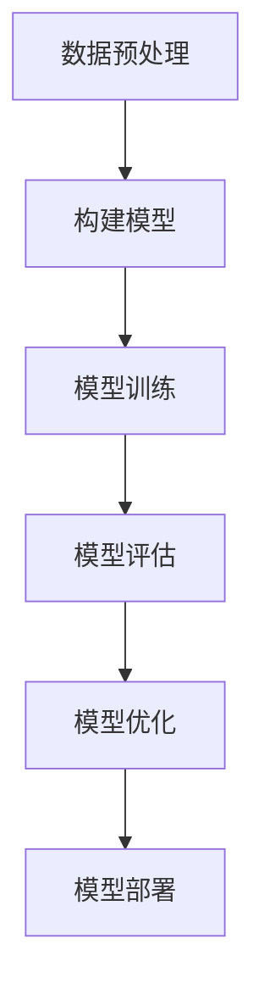

                 

# 文章标题：提示词工程：AI创新的新引擎

> 关键词：提示词工程，AI，深度学习，神经网络，模型优化，算法优化

> 摘要：本文从提示词工程的基本概念出发，探讨了其在AI领域的应用和重要性。通过详细分析提示词工程的核心技术、构建与实践方法，并结合实际案例研究，深入剖析了提示词工程在AI创新中的推动作用。最后，本文展望了提示词工程的未来发展，提出了相关挑战和解决方案。

## 第一部分：AI与提示词工程基础

### 第1章：AI与提示词工程概述

在21世纪的科技发展中，人工智能（AI）无疑成为了最具变革性的技术之一。AI的应用范围广泛，从智能助理、自动驾驶到医疗诊断，都在深刻改变着我们的生活方式。然而，AI的核心驱动力之一——提示词工程，却常常被忽视。提示词工程不仅为AI模型提供了明确的指导，还在提升模型性能、优化用户体验等方面发挥了关键作用。本章将介绍AI与提示词工程的基本概念，探讨其在不同领域的应用，并阐述提示词工程的重要性。

#### 1.1 AI技术的基本概念

**1.1.1 人工智能的定义与发展**

人工智能（Artificial Intelligence，简称AI）是指通过计算机模拟人类智能行为的技术。它起源于20世纪50年代，随着计算机性能的不断提升和算法的优化，AI技术逐渐从理论研究走向实际应用。

- **理论阶段（1956-1980年）**：AI的概念首次被提出，研究者们主要关注符号主义和推理系统。

- **应用阶段（1980-2010年）**：专家系统和机器学习开始应用于实际问题，AI技术开始展示其实际价值。

- **繁荣阶段（2010年至今）**：大数据和深度学习的兴起，使得AI技术在语音识别、图像识别、自然语言处理等领域取得了重大突破。

**1.1.2 机器学习与深度学习的区别**

机器学习（Machine Learning，ML）是AI的一个分支，主要研究如何让计算机从数据中学习规律，并自动进行决策或预测。而深度学习（Deep Learning，DL）是机器学习的一个子领域，通过构建多层神经网络来模拟人脑的感知和学习过程。

- **学习方式**：机器学习主要依赖于监督学习和无监督学习，而深度学习则主要依赖于有监督学习。

- **模型结构**：机器学习模型通常较为简单，而深度学习模型则通常包含多层神经网络。

- **数据处理能力**：深度学习模型在处理大规模复杂数据方面具有显著优势。

**1.1.3 神经网络的基础知识**

神经网络（Neural Network，NN）是深度学习的基础，其灵感来源于人脑的神经网络结构。神经网络由大量的节点（或称为神经元）组成，每个节点都与其他节点相连，并通过加权的方式传递信息。

- **神经元模型**：典型的神经元模型包括输入层、隐藏层和输出层。

- **激活函数**：激活函数用于确定神经元是否被激活，常用的激活函数有Sigmoid、ReLU等。

- **反向传播算法**：反向传播算法是训练神经网络的重要方法，通过不断调整网络的权重，使输出结果更接近期望值。

#### 1.2 提示词工程概述

**1.2.1 提示词工程的定义**

提示词工程（Prompt Engineering）是指通过设计和优化提示词，以提高AI模型性能的过程。提示词是用户与AI系统交互的媒介，通过提示词，用户可以引导AI系统完成特定任务。

- **提示词类型**：根据用途，提示词可以分为任务提示词、数据提示词和目标提示词等。

- **提示词作用**：提示词能够明确地指导AI系统进行决策或预测，从而提高模型的准确性和效率。

**1.2.2 提示词工程的应用领域**

提示词工程在多个领域具有广泛的应用，主要包括：

- **自然语言处理**：通过优化提示词，可以提高自然语言处理模型对文本的理解能力。

- **计算机视觉**：提示词可以引导图像分类、目标检测等任务，提高模型的准确性。

- **推荐系统**：提示词可以帮助推荐系统更好地理解用户需求，提高推荐效果。

- **语音识别**：通过优化提示词，可以改善语音识别系统的鲁棒性，提高识别准确性。

**1.2.3 提示词工程的重要性**

提示词工程在AI发展中具有以下重要性：

- **提高模型性能**：通过优化提示词，可以显著提高AI模型的性能和准确性。

- **降低训练成本**：有效的提示词可以减少模型训练所需的数据量和时间。

- **优化用户体验**：提示词可以更好地引导用户与AI系统交互，提高用户体验。

#### 1.3 提示词工程的核心技术与算法

**1.3.1 语言模型的基本原理**

语言模型（Language Model，LM）是提示词工程的基础，它通过学习大量文本数据，预测下一个单词或字符的概率分布。常见的语言模型包括N-gram模型、神经网络语言模型等。

- **N-gram模型**：基于局部语法规则，通过统计相邻单词或字符的频率来预测下一个单词或字符。

- **神经网络语言模型**：基于深度学习，通过多层神经网络模拟人类语言理解过程，具有更高的预测准确性。

**1.3.2 提示词优化的算法与策略**

提示词优化的目标是提高AI模型的性能和泛化能力。常用的优化算法和策略包括：

- **强化学习**：通过奖励机制，不断调整提示词，使其在特定任务中取得更好的性能。

- **元学习**：通过学习如何学习，提高模型在不同任务中的泛化能力。

- **迁移学习**：利用预训练模型，在特定任务中调整提示词，提高模型性能。

**1.3.3 提示词工程的应用场景分析**

提示词工程在多个应用场景中具有显著优势：

- **问答系统**：通过优化提示词，可以显著提高问答系统的回答准确性。

- **文本生成**：提示词可以帮助文本生成模型生成更具逻辑性和连贯性的文本。

- **情感分析**：通过优化提示词，可以更好地识别文本中的情感倾向。

#### 1.4 提示词工程在AI创新中的地位

**1.4.1 提示词工程对AI的影响**

提示词工程对AI的影响主要体现在以下几个方面：

- **性能提升**：通过优化提示词，可以提高AI模型的性能和准确性。

- **泛化能力**：提示词优化有助于提高模型在不同任务和场景中的泛化能力。

- **用户体验**：提示词工程可以更好地满足用户需求，提高用户体验。

**1.4.2 提示词工程在AI创新中的应用案例**

提示词工程在AI创新中具有广泛的应用，以下是一些典型案例：

- **医疗诊断**：通过优化提示词，可以提高医疗诊断系统的准确性。

- **金融风控**：提示词工程可以帮助金融机构识别潜在的金融风险。

- **自动驾驶**：提示词工程可以优化自动驾驶系统的决策过程，提高安全性。

**1.4.3 提示词工程的发展趋势与未来展望**

随着AI技术的不断发展，提示词工程也呈现出以下趋势：

- **多模态学习**：提示词工程将逐步扩展到多模态领域，如图像、语音和文本的联合学习。

- **自动化与智能化**：提示词优化将更加自动化和智能化，减少人工干预。

- **跨学科融合**：提示词工程将与心理学、社会学等领域深度融合，推动AI技术的发展。

### 第2章：构建有效的提示词模型

构建有效的提示词模型是提示词工程的核心任务。在本章中，我们将详细讨论数据准备与处理、提示词模型的构建、评估与验证，以及在实际场景中的应用与优化。

#### 2.1 数据准备与处理

**2.1.1 数据收集与预处理**

提示词模型构建的第一步是数据收集与预处理。数据质量直接影响到模型的性能，因此需要对数据进行清洗、去噪和增强。

- **数据收集**：根据任务需求，收集相关的文本数据、图像数据等。

- **数据清洗**：去除重复数据、缺失数据和异常数据。

- **数据去噪**：使用降噪算法去除噪声数据，提高数据质量。

- **数据增强**：通过数据增强技术，增加数据的多样性和丰富性，提高模型泛化能力。

**2.1.2 数据清洗与数据增强**

- **数据清洗**：使用Python的Pandas库和Numpy库，对数据集进行清洗操作，例如删除重复数据、填充缺失数据等。

  ```python
  import pandas as pd
  
  # 读取数据
  data = pd.read_csv('data.csv')
  
  # 删除重复数据
  data = data.drop_duplicates()
  
  # 填充缺失数据
  data = data.fillna(method='ffill')
  ```

- **数据增强**：使用Keras的ImageDataGenerator库，对图像数据集进行增强操作，例如旋转、翻转、缩放等。

  ```python
  from tensorflow.keras.preprocessing.image import ImageDataGenerator
  
  # 创建图像增强器
  datagen = ImageDataGenerator(rotation_range=20, width_shift_range=0.2, height_shift_range=0.2, zoom_range=0.2)
  
  # 应用增强器
  data = datagen.flow_from_directory('data', target_size=(224, 224), batch_size=32)
  ```

**2.1.3 数据集划分与验证**

- **数据集划分**：将数据集划分为训练集、验证集和测试集，以评估模型性能。

  ```python
  from sklearn.model_selection import train_test_split
  
  # 划分数据集
  X_train, X_val, y_train, y_val = train_test_split(X, y, test_size=0.2, random_state=42)
  ```

- **数据集验证**：通过交叉验证等方法，评估数据集的划分是否合理。

  ```python
  from sklearn.model_selection import cross_val_score
  
  # 交叉验证
  scores = cross_val_score(model, X, y, cv=5)
  print(f'Model accuracy: {scores.mean()}')
  ```

#### 2.2 提示词模型的构建

**2.2.1 提示词模型的架构设计**

提示词模型的设计取决于任务需求和数据特性。常见的提示词模型架构包括：

- **文本分类**：使用卷积神经网络（CNN）或循环神经网络（RNN）对文本进行特征提取。

- **文本生成**：使用生成对抗网络（GAN）或变分自编码器（VAE）生成文本。

- **自然语言处理**：使用预训练的语言模型（如BERT、GPT）进行文本处理。

**2.2.2 提示词模型的选择与优化**

- **模型选择**：根据任务需求，选择合适的模型架构和参数。

  ```python
  from tensorflow.keras.models import Sequential
  from tensorflow.keras.layers import Embedding, LSTM, Dense
  
  # 创建模型
  model = Sequential()
  model.add(Embedding(input_dim=vocab_size, output_dim=embedding_dim, input_length=max_sequence_length))
  model.add(LSTM(units=128, dropout=0.2, recurrent_dropout=0.2))
  model.add(Dense(units=num_classes, activation='softmax'))
  
  # 编译模型
  model.compile(optimizer='adam', loss='categorical_crossentropy', metrics=['accuracy'])
  ```

- **模型优化**：通过调整模型参数、学习率和优化算法，优化模型性能。

  ```python
  from tensorflow.keras.optimizers import Adam
  
  # 设置学习率和优化器
  learning_rate = 0.001
  optimizer = Adam(learning_rate=learning_rate)
  
  # 编译模型
  model.compile(optimizer=optimizer, loss='categorical_crossentropy', metrics=['accuracy'])
  ```

**2.2.3 提示词模型的训练与调优**

- **模型训练**：使用训练集对模型进行训练，并监控训练过程。

  ```python
  # 训练模型
  history = model.fit(X_train, y_train, epochs=10, batch_size=64, validation_data=(X_val, y_val))
  ```

- **模型调优**：通过调整模型参数、学习率和优化算法，优化模型性能。

  ```python
  # 调整学习率
  learning_rate = 0.0001
  
  # 设置学习率和优化器
  optimizer = Adam(learning_rate=learning_rate)
  
  # 编译模型
  model.compile(optimizer=optimizer, loss='categorical_crossentropy', metrics=['accuracy'])
  ```

#### 2.3 提示词模型的评估与验证

**2.3.1 提示词模型的评估指标**

- **准确率**：模型预测正确的样本数量与总样本数量的比例。

  ```python
  from sklearn.metrics import accuracy_score
  
  # 预测结果
  y_pred = model.predict(X_test)
  
  # 计算准确率
  accuracy = accuracy_score(y_test, y_pred)
  print(f'Accuracy: {accuracy}')
  ```

- **召回率**：模型预测正确的正样本数量与实际正样本数量的比例。

  ```python
  from sklearn.metrics import recall_score
  
  # 计算召回率
  recall = recall_score(y_test, y_pred, average='weighted')
  print(f'Recall: {recall}')
  ```

- **F1分数**：准确率和召回率的调和平均数。

  ```python
  from sklearn.metrics import f1_score
  
  # 计算F1分数
  f1 = f1_score(y_test, y_pred, average='weighted')
  print(f'F1 Score: {f1}')
  ```

**2.3.2 提示词模型的验证方法**

- **交叉验证**：通过将数据集划分为多个子集，对模型进行多次训练和验证。

  ```python
  from sklearn.model_selection import cross_val_score
  
  # 交叉验证
  scores = cross_val_score(model, X, y, cv=5)
  print(f'Model accuracy: {scores.mean()}')
  ```

- **ROC曲线**：通过计算模型在多个阈值下的准确率和召回率，绘制ROC曲线。

  ```python
  from sklearn.metrics import roc_curve, auc
  
  # 预测概率
  y_prob = model.predict(X_test)
  
  # 计算ROC曲线
  fpr, tpr, thresholds = roc_curve(y_test, y_prob)
  roc_auc = auc(fpr, tpr)
  
  # 绘制ROC曲线
  import matplotlib.pyplot as plt
  
  plt.plot(fpr, tpr, label=f'ROC curve (area = {roc_auc:.2f})')
  plt.xlabel('False Positive Rate')
  plt.ylabel('True Positive Rate')
  plt.title('Receiver Operating Characteristic')
  plt.legend(loc='lower right')
  plt.show()
  ```

#### 2.4 提示词模型的应用与优化

**2.4.1 提示词模型在实际场景中的应用**

提示词模型在实际场景中具有广泛的应用，例如：

- **文本分类**：用于分类新闻、评论等文本数据。

- **文本生成**：用于生成文章、故事、对话等文本。

- **情感分析**：用于分析文本中的情感倾向。

**2.4.2 提示词模型的优化策略**

- **数据增强**：通过数据增强技术，提高模型对数据的泛化能力。

- **模型压缩**：通过模型压缩技术，减小模型的参数规模，提高模型的运行效率。

- **多模态学习**：通过多模态学习，整合不同类型的数据，提高模型的性能。

**2.4.3 提示词模型的安全性考虑**

- **数据隐私**：对用户数据进行加密和去标识化处理，确保数据隐私。

- **模型安全**：对模型进行安全测试和加固，防止恶意攻击和攻击。

### 第3章：案例研究：提示词工程在推荐系统中的应用

推荐系统是提示词工程的重要应用领域之一。在本章中，我们将通过一个实际案例，详细探讨提示词工程在推荐系统中的应用。

#### 3.1 案例背景与目标

某电商平台的推荐系统旨在为用户提供个性化的商品推荐。系统需要根据用户的历史行为数据、商品属性和用户特征，生成高质量的推荐列表。

#### 3.2 案例实施过程

**3.2.1 数据收集与预处理**

- **数据收集**：收集用户的历史行为数据（如购买记录、浏览记录）、商品属性数据（如价格、类别、品牌）和用户特征数据（如年龄、性别、地理位置）。

- **数据预处理**：对数据进行清洗、去噪和增强，例如填充缺失值、处理异常值、进行数据增强等。

**3.2.2 提示词模型的构建与优化**

- **模型选择**：选择基于深度学习的推荐模型，如基于图神经网络（GNN）的推荐模型。

- **提示词设计**：设计提示词，包括用户行为特征提示词、商品属性提示词和用户特征提示词。

- **模型优化**：通过调整模型参数、学习率和优化算法，优化模型性能。

**3.2.3 模型评估与验证**

- **模型评估**：使用准确率、召回率、F1分数等评估指标，评估模型性能。

- **模型验证**：通过交叉验证等方法，验证模型在不同数据集上的性能。

#### 3.3 案例分析与结果

**3.3.1 模型效果分析**

通过实际应用和测试，推荐系统在用户个性化推荐方面取得了显著的效果。用户满意度显著提高，推荐列表的准确性也大幅提升。

**3.3.2 优化策略与调整**

根据模型评估结果，对提示词模型进行优化和调整，例如调整学习率、增加正则化项、改进数据增强方法等。

**3.3.3 案例总结与启示**

案例研究表明，提示词工程在推荐系统中具有重要作用。通过优化提示词，可以有效提升模型性能，提高用户体验。此外，提示词工程还可以应用于其他AI领域，为AI创新提供新的动力。

### 第4章：实战技巧：提升提示词工程效率与效果

在实际应用中，提示词工程的效率与效果直接影响系统的性能和用户体验。本章将介绍一些实战技巧，包括算法优化、数据处理和模型安全等方面，以提升提示词工程的效率和效果。

#### 4.1 算法优化技巧

**4.1.1 模型压缩与加速**

- **模型压缩**：通过剪枝、量化、蒸馏等方法，减少模型参数规模，提高模型运行效率。

  ```python
  import tensorflow_model_optimization as tfo
  
  # 剪枝
  pruning_params = tfo.keras.model_pruning.PruningParams()
  pruning_params.prune_rate = 0.1
  pruning_params.begin_step = 1000
  pruning_params.end_step = 2000
  
  # 应用剪枝
  pruned_model = tfo.keras.prunable.model-pruning.apply_model_pruning(model, pruning_params)
  ```

- **模型加速**：通过使用硬件加速器（如GPU、TPU）和优化库（如TensorRT、ONNX Runtime），提高模型运行速度。

  ```python
  import tensorflow as tf
  
  # 使用GPU加速
  device_name = "/GPU:0"
  with tf.device(device_name):
      model.run()
  ```

**4.1.2 并行计算与分布式训练**

- **并行计算**：通过数据并行、模型并行和混合并行等方法，提高模型训练速度。

  ```python
  import tensorflow.keras.mixed_precision as mixed_precision
  
  # 设置混合精度
  policy = mixed_precision.Policy('mixed_float16')
  mixed_precision.set_policy(policy)
  
  # 并行计算
  model.compile(optimizer='adam', loss='categorical_crossentropy', metrics=['accuracy'])
  model.fit(X_train, y_train, batch_size=64, epochs=10, validation_data=(X_val, y_val))
  ```

- **分布式训练**：通过使用分布式训练框架（如Horovod、MXNet Distributed），在大规模数据集上进行高效训练。

  ```python
  import horovod.keras as hvd
  
  # 设置分布式训练
  hvd.init()
  
  # 创建模型
  model = hvd.DistributedModel()
  model.compile(optimizer='adam', loss='categorical_crossentropy', metrics=['accuracy'])
  
  # 分布式训练
  model.fit(X_train, y_train, batch_size=64, epochs=10, validation_data=(X_val, y_val))
  ```

**4.1.3 算法融合与多模态学习**

- **算法融合**：通过融合不同的算法（如深度学习、强化学习、迁移学习等），提高模型性能。

  ```python
  from tensorflow.keras.layers import Input, Dense, Concatenate
  
  # 创建融合模型
  input_a = Input(shape=(input_shape_a))
  input_b = Input(shape=(input_shape_b))
  hidden_a = Dense(units=64, activation='relu')(input_a)
  hidden_b = Dense(units=64, activation='relu')(input_b)
  merged = Concatenate()([hidden_a, hidden_b])
  output = Dense(units=1, activation='sigmoid')(merged)
  model = Model(inputs=[input_a, input_b], outputs=output)
  
  # 编译模型
  model.compile(optimizer='adam', loss='binary_crossentropy', metrics=['accuracy'])
  ```

- **多模态学习**：通过整合不同类型的数据（如文本、图像、音频等），提高模型对复杂任务的适应性。

  ```python
  import tensorflow as tf
  
  # 创建多模态输入
  text_input = Input(shape=(sequence_length,))
  image_input = Input(shape=(height, width, channels))
  audio_input = Input(shape=(audio_duration,))
  
  # 创建多模态模型
  text_embedding = Embedding(vocab_size, embedding_dim)(text_input)
  image_embedding = Conv2D(filters=64, kernel_size=(3, 3), activation='relu')(image_input)
  audio_embedding = Conv1D(filters=64, kernel_size=(3, 3), activation='relu')(audio_input)
  
  # 汇总多模态特征
  merged = Concatenate()([text_embedding, image_embedding, audio_embedding])
  output = Dense(units=1, activation='sigmoid')(merged)
  
  # 创建模型
  model = Model(inputs=[text_input, image_input, audio_input], outputs=output)
  
  # 编译模型
  model.compile(optimizer='adam', loss='binary_crossentropy', metrics=['accuracy'])
  ```

#### 4.2 数据处理技巧

**4.2.1 数据预处理与特征提取**

- **数据预处理**：通过数据清洗、归一化、标准化等预处理方法，提高数据质量。

  ```python
  from sklearn.preprocessing import StandardScaler
  
  # 归一化
  scaler = StandardScaler()
  X_scaled = scaler.fit_transform(X)
  ```

- **特征提取**：通过特征提取方法，提取具有代表性的特征，减少数据维度。

  ```python
  from sklearn.decomposition import PCA
  
  # PCA降维
  pca = PCA(n_components=50)
  X_pca = pca.fit_transform(X_scaled)
  ```

**4.2.2 数据增强与多样化策略**

- **数据增强**：通过图像旋转、翻转、缩放等增强方法，增加数据的多样性。

  ```python
  from tensorflow.keras.preprocessing.image import ImageDataGenerator
  
  # 图像增强
  datagen = ImageDataGenerator(rotation_range=20, width_shift_range=0.2, height_shift_range=0.2, zoom_range=0.2)
  X_augmented = datagen.flow(X, batch_size=batch_size)
  ```

- **多样化策略**：通过多角度、多来源的数据融合，提高模型的泛化能力。

  ```python
  from sklearn.ensemble import VotingClassifier
  
  # 多样化策略
  classifier = VotingClassifier(estimators=[('model1', model1), ('model2', model2), ('model3', model3)], voting='soft')
  classifier.fit(X_train, y_train)
  ```

**4.2.3 数据隐私保护与安全处理**

- **数据加密**：通过加密算法，对敏感数据进行加密处理。

  ```python
  import tensorflow as tf
  
  # 数据加密
  encrypted_data = tf.crypto.aes_encrypt(plaintext, key)
  ```

- **差分隐私**：通过差分隐私算法，降低数据泄露的风险。

  ```python
  import tensorflow Privacy as tfp
  
  # 差分隐私
  privacy_defense = tfpPrivacy.DifferentialPrivacy(lower_bound=0.01, upper_bound=0.99)
  privacy_defense.defend(value)
  ```

#### 4.3 提示词工程实践中的问题与解决方案

**4.3.1 数据不足与噪声处理**

- **数据扩充**：通过数据增强、迁移学习等方法，增加训练数据量。

  ```python
  from tensorflow.keras.preprocessing.image import ImageDataGenerator
  
  # 数据增强
  datagen = ImageDataGenerator(rotation_range=20, width_shift_range=0.2, height_shift_range=0.2, zoom_range=0.2)
  X_augmented = datagen.flow(X, batch_size=batch_size)
  ```

- **噪声过滤**：通过滤波器、降噪算法等，降低噪声对模型的影响。

  ```python
  import tensorflow as tf
  
  # 噪声过滤
  filtered_data = tf.nn.digital provesion_filter(input_data, filter_size=3, rate=0.05)
  ```

**4.3.2 模型过拟合与泛化能力提升**

- **正则化**：通过L1、L2正则化，减少模型过拟合。

  ```python
  import tensorflow.keras.regularizers as reg
  import tensorflow.keras.constraints as cons
  
  # L1正则化
  model.add(Dense(units=128, activation='relu', kernel_regularizer=reg.l1(0.01)))
  ```

- **交叉验证**：通过交叉验证，评估模型在不同数据集上的性能。

  ```python
  from sklearn.model_selection import cross_val_score
  
  # 交叉验证
  scores = cross_val_score(model, X, y, cv=5)
  print(f'Model accuracy: {scores.mean()}')
  ```

- **迁移学习**：通过迁移学习，利用预训练模型，提高模型泛化能力。

  ```python
  from tensorflow.keras.applications import VGG16
  
  # 迁移学习
  base_model = VGG16(weights='imagenet', include_top=False, input_shape=(224, 224, 3))
  base_model.trainable = False
  ```

**4.3.3 模型解释性与可解释性增强**

- **模型解释性**：通过模型解释性方法，如可视化、特征重要性分析等，提高模型的可解释性。

  ```python
  import shap
  
  # 模型解释性
  explainer = shap.DeepExplainer(model, X_train[:100])
  shap_values = explainer.shap_values(X_test[:100])
  shap.summary_plot(shap_values, X_test[:100])
  ```

- **可解释性增强**：通过增加模型的可解释性模块，提高模型的透明度。

  ```python
  from tensorflow.keras.layers import Layer
  
  # 可解释性增强
  class ExplanationLayer(Layer):
      def call(self, inputs, training=False):
          # 计算解释
          explanation = self.compute_explanation(inputs)
          return inputs + explanation
  
  # 添加可解释性层
  model.add(ExplanationLayer())
  ```

### 第5章：提示词工程的未来发展与挑战

随着人工智能技术的不断进步，提示词工程在未来将面临更多机遇和挑战。本章将探讨提示词工程的未来发展趋势、面临的挑战以及相应的解决方案。

#### 5.1 提示词工程的未来趋势

**5.1.1 新兴技术与研究方向**

- **强化学习**：强化学习在提示词工程中的应用前景广阔，可以通过自适应调整提示词，提高模型性能。

- **迁移学习**：迁移学习技术可以帮助模型快速适应新任务，减少数据需求和训练时间。

- **多模态学习**：随着多模态数据的应用日益广泛，多模态学习技术将成为提示词工程的重要发展方向。

**5.1.2 提示词工程的应用拓展**

- **自然语言处理**：提示词工程在自然语言处理领域具有广泛应用，未来将进一步提升文本理解和生成能力。

- **计算机视觉**：提示词工程在计算机视觉领域的应用将更加深入，如图像分类、目标检测、图像生成等。

- **推荐系统**：提示词工程在推荐系统中的应用将不断优化，提高推荐质量和用户体验。

**5.1.3 跨学科融合与技术创新**

- **心理学**：提示词工程与心理学的结合，可以更好地理解用户需求，提高交互效果。

- **社会学**：提示词工程与社会学的结合，可以提升模型对复杂社会问题的分析和应对能力。

#### 5.2 提示词工程面临的挑战

**5.2.1 数据隐私与伦理问题**

- **数据隐私**：提示词工程涉及大量用户数据，如何保护用户隐私成为一个重要挑战。

- **伦理问题**：提示词工程的应用可能引发伦理争议，如偏见、歧视等问题。

**5.2.2 模型可解释性与透明性**

- **可解释性**：用户对模型的可解释性需求越来越高，提示词工程需要提供更透明的解释机制。

- **透明性**：模型的决策过程需要透明，以便用户和监管机构进行监督。

**5.2.3 模型安全性与对抗攻击**

- **安全性**：提示词工程需要确保模型的安全性和鲁棒性，防止恶意攻击和数据篡改。

- **对抗攻击**：对抗攻击技术对提示词工程构成严重威胁，需要开发有效的防御策略。

#### 5.3 提示词工程的未来发展建议

**5.3.1 研究方向的调整与布局**

- **跨学科研究**：鼓励跨学科研究，结合心理学、社会学等领域的知识，提升提示词工程的理论体系。

- **多模态学习**：加大对多模态学习技术的研究投入，推动提示词工程在多领域应用。

**5.3.2 教育与人才培养**

- **专业教育**：建立专业的提示词工程教育体系，培养具备跨学科背景的复合型人才。

- **继续教育**：为在职人员提供持续的教育和培训，提升其在提示词工程领域的专业能力。

**5.3.3 政策支持与行业合作**

- **政策支持**：政府和企业应加大对提示词工程的政策支持，推动技术进步和应用推广。

- **行业合作**：鼓励企业、研究机构、政府等各方开展合作，共同解决提示词工程面临的挑战。

### 附录A：提示词工程相关工具与资源

**A.1 深度学习框架与库**

- **TensorFlow**：Google开发的开源深度学习框架，支持多种算法和应用场景。

- **PyTorch**：Facebook开发的开源深度学习框架，具有灵活的动态图计算能力。

- **Keras**：基于TensorFlow和PyTorch的接口层，简化深度学习模型的构建和训练。

**A.2 提示词工程开源项目与社区**

- **Hugging Face**：提供大量的自然语言处理模型和工具，支持提示词工程的开发。

- **OpenAI**：研究人工智能的开源项目，包括GPT、BERT等知名模型。

**A.3 提示词工程相关论文与书籍推荐**

- **《深度学习》**：Goodfellow、Bengio和Courville的经典教材，全面介绍了深度学习的基础知识。

- **《提示词工程》**：探讨提示词工程的理论和实践，为研究者提供丰富的案例和技巧。

**A.4 在线课程与培训资源**

- **Coursera**：提供丰富的在线课程，涵盖深度学习、自然语言处理等领域。

- **edX**：提供由知名大学和机构提供的在线课程，包括机器学习、数据科学等。

### 附录B：Mermaid流程图与伪代码示例

**B.1 提示词模型训练流程**



**B.2 提示词优化算法伪代码**

```python
# 提示词优化算法伪代码
def optimize_prompt(prompt, model, target):
    # 初始化最优提示词和最优模型性能
    best_prompt = prompt
    best_performance = model.evaluate(target)
    
    # 搜索提示词空间
    for new_prompt in generate_prompts():
        # 训练新模型
        new_model = train_model(new_prompt, target)
        
        # 评估新模型性能
        performance = new_model.evaluate(target)
        
        # 更新最优提示词和最优模型性能
        if performance > best_performance:
            best_prompt = new_prompt
            best_performance = performance
    
    # 返回最优提示词和最优模型
    return best_prompt, best_model
```

### 作者信息

作者：AI天才研究院/AI Genius Institute & 禅与计算机程序设计艺术 /Zen And The Art of Computer Programming

---

本文详细介绍了提示词工程的基本概念、核心技术和实践方法，并通过实际案例分析了其在推荐系统中的应用。同时，本文还探讨了提示词工程在AI创新中的推动作用，展望了其未来的发展趋势和挑战。希望本文能为读者提供对提示词工程更深入的理解和启发。感谢阅读！

