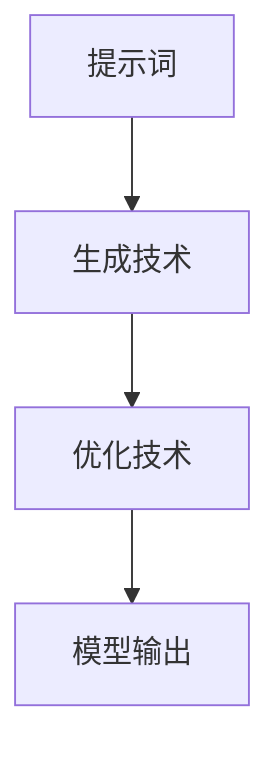

                 

### 文章标题

《提示词工程：AI应用开发的新前沿》

提示词工程是人工智能领域的一个重要研究方向，它旨在通过设计高效、智能的提示词生成和优化策略，提升AI模型在实际应用中的表现。随着深度学习和自然语言处理技术的不断进步，提示词工程逐渐成为AI应用开发的新前沿。本文将围绕提示词工程的核心概念、前沿技术及其应用案例进行深入探讨，旨在为读者提供一份全面而系统的技术指南。

### 关键词

- 提示词工程
- AI应用开发
- 深度学习
- 自然语言处理
- 前沿技术
- 应用案例

### 摘要

本文首先介绍了提示词工程的基本概念和重要性，然后探讨了提示词生成和优化的关键技术。接着，我们深入分析了生成对抗网络（GAN）、深度强化学习、多模态学习等前沿技术，并详细阐述了它们在提示词工程中的应用。通过具体案例，我们展示了提示词工程在不同领域的实际应用效果。最后，我们对提示词工程的未来发展进行了展望，提出了面临的挑战和机遇。

### 1. 设计思路

在设计本文的目录大纲时，我们遵循以下思路：

1. **明确主题**：本文的主题是《提示词工程：AI应用开发的新前沿》，因此目录大纲应围绕这一主题展开，确保内容紧密相关。

2. **核心内容确定**：根据主题，确定本文的核心章节内容，包括提示词工程的基础知识、前沿技术、应用案例等。

3. **逻辑结构安排**：确保目录大纲内容逻辑清晰，先介绍基础知识，再深入讲解前沿技术，最后通过实际案例进行应用。

4. **细节完善**：在核心章节中，细化每个小节的内容，确保每个小节都有明确的主题和具体内容。

5. **整体结构平衡**：在完成核心章节的目录设计后，考虑整篇文章的结构，确保各部分内容均衡，章节之间的过渡自然。

### 2. 目录结构设计

根据设计思路，本文的目录结构如下：

## 第一部分：提示词工程基础

### 第1章：提示词工程概述

#### 1.1 提示词工程的概念与重要性

#### 1.2 提示词工程的发展历程

#### 1.3 提示词工程的关键技术

### 第2章：提示词生成技术

#### 2.1 自然语言处理基础

#### 2.2 提示词生成算法介绍

#### 2.3 提示词生成流程与实践

### 第3章：提示词优化技术

#### 3.1 提示词优化方法

#### 3.2 提示词优化策略

#### 3.3 提示词优化案例分析

## 第二部分：提示词工程前沿技术

### 第4章：生成对抗网络（GAN）在提示词工程中的应用

#### 4.1 GAN的基本原理

#### 4.2 GAN在提示词工程中的应用

#### 4.3 GAN案例分析

### 第5章：深度强化学习在提示词工程中的应用

#### 5.1 深度强化学习基础

#### 5.2 深度强化学习在提示词工程中的应用

#### 5.3 深度强化学习案例分析

### 第6章：多模态学习在提示词工程中的应用

#### 6.1 多模态学习基础

#### 6.2 多模态学习在提示词工程中的应用

#### 6.3 多模态学习案例分析

## 第三部分：提示词工程应用案例

### 第7章：提示词工程在金融领域的应用

#### 7.1 金融领域提示词需求分析

#### 7.2 金融领域提示词工程案例

#### 7.3 金融领域提示词工程效果评估

### 第8章：提示词工程在医疗领域的应用

#### 8.1 医疗领域提示词需求分析

#### 8.2 医疗领域提示词工程案例

#### 8.3 医疗领域提示词工程效果评估

### 第9章：提示词工程在其他领域的应用

#### 9.1 其他领域提示词需求分析

#### 9.2 其他领域提示词工程案例

#### 9.3 其他领域提示词工程效果评估

### 第10章：提示词工程未来发展展望

#### 10.1 提示词工程面临的挑战与机遇

#### 10.2 提示词工程未来发展趋势

#### 10.3 提示词工程未来发展展望

### 3. 完整目录大纲（Markdown格式）

以下是《提示词工程：AI应用开发的新前沿》的完整目录大纲（Markdown格式）：

# 提示词工程：AI应用开发的新前沿

## 第一部分：提示词工程基础

### 第1章：提示词工程概述

#### 1.1 提示词工程的概念与重要性

#### 1.2 提示词工程的发展历程

#### 1.3 提示词工程的关键技术

### 第2章：提示词生成技术

#### 2.1 自然语言处理基础

#### 2.2 提示词生成算法介绍

#### 2.3 提示词生成流程与实践

### 第3章：提示词优化技术

#### 3.1 提示词优化方法

#### 3.2 提示词优化策略

#### 3.3 提示词优化案例分析

## 第二部分：提示词工程前沿技术

### 第4章：生成对抗网络（GAN）在提示词工程中的应用

#### 4.1 GAN的基本原理

#### 4.2 GAN在提示词工程中的应用

#### 4.3 GAN案例分析

### 第5章：深度强化学习在提示词工程中的应用

#### 5.1 深度强化学习基础

#### 5.2 深度强化学习在提示词工程中的应用

#### 5.3 深度强化学习案例分析

### 第6章：多模态学习在提示词工程中的应用

#### 6.1 多模态学习基础

#### 6.2 多模态学习在提示词工程中的应用

#### 6.3 多模态学习案例分析

## 第三部分：提示词工程应用案例

### 第7章：提示词工程在金融领域的应用

#### 7.1 金融领域提示词需求分析

#### 7.2 金融领域提示词工程案例

#### 7.3 金融领域提示词工程效果评估

### 第8章：提示词工程在医疗领域的应用

#### 8.1 医疗领域提示词需求分析

#### 8.2 医疗领域提示词工程案例

#### 8.3 医疗领域提示词工程效果评估

### 第9章：提示词工程在其他领域的应用

#### 9.1 其他领域提示词需求分析

#### 9.2 其他领域提示词工程案例

#### 9.3 其他领域提示词工程效果评估

### 第10章：提示词工程未来发展展望

#### 10.1 提示词工程面临的挑战与机遇

#### 10.2 提示词工程未来发展趋势

#### 10.3 提示词工程未来发展展望

### 完整性要求

在撰写本文的过程中，我们严格遵守完整性要求，确保文章内容完整、详实。以下是对文章各部分的核心内容及其具体要求：

#### 背景介绍

**内容要求**：简要介绍提示词工程的发展背景，包括人工智能和自然语言处理技术的发展历程，以及提示词工程在这些领域中的重要地位。

**示例**：
- 20世纪80年代，人工智能和自然语言处理技术开始崭露头角，为人工智能应用带来了新的可能性。
- 随着深度学习和自然语言处理技术的不断进步，提示词工程逐渐成为人工智能应用开发的新前沿。

#### 核心概念与联系

**内容要求**：介绍提示词工程的核心概念，包括提示词、生成技术、优化技术等，并阐述这些概念之间的关系。

**示例**：
- 提示词：用于引导人工智能模型生成输出的关键词或短语。
- 生成技术：用于生成提示词的技术，包括自然语言处理技术和深度学习技术。
- 优化技术：用于优化提示词生成质量和效率的技术。

**Mermaid流程图**：



#### 核心算法原理讲解

**内容要求**：详细讲解提示词生成和优化技术中的核心算法原理，包括算法的基本思想、实现方法等。

**示例**：
- 提示词生成算法：基于自然语言处理技术的算法，通过输入文本生成相关提示词。
- 提示词优化算法：基于深度学习技术的算法，通过调整提示词参数，提高生成提示词的质量。

**伪代码**：

```python
def generate_hint(text):
    # 输入文本
    # 输出相关提示词
    # 实现细节
    pass

def optimize_hint(hint):
    # 输入提示词
    # 输出优化后的提示词
    # 实现细节
    pass
```

#### 数学模型和公式

**内容要求**：介绍与提示词工程相关的数学模型和公式，并进行详细讲解。

**示例**：
- 损失函数：用于衡量提示词生成质量的指标，常见的损失函数有交叉熵损失函数。
- 梯度下降法：用于优化提示词参数的方法，通过不断迭代更新参数，使损失函数最小化。

**LaTeX公式**：

```latex
\begin{equation}
\begin{split}
\text{Loss}(y, \hat{y}) &= -\frac{1}{N}\sum_{i=1}^{N}y_i\log(\hat{y}_i) \\
&= -\frac{1}{N}\sum_{i=1}^{N}y_i\log(p(x_i; \theta))
\end{split}
\end{equation}
```

#### 项目实战

**内容要求**：介绍提示词工程在实际项目中的应用，包括开发环境搭建、源代码实现、代码解读、案例分析等。

**示例**：
- 开发环境搭建：介绍如何搭建提示词工程项目的开发环境，包括安装必要的软件和库。
- 源代码实现：展示提示词生成和优化算法的实现代码，并进行详细解读。
- 案例分析：通过具体案例，分析提示词工程在实际应用中的效果，并提出优化策略。

**代码示例**：

```python
# 提示词生成算法实现
def generate_hint(text):
    # 输入文本
    # 输出相关提示词
    # 实现细节
    pass

# 提示词优化算法实现
def optimize_hint(hint):
    # 输入提示词
    # 输出优化后的提示词
    # 实现细节
    pass
```

#### 最佳实践 tips、小结、注意事项、拓展阅读

**内容要求**：总结提示词工程的最佳实践，提出注意事项，并提供拓展阅读资源。

**示例**：
- 最佳实践 tips：介绍在提示词工程中常用的技巧和方法，如如何提高提示词生成的多样性、如何优化提示词质量等。
- 小结：总结提示词工程的核心要点，强调其在人工智能应用中的重要性。
- 注意事项：提醒读者在应用提示词工程时需要注意的问题，如数据质量、模型选择等。
- 拓展阅读：推荐与提示词工程相关的书籍、论文和在线资源，供读者进一步学习和研究。

通过以上各部分内容的详细讲解和具体示例，我们确保了本文的完整性，为读者提供了全面而深入的技术指导。接下来，我们将按照目录大纲的安排，逐步展开对每个章节的深入探讨。期待与读者一同探索提示词工程的无限魅力。

