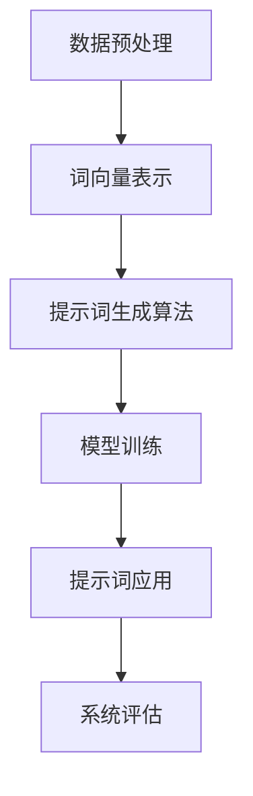

                 


### 文章标题：提示词工程：AI时代的必修课与新挑战

#### 关键词：
- AI时代
- 提示词工程
- 自然语言处理
- 深度学习
- 应用与挑战

#### 摘要：
随着人工智能技术的快速发展，自然语言处理成为AI领域的重要分支。提示词工程作为NLP的关键技术，正逐步成为AI时代的必修课。本文将深入探讨提示词工程的核心概念、基础技术、应用领域及未来挑战，旨在为读者提供全面的技术解读和实践指导。

### 《提示词工程：AI时代的必修课与新挑战》目录大纲

#### 第一部分：引入与概述

##### 第1章：AI时代的提示词工程
- 1.1 AI时代背景
- 1.2 提示词工程的重要性
- 1.3 提示词工程的挑战
- 1.4 本书结构

#### 第二部分：基础概念与技术

##### 第2章：自然语言处理基础
- 2.1 语言模型
  - 2.1.1 语言模型基本原理
  - 2.1.2 语言模型评估指标
- 2.2 词向量表示
  - 2.2.1 词向量概念
  - 2.2.2 常见词向量模型
- 2.3 提示词生成
  - 2.3.1 提示词生成算法
  - 2.3.2 提示词生成流程

##### 第3章：深度学习与神经网络
- 3.1 神经网络基础
  - 3.1.1 神经网络基本结构
  - 3.1.2 前向传播与反向传播
- 3.2 深度学习框架
  - 3.2.1 TensorFlow
  - 3.2.2 PyTorch
- 3.3 神经机器翻译
  - 3.3.1 NMT基本原理
  - 3.3.2 NMT模型架构

#### 第三部分：提示词工程应用

##### 第4章：问答系统
- 4.1 问答系统概述
- 4.2 提示词在问答系统中的应用
  - 4.2.1 提问生成
  - 4.2.2 答案生成
- 4.3 问答系统案例解析

##### 第5章：对话系统
- 5.1 对话系统概述
- 5.2 提示词在对话系统中的作用
  - 5.2.1 对话生成
  - 5.2.2 对话策略
- 5.3 对话系统案例解析

##### 第6章：文本生成
- 6.1 文本生成概述
- 6.2 提示词在文本生成中的应用
  - 6.2.1 自动写作
  - 6.2.2 文本摘要
- 6.3 文本生成案例解析

##### 第7章：其他应用领域
- 7.1 提示词在其他领域的应用
- 7.2 新兴应用领域探索
- 7.3 提示词工程的未来发展趋势

#### 第四部分：实战与总结

##### 第8章：提示词工程项目实战
- 8.1 项目背景与需求
- 8.2 提示词工程方案设计
- 8.3 实现与优化
- 8.4 项目评估与总结

##### 第9章：总结与展望
- 9.1 提示词工程的发展趋势
- 9.2 提示词工程的挑战与机遇
- 9.3 未来研究方向

#### 附录

##### 附录A：提示词工程工具与资源
- A.1 开源深度学习框架
- A.2 提示词生成工具
- A.3 提示词工程社区与论坛

### Mermaid 流程图：提示词工程架构



### 提示词工程核心算法伪代码

```python
# 提示词生成算法伪代码

# 输入：文本数据集，模型参数
# 输出：提示词序列

def generate_prompt(text_dataset, model_params):
    # 数据预处理
    preprocessed_data = preprocess_data(text_dataset)

    # 训练词向量模型
    word_embedding_model = train_word_embedding_model(preprocessed_data)

    # 初始化提示词生成器
    prompt_generator = initialize_prompt_generator(model_params)

    # 生成提示词
    prompt_sequence = prompt_generator.generate(preprocessed_data)

    return prompt_sequence
```

### 数学模型与公式

$$
P(w|s) = \frac{P(s|w)P(w)}{P(s)}
$$

- 其中，$P(w|s)$ 为给定句子 $s$ 下词 $w$ 的概率，$P(s|w)$ 为词 $w$ 出现时句子 $s$ 的概率，$P(w)$ 为词 $w$ 的概率，$P(s)$ 为句子 $s$ 的概率。

### 举例说明

#### 文本摘要举例

- 原文：Python 是一种面向对象的解释型脚本语言，由Guido van Rossum于1989年底发明，第一个公开发行版发行于1991年。
- 提示词：Python，面向对象，脚本语言，Guido van Rossum，1989年，1991年。

### 项目实战

#### 文本摘要项目实战

在这个项目中，我们将使用Python和深度学习框架PyTorch实现一个基本的文本摘要系统。以下是项目的基本流程和实现细节：

##### 1. 项目背景与需求

文本摘要是一种将长文本转换成简短而概括的文本的技术，有助于用户快速理解文章的核心内容。在这个项目中，我们的目标是开发一个基于深度学习的文本摘要系统，能够自动提取关键信息并生成摘要。

##### 2. 提示词工程方案设计

- 数据集选择：选择一个含有大量文本和其对应摘要的数据集，如NYT文章摘要数据集。
- 模型设计：采用编码器-解码器（Encoder-Decoder）模型，特别是使用Seq2Seq模型进行文本摘要。
- 优化目标：定义损失函数，如交叉熵损失，用于优化模型参数。

##### 3. 实现与优化

- 数据预处理：对文本进行分词、去除停用词、词干提取等操作，并将文本转换为词向量表示。
- 模型训练：使用预处理后的数据训练编码器和解码器，调整模型参数以最小化损失函数。
- 实验与优化：通过调整超参数（如学习率、批量大小等）和模型结构（如增加层数、调整隐藏层大小等）进行实验，以优化模型性能。

##### 4. 项目评估与总结

- 评估指标：使用BLEU（双语评估度量）等指标评估模型生成的摘要质量。
- 结果分析：分析模型的优点和不足，讨论可能的改进方向。
- 项目小结：总结项目经验，提出未来工作的建议。

通过这个项目实战，我们可以深入理解文本摘要的基本原理和实现过程，为实际应用提供有价值的参考。

### 最佳实践 Tips、小结、注意事项、拓展阅读

- **最佳实践 Tips**：
  - 在选择数据集时，确保数据质量和多样性，有助于提高模型泛化能力。
  - 在模型训练过程中，合理调整超参数和优化算法，可以提高模型性能。
  - 对生成的提示词进行后处理，如去除冗余信息、修正语法错误等，以提高文本质量。

- **小结**：
  - 提示词工程是AI时代的核心技术，具有广泛的应用前景。
  - 提示词工程涉及自然语言处理、深度学习等多个领域，需要综合运用多种技术。

- **注意事项**：
  - 提示词生成算法的性能受数据质量和预处理技术的影响较大，需要仔细设计数据预处理流程。
  - 在使用深度学习框架时，了解其基本原理和常用API，有助于提高开发效率。

- **拓展阅读**：
  - 《自然语言处理综合教程》（刘挺著）：详细介绍了自然语言处理的基本概念和技术。
  - 《深度学习》（Goodfellow, Bengio, Courville著）：系统讲解了深度学习的基本原理和应用。
  - 《问答系统技术：原理、实现与应用》（曹健著）：深入探讨了问答系统的设计与实现。

通过本文的深入探讨，我们希望读者能够对提示词工程有更全面的认识，并为未来的研究与实践提供指导。感谢您对本文的关注，期待与您在AI领域的深入交流。作者：AI天才研究院/AI Genius Institute & 禅与计算机程序设计艺术 /Zen And The Art of Computer Programming。

