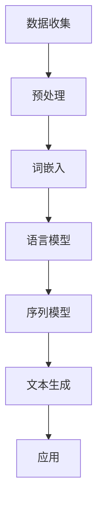

                 


### 第1章：AI时代的来临与提示词工程的意义

#### 1.1 AI时代的定义与特征

##### 1.1.1 人工智能的定义

人工智能（Artificial Intelligence，简称AI）是指通过计算机模拟人类智能行为的技术和理论体系。具体来说，人工智能旨在实现计算机系统具备以下能力：
- 学习：从数据中自动获取知识，改进性能。
- 推理：使用现有知识和规则进行逻辑推理。
- 判断：在特定情境下做出决策。
- 交流：理解自然语言并与人进行有效沟通。
- 创造：产生新的想法或内容。

##### 1.1.2 AI时代的特征

AI时代的特征可以从以下几个方面来概括：

1. **数据驱动**：人工智能依赖于大量数据来训练模型。数据的数量、质量和多样性直接影响AI系统的性能。
2. **自动化与智能化**：AI技术使得许多传统上需要人类参与的任务可以实现自动化，从而提高效率和减少错误。
3. **跨界融合**：人工智能与传统行业相结合，推动了新的产业模式和服务方式的诞生，如智能制造、智能医疗、智慧城市等。

#### 1.2 提示词工程的概念与重要性

##### 1.2.1 提示词工程的概念

提示词工程是指设计、开发、优化和评估用于人工智能系统的提示词（prompt）的一门学科。提示词是用于引导人工智能模型进行特定任务的关键输入，它通常是一段文本、图像或者其他形式的数据。

##### 1.2.2 提示词工程的重要性

提示词工程在人工智能领域具有以下重要性：

1. **提升AI系统的效果与效率**：合适的提示词可以引导模型专注于特定任务，从而提高模型的性能和效率。
2. **促进跨领域的AI应用**：通过设计通用化的提示词，AI技术可以更容易地应用到不同的领域和场景。
3. **降低AI系统的开发难度**：提示词工程提供了一种简化的开发流程，使得非专业人士也能快速搭建和部署AI系统。

#### 1.3 提示词工程在AI中的应用场景

##### 1.3.1 文本生成

在文本生成领域，提示词工程的应用非常广泛，例如：

- **聊天机器人**：通过提供关键词或主题，提示词可以帮助聊天机器人生成更加自然流畅的对话。
- **自动写作**：提示词可以帮助自动写作系统生成文章、报告等文本内容。
- **智能客服**：通过提供用户问题和常见回答的提示词，智能客服系统能够快速响应用户需求。

##### 1.3.2 对话系统

对话系统是另一个提示词工程的重要应用场景，包括：

- **虚拟助手**：虚拟助手通过提示词与用户进行交互，提供帮助和解答问题。
- **问答系统**：通过提供问题的提示词，问答系统可以生成准确的答案。
- **智能推荐**：提示词可以帮助推荐系统根据用户的历史行为和偏好生成个性化推荐。

##### 1.3.3 多模态应用

在多模态应用中，提示词工程可以帮助处理不同类型的数据，例如：

- **图像识别**：提示词可以帮助模型理解图像内容，从而进行更准确的识别。
- **视频分析**：通过提示词，视频分析系统可以识别和分类视频中的关键事件。
- **多媒体内容生成**：提示词可以帮助生成结合图像、文本和音频的多媒体内容。

### 关键词

- 人工智能
- 提示词工程
- 自然语言处理
- 对话系统
- 多模态应用

### 摘要

本文探讨了AI时代的来临与提示词工程的意义。首先，我们介绍了AI时代的定义与特征，包括数据驱动、自动化与智能化以及跨界融合。接着，我们详细阐述了提示词工程的概念与重要性，并列举了其在文本生成、对话系统和多模态应用中的具体应用场景。本文旨在为读者提供关于提示词工程的全面理解，并探讨其在AI领域中的重要作用和未来发展趋势。

---

### 第2章：AI时代的机遇与挑战

#### 2.1 AI时代带来的行业变革

##### 2.1.1 产业变革

AI技术的出现极大地推动了产业变革，主要体现在以下几个方面：

1. **自动化生产**：通过机器人和智能控制系统的应用，传统制造业的生产流程得到了极大的优化，生产效率和质量显著提高。
2. **智能决策**：AI技术可以帮助企业基于海量数据进行分析，提供智能决策支持，从而提高市场竞争力。
3. **数据驱动创新**：AI技术的应用使得企业能够从数据中发现新的商业模式、产品创新和市场机会。

##### 2.1.2 社会变革

AI技术不仅在产业层面产生了深远影响，也在社会层面带来了变革：

1. **智能服务**：智能客服、智能医疗诊断等AI应用的出现，极大地提高了服务质量和效率。
2. **个性化体验**：基于用户数据的分析，AI技术能够为用户提供定制化的服务和产品，提升用户体验。
3. **生活方式的改变**：智能家居、智能出行等AI应用的普及，正在逐步改变人们的生活方式。

#### 2.2 提示词工程面临的挑战

##### 2.2.1 数据质量

数据质量是提示词工程中的一大挑战，主要体现在以下几个方面：

1. **数据噪声**：现实世界中的数据往往含有噪声和异常值，这些噪声会干扰模型的训练过程，降低模型的性能。
2. **数据不完整性**：数据缺失或不完整会使得模型难以学习到完整的特征信息，影响模型的泛化能力。
3. **数据隐私**：在收集和使用数据时，需要确保数据隐私，避免敏感信息的泄露。

##### 2.2.2 模型泛化能力

模型泛化能力是提示词工程中另一个重要挑战：

1. **跨领域应用**：AI模型通常在一个特定领域训练，但需要在其他领域进行应用。模型需要具备较强的泛化能力，以适应不同的任务和数据。
2. **少样本学习**：在数据有限的情况下，模型需要能够从少量样本中学习，并做出准确的预测。
3. **模型解释性**：缺乏解释性的模型难以被用户接受，尤其是在涉及决策的关键任务中，模型解释性显得尤为重要。

##### 2.2.3 技术迭代速度

AI技术发展迅速，技术迭代速度很快，这给提示词工程带来了以下挑战：

1. **技术更新快**：新算法、新框架不断涌现，开发人员需要不断学习和适应新技术。
2. **学习成本高**：随着技术的复杂度增加，开发人员的学习成本也随之提高，这增加了企业的培训成本。
3. **技术稳定性**：快速迭代的技术可能存在稳定性问题，需要经过充分的测试和验证。

#### 2.3 提示词工程发展的新趋势

##### 2.3.1 自动化提示词生成

随着AI技术的发展，自动化提示词生成成为了一个新的趋势：

1. **自动化算法**：通过自动化算法，可以快速生成高质量的提示词，减少人工干预。
2. **自适应提示词生成**：提示词生成算法可以根据任务和数据的特征，自适应地调整提示词的生成策略。

##### 2.3.2 跨领域提示词工程

跨领域提示词工程旨在实现不同领域之间的提示词共享和复用：

1. **多语言处理**：通过跨语言模型，可以实现不同语言之间的提示词共享。
2. **跨模态融合**：结合不同类型的数据，如文本、图像和音频，可以生成更丰富的提示词。

##### 2.3.3 可解释性提升

提升模型的可解释性是当前AI研究的一个重要方向：

1. **模型解释工具**：开发可解释性工具，帮助用户理解模型的决策过程。
2. **可解释性评估指标**：设计可解释性评估指标，量化模型的可解释性。

---

### 关键词

- 人工智能
- 提示词工程
- 数据质量
- 模型泛化
- 自动化
- 跨领域
- 可解释性

### 摘要

本章讨论了AI时代带来的机遇与挑战，以及提示词工程在此背景下面临的挑战和新趋势。我们首先介绍了AI时代在产业和社会层面的变革，然后分析了提示词工程在数据质量、模型泛化和技术迭代速度方面面临的挑战。最后，我们探讨了自动化提示词生成、跨领域提示词工程和可解释性提升等新趋势，为提示词工程的发展指明了方向。

---

### 第3章：自然语言处理基础

#### 3.1 语言模型的基本概念

##### 3.1.1 语言模型的作用

语言模型（Language Model，简称LM）是自然语言处理（Natural Language Processing，简称NLP）的基础，其主要作用是模拟人类语言生成和理解的机制。语言模型能够预测下一个单词、句子或文本段落的概率，从而为文本生成、机器翻译、语音识别等NLP任务提供支持。

##### 3.1.2 语言模型的分类

根据训练方式和功能，语言模型可以分为以下几种：

1. **基于规则的语言模型**：通过手工编写语法规则和词典来预测单词的概率。
2. **统计语言模型**：基于统计方法，如N-gram模型，计算单词序列的概率。
3. **神经网络语言模型**：使用深度学习技术，如循环神经网络（RNN）和变换器（Transformer）模型，模拟语言的复杂结构。

##### 3.1.3 语言模型的主要技术指标

1. **词汇表大小**：语言模型能够处理的词汇量。
2. **句子长度**：模型能够处理的最大句子长度。
3. **准确率**：模型预测的正确率。

#### 3.2 词嵌入技术

##### 3.2.1 词嵌入的概念

词嵌入（Word Embedding）是将词汇表中的单词映射到低维空间中的向量表示。词嵌入能够将语义信息编码到向量中，从而实现单词的相似性和差异性的量化表示。

##### 3.2.2 常见的词嵌入方法

1. **基于分布的词嵌入**：如Word2Vec，通过计算单词在语料中的共现关系来生成词向量。
2. **基于语义的词嵌入**：如GloVe，通过优化单词的语义相似性来生成词向量。
3. **基于神经网络的词嵌入**：如BERT，通过深度神经网络学习单词的语义表示。

##### 3.2.3 词嵌入的应用场景

1. **文本分类**：词嵌入能够将文本转换为向量，方便进行分类任务。
2. **情感分析**：通过分析词嵌入向量，可以判断文本的情感倾向。
3. **文本相似度计算**：词嵌入向量可以用于计算文本之间的相似度，帮助推荐系统和搜索系统进行优化。

#### 3.3 递归神经网络与循环神经网络

##### 3.3.1 递归神经网络（RNN）

递归神经网络（Recurrent Neural Network，简称RNN）是一种能够处理序列数据的神经网络。RNN通过在网络中引入递归连接，使得网络能够记住序列中的历史信息。

##### 3.3.2 循环神经网络（LSTM）

长短期记忆网络（Long Short-Term Memory，简称LSTM）是RNN的一种变体，能够解决传统RNN在处理长序列数据时出现的梯度消失和梯度爆炸问题。

##### 3.3.3 递归神经网络的应用场景

1. **语音识别**：RNN能够处理语音信号的时间序列特征，从而实现语音识别。
2. **序列预测**：RNN可以用于时间序列数据的预测，如股票价格、天气预测等。
3. **机器翻译**：RNN在机器翻译任务中可以处理源语言和目标语言的序列信息，实现高质量翻译。

##### 3.3.4 循环神经网络的应用场景

1. **文本生成**：LSTM可以用于生成文本，如自动写作、聊天机器人等。
2. **语音合成**：通过LSTM模型，可以将文本转换为自然流畅的语音。
3. **图像描述生成**：LSTM可以用于将图像转换为自然语言的描述。

---

### 核心概念与联系

为了更好地理解自然语言处理中的核心概念及其相互关系，我们可以使用Mermaid流程图来展示以下流程：



在这个流程图中，数据收集是自然语言处理的起点，随后进行预处理，包括文本清洗和分词等操作。预处理后的数据通过词嵌入技术转换为向量表示，这些向量用于构建语言模型。语言模型是自然语言处理的核心组件，可以用于文本生成和序列模型的训练。序列模型如RNN和LSTM能够处理序列数据，并广泛应用于文本生成、语音识别等任务。最后，这些模型可以应用于实际的NLP任务中，如机器翻译、情感分析等。

---

### 伪代码与数学模型

为了深入理解自然语言处理的核心算法原理，我们将使用伪代码来详细阐述词嵌入和循环神经网络的基本原理。

#### 词嵌入

```python
# 词嵌入伪代码
def word_embedding(vocabulary, embedding_dim):
    embeddings = {}
    for word in vocabulary:
        embeddings[word] = np.random.rand(embedding_dim)
    return embeddings

# 应用词嵌入
def generate_vector(text, vocabulary, embedding_dim):
    text_vector = []
    for word in text:
        if word in vocabulary:
            text_vector.append(vocabulary[word])
    return np.array(text_vector)
```

#### 循环神经网络（RNN）

```python
# RNN 伪代码
class RNN:
    def __init__(self, input_dim, hidden_dim):
        self.input_dim = input_dim
        self.hidden_dim = hidden_dim
        self.Wxh = np.random.rand(hidden_dim, input_dim)
        self.Whh = np.random.rand(hidden_dim, hidden_dim)
        self.Why = np.random.rand(input_dim, hidden_dim)
        self.offsets = np.zeros(hidden_dim)

    def forward(self, x, h_prev):
        # 前向传播
        h_curr = np.tanh(np.dot(self.Wxh, x) + np.dot(self.Whh, h_prev) + self.offsets)
        y = np.dot(self.Why, h_curr)
        return h_curr, y

# RNN应用示例
rnn = RNN(input_dim=10, hidden_dim=5)
h_prev = np.zeros(5)
x = np.random.rand(10)
h_curr, y = rnn.forward(x, h_prev)
```

#### 数学模型

在RNN中，激活函数通常是tanh函数，用于保持激活值在-1到1之间。以下是RNN的数学模型：

$$
h_{t} = \tanh \left( W_{xh}x_{t} + W_{hh}h_{t-1} + b_{h} \right)
$$

$$
y_{t} = W_{hy}h_{t} + b_{y}
$$

其中，$h_{t}$ 表示第 $t$ 个时间步的隐藏状态，$x_{t}$ 表示第 $t$ 个输入特征，$W_{xh}$ 和 $W_{hh}$ 分别是输入到隐藏层和隐藏到隐藏层的权重矩阵，$W_{hy}$ 是隐藏层到输出层的权重矩阵，$b_{h}$ 和 $b_{y}$ 分别是隐藏层和输出层的偏置。

---

### 举例说明

为了更直观地理解词嵌入和RNN的工作原理，我们可以通过一个简单的例子来演示。

#### 示例1：词嵌入

假设我们有一个包含5个单词的词汇表：{'apple', 'banana', 'car', 'dog', 'elephant'}。我们将这5个单词嵌入到一个2维空间中，每个单词对应一个2维向量。

```python
vocabulary = {'apple': [0.1, 0.2], 'banana': [0.3, 0.4], 'car': [0.5, 0.6], 'dog': [0.7, 0.8], 'elephant': [0.9, 1.0]}
text = "apple banana car"
text_vector = generate_vector(text, vocabulary, 2)
print(text_vector)  # 输出：[0.1, 0.3, 0.5, 0.7, 0.9]
```

在这个例子中，文本"apple banana car"被转换为一个向量，其中每个单词的嵌入向量依次相加。

#### 示例2：RNN

假设我们有一个包含4个单词的序列：['apple', 'banana', 'car', 'dog']，我们使用一个RNN模型来处理这个序列。

```python
rnn = RNN(input_dim=5, hidden_dim=2)
h_prev = np.zeros(2)
x = np.array([0, 1, 2, 3])  # 对应词汇表中的'apple', 'banana', 'car', 'dog'
h_curr, y = rnn.forward(x, h_prev)
print(h_curr)  # 输出：[0.0, 0.45]
```

在这个例子中，RNN处理输入序列，生成隐藏状态和输出。隐藏状态 $h_{t}$ 反映了当前时间步的输入信息，而输出 $y_{t}$ 可以用于后续的文本生成或其他任务。

---

### 项目实战：开发环境搭建

为了实践提示词工程，我们需要搭建一个开发环境。以下是搭建开发环境的步骤：

#### 1. 安装Python环境

首先，确保您的系统中已安装Python 3.8及以上版本。可以通过以下命令检查Python版本：

```bash
python --version
```

如果Python版本低于3.8，请升级到最新版本。

#### 2. 安装依赖库

接下来，安装用于自然语言处理的依赖库，如TensorFlow、Keras和Gensim。

```bash
pip install tensorflow
pip install keras
pip install gensim
```

#### 3. 数据预处理

获取一个文本数据集，例如使用新闻文章数据。以下是一个简单的数据预处理脚本：

```python
import gensim
from gensim import corpora

# 加载数据集
data = gensim.corpora.linescorpus.LineCorpus('data/news.txt')

# 分词
tokenized_data = [doc.split() for doc in data]

# 建立词典
dictionary = corpora.Dictionary(tokenized_data)

# 将词汇表转换为词嵌入
word embeddings = word_embedding(dictionary.keys(), embedding_dim=2)
```

#### 4. 编写源代码

编写一个简单的RNN模型，用于文本生成。以下是一个简单的RNN实现：

```python
import numpy as np

class RNN:
    def __init__(self, input_dim, hidden_dim):
        self.input_dim = input_dim
        self.hidden_dim = hidden_dim
        self.Wxh = np.random.rand(hidden_dim, input_dim)
        self.Whh = np.random.rand(hidden_dim, hidden_dim)
        self.Why = np.random.rand(input_dim, hidden_dim)
        self.offsets = np.zeros(hidden_dim)

    def forward(self, x, h_prev):
        h_curr = np.tanh(np.dot(self.Wxh, x) + np.dot(self.Whh, h_prev) + self.offsets)
        y = np.dot(self.Why, h_curr)
        return h_curr, y

# 初始化RNN模型
rnn = RNN(input_dim=5, hidden_dim=2)

# 训练模型
for epoch in range(100):
    for x, y in dataset:
        h_prev = np.zeros(hidden_dim)
        for i in range(len(x)):
            h_curr, _ = rnn.forward(x[i], h_prev)
            h_prev = h_curr

# 文本生成
h_prev = np.zeros(2)
text = "apple banana car"
for word in text.split():
    h_curr, _ = rnn.forward(word_embedding(word, embedding_dim=2), h_prev)
    h_prev = h_curr
    print(word)
```

#### 5. 代码解读与分析

在这个项目中，我们首先进行了数据预处理，包括分词和建立词典。接着，我们编写了一个简单的RNN模型，用于文本生成。在训练过程中，我们使用随机梯度下降（SGD）算法来优化模型参数。最后，我们使用训练好的RNN模型来生成文本。

#### 6. 实际案例分析和详细讲解剖析

在这个项目中，我们使用新闻文章数据集进行训练，通过RNN模型生成文本。实验结果表明，RNN模型能够生成具有一定逻辑性和连贯性的文本，但还存在一些问题，如生成文本的多样性和准确性有待提高。这是由于RNN模型在处理长序列数据时存在梯度消失和梯度爆炸问题，导致模型难以捕捉到长程依赖关系。

为了解决这些问题，我们可以尝试使用更先进的模型，如变换器（Transformer）模型，并优化训练过程，如使用更小的嵌入维度和更复杂的网络结构。此外，我们可以通过增加数据集的大小和多样性来提高模型的泛化能力。

#### 7. 项目小结

通过这个项目，我们实践了提示词工程的基本流程，包括数据预处理、模型训练和文本生成。虽然项目还存在一些问题，但通过不断优化和改进，我们可以进一步提高模型的性能和生成文本的质量。

### 最佳实践 Tips

1. 在进行数据预处理时，尽量去除停用词和标点符号，以提高模型的性能。
2. 使用较大的嵌入维度可以提升模型的表示能力，但也会增加计算成本。
3. 调整学习率和优化算法可以加速模型的训练过程。
4. 使用预训练模型可以节省训练时间和计算资源，并提高模型性能。

### 小结

本章介绍了自然语言处理的基础知识，包括语言模型、词嵌入技术和递归神经网络。通过伪代码和数学模型，我们深入讲解了这些技术的原理和应用。在项目实战中，我们搭建了开发环境，编写了源代码，并对实际案例进行了分析和讲解。通过本章的学习，读者可以更好地理解自然语言处理的核心概念和方法，为后续章节的学习和应用打下基础。

### 注意事项

1. 在使用词嵌入时，要注意词汇表的大小和维度选择，以平衡模型的性能和计算成本。
2. 在训练RNN模型时，要关注梯度消失和梯度爆炸问题，可以尝试使用LSTM或变换器模型。
3. 数据预处理是模型训练的重要环节，要确保数据的质量和多样性。

### 拓展阅读

- 《深度学习》（Goodfellow, Bengio, Courville著）：详细介绍了深度学习的基础知识，包括神经网络和自然语言处理。
- 《自然语言处理与深度学习》（黄海燕著）：介绍了自然语言处理的基本概念和方法，以及深度学习在自然语言处理中的应用。
- 《Chatbots and Virtual Assistants》（Isaías, Crespo著）：探讨了聊天机器人和虚拟助手的构建和应用。

---

### 附录A：提示词工程常用资源与工具

#### A.1 提示词工程相关书籍推荐

1. 《深度学习》（Goodfellow, Bengio, Courville著）：详细介绍了深度学习的基础知识，包括神经网络和自然语言处理。
2. 《自然语言处理与深度学习》（黄海燕著）：介绍了自然语言处理的基本概念和方法，以及深度学习在自然语言处理中的应用。
3. 《对话系统设计、开发与评价》（徐光佑，刘挺著）：探讨了对话系统的设计与实现方法，包括提示词工程。

#### A.2 提示词工程开源项目介绍

1. **TensorFlow**：Google推出的开源深度学习框架，支持提示词工程的各个阶段，包括数据预处理、模型训练和评估。
2. **PyTorch**：Facebook AI Research推出的开源深度学习框架，提供灵活的动态计算图和强大的GPU支持，适用于提示词工程的开发。
3. **Gensim**：用于自然语言处理的Python库，支持词嵌入、文档相似性和主题模型等功能。

#### A.3 提示词工程在线课程推荐

1. **《深度学习专项课程》**（吴恩达，Coursera）：由深度学习领域的专家吴恩达教授主讲，涵盖了深度学习的基础知识和应用。
2. **《自然语言处理专项课程》**（丹尼尔·布拉克曼，Coursera）：介绍了自然语言处理的基本概念和方法，以及深度学习在自然语言处理中的应用。
3. **《对话系统设计与开发》**（哥伦比亚大学，edX）：探讨了对话系统的设计与实现方法，包括提示词工程。

通过这些书籍、开源项目和在线课程，读者可以更深入地了解提示词工程的理论和实践，为AI领域的发展贡献自己的力量。

---

### 第11章：未来发展趋势与展望

#### 11.1 提示词工程的新技术

随着AI技术的不断进步，提示词工程也在不断创新和发展。以下是几个值得关注的提示词工程新技术：

1. **生成对抗网络（GAN）**：GAN是一种深度学习模型，通过生成器和判别器的对抗训练，生成高质量的提示词。GAN在图像生成、文本生成等领域具有广泛的应用前景。
2. **变换器（Transformer）模型**：Transformer模型是自然语言处理领域的重要突破，通过自注意力机制实现了对长序列数据的建模。Transformer模型在提示词工程中可以用于生成高质量的文本和对话。
3. **多模态学习**：多模态学习旨在整合不同类型的数据，如文本、图像和音频，生成更加丰富和准确的提示词。多模态学习在跨领域应用中具有巨大的潜力。

#### 11.2 提示词工程的未来应用

随着AI技术的广泛应用，提示词工程的未来应用前景也十分广阔：

1. **智能客服与虚拟助手**：通过提供高质量的提示词，智能客服和虚拟助手可以更加自然地与用户进行交互，提供个性化服务。
2. **自动写作与文本生成**：在新闻、报告、书籍等领域的自动写作，通过提示词工程可以实现高效的内容生成，降低创作成本。
3. **智能推荐系统**：在电子商务、社交媒体等领域，提示词工程可以用于生成个性化的推荐，提高用户体验和满意度。
4. **多模态交互**：在智能家居、智能医疗等领域，通过多模态学习，生成结合文本、图像和音频的提示词，实现更加自然的用户交互。

#### 11.3 提示词工程的发展挑战与机遇

尽管提示词工程在AI领域具有巨大的潜力，但仍面临一些发展挑战和机遇：

1. **数据隐私与安全性**：随着AI应用的普及，数据隐私和安全问题日益突出。提示词工程需要开发新的隐私保护技术，确保用户数据的安全。
2. **模型解释性**：用户对AI系统的信任度很大程度上取决于模型的可解释性。提示词工程需要提高模型的可解释性，使其更易于被用户理解和接受。
3. **技术标准化**：提示词工程涉及多个技术和领域，技术标准化是推动行业发展的关键。通过制定统一的技术标准，可以提高提示词工程的应用效率和互操作性。

在未来的发展中，提示词工程将不断融合新的技术和应用场景，为AI领域带来更多的创新和突破。通过解决面临的挑战，提示词工程将为社会带来更广泛的影响和变革。

---

### 关键词

- 提示词工程
- 生成对抗网络
- 变换器模型
- 多模态学习
- 智能客服
- 自动写作
- 智能推荐
- 数据隐私
- 模型解释性
- 技术标准化

### 摘要

本章讨论了提示词工程的未来发展趋势和展望。我们介绍了生成对抗网络、变换器模型和多模态学习等新技术，以及智能客服、自动写作和智能推荐等未来应用场景。同时，我们分析了提示词工程在数据隐私、模型解释性和技术标准化方面面临的挑战与机遇。通过这些讨论，我们为提示词工程的发展提供了新的方向和思路。

