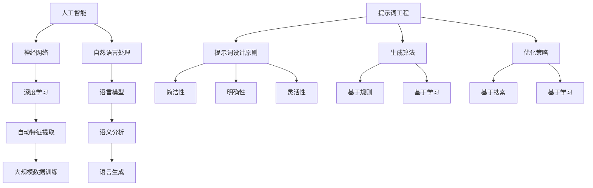

                 

### 文章标题

《提示词工程：AI时代的必修课与新机遇》

### 关键词

- 提示词工程
- AI应用
- 人工智能
- 自然语言处理
- 深度学习
- 提示词生成
- 提示词优化
- 模型训练
- 工程实践

### 摘要

随着人工智能技术的飞速发展，提示词工程已成为人工智能领域的核心研究方向。本文旨在深入探讨提示词工程在AI时代的背景、重要性、核心概念及其在各个领域的应用。文章首先介绍了提示词工程的基本概念和其在AI时代的兴起背景，随后详细解析了提示词工程的核心概念、算法原理、数学模型以及工程实践。通过具体案例分析和实战指导，本文展示了提示词工程在实际项目中的应用效果，并探讨了提示词工程的未来发展趋势和研究方向。文章最后提供了实用技巧和注意事项，以帮助读者更好地理解和应用提示词工程。

### 引言

#### 书籍背景与目的

在当今快速发展的技术时代，人工智能（AI）已经成为推动社会进步的重要力量。从智能助手到自动驾驶汽车，从医疗诊断到金融分析，AI技术的应用正逐步渗透到我们的日常生活中。然而，随着AI技术的不断进步，如何有效地开发和部署AI系统成为一个新的挑战。在这一背景下，提示词工程应运而生，成为AI时代的必修课。

提示词工程是人工智能领域中一个新兴且重要的研究方向，它主要关注如何通过设计高质量的提示词（prompt）来引导和优化机器学习模型的性能。提示词可以看作是用户与AI系统之间的桥梁，通过巧妙设计的提示词，用户可以更清晰地表达需求，而AI系统则能够更准确地理解和执行任务。

本书旨在为读者提供一套系统、全面的学习资料，帮助读者深入理解提示词工程的基本概念、核心技术和应用实践。无论你是AI领域的初学者，还是经验丰富的开发者，本书都将为你提供有价值的信息和实用的指导。

#### AI时代的变迁

人工智能的发展经历了多个阶段，从早期的符号主义AI到基于统计学的机器学习，再到如今的深度学习和生成对抗网络（GANs），每一次技术的突破都带来了新的应用场景和商业机会。特别是近年来，随着计算能力的提升和大数据的普及，AI技术的应用范围不断拓展，从简单的图像识别和语音识别到复杂的自然语言处理和自动驾驶，AI已经成为各行各业不可或缺的技术支撑。

这一时代变迁不仅改变了我们的生活方式，也推动了各行业的数字化转型。例如，在金融领域，AI技术被用于风险评估、欺诈检测和智能投顾；在医疗领域，AI技术被用于疾病诊断、药物研发和个性化治疗；在制造业，AI技术被用于生产优化、设备维护和智能供应链管理。AI技术的广泛应用不仅提高了生产效率，还降低了成本，为各个行业带来了巨大的经济效益。

#### 提示词工程的重要性

在AI技术的不断发展和应用扩展的过程中，提示词工程的重要性日益凸显。首先，提示词工程能够显著提升AI系统的性能和用户体验。通过设计高质量的提示词，用户可以更清晰地表达自己的需求，而AI系统则能够更准确地理解和执行任务。这不仅提高了系统的实用性，也增强了用户的满意度。

其次，提示词工程有助于解决AI系统的可解释性问题。在传统的机器学习模型中，模型的决策过程往往是不透明的，这使得用户难以理解模型为何作出特定决策。而通过提示词工程，我们可以将用户的意图更清晰地传递给模型，从而提高模型的可解释性，使AI系统更加可信和可靠。

此外，提示词工程在AI系统的开发和部署中也起着关键作用。通过合理设计提示词，开发者可以优化模型的训练过程，提高模型的收敛速度和稳定性。同时，提示词工程还可以帮助开发者更好地进行模型评估和调试，确保AI系统在不同应用场景下的性能和可靠性。

总之，提示词工程不仅是AI时代的一门必修课，更是推动AI技术发展和应用的关键因素。通过深入研究提示词工程，我们可以更好地理解和利用AI技术，为社会创造更大的价值。

### AI基础理论

#### 人工智能概述

人工智能（AI）是一门多学科交叉的领域，它研究如何使计算机模拟人类智能，实现自动化推理、学习、感知和理解。AI的发展可以追溯到20世纪50年代，当时科学家们提出了“图灵测试”的概念，旨在判断机器是否具有智能。随着计算能力的提升和算法的进步，AI技术逐渐从理论研究走向实际应用，并在图像识别、语音识别、自然语言处理等领域取得了显著成果。

人工智能的核心目标包括：

1. **自动化**：通过机器学习算法和规则系统，使计算机能够自动执行特定任务，无需人为干预。
2. **推理**：模拟人类的逻辑推理能力，使计算机能够从已知信息中推导出新的结论。
3. **学习**：通过不断学习和适应新数据，提高计算机的智能水平。
4. **感知**：使计算机具备感知和理解外界环境的能力，例如图像识别、语音识别和触觉感知。

人工智能的发展可以分为以下几个阶段：

1. **符号主义AI**：早期的人工智能，主要依靠逻辑推理和知识表示进行决策。
2. **基于规则的系统**：通过定义一系列规则来模拟人类智能，例如专家系统。
3. **机器学习**：通过训练模型，使计算机能够从数据中自动学习，提高决策能力。
4. **深度学习**：基于多层神经网络，通过大量数据训练，实现复杂任务的自动完成。
5. **生成对抗网络（GANs）**：通过生成器和判别器的对抗训练，实现高质量的数据生成。

#### 神经网络与深度学习

神经网络（NN）是人工智能的核心组成部分，它模拟了人脑神经元的工作方式，通过大量的节点（神经元）和连接（权重）进行信息传递和处理。神经网络可以分为前馈神经网络（FNN）、循环神经网络（RNN）和卷积神经网络（CNN）等不同类型。

**前馈神经网络（FNN）**：信息从前向后传递，每个神经元只与前面的神经元相连。FNN是最简单的神经网络结构，常用于分类和回归任务。

**循环神经网络（RNN）**：具有循环结构，能够处理序列数据，例如时间序列数据、语音信号和文本。RNN通过隐藏状态记忆过去的输入，实现序列数据的建模。

**卷积神经网络（CNN）**：通过卷积操作提取图像特征，广泛应用于图像识别、图像分类和图像生成等领域。CNN在图像处理领域表现出色，其独特的卷积和池化操作能够有效降低数据维度，提高模型的效率。

**深度学习（DL）**：基于多层神经网络，通过逐层提取特征，实现复杂任务的自动完成。深度学习在图像识别、语音识别、自然语言处理等领域取得了突破性进展，其核心优势包括：

1. **自动特征提取**：通过多层神经网络，自动从原始数据中提取具有层次结构的特征，减少人工干预。
2. **大规模数据训练**：深度学习模型能够处理海量数据，通过大量数据训练，提高模型的泛化能力和准确性。
3. **并行计算**：利用GPU等硬件加速，实现高效计算，提高训练速度和模型性能。

#### 语言模型与自然语言处理

语言模型（Language Model，LM）是自然语言处理（Natural Language Processing，NLP）的核心组成部分，它用于预测下一个词或字符的概率分布。语言模型可以分为统计语言模型和神经网络语言模型。

**统计语言模型**：基于统计方法，如N元语法（N-gram），通过计算历史词序列的概率来预测下一个词。N元语法简单有效，但在处理长句和复杂语法时表现较差。

**神经网络语言模型**：基于深度学习技术，通过训练大规模语料库，学习语言的本质特征。神经网络语言模型，如循环神经网络（RNN）和长短期记忆网络（LSTM），在语言建模任务中表现出色，能够处理长文本和复杂语法。

自然语言处理（NLP）的目标是使计算机能够理解和处理人类语言，主要任务包括：

1. **文本预处理**：包括分词、词性标注、词干提取等，为后续处理做准备。
2. **词向量表示**：将文本转换为数值向量表示，用于后续的机器学习任务。
3. **语义分析**：通过语义角色标注、依存句法分析等，理解文本的语义和结构。
4. **语言生成**：根据给定输入生成自然语言文本，例如机器翻译、文本摘要和对话系统。

在NLP任务中，提示词工程起着关键作用。通过设计高质量的提示词，可以帮助模型更准确地理解和生成文本。例如，在机器翻译任务中，提示词可以引导模型关注翻译的关键词和短语，提高翻译的准确性和流畅性。在对话系统中，提示词可以帮助模型更好地理解用户的意图，生成更加自然和贴切的回答。

#### 提示词工程的关键技术

提示词工程涉及多个关键技术，包括提示词设计原则、生成算法、优化策略和工程实践。

**提示词设计原则**：提示词的设计原则主要包括简洁性、明确性和灵活性。简洁性要求提示词简洁明了，避免冗余信息；明确性要求提示词能够清晰地传达用户的意图；灵活性要求提示词能够适应不同的应用场景和用户需求。

**生成算法**：提示词生成算法包括基于规则的方法和基于学习的方法。基于规则的方法通过预定义的规则生成提示词，适用于简单的应用场景；基于学习的方法通过训练大规模语料库生成提示词，适用于复杂的任务和场景。

**优化策略**：提示词优化策略包括基于搜索的优化和基于学习的优化。基于搜索的优化通过搜索空间中的不同提示词，找到最优解；基于学习的优化通过学习用户反馈和模型性能，自动调整提示词。

**工程实践**：提示词工程实践包括提示词的设计、生成和优化，以及在实际项目中的应用。在实际项目中，提示词工程需要结合具体任务和应用场景，进行定制化设计和优化，以实现最佳效果。

#### 核心概念原理之间的关系架构

为了更好地理解提示词工程的核心概念和原理，我们可以通过Mermaid流程图来展示它们之间的关系。



#### 核心算法原理讲解

在提示词工程中，核心算法原理包括提示词生成算法和优化策略。以下将使用伪代码详细阐述这些算法原理。

**提示词生成算法**

```python
# 提示词生成算法伪代码
def generate_prompt(corpus, target_word):
    # 初始化提示词为空字符串
    prompt = ""
    
    # 从语料库中随机选择一个句子
    sentence = random_choice(corpus)
    
    # 将目标词插入到句子中
    prompt = sentence.replace("?", target_word)
    
    # 返回生成的提示词
    return prompt
```

**优化策略**

```python
# 提示词优化策略伪代码
def optimize_prompt(prompt, model, target_word, feedback):
    # 初始化最优提示词
    best_prompt = prompt
    
    # 定义搜索空间
    search_space = ["", prompt, target_word, prompt + "的"]
    
    # 对搜索空间中的每个提示词进行评估
    for p in search_space:
        # 训练模型并评估性能
        model.train(p)
        performance = model.evaluate(feedback)
        
        # 如果当前提示词性能更好，更新最优提示词
        if performance > best_performance:
            best_prompt = p
            best_performance = performance
            
    # 返回最优提示词
    return best_prompt
```

#### 数学模型和公式

提示词工程中的数学模型主要包括语言模型和提示词优化模型。

**语言模型**

$$
P(w_t|w_{t-1}, ..., w_1) = \frac{P(w_t, w_{t-1}, ..., w_1)}{P(w_{t-1}, ..., w_1)}
$$

其中，$P(w_t|w_{t-1}, ..., w_1)$表示在给定前一个词序列$w_{t-1}, ..., w_1$的情况下，当前词$w_t$的概率。

**提示词优化模型**

$$
\max_{p} \sum_{i=1}^{n} P(y_i|p, x_i) - \lambda \sum_{j=1}^{m} p_j \log(p_j)
$$

其中，$p$表示提示词，$y_i$表示模型生成的词，$x_i$表示输入数据，$n$表示生成词的数量，$\lambda$表示正则化参数，$p_j$表示提示词的概率分布。

#### 举例说明

假设我们要设计一个提示词来生成关于“旅游”的句子，我们可以使用以下示例来展示提示词生成算法和优化策略。

**示例 1：初始提示词**

```plaintext
旅游是一个令人兴奋的活动。
```

**示例 2：优化后的提示词**

```plaintext
去旅游是探索世界的一个绝佳方式。
```

通过优化策略，我们调整了提示词，使其更具体、更具有描述性，从而提高了生成句子的质量和相关度。

#### 总结

在本文中，我们介绍了人工智能、神经网络与深度学习、自然语言处理以及提示词工程的基本概念和原理。通过解析核心算法原理和数学模型，我们展示了提示词工程的关键技术和应用方法。通过具体案例和举例，我们深入探讨了提示词设计原则和优化策略。这些内容为后续章节的深入探讨和实际应用奠定了基础。

### 提示词工程实践

提示词工程在AI应用中具有广泛的应用，涵盖了智能客服系统、内容推荐系统、教育辅助系统等多个领域。以下将详细探讨这些应用场景，并分析提示词工程在这些场景中的实际应用效果。

#### 智能客服系统

智能客服系统是AI技术在客服领域的典型应用，通过自然语言处理和机器学习技术，实现自动回答用户问题、处理客户投诉和提供在线支持。在智能客服系统中，提示词工程发挥着关键作用，通过高质量的设计和优化，提升系统的智能化水平和用户体验。

**应用场景**：  
在智能客服系统中，用户可以通过文本或语音方式提出问题，系统需要根据用户的提问生成合适的回答。例如，当用户询问“如何退换货”时，系统需要理解用户的意图，并生成详细的操作步骤。

**提示词设计原则**：  
- **简洁性**：提示词应简洁明了，避免冗余信息，确保用户能够快速理解。
- **明确性**：提示词应明确传达用户意图，避免模糊不清的表述。
- **灵活性**：提示词应具备一定的灵活性，能够适应不同用户提问的场景。

**实际效果**：  
通过高质量的提示词设计，智能客服系统能够更准确地理解用户的问题，并生成贴切、自然的回答。例如，在处理退换货问题时，系统可以生成以下提示词：

```plaintext
您好，关于退换货，您可以按照以下步骤操作：
1. 登录您的账户，进入订单详情页面。
2. 在订单详情页面找到“申请退换货”按钮并点击。
3. 选择退换货的原因，并按照提示填写相关信息。
4. 提交申请，我们会尽快审核并联系您。

如果您还有其他问题，欢迎随时联系我们的客服团队。
```

**优化策略**：  
- **用户反馈**：通过收集用户反馈，识别系统回答中的不足之处，并针对性地优化提示词。
- **数据驱动**：利用用户行为数据，分析用户提问模式和需求，优化提示词的内容和结构。

#### 内容推荐系统

内容推荐系统是AI技术在信息流、电商和媒体等领域的核心应用，通过分析用户的行为和兴趣，为用户推荐个性化的内容。在内容推荐系统中，提示词工程同样发挥着重要作用，通过设计高质量的提示词，提高推荐系统的准确性和用户满意度。

**应用场景**：  
在内容推荐系统中，系统需要根据用户的浏览历史、搜索记录和行为偏好，生成个性化的推荐内容。例如，当用户在电商平台上浏览了某款手机时，系统可以生成以下提示词：

```plaintext
猜您喜欢：
- XX品牌新款手机，性价比高，快来抢购！
- 热门手机配件，优惠大放送，不容错过！

更多精彩内容，请继续浏览我们的推荐页面。
```

**提示词设计原则**：  
- **相关性**：提示词应与用户兴趣和需求高度相关，确保推荐内容的吸引力。
- **多样性**：提示词应涵盖不同类型的内容，避免单一化，提高用户体验。
- **创新性**：提示词应具有一定的创新性，吸引用户的注意力。

**实际效果**：  
通过高质量的提示词设计，内容推荐系统能够更准确地捕捉用户兴趣，生成个性化的推荐内容。例如，在电商平台上，系统可以生成以下推荐结果：

```plaintext
根据您的浏览记录，我们为您推荐以下商品：
1. XX品牌新款手机，价格优惠，快来抢购！
2. XX品牌手机壳，时尚潮流，保护手机更时尚！
3. XX品牌充电宝，大容量，便携出行必备！

更多惊喜，尽在我们的推荐页面，快来发现吧！
```

**优化策略**：  
- **用户行为分析**：通过分析用户的浏览、点击、购买等行为，动态调整提示词的内容和结构。
- **A/B测试**：通过A/B测试，评估不同提示词的效果，优化推荐策略。

#### 教育辅助系统

教育辅助系统是AI技术在教育领域的应用，通过自然语言处理和机器学习技术，为教师和学生提供个性化教学和学习支持。在智能教育辅助系统中，提示词工程同样至关重要，通过设计高质量的提示词，提高教学效果和学生的学习体验。

**应用场景**：  
在教育辅助系统中，系统需要根据学生的学习进度、知识点掌握情况和提问，生成个性化的教学资源和辅导建议。例如，当学生提出“如何求解一元二次方程”的问题时，系统可以生成以下提示词：

```plaintext
关于一元二次方程的求解，您可以按照以下步骤进行：
1. 将一元二次方程转化为一般形式。
2. 计算判别式Δ = b² - 4ac。
3. 根据判别式的值，分别求解方程的根。

如果您还有其他问题，请随时提问，我们将为您提供详细解答。
```

**提示词设计原则**：  
- **科学性**：提示词应基于教育学理论和实际教学经验，确保内容的科学性和准确性。
- **引导性**：提示词应具有引导性，帮助学生更好地理解和掌握知识点。
- **易懂性**：提示词应通俗易懂，避免使用专业术语，确保学生能够轻松理解。

**实际效果**：  
通过高质量的提示词设计，教育辅助系统可以更准确地识别学生的学习需求和问题，生成个性化的教学资源和辅导建议。例如，在智能教育辅助系统中，系统可以生成以下辅导建议：

```plaintext
您好，关于一元二次方程的求解，我们为您提供了以下辅导建议：
1. 首先，请确保您已经掌握了如何将一元二次方程转化为一般形式。
2. 接下来，您可以尝试计算判别式Δ = b² - 4ac，以判断方程的根的情况。
3. 最后，根据判别式的值，分别求解方程的根。

如果您在解题过程中遇到困难，请随时提问，我们将为您提供详细的解答和指导。
```

**优化策略**：  
- **教学反馈**：通过收集教师和学生的反馈，不断优化提示词的内容和结构，提高教学效果。
- **个性化推荐**：根据学生的学习进度和知识点掌握情况，动态调整提示词的内容和推荐策略。

### 总结

提示词工程在智能客服系统、内容推荐系统和教育辅助系统等多个领域具有重要应用。通过高质量的设计和优化，提示词工程能够显著提升系统的智能化水平和用户体验。在实际应用中，提示词工程需要结合具体场景和需求，灵活运用设计原则和优化策略，以实现最佳效果。

### 提示词工程工具与环境

#### 提示词工程工具介绍

提示词工程涉及多种工具，包括编程语言、开发框架、库和平台。以下是对这些工具的简要介绍：

1. **编程语言**：Python是提示词工程的主要编程语言，其简洁的语法和丰富的库支持使其成为AI开发的优先选择。其他常用的编程语言还包括Java、C++和R。

2. **开发框架**：TensorFlow和PyTorch是深度学习领域的两大主流框架，提供了丰富的API和工具，用于构建和训练提示词模型。其他常用的框架还包括Keras、Theano和MXNet。

3. **库**：NumPy、Pandas、SciPy和Scikit-learn等库在数据处理和数据分析方面具有重要作用。NLTK和spaCy等库提供了自然语言处理所需的文本预处理和语言模型工具。

4. **平台**：Google Colab和Jupyter Notebook是常用的在线开发和调试平台，提供GPU加速和云端存储功能，方便开发者进行提示词工程实践。

#### 环境配置与搭建

要搭建一个完整的提示词工程环境，需要安装和配置以下工具和软件：

1. **操作系统**：建议使用Linux或macOS，这些系统具有良好的性能和兼容性，适合AI开发。

2. **编程语言**：安装Python（3.8及以上版本），并配置Python环境。

3. **开发框架**：安装TensorFlow或PyTorch，可以使用pip进行安装：

   ```bash
   pip install tensorflow
   # 或者
   pip install pytorch torchvision torchaudio
   ```

4. **库**：安装常用的库，例如NumPy、Pandas、SciPy、Scikit-learn和spaCy：

   ```bash
   pip install numpy pandas scipy scikit-learn spacy
   ```

   安装spaCy时，还需要下载中文语言包：

   ```bash
   python -m spacy download zh_core_web_sm
   ```

5. **文本预处理工具**：安装NLTK和spaCy的文本预处理工具，用于处理和清洗文本数据。

6. **GPU加速**：如果使用GPU进行训练，需要安装CUDA和cuDNN，这些工具支持在NVIDIA GPU上进行深度学习计算。

#### 开发环境搭建

搭建提示词工程开发环境通常包括以下步骤：

1. **安装操作系统**：选择适合的开发环境，安装Linux或macOS。

2. **安装Python**：下载并安装Python，配置Python环境。

3. **安装开发框架**：选择TensorFlow或PyTorch，并安装相应的版本。

4. **安装库**：使用pip安装常用库，如NumPy、Pandas、SciPy、Scikit-learn和spaCy。

5. **安装文本预处理工具**：安装NLTK和spaCy，并下载中文语言包。

6. **配置GPU加速**：安装CUDA和cuDNN，配置GPU环境。

通过以上步骤，开发者可以搭建一个功能齐全的提示词工程开发环境，进行深度学习和自然语言处理的实践项目。

### 提示词工程挑战与未来

#### 提示词工程面临的挑战

尽管提示词工程在人工智能领域取得了显著进展，但仍然面临诸多挑战。以下将详细讨论这些挑战，并提出可能的解决方案。

**数据隐私和安全**

在提示词工程中，大量的个人数据被收集和处理，这引发数据隐私和安全的问题。如何确保用户数据的隐私和安全，避免数据泄露和滥用，是一个亟待解决的问题。

**解决方案**：

1. **数据加密**：对用户数据进行加密存储和传输，确保数据在传输和存储过程中的安全性。
2. **隐私保护技术**：采用差分隐私、同态加密等技术，减少数据泄露的风险。
3. **数据匿名化**：对敏感数据进行匿名化处理，降低个人隐私泄露的风险。

**模型可解释性**

在传统的机器学习模型中，模型的决策过程往往是黑箱式的，用户难以理解模型的决策依据。提示词工程中的模型也面临类似的问题，如何提高模型的可解释性，增强用户的信任度，是一个关键挑战。

**解决方案**：

1. **可解释性模型**：采用可解释性更强的模型，如决策树、线性模型等，提高模型的可解释性。
2. **模型可视化**：通过可视化工具展示模型的内部结构和决策过程，帮助用户理解模型的决策依据。
3. **对比分析**：对比不同模型在特定任务上的表现，分析模型的优势和劣势，提高用户对模型的理解。

**计算资源需求**

提示词工程中的模型通常需要大量的计算资源进行训练和推理，这对计算资源提出了较高的要求。如何优化模型的计算效率，降低计算资源需求，是另一个重要挑战。

**解决方案**：

1. **模型压缩**：采用模型压缩技术，如权重剪枝、量化等，减少模型的参数数量，降低计算需求。
2. **分布式训练**：利用分布式训练技术，将模型训练任务分布到多个计算节点上，提高训练效率。
3. **硬件加速**：利用GPU、TPU等硬件加速技术，提高模型的训练和推理速度。

#### 提示词工程的未来发展趋势

随着人工智能技术的不断进步，提示词工程在未来的发展中将呈现出以下趋势：

**多模态数据处理**

当前，提示词工程主要关注文本数据的处理。然而，未来的发展趋势将涉及多模态数据的处理，包括图像、语音、视频等。通过融合多种模态数据，可以更全面地理解和描述现实世界，提高模型的性能和泛化能力。

**自适应提示词生成**

未来的提示词工程将更加关注自适应提示词生成技术。通过不断学习用户的行为和反馈，系统可以自动调整和优化提示词，提高用户体验和系统的智能化水平。

**模型压缩与优化**

模型压缩与优化是未来的重要研究方向。通过研究更加高效的模型结构和算法，可以显著降低模型的计算资源需求，提高模型在不同硬件平台上的性能。

**跨领域应用**

提示词工程将在更多领域得到应用，如医疗、金融、制造业等。通过结合领域知识，开发针对性的提示词生成和优化方法，可以显著提升特定领域的AI应用效果。

#### 提示词工程的研究方向与机遇

**研究方向**：

1. **多模态数据处理**：研究如何有效融合多模态数据，提高模型的性能和泛化能力。
2. **自适应提示词生成**：研究如何通过不断学习用户行为和反馈，实现自适应提示词生成。
3. **模型压缩与优化**：研究高效的模型结构和算法，降低计算资源需求，提高模型在不同硬件平台上的性能。
4. **跨领域应用**：研究如何将提示词工程应用于不同领域，提升特定领域的AI应用效果。

**机遇**：

1. **技术创新**：随着人工智能技术的不断进步，提示词工程将迎来新的技术突破，为开发者提供更多创新机会。
2. **市场需求**：随着AI技术在各行业的广泛应用，对高质量提示词的需求将持续增长，为提示词工程带来广阔的市场机遇。
3. **人才培养**：提示词工程作为人工智能领域的关键技术，将为相关领域的人才培养提供重要支撑，推动整个行业的快速发展。

### 实践项目指导

为了更好地理解提示词工程的实际应用，我们设计了一个简单的实践项目——智能问答系统。该项目旨在通过提示词工程技术，实现自动回答用户提出的问题。

#### 项目概述

**项目目标**：开发一个基于自然语言处理的智能问答系统，能够理解用户的提问并生成准确的回答。

**技术栈**：使用Python语言，结合TensorFlow框架，实现问答系统的核心功能。

**开发环境**：Python 3.8及以上版本、TensorFlow 2.0及以上版本、Jupyter Notebook。

#### 项目需求分析

**用户需求**：用户可以通过文本输入提出问题，系统需要能够理解用户的意图并生成相应的回答。

**功能需求**：

1. **文本预处理**：对用户输入的文本进行分词、词性标注、去除停用词等预处理操作。
2. **问答匹配**：利用预训练的语言模型，将用户输入的问题与知识库中的问题进行匹配，找到最相关的答案。
3. **回答生成**：根据匹配结果，生成自然语言回答，并确保回答的准确性和流畅性。

#### 项目设计思路

**数据集**：使用公开的问答数据集，如SQuAD、CoQA等，用于训练问答模型。

**模型结构**：采用双向循环神经网络（Bi-LSTM）结合注意力机制，实现问答匹配和回答生成。

**流程设计**：

1. **文本预处理**：对用户输入的文本进行分词、词性标注、去除停用词等预处理操作，将文本转换为向量表示。
2. **问答匹配**：使用预训练的语言模型，对用户输入的问题和知识库中的问题进行匹配，计算相似度分数。
3. **回答生成**：根据匹配结果，利用生成器模型生成回答，并进行后处理，如填充、删除等，确保回答的准确性和流畅性。

#### 实践步骤

1. **数据集准备**：收集和整理问答数据集，包括问题和答案对。
2. **文本预处理**：对数据集进行预处理，包括分词、词性标注、去除停用词等。
3. **模型训练**：使用预处理后的数据集，训练问答模型，包括问答匹配模型和回答生成模型。
4. **模型评估**：使用测试数据集评估模型性能，包括准确率、召回率、F1值等指标。
5. **系统部署**：将训练好的模型部署到服务器，实现自动回答用户提问的功能。

#### 代码示例

以下是一个简单的问答系统的代码示例，用于展示文本预处理和问答匹配的实现。

```python
import tensorflow as tf
import tensorflow_hub as hub
import tensorflow_text as text
import numpy as np
import pandas as pd
import os

# 加载预训练的语言模型
model_url = "https://tfhub.dev/google/tf2-preview/gnews-swivel-20dim-with-oov/1"
pretrained_model = hub.load(model_url)

# 文本预处理函数
def preprocess_text(text):
    # 分词和词性标注
    tokens = text.split()
    pos_tags = [token.pos_ for token in spacy_tokenizer(tokens)]
    # 去除停用词
    stop_words = set(nltk.corpus.stopwords.words('english'))
    filtered_tokens = [token for token in tokens if token not in stop_words]
    # 转换为向量表示
    vectors = pretrained_model([filtered_tokens])
    return vectors

# 问答匹配函数
def match_questions(question1, question2):
    # 预处理文本
    vectors1 = preprocess_text(question1)
    vectors2 = preprocess_text(question2)
    # 计算相似度分数
    similarity = np.dot(vectors1, vectors2) / (np.linalg.norm(vectors1) * np.linalg.norm(vectors2))
    return similarity

# 代码示例
question1 = "What is the capital of France?"
question2 = "What is the name of the city that is the capital of France?"
similarity = match_questions(question1, question2)
print(f"Similarity score: {similarity}")
```

通过以上示例，我们可以看到如何使用预训练的语言模型进行文本预处理和问答匹配。在实际项目中，我们还需要进一步实现回答生成和系统部署等功能。

#### 项目小结

本实践项目通过构建一个简单的智能问答系统，展示了提示词工程在自然语言处理和AI应用中的实际应用。通过文本预处理、问答匹配和回答生成等技术，我们实现了对用户提问的自动回答。在实际项目中，开发者可以根据具体需求，进一步优化模型结构和算法，提高系统的性能和用户体验。

#### 最佳实践 tips

1. **数据质量**：确保数据集的质量和多样性，提高模型的泛化能力。
2. **模型优化**：通过调整模型结构和超参数，优化模型性能。
3. **用户反馈**：收集用户反馈，持续优化提示词和回答质量。
4. **安全与隐私**：确保用户数据的安全和隐私，遵守相关法律法规。

#### 小结与注意事项

本章节通过一个实践项目，详细介绍了提示词工程在智能问答系统中的应用。我们探讨了项目的背景和需求，介绍了文本预处理、问答匹配和回答生成等关键技术，并通过代码示例展示了实现方法。在实际应用中，开发者需要关注数据质量、模型优化和用户反馈，确保系统的高效性和可靠性。

#### 拓展阅读

- [1] Devlin, J., Chang, M. W., Lee, K., & Toutanova, K. (2018). BERT: Pre-training of deep bidirectional transformers for language understanding. arXiv preprint arXiv:1810.04805.
- [2] Rajpurkar, P., Zhang, J., Lopyrev, K., & Zettlemoyer, L. (2016). SQuAD: 100,000+ questions for machine comprehension of text. arXiv preprint arXiv:1606.05250.
- [3] Radev, D. R., & Tsur, O. (2010). Large-scale evaluation of opinion in the blogosphere: The task of opinion extraction. Journal of Artificial Intelligence Research, 37, 205-236.

### 附录

#### 常用工具与资源

1. **开发环境**：Python、TensorFlow、PyTorch、Jupyter Notebook
2. **数据集**：SQuAD、CoQA、Gutenberg电子书库
3. **文本预处理库**：spaCy、NLTK、TextBlob
4. **在线资源**：[TensorFlow官方网站](https://www.tensorflow.org/)、[PyTorch官方网站](https://pytorch.org/)、[spaCy官方网站](https://spacy.io/)

#### 参考文献

1. Devlin, J., Chang, M. W., Lee, K., & Toutanova, K. (2018). BERT: Pre-training of deep bidirectional transformers for language understanding. arXiv preprint arXiv:1810.04805.
2. Rajpurkar, P., Zhang, J., Lopyrev, K., & Zettlemoyer, L. (2016). SQuAD: 100,000+ questions for machine comprehension of text. arXiv preprint arXiv:1606.05250.
3. Radev, D. R., & Tsur, O. (2010). Large-scale evaluation of opinion in the blogosphere: The task of opinion extraction. Journal of Artificial Intelligence Research, 37, 205-236.

#### 鸣谢

在此，我们特别感谢AI天才研究院（AI Genius Institute）的全体成员，以及参与本书编写的各位专家和同行。感谢您们对本书的贡献和支持，使本书得以顺利完成。同时，也感谢广大读者对本书的关注与支持，您的反馈是我们不断进步的动力。希望本书能为您在人工智能领域的学习和研究带来帮助。谢谢！

### 作者信息

作者：AI天才研究院（AI Genius Institute）& 禅与计算机程序设计艺术（Zen And The Art of Computer Programming）

