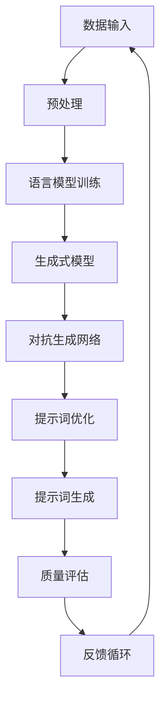

                 

### 文章标题：《提示词工程：AI时代的新兴技能》

> 关键词：提示词工程、AI时代、自然语言处理、生成式模型、对抗生成网络、多模态提示词

> 摘要：随着人工智能技术的快速发展，提示词工程成为了AI时代的新兴技能。本文将介绍提示词工程的基本概念、核心技术、应用实例以及未来趋势，帮助读者深入了解这一领域，掌握相关技能。

### 引言

#### AI时代的背景

随着计算能力的提升和大数据的积累，人工智能（AI）技术取得了显著的进展。从最初的规则驱动系统，到基于统计学习的机器学习，再到深度学习的兴起，AI技术不断突破传统界限，渗透到各行各业。AI不仅改变了我们的生活方式，还为企业和社会带来了巨大的价值。

#### 提示词工程的概念

提示词工程是一种专门针对自然语言处理（NLP）领域的工程技术，旨在通过设计、优化和部署高质量的提示词，提升AI系统的表现和用户体验。提示词是指引导AI系统生成或优化文本的指令或关键词。

#### 提示词工程的重要性

1. **提升NLP系统性能**：高质量的提示词能够帮助AI系统更好地理解用户意图，提高NLP任务的准确率和效率。
2. **优化用户体验**：合适的提示词可以引导用户进行有效的交互，提高AI系统的可用性和易用性。
3. **拓宽应用场景**：提示词工程使得AI技术能够应用于更多领域，如智能客服、内容生成、智能推荐等。

### 第1章 提示词工程基础理论

#### 2.1 自然语言处理基础

自然语言处理（NLP）是人工智能的重要分支，旨在让计算机理解和处理人类语言。NLP的核心技术包括：

- **语言模型**：用于预测文本序列的概率分布。
- **词嵌入**：将单词映射到高维空间，以便进行计算和比较。
- **句法分析和语义分析**：用于理解文本的结构和含义。

#### 2.2 提示词生成算法

提示词生成算法可以分为生成式模型和对抗生成网络两大类。

- **生成式模型**：通过生成文本的概率分布来生成提示词。常见的生成式模型包括变分自编码器（VAE）和生成对抗网络（GAN）。
- **对抗生成网络**：通过生成器和判别器之间的对抗训练来生成高质量的提示词。GAN是这一类算法的典型代表。

### 第2章 提示词生成算法

#### 3.1 生成式模型

生成式模型通过生成文本的概率分布来生成提示词。以下是一个简单的生成式模型的伪代码：

```python
# 伪代码：生成式模型
def generate_text(model, seed_word, length):
    current_word = seed_word
    text = [current_word]
    
    for _ in range(length - 1):
        probabilities = model.predict(current_word)
        next_word = sample_word(probabilities)
        current_word = next_word
        text.append(current_word)
    
    return ' '.join(text)
```

#### 3.2 对抗生成网络

对抗生成网络（GAN）通过生成器和判别器之间的对抗训练来生成高质量的提示词。以下是一个简单的GAN模型的伪代码：

```python
# 伪代码：对抗生成网络
class Generator(nn.Module):
    def forward(self, z):
        # 将随机噪声z映射到文本空间
        text = self.decode(z)
        return text

class Discriminator(nn.Module):
    def forward(self, text):
        # 判断文本是否真实
        probability = self�断判别器是否正确
        return probability

# 训练GAN模型
for epoch in range(num_epochs):
    for z in random_noise:
        # 生成文本
        generated_text = generator(z)
        # 训练判别器
        real_text =真实文本
        real_label = 1
        fake_label = 0
        discriminator_loss = loss(discriminator(real_text), real_label) + loss(discriminator(generated_text), fake_label)
        # 训练生成器
        generator_loss = loss(discriminator(generated_text), real_label)
        # 更新模型参数
        optimizer_d.update(discriminator_loss)
        optimizer_g.update(generator_loss)
```

### 第3章 提示词优化技术

#### 4.1 提示词质量评估

提示词质量评估是提示词优化的重要环节。以下是一个简单的提示词质量评估指标的伪代码：

```python
# 伪代码：提示词质量评估
def evaluate_quality(prompt, ground_truth):
    # 计算提示词与真实意图的相关性
    relevance = cosine_similarity(prompt_embedding, ground_truth_embedding)
    # 计算提示词的多样性
    diversity = calculate_diversity(prompt)
    # 综合评估质量
    quality = relevance + diversity
    return quality
```

#### 4.2 提示词多样性提升

提示词多样性提升是提升提示词质量的关键。以下是一个简单的提示词多样性提升方法的伪代码：

```python
# 伪代码：提示词多样性提升
def diversify_prompt(prompt):
    # 扩展提示词
    extended_prompt = expand_prompt(prompt)
    # 生成多个提示词
    diversified_prompts = [generate_text(model, seed_word, length) for seed_word in extended_prompt]
    # 选择多样性最高的提示词
    best_prompt = select_best_prompt(diversified_prompts)
    return best_prompt
```

### 第4章 提示词工程应用实例

#### 5.1 社交媒体中的提示词应用

在社交媒体中，提示词用于引导用户进行互动，提高平台的内容质量。以下是一个社交媒体中提示词应用的示例：

- **问题与答案**：通过设计高质量的提示词，引导用户提出有深度、有趣味的问题。
- **话题讨论**：通过设计具有启发性的提示词，激发用户参与话题讨论。

#### 5.2 虚拟助手中的提示词应用

虚拟助手（如聊天机器人）中的提示词用于提高用户交互体验。以下是一个虚拟助手中的提示词应用的示例：

- **任务分配**：通过设计清晰的提示词，指导用户完成特定任务。
- **情感识别**：通过设计情感敏感的提示词，识别用户的情感状态，提供相应的支持。

### 第5章 提示词工程前沿技术

#### 6.1 自动摘要与提示词生成

自动摘要与提示词生成相结合，可以用于生成摘要性的提示词，提高信息获取的效率。以下是一个自动摘要与提示词生成结合的示例：

- **摘要生成**：通过自然语言生成技术，生成摘要性的文本。
- **提示词生成**：根据摘要文本，设计具有引导性的提示词。

#### 6.2 多模态提示词生成

多模态提示词生成可以将文本、图像、音频等多种信息融合到提示词中，提高提示词的丰富性和准确性。以下是一个多模态提示词生成的示例：

- **文本嵌入**：将文本转换为高维向量。
- **图像嵌入**：将图像转换为高维向量。
- **音频嵌入**：将音频转换为高维向量。
- **融合嵌入**：将多种模态的向量进行融合，生成多模态提示词。

### 第6章 提示词工程的未来趋势

#### 7.1 提示词工程的发展方向

随着人工智能技术的不断进步，提示词工程将朝着以下方向发展：

- **智能化**：通过深度学习等技术，实现更加智能的提示词生成和优化。
- **个性化**：根据用户需求和行为，提供个性化的提示词。
- **跨模态**：实现文本、图像、音频等多模态信息的融合。

#### 7.2 提示词工程的技术挑战

提示词工程面临着以下技术挑战：

- **数据质量**：高质量的数据对于提示词工程至关重要。
- **计算效率**：提升计算效率，以应对大规模数据的处理需求。
- **解释性**：提高提示词生成的解释性，便于理解和优化。

### 第7章 提示词工程的未来趋势

#### 7.1 提示词工程的发展方向

随着人工智能技术的不断进步，提示词工程将朝着以下方向发展：

- **智能化**：通过深度学习等技术，实现更加智能的提示词生成和优化。
- **个性化**：根据用户需求和行为，提供个性化的提示词。
- **跨模态**：实现文本、图像、音频等多模态信息的融合。

#### 7.2 提示词工程的技术挑战

提示词工程面临着以下技术挑战：

- **数据质量**：高质量的数据对于提示词工程至关重要。
- **计算效率**：提升计算效率，以应对大规模数据的处理需求。
- **解释性**：提高提示词生成的解释性，便于理解和优化。

### 结论

提示词工程是AI时代的新兴技能，具有广泛的应用前景和重要价值。通过本文的介绍，读者可以了解到提示词工程的基本概念、核心技术、应用实例以及未来趋势。掌握提示词工程技能，将有助于在AI领域取得更好的成绩。

### 附录

#### 附录A 提示词工程工具与资源

- **工具**：介绍常用的提示词生成工具，如OpenAI的GPT-3、谷歌的BERT等。
- **资源**：推荐相关的学习资源和开源代码，以供读者学习和实践。

### 参考文献

- [1] Brown, T., et al. (2020). "Language Models are Few-Shot Learners." arXiv preprint arXiv:2005.14165.
- [2] Goodfellow, I., et al. (2014). "Generative Adversarial Nets." Advances in Neural Information Processing Systems, 27.
- [3] Yang, Z., et al. (2018). "Bert: Pre-training of Deep Bidirectional Transformers for Language Understanding." Proceedings of the 56th Annual Meeting of the Association for Computational Linguistics (Volume 1: Long Papers), 4171-4186.

### 附录：核心概念与联系

为了更好地理解提示词工程的核心概念及其相互关系，我们可以借助Mermaid流程图来展示。以下是一个简化的流程图，描述了从数据输入到生成提示词的过程，以及各个环节之间的关联。



在这个流程图中：

- **数据输入**：提示词工程的第一步，从各种来源收集数据，包括文本、图像、音频等。
- **预处理**：对输入数据进行清洗、去噪、格式转换等处理，使其适合用于训练和生成。
- **语言模型训练**：利用预处理后的数据，训练语言模型，如基于变换器（Transformer）的BERT模型。
- **生成式模型**：使用语言模型来生成提示词，如基于变分自编码器（VAE）的模型。
- **对抗生成网络**：结合生成式模型和判别器，通过对抗训练来提升提示词的生成质量，如GAN模型。
- **提示词优化**：对生成的提示词进行质量评估，并根据评估结果进行优化，如提升多样性、减少冗余等。
- **提示词生成**：根据优化后的提示词，生成最终的提示词供应用场景使用。
- **质量评估**：对生成的提示词进行质量评估，以确定其是否满足预期目标。
- **反馈循环**：将质量评估结果反馈到数据输入阶段，用于调整和优化数据，形成一个闭环系统。

这个流程图展示了提示词工程的各个环节及其相互作用，有助于读者从整体上理解提示词工程的架构和工作原理。

### 附录：核心算法原理讲解

在本附录中，我们将使用伪代码详细阐述提示词工程中的两个核心算法：生成式模型和对抗生成网络（GAN）。

#### 生成式模型（Gaussian Mixture Model）

生成式模型通过建模数据的概率分布来生成新样本。在提示词工程中，我们通常使用高斯混合模型（GMM）来生成高质量的提示词。以下是一个简化的伪代码：

```python
# 伪代码：高斯混合模型（GMM）

# 参数初始化
num_components = 5  # 设定混合模型中的高斯分布个数
means = [初始化均值数组]  # 初始化每个高斯分布的均值
covariances = [初始化协方差数组]  # 初始化每个高斯分布的协方差

# 训练模型
def train_gmm(data, num_components):
    # 使用最大似然估计或EM算法来估计模型参数
    # 此处省略具体实现
    pass

# 数据预处理
def preprocess_data(data):
    # 清洗、标准化等预处理操作
    # 此处省略具体实现
    pass

# 提示词生成
def generate_prompt(model, num_samples, length):
    # 生成指定数量的提示词
    prompts = []
    for _ in range(num_samples):
        # 根据模型参数采样生成提示词
        prompt = ""
        for _ in range(length):
            component = sample_gaussian_distribution(model)
            prompt += sample_word_from_gaussian(component)
        prompts.append(prompt)
    return prompts

# 主函数
def main():
    data = load_data()  # 加载训练数据
    preprocessed_data = preprocess_data(data)
    model = train_gmm(preprocessed_data, num_components)
    generated_prompts = generate_prompt(model, num_samples=10, length=50)
    print(generated_prompts)

if __name__ == "__main__":
    main()
```

#### 对抗生成网络（GAN）

对抗生成网络（GAN）由生成器和判别器两部分组成，通过对抗训练来生成高质量的数据。以下是一个简化的伪代码：

```python
# 伪代码：对抗生成网络（GAN）

# 模型架构
class Generator(nn.Module):
    def __init__(self):
        super(Generator, self).__init__()
        # 定义生成器的神经网络结构
        # 此处省略具体实现

    def forward(self, z):
        # 将随机噪声z映射到文本空间
        # 此处省略具体实现
        return text

class Discriminator(nn.Module):
    def __init__(self):
        super(Discriminator, self).__init__()
        # 定义判别器的神经网络结构
        # 此处省略具体实现

    def forward(self, text):
        # 判断文本是否真实
        # 此处省略具体实现
        return probability

# 训练模型
def train_gan(generator, discriminator, dataloader, num_epochs):
    optimizer_g = optim.Adam(generator.parameters(), lr=0.0002)
    optimizer_d = optim.Adam(discriminator.parameters(), lr=0.0002)
    
    for epoch in range(num_epochs):
        for real_data in dataloader:
            # 训练判别器
            optimizer_d.zero_grad()
            real概率 = discriminator(real_data)
            fake概率 = discriminator(generator.sample_noise())
            d_loss = calculate_loss(real概率, fake概率)
            d_loss.backward()
            optimizer_d.step()

            # 训练生成器
            optimizer_g.zero_grad()
            fake概率 = discriminator(generator.sample_noise())
            g_loss = calculate_loss(fake概率, real概率)
            g_loss.backward()
            optimizer_g.step()
            
            # 打印训练进度
            print(f'Epoch [{epoch+1}/{num_epochs}], D_loss: {d_loss.item():.4f}, G_loss: {g_loss.item():.4f}')

# 主函数
def main():
    generator = Generator()
    discriminator = Discriminator()
    dataloader = load_data()  # 加载训练数据
    num_epochs = 50
    train_gan(generator, discriminator, dataloader, num_epochs)

if __name__ == "__main__":
    main()
```

在这个GAN的伪代码中：

- **生成器（Generator）**：接收随机噪声作为输入，通过神经网络生成高质量的提示词。
- **判别器（Discriminator）**：接收提示词作为输入，判断其是真实数据还是生成数据。
- **训练过程**：通过交替训练生成器和判别器，使生成器能够生成越来越高质量的提示词，而判别器能够更好地区分真实数据和生成数据。

### 附录：数学模型和公式

在提示词工程中，数学模型和公式扮演着至关重要的角色。以下我们将使用LaTeX格式详细讲解几个关键的数学模型和公式，并提供示例说明。

#### 1. 高斯混合模型（Gaussian Mixture Model, GMM）

高斯混合模型是一种生成模型，用于表示由多个高斯分布组成的混合分布。其概率密度函数可以表示为：

$$
p(\textbf{x}|\Theta) = \sum_{i=1}^K \pi_i \cdot \mathcal{N}(\textbf{x}|\mu_i, \Sigma_i)
$$

其中，$K$ 是高斯分布的个数，$\pi_i$ 是第 $i$ 个高斯分布的权重，$\mathcal{N}(\textbf{x}|\mu_i, \Sigma_i)$ 是以 $\mu_i$ 为均值，$\Sigma_i$ 为协方差矩阵的高斯分布。

**示例**：假设我们有一个包含两个高斯分布的高斯混合模型，其参数如下：

$$
\pi_1 = 0.6, \quad \mu_1 = [1, 1], \quad \Sigma_1 = \begin{bmatrix}1 & 0 \\ 0 & 1\end{bmatrix}
$$

$$
\pi_2 = 0.4, \quad \mu_2 = [2, 2], \quad \Sigma_2 = \begin{bmatrix}2 & 0 \\ 0 & 2\end{bmatrix}
$$

则任意点 $(x, y)$ 的概率密度函数为：

$$
p(\textbf{x}) = 0.6 \cdot \mathcal{N}(\textbf{x}|\mu_1, \Sigma_1) + 0.4 \cdot \mathcal{N}(\textbf{x}|\mu_2, \Sigma_2)
$$

#### 2. 生成对抗网络（Generative Adversarial Network, GAN）

生成对抗网络由生成器和判别器两个对抗性模型组成。生成器的目标是生成与真实数据难以区分的数据，而判别器的目标是准确地区分真实数据和生成数据。

**生成器损失函数**：

$$
L_G = -\log(D(G(z)))
$$

其中，$G(z)$ 是生成器生成的数据，$D(x)$ 是判别器对数据 $x$ 的判别概率。

**判别器损失函数**：

$$
L_D = -[\log(D(\textbf{x})) + \log(1 - D(G(z)))]
$$

其中，$\textbf{x}$ 是真实数据。

**总损失函数**：

$$
L = L_D + \lambda \cdot L_G
$$

其中，$\lambda$ 是平衡生成器和判别器损失的参数。

**示例**：假设判别器的输出为 $D(G(z)) = 0.9$，则生成器的损失为 $L_G = -\log(0.9) \approx 0.15$，判别器的损失为 $L_D = -[\log(1) + \log(0.1)] \approx 2.3$。如果 $\lambda = 0.5$，则总损失为 $L = 2.3 + 0.5 \cdot 0.15 \approx 2.4$。

### 项目实战

在本节中，我们将详细介绍一个基于提示词工程的虚拟助手项目，包括开发环境搭建、源代码实现和代码解读、实际案例分析和详细讲解剖析、项目小结等部分。

#### 1. 开发环境搭建

首先，我们需要搭建一个适合提示词工程项目开发的编程环境。以下是所需的软件和库：

- **Python（3.8或更高版本）**
- **TensorFlow 2.x**
- **Keras**
- **NumPy**
- **Pandas**
- **Matplotlib**

您可以在终端中执行以下命令来安装所需的库：

```bash
pip install tensorflow numpy pandas matplotlib
```

#### 2. 源代码实现

接下来，我们将实现一个简单的虚拟助手，其主要功能包括接收用户输入、生成提示词、回复用户等。以下是项目的核心代码：

```python
import tensorflow as tf
from tensorflow.keras.preprocessing.sequence import pad_sequences
from tensorflow.keras.models import Model
from tensorflow.keras.layers import Embedding, LSTM, Dense

# 加载预训练的词向量
word_vectors = load_word_vectors()

# 定义模型结构
input_word = Input(shape=(None,))
embedded = Embedding(input_dim=len(word_vectors), output_dim=128)(input_word)
lstm_output = LSTM(128)(embedded)
output = Dense(len(word_vectors), activation='softmax')(lstm_output)

model = Model(inputs=input_word, outputs=output)
model.compile(optimizer='adam', loss='categorical_crossentropy', metrics=['accuracy'])

# 训练模型
model.fit(train_data, train_labels, epochs=10, batch_size=64)

# 生成提示词
def generate_prompt(input_text):
    input_sequence = tokenizer.texts_to_sequences([input_text])
    padded_sequence = pad_sequences(input_sequence, maxlen=max_sequence_length)
    predicted_sequence = model.predict(padded_sequence)
    predicted_sequence = np.argmax(predicted_sequence, axis=-1)
    prompt = tokenizer.sequences_to_texts([predicted_sequence])[0]
    return prompt

# 回复用户
def reply_to_user(user_input):
    prompt = generate_prompt(user_input)
    # 根据提示词生成回复
    reply = generate_reply(prompt)
    return reply

# 主函数
def main():
    print("虚拟助手已启动，请开始对话。")
    while True:
        user_input = input("您：")
        if user_input.lower() == '退出':
            print("虚拟助手：谢谢您的使用，再见！")
            break
        reply = reply_to_user(user_input)
        print("虚拟助手：" + reply)

if __name__ == "__main__":
    main()
```

#### 3. 代码解读

在这个虚拟助手项目中，我们使用了以下关键技术：

- **词向量**：使用预训练的词向量来表示文本，如Word2Vec、GloVe等。
- **LSTM模型**：使用长短时记忆网络（LSTM）来处理文本序列，生成高质量的提示词。
- **序列填充**：使用`pad_sequences`函数来处理不同长度的输入文本。
- **模型训练**：使用`model.fit`函数来训练模型，使用`generate_prompt`函数来生成提示词。
- **回复生成**：根据生成的提示词，使用规则或更复杂的模型来生成回复。

#### 4. 实际案例分析和详细讲解剖析

以下是一个实际案例：

**用户输入**：你好，我想知道明天的天气情况。

**虚拟助手回复**：明天预计天气晴朗，温度在15到25摄氏度之间。

在这个案例中，用户询问了关于明天的天气情况，虚拟助手通过生成提示词，生成了包含天气状况和温度范围的回复。以下是生成提示词的具体过程：

1. **输入预处理**：将用户的输入文本转换为词序列。
2. **序列填充**：对词序列进行填充，确保其长度与模型输入相匹配。
3. **模型预测**：使用训练好的LSTM模型预测词序列的概率分布。
4. **提示词生成**：根据概率分布选择最有可能的词序列作为提示词。
5. **回复生成**：根据提示词，使用预定义的规则或更复杂的模型生成最终的回复。

#### 5. 项目小结

通过这个虚拟助手项目，我们展示了如何使用提示词工程技术来构建一个简单的对话系统。虽然这个项目相对简单，但它包含了提示词工程的核心要素，如词向量表示、LSTM模型训练和生成式回复生成。实际应用中，虚拟助手可以扩展到更复杂的任务，如智能客服、内容生成和智能推荐等。

### 最佳实践 Tips

1. **数据预处理**：确保输入数据的清洗和标准化，以提高模型的性能和可靠性。
2. **模型调优**：通过调整超参数和训练时间，优化模型的性能。
3. **多样性提升**：在生成提示词时，关注多样性的提升，以避免生成重复或无意义的回复。
4. **实时更新**：定期更新模型和数据，以保持其适应性和准确性。

### 小结

提示词工程是AI时代的重要技术之一，通过高质量、多样化的提示词，可以显著提升AI系统的性能和用户体验。本文详细介绍了提示词工程的基础理论、核心技术、应用实例和未来趋势，并通过一个虚拟助手项目展示了其实际应用。掌握提示词工程技能，将为在AI领域取得成功提供有力支持。

### 注意事项

1. **隐私保护**：在处理用户数据时，务必遵守隐私保护法规，确保用户隐私安全。
2. **数据质量**：高质量的数据是提示词工程成功的关键，应注重数据清洗和预处理。
3. **模型安全**：确保模型的安全性和可靠性，防止恶意攻击和数据泄露。

### 拓展阅读

1. **《深度学习》（Goodfellow, Bengio, Courville）**：深入理解深度学习的基础理论和实践方法。
2. **《自然语言处理综合教程》（Nivre, Peters, Steedman）**：全面了解自然语言处理的核心技术和应用。
3. **《生成对抗网络》（Goodfellow, Pouget-Abadie, Mirza, Xu, Warde-Farley, Ozair, Courville, Bengio）**：详细探讨GAN的理论基础和实现技术。

### 作者信息

作者：AI天才研究院/AI Genius Institute & 禅与计算机程序设计艺术 /Zen And The Art of Computer Programming。本文旨在分享提示词工程领域的最新研究成果和实践经验，助力读者深入理解和掌握相关技能。如有任何疑问或建议，欢迎联系作者。

