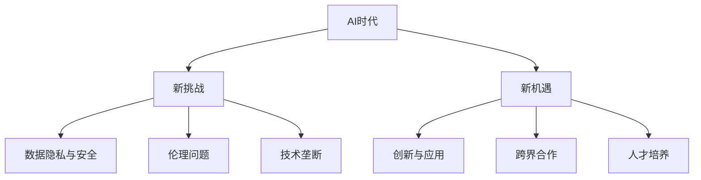
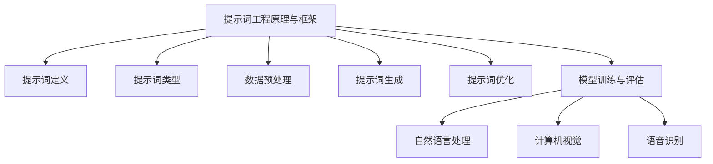

                 

### 第1章：AI时代的新挑战与新机遇概述

> **关键词：** AI时代、新挑战、新机遇、提示词工程

在当前的信息时代，人工智能（AI）已成为推动社会进步和经济发展的重要引擎。随着深度学习、大数据和云计算等技术的快速发展，AI的应用领域不断扩大，从传统的制造业、医疗健康到新兴的金融科技、自动驾驶等领域，都展现出了巨大的潜力和市场前景。然而，AI的快速发展也带来了一系列新挑战和新机遇，特别是提示词工程这一领域，其在AI时代的地位和作用愈发重要。

#### 1.1 AI时代的到来

人工智能的概念可以追溯到20世纪50年代，当时的科学家们开始探索如何使计算机具有人类的智能。随着计算机硬件性能的提升和算法的改进，人工智能从理论研究逐渐走向实际应用。深度学习作为AI的重要分支，在近年来取得了显著进展，特别是在图像识别、自然语言处理、语音识别等方面。这些技术的突破不仅提升了AI系统的性能，也为AI技术的广泛应用奠定了基础。

**1.1.1 AI的起源与发展**

人工智能的起源可以追溯到1956年，当时达特茅斯会议上，约翰·麦卡锡（John McCarthy）等科学家首次提出了人工智能的概念。此后，AI领域经历了多个发展阶段：

- **早期探索阶段（1956-1969）**：这一阶段以符号主义和逻辑推理为主要方法，试图通过编程实现人类智能。代表性的工作是艾伦·图灵（Alan Turing）提出的“图灵测试”，用以评估机器是否具有智能。
  
- **繁荣与低谷阶段（1970-1980）**：由于计算能力和算法的限制，人工智能在70年代进入低谷期。然而，符号主义方法在这一阶段得到了进一步发展。

- **复苏与实用阶段（1980-1990）**：随着计算机硬件的升级和算法的改进，AI开始从理论研究走向实际应用，如专家系统、机器人等。

- **深度学习时代（1990至今）**：深度学习的兴起标志着AI进入了一个新的时代。基于神经网络的深度学习在图像识别、自然语言处理、语音识别等领域取得了显著成果。

**1.1.2 AI时代的特点**

AI时代的到来，不仅带来了技术的革新，也改变了人类社会的方方面面。以下是AI时代的主要特点：

- **数据驱动**：AI的进步依赖于海量数据，数据的质量和数量直接影响AI的性能。大数据技术为AI提供了丰富的数据资源，使得AI系统能够从海量数据中学习到更多的知识和规律。

- **自主决策**：AI系统能够在给定条件下自主做出决策，提高效率和质量。例如，自动驾驶汽车可以通过感知环境、理解交通规则，并自主做出行驶决策。

- **智能化服务**：AI技术在智能客服、智能推荐、自动驾驶等领域得到了广泛应用，改变了人们的生活方式。智能客服能够实时响应用户需求，提供个性化服务；智能推荐系统可以根据用户的历史行为，提供个性化的商品推荐。

- **安全与伦理问题**：随着AI技术的广泛应用，安全与伦理问题也日益突出。如何保障用户隐私，如何确保AI系统的公平性和透明性，成为亟待解决的问题。

#### 1.2 提示词工程的概念与作用

在AI时代，提示词工程成为提高AI系统性能和应用效果的重要手段。提示词工程是指利用自然语言处理技术，生成或调整提示词，以提高AI模型的性能和应用效果的过程。提示词是AI模型理解和处理输入信息的关键。

**1.2.1 提示词工程的定义**

提示词工程是指通过对自然语言进行深入分析，生成或调整提示词，以优化AI模型性能的过程。提示词可以是单个词语或短语，也可以是句子或段落。在AI系统中，提示词用于引导模型理解和处理输入信息，从而提高模型的性能和应用效果。

**1.2.2 提示词工程的作用**

- **提高模型性能**：恰当的提示词能够帮助模型更好地理解和处理输入信息，从而提高模型的性能。例如，在文本分类任务中，合适的提示词可以帮助模型更好地区分不同类别的文本。

- **简化模型训练**：通过提示词工程，可以减少模型的训练时间，降低计算资源需求。例如，通过优化提示词，可以使模型对输入信息有更精准的理解，从而减少训练所需的样本数量。

- **优化应用效果**：提示词工程可以帮助AI模型在不同应用场景下实现最佳效果。例如，在智能客服系统中，通过优化提示词，可以使系统更准确地理解用户的意图，提供更优质的客户服务。

#### 1.3 AI时代的新挑战与新机遇

AI时代的到来不仅带来了技术的革新，也带来了新的挑战和机遇。以下是AI时代面临的主要挑战和机遇：

**1.3.1 新挑战**

- **数据隐私与安全**：随着AI技术的发展，数据隐私和安全问题日益突出。AI系统通常需要处理海量数据，如何保障用户数据的安全，成为一大挑战。

- **伦理问题**：AI技术在某些领域的应用可能引发伦理争议，如自动驾驶汽车的伦理决策等。如何在技术发展中平衡伦理问题，是一个亟待解决的难题。

- **技术垄断**：大型科技公司在AI领域占据主导地位，可能导致技术垄断，限制创新。如何促进技术开放和共享，是一个重要的挑战。

**1.3.2 新机遇**

- **创新与应用**：AI技术为各行业带来了前所未有的创新机遇，如智能制造、智能医疗等。通过AI技术，企业可以提升生产效率，改善服务质量。

- **跨界合作**：AI技术与传统行业的融合，将催生新的商业模式和产业形态。例如，AI与金融、医疗、教育等领域的结合，将带来新的业务模式和解决方案。

- **人才培养**：随着AI技术的发展，对AI专业人才的需求不断增加，为人才培养提供了新机遇。通过培养高素质的AI人才，可以推动AI技术的发展和应用。

### Mermaid 流程图

在AI时代，提示词工程作为提高AI系统性能和应用效果的重要手段，其作用愈发重要。面对新挑战和新机遇，我们需要不断探索和创新，以推动AI技术的发展和应用。

### 第2章：提示词工程原理与框架

在AI时代，提示词工程（Prompt Engineering）已经成为提高人工智能（AI）模型性能和应用效果的关键技术。本章将深入探讨提示词工程的原理与框架，帮助读者理解这一领域的基本概念、流程和应用。

#### 2.1 提示词工程的核心概念

**2.1.1 提示词的定义**

提示词（Prompt）是用于引导AI模型理解和处理输入信息的词语或短语。它们可以是简单的关键字，也可以是复杂的句子或段落，其主要目的是为模型提供上下文信息，帮助模型更好地理解和预测。

**2.1.2 提示词的类型**

根据用途和形式，提示词可以分为以下几种类型：

- **关键词提示**：通过提供关键信息，引导模型关注输入信息中的重点内容。例如，“请识别以下图片中的猫。”

- **语义提示**：通过提供语义信息，丰富模型的上下文理解。例如，“图片中的猫正在悠闲地晒太阳。”

- **结构化提示**：通过提供结构化信息，指导模型如何组织输入数据。例如，“请根据以下结构，生成一篇关于猫的短文。”

**2.1.3 提示词工程的目标**

提示词工程的目标是生成或调整提示词，以提高AI模型的性能和应用效果。具体目标包括：

- **提高模型的预测准确性**：通过优化提示词，使模型能够更准确地理解和处理输入信息。

- **减少模型的训练时间**：通过优化提示词，减少模型在训练过程中需要处理的样本数量，从而降低训练时间。

- **提升模型的应用效果**：通过优化提示词，使模型在不同应用场景下实现最佳效果。

#### 2.2 提示词工程的基本流程

提示词工程是一个系统化的过程，通常包括以下基本流程：

**2.2.1 数据预处理**

数据预处理是提示词工程的第一步，包括数据清洗、数据标注和数据归一化等。其目的是确保输入数据的清洁、准确和一致。

- **数据清洗**：去除数据中的噪声和异常值，如缺失值、重复值和错误值。

- **数据标注**：为数据添加标签或类别，以便模型进行学习和预测。

- **数据归一化**：将不同尺度的数据进行标准化处理，使其具有可比性。

**2.2.2 提示词生成**

提示词生成是提示词工程的核心步骤，其目的是生成高质量的提示词，以优化模型的性能和应用效果。提示词生成方法可以分为以下几种：

- **手动生成**：通过人工经验，根据输入数据的特征和模型的需求，生成提示词。

- **规则生成**：根据预设的规则，自动生成提示词。例如，基于关键词提取、语义角色标注等规则。

- **机器学习生成**：利用机器学习算法，从大量数据中自动生成提示词。例如，使用生成对抗网络（GAN）或变分自编码器（VAE）等。

**2.2.3 提示词优化**

提示词优化旨在提高模型性能和应用效果，包括提示词选择、提示词调整和提示词权重分配等。

- **提示词选择**：从多个候选提示词中选择最佳提示词，以提高模型的性能。

- **提示词调整**：根据模型的表现，调整提示词的内容和形式，以优化模型的应用效果。

- **提示词权重分配**：为不同提示词分配不同的权重，以平衡模型对各种信息的关注程度。

**2.2.4 模型训练与评估**

通过模型训练和评估，验证提示词工程的效果，并根据评估结果调整提示词。

- **模型训练**：使用训练数据集，对模型进行训练，使其能够学习和理解输入信息。

- **模型评估**：使用测试数据集，评估模型的性能和应用效果。常用的评估指标包括准确率、召回率、F1值等。

- **迭代优化**：根据评估结果，对提示词进行调整和优化，以提高模型的应用效果。

#### 2.3 提示词工程的应用领域

提示词工程在多个领域具有广泛的应用，以下是一些典型应用领域：

**2.3.1 自然语言处理**

在自然语言处理（NLP）领域，提示词工程可以应用于文本分类、情感分析、机器翻译等任务。通过优化提示词，可以提高模型对文本的理解能力和预测准确性。

- **文本分类**：通过提供具有代表性的关键词和语义信息，帮助模型更好地区分不同类别的文本。

- **情感分析**：通过提供情感相关的提示词，使模型能够更准确地判断文本的情感倾向。

- **机器翻译**：通过提供源语言和目标语言的提示词，帮助模型更好地理解和生成高质量的翻译结果。

**2.3.2 计算机视觉**

在计算机视觉（CV）领域，提示词工程可以应用于图像识别、目标检测、图像生成等任务。通过优化提示词，可以提高模型对图像的理解能力和生成质量。

- **图像识别**：通过提供具有代表性的关键词和语义信息，帮助模型更好地识别图像中的对象和场景。

- **目标检测**：通过提供目标的相关信息，如位置、大小和外观特征，帮助模型更准确地检测和定位目标。

- **图像生成**：通过提供样式和内容相关的提示词，帮助模型生成具有特定风格和内容的图像。

**2.3.3 语音识别**

在语音识别（ASR）领域，提示词工程可以应用于语音到文本的转换、语音识别率优化等任务。通过优化提示词，可以提高模型对语音信号的理解能力和识别准确性。

- **语音到文本转换**：通过提供语音信号的语义信息和关键词，帮助模型更准确地识别和转换语音信号。

- **语音识别率优化**：通过优化提示词，提高模型对语音信号的处理能力和识别准确性。

### Mermaid 流�程图

通过本章的介绍，我们可以看到提示词工程在AI时代的重要性。它不仅能够提高AI模型的性能和应用效果，还能够推动AI技术在各个领域的广泛应用。随着AI技术的不断发展，提示词工程将发挥越来越重要的作用，为AI时代带来更多的机遇和挑战。

