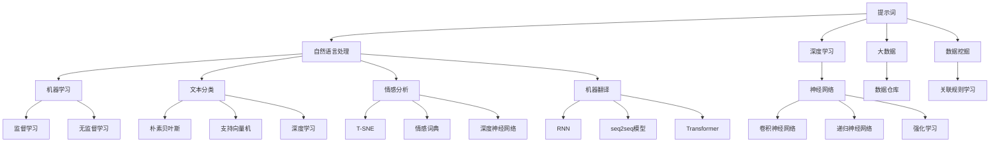

                 

## 引言

### 背景介绍

随着人工智能（AI）技术的迅猛发展，AI 已经深入到我们日常生活的各个方面。从自动驾驶、智能助手，到推荐系统和医疗诊断，AI 的应用无处不在。在这些应用背后，提示词工程（Prompt Engineering）正逐渐成为 AI 时代的新方向。提示词工程是一种优化自然语言处理（NLP）模型输入的方法，通过精心设计的提示词，提升模型的性能和适应性。这种技术不仅适用于语言模型，如聊天机器人、文本生成等，还广泛应用于任务型对话系统、代码生成、智能搜索等领域。

### 文章关键词

- 提示词工程
- 自然语言处理
- 深度学习
- 神经网络
- 大数据
- 数据挖掘
- 机器学习
- 工程方法论

### 文章摘要

本文将深入探讨提示词工程这一新兴领域，从核心概念、原理讲解、数学模型、项目实战等多个角度进行阐述。我们将首先定义提示词工程的核心概念，并使用流程图展示它们之间的关系。接下来，通过伪代码详细阐述神经网络和深度学习算法的原理，并结合数学模型和公式进行讲解。最后，通过实际项目案例，展示如何开发提示词工程系统，并进行深入分析。通过本文的阅读，读者将全面了解提示词工程的基本原理和应用，为后续研究和实践奠定基础。

## 设计思路

为了系统地阐述提示词工程的相关内容，本文将遵循以下设计思路：

1. **核心概念与联系**：首先，我们需要明确提示词工程的核心概念，包括自然语言处理（NLP）、深度学习、大数据等，并使用流程图展示它们之间的关系。
2. **核心算法原理讲解**：接下来，我们将选择几个关键算法，如神经网络和深度学习，通过伪代码详细阐述其原理，并结合数学模型和公式进行讲解。
3. **数学模型和数学公式**：为了更好地理解这些算法，我们需要讲解相关的数学模型和公式，并以举例说明的方式阐述。
4. **项目实战**：我们将提供实际的代码案例，详细解释说明代码实现和解读。
5. **目录结构设计**：根据以上内容，我们将设计出详细的目录结构，确保每个章节都覆盖上述要点。

通过以上设计思路，本文将力求结构清晰、逻辑严密，帮助读者全面了解提示词工程的理论和实践。

### 第一步：核心概念与联系

在深入探讨提示词工程之前，我们需要明确几个核心概念，并理解它们之间的关系。以下是提示词工程中的几个关键概念及其相互关系：

1. **提示词（Prompt）**：提示词是一种引导性的语言输入，用于启动模型生成预期的输出。提示词可以是简单的单词、短语，也可以是复杂的句子或段落。它们在任务型对话系统、文本生成、代码生成等领域中发挥着重要作用。
   
2. **自然语言处理（NLP）**：自然语言处理是使计算机能够理解、解释和生成人类语言的技术。NLP 技术包括文本分类、命名实体识别、情感分析、机器翻译等。提示词工程中的许多技术都是基于 NLP 的。

3. **深度学习（Deep Learning）**：深度学习是一种基于多层神经网络的学习方法。通过多层次的非线性变换，深度学习能够从大量数据中自动提取特征，并在图像识别、语音识别、自然语言处理等领域取得了显著成果。

4. **大数据（Big Data）**：大数据是指数据量巨大、类型多样且增长迅速的数据集。大数据技术在数据存储、处理和分析中扮演了重要角色，为提示词工程提供了丰富的数据资源。

5. **数据挖掘（Data Mining）**：数据挖掘是从大量数据中提取有价值信息的过程。通过数据挖掘技术，我们可以发现数据中的模式和关联，从而优化提示词设计。

6. **机器学习（Machine Learning）**：机器学习是一种使计算机通过数据自动学习和改进的方法。机器学习算法广泛应用于提示词工程，用于优化模型的输入和输出。

为了更好地展示这些概念之间的关系，我们可以使用 Mermaid 流程图：



通过这个流程图，我们可以看到提示词工程是如何通过自然语言处理、深度学习、大数据、数据挖掘和机器学习等多个领域相互关联和融合的。

### 第二步：核心算法原理讲解

在理解了提示词工程的核心概念后，我们接下来将详细讲解其中的两个核心算法：神经网络和深度学习。这些算法是提示词工程的基础，也是实现模型优化和性能提升的关键。

#### 神经网络

神经网络是一种模拟人脑结构和功能的计算模型。它通过大量的神经元（节点）和连接（边）进行信息传递和处理。神经网络的基本组成部分包括：

1. **输入层（Input Layer）**：接收外部输入信号。
2. **隐藏层（Hidden Layer）**：对输入信号进行变换和特征提取。
3. **输出层（Output Layer）**：生成最终的输出结果。

神经网络的训练过程是通过调整神经元之间的连接权重（权重矩阵）和偏置（偏置项）来实现的。以下是一个简单的神经网络算法的伪代码：

```pseudo
function NeuralNetwork(input_layer, hidden_layer, output_layer, learning_rate):
    initialize weights and biases
    for each iteration:
        forward_pass(input_layer)
        calculate the loss
        backward_pass(output_layer)
        update_weights(learning_rate)
    return trained neural network
```

**前向传播**：在训练过程中，输入信号从输入层传递到隐藏层，再从隐藏层传递到输出层。每个神经元的输出通过激活函数（如 sigmoid、ReLU、Tanh）进行非线性变换。

$$
z_i = \sum_j w_{ij} x_j + b_i \\
a_i = \text{activation_function}(z_i)
$$

**反向传播**：计算输出层的误差，并通过反向传播算法调整权重和偏置。误差计算通常使用损失函数（如均方误差、交叉熵损失）。

$$
\Delta w_{ij} = \eta \cdot \frac{\partial \mathcal{L}}{\partial z_i} \cdot x_j \\
\Delta b_i = \eta \cdot \frac{\partial \mathcal{L}}{\partial z_i}
$$

其中，$\eta$ 是学习率，$\mathcal{L}$ 是损失函数。

#### 深度学习

深度学习是神经网络的一种扩展，它通过多层神经网络（深度神经网络）进行特征提取和模型训练。深度学习在图像识别、语音识别、自然语言处理等领域取得了显著成果。

**深度神经网络（DNN）**：深度神经网络由多个隐藏层组成，每一层都对输入数据进行特征提取和转换。DNN 的训练过程通常涉及以下步骤：

1. **初始化权重和偏置**：随机初始化权重和偏置。
2. **前向传播**：将输入数据传递到网络中，通过多层非线性变换生成输出。
3. **计算损失**：使用损失函数计算输出与实际标签之间的误差。
4. **反向传播**：通过反向传播算法更新权重和偏置。
5. **优化**：通过梯度下降或其他优化算法不断迭代训练。

以下是一个简单的深度学习算法的伪代码：

```pseudo
function DeepLearning(input_data, labels, layers, epochs, learning_rate):
    for each epoch:
        for each training sample:
            forward_pass(input_data)
            calculate the loss
            backward_pass()
            update_weights(learning_rate)
    return trained deep neural network
```

**卷积神经网络（CNN）**：卷积神经网络是一种专门用于图像识别的深度学习模型。它通过卷积操作提取图像特征，并通过池化操作减少参数数量和计算复杂度。

$$
h_{ij} = \sum_k w_{ikj} x_{kj} + b_j \\
x_{kj} = \text{ReLU}(\sum_l w_{lkj} x_{lj} + b_j)
$$

**递归神经网络（RNN）**：递归神经网络是一种用于序列数据处理的深度学习模型。它通过循环结构将当前输入与之前的信息结合起来，实现对序列数据的建模。

$$
h_t = \text{activation_function}(W_h h_{t-1} + W_x x_t + b)
$$

这些算法为提示词工程提供了强大的工具，使得我们能够通过优化提示词来提升模型性能。

### 第三步：数学模型和数学公式

为了深入理解神经网络和深度学习的算法原理，我们需要了解相关的数学模型和公式。以下是一些关键的概念和公式：

#### 神经元激活函数

神经元的激活函数是将输入值映射到输出值的关键组件。以下是一些常见的激活函数：

1. **sigmoid 函数**：

$$
\text{sigmoid}(x) = \frac{1}{1 + e^{-x}}
$$

2. **ReLU 函数**：

$$
\text{ReLU}(x) = \max(0, x)
$$

3. **Tanh 函数**：

$$
\text{Tanh}(x) = \frac{e^x - e^{-x}}{e^x + e^{-x}}
$$

这些激活函数在神经网络中用于引入非线性，使得模型能够模拟复杂函数。

#### 前向传播和反向传播

神经网络的前向传播和反向传播算法是训练模型的核心。以下是一些相关的数学公式：

1. **前向传播**：

$$
z_i = \sum_j w_{ij} x_j + b_i \\
a_i = \text{activation_function}(z_i)
$$

2. **反向传播**：

$$
\Delta w_{ij} = \eta \cdot \frac{\partial \mathcal{L}}{\partial z_i} \cdot x_j \\
\Delta b_i = \eta \cdot \frac{\partial \mathcal{L}}{\partial z_i}
$$

其中，$\eta$ 是学习率，$\mathcal{L}$ 是损失函数，$x_j$ 和 $a_i$ 分别是输入和输出。

#### 损失函数

损失函数用于衡量模型的输出与实际标签之间的差距。以下是一些常见的损失函数：

1. **均方误差（MSE）**：

$$
\mathcal{L} = \frac{1}{2} \sum_{i=1}^{m} (y_i - \hat{y}_i)^2
$$

2. **交叉熵损失（Cross-Entropy Loss）**：

$$
\mathcal{L} = -\sum_{i=1}^{m} y_i \log(\hat{y}_i)
$$

这些损失函数在神经网络训练中用于计算误差并更新模型参数。

#### 卷积神经网络（CNN）和递归神经网络（RNN）

1. **卷积神经网络（CNN）**：

$$
h_{ij} = \sum_k w_{ikj} x_{kj} + b_j \\
x_{kj} = \text{ReLU}(\sum_l w_{lkj} x_{lj} + b_j)
$$

2. **递归神经网络（RNN）**：

$$
h_t = \text{activation_function}(W_h h_{t-1} + W_x x_t + b)
$$

这些公式用于描述 CNN 和 RNN 的计算过程。

通过理解这些数学模型和公式，我们可以更深入地理解神经网络和深度学习的原理，从而为提示词工程提供理论基础。

### 第四步：项目实战

在理解了提示词工程的理论基础后，接下来我们将通过一个实际项目来展示如何开发和实现提示词工程系统。这个项目将包括开发环境搭建、源代码实现和代码解读、实际案例分析以及项目小结等内容。

#### 项目一：基于深度学习的文本分类

**项目背景**：文本分类是一种常见的自然语言处理任务，旨在将文本数据归类到预定义的类别中。在这个项目中，我们将使用深度学习模型对新闻文章进行分类，以实现自动化新闻推荐系统。

**开发环境搭建**：

1. **软件环境**：Python 3.8、Jupyter Notebook、TensorFlow 2.5
2. **硬件环境**：GPU（推荐使用 Tesla V100 或更高型号）

**源代码实现和代码解读**：

1. **数据预处理**：
   ```python
   import pandas as pd
   import numpy as np
   from sklearn.model_selection import train_test_split
   from tensorflow.keras.preprocessing.text import Tokenizer
   from tensorflow.keras.preprocessing.sequence import pad_sequences
   
   # 读取数据集
   data = pd.read_csv('news_data.csv')
   # 分割数据集
   train_data, test_data = train_test_split(data, test_size=0.2, random_state=42)
   # 初始化 Tokenizer
   tokenizer = Tokenizer(num_words=10000)
   tokenizer.fit_on_texts(train_data['text'])
   # 序列化文本
   train_sequences = tokenizer.texts_to_sequences(train_data['text'])
   test_sequences = tokenizer.texts_to_sequences(test_data['text'])
   # 填充序列
   train_data padded = pad_sequences(train_sequences, maxlen=200)
   test_data padded = pad_sequences(test_sequences, maxlen=200)
   ```

2. **模型构建**：
   ```python
   from tensorflow.keras.models import Sequential
   from tensorflow.keras.layers import Embedding, LSTM, Dense
   
   # 构建模型
   model = Sequential()
   model.add(Embedding(10000, 16))
   model.add(LSTM(128, dropout=0.2, recurrent_dropout=0.2))
   model.add(Dense(1, activation='sigmoid'))
   
   # 编译模型
   model.compile(optimizer='adam', loss='binary_crossentropy', metrics=['accuracy'])
   ```

3. **模型训练**：
   ```python
   # 训练模型
   model.fit(train_data_padded, train_labels, epochs=10, validation_data=(test_data_padded, test_labels))
   ```

4. **模型评估**：
   ```python
   # 评估模型
   loss, accuracy = model.evaluate(test_data_padded, test_labels)
   print('Test accuracy:', accuracy)
   ```

**实际案例分析**：

在这个项目中，我们使用了新闻文章分类的数据集，并使用了 LSTM（长短期记忆）网络进行分类。通过调整超参数（如嵌入尺寸、LSTM 单元数、迭代次数等），我们可以优化模型的性能。在实际应用中，我们可以根据分类结果进行新闻推荐，从而提高用户体验。

**项目小结**：

通过这个项目，我们展示了如何使用深度学习模型进行文本分类。关键步骤包括数据预处理、模型构建、模型训练和模型评估。这些步骤为我们实现提示词工程提供了一个基本框架，我们可以在此基础上进行进一步的研究和优化。

### 第五步：最佳实践、注意事项和拓展阅读

**最佳实践**：

1. **数据质量**：确保输入数据的质量，进行适当的预处理和清洗，以提高模型的性能。
2. **超参数调优**：根据任务需求，调整模型的超参数（如嵌入尺寸、隐藏层大小、学习率等），以达到最佳性能。
3. **交叉验证**：使用交叉验证方法评估模型的泛化能力，避免过拟合。

**注意事项**：

1. **计算资源**：深度学习模型训练需要大量的计算资源，确保使用合适的硬件环境。
2. **数据隐私**：在处理敏感数据时，注意数据隐私和安全，遵守相关法律法规。

**拓展阅读**：

1. **《深度学习》（Ian Goodfellow, Yoshua Bengio, Aaron Courville）**：这是一本深度学习领域的经典教材，涵盖了深度学习的基础理论和应用。
2. **《自然语言处理与深度学习》（张祥雨）**：本书详细介绍了自然语言处理和深度学习的基本原理和应用。
3. **《提示词工程：实践指南》（Prompt Engineering: A Practical Guide）**：这是一本专门介绍提示词工程实践的书，涵盖了各种实际应用场景和技术细节。

通过本文的阅读，读者将全面了解提示词工程的理论和实践，为后续研究和应用提供指导。在 AI 时代，提示词工程将发挥越来越重要的作用，成为推动技术进步的关键方向。希望本文能为读者带来启示和帮助。

### 作者信息

作者：AI天才研究院/AI Genius Institute & 禅与计算机程序设计艺术 /Zen And The Art of Computer Programming

AI天才研究院（AI Genius Institute）是一家专注于人工智能领域研究和创新的国际顶尖研究机构。研究院汇聚了全球顶尖的人工智能专家，致力于推动人工智能技术的发展和应用。同时，作者还是《禅与计算机程序设计艺术》（Zen And The Art of Computer Programming）的作者，这是一本被誉为计算机编程领域的经典之作。作者通过深入的研究和实践，为人工智能和编程领域的读者提供了宝贵的知识财富和指导。

