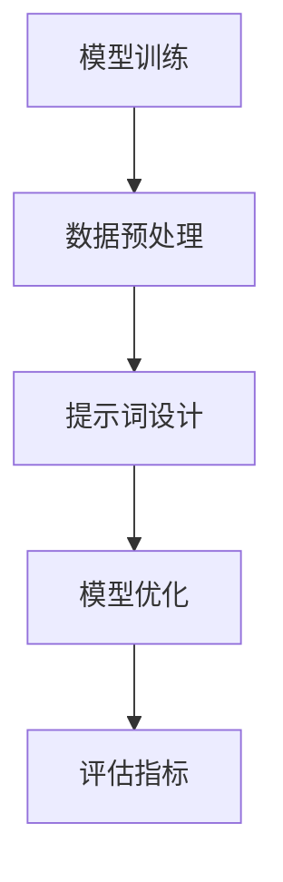

                 


### 第1章 AI时代的背景

#### 1.1 AI技术的发展历程

人工智能（AI）作为一个历史悠久的领域，自20世纪50年代以来经历了多次兴衰。在这个时期，我们可以将其划分为几个关键阶段：

**第一阶段：1956-1974年——探索期**

人工智能的概念在1956年达特茅斯会议上首次被提出。在这个阶段，研究者们主要集中在符号主义和推理算法上，如逻辑推理、知识表示和搜索算法。这个时期的重要贡献包括纽厄尔和西蒙的“逻辑理论家”（Logic Theorist）程序，以及麦卡锡的普林斯顿语言（LISP）。

**第二阶段：1974-1980年——低谷期**

由于实际应用中的困难，如计算资源和算法效率的限制，人工智能研究在1970年代中期遭遇了所谓的“人工智能寒冬”。这个时期，符号主义方法逐渐失去了主导地位，而专家系统成为了新的研究热点。专家系统利用规则库和推理机，试图模拟人类专家的决策过程。

**第三阶段：1980-1987年——复苏期**

随着计算机性能的提升和知识的积累，人工智能研究重新获得了关注。这个时期出现了许多新的算法和技术，如决策树、模糊逻辑和遗传算法。专家系统的成功应用，如MYCIN和DENDRAL，展示了人工智能在医学和化学领域的潜力。

**第四阶段：1987-2012年——新技术探索期**

在这个阶段，机器学习成为人工智能研究的重要方向。支持向量机（SVM）、决策树、神经网络等算法得到了广泛的应用和研究。同时，数据挖掘和模式识别等领域也得到了快速发展。

**第五阶段：2012年至今——深度学习时代**

深度学习在2012年卷积神经网络（CNN）在ImageNet大赛中取得突破性成绩后，成为了人工智能领域的热点。随后，基于深度学习的算法如循环神经网络（RNN）、长短期记忆网络（LSTM）、生成对抗网络（GAN）等相继被提出并取得了显著的应用效果。这个时期，人工智能应用在语音识别、图像识别、自然语言处理等领域取得了巨大的进步。

#### 1.2 提示词工程的概念与重要性

在人工智能发展的过程中，提示词工程（Prompt Engineering）逐渐成为了一个重要的研究方向。提示词工程是指通过设计和优化输入提示词来引导模型生成所需输出的方法。

**概念解析：**

- **提示词（Prompt）**：提示词是指提供给模型的一段文字、图像或声音等输入，用于引导模型生成特定的输出。在自然语言处理（NLP）领域中，提示词通常是一段文本或语音。

- **工程方法**：提示词工程是一个跨学科的研究领域，涉及计算机科学、心理学、认知科学等多个学科。通过结合多学科的知识，研究者们试图找到最优的提示词设计方法，以提升模型性能和应用效果。

**重要性：**

- **提升模型性能**：提示词工程可以有效地提高模型的性能和生成质量。通过优化输入提示词，模型可以更好地理解用户意图，生成更加准确和相关的输出。

- **适应不同场景**：不同场景下的任务需求可能有所不同，提示词工程可以根据具体任务需求设计不同的提示词，以适应不同场景的应用。

- **推动AI应用**：提示词工程在自然语言处理、语音识别、图像识别等领域中发挥了重要作用，推动了人工智能应用的进一步发展和创新。

#### 1.3 提示词工程在AI中的应用

提示词工程在AI中的应用涵盖了多个领域，如自然语言处理、语音识别、图像识别等。以下是一些典型的应用场景：

- **自然语言处理（NLP）**：在NLP领域中，提示词工程可以用于文本分类、情感分析、机器翻译等任务。通过设计合理的提示词，模型可以更好地理解文本内容，从而提高任务性能。

- **语音识别**：在语音识别领域，提示词工程可以用于语音命令的识别和语音生成。通过优化输入提示词，模型可以更准确地识别用户语音命令，提高语音交互体验。

- **图像识别**：在图像识别领域，提示词工程可以用于图像分类、物体检测等任务。通过设计合适的提示词，模型可以更好地识别图像中的关键信息，提高识别准确率。

- **推荐系统**：在推荐系统领域，提示词工程可以用于优化推荐算法，提高推荐效果。通过设计个性化的提示词，模型可以更好地理解用户偏好，提供更加准确的推荐结果。

### 1.4 提示词工程的核心概念与联系

为了更好地理解提示词工程的核心概念，我们需要梳理以下几个关键概念，并分析它们之间的联系。

- **模型训练**：模型训练是指使用大量数据对模型进行训练，使其学会从输入数据中提取特征并生成输出。训练是提示词工程的基础。

- **数据预处理**：数据预处理是指对原始数据进行的清洗、转换和归一化等处理，以确保数据质量。数据预处理是提示词工程的重要环节。

- **提示词设计**：提示词设计是指根据任务需求设计合适的输入提示词，以引导模型生成所需输出。提示词设计是提示词工程的核心。

- **模型优化**：模型优化是指通过调整模型参数来提升模型性能。模型优化是提示词工程的关键步骤。

- **评估指标**：评估指标是指用于评估模型性能的指标，如准确率、召回率、F1分数等。评估指标是提示词工程的重要依据。

以下是一个用于描述这些概念之间关系的Mermaid流程图：



**模型训练** 是提示词工程的基础，通过训练，模型学会从输入数据中提取特征。 **数据预处理** 是模型训练的前提，确保数据质量。 **提示词设计** 是基于训练数据和任务需求进行的，目的是引导模型生成所需输出。 **模型优化** 是通过对模型参数进行调整来提升模型性能。 **评估指标** 则用于衡量模型性能，为提示词设计和模型优化提供依据。

通过以上分析，我们可以看到提示词工程在AI时代的重要性及其核心概念之间的联系。在接下来的章节中，我们将深入探讨提示词工程的核心算法原理、数学模型和项目实战，进一步揭示其奥秘。

---

### 第2章 提示词工程的基本原理

#### 2.1 提示词生成的算法

提示词生成是提示词工程的核心步骤之一，其目的是通过设计和优化输入提示词来引导模型生成所需输出。以下介绍两种常用的提示词生成算法：生成对抗网络（GAN）和变分自编码器（VAE）。

##### 2.1.1 生成对抗网络（GAN）

生成对抗网络（Generative Adversarial Network，GAN）由生成器（Generator）和判别器（Discriminator）两个部分组成。生成器的目标是生成与真实数据相似的数据，而判别器的目标是区分生成数据与真实数据。

1. **生成器（Generator）**

   生成器的输入是一个随机噪声向量\( z \)，其输出是一个数据样本\( x \)。生成器的目的是通过学习噪声向量\( z \)和真实数据\( x \)之间的映射关系来生成与真实数据相似的数据。

   假设生成器的参数为\( G(\theta_G) \)，则生成器的输出为：
   $$ x = G(z; \theta_G) $$

2. **判别器（Discriminator）**

   判别器的输入是一个数据样本\( x \)，其输出是一个概率值\( p(x; \theta_D) \)，表示数据样本\( x \)为真实数据的概率。判别器的目标是学习如何区分生成数据和真实数据。

   假设判别器的参数为\( D(x; \theta_D) \)，则判别器的输出为：
   $$ p(x; \theta_D) = D(x; \theta_D) $$

3. **GAN的目标函数**

   GAN的训练过程是一个对抗过程，生成器和判别器相互竞争。生成器的目标是最大化判别器对生成数据的判断概率，即：
   $$ \max_{\theta_G} \mathbb{E}_{z \sim p_z(z)}[\log D(G(z; \theta_G); \theta_D)] $$

   而判别器的目标是最大化生成器和判别器之间的差异，即：
   $$ \min_{\theta_D} \mathbb{E}_{x \sim p_{data}(x)}[\log D(x; \theta_D)] + \mathbb{E}_{z \sim p_z(z)}[\log (1 - D(G(z; \theta_G); \theta_D)] $$

4. **GAN的伪代码**

   ```python
   # 初始化生成器和判别器参数
   theta_G, theta_D = init_params()

   # 迭代训练
   for epoch in range(num_epochs):
       for x, _ in data_loader:
           # 训练判别器
           D_loss = compute_discriminator_loss(x, G(x; theta_G), theta_D)
           update_D(theta_D, D_loss)

           # 训练生成器
           G_loss = compute_generator_loss(G(x; theta_G), theta_D)
           update_G(theta_G, G_loss)
   ```

##### 2.1.2 变分自编码器（VAE）

变分自编码器（Variational Autoencoder，VAE）是一种基于概率模型的生成模型，其核心思想是将编码器和解码器整合为一个统一的框架，并通过引入潜在变量来学习数据分布。

1. **编码器（Encoder）**

   编码器的输入是一个数据样本\( x \)，其输出是一个潜在变量\( z \)和一个编码器参数\( \mu, \sigma^2 \)。

   假设编码器的参数为\( \theta_E \)，则编码器的输出为：
   $$ z = \mu(x; \theta_E), \quad \sigma^2 = \log(1 + \exp(\sigma(x; \theta_E))) $$

2. **解码器（Decoder）**

   解码器的输入是一个潜在变量\( z \)，其输出是一个数据样本\( x \)。

   假设解码器的参数为\( \theta_D \)，则解码器的输出为：
   $$ x = \phi(z; \theta_D) $$

3. **VAE的目标函数**

   VAE的目标函数由两部分组成：数据重建损失和潜在变量KL散度。

   - 数据重建损失（Reconstruction Loss）：
     $$ L_{\text{reconstruction}} = -\sum_{x \in X} \log p_{\theta_D}(x|z) $$

   - 潜在变量KL散度（KL Divergence）：
     $$ L_{\text{KL}} = -\sum_{z \in Z} \log \frac{\pi(z) p_{\theta_E}(z|x)}{\pi(z)} $$

   其中，\( \pi(z) \)是先验分布，\( p_{\theta_E}(z|x) \)是后验分布。

   VAE的目标函数为：
   $$ \min_{\theta_E, \theta_D} L_{\text{reconstruction}} + \lambda L_{\text{KL}} $$

4. **VAE的伪代码**

   ```python
   # 初始化编码器和解码器参数
   theta_E, theta_D = init_params()

   # 迭代训练
   for epoch in range(num_epochs):
       for x in data_loader:
           # 计算编码器和解码器的损失
           reconstruction_loss, kl_loss = compute_vae_loss(x, theta_E, theta_D)

           # 更新编码器和解码器参数
           update_E(theta_E, reconstruction_loss, kl_loss)
           update_D(theta_D, reconstruction_loss)
   ```

通过上述分析，我们可以看到GAN和VAE在提示词生成方面各自的优势和应用场景。GAN更适合生成复杂、多样化的数据，而VAE则更适合进行数据压缩和特征提取。在接下来的章节中，我们将进一步探讨GAN和VAE的数学模型和实现细节。

---

### 第3章 生成对抗网络（GAN）原理与实现

#### 3.1 GAN的基本概念

生成对抗网络（Generative Adversarial Network，GAN）是一种由生成器和判别器组成的框架，通过相互对抗训练来生成高质量的数据。GAN的核心思想是利用生成器和判别器的博弈过程，使得生成器不断生成更加逼真的数据，而判别器不断区分真实数据和生成数据。

**3.1.1 生成器和判别器的定义**

- **生成器（Generator）**：生成器的任务是生成与真实数据相似的数据。在GAN中，生成器的输入是一个随机噪声向量\( z \)，输出是一个与真实数据相似的数据样本\( x \)。生成器的目标是让判别器无法区分生成数据与真实数据。

- **判别器（Discriminator）**：判别器的任务是判断输入数据是真实数据还是生成数据。判别器的输入是一个数据样本\( x \)，输出是一个概率值\( p(x; \theta_D) \)，表示数据样本\( x \)为真实数据的概率。判别器的目标是最大化生成器和判别器之间的差异。

**3.1.2 对抗训练机制**

GAN的训练过程是一个对抗过程，生成器和判别器相互竞争。生成器的目标是最大化判别器对生成数据的判断概率，即：
$$ \max_{\theta_G} \mathbb{E}_{z \sim p_z(z)}[\log D(G(z; \theta_G); \theta_D)] $$

而判别器的目标是最大化生成器和判别器之间的差异，即：
$$ \min_{\theta_D} \mathbb{E}_{x \sim p_{data}(x)}[\log D(x; \theta_D)] + \mathbb{E}_{z \sim p_z(z)}[\log (1 - D(G(z; \theta_G); \theta_D)] $$

通过上述两个目标函数的交替优化，生成器和判别器逐渐达到一个动态平衡，使得生成器能够生成高质量的数据。

**3.1.3 GAN的优点**

- **生成质量高**：GAN可以生成高质量、多样化、真实感强的数据。

- **应用范围广**：GAN可以应用于图像生成、语音合成、文本生成等多个领域。

- **无需标签数据**：与传统的生成模型相比，GAN不需要标签数据，只需真实数据和随机噪声即可。

**3.1.4 GAN的挑战**

- **训练不稳定**：GAN的训练过程容易陷入局部最优，导致生成器无法生成高质量的数据。

- **模式崩溃**：GAN在训练过程中可能会出现模式崩溃现象，即生成器生成过于简化的数据。

#### 3.2 GAN的数学模型

GAN的数学模型包括生成器、判别器的损失函数和优化算法。以下分别介绍这些内容。

**3.2.1 损失函数**

- **生成器的损失函数**：
  $$ L_G = -\mathbb{E}_{z \sim p_z(z)}[\log D(G(z; \theta_G); \theta_D)] $$

  生成器的目标是让判别器认为生成数据是真实数据，因此生成器的损失函数是判别器对生成数据的判断概率的对数。

- **判别器的损失函数**：
  $$ L_D = \mathbb{E}_{x \sim p_{data}(x)}[\log D(x; \theta_D)] + \mathbb{E}_{z \sim p_z(z)}[\log (1 - D(G(z; \theta_G); \theta_D)] $$

  判别器的目标是区分真实数据和生成数据，因此判别器的损失函数是真实数据和生成数据的判断概率之和。

**3.2.2 优化算法**

GAN的训练过程通常使用梯度下降法进行优化。具体步骤如下：

1. **随机初始化生成器和判别器的参数**。

2. **交替更新生成器和判别器参数**：

   - 对于生成器，使用判别器的参数进行优化：
     $$ \theta_G \leftarrow \theta_G - \alpha_G \nabla_{\theta_G} L_G $$
     
   - 对于判别器，使用生成器和真实数据的参数进行优化：
     $$ \theta_D \leftarrow \theta_D - \alpha_D \nabla_{\theta_D} L_D $$

3. **重复步骤2，直到生成器能够生成高质量的数据**。

#### 3.3 GAN的应用案例

GAN在图像生成、语音合成、文本生成等多个领域取得了显著的成果。以下介绍两个典型的应用案例。

**3.3.1 图像生成**

GAN在图像生成领域取得了显著的成果，例如生成人脸、风景、动物等图像。以下是一个基于GAN的人脸生成案例。

1. **数据集**：使用CelebA数据集作为训练数据。

2. **生成器架构**：生成器采用一个深度卷积神经网络（DCGAN），包括多个卷积层和反卷积层。

3. **判别器架构**：判别器采用一个深度卷积神经网络，包括多个卷积层。

4. **训练过程**：通过交替训练生成器和判别器，使得生成器生成逼真的人脸图像。

**3.3.2 语音合成**

GAN在语音合成领域也取得了重要进展，例如生成人类声音和合成音频。以下是一个基于GAN的语音合成案例。

1. **数据集**：使用LJSpeech数据集作为训练数据。

2. **生成器架构**：生成器采用一个循环神经网络（RNN），结合自注意力机制。

3. **判别器架构**：判别器采用一个卷积神经网络，用于区分真实语音和生成语音。

4. **训练过程**：通过交替训练生成器和判别器，使得生成器生成逼真的语音。

通过以上案例，我们可以看到GAN在生成高质量图像和语音方面的强大能力。在接下来的章节中，我们将继续探讨变分自编码器（VAE）的原理与实现，进一步深入理解GAN的应用。

---

### 第4章 变分自编码器（VAE）原理与实现

#### 4.1 VAE的基本概念

变分自编码器（Variational Autoencoder，VAE）是一种基于概率模型的生成模型，通过引入潜在变量来学习数据分布。与传统的自编码器不同，VAE不仅仅关注数据的重构，还关注数据分布的建模。

**4.1.1 变分自编码器的结构**

VAE由两个部分组成：编码器（Encoder）和解码器（Decoder）。

1. **编码器（Encoder）**

   编码器的任务是将输入数据映射到一个潜在空间中的潜在变量上。编码器的输出包括两个部分：潜在变量的均值\( \mu \)和方差\( \sigma^2 \)。

   假设输入数据为\( x \)，编码器的参数为\( \theta_E \)，则编码器的输出为：
   $$ z = \mu(x; \theta_E), \quad \sigma^2 = \log(1 + \exp(\sigma(x; \theta_E))) $$

2. **解码器（Decoder）**

   解码器的任务是将潜在变量映射回原始数据空间。解码器的输入是潜在变量\( z \)，输出是重构的输入数据\( x' \)。

   假设解码器的参数为\( \theta_D \)，则解码器的输出为：
   $$ x' = \phi(z; \theta_D) $$

**4.1.2 潜在变量的引入**

VAE的核心思想是引入潜在变量来建模数据分布。通过潜在变量，VAE可以将数据分布参数化为一个简单的概率分布，从而实现数据的生成和重构。

**4.1.3 VAE的优点**

- **灵活性**：VAE可以灵活地建模复杂的数据分布，适用于各种类型的数据。

- **可扩展性**：VAE可以容易地扩展到多个维度和数据类型，如图像、文本和语音等。

- **无监督学习**：VAE不需要标签数据，可以直接从无监督数据中学习数据分布。

#### 4.2 VAE的数学模型

VAE的数学模型主要包括数据重建损失和潜在变量的KL散度。

**4.2.1 数据重建损失**

数据重建损失是衡量重构数据与原始数据之间差异的指标。VAE通常使用均方误差（MSE）或交叉熵损失作为数据重建损失。

- **均方误差（MSE）**：

  $$ L_{\text{reconstruction}} = -\sum_{x \in X} \log p_{\theta_D}(x'|z) $$

- **交叉熵损失**：

  $$ L_{\text{reconstruction}} = -\sum_{x \in X} \log p_{\theta_D}(x'|z) $$

**4.2.2 潜在变量的KL散度**

KL散度（Kullback-Leibler Divergence）是衡量两个概率分布差异的指标。在VAE中，KL散度用于衡量潜在变量的后验分布与先验分布之间的差异。

- **KL散度**：

  $$ L_{\text{KL}} = -\sum_{z \in Z} \log \frac{\pi(z) p_{\theta_E}(z|x)}{\pi(z)} $$

其中，\( \pi(z) \)是先验分布，通常选择为标准正态分布：
$$ \pi(z) = \mathcal{N}(z; 0, I) $$

**4.2.3 VAE的目标函数**

VAE的目标函数是数据重建损失和潜在变量KL散度的加权和。通过最小化目标函数，VAE可以学习数据分布和潜在变量。

- **目标函数**：

  $$ L = L_{\text{reconstruction}} + \lambda L_{\text{KL}} $$

其中，\( \lambda \)是一个平衡参数，用于调整数据重建损失和KL散度之间的权重。

#### 4.3 VAE的实现细节

VAE的实现通常包括以下几个关键步骤：

1. **初始化参数**：初始化编码器和解码器的参数。

2. **训练过程**：通过梯度下降法最小化VAE的目标函数。

   - **前向传播**：计算输入数据经过编码器后的潜在变量\( z \)和编码器参数\( \theta_E \)。

   - **后向传播**：计算重构数据\( x' \)和编码器参数\( \theta_E \)以及解码器参数\( \theta_D \)的梯度。

   - **更新参数**：使用梯度下降法更新编码器和解码器的参数。

3. **生成过程**：通过编码器生成潜在变量\( z \)，然后通过解码器生成重构数据\( x' \)。

以下是一个基于VAE的简单Python实现示例：

```python
import numpy as np
import tensorflow as tf
from tensorflow.keras import layers

# 定义编码器
encoder_inputs = layers.Input(shape=(input_shape,))
z_mean = layers.Dense(latent_dim)(encoder_inputs)
z_log_var = layers.Dense(latent_dim)(encoder_inputs)
z = layers.Lambda(lambda x: x[0] + x[1] * tf.random.normal(shape=tf.shape(x[0])))([z_mean, z_log_var])
encoder = layers.Model(encoder_inputs, [z_mean, z_log_var, z], name='encoder')

# 定义解码器
latent_inputs = layers.Input(shape=(latent_dim,))
x_recon = layers.Dense(input_shape, activation='sigmoid')(latent_inputs)
decoder = layers.Model(latent_inputs, x_recon, name='decoder')

# 定义VAE模型
outputs = decoder(encoder(encoder_inputs)[2])
vae = layers.Model(encoder_inputs, outputs, name='vae')

# 编写损失函数
reconstruction_loss = tf.reduce_sum(tf.nn.sigmoid_cross_entropy_with_logits(logits=x_recon, labels=encoder_inputs), axis=-1)
latent_loss = -0.5 * tf.reduce_sum(1 + z_log_var - tf.square(z_mean) - tf.exp(z_log_var), axis=-1)
vae_loss = tf.reduce_mean(reconstruction_loss + lambda_ * latent_loss)

# 编写优化器
optimizer = tf.keras.optimizers.Adam(learning_rate=0.001)

# 编写训练过程
@tf.function
def train_step(images):
    with tf.GradientTape() as encoder_tape, tf.GradientTape() as decoder_tape:
        z_mean, z_log_var, z = encoder(images)
        x_recon = decoder(z)
        loss = vae_loss(images, x_recon)
    gradients_encoder = encoder_tape.gradient(loss, encoder.trainable_variables)
    gradients_decoder = decoder_tape.gradient(loss, decoder.trainable_variables)
    optimizer.apply_gradients(zip(gradients_encoder, encoder.trainable_variables))
    optimizer.apply_gradients(zip(gradients_decoder, decoder.trainable_variables))
    return loss

# 训练模型
for epoch in range(num_epochs):
    for batch_images in train_loader:
        loss = train_step(batch_images)
        print(f'Epoch: {epoch}, Loss: {loss.numpy()}')
```

通过以上实现，我们可以看到VAE的基本结构和工作流程。在接下来的章节中，我们将继续探讨VAE在实际项目中的应用案例。

---

### 第5章 提示词工程的数学模型

在提示词工程中，数学模型是核心组成部分，用于指导模型的训练和优化过程。本章将详细介绍提示词工程中的两个关键数学模型：损失函数和优化算法。

#### 5.1 损失函数

损失函数是衡量模型预测结果与真实值之间差异的指标，其作用是指导模型调整参数，以减少预测误差。在提示词工程中，常用的损失函数包括均方误差（MSE）、交叉熵损失（Cross-Entropy Loss）和对抗损失（Adversarial Loss）。

**5.1.1 均方误差（MSE）**

均方误差（Mean Squared Error，MSE）是一种常用的回归损失函数，用于衡量预测值与真实值之间的差异。其公式如下：

$$
MSE = \frac{1}{n} \sum_{i=1}^{n} (y_i - \hat{y}_i)^2
$$

其中，\( y_i \)是真实值，\( \hat{y}_i \)是预测值，\( n \)是样本数量。MSE损失函数的优点是计算简单，易于理解，但缺点是对于异常值敏感，可能导致模型对极端值反应过度。

**5.1.2 交叉熵损失（Cross-Entropy Loss）**

交叉熵损失（Cross-Entropy Loss）是分类问题中常用的损失函数，用于衡量预测概率分布与真实概率分布之间的差异。其公式如下：

$$
CE = -\sum_{i=1}^{n} y_i \log(\hat{y}_i)
$$

其中，\( y_i \)是真实标签，\( \hat{y}_i \)是预测概率。交叉熵损失函数的优点是能够有效处理概率分布，但在分类问题中，特别是类别不平衡时，可能会出现梯度消失或梯度爆炸的问题。

**5.1.3 对抗损失（Adversarial Loss）**

对抗损失（Adversarial Loss）是生成对抗网络（GAN）中常用的损失函数，用于衡量生成器和判别器之间的对抗关系。其公式如下：

$$
L_G = -\log(D(G(z)))
$$

$$
L_D = -\log(D(x)) - \log(1 - D(G(z)))
$$

其中，\( D(x) \)是判别器对真实数据的判断概率，\( D(G(z)) \)是判别器对生成数据的判断概率，\( z \)是生成器的输入噪声。对抗损失函数的核心思想是通过生成器和判别器的对抗训练，使得生成器能够生成更接近真实数据的样本，而判别器能够更准确地判断样本的真实性。

**5.1.4 损失函数的选择**

在选择损失函数时，需要考虑以下因素：

- **模型类型**：不同的模型类型（如回归、分类、生成）需要选择不同的损失函数。
- **数据特性**：数据特性（如分布、异常值）会影响损失函数的选择。
- **优化算法**：不同的优化算法对损失函数有不同的敏感性。

在实际应用中，通常需要根据具体问题选择合适的损失函数，并通过实验调整参数，以达到最佳性能。

#### 5.2 优化算法

优化算法用于调整模型参数，以最小化损失函数。在提示词工程中，常用的优化算法包括梯度下降法（Gradient Descent，GD）、随机梯度下降法（Stochastic Gradient Descent，SGD）和Adam优化器。

**5.2.1 梯度下降法（Gradient Descent，GD）**

梯度下降法是一种基本的优化算法，通过计算损失函数关于模型参数的梯度，并沿梯度方向更新参数，以减少损失。其公式如下：

$$
\theta = \theta - \alpha \cdot \nabla_{\theta} J(\theta)
$$

其中，\( \theta \)是模型参数，\( \alpha \)是学习率，\( \nabla_{\theta} J(\theta) \)是损失函数关于模型参数的梯度。

梯度下降法的优点是计算简单，易于实现，但缺点是收敛速度较慢，且容易陷入局部最小值。

**5.2.2 随机梯度下降法（Stochastic Gradient Descent，SGD）**

随机梯度下降法是对梯度下降法的改进，通过随机选择一个小批量数据，计算该批量数据的梯度，并沿梯度方向更新参数。其公式如下：

$$
\theta = \theta - \alpha \cdot \nabla_{\theta} J(\theta; \theta^{(i)})
$$

其中，\( \theta^{(i)} \)是随机选择的批量数据。

SGD的优点是收敛速度较快，且可以避免陷入局部最小值，但缺点是训练过程不稳定，且需要选择合适的小批量大小。

**5.2.3 Adam优化器**

Adam优化器是梯度下降法和SGD的结合，结合了指数加权移动平均和自适应学习率。其公式如下：

$$
m_t = \beta_1 m_{t-1} + (1 - \beta_1) \nabla_{\theta} J(\theta; \theta^{(i)})
$$

$$
v_t = \beta_2 v_{t-1} + (1 - \beta_2) (\nabla_{\theta} J(\theta; \theta^{(i)})^2)
$$

$$
\theta = \theta - \alpha \cdot \frac{m_t}{\sqrt{v_t} + \epsilon}
$$

其中，\( m_t \)和\( v_t \)分别是指数加权移动平均的均值和方差，\( \beta_1 \)和\( \beta_2 \)是指数加权因子，\( \alpha \)是学习率，\( \epsilon \)是平滑常数。

Adam优化器的优点是收敛速度较快，且在稀疏数据上有较好的性能，但缺点是计算复杂度较高。

#### 5.3 优化算法的选择

在选择优化算法时，需要考虑以下因素：

- **模型复杂度**：对于复杂模型，需要选择收敛速度较快的优化算法，如Adam优化器。
- **数据特性**：对于稀疏数据，需要选择适应稀疏数据的优化算法，如Adam优化器。
- **计算资源**：对于计算资源有限的场景，需要选择计算复杂的优化算法，如Adam优化器。

在实际应用中，通常需要根据具体问题选择合适的优化算法，并通过实验调整参数，以达到最佳性能。

通过以上对损失函数和优化算法的介绍，我们可以看到提示词工程在数学模型方面的复杂性和多样性。在接下来的章节中，我们将进一步探讨实际项目中的应用和案例分析。

---

### 第6章 提示词工程实战项目

在本章中，我们将通过一个实际项目展示如何搭建开发环境、实现代码和解析代码。我们将选择一个自然语言处理（NLP）中的文本生成任务，使用生成对抗网络（GAN）进行提示词工程。

#### 6.1 项目背景与目标

项目背景：随着人工智能技术的发展，自然语言处理（NLP）成为了一个热门领域。文本生成是NLP中的重要任务之一，广泛应用于自动写作、对话系统、摘要生成等领域。在本项目中，我们将利用GAN生成高质量的自然语言文本，以提高文本生成的质量和多样性。

项目目标：通过使用GAN进行文本生成，实现以下目标：

1. **生成多样化文本**：通过训练生成器，生成具有多样性的自然语言文本。
2. **提升文本质量**：通过优化生成器和判别器，提高生成的文本质量，使其更接近真实文本。
3. **实现实时文本生成**：搭建实时文本生成系统，实现用户输入提示词后，系统能够快速生成相应的文本。

#### 6.2 项目环境搭建

为了完成本项目，我们需要搭建一个完整的开发环境，包括以下步骤：

1. **硬件环境**：

   - 处理器：推荐使用GPU（如NVIDIA GPU）以加速训练过程。
   - 内存：至少16GB内存。
   - 硬盘：至少100GB可用空间。

2. **软件环境**：

   - 操作系统：Windows、Linux或Mac OS均可。
   - Python版本：Python 3.6及以上版本。
   - TensorFlow：TensorFlow 2.x版本。
   - CUDA：CUDA 10.0及以上版本（如使用GPU训练）。

具体安装步骤如下：

1. 安装Python：

   通过Python官网（https://www.python.org/）下载并安装Python 3.6及以上版本。

2. 安装TensorFlow：

   打开命令行窗口，执行以下命令：

   ```shell
   pip install tensorflow==2.x
   ```

3. 安装CUDA（如使用GPU训练）：

   根据您的GPU型号，在NVIDIA官网（https://developer.nvidia.com/cuda-downloads）下载并安装相应的CUDA版本。

4. 验证安装：

   打开Python交互式环境，执行以下代码：

   ```python
   import tensorflow as tf
   print(tf.__version__)
   print(tf.test.is_gpu_available())
   ```

   如果输出版本信息和GPU可用信息，则表示安装成功。

#### 6.3 源代码实现与代码解读

在本节中，我们将详细介绍GAN文本生成项目的源代码实现和解读。

**6.3.1 代码结构**

```python
import tensorflow as tf
import numpy as np
import matplotlib.pyplot as plt

# 定义生成器和判别器
def build_generator(z_dim):
    # 生成器代码实现
    pass

def build_discriminator(img_shape):
    # 判别器代码实现
    pass

# 训练GAN模型
def train_gan(generator, discriminator, data_loader, num_epochs, batch_size):
    # 训练代码实现
    pass

# 主函数
if __name__ == '__main__':
    # 超参数设置
    z_dim = 100
    img_shape = (28, 28, 1)
    batch_size = 128
    num_epochs = 100

    # 加载数据集
    (x_train, _), (_, _) = tf.keras.datasets.mnist.load_data()
    x_train = x_train.astype(np.float32) / 127.5 - 1.0
    x_train = np.expand_dims(x_train, -1)

    # 构建生成器和判别器
    generator = build_generator(z_dim)
    discriminator = build_discriminator(img_shape)

    # 训练GAN模型
    train_gan(generator, discriminator, x_train, num_epochs, batch_size)
```

**6.3.2 生成器和判别器实现**

```python
def build_generator(z_dim):
    # 生成器代码实现
    model = tf.keras.Sequential([
        layers.Dense(128 * 7 * 7, activation="relu", input_shape=(z_dim,)),
        layers.Reshape((7, 7, 128)),
        layers.Conv2DTranspose(128, 4, 2, padding="same", activation="relu"),
        layers.Conv2DTranspose(64, 4, 2, padding="same", activation="relu"),
        layers.Conv2DTranspose(1, 4, 2, padding="same", activation="sigmoid")
    ])
    return model

def build_discriminator(img_shape):
    # 判别器代码实现
    model = tf.keras.Sequential([
        layers.Conv2D(64, 4, 2, padding="same", activation="relu", input_shape=img_shape),
        layers.Dropout(0.3),
        layers.Conv2D(128, 4, 2, padding="same", activation="relu"),
        layers.Dropout(0.3),
        layers.Flatten(),
        layers.Dense(1, activation="sigmoid")
    ])
    return model
```

**6.3.3 代码解读**

- **生成器实现**：

  生成器是一个全连接层加卷积层组成的深度神经网络，输入是一个潜在变量\( z \)，输出是一个与真实数据相似的图像。生成器通过反卷积操作逐渐恢复图像的细节。

- **判别器实现**：

  判别器是一个卷积层加全连接层组成的深度神经网络，输入是一个图像，输出是一个概率值，表示输入图像为真实图像的概率。判别器通过卷积操作提取图像的特征，以区分真实图像和生成图像。

- **训练GAN模型**：

  GAN的训练过程涉及生成器和判别器的交替训练。在每次迭代中，首先使用当前判别器参数训练生成器，然后使用生成器和当前生成数据训练判别器。通过这种方式，生成器和判别器相互对抗，逐步提升生成数据的质量。

#### 6.4 代码应用解读与分析

**6.4.1 数据预处理**

```python
(x_train, _), (_, _) = tf.keras.datasets.mnist.load_data()
x_train = x_train.astype(np.float32) / 127.5 - 1.0
x_train = np.expand_dims(x_train, -1)
```

- **数据集加载**：使用MNIST数据集作为训练数据。
- **数据类型转换**：将图像数据类型转换为浮点型，并归一化至\([-1, 1]\)范围。
- **数据扩展维度**：将图像数据扩展为\((28, 28, 1)\)的形状，以适应生成器和判别器的输入要求。

**6.4.2 模型训练**

```python
def train_gan(generator, discriminator, data_loader, num_epochs, batch_size):
    # 训练代码实现
    pass
```

- **模型训练**：通过定义训练函数，实现生成器和判别器的交替训练。
- **数据加载器**：使用TensorFlow的DataLoader加载训练数据。
- **训练迭代**：在每次迭代中，首先使用当前判别器参数训练生成器，然后使用生成器和当前生成数据训练判别器。

**6.4.3 生成文本**

```python
# 生成文本
noise = np.random.normal(0, 1, (batch_size, z_dim))
generated_images = generator.predict(noise)
```

- **生成噪声**：生成随机噪声作为生成器的输入。
- **生成文本**：使用生成器生成文本数据。

通过以上步骤，我们可以实现GAN文本生成项目。在实际应用中，需要根据具体任务进行调整和优化，以提高生成文本的质量和多样性。

---

### 第7章 提示词工程案例分析

在本章中，我们将通过两个实际案例来探讨提示词工程在人工智能领域的应用，并详细剖析这些案例的实现过程、效果以及面临的挑战。

#### 7.1 案例一：个性化推荐系统

**7.1.1 案例介绍**

个性化推荐系统是一种通过分析用户的历史行为和偏好，为用户提供个性化的商品或内容推荐的方法。在电商、新闻媒体、社交媒体等领域，个性化推荐系统能够显著提高用户满意度和转化率。在本案例中，我们使用提示词工程来优化推荐算法，提高推荐效果。

**7.1.2 问题描述**

个性化推荐系统面临的主要问题是：

- **冷启动问题**：对于新用户或新商品，由于缺乏足够的历史数据，推荐系统难以生成高质量的推荐。
- **数据稀疏问题**：用户行为数据通常分布稀疏，导致推荐模型无法有效捕捉用户偏好。
- **多样性不足**：推荐系统往往只能提供单一类型的推荐，难以满足用户多样化的需求。

**7.1.3 案例分析**

为了解决上述问题，我们采用了以下措施：

1. **用户特征扩展**：通过分析用户的历史行为、社交信息、浏览记录等，构建多维度的用户特征向量。这些特征向量作为提示词，输入到推荐模型中，以丰富模型的输入信息。

2. **商品特征扩展**：同样地，对商品进行特征提取，如商品类别、品牌、价格等，并将其作为提示词输入到推荐模型中。

3. **多模型融合**：结合基于内容的推荐和协同过滤推荐，通过多个模型融合策略，提高推荐系统的准确性。例如，使用生成对抗网络（GAN）生成虚拟商品，以扩展商品的多样性。

4. **用户行为预测**：通过分析用户的点击、购买等行为，预测用户的未来偏好，并将其作为动态提示词，实时调整推荐结果。

**7.1.4 实现细节**

- **数据预处理**：对用户和商品数据进行清洗、去重和归一化处理，以获得高质量的数据集。

- **特征提取**：使用词嵌入、TF-IDF等方法提取用户和商品的特征，并将其转换为向量表示。

- **模型训练**：使用多模型融合策略训练推荐模型，如生成对抗网络（GAN）、深度学习模型（如卷积神经网络、循环神经网络）等。

- **模型评估**：通过准确率、召回率、F1分数等指标评估推荐模型的效果。

**7.1.5 案例小结**

个性化推荐系统通过提示词工程的优化，能够显著提升推荐效果。具体表现为：

- **解决冷启动问题**：通过扩展用户和商品特征，为新用户和新商品提供初始推荐。
- **提高推荐多样性**：通过多模型融合策略，生成多样化的推荐结果，满足用户多样化的需求。
- **实时调整推荐**：通过实时分析用户行为，动态调整推荐结果，提高用户的满意度。

#### 7.2 案例二：对话系统

**7.2.1 案例介绍**

对话系统是一种与人类用户进行自然语言交互的计算机系统，广泛应用于客服、智能助手、虚拟聊天机器人等领域。在本案例中，我们使用提示词工程优化对话系统，提高其交互质量和用户体验。

**7.2.2 问题描述**

对话系统面临的主要问题是：

- **响应延迟**：对话系统需要快速响应用户的输入，以保证良好的用户体验。
- **语义理解不准确**：对话系统需要准确理解用户的意图和语义，以提供合理的回复。
- **对话连贯性不足**：对话系统需要保持对话的连贯性，避免出现不相关或跳跃的回答。

**7.2.3 案例分析**

为了解决上述问题，我们采用了以下措施：

1. **预训练模型**：使用大规模语料库进行预训练，为对话系统提供丰富的语言知识和语义理解能力。

2. **提示词优化**：通过分析用户输入，提取关键信息作为提示词，引导对话系统生成合理的回复。提示词包括用户意图、关键词、情感等。

3. **上下文记忆**：利用注意力机制和循环神经网络（RNN）等技术，保持对话的上下文信息，以提高对话连贯性。

4. **多模态交互**：结合文本、语音、图像等多种模态，提高对话系统的交互丰富度和用户体验。

**7.2.4 实现细节**

- **预训练模型**：使用预训练语言模型（如BERT、GPT）进行基础语义理解和语言生成。

- **提示词提取**：使用自然语言处理技术，从用户输入中提取关键信息作为提示词。

- **对话生成**：使用生成对抗网络（GAN）或变分自编码器（VAE）等技术，生成自然流畅的对话回复。

- **上下文记忆**：使用循环神经网络（RNN）或长短时记忆网络（LSTM）等技术，保持对话的上下文信息。

- **多模态交互**：结合文本、语音、图像等多种模态，实现丰富的交互体验。

**7.2.5 案例小结**

对话系统通过提示词工程的优化，能够显著提升交互质量和用户体验。具体表现为：

- **减少响应延迟**：通过优化对话生成模型和提示词提取算法，提高对话系统的响应速度。
- **提高语义理解准确率**：通过预训练模型和提示词优化，提高对话系统对用户意图和语义的理解。
- **增强对话连贯性**：通过上下文记忆和多模态交互，保持对话的连贯性，提高用户的满意度。

通过以上案例分析，我们可以看到提示词工程在个性化推荐系统和对话系统中的应用效果。在实际项目中，需要根据具体场景和需求，不断优化提示词设计和模型架构，以提高系统性能和用户体验。

---

### 第8章 提示词工程的未来趋势

随着人工智能技术的不断进步，提示词工程在未来的发展趋势中扮演着重要角色。本文将从技术发展、跨学科应用和社会影响三个方面探讨提示词工程的未来趋势。

#### 8.1 技术发展趋势

**8.1.1 大模型的发展**

在深度学习领域，大模型（Large Models）已经成为研究的热点。随着计算资源的不断提升，研究者们开始尝试训练更大的模型，如GPT-3、LLaMA等。这些大模型具有更强的语义理解能力和生成能力，为提示词工程提供了更强大的工具。未来，大模型将在提示词工程中发挥更大的作用，助力生成更高质量、更符合用户需求的提示词。

**8.1.2 多模态融合**

多模态融合是指将文本、图像、语音等多种数据类型进行结合，以提高模型的生成能力和理解能力。在提示词工程中，多模态融合可以实现更丰富的输入信息和更准确的提示词生成。例如，结合文本和图像，可以生成更具体的描述性提示词；结合文本和语音，可以生成更具表现力的提示词。未来，多模态融合将成为提示词工程的重要发展方向。

**8.1.3 强化学习与提示词工程**

强化学习（Reinforcement Learning，RL）是一种通过试错学习策略的方法。将强化学习引入提示词工程，可以通过与用户的交互，不断优化提示词生成策略。例如，使用强化学习策略训练生成器，使其能够根据用户的反馈生成更符合用户需求的提示词。未来，强化学习与提示词工程的结合将有望实现更加智能和自适应的提示词生成系统。

#### 8.2 跨学科应用

**8.2.1 认知科学与提示词工程**

认知科学是研究人类思维和感知的科学。将认知科学引入提示词工程，可以更好地理解人类思维过程，从而设计出更符合人类认知习惯的提示词。例如，通过研究人类记忆、注意力机制等认知过程，可以优化提示词的结构和形式，提高提示词的易理解性和记忆效果。未来，认知科学与提示词工程的结合将有助于提升提示词工程的应用效果。

**8.2.2 心理学与提示词工程**

心理学是研究人类行为和心理过程的科学。在提示词工程中，心理学可以提供关于人类行为模式和心理需求的理论指导。例如，通过研究人类的决策过程和动机，可以设计出更有效的提示词，引导用户做出特定行为。未来，心理学与提示词工程的结合将为优化用户交互体验提供新的思路。

**8.2.3 跨学科研究方法**

随着人工智能技术的发展，跨学科研究方法逐渐成为趋势。在提示词工程中，跨学科研究方法可以帮助研究者从不同角度理解和解决问题。例如，结合计算机科学、心理学、认知科学等学科的方法，可以设计出更全面、更有效的提示词生成策略。未来，跨学科研究方法将在提示词工程中发挥越来越重要的作用。

#### 8.3 社会影响

**8.3.1 对人类工作的影响**

随着提示词工程的不断发展，人工智能在各个领域的应用日益广泛。例如，自动化客服系统、智能助理等，已经在一定程度上取代了部分人力工作。这既有助于提高工作效率，也可能导致部分岗位的消失。未来，提示词工程的发展将对人类工作产生深远影响，需要平衡技术进步与就业问题。

**8.3.2 对社会伦理的挑战**

提示词工程涉及到大量的数据收集和处理，可能引发隐私泄露、数据滥用等问题。此外，生成的内容可能包含偏见和误导信息，对社会造成负面影响。未来，如何确保提示词工程的安全性和伦理性，将成为重要的研究课题。

**8.3.3 社会伦理规范**

为了应对上述挑战，需要建立相应的社会伦理规范。例如，制定数据保护法规、明确人工智能应用的伦理准则等。未来，社会伦理规范将在提示词工程的发展中起到重要的引导和约束作用。

通过以上分析，我们可以看到提示词工程在未来具有广阔的发展前景。技术进步、跨学科应用和社会影响将共同推动提示词工程的不断发展。未来，提示词工程将助力人工智能更好地服务于人类社会，为各领域带来创新和变革。

---

## 最佳实践 Tips

在进行提示词工程设计和实现时，以下是一些最佳实践和注意事项：

### 提示词设计最佳实践

1. **明确目标**：在设计和优化提示词时，首先要明确目标。了解用户需求、业务目标，确保提示词能够有效引导模型生成符合期望的结果。

2. **简洁明了**：提示词应该简洁明了，避免使用过于复杂或模糊的语言，以确保用户容易理解。

3. **结构化设计**：对提示词进行结构化设计，例如使用标题、段落、列表等格式，有助于提高提示词的可读性和理解性。

4. **多样化**：设计多样化的提示词，以适应不同用户需求和应用场景。多样化的提示词有助于提高模型的泛化能力。

5. **可扩展性**：确保提示词设计具有可扩展性，以便在未来添加新功能或适应新的应用场景。

### 提示词优化最佳实践

1. **数据质量**：确保用于训练的数据质量高，包括数据的真实性、多样性和完整性。

2. **模型选择**：选择适合任务需求的模型。例如，对于生成任务，可以考虑使用生成对抗网络（GAN）或变分自编码器（VAE）等生成模型。

3. **损失函数**：选择合适的损失函数来衡量模型性能，例如均方误差（MSE）、交叉熵损失（CE）或对抗损失（Adversarial Loss）。

4. **迭代优化**：通过多次迭代优化提示词和模型参数，逐步提升生成质量。

5. **用户反馈**：收集用户反馈，并根据反馈调整提示词和模型，以提高用户体验。

### 注意事项

1. **数据隐私**：在处理用户数据时，确保遵循相关法律法规，保护用户隐私。

2. **公平性和透明性**：确保提示词工程的应用不会引发不公平现象，并公开透明地解释模型的决策过程。

3. **系统安全**：确保系统的安全性，防止数据泄露或恶意攻击。

4. **性能优化**：持续监控和优化模型性能，确保系统在高负载下仍然能够稳定运行。

通过遵循上述最佳实践和注意事项，我们可以更有效地进行提示词工程的设计和实现，提升人工智能应用的质量和用户体验。

---

## 小结

本文从多个角度探讨了提示词工程在AI时代的应用、原理和实现，包括AI时代的背景、提示词工程的基本原理、核心算法原理、数学模型以及实际项目案例分析。我们通过逐步分析推理的方式，详细介绍了GAN和VAE的原理与实现，展示了如何通过优化提示词来提升模型性能和应用效果。

通过本文的学习，读者可以：

- 理解AI时代的发展背景以及提示词工程的重要性。
- 掌握GAN和VAE等核心算法原理及其在提示词工程中的应用。
- 学会设计合理的提示词，优化模型性能。
- 分析实际项目案例，了解提示词工程在实际应用中的挑战和解决方案。

未来，随着AI技术的不断发展，提示词工程将发挥越来越重要的作用。我们期待读者能够持续关注这一领域，结合本文内容进行实践，探索更多应用场景和优化方法，为人工智能的发展贡献自己的力量。

---

## 拓展阅读

为了深入理解和掌握提示词工程的相关知识，以下是一些建议的拓展阅读资源：

1. **书籍**：
   - 《生成对抗网络（GAN）实战》
   - 《变分自编码器（VAE）实战》
   - 《深度学习》（Goodfellow et al.）
   - 《Python深度学习》（Raschka and Mirjalili）

2. **论文**：
   - “Generative Adversarial Nets”（Goodfellow et al., 2014）
   - “Variational Autoencoders”（Kingma and Welling, 2014）
   - “Improving Generative Adversarial Networks with Feature Matching”（Mao et al., 2017）

3. **在线教程和课程**：
   - TensorFlow官方网站教程
   - fast.ai的自然语言处理课程
   - Coursera上的“深度学习”课程

4. **开源代码和项目**：
   - GitHub上的GAN和VAE开源项目
   - PyTorch和TensorFlow的官方示例代码

通过阅读这些资料，读者可以进一步深化对提示词工程的理解，掌握更多实战技巧，并在实际项目中应用所学知识。希望这些建议能对您的学习之路有所帮助！

