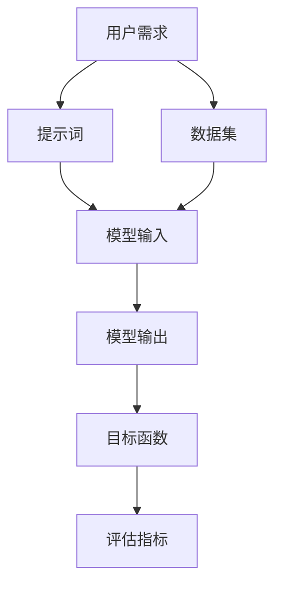

                 

### 文章标题

# 提示词工程：AI时代的新机遇

在当今快速发展的AI时代，提示词工程（Prompt Engineering）正成为一项日益重要的技术领域。随着人工智能的广泛应用，提示词工程不仅能够提升模型的性能，还能带来新的商业机会。本文将深入探讨提示词工程的概念、原理及其在AI时代的广泛应用和未来机遇。

### 关键词

- 提示词工程
- 人工智能
- 模型优化
- 商业应用
- 未来趋势

### 摘要

本文将介绍提示词工程的基本概念，探讨其在人工智能中的应用和重要性。我们将详细分析提示词工程的核心概念及其与AI系统之间的关系，并通过实际案例展示其应用场景。此外，还将探讨构建有效提示策略的方法、相关工具和资源，并预测未来在提示词工程领域的发展趋势。通过本文，读者将全面了解提示词工程在AI时代的新机遇。

### 引言

#### 人工智能的发展及其影响

人工智能（AI）作为计算机科学的一个重要分支，其发展速度之快令人惊叹。自20世纪50年代以来，AI技术经历了多个发展阶段，从最初的逻辑推理和规则系统，到基于统计学习的机器学习（ML），再到近年来深度学习（DL）的广泛应用，AI已经深刻地改变了我们的生活方式。

在工业、医疗、金融、交通等各个领域，AI技术的应用不仅提高了效率和准确性，还带来了全新的商业模式和商业机会。例如，在医疗领域，AI可以帮助医生进行疾病诊断，提高治疗效果；在金融领域，AI可以用于风险管理和智能投顾，提高投资效益；在交通领域，自动驾驶技术正在逐步实现，有望减少交通事故和交通拥堵。

#### 提示词工程的概念

提示词工程（Prompt Engineering）是近年来兴起的一个交叉学科领域，它结合了计算机科学、人工智能和自然语言处理（NLP）。简单来说，提示词工程是关于如何设计、优化和评估用于AI系统的提示（prompts），以便提高模型的学习效果和任务表现。

在AI系统中，提示词起到了桥梁的作用，它们将用户的需求转化为系统能够理解和处理的形式。有效的提示词不仅能够帮助模型更好地理解任务，还能提高模型的鲁棒性和泛化能力。

#### 提示词工程的重要性

在AI时代，提示词工程的重要性不言而喻。首先，随着AI系统在各个领域的广泛应用，如何有效地设计和管理提示词成为了一个关键问题。一个良好的提示词可以显著提高模型的性能，而一个糟糕的提示词则可能导致模型产生错误的结果。

其次，提示词工程还可以帮助企业更好地利用AI技术，实现商业价值。通过优化提示词，企业可以提升产品和服务质量，提高用户满意度，从而在竞争激烈的市场中脱颖而出。

最后，提示词工程的研究和应用不仅有助于推动AI技术的发展，还可以为未来的AI系统提供更多的可能性。例如，通过研究不同类型的提示词及其对模型性能的影响，我们可以更好地理解AI系统的内在机制，为未来的AI设计提供理论支持。

总之，提示词工程在AI时代的兴起，标志着人工智能技术发展进入了一个新的阶段。理解并掌握提示词工程的基本概念和原理，对于从事AI研究和应用的人员来说，具有重要的现实意义和长远的发展价值。

### 核心概念与联系

在深入探讨提示词工程之前，我们首先需要理解几个核心概念：提示词、模型、数据集和目标函数。这些概念之间的关系构成了提示词工程的基石，下面我们将通过一个简单的 Mermaid 流程图来展示它们之间的联系。

在这个流程图中，用户需求首先转化为提示词，然后作为模型的输入进行处理。模型根据输入数据和预先设定的目标函数，生成输出结果。最终，输出结果通过评估指标来衡量其性能，以确定是否满足用户需求。

#### 提示词

提示词（Prompt）是提示词工程的中心概念，它是一种引导AI模型完成特定任务的文本或指示。有效的提示词应简洁明了，同时提供足够的信息，帮助模型理解任务目标。

- **定义**：提示词是用于引导AI模型执行特定任务的文本或指示，它可以是简单的命令或详细的指导，用于提供必要的信息和背景。

- **作用**：提示词的主要作用是帮助模型更好地理解任务目标和输入数据，从而生成更准确、更有用的输出。例如，在自然语言处理任务中，提示词可以引导模型进行文本分类、情感分析或问答系统。

- **类型**：
  - **开放性提示词**：提供较少信息，要求模型根据输入数据生成更全面的回答。
  - **封闭性提示词**：提供具体的信息，要求模型在限定范围内生成输出。

#### 模型

模型（Model）是AI系统的核心组件，它通过学习输入数据来生成输出。不同的AI任务需要不同的模型，如深度学习模型、决策树、支持向量机等。

- **定义**：模型是AI系统的核心组件，它通过学习输入数据来生成输出。模型可以是预训练的，也可以是定制化的。

- **作用**：模型的作用是处理输入数据，并根据目标函数生成输出结果。模型的性能直接影响AI系统的表现。

- **类型**：
  - **深度学习模型**：基于多层神经网络，适用于图像识别、自然语言处理等任务。
  - **传统机器学习模型**：如决策树、随机森林、支持向量机等，适用于分类和回归任务。

#### 数据集

数据集（Dataset）是AI模型的训练材料，它包含一系列输入数据和对应的标签或结果。高质量的数据集对模型的训练和性能至关重要。

- **定义**：数据集是用于训练AI模型的输入数据和标签的集合，它可以是结构化的表格数据，也可以是非结构化的文本、图像或声音。

- **作用**：数据集的作用是提供模型学习的素材，帮助模型理解任务和数据分布。

- **类型**：
  - **训练数据集**：用于模型的训练，包含输入数据和对应的标签。
  - **测试数据集**：用于评估模型的性能，通常包含未参与训练的数据。

#### 目标函数

目标函数（Objective Function）是模型训练过程中用来衡量模型性能的指标，它指导模型学习过程中的优化过程。

- **定义**：目标函数是一个数学函数，用于衡量模型输出与预期输出之间的差异。目标函数的值越低，表示模型的性能越好。

- **作用**：目标函数的作用是指导模型学习过程，优化模型参数，以最小化输出误差。

- **类型**：
  - **损失函数**：如均方误差（MSE）、交叉熵损失等，用于衡量模型输出与实际输出之间的差异。
  - **评估函数**：如准确率、召回率、F1分数等，用于综合评估模型的性能。

#### 评估指标

评估指标（Evaluation Metrics）是用于衡量模型性能的标准，它们通过计算模型在测试数据集上的表现来评估模型的准确性和有效性。

- **定义**：评估指标是用于衡量模型性能的量化标准，它们通常基于模型在测试数据集上的表现计算得出。

- **作用**：评估指标的作用是帮助用户和开发者了解模型的性能，并发现潜在的问题和改进空间。

- **类型**：
  - **分类指标**：如准确率、召回率、精确率等，用于评估分类模型的性能。
  - **回归指标**：如均方误差（MSE）、平均绝对误差（MAE）等，用于评估回归模型的性能。

通过上述核心概念及其相互关系的阐述，我们可以更清晰地理解提示词工程的基本原理。在接下来的章节中，我们将进一步探讨提示词工程的具体应用和实践，帮助读者深入掌握这一领域的关键技术和方法。

### 提示词工程的核心概念及其在AI系统中的应用

在深入理解了提示词、模型、数据集和目标函数等核心概念后，我们接下来将探讨提示词工程的核心概念，并详细分析其在AI系统中的应用。

#### 提示词设计

提示词设计是提示词工程的关键环节，它直接影响AI模型的性能和任务效果。一个好的提示词应具备以下几个特点：

1. **简洁明了**：提示词应简洁明了，避免使用冗长的句子和复杂的词汇，以便模型能够快速理解和处理。

2. **具体明确**：提示词应提供具体明确的信息，帮助模型理解任务目标和输入数据。例如，在问答系统中，提示词可以是一个具体的问答对，而不是一个模糊的问题。

3. **多样性**：提示词应具有多样性，以适应不同类型的数据和任务需求。例如，对于不同的文本分类任务，提示词可以是不同的标签或指示。

4. **适应性**：提示词应具有适应性，能够根据不同用户需求和数据集进行调整和优化。

**设计流程**：

- **需求分析**：首先，了解用户的需求和任务目标，确定需要解决的问题类型和目标。
- **数据准备**：准备用于设计提示词的数据集，这些数据集可以是现有的公开数据集，也可以是定制的数据集。
- **提示词生成**：根据需求和分析结果，生成初步的提示词，并进行初步测试和调整。
- **迭代优化**：通过测试和反馈，不断优化提示词，提高其效果和准确性。

#### 提示词优化

提示词优化是提升AI模型性能的重要手段，通过优化提示词，可以显著提高模型的准确性和鲁棒性。以下是几种常见的提示词优化方法：

1. **数据增强**：通过增加数据量、数据变换和数据扩充等方式，提高模型的泛化能力。例如，在图像识别任务中，可以通过旋转、缩放、裁剪等方式增加数据的多样性。

2. **提示词调整**：根据模型在训练过程中的表现，动态调整提示词的内容和形式，以更好地引导模型学习。例如，在文本分类任务中，可以通过调整提示词的标签和指示来提高模型的分类准确性。

3. **超参数调整**：通过调整模型训练过程中的超参数，如学习率、批量大小、正则化参数等，优化模型的学习过程和性能。

4. **模型集成**：通过集成多个模型或多个提示词，提高模型的鲁棒性和泛化能力。例如，在多标签分类任务中，可以集成多个基于不同提示词的模型，以提高分类的准确性。

#### 提示词评估

提示词评估是确保AI模型性能的重要步骤，通过评估提示词的效果，可以及时发现问题并进行优化。以下是几种常见的提示词评估方法：

1. **自动评估**：使用自动化工具和评估指标，如准确率、召回率、F1分数等，对模型进行评估。自动评估方法简单高效，适用于大规模数据集。

2. **人工评估**：通过人类专家对模型输出进行评估，特别是对于需要高准确性和复杂判断的任务。人工评估可以提供更详细的反馈，但成本较高。

3. **交叉验证**：使用交叉验证方法，将数据集划分为多个子集，多次训练和评估模型，以消除数据集划分的不确定性，提高评估结果的可靠性。

#### 提示词工程在AI系统中的应用

提示词工程在AI系统的多个领域都有广泛应用，以下列举几个典型应用场景：

1. **自然语言处理（NLP）**：在NLP任务中，提示词用于引导模型进行文本分类、情感分析、问答系统等。例如，在文本分类任务中，提示词可以是标签或分类指示；在问答系统中，提示词可以是一个具体的问答对。

2. **计算机视觉（CV）**：在CV任务中，提示词用于指导模型进行图像识别、目标检测、图像分割等。例如，在图像识别任务中，提示词可以是图像的描述或标签；在目标检测任务中，提示词可以是目标的名称或描述。

3. **语音识别（ASR）**：在ASR任务中，提示词用于指导模型进行语音识别和语音合成。例如，在语音识别任务中，提示词可以是语音的文本转换。

4. **机器翻译（MT）**：在MT任务中，提示词用于指导模型进行源语言到目标语言的翻译。例如，在翻译任务中，提示词可以是源语言和目标语言的对照文本。

通过以上对提示词工程的核心概念及其应用的详细探讨，我们可以看到，提示词工程在AI系统中的应用具有重要意义。有效的提示词设计、优化和评估不仅可以提高AI模型的表现，还能为各行各业带来新的商业机会和技术创新。在接下来的章节中，我们将进一步探讨提示词工程在具体应用中的实战案例，帮助读者深入理解和应用这一技术。

### 提示词工程在不同领域的应用

#### 自然语言处理（NLP）

在自然语言处理（NLP）领域，提示词工程扮演着至关重要的角色。NLP任务通常涉及文本分类、情感分析、问答系统、机器翻译等多种应用。以下是一些典型的应用场景和案例：

1. **文本分类**：
   - **案例**：谷歌新闻分类器使用提示词来将新闻文章分类到不同的主题，如体育、商业、科技等。
   - **方法**：通过设计特定标签和指示的提示词，引导模型学习不同主题的特征和模式。

2. **情感分析**：
   - **案例**：社交媒体平台使用情感分析模型来识别用户评论的情绪，如正面、负面或中性。
   - **方法**：使用具有情感标记的提示词，帮助模型理解情感表达的不同方式，例如“我很开心”和“我不高兴”。

3. **问答系统**：
   - **案例**：Siri和Google Assistant等虚拟助手使用问答系统来响应用户的问题。
   - **方法**：通过设计具体的问题和答案对作为提示词，引导模型理解和生成准确的回答。

#### 计算机视觉（CV）

在计算机视觉（CV）领域，提示词工程被广泛应用于图像识别、目标检测、图像分割等任务。以下是一些具体的案例：

1. **图像识别**：
   - **案例**：亚马逊使用图像识别技术来识别和分类商品。
   - **方法**：设计包含图像描述和分类标签的提示词，帮助模型学习不同图像的特征和分类。

2. **目标检测**：
   - **案例**：自动驾驶汽车使用目标检测技术来识别道路上的行人和车辆。
   - **方法**：通过设计包含目标位置和名称的提示词，指导模型在图像中定位和识别目标。

3. **图像分割**：
   - **案例**：医学图像处理中使用图像分割技术来分析肿瘤和病变区域。
   - **方法**：通过设计特定区域描述的提示词，帮助模型更精确地分割图像中的不同部分。

#### 语音识别（ASR）

在语音识别（ASR）领域，提示词工程用于指导模型将语音信号转换为文本。以下是一些典型的应用场景：

1. **语音转文字**：
   - **案例**：智能手机中的语音输入功能使用ASR技术来将用户的语音输入转换为文本。
   - **方法**：设计包含语音文本对照的提示词，帮助模型学习语音和文本之间的对应关系。

2. **语音合成（TTS）**：
   - **案例**：智能助手如Siri和Alexa使用语音合成技术来生成语音回答。
   - **方法**：通过设计语音文本对作为提示词，引导模型学习语音生成的音调和韵律。

#### 机器翻译（MT）

在机器翻译（MT）领域，提示词工程用于指导模型将一种语言的文本翻译成另一种语言。以下是一些典型的应用场景：

1. **跨语言文本分析**：
   - **案例**：国际会议通常使用机器翻译系统来实时翻译演讲内容。
   - **方法**：通过设计包含源语言和目标语言文本对照的提示词，帮助模型学习不同语言的语法和词汇。

2. **多语言搜索引擎**：
   - **案例**：谷歌搜索引擎使用机器翻译技术来支持多语言搜索。
   - **方法**：通过设计包含多种语言文本对照的提示词，提高翻译的准确性和一致性。

#### 金融服务

在金融服务领域，提示词工程被广泛应用于风险评估、客户服务、合规检查等任务。以下是一些具体的案例：

1. **风险评估**：
   - **案例**：银行和金融机构使用AI模型来评估客户贷款申请的风险。
   - **方法**：设计包含客户信息、历史数据和风险评估指示的提示词，帮助模型理解和预测风险。

2. **客户服务**：
   - **案例**：银行和保险公司使用聊天机器人来提供客户服务。
   - **方法**：通过设计包含常见问题和回答的提示词，帮助模型快速响应客户的查询和需求。

3. **合规检查**：
   - **案例**：金融监管机构使用AI模型来检测金融交易中的违规行为。
   - **方法**：通过设计包含交易规则和指示的提示词，帮助模型识别和报告潜在违规行为。

#### 医疗保健

在医疗保健领域，提示词工程被广泛应用于医学图像分析、疾病诊断、患者管理等任务。以下是一些具体的案例：

1. **医学图像分析**：
   - **案例**：放射科医生使用AI模型来辅助诊断肺癌等疾病。
   - **方法**：设计包含医学图像描述和诊断标签的提示词，帮助模型学习和识别疾病特征。

2. **疾病诊断**：
   - **案例**：AI模型被用于辅助医生诊断心脏病、糖尿病等疾病。
   - **方法**：通过设计包含患者症状、病史和诊断指示的提示词，帮助模型进行准确诊断。

3. **患者管理**：
   - **案例**：医院和诊所使用AI系统来管理患者的医疗记录和预约。
   - **方法**：通过设计包含患者信息、预约时间和医疗指示的提示词，帮助模型优化患者管理流程。

通过上述不同领域的应用案例，我们可以看到提示词工程在提升AI模型性能和推动技术创新方面的重要作用。无论是在自然语言处理、计算机视觉、语音识别、机器翻译，还是在金融服务和医疗保健等领域，提示词工程都为AI系统带来了巨大的价值。在接下来的章节中，我们将进一步探讨如何构建有效的提示策略，以充分利用提示词工程的优势。

### 构建有效的提示策略

构建有效的提示策略是提升AI系统性能的关键步骤。以下我们将详细探讨如何设计、测试和优化提示策略，以实现最佳效果。

#### 设计提示策略

设计有效的提示策略需要从多个方面进行考虑，包括任务目标、数据集、模型特性和用户需求。以下是一些关键步骤：

1. **明确任务目标**：
   - 确定任务目标，例如文本分类、目标检测或语音识别。
   - 明确任务的具体要求，例如准确性、响应速度和用户交互。

2. **选择合适的模型**：
   - 根据任务需求选择适合的模型，如深度学习模型、传统机器学习模型或混合模型。
   - 考虑模型的结构、参数和训练数据，以确保模型能够有效地处理任务。

3. **准备数据集**：
   - 准备高质量的数据集，包括训练集、验证集和测试集。
   - 确保数据集的多样性和代表性，以防止模型过拟合。
   - 对数据进行预处理，如文本清洗、图像增强等。

4. **设计初步提示词**：
   - 根据任务需求设计初步的提示词，包括具体的指示、标签和描述。
   - 初步提示词应简洁明了，同时提供足够的信息，帮助模型理解任务。

#### 测试提示策略

测试提示策略的目的是评估其在实际应用中的效果，以下是几种常见的测试方法：

1. **交叉验证**：
   - 将数据集划分为多个子集，多次训练和评估模型，以消除数据集划分的不确定性。
   - 通过计算平均性能指标，如准确率、召回率和F1分数，评估提示策略的效果。

2. **手动评估**：
   - 通过人类专家对模型的输出进行评估，特别是在需要高准确性和复杂判断的任务中。
   - 收集专家的反馈，以识别问题和改进策略。

3. **自动化测试**：
   - 使用自动化工具和评估指标，如准确率、召回率、F1分数等，对模型进行评估。
   - 自动化测试适用于大规模数据集，可以快速评估提示策略的效果。

#### 优化提示策略

优化提示策略的目的是提高模型性能和任务效果，以下是一些常见的优化方法：

1. **调整提示词**：
   - 根据模型在训练过程中的表现，动态调整提示词的内容和形式。
   - 优化提示词的标签、指示和描述，以提高模型的准确性和鲁棒性。

2. **数据增强**：
   - 通过增加数据量、数据变换和数据扩充等方式，提高模型的泛化能力。
   - 例如，在图像识别任务中，可以通过旋转、缩放、裁剪等方式增加数据的多样性。

3. **超参数调整**：
   - 调整模型训练过程中的超参数，如学习率、批量大小、正则化参数等。
   - 通过实验和验证，找到最优的超参数组合，以提高模型性能。

4. **模型集成**：
   - 通过集成多个模型或多个提示词，提高模型的鲁棒性和泛化能力。
   - 例如，在多标签分类任务中，可以集成多个基于不同提示词的模型，以提高分类的准确性。

通过以上设计、测试和优化步骤，可以构建一个有效的提示策略，显著提升AI系统的性能和任务效果。在实际应用中，不断调整和优化提示策略，是确保AI系统长期稳定运行和持续改进的关键。在接下来的章节中，我们将介绍一些常用的工具和资源，以帮助读者更好地进行提示词工程。

### 提示词工程工具和资源

在进行提示词工程时，选择合适的工具和资源至关重要。以下我们将介绍一些常用的工具和资源，包括开源库、平台和社区，以帮助读者更好地开展提示词工程工作。

#### 开源库

1. **Hugging Face Transformers**：
   - **简介**：Hugging Face Transformers 是一个开源库，提供了大量预训练的模型和工具，支持多种自然语言处理任务。
   - **用途**：用于快速构建和部署提示工程模型，包括文本分类、问答系统、机器翻译等。

2. **NLTK**：
   - **简介**：NLTK（自然语言工具包）是一个强大的Python库，提供了广泛的自然语言处理功能。
   - **用途**：用于文本预处理、分词、词性标注、情感分析等，适合初学者进行文本分析任务。

3. **spaCy**：
   - **简介**：spaCy 是一个高效且易于使用的自然语言处理库，适用于文本分析任务。
   - **用途**：用于快速构建复杂的自然语言处理模型，包括实体识别、关系提取等。

#### 开源平台

1. **Google Colab**：
   - **简介**：Google Colab 是一个基于Google Drive的免费云端编程环境，支持Python和其他编程语言。
   - **用途**：用于在线进行提示词工程实验和模型训练，方便共享和协作。

2. **Kaggle**：
   - **简介**：Kaggle 是一个数据科学和机器学习竞赛平台，提供大量公开数据集和工具。
   - **用途**：用于实践提示词工程，参加竞赛，获取新的数据和挑战。

3. **AWS SageMaker**：
   - **简介**：AWS SageMaker 是一个完全托管的机器学习平台，支持模型训练、部署和自动化管道。
   - **用途**：用于大规模部署提示词工程模型，实现从数据导入到模型训练再到预测的端到端解决方案。

#### 社区和支持资源

1. **Reddit**：
   - **简介**：Reddit 是一个热门的社会新闻网站，有许多关于机器学习和自然语言处理的子版块。
   - **用途**：用于提问、讨论和分享提示词工程的最佳实践和最新进展。

2. **Stack Overflow**：
   - **简介**：Stack Overflow 是一个程序员问答社区，提供了大量关于编程和技术问题的答案。
   - **用途**：用于解决提示词工程中遇到的具体问题和疑难杂症。

3. **GitHub**：
   - **简介**：GitHub 是一个流行的代码托管平台，提供了大量开源的提示词工程项目和资源。
   - **用途**：用于查找、学习和贡献提示词工程相关的开源项目。

通过利用上述工具和资源，提示词工程师可以更高效地开展工作，快速构建和部署高质量的AI模型。同时，积极参与社区和交流，也是提升自身技能和了解行业动态的重要途径。在接下来的章节中，我们将探讨提示词工程未来的发展趋势和潜在挑战。

### 未来趋势与潜在挑战

随着人工智能技术的不断进步，提示词工程领域也在快速发展和变化。以下是提示词工程在未来的发展趋势和潜在挑战：

#### 发展趋势

1. **更多定制化提示词**：
   - 随着AI模型越来越复杂，定制化提示词的需求也将增加。未来的提示词工程将更加注重个性化和适应性，以满足不同场景和任务的需求。

2. **自动化提示词生成**：
   - 自动化工具和算法将逐渐取代人工设计提示词，通过自然语言处理和机器学习技术自动生成高质量的提示词。这将显著提高提示词工程的效率和质量。

3. **跨领域融合**：
   - 提示词工程将与其他领域如心理学、语言学、社会学等深度融合，为AI系统提供更加丰富和全面的提示信息，提高其表现和用户满意度。

4. **持续优化与改进**：
   - 随着模型的不断迭代和优化，提示词工程也将不断改进，采用新的算法和技术，如强化学习、迁移学习等，以提高模型性能和泛化能力。

#### 潜在挑战

1. **数据隐私和安全**：
   - 提示词工程需要处理大量敏感数据，如个人隐私信息。如何在保护数据隐私的同时，有效地设计和使用提示词，是一个重要的挑战。

2. **模型解释性和透明度**：
   - 随着AI模型的复杂度增加，如何解释和验证模型的行为和输出成为了一个难题。提高模型的可解释性和透明度，以增强用户信任，是未来需要解决的问题。

3. **算法偏见和公平性**：
   - 提示词工程中的算法偏见问题日益凸显，可能导致歧视和不公平。如何在设计提示词时避免偏见，确保模型公平性，是未来需要面对的挑战。

4. **资源消耗**：
   - 提示词工程通常需要大量的计算资源和数据存储，尤其是在训练大型模型时。如何优化资源使用，提高效率，是一个持续的挑战。

5. **合规和法律问题**：
   - 随着AI技术的应用越来越广泛，相关的法律法规也在不断完善。提示词工程需要遵循这些规定，以确保合规运营。

总之，未来提示词工程将在技术、应用和法律等多个方面面临新的机遇和挑战。通过不断探索和创新，提示词工程有望在人工智能领域发挥更大的作用，为各行各业带来更多价值。

### 总结

本文从多个角度深入探讨了提示词工程的概念、应用、策略设计和未来趋势。通过分析，我们了解到提示词工程在人工智能时代的巨大潜力，无论是在自然语言处理、计算机视觉、语音识别，还是在金融服务和医疗保健等领域，都有着广泛的应用和深远的影响。

提示词工程不仅能够提升AI模型的性能和准确性，还能够为企业带来新的商业机会和技术创新。通过设计有效的提示策略、测试和优化提示词，我们可以充分发挥AI系统的潜力，为各个行业提供智能化解决方案。

面对未来，提示词工程将继续向定制化、自动化和跨领域融合的方向发展。然而，随着技术的进步，我们也将面临数据隐私、模型解释性和公平性等挑战。这些问题需要我们持续关注和解决，以确保AI技术的发展能够造福人类。

在此，我们鼓励读者进一步学习和探索提示词工程，掌握这一关键技术。通过实际应用和持续研究，我们可以不断推动AI技术的发展，为未来创造更多的机遇和可能。

### 最佳实践与注意事项

在进行提示词工程时，以下最佳实践和注意事项将帮助您更加有效地设计和实施提示词：

1. **明确任务目标**：在开始设计提示词之前，务必明确任务的具体目标和需求。这有助于确保提示词能够准确引导模型，达到预期效果。

2. **高质量数据集**：确保使用高质量的数据集进行训练和测试。数据集的多样性和代表性对模型的泛化能力至关重要，避免过拟合现象。

3. **简洁明了的提示词**：设计简洁明了的提示词，避免使用复杂的句子和术语。清晰的指示有助于模型快速理解和学习。

4. **迭代优化**：通过不断的测试和反馈，逐步优化提示词。迭代优化可以帮助您找到最佳提示策略，提高模型性能。

5. **超参数调整**：在模型训练过程中，适当调整超参数，如学习率、批量大小和正则化参数。这些调整可以显著影响模型的学习效果。

6. **数据增强**：使用数据增强技术，如旋转、缩放、裁剪等，增加数据的多样性，提高模型的泛化能力。

7. **持续学习与更新**：随着技术的发展，定期更新模型和提示词，以适应新的数据分布和任务需求。

8. **关注模型解释性**：确保模型具有一定的解释性，以便用户和开发者能够理解模型的行为和输出。

9. **合规性**：在使用和设计提示词时，严格遵守相关的数据隐私和法律合规性要求，避免潜在的法律风险。

10. **协作与交流**：积极参与社区和交流，分享最佳实践和经验，学习他人的成功案例，以不断提升自身技能。

通过遵循这些最佳实践和注意事项，您可以更高效地进行提示词工程，为AI系统带来更高的性能和更广泛的商业价值。

### 拓展阅读

提示词工程作为AI时代的重要领域，涉及众多前沿技术和研究成果。以下推荐几本相关书籍和资源，供读者进一步学习和探索：

1. **《自然语言处理实战》（Natural Language Processing with Python）**：由Steven Bird、Ewan Klein和Edward Loper合著，这本书通过Python语言介绍了NLP的基本概念和常用技术，适合初学者入门。

2. **《深度学习》（Deep Learning）**：由Ian Goodfellow、Yoshua Bengio和Aaron Courville合著，这本书详细介绍了深度学习的理论基础和实践应用，是深度学习领域的重要参考书。

3. **《Hugging Face Transformers文档》（Hugging Face Transformers Documentation）**：这是一个全面的Transformer模型和自然语言处理工具的文档，提供了丰富的API和使用示例。

4. **《自然语言处理与深度学习》（Natural Language Processing and Deep Learning）**：由Colin Evans、Alon Halevy和Peter Norvig合著，这本书系统地介绍了NLP和深度学习的基础知识和应用。

5. **《AI简史：从空想到现实》（AI Superpowers: China, Silicon Valley, and the New World Order）**：由Brad Stone撰写，这本书深入探讨了人工智能的发展历程，以及全球主要国家和地区在AI领域的竞争态势。

通过阅读这些书籍和资源，读者可以更全面地了解提示词工程的原理、实践和未来发展，为自己的学习和研究提供有力支持。

