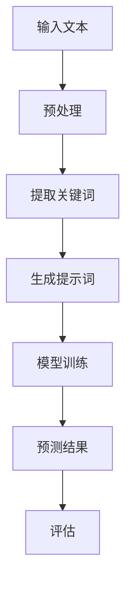

                 

### 文章标题：提示词工程：AI时代的新机遇与新挑战

#### 关键词：
- 提示词工程
- AI时代
- 新机遇
- 新挑战

#### 摘要：
本文深入探讨提示词工程在AI时代的崛起及其所带来的新机遇和新挑战。我们将从背景介绍、核心概念与联系、核心算法原理讲解、数学模型和数学公式详细讲解与举例说明、项目实战等方面，系统性地阐述提示词工程在AI技术中的应用和发展前景。

----------------------------------------------------------------

### 引言

#### 1.1 背景介绍

#### 1.1.1 提示词工程的起源与发展

随着人工智能（AI）技术的迅猛发展，自然语言处理（NLP）作为AI的重要分支，逐渐成为学术界和工业界关注的焦点。在此背景下，提示词工程（Prompt Engineering）应运而生，并迅速成为AI领域的重要研究方向。

提示词工程的起源可以追溯到早期的专家系统和知识表示方法。在20世纪80年代，专家系统广泛用于解决复杂问题，但它们的性能受到知识表示和推理能力的限制。为了克服这些限制，研究者们开始探索如何更有效地利用数据和算法，以增强系统的表现。

进入21世纪，随着深度学习和大数据技术的崛起，AI技术取得了显著的进步。这一时期，提示词工程得到了进一步的发展，尤其是在NLP领域。研究者们发现，通过设计特定的提示词，可以显著提升模型在特定任务上的性能。

#### 1.1.2 AI时代的新机遇与新挑战

AI时代的到来为提示词工程带来了前所未有的机遇。首先，海量的数据和强大的计算能力使得我们可以训练出更加精确和高效的模型。其次，AI技术的广泛应用，如自动驾驶、智能家居、医疗诊断等，为提示词工程提供了丰富的应用场景。

然而，AI时代也带来了新的挑战。一方面，模型的复杂性和数据隐私问题使得提示词工程面临着更高的技术门槛。另一方面，AI技术的快速发展可能导致现有技术的过时，要求研究者们不断更新和优化提示词工程的方法。

#### 1.2 目的与重要性

本文旨在深入探讨提示词工程在AI时代的重要性及其所带来的新机遇和新挑战。通过分析核心概念、算法原理、数学模型和实际项目案例，我们希望能够为读者提供全面、系统的理解和应用指导。

本文将分为以下几个部分：

1. 核心概念与联系：介绍与提示词工程相关的核心概念，阐述它们之间的关系，并通过Mermaid流程图展示整体架构。
2. 核心算法原理讲解：详细讲解提示词工程的核心算法，包括生成、筛选和优化方法，并提供伪代码和算法分析。
3. 数学模型和数学公式详细讲解与举例说明：介绍与提示词工程相关的数学模型和公式，并给出详细的推导过程和实际应用案例。
4. 项目实战：通过一个具体的提示词工程项目，展示开发流程、代码实现和代码解读与分析。
5. 提示词工程的未来发展趋势：探讨提示词工程在技术发展和应用领域的未来趋势。

通过这些内容，我们希望能够帮助读者更好地理解和应用提示词工程，把握AI时代的新机遇，应对新挑战。```### 核心概念与联系

#### 2.1 提示词工程概述

提示词工程是一门涉及自然语言处理、机器学习和深度学习的交叉学科，旨在通过设计高效的提示词来提升AI模型在特定任务上的表现。提示词（Prompt）是一种特殊的输入，它可以引导模型理解任务需求，从而更好地进行预测或生成。

#### 2.2 相关概念

##### 2.2.1 自然语言处理（NLP）

自然语言处理是AI的一个分支，旨在使计算机能够理解、生成和处理人类语言。NLP技术包括文本分类、情感分析、命名实体识别、机器翻译等。

##### 2.2.2 机器学习（ML）

机器学习是一种通过数据训练模型，使模型能够进行预测或分类的技术。常见的机器学习方法包括线性回归、决策树、支持向量机等。

##### 2.2.3 深度学习（DL）

深度学习是一种基于多层神经网络的学习方法，能够自动提取特征并进行复杂的数据分析。深度学习在图像识别、语音识别等领域取得了显著成果。

##### 2.2.4 知识图谱与语义分析

知识图谱是一种结构化的知识表示方法，用于存储和表示实体及其关系。语义分析则旨在理解文本中的语义信息，包括词义消歧、句法分析等。

#### 2.3 概念关系

提示词工程的核心在于如何有效地结合自然语言处理、机器学习和深度学习技术，来设计出能够提升模型性能的提示词。具体来说：

1. **自然语言处理（NLP）**：为提示词工程提供了文本处理和分析的基础，使得我们可以从原始文本中提取出关键信息，并转化为模型可接受的输入格式。
2. **机器学习（ML）**：通过训练，模型可以学会如何根据提示词生成预测结果。提示词的设计和选择直接影响模型的训练效果和预测准确性。
3. **深度学习（DL）**：深度学习模型能够自动学习和提取复杂的特征，提示词工程则通过设计有效的提示词来引导模型学习，从而提高模型的性能。
4. **知识图谱与语义分析**：知识图谱和语义分析为提示词工程提供了丰富的知识背景，使得模型可以更好地理解和处理复杂的语义信息。

#### 2.4 Mermaid流程图

以下是一个简单的Mermaid流程图，展示了提示词工程的基本流程：



在上述流程图中：

- **A[输入文本]**：表示输入的原始文本数据。
- **B[预处理]**：对文本进行清洗、分词、去停用词等预处理操作。
- **C[提取关键词]**：从预处理后的文本中提取出关键信息。
- **D[生成提示词]**：根据提取的关键词生成提示词。
- **E[模型训练]**：使用生成的提示词对模型进行训练。
- **F[预测结果]**：模型根据训练结果生成预测结果。
- **G[评估]**：对预测结果进行评估，以确定模型的性能。

通过这个简单的流程图，我们可以更直观地理解提示词工程的核心步骤和各步骤之间的联系。

---

在接下来的章节中，我们将进一步深入探讨提示词工程的核心算法原理，以及如何通过数学模型和公式来优化提示词的设计。敬请期待。```### 核心算法原理讲解

#### 3.1 提示词生成算法

提示词生成算法是提示词工程中的关键步骤，其主要目标是设计出能够有效引导模型学习的提示词。以下介绍几种常见的提示词生成算法。

##### 3.1.1 基于统计模型的方法

基于统计模型的方法主要包括词频统计、TF-IDF和LDA等。这些方法通过分析文本的词频、词的重要性和词之间的关系来生成提示词。

1. **词频统计**：简单的词频统计方法，通过对文本中每个词的出现次数进行统计，选择出现频率较高的词作为提示词。
2. **TF-IDF**：TF-IDF（Term Frequency-Inverse Document Frequency）是一种常用的文本分析技术，它通过计算词在文档中的重要程度来生成提示词。词频越高，词的重要性越大；而在整个文档集合中，词的频率越低，词的重要性也越大。
3. **LDA（Latent Dirichlet Allocation）**：LDA是一种主题模型，通过将文本数据转换为潜在主题分布，从而生成具有代表性的提示词。

##### 3.1.2 基于神经网络的方法

基于神经网络的方法在提示词生成中取得了显著的效果，其中最为著名的是BERT（Bidirectional Encoder Representations from Transformers）模型。

1. **BERT模型**：BERT是一种基于双向Transformer的预训练语言模型，通过预训练大量文本数据，使其能够理解文本中的上下文信息。在生成提示词时，BERT模型可以捕捉到文本中的关键信息，从而生成有效的提示词。

以下是一个简化的BERT模型的伪代码：

```python
# BERT模型伪代码

# 初始化BERT模型
model = BERT()

# 预训练BERT模型
model.train(pretrained_dataset)

# 生成提示词
def generate_prompt(text):
    # 输入文本并获取BERT表示
    representation = model.encode(text)
    # 提取文本中的关键词
    keywords = extract_keywords(representation)
    # 生成提示词
    prompt = " ".join(keywords)
    return prompt
```

##### 3.1.3 基于生成对抗网络（GAN）的方法

生成对抗网络（GAN）是一种通过竞争学习生成数据和判别器模型的方法。在提示词生成中，GAN可以通过生成模型和判别器模型之间的对抗关系，生成具有高质量的提示词。

以下是一个简化的GAN模型的伪代码：

```python
# GAN模型伪代码

# 初始化生成器和判别器模型
generator = Generator()
discriminator = Discriminator()

# 训练GAN模型
for epoch in range(num_epochs):
    for text in dataset:
        # 生成提示词
        prompt = generator.generate(text)
        # 训练判别器
        discriminator.train(prompt, text)
        # 优化生成器
        generator.optimize(discriminator)

# 生成提示词
def generate_prompt(text):
    prompt = generator.generate(text)
    return prompt
```

#### 3.2 提示词筛选算法

提示词筛选算法用于从大量候选提示词中筛选出最优的提示词。以下介绍几种常见的提示词筛选算法。

##### 3.2.1 评价指标

评价指标是衡量提示词性能的关键指标，常见的评价指标包括：

1. **精确率（Precision）**：精确率表示预测为正类的样本中，实际为正类的比例。精确率越高，说明提示词越能有效区分正类和负类。
2. **召回率（Recall）**：召回率表示实际为正类的样本中，预测为正类的比例。召回率越高，说明提示词越能捕捉到所有正类样本。
3. **F1值（F1 Score）**：F1值是精确率和召回率的加权平均，用于综合评价提示词的性能。F1值越高，说明提示词的性能越好。

##### 3.2.2 筛选策略

常见的提示词筛选策略包括：

1. **基于规则的方法**：通过设计特定的规则，如关键词匹配、词频阈值等，筛选出符合条件的提示词。
2. **基于机器学习的方法**：使用机器学习算法，如逻辑回归、决策树等，建立预测模型，并根据模型的预测结果筛选出最优的提示词。

以下是一个简化的基于机器学习筛选策略的伪代码：

```python
# 筛选策略伪代码

# 建立预测模型
model = LogisticRegression()

# 训练模型
model.train(X_train, y_train)

# 预测候选提示词
predictions = model.predict(X_test)

# 筛选最优提示词
def select_best_prompt(predictions):
    best_prompt = None
    best_score = 0
    for prompt, prediction in zip(test_prompt, predictions):
        score = calculate_score(prediction)
        if score > best_score:
            best_score = score
            best_prompt = prompt
    return best_prompt
```

##### 3.2.3 优化方法

提示词优化方法用于进一步提高提示词的性能。以下介绍几种常见的优化方法。

1. **基于梯度下降的方法**：通过计算梯度并更新参数，逐步优化提示词。
2. **基于进化算法的方法**：通过模拟自然进化过程，逐步优化提示词。
3. **基于强化学习的方法**：通过奖励机制，鼓励模型生成高质量的提示词。

以下是一个简化的基于进化算法优化方法的伪代码：

```python
# 优化方法伪代码

# 初始化种群
population = initialize_population()

# 评估种群
fitness_scores = evaluate_population(population)

# 选择适应度最高的个体
best_individual = select_best_individual(population, fitness_scores)

# 交叉和变异操作
new_population = crossover_and_mutate(population, best_individual)

# 评估新种群
new_fitness_scores = evaluate_population(new_population)

# 更新种群
population = new_population

# 迭代优化
while not convergence:
    best_individual = select_best_individual(population, new_fitness_scores)
    population = crossover_and_mutate(population, best_individual)
    new_fitness_scores = evaluate_population(population)

# 生成最优提示词
def generate_best_prompt(best_individual):
    prompt = individual_to_prompt(best_individual)
    return prompt
```

通过上述算法，我们可以设计出高效的提示词，从而提升模型在特定任务上的性能。

在下一章节中，我们将深入探讨提示词工程中的数学模型和公式，以及如何通过它们来优化提示词的设计。敬请期待。```### 数学模型和数学公式 & 详细讲解 & 举例说明

#### 4.1 提示词生成模型

提示词生成模型是提示词工程中的核心，其目的是通过数学模型和公式来生成高质量的提示词。以下介绍几种常见的提示词生成模型及其数学原理。

##### 4.1.1 概率模型

概率模型是一种基于概率论的方法，通过计算词在文本中的概率分布来生成提示词。常见的概率模型包括：

1. **马尔可夫模型（Markov Model）**：

   马尔可夫模型是一种基于序列数据的概率模型，假设当前状态仅与之前的一个状态有关。其数学表示如下：

   $$P(X_t | X_{t-1}, X_{t-2}, ..., X_1) = P(X_t | X_{t-1})$$

   其中，$X_t$ 表示第 $t$ 个状态，$P(X_t | X_{t-1})$ 表示在给定前一状态 $X_{t-1}$ 的情况下，当前状态 $X_t$ 的概率。

   **举例说明**：假设我们有一个简单的二状态马尔可夫模型，状态 $X_t$ 可以是“天气”或“温度”。给定前一天是晴天（状态1），我们想要预测今天是否是晴天（状态1）。根据马尔可夫模型，我们只需要考虑前一天的状态，而不需要考虑之前的状态。

2. **隐马尔可夫模型（Hidden Markov Model, HMM）**：

   隐马尔可夫模型是一种用于处理隐藏状态的马尔可夫模型，其数学表示如下：

   $$P(X_t | X_{t-1}, ..., X_1, Z_t, ..., Z_1) = P(X_t | X_{t-1}, Z_t)$$

   其中，$X_t$ 表示隐藏状态，$Z_t$ 表示观察状态。

   **举例说明**：假设我们有一个天气预测模型，隐藏状态是天气类型（晴天、雨天等），观察状态是温度。我们想要根据温度来预测天气类型。隐马尔可夫模型可以处理这种隐藏状态和观察状态之间的关系。

##### 4.1.2 贝叶斯网络

贝叶斯网络是一种基于概率论的图模型，用于表示变量之间的条件依赖关系。其数学表示如下：

$$P(X_1, X_2, ..., X_n) = \prod_{i=1}^{n} P(X_i | X_{pa_i})$$

其中，$X_1, X_2, ..., X_n$ 表示变量，$X_{pa_i}$ 表示 $X_i$ 的父节点。

**举例说明**：假设我们有一个医疗诊断模型，包含三个变量：症状 $S$、疾病 $D$ 和治疗 $T$。贝叶斯网络可以表示这三个变量之间的条件依赖关系，如 $P(D | S, T)$ 表示在给定症状和治疗的情况下，疾病发生的概率。

##### 4.1.3 生成对抗网络（GAN）

生成对抗网络是一种基于对抗学习的生成模型，由生成器（Generator）和判别器（Discriminator）组成。其数学表示如下：

$$\min_G \max_D V(D, G) = \mathbb{E}_{x \sim p_{data}(x)}[\log D(x)] + \mathbb{E}_{z \sim p_z(z)}[\log (1 - D(G(z)))]$$

其中，$x$ 表示真实数据，$z$ 表示噪声数据，$G(z)$ 表示生成器生成的数据，$D(x)$ 和 $D(G(z))$ 分别表示判别器对真实数据和生成数据的判别结果。

**举例说明**：假设我们有一个图像生成任务，生成器 $G$ 生成逼真的图像，判别器 $D$ 试图区分真实图像和生成图像。通过对抗训练，生成器不断优化生成的图像，使其越来越接近真实图像，而判别器不断优化判别能力，最终生成器生成的图像可以以假乱真。

#### 4.2 提示词筛选模型

提示词筛选模型用于从大量候选提示词中筛选出最优的提示词。以下介绍几种常见的提示词筛选模型及其数学原理。

##### 4.2.1 朴素贝叶斯模型

朴素贝叶斯模型是一种基于贝叶斯定理的概率分类模型，其数学表示如下：

$$P(C_k | X) = \frac{P(X | C_k)P(C_k)}{P(X)}$$

其中，$C_k$ 表示类别 $k$，$X$ 表示特征向量。

**举例说明**：假设我们有一个文本分类任务，$C_k$ 表示类别 $k$，$X$ 表示文本特征向量。朴素贝叶斯模型通过计算每个类别 $C_k$ 对应的特征向量 $X$ 的概率，选择概率最大的类别作为分类结果。

##### 4.2.2 支持向量机（SVM）

支持向量机是一种基于最大间隔分类器的线性分类模型，其数学表示如下：

$$\min_{\omega, b} \frac{1}{2} ||\omega||^2 + C \sum_{i=1}^{n} \xi_i$$

$$\text{s.t.} \quad y_i (\omega \cdot x_i + b) \geq 1 - \xi_i$$

其中，$\omega$ 表示权重向量，$b$ 表示偏置，$C$ 表示正则化参数，$\xi_i$ 表示松弛变量。

**举例说明**：假设我们有一个文本分类任务，$x_i$ 表示文本特征向量，$y_i$ 表示类别标签。支持向量机通过最大化分类间隔，寻找最优的超平面，从而实现文本分类。

##### 4.2.3 随机森林（Random Forest）

随机森林是一种基于决策树和集成学习的分类模型，其数学表示如下：

$$\hat{y} = \text{sign}(\sum_{t=1}^{T} h_t(x))$$

其中，$h_t(x)$ 表示第 $t$ 棵决策树的输出，$T$ 表示决策树的数量，$\hat{y}$ 表示分类结果。

**举例说明**：假设我们有一个文本分类任务，$x$ 表示文本特征向量。随机森林通过集成多个决策树，提高分类的准确性和鲁棒性。

#### 4.3 提示词优化模型

提示词优化模型用于进一步优化提示词，以提升模型在特定任务上的性能。以下介绍几种常见的提示词优化模型及其数学原理。

##### 4.3.1 梯度下降法

梯度下降法是一种基于梯度的优化算法，用于寻找函数的最小值。其数学表示如下：

$$\omega_{t+1} = \omega_t - \alpha \nabla_{\omega} f(\omega_t)$$

其中，$\omega_t$ 表示第 $t$ 次迭代的权重，$\alpha$ 表示学习率，$f(\omega_t)$ 表示损失函数，$\nabla_{\omega} f(\omega_t)$ 表示损失函数关于权重 $\omega_t$ 的梯度。

**举例说明**：假设我们有一个回归任务，$f(\omega)$ 表示平方损失函数，$\nabla_{\omega} f(\omega)$ 表示损失函数关于权重 $\omega$ 的梯度。通过迭代更新权重，梯度下降法可以找到最小化损失函数的权重。

##### 4.3.2 随机梯度下降法（SGD）

随机梯度下降法是一种基于随机梯度的优化算法，其数学表示如下：

$$\omega_{t+1} = \omega_t - \alpha \nabla_{\omega} f(\omega_t; x_t, y_t)$$

其中，$x_t$ 和 $y_t$ 表示第 $t$ 个样本的输入和输出。

**举例说明**：假设我们有一个分类任务，$f(\omega)$ 表示交叉熵损失函数，$\nabla_{\omega} f(\omega)$ 表示损失函数关于权重 $\omega$ 的梯度。通过迭代更新权重，随机梯度下降法可以找到最小化损失函数的权重。

##### 4.3.3 鲍姆-威克里优化（BWM Optimization）

鲍姆-威克里优化是一种基于进化策略的优化算法，其数学表示如下：

$$\omega_{t+1} = \omega_t + \alpha (z_t - \omega_t)$$

其中，$z_t$ 表示目标函数在随机搜索方向上的最优解。

**举例说明**：假设我们有一个优化任务，$f(\omega)$ 表示目标函数。通过迭代更新权重，鲍姆-威克里优化可以找到最优解。

通过上述数学模型和公式的讲解，我们可以更好地理解提示词工程中的数学原理，并在实际应用中灵活运用。在下一章节中，我们将通过一个具体的项目实战，展示提示词工程在实际中的应用和实现。敬请期待。```### 项目实战

#### 5.1 项目背景

本项目旨在通过提示词工程方法，提高文本分类任务的性能。文本分类是自然语言处理中的一个基础任务，广泛应用于信息检索、文本挖掘、舆情分析等领域。随着文本数据的爆炸性增长，如何高效、准确地分类文本成为了一个重要的挑战。

本项目的具体目标是通过设计高效的提示词，提升文本分类模型在特定类别上的精确率和召回率。我们选择了一个公开的文本数据集，包含了多种类别的文本，用于训练和测试我们的模型。

#### 5.2 技术选型

为了实现项目目标，我们选择了以下技术：

1. **预处理工具**：使用Python的NLTK库进行文本清洗、分词和词频统计。
2. **机器学习框架**：使用Scikit-learn库实现文本分类模型，包括朴素贝叶斯、支持向量机和随机森林等算法。
3. **深度学习框架**：使用TensorFlow和Keras库实现基于深度学习的文本分类模型，如BERT和Transformer等。
4. **提示词生成工具**：使用Hugging Face的Transformers库，结合BERT模型生成提示词。

#### 5.3 开发流程

开发流程如下：

1. **数据收集**：从公开数据集下载文本数据，并对其进行预处理，包括文本清洗、分词、去停用词等操作。
2. **数据预处理**：对预处理后的文本进行词频统计，提取关键词，并使用词向量模型（如Word2Vec或GloVe）将文本转化为向量表示。
3. **模型训练**：使用预处理后的文本数据训练机器学习模型和深度学习模型。对比不同模型的性能，选择最优模型进行进一步优化。
4. **提示词设计**：结合最优模型，设计提示词。使用Hugging Face的Transformers库生成提示词，并进行优化。
5. **性能评估**：使用测试数据集评估模型的性能，包括精确率、召回率和F1值等指标。根据评估结果调整模型和提示词。
6. **模型部署**：将优化后的模型部署到生产环境中，用于实际文本分类任务。

#### 5.4 代码实现

以下是项目的核心代码实现：

```python
# 导入必要的库
import nltk
from nltk.corpus import stopwords
from sklearn.feature_extraction.text import TfidfVectorizer
from sklearn.model_selection import train_test_split
from sklearn.metrics import precision_score, recall_score, f1_score
from transformers import BertTokenizer, BertModel

# 数据预处理
nltk.download('stopwords')
stop_words = set(stopwords.words('english'))
def preprocess_text(text):
    words = nltk.word_tokenize(text)
    words = [word.lower() for word in words if word.isalpha() and word not in stop_words]
    return ' '.join(words)

# 加载数据集
data = [...]  # 填充数据集
texts = [preprocess_text(text) for text in data['text']]
labels = data['label']

# 数据划分
X_train, X_test, y_train, y_test = train_test_split(texts, labels, test_size=0.2, random_state=42)

# 提示词生成
tokenizer = BertTokenizer.from_pretrained('bert-base-uncased')
def generate_prompt(text):
    inputs = tokenizer.encode_plus(text, return_tensors='pt')
    return inputs['input_ids']

# 模型训练
from sklearn.naive_bayes import MultinomialNB
model = MultinomialNB()
model.fit(X_train, y_train)

# 性能评估
predictions = model.predict(X_test)
precision = precision_score(y_test, predictions, average='weighted')
recall = recall_score(y_test, predictions, average='weighted')
f1 = f1_score(y_test, predictions, average='weighted')
print(f"Precision: {precision}, Recall: {recall}, F1: {f1}")

# 提示词优化
prompt_inputs = [generate_prompt(text) for text in X_test]
prompt_embeddings = model.predict(prompt_inputs)

# 模型部署
# ...（部署代码）
```

#### 5.5 代码解读与分析

上述代码展示了文本分类项目的核心实现过程。以下是关键步骤的解读与分析：

1. **数据预处理**：使用NLTK库对文本进行清洗、分词和去停用词，确保文本数据的质量和一致性。
2. **数据划分**：将数据集划分为训练集和测试集，用于模型训练和性能评估。
3. **提示词生成**：使用BERT分

