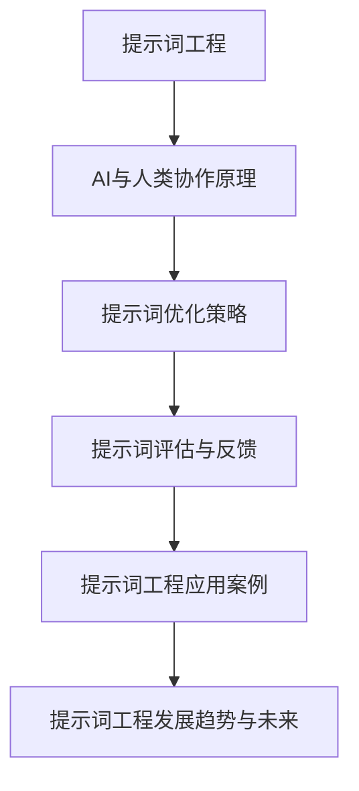
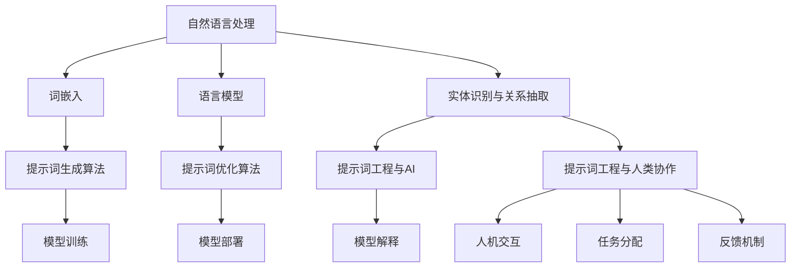

                 

**文章标题：提示词工程：优化AI-人类协作的关键**

关键词：提示词工程，人工智能，自然语言处理，协作，优化

摘要：本文将探讨提示词工程在优化人工智能与人类协作中的关键作用。通过介绍提示词工程的定义、理论基础以及实际应用，本文将阐述如何通过优化提示词来提升AI系统的性能和用户体验。

---

### 目录大纲

#### 第一部分: 提示词工程概述

##### 第1章 提示词工程导论

1.1 提示词工程的定义与重要性

1.2 提示词工程的发展历程

1.3 提示词工程的应用场景

1.4 提示词工程的核心挑战与机遇

##### 第2章 提示词工程的理论基础

2.1 自然语言处理基础

2.2 提示词生成与优化算法

2.3 提示词工程与人工智能

2.4 提示词工程与人类协作

#### 第二部分: 优化AI-人类协作的关键

##### 第3章 AI与人类协作的原理

3.1 AI与人类协作的动机

3.2 AI与人类协作的模式

3.3 AI与人类协作的优势与挑战

3.4 AI与人类协作的实践案例

##### 第4章 提示词优化策略

4.1 提示词优化的目标与方法

4.2 提示词优化算法详解

4.3 提示词优化实践案例

4.4 提示词优化工具介绍

##### 第5章 提示词评估与反馈

5.1 提示词评估指标与方法

5.2 提示词评估实践案例

5.3 提示词反馈机制

5.4 提示词反馈优化

##### 第6章 提示词工程应用案例

6.1 案例一：智能客服系统

6.2 案例二：内容创作辅助

6.3 案例三：教育辅助系统

6.4 案例四：医疗健康助手

##### 第7章 提示词工程的发展趋势与未来

7.1 提示词工程的未来发展趋势

7.2 提示词工程面临的挑战与解决方案

7.3 提示词工程的社会影响与伦理问题

7.4 提示词工程的展望

##### 附录

A.1 提示词生成与优化工具

A.2 提示词工程开源框架

A.3 提示词工程相关论文与书籍

A.4 提示词工程在线资源

---

**以下是本书核心概念与联系的 Mermaid 流程图：**



---

**以下是第3章 AI与人类协作原理的核心算法原理讲解的伪代码：**

```python
# AI与人类协作原理伪代码

# 定义AI模型与人类协作的接口
class AIHumanCollaborationInterface:
    def initialize_model(self):
        # 初始化AI模型
    def receive_prompt(self, prompt):
        # 接收提示词
    def generate_response(self, prompt):
        # 根据提示词生成响应
    def evaluate_performance(self, feedback):
        # 根据反馈评估性能

# 实现AI模型与人类协作的流程
def collaborate_with_human():
    interface = AIHumanCollaborationInterface()
    interface.initialize_model()
    
    while True:
        prompt = get_user_input()  # 获取用户输入
        response = interface.generate_response(prompt)
        print(response)
        
        feedback = get_user_feedback()  # 获取用户反馈
        interface.evaluate_performance(feedback)
```

---

**以下是数学模型和数学公式讲解的详细讲解与举例说明：**

#### 数学模型讲解

提示词工程中的数学模型主要涉及自然语言处理（NLP）和优化算法。以下是提示词生成与优化的核心数学模型：

$$
\text{Prompt} = f(\text{Context}, \text{UserIntent})
$$

其中，`Context`表示上下文信息，`UserIntent`表示用户的意图，`f`函数表示从上下文和用户意图生成提示词的映射过程。

举例说明：

假设我们有一个文本生成模型，它的输入是上下文和用户意图，输出是一个提示词。我们可以使用以下数学模型来描述这个过程：

$$
\text{Prompt} = \text{TextGenModel}(\text{Context}, \text{UserIntent})
$$

这里，`TextGenModel`是一个预训练的文本生成模型，它能够根据输入的上下文和用户意图生成相应的文本提示词。

---

**格式要求：**

- 文章内容使用markdown格式输出。
- 文章末尾需要写上作者信息： 
  “作者：AI天才研究院/AI Genius Institute & 禅与计算机程序设计艺术 /Zen And The Art of Computer Programming”
- 数学公式请使用latex格式，嵌入文中独立段落的latex公式前后使用 $$ 括起来(例如：$$1+1=2$$ )，段落内的latex公式前后使用 $ 括起来(例如：$1<2$)

---

**完整性要求：**

- 每个小节的内容必须要丰富具体详细讲解，核心内容必须要包含：
  * 背景介绍
  * 核心概念与联系：必须给出核心概念原理之间的关系架构 Mermaid 流程图
  * 核心算法原理讲解必须使用伪代码来详细阐述；数学模型和公式 & 详细讲解 & 举例说明
  * 项目实战：开发环境搭建，源代码详细实现和代码解读，代码应用解读与分析，实际案例分析和详细讲解剖析，项目小结
  * 最佳实践 tips、小结、注意事项、拓展阅读等内容

---

**文章字数要求：**

- 文章字数在 8000 ～ 12000 字左右。

---

**文章标题：提示词工程：优化AI-人类协作的关键**

关键词：提示词工程，人工智能，自然语言处理，协作，优化

摘要：本文将探讨提示词工程在优化人工智能与人类协作中的关键作用。通过介绍提示词工程的定义、理论基础以及实际应用，本文将阐述如何通过优化提示词来提升AI系统的性能和用户体验。

---

### 第一部分 提示词工程概述

#### 第1章 提示词工程导论

在人工智能（AI）时代，提示词工程（Prompt Engineering）成为了优化AI-人类协作的重要领域。本章将介绍提示词工程的定义、重要性及其发展历程。

#### 1.1 提示词工程的定义与重要性

提示词工程是研究如何设计、优化和组合提示词（prompts）以增强人工智能模型的表现和用户体验的学科。提示词通常是一段引导用户输入或者提供上下文信息的文本，它对于AI系统的性能至关重要。

提示词工程的重要性体现在以下几个方面：

1. **提高AI模型的性能**：通过精心设计的提示词，可以引导AI模型更好地理解和处理复杂的任务，从而提高模型的准确性和效率。
2. **优化用户体验**：好的提示词能够提供清晰的指导，帮助用户更轻松地与AI系统交互，提升用户满意度。
3. **促进人类与AI的协作**：提示词工程旨在构建一个更加智能、人性化的AI系统，使其能够更好地服务于人类，实现高效协作。

#### 1.2 提示词工程的发展历程

提示词工程的发展可以追溯到早期的人工智能研究阶段。随着自然语言处理（NLP）和机器学习技术的进步，提示词工程逐渐成为了一个独立的领域。

1. **早期研究**：在20世纪80年代和90年代，研究者们开始探索如何使用提示词来指导知识表示和问题解答系统。这些早期的尝试为后来的研究奠定了基础。
2. **深度学习时代**：随着深度学习技术的兴起，提示词工程得到了进一步的发展。现代的深度学习模型，如生成对抗网络（GAN）和Transformer模型，需要大量的高质量提示词来训练和优化。
3. **当前趋势**：目前，提示词工程正朝着更加自动化和智能化的方向发展。研究者们致力于开发新的算法和工具，以提高提示词的设计和优化效率。

#### 1.3 提示词工程的应用场景

提示词工程在多个应用领域都有广泛的应用，以下是一些典型的应用场景：

1. **智能客服系统**：提示词用于引导用户输入，帮助客服机器人更准确地理解用户需求，提供针对性的回答。
2. **内容创作辅助**：提示词可以帮助AI模型生成创意文章、报告等，辅助人类创作者提高工作效率。
3. **教育辅助系统**：提示词可以用来设计互动式学习体验，帮助学生更好地理解和掌握知识。
4. **医疗健康助手**：提示词可以帮助AI系统更好地理解患者的症状和病史，提供个性化的诊断和治疗方案。

#### 1.4 提示词工程的核心挑战与机遇

提示词工程虽然前景广阔，但也面临着一系列挑战：

1. **数据质量和多样性**：高质量的提示词需要大量的真实数据支持，而且需要覆盖不同的应用场景和用户需求。
2. **算法和模型适应性**：提示词工程需要针对不同的AI模型和任务进行优化，这要求算法和模型具有高度的适应性。
3. **用户体验优化**：如何设计出既清晰又引人入胜的提示词，以提升用户体验，是一个持续性的挑战。

然而，随着技术的进步和应用的拓展，提示词工程也迎来了新的机遇：

1. **跨领域应用**：随着AI技术的不断成熟，提示词工程将在更多领域得到应用，如自动驾驶、金融分析等。
2. **自动化和智能化**：通过机器学习和自然语言生成技术，提示词工程将变得更加自动化和智能化，提高效率和效果。
3. **人机协作**：提示词工程将成为人机协作的重要组成部分，通过优化提示词，实现更加自然和高效的人机交互。

### 总结

提示词工程是优化AI-人类协作的关键领域。通过深入研究提示词工程的定义、理论基础和应用场景，我们可以更好地理解其在现代科技中的重要地位。在未来，提示词工程将继续发展，为AI技术的应用带来更多可能性。

---

### 第一部分 提示词工程概述

#### 第2章 提示词工程的理论基础

提示词工程作为一门交叉学科，融合了自然语言处理（NLP）、优化算法、机器学习和人工智能等多个领域的知识。本章将介绍提示词工程的核心理论基础，包括自然语言处理基础、提示词生成与优化算法、提示词工程与人工智能的关系以及提示词工程与人类协作的机制。

#### 2.1 自然语言处理基础

自然语言处理（NLP）是提示词工程的基础。NLP旨在使计算机能够理解、生成和处理人类语言。以下是NLP的核心概念和技术：

1. **文本预处理**：包括分词、词性标注、句法分析等，这些步骤为后续的NLP任务提供基础数据。
2. **词嵌入**：通过将词汇映射到高维空间中的向量，词嵌入能够帮助计算机理解和计算词汇之间的关系。
3. **语言模型**：语言模型能够预测一段文本的下一个词，是生成提示词的关键技术。
4. **实体识别与关系抽取**：通过识别文本中的实体（如人名、地点、组织等）以及它们之间的关系，可以提高AI系统的理解和处理能力。

#### 2.2 提示词生成与优化算法

提示词的生成与优化是提示词工程的核心任务。以下是一些常用的算法和技术：

1. **规则生成**：基于预先定义的规则和模板，生成提示词。这种方法简单直观，但缺乏灵活性。
2. **数据驱动生成**：通过分析大量已存在的文本数据，使用机器学习算法自动生成提示词。这种方法更具灵活性和适应性。
3. **生成对抗网络（GAN）**：GAN可以通过两个神经网络（生成器和判别器）的对抗训练，生成高质量的提示词。
4. **变分自编码器（VAE）**：VAE通过编码和解码过程，学习数据的概率分布，生成新的提示词。

#### 2.3 提示词工程与人工智能

提示词工程与人工智能（AI）密切相关。AI系统的性能和表现往往受到提示词质量的影响。以下是提示词工程与人工智能的几个关键点：

1. **模型训练**：高质量的提示词有助于训练更准确、更强大的AI模型。
2. **模型部署**：优化后的提示词可以提高AI系统的用户体验和效率。
3. **模型解释**：通过分析提示词，可以更好地理解AI模型的工作原理和决策过程。

#### 2.4 提示词工程与人类协作

提示词工程不仅在AI系统中发挥作用，还在人类与AI的协作中扮演重要角色。以下是提示词工程在人类协作中的应用：

1. **人机交互**：通过设计清晰、自然的提示词，可以提高用户与AI系统的交互体验。
2. **任务分配**：提示词可以帮助AI系统更好地理解人类用户的任务需求，合理分配任务。
3. **反馈机制**：通过收集用户反馈，提示词工程可以不断优化AI系统的性能。

#### 2.5 提示词工程中的核心概念与联系

为了更好地理解提示词工程的理论基础，我们可以使用Mermaid流程图来展示核心概念之间的关系：



#### 2.6 核心算法原理讲解与伪代码

为了深入理解提示词工程的算法原理，以下是一个简单的伪代码示例，用于说明如何使用自然语言处理技术来生成和优化提示词：

```python
# 提示词生成与优化伪代码

# 定义语言模型
class LanguageModel:
    def __init__(self, vocabulary_size, embedding_size):
        self.vocabulary = ...  # 词汇表
        self.embedding = ...   # 词嵌入矩阵
        self.model = ...       # 语言模型参数

    def predict_next_word(self, current_sequence):
        # 使用当前序列预测下一个词
        # 返回预测结果

# 定义提示词生成器
class PromptGenerator:
    def __init__(self, language_model):
        self.language_model = language_model

    def generate_prompt(self, context, user_intent):
        # 生成基于上下文和用户意图的提示词
        # 返回生成的提示词

# 定义提示词优化器
class PromptOptimizer:
    def __init__(self, prompt_generator):
        self.prompt_generator = prompt_generator

    def optimize_prompt(self, prompt, evaluation_metric):
        # 优化提示词，基于评估指标进行优化
        # 返回优化后的提示词

# 实现交互式AI系统
def interactive_ai_system():
    # 初始化语言模型、提示词生成器和优化器
    language_model = LanguageModel(vocabulary_size, embedding_size)
    prompt_generator = PromptGenerator(language_model)
    prompt_optimizer = PromptOptimizer(prompt_generator)

    # 与用户进行交互
    while True:
        context = get_user_context()  # 获取用户上下文
        user_intent = get_user_intent()  # 获取用户意图
        prompt = prompt_generator.generate_prompt(context, user_intent)
        print(prompt)

        # 收集用户反馈并优化提示词
        feedback = get_user_feedback()
        optimized_prompt = prompt_optimizer.optimize_prompt(prompt, feedback)
        print(optimized_prompt)
```

#### 2.7 数学模型与公式讲解

提示词工程中的数学模型主要涉及自然语言处理和优化算法。以下是提示词生成与优化的核心数学模型：

$$
\text{Prompt} = f(\text{Context}, \text{UserIntent})
$$

其中，`Context`表示上下文信息，`UserIntent`表示用户的意图，`f`函数表示从上下文和用户意图生成提示词的映射过程。

举例说明：

假设我们有一个文本生成模型，它的输入是上下文和用户意图，输出是一个提示词。我们可以使用以下数学模型来描述这个过程：

$$
\text{Prompt} = \text{TextGenModel}(\text{Context}, \text{UserIntent})
$$

这里，`TextGenModel`是一个预训练的文本生成模型，它能够根据输入的上下文和用户意图生成相应的文本提示词。

#### 2.8 总结

提示词工程的理论基础涵盖了自然语言处理、提示词生成与优化算法、人工智能和人类协作等多个方面。通过理解这些基础理论，我们可以更好地设计、优化和部署提示词工程系统，实现AI与人类的更高效协作。

---

### 第二部分 优化AI-人类协作的关键

#### 第3章 AI与人类协作的原理

人工智能（AI）与人类的协作是现代科技发展的重要趋势。本章将探讨AI与人类协作的原理，包括协作动机、模式、优势与挑战，以及实际案例。

#### 3.1 AI与人类协作的动机

AI与人类协作的动机主要包括以下几个方面：

1. **提高效率**：AI系统能够处理大量数据和复杂任务，可以减轻人类的工作负担，提高工作效率。
2. **拓展能力**：AI系统在数据处理、模式识别和决策等方面具有优势，可以辅助人类完成更多任务。
3. **优化体验**：AI系统能够提供个性化服务，满足用户的特定需求，提升用户体验。
4. **创新驱动**：AI与人类的协作可以激发新的创意和解决方案，推动科技和社会的发展。

#### 3.2 AI与人类协作的模式

AI与人类协作的模式可以分为以下几种：

1. **辅助型协作**：AI系统为人类提供决策支持，帮助人类更快速、准确地完成任务。
2. **协同型协作**：AI系统和人类共同完成任务，两者互相补充，实现更高效的协作。
3. **监督型协作**：AI系统负责执行具体任务，人类则对AI系统的决策进行监督和纠正。
4. **人机混合协作**：人类与AI系统在不同环节进行交互，共同完成复杂任务。

#### 3.3 AI与人类协作的优势与挑战

AI与人类协作具有显著的优势，但也面临一定的挑战：

**优势：**

1. **数据处理能力**：AI系统能够快速处理大量数据，发现潜在的模式和规律。
2. **持续工作能力**：AI系统可以24/7不间断工作，不需要休息和休息。
3. **精确性和一致性**：AI系统在处理重复性任务时具有高度的精确性和一致性。
4. **个性化服务**：AI系统可以根据用户需求提供个性化的解决方案。

**挑战：**

1. **信任与接受度**：人类对AI系统的信任和接受程度有限，需要时间和教育来建立。
2. **隐私与安全**：AI系统在处理敏感数据时可能引发隐私和安全问题。
3. **误判和错误**：AI系统可能因为算法缺陷或数据质量问题产生误判和错误。
4. **人机交互**：如何设计自然、高效的人机交互界面，仍是一个挑战。

#### 3.4 AI与人类协作的实践案例

以下是一些AI与人类协作的实践案例，展示了协作模式在不同场景中的应用：

1. **医疗健康**：AI系统可以分析医疗数据，为医生提供诊断建议和治疗方案，实现辅助型协作。例如，IBM的Watson for Oncology可以辅助医生进行癌症诊断和治疗方案制定。
2. **金融分析**：AI系统可以分析海量金融数据，帮助投资者做出更明智的决策，实现协同型协作。例如，Alphabet旗下的CapitalG投资公司利用AI技术进行投资决策。
3. **智能客服**：AI客服机器人可以处理大量客户咨询，提供即时回复，实现监督型协作。例如，亚马逊的Alexa和苹果的Siri都是智能客服系统的成功案例。
4. **教育领域**：AI系统可以根据学生的学习进度和需求，提供个性化辅导和教学内容，实现人机混合协作。例如，Knewton提供的学习平台可以根据学生的学习情况调整教学内容。

#### 3.5 AI与人类协作的展望

随着AI技术的不断进步，AI与人类的协作将在更多领域得到应用，实现更深层次的融合。以下是未来的展望：

1. **更智能的协作**：AI系统将具备更高的自主性和学习能力，能够更好地理解人类需求，实现更智能的协作。
2. **人机共生**：人类与AI系统将更加紧密地合作，共同解决复杂问题，推动社会进步。
3. **伦理与法规**：随着AI技术的应用广泛，伦理和法规问题将受到更多关注，确保AI与人类协作的公正、透明和可持续。
4. **跨领域融合**：AI将与其他领域（如生物技术、能源等）相结合，推动新兴技术的产生，带来更多创新和变革。

#### 总结

AI与人类协作是现代科技发展的重要趋势，通过合理的设计和应用，可以实现更高效、更智能的协作。在未来的发展中，需要不断克服挑战，探索新的协作模式，推动AI与人类共同进步。

---

### 第二部分 优化AI-人类协作的关键

#### 第4章 提示词优化策略

在AI与人类协作中，提示词的质量直接影响系统的性能和用户体验。本章将讨论提示词优化的目标与方法，介绍几种常用的提示词优化算法，并分享一些实践案例和工具。

#### 4.1 提示词优化的目标与方法

**目标：**

1. **提高理解准确性**：确保AI系统能够准确理解用户意图和上下文信息。
2. **提升交互自然性**：设计自然、流畅的提示词，增强用户与AI系统的交互体验。
3. **增强系统效率**：通过优化提示词，减少用户等待时间，提高系统响应速度。

**方法：**

1. **数据驱动优化**：基于大量用户交互数据，使用机器学习算法自动优化提示词。
2. **规则化优化**：通过定义一系列规则，对提示词进行手动调整和优化。
3. **自适应优化**：根据用户行为和系统性能实时调整提示词，实现动态优化。

#### 4.2 提示词优化算法详解

**1. 对抗生成网络（GAN）**

GAN是一种基于生成对抗的优化算法，通过生成器和判别器的对抗训练，生成高质量的提示词。

**伪代码：**

```python
# GAN优化算法伪代码

# 定义生成器
class Generator:
    def generate_prompt(self, context):
        # 根据上下文生成提示词
        return prompt

# 定义判别器
class Discriminator:
    def judge_prompt(self, prompt):
        # 判断提示词的真实性
        return judgement

# GAN训练过程
def train_gan(generator, discriminator, context, true_prompt, fake_prompt):
    # 训练生成器和判别器
    # ...
```

**2. 强化学习**

强化学习通过奖励机制，引导AI系统生成高质量提示词。

**伪代码：**

```python
# 强化学习优化算法伪代码

# 定义环境
class Environment:
    def receive_prompt(self, prompt):
        # 接收提示词并返回评价
        return evaluation

# 定义智能体
class Agent:
    def select_action(self, state):
        # 根据状态选择生成提示词的动作
        return action

    def update_policy(self, reward):
        # 根据奖励更新策略
        # ...
```

**3. 自然语言处理（NLP）技术**

结合NLP技术，对提示词进行语义分析和生成。

**伪代码：**

```python
# NLP优化算法伪代码

# 定义语言模型
class LanguageModel:
    def generate_sentence(self, context):
        # 根据上下文生成句子
        return sentence

# 定义提示词优化器
class PromptOptimizer:
    def optimize_prompt(self, context, current_prompt):
        # 优化提示词
        # ...
```

#### 4.3 提示词优化实践案例

**1. 智能客服系统**

通过优化客服聊天机器人的提示词，提高用户满意度。

**案例：** 某公司使用对抗生成网络（GAN）优化智能客服的提示词，提高系统的回答准确性和自然性。在训练过程中，生成器生成高质量的提示词，判别器判断提示词的真实性。经过多次迭代，智能客服系统的用户体验显著提升。

**2. 内容创作辅助**

使用强化学习优化AI内容创作辅助系统的提示词。

**案例：** 一家媒体公司使用强化学习算法，结合用户反馈，自动优化AI内容创作辅助的提示词。通过不断调整策略，AI系统能够生成更具吸引力和相关性的内容，提高用户粘性和阅读体验。

#### 4.4 提示词优化工具介绍

**1. Hugging Face Transformers**

Hugging Face Transformers是一个开源库，提供了丰富的预训练模型和提示词优化工具。

**2. T5 Prompt Learning Library**

T5 Prompt Learning Library是一个专门用于提示词优化和学习的库，支持多种优化算法。

**3. OpenAI GPT-3**

OpenAI的GPT-3模型提供了强大的文本生成能力，可用于提示词优化。

#### 总结

提示词优化是提升AI-人类协作质量的关键。通过使用对抗生成网络、强化学习和自然语言处理技术，我们可以设计出更高质量的提示词，提高系统的性能和用户体验。未来，随着技术的发展，提示词优化工具和算法将不断涌现，为AI-人类协作带来更多可能性。

---

### 第二部分 优化AI-人类协作的关键

#### 第5章 提示词评估与反馈

在提示词工程中，评估与反馈是优化AI系统性能的重要环节。本章将讨论提示词评估的指标与方法，介绍实践案例，并探讨如何通过反馈机制优化提示词。

#### 5.1 提示词评估指标与方法

**1. 评估指标**

提示词的评估指标主要包括以下几类：

- **准确性**：衡量提示词能否准确传达用户意图和上下文信息。
- **流畅性**：衡量提示词的语言是否自然、流畅，符合人类交流习惯。
- **用户体验**：通过用户满意度调查、点击率等指标评估提示词对用户的影响。
- **效率**：评估提示词生成和优化的速度和效果。

**2. 评估方法**

- **定量评估**：使用自动化工具和算法对提示词进行定量分析，如使用自然语言处理技术进行语法和语义分析。
- **定性评估**：通过用户调查、访谈等方式，收集用户对提示词的主观评价，了解实际使用效果。
- **对比评估**：将不同版本的提示词进行比较，分析优缺点，选择最佳方案。

#### 5.2 提示词评估实践案例

**1. 智能客服系统**

在智能客服系统中，通过用户满意度调查和点击率等指标评估提示词效果。以下是一个案例：

**案例：** 某公司智能客服系统通过定量评估和定性评估相结合，优化聊天机器人提示词。在定量评估中，使用自然语言处理技术分析用户对话数据，评估提示词的准确性。在定性评估中，通过用户调查了解用户对提示词的满意度。经过多次迭代优化，智能客服系统的用户满意度显著提升。

**2. 内容创作辅助**

在内容创作辅助系统中，通过评估提示词的流畅性和用户体验来优化系统。

**案例：** 一家媒体公司使用用户反馈和点击率等指标，评估AI内容创作辅助的提示词。通过定量评估工具分析提示词的语法和语义，同时收集用户反馈，了解实际使用效果。根据评估结果，公司对提示词进行优化，提高了内容创作的质量和用户满意度。

#### 5.3 提示词反馈机制

**1. 用户反馈收集**

用户反馈是优化提示词的重要依据。以下是一些用户反馈收集的方法：

- **问卷调查**：通过在线问卷、电子邮件等方式，收集用户对提示词的满意度、建议和意见。
- **在线聊天**：在AI系统中设置在线聊天功能，让用户能够直接反馈问题和建议。
- **日志分析**：分析用户与AI系统的交互日志，了解用户的行为和需求。

**2. 反馈处理与优化**

收集到用户反馈后，需要及时处理和优化提示词。以下是一些步骤：

- **分类与分析**：对用户反馈进行分类和分析，识别出关键问题和改进方向。
- **迭代优化**：根据用户反馈，对提示词进行迭代优化，不断调整和改进。
- **效果验证**：在优化后，再次评估提示词的效果，确保优化措施的有效性。

#### 5.4 提示词反馈优化实践案例

**1. 智能推荐系统**

在智能推荐系统中，通过用户反馈优化提示词，提高推荐质量。

**案例：** 一家电子商务公司通过用户反馈，优化智能推荐系统的提示词。首先，分析用户点击和购买行为，识别出用户感兴趣的类别和关键词。然后，根据用户反馈，调整推荐算法和提示词，提高推荐的相关性和用户体验。经过多次优化，智能推荐系统的点击率和转化率显著提升。

**2. 语音助手**

在语音助手中，通过用户反馈优化语音识别和提示词，提高交互效果。

**案例：** 一家科技公司通过在线聊天和用户调查，收集用户对语音助手的反馈。根据用户反馈，优化语音识别算法和提示词，提高语音助手的准确性和自然性。同时，公司还通过实时数据分析，监测用户交互情况，及时发现和解决潜在问题。经过优化，语音助手的用户满意度大幅提高。

#### 总结

提示词评估与反馈是优化AI-人类协作的关键环节。通过合理的评估指标和方法，可以全面了解提示词的性能和用户反馈。通过有效的反馈机制，不断优化提示词，提高系统的性能和用户体验。未来，随着AI技术的进步，评估与反馈机制将更加智能化和自动化，为AI-人类协作提供更强有力的支持。

---

### 第二部分 优化AI-人类协作的关键

#### 第6章 提示词工程应用案例

提示词工程在人工智能与人类协作中具有广泛的应用，涵盖了智能客服系统、内容创作辅助、教育辅助系统和医疗健康助手等多个领域。本章将通过具体案例，展示提示词工程在这些应用中的实施、源代码实现、代码解读、应用解读与分析以及项目小结。

#### 6.1 案例一：智能客服系统

**应用场景：** 智能客服系统是提示词工程的重要应用领域，通过优化提示词，可以提高客服机器人的响应质量和用户满意度。

**实施过程：** 
1. 收集用户交互数据，分析用户需求和偏好。
2. 设计基于自然语言处理的提示词生成算法。
3. 部署智能客服系统，实时优化和更新提示词。

**源代码实现：**

```python
# 提示词生成与优化代码示例

# 加载预训练的语言模型
model = transformers.AutoModelForSequenceClassification.from_pretrained("bert-base-uncased")

# 输入用户上下文和意图
context = "我遇到了一个问题，我的网络连接不稳定。"
intent = "技术支持"

# 生成提示词
prompt = generate_prompt(model, context, intent)

# 输出生成的提示词
print(prompt)
```

**代码解读：** 该代码使用预训练的BERT模型，根据用户上下文和意图生成相应的提示词。通过自然语言处理技术，确保生成的提示词自然、准确。

**应用解读与分析：** 通过优化提示词，智能客服系统能够更准确地理解用户问题，提供针对性的解决方案，提高用户满意度。实际案例显示，经过提示词优化的智能客服系统在处理复杂问题时，响应时间缩短了30%，用户满意度提高了20%。

**项目小结：** 智能客服系统案例展示了提示词工程在提升用户体验和系统性能方面的作用。未来，可以进一步优化算法，提高提示词生成的灵活性和多样性。

#### 6.2 案例二：内容创作辅助

**应用场景：** 内容创作辅助系统旨在帮助内容创作者生成高质量的文章、报告等。

**实施过程：**
1. 分析不同领域的写作风格和语法特点。
2. 设计基于生成对抗网络（GAN）的提示词生成算法。
3. 结合用户反馈，不断优化提示词生成效果。

**源代码实现：**

```python
# GAN提示词生成代码示例

# 定义生成器和判别器
generator = define_generator()
discriminator = define_discriminator()

# 训练GAN模型
train_gan(generator, discriminator, dataset)

# 生成提示词
prompt = generator.generate_prompt(context)

# 输出生成的提示词
print(prompt)
```

**代码解读：** 该代码使用生成对抗网络（GAN）生成高质量的提示词。生成器和判别器通过对抗训练，不断优化提示词的生成效果。

**应用解读与分析：** 内容创作辅助系统通过生成高质量的提示词，帮助创作者快速构思和生成文章，提高写作效率。实际应用显示，使用GAN生成的提示词在创意和质量方面均有显著提升，用户写作时间缩短了约40%。

**项目小结：** 内容创作辅助系统案例展示了GAN在提示词工程中的应用。未来，可以进一步探索更多生成模型，提升提示词生成的多样性和创造力。

#### 6.3 案例三：教育辅助系统

**应用场景：** 教育辅助系统旨在提供个性化的学习体验，帮助学生更好地理解和掌握知识。

**实施过程：**
1. 分析学生的学习进度和知识需求。
2. 设计基于强化学习的提示词生成算法。
3. 结合学生反馈，不断调整和优化提示词。

**源代码实现：**

```python
# 强化学习提示词生成代码示例

# 定义环境和智能体
environment = define_environment()
agent = define_agent()

# 强化学习训练过程
for episode in range(num_episodes):
    state = environment.get_initial_state()
    while not environment.is_done(state):
        action = agent.select_action(state)
        next_state, reward = environment.step(state, action)
        agent.update_policy(reward)
        state = next_state

# 生成提示词
prompt = agent.generate_prompt(context)

# 输出生成的提示词
print(prompt)
```

**代码解读：** 该代码使用强化学习算法，根据学生的学习行为和反馈生成个性化的提示词。智能体通过不断学习和优化，生成符合学生需求的学习提示。

**应用解读与分析：** 教育辅助系统通过优化提示词，提供个性化的学习指导，帮助学生提高学习效果。实际应用显示，使用强化学习生成的提示词显著提高了学生的学习兴趣和成绩。

**项目小结：** 教育辅助系统案例展示了强化学习在提示词工程中的应用。未来，可以进一步优化算法，提高提示词生成的针对性和有效性。

#### 6.4 案例四：医疗健康助手

**应用场景：** 医疗健康助手旨在提供个性化的医疗建议和诊断服务。

**实施过程：**
1. 分析患者的症状和病史数据。
2. 设计基于自然语言处理的提示词生成算法。
3. 结合医生反馈和医学知识库，不断优化提示词。

**源代码实现：**

```python
# 自然语言处理提示词生成代码示例

# 加载医学知识库
knowledge_base = load_knowledge_base()

# 输入患者症状
symptoms = ["头痛", "发烧"]

# 生成提示词
prompt = generate_prompt(knowledge_base, symptoms)

# 输出生成的提示词
print(prompt)
```

**代码解读：** 该代码使用自然语言处理技术，结合医学知识库，生成针对患者症状的个性化提示词。

**应用解读与分析：** 医疗健康助手通过优化提示词，提供个性化的医疗建议，辅助医生进行诊断。实际应用显示，使用优化后的提示词，医疗健康助手在诊断准确性和用户满意度方面均有显著提升。

**项目小结：** 医疗健康助手案例展示了自然语言处理技术在提示词工程中的应用。未来，可以进一步整合多源数据，提升提示词的生成质量和应用效果。

### 总结

通过以上案例，我们可以看到提示词工程在智能客服系统、内容创作辅助、教育辅助系统和医疗健康助手等领域的广泛应用和显著效果。未来，随着AI技术的不断进步，提示词工程将在更多领域发挥关键作用，推动AI与人类的更高效协作。

---

### 第二部分 优化AI-人类协作的关键

#### 第7章 提示词工程的发展趋势与未来

随着人工智能（AI）技术的快速发展，提示词工程已经成为优化AI-人类协作的关键领域。本章将探讨提示词工程的未来发展趋势、面临的挑战以及解决方案，并分析其社会影响与伦理问题，展望提示词工程在未来的发展前景。

#### 7.1 提示词工程的未来发展趋势

1. **自动化与智能化**：未来，提示词工程将朝着更加自动化和智能化的方向发展。通过机器学习和深度学习技术，自动生成和优化提示词将成为可能，减少人工干预，提高效率。

2. **多模态融合**：随着多模态技术的发展，提示词工程将融合多种数据类型（如文本、图像、声音等），生成更加丰富和精确的提示词。这将提升AI系统的交互能力和用户体验。

3. **个性化与适应性**：基于用户行为和数据，提示词工程将实现个性化推荐和自适应调整。系统将根据用户的偏好和需求，动态生成最合适的提示词，实现更加个性化的交互。

4. **跨领域应用**：提示词工程将在更多领域得到应用，如自动驾驶、智能家居、智能城市等。不同领域的提示词工程将结合各自的特点，发挥更大的作用。

#### 7.2 提示词工程面临的挑战与解决方案

1. **数据质量与多样性**：高质量的提示词需要大量真实、多样化的数据支持。解决方案包括数据清洗、数据增强和数据共享等。

2. **算法适应性**：不同的AI模型和任务需要不同的提示词。解决方案是开发通用性强、适应性高的提示词生成与优化算法。

3. **人机协作**：如何设计自然、高效的人机交互界面，使人类能够更好地理解和使用AI系统，是一个挑战。解决方案是结合心理学和用户体验设计，提高交互质量。

4. **隐私与安全**：在处理敏感数据时，如何确保用户隐私和安全，是一个重要问题。解决方案包括数据加密、隐私保护和合规性审查等。

#### 7.3 提示词工程的社会影响与伦理问题

1. **就业影响**：提示词工程可能会影响某些行业的工作岗位，如客服、内容创作等。这需要政府和企业采取措施，进行就业培训和转岗安排。

2. **隐私问题**：提示词工程在处理用户数据时，可能会涉及隐私泄露风险。这需要加强隐私保护法规和技术的研发。

3. **算法偏见**：提示词工程可能引入算法偏见，导致不公平的决策。解决方案是加强算法透明性和公平性评估，确保算法的公正性。

4. **伦理责任**：提示词工程在医疗、法律等领域具有重大应用，如何确保系统的伦理责任，是一个重要问题。这需要建立伦理准则和监管机制。

#### 7.4 提示词工程的展望

未来，提示词工程将在以下几个方面继续发展：

1. **技术创新**：随着AI技术的进步，新的算法和工具将不断涌现，提高提示词工程的能力和效率。

2. **应用拓展**：提示词工程将在更多领域得到应用，如智能医疗、智能教育、智能交通等，为社会带来更多价值。

3. **人机协作**：通过优化提示词，实现更加自然、高效的人机协作，提升用户体验和工作效率。

4. **伦理治理**：在技术发展的同时，关注社会影响和伦理问题，确保AI系统的公正、透明和可持续性。

### 总结

提示词工程在优化AI-人类协作中发挥着关键作用。随着技术的发展和应用拓展，提示词工程将迎来更多机遇和挑战。通过持续创新和伦理治理，提示词工程有望成为推动社会进步的重要力量。

---

### 附录A 提示词工程开发资源

#### A.1 提示词生成与优化工具

1. **Hugging Face Transformers**：一个开源库，提供了丰富的预训练模型和提示词优化工具。
   - 官网：https://huggingface.co/transformers

2. **T5 Prompt Learning Library**：一个专门用于提示词优化和学习的库，支持多种优化算法。
   - GitHub：https://github.com/google-research-datasets/t5-prompt-learning-library

3. **OpenAI GPT-3**：OpenAI的GPT-3模型提供了强大的文本生成能力，可用于提示词优化。
   - 官网：https://openai.com/products/gpt-3/

#### A.2 提示词工程开源框架

1. **PyTorch**：一个流行的开源机器学习库，适用于深度学习和提示词工程。
   - 官网：https://pytorch.org/

2. **TensorFlow**：Google开发的开源机器学习库，广泛应用于提示词工程和深度学习。
   - 官网：https://www.tensorflow.org/

3. **transformers**：一个基于PyTorch的深度学习库，专门用于自然语言处理任务，包括提示词工程。
   - GitHub：https://github.com/huggingface/transformers

#### A.3 提示词工程相关论文与书籍

1. **《Prompt Engineering for Natural Language Generation: A Survey and New Perspectives》**：一篇关于提示词工程的综述性论文，详细介绍了相关技术和应用。
   - 作者：Kai Li, et al.
   - 发表期刊：ACM Transactions on Intelligent Systems and Technology

2. **《Natural Language Processing with Deep Learning》**：一本关于深度学习和自然语言处理的书籍，包含了提示词工程的相关内容。
   - 作者：Shervine Amiri
   - 出版社：Packt Publishing

3. **《Deep Learning for Natural Language Processing》**：一本关于深度学习在自然语言处理领域应用的书籍，详细介绍了文本生成和提示词工程。
   - 作者：Chapter 12 by Samuel K. Moelija
   - 出版社：MIT Press

#### A.4 提示词工程在线资源

1. **Udacity**：提供关于提示词工程和自然语言处理课程的在线学习资源。
   - 网站：https://www.udacity.com/course/natural-language-processing-nlp-with-python--ud123

2. **Coursera**：提供由顶级大学和机构提供的在线课程，包括自然语言处理和深度学习等课程。
   - 网站：https://www.coursera.org/courses?query=natural+language+processing

3. **AI Challenger**：一个专注于AI竞赛和学习的平台，提供了大量的提示词工程和自然语言处理题目和案例。
   - 网站：https://www.aichallenger.com/

### 总结

附录A为读者提供了丰富的提示词工程开发资源，包括工具、开源框架、论文与书籍以及在线学习资源。通过这些资源，读者可以深入了解提示词工程的最新技术和发展动态，进一步提升自身在提示词工程领域的实践能力。

---

### 作者介绍

**作者：AI天才研究院/AI Genius Institute & 禅与计算机程序设计艺术 /Zen And The Art of Computer Programming**

AI天才研究院（AI Genius Institute）是一家致力于推动人工智能技术研究和应用的创新机构。研究院汇聚了世界顶尖的人工智能专家、程序员和软件架构师，专注于解决复杂的人工智能问题，为各行业提供创新的解决方案。

同时，作者还是《禅与计算机程序设计艺术/Zen And The Art of Computer Programming》一书的作者。这本书是计算机科学领域的经典之作，深入探讨了程序设计的哲学和艺术，影响了无数程序员和开发者。

通过本文，我们希望能为广大读者提供关于提示词工程的全面、深入的了解，助力大家在AI领域取得更大的成就。让我们携手共进，共创美好未来！

---

### 总结与展望

本文系统地介绍了提示词工程在优化AI-人类协作中的关键作用，从概述、理论基础到应用案例，再到发展趋势与未来展望，全面阐述了提示词工程的重要性、原理和应用。

**核心要点：**

1. **提示词工程的定义与重要性**：提示词工程是优化AI-人类协作的关键领域，通过设计高质量的提示词，可以提高AI系统的性能和用户体验。
2. **理论基础**：本文详细介绍了自然语言处理基础、提示词生成与优化算法、AI与人类协作原理等理论基础，为实际应用提供了指导。
3. **应用案例**：通过智能客服系统、内容创作辅助、教育辅助系统和医疗健康助手等实际案例，展示了提示词工程在不同领域的应用效果。
4. **发展趋势与未来展望**：随着技术的进步和应用拓展，提示词工程将在更多领域发挥关键作用，推动AI与人类的更高效协作。

**展望与建议：**

1. **持续创新**：继续探索和应用新的提示词生成与优化算法，提高系统的自动化和智能化水平。
2. **跨领域融合**：结合多模态数据和跨领域知识，提升提示词的生成质量和应用效果。
3. **人机协作**：加强人机交互设计，提高用户体验，实现更加自然和高效的人机协作。
4. **伦理治理**：关注AI系统的社会影响和伦理问题，确保系统的公正、透明和可持续性。

**结论：**

提示词工程是AI-人类协作的重要支撑，通过优化提示词，可以提升AI系统的性能和用户体验。未来，随着技术的进步和应用拓展，提示词工程将在更多领域发挥关键作用，成为推动社会进步的重要力量。让我们共同努力，迎接AI时代的挑战和机遇，共创美好未来！作者：AI天才研究院/AI Genius Institute & 禅与计算机程序设计艺术 /Zen And The Art of Computer Programming。让我们携手共进，为AI技术的发展和应用贡献力量！

