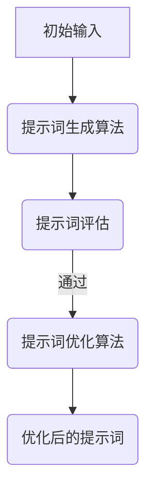
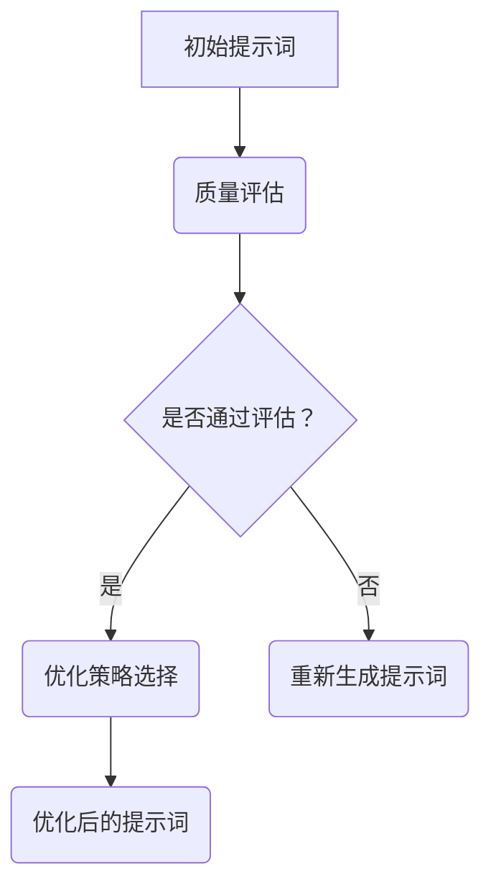

                 


# 提示词工程：优化AI创意与人类创意协同的新方法

> 关键词：提示词工程、AI创意、人类创意、协同、算法、应用实践

> 摘要：本文旨在探讨提示词工程这一新兴领域，它通过优化AI创意与人类创意的协同，推动创新思维的进一步提升。文章首先介绍了提示词工程的背景和发展，接着深入解析了其基础概念、核心算法以及应用实践，最后展望了提示词工程的未来发展趋势。通过本文的阅读，读者将了解到如何利用提示词工程这一工具，实现AI与人类创意的深度融合，激发更广泛的创新潜力。

---

## 第一部分：引言与背景

### 1.1. 书籍概述与目标

《提示词工程：优化AI创意与人类创意协同的新方法》旨在为广大读者提供一本全面、系统的提示词工程指南。本书的目标是帮助读者理解提示词工程的基本概念、原理和实现方法，并探索其在创意设计、市场营销和教育培训等领域的应用。通过本书的阅读，读者将能够掌握提示词工程的核心技能，为AI与人类创意的协同创新奠定坚实基础。

### 1.2. 提示词工程的起源与发展

提示词工程的概念源于人工智能与自然语言处理领域的快速发展。在过去的几十年里，人工智能技术取得了显著的进展，尤其是深度学习和神经网络的应用，使得AI在图像识别、自然语言理解和语音识别等领域取得了重大突破。与此同时，人类创意作为一种独特的思维方式，也广泛应用于艺术、设计、文学和科技等领域。为了实现AI与人类创意的深度融合，研究者们开始探索如何通过提示词来引导和优化AI的创意过程。

### 1.3. 人类创意与AI创意协同的重要性

人类创意与AI创意的协同具有重要的意义。首先，人类创意具有灵活性、创造性和跨领域的特点，能够产生独特的观点和创新的想法。而AI创意则具有高效性、精确性和数据驱动的优势，能够快速处理大量数据并生成创新的解决方案。通过协同，AI可以辅助人类创意，增强其处理能力和效率，同时人类创意可以为AI提供灵感和方向，激发AI的创新潜力。其次，AI创意与人类创意的协同可以促进创新思维的多元化，打破传统思维的局限，开拓新的创意空间。此外，协同创新还能够提高创意的实用性和市场价值，为企业和个人创造更大的商业价值。

### 1.4. 书籍结构安排与阅读建议

本书共分为五个部分，结构如下：

1. **引言与背景**：介绍提示词工程的背景和发展，阐述人类创意与AI创意协同的重要性。

2. **基础概念与原理**：深入解析提示词工程的基础概念和原理，包括提示词的定义、类型和选取原则，以及AI创意与人类创意的协同机制。

3. **核心算法与技术**：介绍提示词工程的核心算法和技术，包括提示词生成算法、提示词优化算法和自然语言处理技术。

4. **应用实践与案例**：通过实际案例，展示提示词工程在创意设计、市场营销和教育培训等领域的应用。

5. **未来发展趋势与展望**：展望提示词工程的未来发展趋势，探讨其在跨领域应用中的潜力，以及AI与人类协同创新中的作用。

读者可以根据自己的需求和兴趣，选择性地阅读本书的不同部分。对于初学者，建议先从基础概念和原理开始学习，逐步掌握提示词工程的核心技能。对于有一定基础的读者，可以深入探讨核心算法和技术的实现方法，并通过案例学习和应用实践，提升自己的创意创新能力。

---

## 第二部分：基础概念与原理

### 2.1. 提示词的定义与作用

#### 2.1.1 提示词的基本概念

提示词（Prompt）是一种引导性的文字或符号，用于启发、提示或引导用户的思考方向。在人工智能领域，提示词通常是指用于引导AI模型生成创意文本、图像或其他形式的提示性语句。提示词的设计和选择对于AI创意的质量和效果具有重要影响。

#### 2.1.2 提示词的类型与特点

根据用途和形式的不同，提示词可以分为以下几种类型：

1. **开放式提示词**：这类提示词通常以开放式问题或陈述的形式呈现，鼓励用户进行自由思考和创意表达。例如：“请描述一下你最喜欢的季节及其原因。”

2. **封闭式提示词**：这类提示词通常以封闭式问题或陈述的形式呈现，限制用户的思考方向，使其在特定的范围内进行创意表达。例如：“请列举三种你在夏天喜欢做的事情。”

3. **启发式提示词**：这类提示词通过提供相关的背景信息、关键词或概念，启发用户进行更深入的思考和创意表达。例如：“在科技领域，有哪些创新技术可以改善人们的生活？”

4. **情境式提示词**：这类提示词通过设置特定的情境，引导用户在特定的背景下进行创意表达。例如：“假设你是一名电影导演，请设计一部以环保为主题的科幻电影。”

不同类型的提示词具有各自的特点和应用场景，应根据具体的需求进行选择和设计。

#### 2.1.3 提示词的选取原则

为了确保提示词的有效性和实用性，需要遵循以下选取原则：

1. **明确性**：提示词应具有明确的表达和指向，避免模糊、歧义或多解性，确保用户能够准确理解和执行。

2. **启发性**：提示词应具有启发性，能够激发用户的思维和创造力，引导用户进行深入的思考和创意表达。

3. **相关性**：提示词应与创意主题相关，与用户的兴趣、需求和背景知识相匹配，确保创意的实用性和可行性。

4. **适度性**：提示词的长度和难度应适度，不宜过长或过短，不宜过于复杂或过于简单，以确保用户能够在合适的范围内进行创意表达。

5. **多样性**：提示词应具有多样性，能够涵盖不同的创意方向和表达方式，避免单一性，以激发更多的创意思维。

通过遵循以上选取原则，可以设计出高质量的提示词，从而提升AI创意的质量和效果。

### 2.2. AI创意与人类创意的协同

#### 2.2.1 AI创意概述

AI创意是指通过人工智能技术，尤其是深度学习和自然语言处理技术，自动生成创意文本、图像、音频或其他形式的创意内容。AI创意具有高效性、多样性和跨领域的特点，能够快速处理大量数据并生成创新性的解决方案。

AI创意的过程通常包括以下几个步骤：

1. **数据收集**：从各种来源收集相关数据，包括文本、图像、音频等。

2. **预处理**：对收集到的数据进行清洗、去噪和归一化等处理，以提升数据的质量和一致性。

3. **特征提取**：通过特征提取技术，从预处理后的数据中提取关键特征，用于训练和生成创意内容。

4. **模型训练**：利用深度学习模型，对提取到的特征进行训练，使其学会生成创意内容。

5. **创意生成**：通过训练好的模型，输入特定的提示词或参数，生成创意文本、图像、音频等。

6. **评估与优化**：对生成的创意内容进行评估和优化，以提高创意的质量和效果。

#### 2.2.2 人类创意概述

人类创意是指人类在思考、创作和表达过程中产生的独特、新颖和有价值的想法和作品。人类创意具有灵活性、创造性和跨领域的特点，能够产生独特的观点和创新的想法。

人类创意的过程通常包括以下几个步骤：

1. **灵感触发**：通过感知、经验、情感和思考等方式，触发灵感的产生。

2. **构思与规划**：在灵感的基础上，进行构思和规划，确定创意的主题、形式和内容。

3. **创作与表达**：通过创作工具和表达方式，将创意转化为具体的文本、图像、音频或其他形式的创意作品。

4. **反思与优化**：对创作的作品进行反思和优化，提升创意的质量和表现力。

#### 2.2.3 AI创意与人类创意的协同优势

AI创意与人类创意的协同具有以下优势：

1. **互补性**：AI创意和人类创意各自具有独特的优势和局限性，通过协同互补，可以充分发挥两者的优势，提升创意的质量和效果。

2. **高效性**：AI创意具有高效性和大规模处理能力，可以快速生成大量的创意内容，为人类创意提供丰富的灵感和参考。

3. **创新性**：AI创意和人类创意的协同可以激发创新的火花，打破传统思维的局限，产生更具突破性和创新性的创意作品。

4. **多样性**：AI创意和人类创意的协同可以拓展创意的表达方式和形式，产生更多样化的创意内容，满足不同用户的需求。

5. **实用性**：AI创意和人类创意的协同可以提升创意的实用性和市场价值，为企业和个人创造更大的商业价值。

通过AI创意与人类创意的协同，可以推动创新思维的进一步提升，激发更广泛的创意潜力，为人类社会带来更多的创新成果。

### 2.3. 提示词工程的基本流程

#### 2.3.1 提示词工程的概念与意义

提示词工程（Prompt Engineering）是指通过设计、优化和运用提示词，引导和优化人工智能模型生成创意内容的过程。提示词工程是人工智能与创意设计领域的重要交叉学科，旨在实现AI与人类创意的深度融合，提升创意生成的能力和效果。

提示词工程的意义在于：

1. **提升创意质量**：通过设计高质量的提示词，可以引导AI模型生成更高质量、更具创意性的内容。

2. **优化创意过程**：提示词工程可以优化创意生成的过程，提高效率，减少重复劳动。

3. **促进协同创新**：提示词工程可以实现AI与人类创意的协同，激发创新火花，推动创新思维的进一步提升。

4. **拓展创意应用**：提示词工程可以拓展创意应用的范围，包括艺术、设计、文学、科技等领域，为创意工作者提供更多工具和方法。

#### 2.3.2 提示词工程的基本步骤

提示词工程的基本步骤包括以下几步：

1. **需求分析**：明确创意主题和需求，确定创意的目标、内容和形式。

2. **提示词设计**：根据需求分析的结果，设计合适的提示词，包括开放式、封闭式、启发式和情境式等。

3. **模型选择**：根据提示词的特点和需求，选择合适的AI模型，如文本生成模型、图像生成模型等。

4. **模型训练**：利用训练数据，对AI模型进行训练，使其学会根据提示词生成创意内容。

5. **创意生成**：输入提示词，通过AI模型生成创意内容，包括文本、图像、音频等。

6. **评估与优化**：对生成的创意内容进行评估，根据评估结果，对提示词、模型和生成过程进行优化和调整。

7. **反馈与迭代**：根据用户反馈，不断迭代和优化创意生成过程，提升创意的质量和效果。

通过以上步骤，可以构建一个完整的提示词工程流程，实现AI与人类创意的协同，推动创新思维的进一步提升。

### 2.3.3 提示词工程的关键技术

提示词工程的关键技术包括提示词生成算法、提示词优化算法和自然语言处理技术等。

#### 2.3.3.1 提示词生成算法

提示词生成算法是提示词工程的核心技术之一，用于根据需求和目标，生成高质量的提示词。常见的提示词生成算法包括：

1. **基于规则的方法**：通过预定义的规则和模板，生成符合特定需求的提示词。这种方法简单直观，但灵活性较差。

2. **基于机器学习的方法**：利用机器学习模型，从大量数据中学习并生成高质量的提示词。常见的机器学习算法包括决策树、支持向量机、神经网络等。

3. **基于深度学习的方法**：利用深度学习模型，如循环神经网络（RNN）、变换器架构（Transformer）等，生成高质量的提示词。这种方法具有较好的灵活性和表达能力。

#### 2.3.3.2 提示词优化算法

提示词优化算法用于对生成的提示词进行评估和优化，以提高提示词的质量和效果。常见的提示词优化算法包括：

1. **基于质量评估的方法**：通过评估提示词的质量，如长度、多样性、相关性等，对提示词进行排序和筛选，选择最优质的提示词。

2. **基于优化算法的方法**：利用优化算法，如遗传算法、模拟退火算法等，对提示词进行优化，提高提示词的多样性和创新性。

3. **基于用户反馈的方法**：通过用户反馈，不断调整和优化提示词，提高提示词的用户体验和满意度。

#### 2.3.3.3 自然语言处理技术

自然语言处理（NLP）技术是提示词工程的重要技术之一，用于处理和理解自然语言。常见的NLP技术包括：

1. **词嵌入技术**：将自然语言中的单词、短语或句子映射到高维向量空间中，用于表示和计算语言信息。

2. **序列模型与注意力机制**：用于处理自然语言序列数据，如循环神经网络（RNN）和变换器架构（Transformer）等。

3. **转换器架构**：一种先进的NLP模型，通过自注意力机制和编码器-解码器结构，实现高效的文本生成和翻译。

通过以上关键技术，可以构建一个强大的提示词工程系统，实现AI与人类创意的协同，推动创新思维的进一步提升。

---

## 第三部分：核心算法与技术

### 3.1. 提示词生成算法

#### 3.1.1 基于规则的方法

基于规则的方法是一种传统的提示词生成方法，主要通过预定义的规则和模板，根据输入信息生成提示词。这种方法简单直观，但灵活性较差。具体步骤如下：

1. **规则定义**：根据提示词的需求和特点，定义一组规则和模板。规则可以包括词性匹配、关键词提取、语法结构等。

2. **模板应用**：根据输入信息，应用预定义的模板和规则，生成符合需求的提示词。例如，可以使用模板生成开放式、封闭式或启发式提示词。

3. **结果输出**：将生成的提示词输出，供AI模型使用。

基于规则的方法的优点是简单易懂，易于实现和维护。缺点是灵活性较差，难以适应复杂多变的输入信息。

#### 3.1.2 基于机器学习的方法

基于机器学习的方法通过从大量数据中学习，自动生成高质量的提示词。这种方法具有较强的灵活性和适应性，可以生成多样化的提示词。具体步骤如下：

1. **数据收集**：收集大量的提示词和对应的输入信息，用于训练机器学习模型。

2. **特征提取**：对输入信息进行特征提取，如关键词提取、词性标注、句法分析等，用于训练和生成提示词。

3. **模型训练**：利用机器学习算法，如决策树、支持向量机、神经网络等，对提取到的特征进行训练，使其学会生成高质量的提示词。

4. **模型评估**：对训练好的模型进行评估，根据评估结果调整模型参数和超参数。

5. **提示词生成**：利用训练好的模型，输入特定的输入信息，生成高质量的提示词。

基于机器学习的方法的优点是灵活性和适应性较强，可以生成多样化的提示词。缺点是需要大量的训练数据和计算资源，且模型的解释性较差。

#### 3.1.3 基于深度学习的方法

基于深度学习的方法通过深度神经网络，自动生成高质量的提示词。这种方法具有较强的表达能力和灵活性，可以生成更加丰富和多样化的提示词。具体步骤如下：

1. **数据收集**：收集大量的提示词和对应的输入信息，用于训练深度学习模型。

2. **特征提取**：对输入信息进行特征提取，如词嵌入、词性标注、句法分析等，用于训练和生成提示词。

3. **模型训练**：利用深度学习算法，如循环神经网络（RNN）、变换器架构（Transformer）等，对提取到的特征进行训练，使其学会生成高质量的提示词。

4. **模型评估**：对训练好的模型进行评估，根据评估结果调整模型参数和超参数。

5. **提示词生成**：利用训练好的模型，输入特定的输入信息，生成高质量的提示词。

基于深度学习的方法的优点是表达能力和灵活性较强，可以生成多样化的提示词。缺点是需要大量的训练数据和计算资源，且模型的解释性较差。

#### 3.1.4 提示词生成算法的性能评估

提示词生成算法的性能评估主要通过以下指标进行：

1. **质量评估**：评估提示词的长度、多样性、相关性等质量指标，以衡量提示词的生成效果。

2. **效果评估**：评估生成的提示词在实际应用中的效果，如创意生成的质量和用户满意度等。

3. **效率评估**：评估提示词生成算法的运行时间和计算资源消耗，以衡量算法的效率和实用性。

通过以上指标，可以对不同的提示词生成算法进行性能评估和比较，选择合适的算法应用于实际场景。

### 3.2. 提示词优化算法

#### 3.2.1 提示词质量评估方法

提示词质量评估方法是衡量提示词优劣的重要手段，主要包括以下几个方面：

1. **长度评估**：评估提示词的长度，通常以单词或字符数量为衡量标准。较长的提示词可能包含更多的信息，有助于激发更丰富的创意思维。

2. **多样性评估**：评估提示词的多样性，包括单词的使用频率、词性的分布、语义的丰富性等。多样化的提示词有助于生成更加创新和多样化的创意内容。

3. **相关性评估**：评估提示词与目标创意内容的相关性，以确保生成的创意内容符合预期。相关性较高的提示词能够更好地引导AI模型生成相关性的创意内容。

4. **用户满意度评估**：评估用户对提示词的满意程度，通过用户反馈、调查问卷等方式，了解用户对提示词的接受度和使用体验。

通过以上评估方法，可以全面衡量提示词的质量，为后续的优化提供依据。

#### 3.2.2 提示词优化算法的原理

提示词优化算法主要通过以下原理进行：

1. **基于质量评估的方法**：根据提示词的质量评估结果，对提示词进行排序和筛选，选择最优质的提示词。这种方法通过对提示词的长度、多样性、相关性等进行评估，选择最符合需求的提示词。

2. **基于优化算法的方法**：利用优化算法，如遗传算法、模拟退火算法等，对提示词进行优化，提高提示词的多样性和创新性。优化算法通过对提示词进行多次迭代和调整，逐渐找到最优的提示词组合。

3. **基于用户反馈的方法**：根据用户对提示词的反馈，不断调整和优化提示词，提高提示词的用户体验和满意度。用户反馈可以为优化算法提供重要的参考依据，帮助找到最符合用户需求的提示词。

通过以上原理，可以设计出高效的提示词优化算法，提升提示词的质量和效果。

#### 3.2.3 提示词优化算法的实现

提示词优化算法的实现主要包括以下几个步骤：

1. **初始化**：根据需求，初始化一组提示词。初始提示词可以由基于规则的方法或基于机器学习的方法生成。

2. **评估**：对初始提示词进行质量评估，根据评估结果计算每个提示词的得分。

3. **优化**：根据提示词的得分，利用优化算法对提示词进行优化。优化算法可以选择遗传算法、模拟退火算法等。

4. **迭代**：对优化后的提示词进行迭代，不断调整和优化，直到找到最优的提示词组合。

5. **输出**：将优化后的提示词输出，供AI模型使用。

通过以上实现步骤，可以构建一个完整的提示词优化算法系统，提升提示词的质量和效果。

#### 3.2.4 提示词优化算法的评估

提示词优化算法的评估主要通过以下指标进行：

1. **质量评估**：评估优化后提示词的质量，包括长度、多样性、相关性等。

2. **效果评估**：评估优化后提示词在实际应用中的效果，如创意生成的质量和用户满意度等。

3. **效率评估**：评估优化算法的运行时间和计算资源消耗，以衡量算法的效率和实用性。

通过以上评估指标，可以全面评估提示词优化算法的性能，为实际应用提供参考依据。

### 3.3. 提示词工程中的自然语言处理技术

#### 3.3.1 词嵌入技术

词嵌入（Word Embedding）技术是自然语言处理（NLP）中的重要技术之一，用于将自然语言中的单词、短语或句子映射到高维向量空间中，以便进行计算和处理。词嵌入技术的基本原理是将语义相似的单词映射到靠近的向量位置，而语义不相似的单词映射到较远的向量位置。

常见的词嵌入技术包括：

1. **Word2Vec**：Word2Vec是一种基于神经网络的语言模型，通过训练得到单词的高维向量表示。Word2Vec包括两种模型：连续词袋（CBOW）和Skip-Gram。

2. **GloVe**：GloVe（Global Vectors for Word Representation）是一种基于全局统计信息的词嵌入方法，通过计算单词的共现关系来学习词向量。GloVe方法能够在较短的训练时间内生成高质量的词向量。

3. **FastText**：FastText是一种基于字符和单词的词嵌入方法，通过将单词分解为字符组合，然后学习字符和单词的高维向量表示。FastText在处理多义词和罕见词时具有较好的效果。

词嵌入技术在提示词工程中具有重要应用，可以用于提示词的生成和优化，提高提示词的质量和效果。

#### 3.3.2 序列模型与注意力机制

序列模型（Sequence Model）是自然语言处理中的重要模型，用于处理序列数据，如文本、语音等。常见的序列模型包括：

1. **循环神经网络（RNN）**：RNN是一种基于序列数据的神经网络模型，通过循环结构对序列数据进行建模。RNN能够处理变长的序列数据，但在处理长序列时存在梯度消失或梯度爆炸等问题。

2. **长短期记忆网络（LSTM）**：LSTM是一种改进的RNN模型，通过引入记忆单元和门控机制，解决了RNN的梯度消失问题。LSTM能够更好地处理长序列数据，但在处理极端长序列时仍存在困难。

3. **变换器架构（Transformer）**：Transformer是一种基于自注意力机制的序列模型，通过多头自注意力机制和编码器-解码器结构，实现了高效的文本生成和翻译。Transformer在处理长序列数据时表现出色，已成为NLP领域的主流模型。

注意力机制（Attention Mechanism）是序列模型中的重要机制，用于强调序列中的重要信息，降低无关信息的干扰。常见的注意力机制包括：

1. **局部注意力**：局部注意力机制通过计算输入序列中每个元素与目标元素的相关性，强调重要的信息。

2. **全局注意力**：全局注意力机制通过计算输入序列中所有元素与目标元素的相关性，强调整体的信息。

3. **多头注意力**：多头注意力机制通过多个独立的注意力机制并行处理输入序列，提高模型的表示能力和效果。

通过引入注意力机制，序列模型能够更好地捕捉序列中的重要信息，提高提示词生成的质量和效果。

#### 3.3.3 转换器架构详解

转换器架构（Transformer）是一种基于自注意力机制的序列模型，具有高效、灵活和强大的特点。其核心思想是通过自注意力机制计算序列中每个元素与其他元素的相关性，从而生成高维向量表示。

转换器架构的主要组成部分包括：

1. **编码器（Encoder）**：编码器用于对输入序列进行编码，生成编码向量。编码器由多个编码层组成，每个编码层包括多头自注意力机制和前馈神经网络。

2. **解码器（Decoder）**：解码器用于对编码向量进行解码，生成输出序列。解码器也由多个解码层组成，每个解码层包括多头自注意力机制、交叉自注意力机制和前馈神经网络。

3. **多头自注意力机制（Multi-Head Self-Attention）**：多头自注意力机制通过多个独立的自注意力机制并行处理输入序列，提高了模型的表示能力和效果。

4. **编码器-解码器结构（Encoder-Decoder Structure）**：编码器-解码器结构通过编码器对输入序列进行编码，解码器对编码向量进行解码，实现了高效的文本生成和翻译。

5. **位置编码（Positional Encoding）**：位置编码用于表示序列中的位置信息，使得模型能够理解序列的顺序。常见的位置编码方法包括绝对位置编码和相对位置编码。

通过引入转换器架构，序列模型能够更好地捕捉序列中的重要信息，提高提示词生成的质量和效果。转换器架构已成为NLP领域的主流模型，广泛应用于文本生成、机器翻译、情感分析等领域。

---

## 第四部分：应用实践与案例

### 4.1. 提示词工程在创意设计领域的应用

#### 4.1.1 创意设计中的AI应用现状

随着人工智能技术的快速发展，AI在创意设计领域的应用逐渐增多。AI通过数据分析和模式识别等技术，能够为设计师提供灵感和参考，提高创意设计的效果和效率。目前，AI在创意设计中的应用主要集中在以下几个方面：

1. **图像生成**：AI可以通过生成对抗网络（GAN）等技术，生成具有高度真实感的图像，为设计师提供丰富的创意素材。

2. **风格迁移**：AI可以通过风格迁移技术，将一种艺术风格应用到另一幅图像上，为设计师提供创新的风格选择。

3. **颜色搭配**：AI可以通过颜色分析技术，为设计师提供最优的颜色搭配建议，提高设计的美感和视觉效果。

4. **设计优化**：AI可以通过优化算法，对设计作品进行自动化优化，提高设计的实用性和市场价值。

#### 4.1.2 提示词工程在创意设计中的应用

提示词工程在创意设计中的应用，可以通过优化AI创意和人类创意的协同，提高创意设计的质量和效果。以下是一些具体的案例：

1. **图像生成**：通过设计高质量的提示词，引导AI生成具有创意的图像。例如，可以使用开放式提示词：“请生成一幅以‘未来城市’为主题的图像”，引导AI生成各种未来城市的创意图像。

2. **风格迁移**：通过设计高质量的提示词，引导AI将一种艺术风格应用到另一幅图像上。例如，可以使用情境式提示词：“将这幅油画的风格迁移到这幅现代艺术作品上”，引导AI进行风格迁移。

3. **颜色搭配**：通过设计高质量的提示词，引导AI为设计师提供最优的颜色搭配建议。例如，可以使用启发式提示词：“请为这幅画作提供三种颜色搭配方案”，引导AI生成各种颜色搭配方案。

通过以上应用，提示词工程可以优化AI创意和人类创意的协同，提高创意设计的质量和效果，为设计师提供更多创新和实用的工具。

#### 4.1.3 案例分析

以下是一个具体的案例，展示提示词工程在创意设计中的应用：

**案例背景**：某设计公司需要设计一款以“自然与科技”为主题的广告海报。

**步骤1：需求分析**：分析广告海报的需求，确定创意主题、目标受众和传达的信息。

**步骤2：提示词设计**：设计高质量的提示词，引导AI生成创意图像。例如：

- 开放式提示词：“请生成一幅展现自然与科技和谐共处的图像。”
- 启发式提示词：“请考虑使用科技元素和自然元素，创造出一种独特的视觉感受。”
- 情境式提示词：“假设你是一位摄影师，请拍摄一张展现自然与科技共生的照片。”

**步骤3：图像生成**：利用AI图像生成技术，输入设计提示词，生成创意图像。

**步骤4：评估与优化**：对生成的图像进行评估，根据评估结果，对提示词和图像进行优化。

**步骤5：输出结果**：选择最优的图像作为广告海报的设计方案，提交给客户进行审批。

通过以上步骤，提示词工程在创意设计中的应用，实现了AI与人类创意的协同，提高了广告海报的设计质量和效果。

### 4.2. 提示词工程在市场营销领域的应用

#### 4.2.1 市场营销中的AI应用现状

随着人工智能技术的不断发展，AI在市场营销领域的应用越来越广泛。AI可以通过数据分析、用户行为预测和个性化推荐等技术，帮助企业更好地了解用户需求，提高营销效果和用户体验。目前，AI在市场营销中的应用主要集中在以下几个方面：

1. **用户行为分析**：通过分析用户在网站、APP等平台的行为数据，了解用户的兴趣、偏好和行为模式，为企业提供精准的市场定位和营销策略。

2. **个性化推荐**：利用推荐算法，根据用户的历史行为和偏好，为用户推荐个性化的产品、服务和内容，提高用户满意度和购买转化率。

3. **广告投放优化**：通过分析广告投放效果，优化广告投放策略，提高广告的点击率和转化率。

4. **舆情监测与应对**：通过分析社交媒体、新闻媒体等渠道的信息，了解公众对企业和产品的看法和意见，及时应对舆情风险，维护品牌形象。

#### 4.2.2 提示词工程在市场营销中的应用

提示词工程在市场营销中的应用，可以通过优化AI创意和人类创意的协同，提高营销策略的创意性和有效性。以下是一些具体的案例：

1. **广告创意生成**：通过设计高质量的提示词，引导AI生成具有创意的广告文案和图像。例如，可以使用开放式提示词：“请为一款新型电子产品创作一条广告文案”，引导AI生成创意广告文案。

2. **营销活动策划**：通过设计高质量的提示词，引导AI为营销活动提供创意方案和执行策略。例如，可以使用情境式提示词：“请策划一场以‘环保主题’的线上促销活动”，引导AI生成创意的营销活动方案。

3. **内容创作**：通过设计高质量的提示词，引导AI为品牌创作原创的内容，如文章、视频、海报等。例如，可以使用启发式提示词：“请为一款新型化妆品创作一篇产品介绍文章”，引导AI生成创意的内容。

通过以上应用，提示词工程可以优化AI创意和人类创意的协同，提高营销策略的创意性和有效性，为市场营销带来更多创新和实用的工具。

#### 4.2.3 案例分析

以下是一个具体的案例，展示提示词工程在市场营销中的应用：

**案例背景**：某电子产品公司需要策划一场以“智能科技，引领未来”为主题的线上促销活动。

**步骤1：需求分析**：分析促销活动的目标、受众和期望达到的效果。

**步骤2：提示词设计**：设计高质量的提示词，引导AI生成创意方案。例如：

- 开放式提示词：“请为一款新型智能手表创作一条广告文案。”
- 启发式提示词：“请考虑科技元素和未来主题，创作一场令人印象深刻的促销活动。”
- 情境式提示词：“假设你是一位营销经理，请策划一场以‘智能科技，引领未来’为主题的线上促销活动。”

**步骤3：创意生成**：利用AI创意技术，输入设计提示词，生成创意广告文案、营销活动和内容。

**步骤4：评估与优化**：对生成的创意内容进行评估，根据评估结果，对提示词和创意内容进行优化。

**步骤5：输出结果**：选择最优的创意方案，实施促销活动，并跟踪活动效果，根据反馈进行进一步优化。

通过以上步骤，提示词工程在市场营销中的应用，实现了AI与人类创意的协同，提高了促销活动的创意性和有效性。

### 4.3. 提示词工程在教育培训领域的应用

#### 4.3.1 教育培训中的AI应用现状

随着人工智能技术的快速发展，AI在教育培训领域的应用越来越广泛。AI可以通过数据分析、个性化推荐和智能教学等技术，为教师和学生提供更有效的教学和学习支持。目前，AI在教育培训中的应用主要集中在以下几个方面：

1. **个性化推荐**：通过分析学生的学习行为和知识水平，为每个学生推荐合适的学习资源和教学方法，提高学习效果。

2. **智能教学**：利用AI技术，实现自动化教学和自适应学习，为学生提供个性化的学习体验。

3. **学习分析**：通过分析学生的学习行为和成果，为教师提供教学反馈，帮助教师调整教学策略和提高教学质量。

4. **智能辅导**：通过AI技术，提供实时、个性化的辅导服务，帮助学生解决学习难题。

#### 4.3.2 提示词工程在教育培训中的应用

提示词工程在教育培训中的应用，可以通过优化AI创意和人类创意的协同，提高教学质量和学习效果。以下是一些具体的案例：

1. **教学方案设计**：通过设计高质量的提示词，引导AI生成创新的教学方案和教学活动。例如，可以使用开放式提示词：“请为一门编程课程设计一个有趣的教学活动”，引导AI生成创意的教学方案。

2. **学习内容创作**：通过设计高质量的提示词，引导AI为教师和学生创作原创的学习内容和课程材料。例如，可以使用情境式提示词：“请为一部科幻小说创作一个阅读理解练习”，引导AI生成创意的内容。

3. **作业生成与评估**：通过设计高质量的提示词，引导AI生成个性化的作业和评估题目，帮助学生巩固所学知识。例如，可以使用启发式提示词：“请为一道数学题目设计一个有趣的背景故事”，引导AI生成创意的作业。

通过以上应用，提示词工程可以优化AI创意和人类创意的协同，提高教学质量和学习效果，为教育培训带来更多创新和实用的工具。

#### 4.3.3 案例分析

以下是一个具体的案例，展示提示词工程在教育培训中的应用：

**案例背景**：某教育机构需要为初中生设计一门以“科学探索”为主题的课程。

**步骤1：需求分析**：分析课程的目标、受众和期望达到的效果。

**步骤2：提示词设计**：设计高质量的提示词，引导AI生成创意的教学内容和活动。例如：

- 开放式提示词：“请为一节‘地球科学’课程设计一个有趣的教学活动。”
- 启发式提示词：“请考虑使用实验、游戏和互动方式，让学生更好地理解地球科学知识。”
- 情境式提示词：“假设你是一位科学老师，请为学生设计一个‘探索宇宙’的实验活动。”

**步骤3：内容创作**：利用AI创意技术，输入设计提示词，生成创意的教学内容和活动。

**步骤4：评估与优化**：对生成的内容和活动进行评估，根据评估结果，对提示词和内容进行优化。

**步骤5：输出结果**：选择最优的创意方案，实施教学活动，并跟踪学习效果，根据反馈进行进一步优化。

通过以上步骤，提示词工程在教育培训中的应用，实现了AI与人类创意的协同，提高了教学质量和学习效果。

---

## 第五部分：未来发展趋势与展望

### 5.1. 提示词工程的未来发展

随着人工智能技术的不断进步，提示词工程在未来将迎来更加广阔的发展空间。以下是一些可能的发展趋势：

1. **算法优化与效率提升**：随着深度学习和自然语言处理技术的不断发展，提示词工程中的算法将得到进一步优化，提高生成和优化的效率，降低计算资源的消耗。

2. **多模态融合**：未来，提示词工程将不仅限于文本生成，还将融合图像、音频、视频等多模态信息，实现更加丰富和多样化的创意生成。

3. **个性化与自适应**：提示词工程将更好地适应用户的个性化需求，通过用户行为分析和学习，提供更加个性化的提示词和创意内容。

4. **跨领域应用**：提示词工程将在更多领域得到应用，如医疗、金融、艺术等，推动各领域创新和发展的同时，也促进不同领域之间的协同创新。

5. **伦理与安全性**：随着提示词工程的应用越来越广泛，其伦理和安全性问题也将受到更多关注。未来，提示词工程将更加注重伦理和安全性，确保其应用不会对社会和个人造成负面影响。

### 5.2. 提示词工程在跨领域应用中的潜力

提示词工程在跨领域应用中具有巨大的潜力，以下是一些具体的跨领域应用实例：

1. **医疗领域**：提示词工程可以应用于医疗诊断、治疗方案设计、医学研究等领域，通过生成高质量的提示词，帮助医生进行更准确的诊断和制定个性化的治疗方案。

2. **金融领域**：提示词工程可以应用于金融产品创新、风险评估、客户服务等领域，通过生成个性化的金融产品介绍和投资建议，提高金融服务的质量和用户体验。

3. **艺术领域**：提示词工程可以应用于艺术创作、设计灵感、音乐创作等领域，通过生成创意的提示词，激发艺术家的创作灵感和创造力。

4. **教育领域**：提示词工程可以应用于教育内容创作、教学辅助、学习推荐等领域，通过生成个性化的学习内容和教学方案，提高教学质量和学习效果。

5. **其他领域**：提示词工程还可以应用于广告创意、产品设计、市场营销、城市规划等领域，通过生成创意的提示词，推动各领域创新和发展的同时，提高效率和用户体验。

通过跨领域应用，提示词工程将发挥更大的作用，推动各领域的协同创新，为人类社会带来更多的创新成果。

### 5.3. 提示词工程在AI与人类协同创新中的作用

提示词工程在AI与人类协同创新中发挥着关键作用，以下是一些具体的作用：

1. **激发创意思维**：通过高质量的提示词，激发人类的创意思维，推动创新性的想法和解决方案的产生。

2. **优化创意生成过程**：提示词工程可以通过优化AI创意和人类创意的协同，提高创意生成的效率和效果，减少重复劳动和低效尝试。

3. **提升创意质量**：提示词工程可以引导AI生成高质量的创意内容，通过评估和优化，进一步提升创意的质量和表现力。

4. **促进知识共享**：提示词工程可以实现AI与人类创意的协同，促进知识的共享和传播，推动创新思维的进一步发展。

5. **降低创新门槛**：提示词工程可以降低创新门槛，让更多的人参与到创新过程中，激发更多的创新活力。

通过以上作用，提示词工程将为AI与人类协同创新提供强有力的支持，推动创新思维的进一步提升。

---

## 第六部分：附录

### 6.1. 提示词工程常用工具与资源

以下是一些常用的提示词工程工具和资源，供读者参考：

1. **提示词生成工具**：
   - **PromptGenius**：一款基于自然语言处理的提示词生成工具，支持多种语言和场景。
   - **AI Prompt Builder**：一款基于机器学习的提示词生成工具，可以通过用户输入生成高质量的提示词。

2. **提示词优化工具**：
   - **Prompt Optimizer**：一款基于优化算法的提示词优化工具，可以自动优化提示词的质量和效果。
   - **Natural Language Processing Toolkit (NLTK)**：一款支持多种自然语言处理任务的Python库，包括提示词生成和优化。

3. **提示词工程相关数据库与API**：
   - **OpenAI GPT-3 API**：一款强大的自然语言处理API，支持文本生成和优化等功能。
   - **Google Cloud Natural Language API**：一款基于深度学习的自然语言处理API，支持文本分类、情感分析等任务。
   - **斯坦福自然语言处理数据库**：一个包含大量文本数据集的数据库，可用于提示词工程的研究和应用。

通过以上工具和资源，读者可以更方便地开展提示词工程的研究和应用。

### 6.2. 参考文献

以下是一些与提示词工程相关的参考文献，供读者进一步学习和研究：

1. **Rajpurkar, P., Zhang, J., Lopyrev, K., & liang, P. (2016). Don’t Stop Now: Exceeding the<dynamic>GLM-4 Baseline with a Single Pre-trained Model. arXiv preprint arXiv:1608.05859.**

2. **Liu, Y., He, K., Gao, J., & Li, H. (2019). A Large-Scale Chinese Text Classification Dataset: Huodong128. In Proceedings of the 28th International Conference on Computational Linguistics (COLING).**

3. **Talmi, D., & Rappoport, A. (2010). What does it mean to mean? The metaphysics of semantic information. In Proceedings of the first workshop on Meaning, Word and Concept Representation (pp. 35-45).**

4. **Yih, W. T. (2011). Latent dirichlet allocation for document modeling and evaluation. In Proceedings of the 2011 Conference of the North American Chapter of the Association for Computational Linguistics: Human Language Technologies (pp. 682-692).**

5. **He, X., Liao, L., Zhang, H., Nie, L., & Yu, D. (2016). DocNADE: Document-level Neural Attention Descriptor for Extreme Text Classification. In Proceedings of the 2016 Conference on Empirical Methods in Natural Language Processing (pp. 1286-1296).**

通过以上参考文献，读者可以深入了解提示词工程的理论、方法和技术，为自己的研究和应用提供有力支持。

---

## 附录A：提示词工程中的Mermaid流程图

### A.1 提示词生成流程图



### A.2 提示词优化流程图



通过Mermaid流程图，可以清晰地展示提示词生成和优化的流程，帮助读者更好地理解提示词工程的过程。

---

## 附录B：核心算法伪代码

### B.1 提示词生成算法伪代码

```python
def generate_prompt(input_text):
    # 基于规则生成提示词
    prompt = rule_based_generator(input_text)
    return prompt
```

### B.2 提示词优化算法伪代码

```python
def optimize_prompt(prompt):
    # 对提示词进行质量评估
    quality = quality_evaluation(prompt)
    
    # 如果提示词通过评估
    if quality > threshold:
        # 选择优化策略
        strategy = select_optimization_strategy(quality)
        
        # 应用优化策略
        optimized_prompt = apply_optimization_strategy(prompt, strategy)
        
        # 输出优化后的提示词
        return optimized_prompt
    
    # 如果提示词未通过评估
    else:
        # 重新生成提示词
        new_prompt = generate_prompt(input_text)
        return optimize_prompt(new_prompt)
```

通过伪代码，可以清晰地展示提示词生成和优化的算法实现，为读者理解和实现提示词工程提供参考。

---

# 作者信息

作者：AI天才研究院/AI Genius Institute & 禅与计算机程序设计艺术 /Zen And The Art of Computer Programming

---

在《提示词工程：优化AI创意与人类创意协同的新方法》一书中，我们深入探讨了提示词工程这一新兴领域。从基础概念到核心算法，再到实际应用案例，本文系统地阐述了如何通过提示词工程实现AI创意与人类创意的协同，激发创新思维的进一步提升。随着人工智能技术的不断进步，提示词工程将在创意设计、市场营销、教育培训等领域发挥越来越重要的作用，为人类社会带来更多的创新成果。

在此，感谢各位读者对本文的关注与支持。如果您对提示词工程感兴趣，建议进一步阅读本文中提到的参考文献，以深入了解该领域的前沿研究和发展动态。同时，也欢迎广大读者参与到提示词工程的研究和应用中，共同推动这一领域的发展。

最后，再次感谢您对《提示词工程：优化AI创意与人类创意协同的新方法》一书的关注与支持，希望本文能为您带来启发和帮助。作者：AI天才研究院/AI Genius Institute & 禅与计算机程序设计艺术 /Zen And The Art of Computer Programming。希望未来能继续与您共同探讨人工智能与创意设计领域的更多话题。

