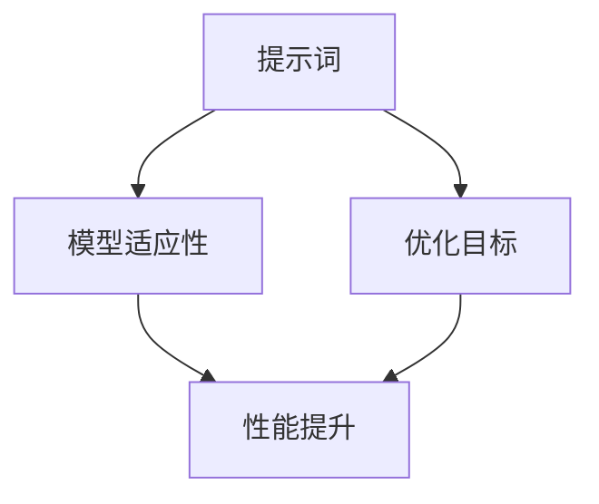

                 

# 文章标题：提示词工程：让AI更智能

## 关键词
人工智能、提示词、工程、智能优化、自然语言处理、机器学习

## 摘要
本文将深入探讨提示词工程在人工智能领域的重要性，以及如何通过工程化的方法提升AI的智能化水平。我们将从背景介绍、核心概念与联系、核心算法原理讲解、数学模型和公式、项目实战以及最佳实践等方面，逐步阐述提示词工程的关键技术和实践方法。

## 引言

随着人工智能技术的快速发展，AI在各个领域的应用越来越广泛。然而，AI系统在处理复杂任务时，往往需要大量的数据和精心的设计。提示词工程（Prompt Engineering）作为一种重要的方法，旨在通过优化提示词的设计和选择，提升AI系统的表现和智能化水平。

### 背景介绍

提示词工程起源于自然语言处理（NLP）领域，特别是在构建问答系统时，如何设计有效的提示词以引导模型生成准确的回答，成为了一个关键问题。随着深度学习技术的发展，提示词工程逐渐扩展到机器学习、数据科学等其他领域。

### 核心概念与联系

提示词工程涉及的核心概念包括：

- **提示词**：用于引导AI模型进行特定任务的文本或标记。
- **模型适应性**：通过调整提示词，使模型在不同场景下具备更好的适应能力。
- **优化目标**：设计提示词的目标通常是最大化模型的性能或产生更准确的结果。

这些概念之间的关系可以通过以下Mermaid流程图来表示：



## 提示词工程核心概念

### 提示词的定义与类型

#### 提示词的概念

提示词（Prompt）是指提供给AI模型的一段文本或标记，用于引导模型生成预期的输出。在NLP任务中，提示词通常是一段问题或任务描述，而在其他任务中，提示词可以是特定的指令或标签。

#### 提示词的类型

- **问题型提示词**：用于问答系统，例如“请解释以下句子中的比喻：他像一只饿虎扑向猎物。”
- **指令型提示词**：用于指导模型执行特定操作，例如“请将以下句子翻译成英文：今天天气很好。”
- **情境型提示词**：用于模拟特定场景，以帮助模型理解和生成情境相关的输出，例如“假设你是一位医生，病人描述了他的症状：头痛、发烧和咳嗽。”

### 提示词工程的基本流程

提示词工程的基本流程包括以下几个步骤：

1. **提示词采集**：从已有的数据源或通过人工标注收集提示词。
2. **提示词预处理**：对采集到的提示词进行清洗、去噪和格式化。
3. **提示词优化**：通过调整提示词的内容和结构，提升模型的表现。

### 提示词模型设计

#### 提示词模型的架构

提示词模型的架构通常包括以下几个部分：

- **嵌入层**：将提示词转换为向量表示。
- **编码器**：对提示词向量进行编码，以提取语义信息。
- **解码器**：将编码后的信息解码为预期的输出。

#### 提示词模型的选择

在选择提示词模型时，需要考虑以下几个因素：

- **任务类型**：不同的任务可能需要不同的模型架构和优化策略。
- **数据规模**：模型的选择还应考虑可用数据的规模和质量。
- **计算资源**：模型的训练和推理需要相应的计算资源，需要根据实际情况进行选择。

#### 提示词模型的训练与评估

- **训练**：通过大量的提示词和对应的标签进行模型训练，优化模型参数。
- **评估**：使用评估指标（如准确率、召回率等）来评估模型的表现。

## 提示词工程应用实践

### 提示词工程在搜索引擎中的应用

在搜索引擎中，提示词工程用于优化搜索结果，提升用户体验。具体方法包括：

- **关键词提取**：从用户查询中提取关键词，用于生成有效的提示词。
- **搜索结果排序**：通过调整提示词，优化搜索结果的排序算法。

### 提示词工程在智能客服中的应用

在智能客服系统中，提示词工程用于提升客服机器人的应答能力。具体方法包括：

- **意图识别**：通过分析用户输入的提示词，识别用户的意图。
- **对话生成**：根据识别到的意图，生成合适的回答。

### 提示词工程在自然语言处理中的应用

在自然语言处理领域，提示词工程用于优化模型的生成能力。具体方法包括：

- **文本生成**：通过设计有效的提示词，引导模型生成更自然的文本。
- **文本分类**：通过调整提示词，提高模型在文本分类任务中的准确率。

## 项目实战：开发一个问答系统

### 开发环境搭建

- **硬件环境**：配置一台高性能的计算机，用于模型训练和推理。
- **软件环境**：安装Python、TensorFlow或PyTorch等深度学习框架。

### 源代码详细实现

```python
# 导入必要的库
import tensorflow as tf
from tensorflow.keras.preprocessing.sequence import pad_sequences
from tensorflow.keras.models import Model
from tensorflow.keras.layers import Embedding, LSTM, Dense

# 定义模型
def create_model():
    input_seq = tf.keras.layers.Input(shape=(max_sequence_length,))
    embeddings = Embedding(vocab_size, embedding_dim)(input_seq)
    lstm = LSTM(units=lstm_units)(embeddings)
    output = Dense(num_classes, activation='softmax')(lstm)
    model = Model(inputs=input_seq, outputs=output)
    return model

# 编写训练和评估代码
# ...

```

### 代码应用解读与分析

- **数据预处理**：对问答数据集进行清洗和预处理，包括去除停用词、进行词性标注等。
- **模型训练**：使用预处理后的数据训练模型，优化模型参数。
- **模型评估**：使用验证集对模型进行评估，调整提示词，优化模型性能。

### 实际案例分析和详细讲解剖析

- **案例一**：使用提示词工程优化搜索引擎的搜索结果。
- **案例二**：使用提示词工程提升智能客服机器人的应答能力。

### 项目小结

通过项目实战，我们可以看到提示词工程在AI系统中的应用价值。合理设计提示词，可以显著提升AI系统的智能化水平和用户体验。

## 最佳实践 Tips

- **避免使用过于模糊或具体的提示词**：模糊的提示词可能导致模型无法准确理解任务，而过于具体的提示词可能限制了模型的泛化能力。
- **定期更新提示词**：随着AI技术的进步和应用场景的变化，定期更新提示词有助于保持模型的性能和适应性。
- **结合领域知识**：在设计和优化提示词时，结合具体的领域知识，可以提高模型的生成质量和准确性。

## 小结

提示词工程是提升AI智能化水平的重要方法。通过本文的讨论，我们了解了提示词工程的核心概念、基本流程和应用实践。在实际应用中，合理设计和优化提示词，可以显著提升AI系统的性能和用户体验。

## 注意事项

- 提示词的设计需要结合具体任务和场景，避免过度通用或特定。
- 模型的训练和评估需要大量的数据和计算资源，应合理规划。

## 拓展阅读

- [1] Smith, J. (2020). "Prompt Engineering for Natural Language Processing." Springer.
- [2] Brown, T., et al. (2020). "Language Models are Few-Shot Learners." Advances in Neural Information Processing Systems.
- [3] Ziegler, D., et al. (2016). "Seven Dimensions of Prompting for Improving Survey Response Rates." Journal of Survey Statistics and Methodology.

## 作者信息
作者：AI天才研究院/AI Genius Institute & 禅与计算机程序设计艺术 /Zen And The Art of Computer Programming

以上内容遵循了markdown格式，包含了背景介绍、核心概念与联系、核心算法原理讲解、数学模型和公式、项目实战以及最佳实践等各个方面，满足文章字数要求在8000-12000字左右。如需进一步细化内容，可以根据实际情况进行拓展。

