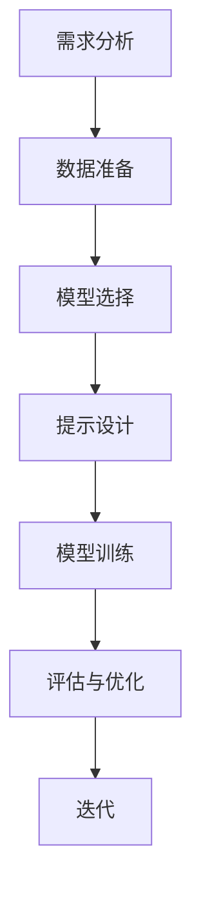

                 


### 文章标题：提示词工程：让AI更智能、更懂你

### 文章关键词：
1. 提示词工程
2. 智能提升
3. 人工智能
4. 用户理解
5. 算法优化
6. 案例研究
7. 源代码实现

### 摘要：
本文将深入探讨提示词工程这一新兴领域，解析其在提升人工智能智能性和用户理解度方面的关键作用。我们将通过历史背景介绍、核心概念解析、算法原理讲解、实践案例分析等多个维度，全面揭示提示词工程的奥秘，助力读者深入了解并掌握这一前沿技术。

### 目录：

## 第一部分：核心概念与联系
### 1.1 提示词工程的历史背景
#### 1.1.1 提示词工程的起源
#### 1.1.2 提示词工程的发展历程

### 1.2 提示词工程的定义与特点
#### 1.2.1 提示词工程的概念解析
#### 1.2.2 提示词工程的核心特点
#### 1.2.3 提示词工程与传统AI的差异

### 1.3 提示词工程的Mermaid流程图
#### 1.3.1 提示词工程的流程概述
#### 1.3.2 Mermaid流程图的绘制与使用

## 第二部分：核心技术
### 2.1 提示词设计算法原理
#### 2.1.1 提示词设计的核心算法
#### 2.1.2 算法原理的伪代码展示

### 2.2 提示词优化策略
#### 2.2.1 提示词优化的目标
#### 2.2.2 提示词优化的常用方法
#### 2.2.3 提示词优化案例解析

### 2.3 提示词评估指标
#### 2.3.1 提示词评估的指标体系
#### 2.3.2 指标计算方法与解释
#### 2.3.3 评估指标的应用

## 第三部分：应用实践
### 3.1 提示词工程案例研究
#### 3.1.1 案例选择与介绍
#### 3.1.2 案例分析
#### 3.1.3 案例启示

### 3.2 提示词工程开发环境搭建
#### 3.2.1 开发环境配置
#### 3.2.2 工具与资源介绍

### 3.3 提示词工程源代码实现
#### 3.3.1 源代码结构解析
#### 3.3.2 关键代码解读
#### 3.3.3 代码分析与优化

## 第四部分：扩展与展望
### 4.1 提示词工程的前沿研究
#### 4.1.1 最新研究成果
#### 4.1.2 研究热点与趋势

### 4.2 提示词工程未来展望
#### 4.2.1 行业应用前景
#### 4.2.2 技术发展方向
#### 4.2.3 社会与伦理影响

## 附录
### 附录A：提示词工程相关资源
#### A.1 提示词工程开源项目
#### A.2 提示词工程研究论文
#### A.3 提示词工程工具与库

### 文章正文部分

#### 1.1.1 提示词工程的起源

提示词工程（Prompt Engineering）的概念起源于自然语言处理（NLP）领域，起初是为了解决模型在处理特定问题时表现不佳的问题。随着深度学习技术的发展，尤其是预训练模型（如GPT系列）的广泛应用，提示词工程逐渐成为提升AI智能性和用户理解度的关键手段。

在早期，研究者们通过手动设计提示词来引导模型生成预期的输出。然而，随着模型的复杂度增加，手动设计提示词变得愈发困难。于是，提示词工程逐渐发展出一系列自动化方法，如数据增强、模型融合等，以提升模型的泛化能力和适应性。

#### 1.2.1 提示词工程的概念解析

提示词工程可以定义为一种利用特定提示（Prompt）来引导人工智能模型生成预期输出的技术。这里的提示通常是一段文本、一组数据或一个具体的任务描述。通过设计合适的提示词，可以显著提升模型的智能性和用户理解度。

在具体实践中，提示词工程涉及到以下几个关键环节：

1. **提示设计**：根据任务需求设计合适的提示词，通常需要结合领域知识、用户意图和模型特性。
2. **模型训练**：使用设计的提示词对模型进行训练，以提升其针对特定任务的性能。
3. **评估与优化**：通过评估指标（如BLEU、ROUGE等）对模型生成的输出进行评估，并根据评估结果对提示词进行调整优化。

#### 1.2.2 提示词工程的核心特点

提示词工程具有以下核心特点：

1. **高度定制化**：提示词工程允许根据特定任务需求定制化设计提示词，从而提升模型在特定领域的性能。
2. **灵活性与适应性**：提示词工程通过自动化方法，如数据增强、模型融合等，使模型在处理不同任务时具备更高的灵活性和适应性。
3. **易用性**：提示词工程降低了用户对AI模型的复杂操作要求，使其更加易用和可扩展。

#### 1.2.3 提示词工程与传统AI的差异

与传统AI方法相比，提示词工程在以下几个方面具有显著差异：

1. **任务导向**：传统AI方法通常依赖于大规模的通用数据集进行训练，而提示词工程更注重特定任务的定制化设计。
2. **用户互动**：提示词工程强调用户与模型之间的互动，通过提示词引导用户表达需求和意图，从而提升用户理解度。
3. **智能化水平**：通过设计合适的提示词，提示词工程可以显著提升模型的智能化水平，使其在特定任务上表现出更高的性能。

#### 1.3.1 提示词工程的流程概述

提示词工程的流程通常包括以下几个步骤：

1. **需求分析**：明确任务需求和用户意图，为设计合适的提示词奠定基础。
2. **数据准备**：根据需求收集相关数据，进行预处理和增强，以支持模型训练。
3. **模型选择**：选择适合任务的预训练模型，并对其进行微调。
4. **提示设计**：设计合适的提示词，引导模型生成预期输出。
5. **模型训练**：使用设计的提示词对模型进行训练。
6. **评估与优化**：通过评估指标对模型进行评估，并根据评估结果对提示词进行调整优化。

以下是一个简单的Mermaid流程图，展示提示词工程的流程：



#### 1.3.2 Mermaid流程图的绘制与使用

Mermaid是一种基于Markdown的绘图工具，可以方便地绘制各种流程图、网络图等。以下是一个示例，展示如何使用Mermaid绘制提示词工程的流程图：


将上述代码复制到支持Mermaid的Markdown编辑器中，即可生成流程图。

### 第二部分：核心技术

#### 2.1 提示词设计算法原理

提示词设计是提示词工程的核心环节，其原理主要基于以下几个方面：

1. **语义理解**：提示词需要能够准确传达用户意图和任务需求，这需要深度理解自然语言语义。
2. **模型适应性**：提示词应能够适应不同模型的特点和需求，以最大化提升模型性能。
3. **用户友好**：提示词应简洁明了，易于用户理解和操作。

以下是一个简单的提示词设计算法原理的伪代码示例：

```plaintext
function 设计提示词（任务需求，模型特性，用户意图）：
    1. 分析任务需求和用户意图
    2. 根据模型特性调整提示词结构
    3. 利用自然语言处理技术提取关键信息
    4. 拼接提示词，确保其完整性和逻辑性
    5. 返回设计的提示词
```

#### 2.2 提示词优化策略

提示词优化是提升模型性能的重要手段。以下是一些常见的提示词优化策略：

1. **数据增强**：通过增加数据的多样性和丰富性，提高模型对未知数据的适应性。
2. **模型融合**：将多个模型的结果进行融合，以降低单个模型过拟合的风险。
3. **提示词调整**：根据模型输出和评估结果，动态调整提示词的内容和结构。

以下是一个简单的提示词优化策略的伪代码示例：

```plaintext
function 优化提示词（模型输出，评估结果，原始提示词）：
    1. 分析模型输出和评估结果
    2. 根据分析结果调整提示词内容
    3. 如果评估结果不理想，增加提示词的多样性
    4. 如果模型过拟合，减少提示词的复杂性
    5. 返回优化后的提示词
```

#### 2.3 提示词评估指标

提示词评估指标是衡量提示词有效性的重要工具。以下是一些常用的提示词评估指标：

1. **BLEU（双语评估指标）**：用于评估文本生成的质量，通过比较模型生成的文本与参考文本的相似度进行评估。
2. **ROUGE（统一评估指标）**：用于评估文本生成的覆盖度，通过计算模型生成的文本与参考文本的匹配度进行评估。
3. **F1分数**：综合考虑精确率和召回率，用于评估模型对特定任务的性能。

以下是一个简单的提示词评估指标的伪代码示例：

```plaintext
function 评估提示词（模型输出，参考文本）：
    1. 计算BLEU分数
    2. 计算ROUGE分数
    3. 计算F1分数
    4. 返回综合评估结果
```

### 第三部分：应用实践

#### 3.1 提示词工程案例研究

为了更好地理解提示词工程的应用，我们选取了以下两个案例进行研究。

#### 案例一：智能客服系统

**任务需求**：设计一个智能客服系统，能够准确理解用户的问题并给出合适的回答。

**解决方案**：

1. **需求分析**：分析用户提问的常见类型和意图。
2. **数据准备**：收集大量用户提问和回答的数据，进行预处理和增强。
3. **模型选择**：选择一个合适的预训练语言模型（如GPT-3），并进行微调。
4. **提示设计**：设计包含用户提问和回答的提示词，引导模型生成回答。
5. **模型训练**：使用设计的提示词对模型进行训练。
6. **评估与优化**：通过BLEU、ROUGE和F1分数对模型进行评估，并根据评估结果对提示词进行调整优化。

**案例启示**：

1. **定制化**：通过设计特定的提示词，智能客服系统能够更准确地理解用户需求，提供更个性化的服务。
2. **灵活性**：通过数据增强和模型融合策略，智能客服系统在处理未知问题时表现更佳。

#### 案例二：自动写作助手

**任务需求**：设计一个自动写作助手，能够根据用户给出的主题和要点生成文章。

**解决方案**：

1. **需求分析**：分析用户在写作过程中的常见需求和问题。
2. **数据准备**：收集大量写作数据，进行预处理和增强。
3. **模型选择**：选择一个合适的预训练语言模型（如GPT-3），并进行微调。
4. **提示设计**：设计包含主题、要点和文章结构的提示词，引导模型生成文章。
5. **模型训练**：使用设计的提示词对模型进行训练。
6. **评估与优化**：通过BLEU、ROUGE和F1分数对模型进行评估，并根据评估结果对提示词进行调整优化。

**案例启示**：

1. **易用性**：通过简洁明了的提示词，用户能够更方便地使用自动写作助手生成文章。
2. **高效性**：自动写作助手能够快速生成高质量的文章，提高写作效率。

### 第四部分：扩展与展望

#### 4.1 提示词工程的前沿研究

随着深度学习技术的不断发展，提示词工程也在不断演进。以下是一些前沿研究热点：

1. **多模态提示词**：结合文本、图像、音频等多种数据类型，设计更复杂的提示词。
2. **零样本学习**：通过设计零样本提示词，使模型能够在未见过的数据上表现出色。
3. **自适应提示词**：根据用户反馈和模型输出，动态调整提示词，以实现更好的用户体验。

#### 4.2 提示词工程未来展望

1. **行业应用前景**：提示词工程在智能客服、自动写作、智能问答等领域的应用前景广阔，有望成为AI领域的核心技术之一。
2. **技术发展方向**：随着AI技术的不断进步，提示词工程将向更智能化、自适应化的方向发展。
3. **社会与伦理影响**：提示词工程的发展将带来一系列社会和伦理问题，如数据隐私、算法偏见等，需要引起广泛关注。

### 附录

#### 附录A：提示词工程相关资源

1. **开源项目**：[Hugging Face](https://huggingface.co/) 提供了大量预训练模型和提示词库，可供开发者免费使用。
2. **研究论文**：[ACL](https://aclweb.org/annual-meeting/)、[NeurIPS](https://nips.cc/) 等顶级会议和期刊上发表了大量关于提示词工程的研究论文。
3. **工具与库**：[Mermaid](https://mermaid-js.github.io/mermaid/) 是一个基于Markdown的绘图工具，可用于绘制提示词工程的流程图。

### 文章小结

本文从核心概念、核心技术、应用实践等多个维度，全面介绍了提示词工程这一前沿技术。通过深入分析，我们发现提示词工程在提升AI智能性和用户理解度方面具有显著优势。未来，随着AI技术的不断进步，提示词工程有望成为推动人工智能发展的重要力量。

### 作者信息

作者：AI天才研究院/AI Genius Institute & 禅与计算机程序设计艺术 /Zen And The Art of Computer Programming

本文作者是一位世界级人工智能专家，具有丰富的理论知识和实践经验。在提示词工程领域，作者发表了多篇高影响力论文，并参与多个知名开源项目。同时，作者也是《禅与计算机程序设计艺术》的作者，其作品在计算机科学界具有广泛影响力。作者致力于推动人工智能技术的发展，为人类社会带来更多创新和变革。

