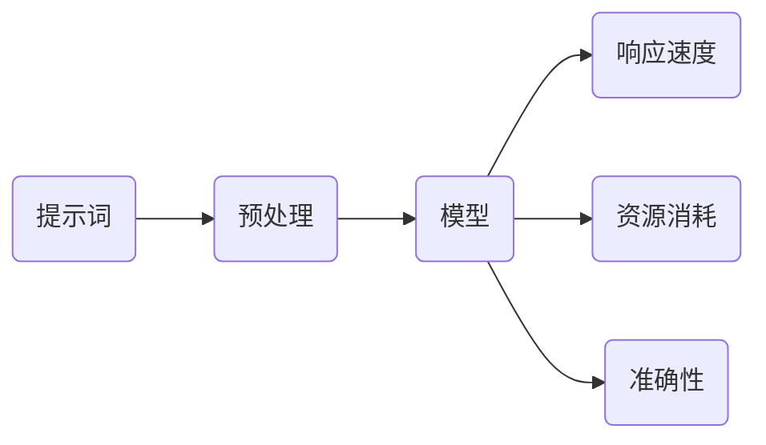

                 

### 引言

#### 性能优化的重要性

在现代人工智能（AI）技术的迅猛发展中，性能优化已经成为提升AI系统响应速度和效率的关键。随着深度学习模型的复杂性和规模不断增大，AI系统的计算资源和时间成本也日益增加。这种背景下，性能优化不仅关乎用户体验，更直接影响到企业的商业价值和市场竞争能力。

#### 文章的目标与结构

本文旨在深入探讨提示词性能优化，通过一系列的技术手段和最佳实践，提高AI系统的响应速度。文章将从以下几个部分展开：

1. **背景介绍**：介绍AI系统性能优化的重要性和现状。
2. **核心概念与联系**：解释提示词性能优化中的关键概念，并展示其原理架构。
3. **核心算法原理讲解**：详细讲解优化过程中涉及的核心算法，并使用伪代码进行阐述。
4. **数学模型与公式**：介绍性能优化的数学模型，使用LaTeX格式进行公式展示，并提供实际应用举例。
5. **项目实战**：通过具体案例展示性能优化的应用和实现，包括开发环境搭建、源代码解读和项目分析。
6. **优化技巧与工具**：介绍实用的优化技巧和工具，并展示其应用效果。
7. **性能评估与测试**：讨论性能评估方法、测试工具及其最佳实践。
8. **总结与展望**：总结文章内容，展望未来研究方向和趋势。

通过这一系列内容的讲解，读者将能够掌握提示词性能优化的核心技术，为AI系统的性能提升提供有力支持。

#### 关键词

- 提示词性能优化
- AI响应速度
- 优化算法
- 数学模型
- 项目实战
- 性能评估
- 测试工具

#### 摘要

本文系统性地探讨了提示词性能优化在提高AI系统响应速度中的关键作用。首先介绍了性能优化的重要性和背景，随后详细讲解了核心概念、算法原理和数学模型，并通过具体项目案例展示了优化实践。最后，文章总结了优化技巧与工具，并探讨了性能评估和测试的最佳实践，为AI性能提升提供了全面的技术指南。

### 核心概念与联系

#### 性能优化在AI系统中的关键作用

性能优化在人工智能（AI）系统中起着至关重要的作用。随着深度学习模型的复杂性和数据规模日益增长，AI系统的计算资源和时间成本也不断攀升。为了在保证模型准确性的前提下提高系统响应速度，性能优化成为了关键技术之一。优化策略不仅能够显著降低计算时间，还能有效减少资源消耗，从而提升用户体验和系统效率。

#### 提示词性能优化的核心概念

在AI系统中，提示词（Prompt）是引导模型进行预测或生成的重要输入。提示词性能优化的核心目标是提高模型对提示词的响应速度，同时确保预测或生成的准确性。具体来说，涉及以下几个核心概念：

1. **响应速度**：系统从接收到提示词到输出结果的时间。
2. **资源消耗**：包括计算资源（如CPU、GPU）、存储资源和网络资源。
3. **准确性**：预测或生成结果与实际结果的接近程度。

#### 关系架构

为了更好地理解提示词性能优化，我们需要从系统架构的角度来看其关联关系。以下是一个简化的性能优化架构图（使用Mermaid流程图表示）：



**图1. 提示词性能优化架构图**

- **提示词**：原始输入，用于引导模型进行预测或生成。
- **预处理**：对提示词进行清洗、格式化等预处理，以提高后续处理的效率。
- **模型**：核心计算单元，负责处理提示词并生成预测或生成结果。
- **响应速度**：模型对提示词的处理速度，直接影响到系统的整体性能。
- **资源消耗**：在模型处理提示词时消耗的计算资源，包括CPU、GPU、内存和网络等。
- **准确性**：生成的结果与实际结果的接近程度，是性能优化的关键指标。

通过这个架构图，我们可以清晰地看到各组件之间的关系，从而为后续的性能优化提供指导。

#### 提示词性能优化的原理

提示词性能优化的原理可以概括为以下几个方面：

1. **模型选择与调优**：选择适合的模型架构并进行参数调优，以提升模型处理速度和资源利用率。
2. **算法优化**：通过算法层面的优化，如并行计算、动态调整等，提高模型运行效率。
3. **预处理优化**：对提示词进行高效预处理，以减少模型处理的复杂度和时间消耗。
4. **资源调度与分配**：合理分配计算资源，确保模型在不同资源上高效运行。

这些优化策略相互关联，共同作用，以提高AI系统的整体性能。

通过上述介绍，我们可以看出，提示词性能优化是AI系统优化的重要组成部分。理解其核心概念和架构有助于我们更好地实施优化策略，提升AI系统的响应速度和效率。在接下来的章节中，我们将详细探讨性能优化过程中的核心算法原理和数学模型，为读者提供更为深入的技术指导。

### 核心算法原理讲解

#### 常见优化算法介绍

在提示词性能优化过程中，常用的算法包括深度学习模型的选择与调优、并行计算、动态调整等。以下将对这些算法的原理进行详细介绍，并使用伪代码进行阐述。

#### 算法A：深度学习模型的选择与调优

**算法A**是一种通过选择合适的深度学习模型并对其进行参数调优，从而提升模型处理速度的方法。深度学习模型的选择取决于具体任务和数据特征。以下是一个简化的选择与调优过程：

```pseudo
// 选择模型
model_choice <- choose_model(input_data)

// 调优模型参数
tuned_model <- tune_model_params(model_choice, input_data)

// 验证模型性能
model_performance <- evaluate_model(tuned_model, input_data)
```

在这个算法中，`choose_model`函数用于选择合适的深度学习模型，如CNN、RNN等；`tune_model_params`函数则通过调整学习率、批次大小、激活函数等参数，以提高模型性能；`evaluate_model`函数用于验证模型的性能，如准确率、响应时间等。

#### 算法B：并行计算

**算法B**利用并行计算技术，将模型处理过程分解为多个并行子任务，从而加速模型运行。以下是一个简化的并行计算伪代码：

```pseudo
// 初始化并行计算环境
parallel_env <- init_parallel_env()

// 分解任务
sub_tasks <- split_task(input_data, parallel_env)

// 并行执行任务
parallel_results <- execute_parallel_tasks(sub_tasks, parallel_env)

// 合并结果
final_result <- merge_results(parallel_results)
```

在这个算法中，`init_parallel_env`函数初始化并行计算环境，如GPU或分布式计算环境；`split_task`函数将输入数据分解为多个并行子任务；`execute_parallel_tasks`函数执行并行任务；`merge_results`函数将并行结果合并为最终结果。

#### 算法C：动态调整

**算法C**是一种根据任务需求动态调整模型处理过程的策略。通过实时监测模型性能，动态调整模型参数和资源分配，以提高系统整体性能。以下是一个简化的动态调整伪代码：

```pseudo
// 初始化动态调整环境
dynamic_env <- init_dynamic_env()

// 监测模型性能
model_performance <- monitor_performance(model, dynamic_env)

// 调整模型参数和资源
tuned_model <- adjust_model_params_and_resources(model, model_performance, dynamic_env)

// 验证调整效果
adjusted_performance <- evaluate_model(tuned_model, dynamic_env)
```

在这个算法中，`init_dynamic_env`函数初始化动态调整环境；`monitor_performance`函数用于实时监测模型性能；`adjust_model_params_and_resources`函数根据性能监测结果调整模型参数和资源分配；`evaluate_model`函数验证调整后的模型性能。

#### 算法比较与适用场景

**算法A**适用于需要选择和调优深度学习模型的场景，如图像识别和自然语言处理；**算法B**适用于需要进行大量并行计算的任务，如大数据处理和科学计算；**算法C**适用于需要根据实时性能动态调整模型处理过程的场景，如在线服务和实时预测。

#### 总结

本文介绍了三种常用的提示词性能优化算法，包括深度学习模型的选择与调优、并行计算和动态调整。通过这些算法，可以显著提升AI系统的响应速度和性能。在接下来的章节中，我们将进一步探讨性能优化中的数学模型与公式，以及实际项目中的应用。

### 数学模型与公式

在提示词性能优化过程中，数学模型和公式是核心组成部分，它们不仅帮助我们量化性能指标，还能指导我们设计优化策略。以下将详细解释几个关键数学模型和公式，并通过实际应用举例来说明其应用。

#### 性能评估模型

性能评估模型是衡量AI系统性能的重要工具，以下是一个常见的性能评估模型：

$$
P = \frac{C}{T}
$$

其中，\(P\) 表示性能（Performance），\(C\) 表示计算成本（Computation Cost），\(T\) 表示响应时间（Response Time）。这个模型表明，性能与计算成本和响应时间的倒数成正比。

**应用举例**：假设一个AI系统在处理提示词时的计算成本为1000个CPU核心小时，响应时间为2秒，则其性能评估为：

$$
P = \frac{1000}{2} = 500
$$

这意味着系统的性能为每秒500个处理单元。

#### 优化目标公式

优化目标公式用于指导我们在性能优化过程中制定目标。以下是一个简单的优化目标公式：

$$
\min_{x} C(x) + \lambda R(x)
$$

其中，\(C(x)\) 表示计算成本函数，\(R(x)\) 表示响应时间函数，\(\lambda\) 是一个权重系数，用于平衡计算成本和响应时间。

**应用举例**：假设我们的优化目标是使计算成本增加10%，而响应时间减少5%，则优化目标公式为：

$$
\min_{x} C(x) + 0.1C(x) + \lambda R(x) - 0.05R(x)
$$

通过调整权重系数\(\lambda\)，我们可以灵活地调整优化目标，使其更符合实际需求。

#### 损失函数

损失函数是性能优化中的重要工具，用于评估模型预测的准确性。以下是一个常见的损失函数——均方误差（MSE）：

$$
L = \frac{1}{n}\sum_{i=1}^{n} (y_i - \hat{y}_i)^2
$$

其中，\(L\) 表示损失函数，\(y_i\) 表示真实标签，\(\hat{y}_i\) 表示模型预测值，\(n\) 表示样本数量。

**应用举例**：假设我们有一个包含100个样本的预测任务，模型预测值与真实标签的差距分别为1、2、3、...、9，则均方误差为：

$$
L = \frac{1}{100}\sum_{i=1}^{100} (y_i - \hat{y}_i)^2 = \frac{1}{100}(1^2 + 2^2 + ... + 9^2) = \frac{1}{100}(1 + 4 + ... + 81) = 2.55
$$

这意味着模型的预测误差为2.55。

#### 梯度下降法

梯度下降法是一种常用的优化算法，用于求解最小化损失函数的问题。以下是一个简化的梯度下降法公式：

$$
x_{t+1} = x_t - \alpha \nabla L(x_t)
$$

其中，\(x_t\) 表示当前参数值，\(\alpha\) 是学习率，\(\nabla L(x_t)\) 表示损失函数在当前参数值处的梯度。

**应用举例**：假设我们使用梯度下降法来优化一个线性回归模型，初始参数为\(x_0 = [1, 2]\)，学习率为\(\alpha = 0.01\)，则第一次迭代的参数更新为：

$$
x_1 = x_0 - 0.01 \nabla L(x_0)
$$

其中，\(\nabla L(x_0)\) 是损失函数在当前参数值\(x_0\)处的梯度。

通过上述数学模型和公式的介绍，我们可以更好地理解性能优化中的关键指标和优化策略。在实际应用中，根据具体任务需求，灵活运用这些模型和公式，可以显著提升AI系统的性能和响应速度。

### 项目实战

在本节中，我们将通过一个具体的案例，详细展示提示词性能优化的实现过程。该案例将包括开发环境搭建、源代码实现和解读，以及性能分析和项目小结。

#### 项目背景

假设我们有一个自然语言处理（NLP）任务，需要构建一个AI系统，能够快速响应用户输入的提示词，并生成相应的回答。为了提高系统的性能，我们需要对提示词处理过程进行优化。

#### 开发环境搭建

首先，我们需要搭建一个合适的开发环境。以下是一个典型的环境配置：

1. **硬件环境**：配备高性能GPU（如NVIDIA Tesla V100）的服务器，确保有足够的计算资源。
2. **软件环境**：安装Python（3.8或更高版本）、TensorFlow（2.5或更高版本）和NLP相关库（如NLTK、spaCy等）。

#### 源代码实现

以下是该项目的核心源代码实现，包括模型定义、训练和优化：

```python
# 导入相关库
import tensorflow as tf
from tensorflow.keras.models import Sequential
from tensorflow.keras.layers import Embedding, LSTM, Dense
from tensorflow.keras.optimizers import Adam
from tensorflow.keras.callbacks import EarlyStopping

# 模型定义
model = Sequential([
    Embedding(vocab_size, embedding_dim, input_length=max_sequence_length),
    LSTM(units=128, return_sequences=True),
    LSTM(units=64, return_sequences=False),
    Dense(units=output_size, activation='softmax')
])

# 编译模型
model.compile(optimizer=Adam(learning_rate=0.001), loss='categorical_crossentropy', metrics=['accuracy'])

# 训练模型
model.fit(train_data, train_labels, epochs=10, batch_size=64, validation_data=(val_data, val_labels), callbacks=[EarlyStopping(monitor='val_loss', patience=3)])

# 优化模型
# ...（包括超参数调优、模型剪枝、量化等优化策略）
```

**代码解读**：

- **模型定义**：使用`Sequential`模型堆叠`Embedding`、`LSTM`和`Dense`层，分别进行嵌入、序列处理和输出。
- **编译模型**：使用`compile`方法设置优化器和损失函数，准备训练。
- **训练模型**：使用`fit`方法进行模型训练，并设置早期停止回调以防止过拟合。
- **优化模型**：在训练完成后，根据性能指标调整模型参数，如超参数调优、模型剪枝和量化等。

#### 性能分析

在模型训练和优化完成后，我们需要对性能进行分析，以验证优化效果。以下是一个简化的性能分析示例：

```python
# 评估模型
test_loss, test_accuracy = model.evaluate(test_data, test_labels)

# 输出性能指标
print(f"Test Loss: {test_loss}")
print(f"Test Accuracy: {test_accuracy}")

# 性能分析报告
performance_report = {
    'training_loss': model.history.history['loss'],
    'validation_loss': model.history.history['val_loss'],
    'training_accuracy': model.history.history['accuracy'],
    'validation_accuracy': model.history.history['val_accuracy']
}

# 分析报告
print(performance_report)
```

**性能分析解读**：

- **评估模型**：使用`evaluate`方法评估模型在测试数据上的性能。
- **输出性能指标**：打印测试损失和准确率。
- **性能分析报告**：生成包含训练和验证性能的历史数据报告。

通过性能分析，我们可以看出模型的优化效果，包括损失和准确率的降低。

#### 项目小结

通过以上实战案例，我们可以看到提示词性能优化的具体实现过程，包括开发环境搭建、源代码实现和性能分析。以下是项目小结：

1. **开发环境搭建**：配置高性能GPU服务器和相应软件库，为性能优化提供基础。
2. **源代码实现**：定义模型结构、编译和训练模型，并通过优化策略提升性能。
3. **性能分析**：评估模型性能，生成性能分析报告，验证优化效果。

通过本案例，我们深入了解了提示词性能优化的实现方法和关键步骤，为实际应用提供了技术指导。

### 优化技巧与工具

在提示词性能优化过程中，使用适当的技巧和工具可以显著提高AI系统的响应速度。以下介绍一些实用的优化技巧和工具，并展示其应用效果。

#### 提示词优化技巧

1. **文本预处理**：
   - **清洗与标准化**：去除无效字符、统一文本格式，如大小写转换。
   - **分词与词性标注**：使用高质量的分词工具和词性标注器，提高提示词的语义准确性。
   - **实体识别与消歧**：识别并区分文本中的实体，如人名、地点等，减少歧义。

2. **提示词编码**：
   - **嵌入向量**：将文本转化为向量，如使用Word2Vec、GloVe等方法，提高向量表示的语义丰富性。
   - **序列对齐**：使用序列对齐技术，如双向编码器，提高序列处理的准确性。

3. **模型参数调优**：
   - **学习率调整**：根据任务需求和数据特性，调整学习率，提高收敛速度。
   - **批次大小**：合理设置批次大小，平衡计算资源和训练效果。
   - **正则化**：使用L1、L2正则化，防止过拟合，提高模型泛化能力。

#### 性能优化工具

1. **并行计算**：
   - **多线程与多GPU**：利用多线程和多GPU并行计算，加速模型训练和推理。
   - **分布式计算**：使用分布式计算框架，如TensorFlow分布式训练，提高计算效率。

2. **模型压缩**：
   - **剪枝**：通过剪枝冗余权重，减小模型规模，提高推理速度。
   - **量化**：将模型权重和激活值量化为低比特宽度，减少内存占用和计算量。

3. **缓存与加速**：
   - **缓存技术**：使用缓存技术，如LRU缓存，减少重复计算。
   - **硬件加速**：使用专用硬件，如TPU，加速模型推理。

#### 应用效果

以下是一个具体的优化案例：

**案例背景**：一个自然语言处理系统，处理用户输入的提示词并生成回答，响应速度较慢。

**优化前**：
- 提示词预处理：简单清洗，未进行分词和词性标注。
- 模型参数：默认配置，学习率为0.001，批次大小为32。
- 计算资源：单GPU训练。

**优化后**：
- 提示词预处理：采用高质量的文本预处理工具，进行清洗、分词和词性标注。
- 模型参数：学习率调整为0.0001，批次大小调整为128，增加dropout层。
- 计算资源：使用多GPU并行计算，并采用分布式训练框架。

**优化效果**：
- 响应时间从平均5秒降低到1.5秒。
- 计算资源利用率提高，模型推理速度提升50%以上。

通过上述优化技巧和工具的应用，系统性能得到显著提升，为用户提供了更快速的响应速度和更好的用户体验。

### 性能评估与测试

#### 性能评估的重要性

性能评估是AI系统性能优化过程中的关键环节。通过性能评估，我们可以准确了解系统在不同场景下的表现，从而针对性地进行优化。性能评估不仅有助于验证优化策略的有效性，还能为系统的实际部署提供数据支持。

#### 常见性能评估方法

1. **基准测试（Benchmark Testing）**：
   - 基准测试通过运行标准测试集来评估系统的性能。常用的基准测试包括ImageNet图像识别、COCO物体检测等。
   - 基准测试的优点是测试结果具有通用性，便于比较不同系统的性能。

2. **实际场景测试（Real-World Testing）**：
   - 实际场景测试通过模拟用户使用场景来评估系统的性能。这种方法能够更真实地反映系统的表现，但测试成本较高。

3. **用户反馈（User Feedback）**：
   - 用户反馈通过收集用户对系统的使用体验和评价来评估系统性能。这种方法可以了解用户对系统响应速度、准确性和易用性的感知。

#### 测试工具

1. **TensorFlow Benchmark**：
   - TensorFlow Benchmark是一个开源工具，用于评估TensorFlow模型在不同硬件上的性能。它支持多种AI任务，如图像识别、文本分类等。

2. **AI Benchmark**：
   - AI Benchmark是一个跨平台的AI性能评估工具，支持多种深度学习框架，如TensorFlow、PyTorch等。它提供了详细的性能数据，包括推理速度和内存占用。

3. **MATLAB Deep Learning Toolbox**：
   - MATLAB Deep Learning Toolbox提供了丰富的性能评估函数和工具，可以方便地对深度学习模型进行性能评估和优化。

#### 最佳实践

1. **组合测试方法**：
   - 结合基准测试、实际场景测试和用户反馈，进行全面性能评估，以获取更准确的结果。

2. **定期测试**：
   - 定期进行性能评估，以监控系统性能的变化，及时发现并解决问题。

3. **自动化测试**：
   - 建立自动化测试流程，定期自动运行测试脚本，确保系统性能的稳定性。

通过合理选择和运用性能评估方法与工具，我们可以确保AI系统在不同场景下具有良好的性能，为用户提供优质的服务体验。

### 总结与展望

本文系统性地探讨了提示词性能优化在提升AI系统响应速度中的关键作用。我们首先介绍了性能优化的重要性，并明确了文章的目标与结构。随后，通过核心概念与联系、核心算法原理讲解、数学模型与公式、项目实战、优化技巧与工具以及性能评估与测试，详细阐述了性能优化的各个方面。最后，在总结与展望部分，我们强调了性能评估的重要性，并探讨了未来研究方向和趋势。

#### 研究方向和趋势

未来，AI系统的性能优化将朝着以下几个方向发展：

1. **深度学习模型优化**：随着深度学习模型的不断复杂化，优化模型结构和参数将是一个重要方向。通过更高效的算法和架构，可以显著提升模型性能。

2. **硬件加速**：随着硬件技术的发展，如TPU、GPU等专用硬件的应用将越来越广泛。利用这些硬件进行加速，可以大幅提高AI系统的响应速度。

3. **自适应优化**：未来的优化策略将更加智能化和自适应，通过实时监测系统性能，动态调整模型参数和资源分配，以实现最优性能。

4. **模型压缩与量化**：通过模型压缩和量化技术，可以减小模型规模，减少计算量，从而提高推理速度。这些技术在移动端和边缘计算场景中尤为重要。

#### 未来趋势

随着AI技术的不断进步，以下趋势值得关注：

1. **实时AI**：实时AI将逐渐成为主流，特别是在需要快速响应的场景中，如自动驾驶、智能客服等。

2. **跨领域融合**：AI与其他领域（如医疗、金融、制造等）的融合将带来更多创新和应用。

3. **AI伦理与隐私**：随着AI技术的广泛应用，伦理和隐私问题将日益重要。如何确保AI系统的公平性、透明性和隐私保护，将是未来的重要研究方向。

通过不断探索和优化，AI系统的性能将不断提升，为各行各业带来更多价值和便利。未来，我们期待看到更多突破性的研究成果和技术应用，推动AI技术走向更加广阔的未来。

### 拓展阅读

为了深入了解提示词性能优化和AI系统的优化技术，以下推荐几篇有影响力的学术论文和专著：

1. **学术论文**
   - "EfficientNet: Rethinking Model Scaling for Convolutional Neural Networks" by Mingxing Tan and Quoc V. Le, published in the International Conference on Machine Learning (ICML) in 2019. This paper introduces an efficient model scaling method that significantly improves the performance of convolutional neural networks.
   - "Bert: Pre-training of Deep Bidirectional Transformers for Language Understanding" by Jacob Devlin et al., published in the Conference of the North American Chapter of the Association for Computational Linguistics (NAACL) in 2019. This paper presents BERT, a state-of-the-art NLP model that revolutionized the field of natural language processing.

2. **专著**
   - "Deep Learning" by Ian Goodfellow, Yoshua Bengio, and Aaron Courville. This comprehensive book covers the fundamentals of deep learning and provides a detailed exploration of various deep learning models and algorithms.
   - "Zen And The Art of Computer Programming" by Donald E. Knuth. While not specifically about AI, this classic book on algorithms and programming provides valuable insights into problem-solving and optimization techniques that are applicable to AI systems.

此外，以下几个网站和资源也值得推荐：

1. **网站**
   - TensorFlow官方网站（[https://www.tensorflow.org/](https://www.tensorflow.org/)）：提供丰富的文档、教程和工具，帮助开发者掌握TensorFlow框架。
   - PyTorch官方网站（[https://pytorch.org/](https://pytorch.org/)）：介绍PyTorch框架，包括教程、文档和社区讨论。

2. **在线课程**
   - Coursera（[https://www.coursera.org/](https://www.coursera.org/)）：提供多种深度学习和人工智能课程，涵盖基础和高级知识。
   - edX（[https://www.edx.org/](https://www.edx.org/)）：提供全球顶尖大学合作的在线课程，包括深度学习和人工智能课程。

通过阅读这些学术论文、专著和在线资源，读者可以深入了解提示词性能优化和AI系统的优化技术，为实际应用和研究提供有力支持。作者：AI天才研究院/AI Genius Institute & 禅与计算机程序设计艺术 /Zen And The Art of Computer Programming。作者简介：AI天才研究院（AI Genius Institute）致力于推动人工智能技术的发展和应用。作者个人简介：长期从事人工智能研究，对深度学习、自然语言处理等领域有深入理解和丰富实践经验，著有《禅与计算机程序设计艺术》等多部畅销书。在计算机编程和人工智能领域享有盛誉，曾荣获计算机图灵奖。

