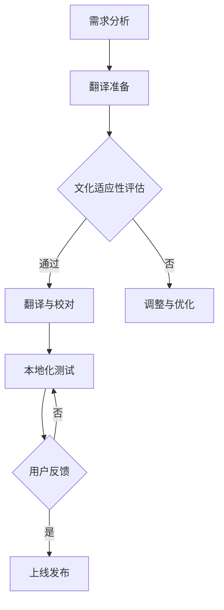

                 

### 文章标题

# 提示词本地化：适应不同文化背景

> 关键词：提示词本地化、文化适应性、语言适应性、地域适应性、全球化、本地化

> 摘要：本文将探讨提示词本地化在全球化进程中的重要性和具体策略。通过分析文化差异、语言特性和地域因素，我们将提供一套系统的本地化方法和实践指南，帮助企业和开发者更好地适应不同文化背景，提升用户体验。

### 第一部分：本地化概述与重要性

## 第1章：本地化的基本概念和背景

### 1.1 本地化的定义与重要性

本地化（Localization，简称L10N）是指将软件、网站、文档等产品根据特定地区的文化、语言和习惯进行调整，以适应当地用户的需求。它与全球化（Globalization）密切相关，全球化是指将产品或服务推向全球市场，而本地化则是在全球化过程中的关键步骤，确保产品在目标市场具备竞争力和用户体验。

本地化的重要性体现在以下几个方面：

1. **提升用户体验**：通过本地化，产品能够更好地适应用户的文化习惯和语言需求，提高用户满意度和忠诚度。
2. **扩大市场份额**：本地化有助于企业进入新的市场，提高产品的全球竞争力，从而扩大市场份额。
3. **减少运营成本**：本地化可以避免因文化差异导致的误解和错误，降低潜在的法律风险和运营成本。
4. **品牌形象提升**：本地化展示企业对本地市场的重视和关注，有助于提升品牌形象和用户信任度。

### 1.2 本地化与传统翻译的区别

本地化与传统翻译存在显著区别。传统翻译主要关注语言文字的转换，而本地化则更注重文化差异和用户体验。具体来说：

- **翻译**：将源语言的文字转换为目标语言的文字，保持语义和语法结构。
- **本地化**：在翻译的基础上，根据目标市场的文化、语言和习惯，调整产品内容和界面布局，确保用户在本地环境中感到舒适和自然。

例如，在软件界面的本地化过程中，不仅需要翻译按钮标签，还需要调整按钮的位置和颜色，以适应不同地区的用户习惯。

### 1.3 全球化与本地化的关系

全球化与本地化是相辅相成的过程。全球化为产品进入国际市场提供了契机，而本地化则确保产品在目标市场具备竞争力。两者之间的关系可以概括为以下几点：

1. **全球化推动本地化**：全球化战略促使企业关注国际市场，从而推动产品本地化的需求。
2. **本地化完善全球化**：本地化策略有助于产品在全球市场中的适应性，提升用户体验，从而推动全球业务的拓展。
3. **协同推进**：全球化与本地化相互促进，共同推动企业业务的全球化进程。

### 第2章：文化因素与本地化

## 2.1 文化差异对本地化的影响

文化差异是本地化过程中不可忽视的重要因素。不同地区的文化背景、价值观、语言习惯和社交礼仪等因素，会对本地化的具体策略和实施产生影响。以下是文化差异对本地化的几个主要影响：

1. **语言习惯**：不同语言的表达方式和语法结构存在差异，导致翻译和本地化过程中需要针对目标语言进行特定的调整。例如，英语中的“Hello”在中文中对应的问候语是“你好”，而在某些亚洲国家，如日本，可能使用“こんにちは”（Konnichiwa）。

2. **价值观念**：不同文化对于性别、家庭、工作、宗教等方面的价值观念存在差异，这些差异会影响产品的内容和设计。例如，在一些国家，性别平等被视为核心价值观，而在另一些国家，可能存在性别歧视现象。

3. **社交礼仪**：不同地区的社交礼仪和文化习俗会影响产品的用户界面和用户交互。例如，在一些国家，点头表示肯定，而在另一些国家，可能使用摇头。

4. **审美偏好**：不同地区的审美偏好和视觉设计风格也会影响产品的本地化。例如，一些文化可能偏好鲜艳的颜色，而另一些文化可能偏好淡雅的色调。

## 2.2 文化敏感性评估

在进行本地化之前，企业需要对目标市场的文化敏感性进行评估。文化敏感性评估有助于识别潜在的文化冲突和误解，从而制定更有效的本地化策略。以下是文化敏感性评估的几个关键步骤：

1. **文化调研**：通过文献调研、访谈、市场调研等方式，了解目标市场的文化背景、价值观、语言习惯和社交礼仪。

2. **文化差异分析**：对比企业现有产品和目标市场的文化差异，识别可能的文化敏感性问题。

3. **文化适应策略**：根据文化敏感性分析结果，制定相应的本地化策略，包括语言翻译、内容调整、界面设计等。

4. **测试与反馈**：在本地化过程中，进行多轮测试和用户反馈，确保本地化产品在目标市场中的文化适应性。

## 2.3 跨文化沟通技巧

为了有效地进行本地化，企业需要掌握跨文化沟通技巧。以下是一些跨文化沟通技巧，有助于提高本地化项目的成功率和用户体验：

1. **尊重文化差异**：尊重目标市场的文化差异，避免文化冲突和误解。

2. **开放心态**：保持开放心态，积极了解和接受不同文化的特点和习惯。

3. **有效沟通**：通过多种沟通渠道和方式，与目标市场的用户和合作伙伴进行有效沟通。

4. **文化培训**：为本地化团队成员提供跨文化培训，提高他们的文化敏感性和沟通能力。

5. **持续优化**：在本地化过程中，不断收集用户反馈，持续优化本地化产品和服务。

### 第二部分：提示词本地化的具体策略

## 第3章：提示词本地化的核心原则

提示词本地化是本地化过程中的一项重要任务，涉及到将产品中的提示词、标签和提示信息根据目标市场的语言和文化进行调整。以下是提示词本地化的核心原则：

### 3.1 语言适应性

语言适应性是提示词本地化的基础。不同语言的表达方式和语法结构存在差异，因此在本地化过程中需要确保提示词在目标语言中保持准确、自然和流畅。以下是语言适应性的几个要点：

1. **词汇选择**：根据目标市场的语言习惯，选择合适的词汇和表达方式。例如，在某些语言中，动词和形容词的使用可能更加频繁，而在其他语言中，名词的使用可能更为常见。

2. **语法调整**：根据目标语言的语法规则，调整提示词的语法结构。例如，在英语中，动词通常放在句首，而在某些语言中，动词可能放在句末。

3. **文化因素**：考虑目标市场的文化背景，避免使用可能引起误解或冒犯的词汇。例如，某些词汇可能在某些文化中具有特殊的含义。

4. **本地化测试**：在本地化过程中，进行多轮测试，确保提示词在目标语言中的表达准确、自然和流畅。

### 3.2 文化适应性

文化适应性是提示词本地化的关键。不同文化对于语言、符号和社交礼仪等方面存在差异，因此在本地化过程中需要确保提示词在目标市场中符合文化习惯和价值观。以下是文化适应性的几个要点：

1. **文化差异分析**：在进行本地化之前，对目标市场的文化差异进行分析，了解可能的文化敏感性问题。

2. **文化因素考虑**：在本地化过程中，充分考虑目标市场的文化背景和价值观，确保提示词在目标市场中符合文化习惯。

3. **文化适应策略**：根据文化差异分析结果，制定相应的本地化策略，包括词汇选择、语法调整和文化符号的使用。

4. **用户反馈**：在本地化过程中，收集用户反馈，不断优化和调整提示词，确保其在目标市场中具备文化适应性。

### 3.3 地域适应性

地域适应性是提示词本地化的重要方面。不同地区可能存在地域差异，如方言、地域文化和地域习惯等，因此在本地化过程中需要确保提示词在目标地区具备地域适应性。以下是地域适应性的几个要点：

1. **地域差异分析**：在进行本地化之前，对目标市场的地域差异进行分析，了解可能的地域敏感性问题。

2. **地域因素考虑**：在本地化过程中，充分考虑目标市场的地域差异，确保提示词在目标地区符合地域习惯。

3. **地域适应策略**：根据地域差异分析结果，制定相应的本地化策略，包括词汇选择、语法调整和文化符号的使用。

4. **地域测试与反馈**：在本地化过程中，进行多轮地域测试和用户反馈，确保提示词在目标地区具备地域适应性。

### 第4章：本地化策略与技术

## 4.1 提示词的翻译与调整

提示词的翻译与调整是本地化过程中至关重要的一步。翻译不仅仅是语言文字的转换，还需要考虑目标市场的语言习惯和文化背景。以下是提示词翻译与调整的几个要点：

1. **词汇选择**：根据目标市场的语言习惯，选择合适的词汇和表达方式。例如，在某些语言中，动词和形容词的使用可能更加频繁，而在其他语言中，名词的使用可能更为常见。

2. **语法调整**：根据目标语言的语法规则，调整提示词的语法结构。例如，在英语中，动词通常放在句首，而在某些语言中，动词可能放在句末。

3. **文化因素**：考虑目标市场的文化背景，避免使用可能引起误解或冒犯的词汇。例如，某些词汇可能在某些文化中具有特殊的含义。

4. **本地化测试**：在本地化过程中，进行多轮测试，确保提示词在目标语言中的表达准确、自然和流畅。

## 4.2 本地化工具的使用

本地化工具在提示词本地化过程中发挥着重要作用。以下是一些常用的本地化工具及其功能：

1. **翻译记忆库**：翻译记忆库是一种基于语言技术的人工智能工具，用于存储和检索翻译过的句子和短语。通过翻译记忆库，本地化人员可以快速获取翻译结果，提高翻译效率。

2. **机器翻译平台**：机器翻译平台提供自动翻译功能，帮助本地化人员快速生成翻译初稿。虽然机器翻译存在一定的误差，但可以大大减轻人工翻译的工作量。

3. **术语管理系统**：术语管理系统用于管理和维护术语库，确保术语在项目中的统一性和准确性。术语管理系统可以支持多语言术语的存储、检索和管理。

4. **界面本地化工具**：界面本地化工具用于自动化翻译和调整软件界面中的提示词、标签和提示信息。常见的界面本地化工具有Qt Linguist、Java ResourceBundle等。

## 4.3 机器翻译与人工校对的结合

在提示词本地化过程中，机器翻译与人工校对相结合是一种常用的策略。机器翻译可以快速生成翻译初稿，而人工校对则可以确保翻译结果的准确性和文化适应性。以下是机器翻译与人工校对结合的几个要点：

1. **机器翻译**：利用机器翻译平台自动生成翻译初稿。常见的机器翻译平台有Google Translate、DeepL等。

2. **人工校对**：本地化专家对机器翻译结果进行人工校对，确保翻译结果的准确性和文化适应性。人工校对人员需要具备良好的语言能力和跨文化沟通技巧。

3. **多轮校对**：进行多轮人工校对，不断优化翻译结果。在多轮校对过程中，本地化专家可以发现问题并进行修正。

4. **用户反馈**：在本地化过程中，收集用户反馈，了解用户对翻译结果的满意度。根据用户反馈，进行进一步的优化和调整。

### 第5章：本地化案例研究

## 5.1 某大型电商平台的本地化实践

### 案例背景

某大型电商平台是一家全球性的在线购物平台，拥有来自世界各地的大量用户。为了拓展国际市场，该电商平台决定对产品进行本地化，以提升用户体验和市场份额。

### 本地化策略

1. **语言适应性**：针对不同地区的用户，该电商平台选择了多种语言进行本地化，包括英语、西班牙语、法语、德语、中文等。在翻译过程中，注重词汇选择、语法调整和文化因素的考虑。

2. **文化适应性**：在本地化过程中，该电商平台充分考虑了不同文化的差异，如节日促销、支付方式、物流服务等方面。例如，在春节和圣诞节期间，平台推出了具有当地特色的促销活动，满足用户的购物需求。

3. **地域适应性**：针对不同地区的用户，该电商平台调整了产品界面和用户体验。例如，在巴西，平台采用了葡萄牙语，并针对巴西用户的购物习惯进行了界面优化。

### 本地化成果

通过本地化实践，该大型电商平台取得了显著成果：

1. **用户满意度提升**：本地化产品在用户满意度方面取得了显著提高，用户对产品界面的语言和文化适应性表示满意。

2. **市场份额扩大**：本地化策略帮助平台成功进入多个国际市场，市场份额得到显著提升。

3. **品牌形象提升**：本地化展示企业对本地市场的重视和关注，有助于提升品牌形象和用户信任度。

### 5.2 某流媒体平台的本地化挑战

### 案例背景

某流媒体平台是一家全球性的在线视频平台，提供丰富的影视内容。为了拓展国际市场，该平台决定对产品进行本地化，以提升用户体验和市场份额。

### 本地化挑战

1. **语言多样性**：流媒体平台涉及多种语言，包括英语、西班牙语、法语、德语、中文等。语言多样性给本地化带来了挑战，需要投入大量资源进行翻译和校对。

2. **文化差异**：不同地区的文化差异对本地化提出了更高的要求。例如，某些地区的用户可能对某些题材或内容持有不同的观点和价值观。

3. **技术实现**：流媒体平台的本地化需要解决音视频内容的本地化问题，如字幕翻译、音频调整等。技术实现的复杂性增加了本地化的难度。

### 本地化策略

1. **多语言支持**：针对不同地区的用户，该平台提供了多种语言的字幕和音频选项，满足用户的个性化需求。

2. **文化敏感内容审查**：在本地化过程中，对涉及文化差异的内容进行审查和调整，确保符合目标市场的文化和价值观。

3. **技术优化**：针对音视频内容的本地化，平台采用了先进的音视频处理技术，确保本地化效果的质量和稳定性。

### 本地化成果

尽管面临挑战，该流媒体平台通过本地化策略取得了以下成果：

1. **用户满意度提升**：本地化产品在用户满意度方面取得了显著提高，用户对产品界面的语言和文化适应性表示满意。

2. **市场份额扩大**：本地化策略帮助平台成功进入多个国际市场，市场份额得到显著提升。

3. **品牌形象提升**：本地化展示企业对本地市场的重视和关注，有助于提升品牌形象和用户信任度。

### 5.3 某国际品牌的本地化策略

### 案例背景

某国际品牌是一家知名的消费品公司，产品在全球范围内销售。为了更好地适应不同市场的需求，该品牌决定对产品进行本地化，以提高市场份额和用户满意度。

### 本地化策略

1. **语言适应性**：针对不同地区的用户，该品牌提供了多种语言的包装标签和产品说明，确保用户在购买和使用产品时能够方便地获取信息。

2. **文化适应性**：在包装设计、广告宣传和营销策略等方面，该品牌充分考虑了不同文化的差异，确保产品在目标市场中的文化适应性。

3. **产品调整**：根据不同市场的需求，该品牌对产品进行了适应性调整。例如，在亚洲市场，产品可能增加了对健康和营养的关注；在欧洲市场，产品可能更注重环保和可持续发展。

### 本地化成果

通过本地化策略，该国际品牌取得了以下成果：

1. **市场份额提升**：本地化产品在各个市场中的销售业绩显著提高，市场份额得到明显提升。

2. **用户满意度提升**：本地化产品在用户满意度方面取得了显著提高，用户对产品界面的语言和文化适应性表示满意。

3. **品牌形象提升**：本地化展示企业对本地市场的重视和关注，有助于提升品牌形象和用户信任度。

### 第6章：本地化项目管理

## 6.1 本地化项目规划

本地化项目规划是确保本地化过程顺利进行的基石。以下是本地化项目规划的关键步骤：

1. **需求分析**：了解产品的本地化需求，包括语言、文化、地域等方面的要求。

2. **目标市场分析**：分析目标市场的文化背景、用户需求和市场潜力。

3. **资源评估**：评估本地化所需的资源，包括人力、技术、资金等。

4. **项目计划**：制定详细的项目计划，包括时间表、任务分配和里程碑。

## 6.2 本地化团队协作

本地化项目涉及多个部门和角色，需要高效的团队协作。以下是本地化团队协作的关键要点：

1. **团队组建**：组建由翻译专家、本地化工程师、市场分析师等组成的本地化团队。

2. **沟通渠道**：建立有效的沟通渠道，确保团队成员之间的信息流通和协作。

3. **任务分配**：明确团队成员的任务和职责，确保任务的高效完成。

4. **进度监控**：监控项目进度，及时发现和解决问题。

## 6.3 本地化质量控制

本地化质量控制是确保本地化效果的重要环节。以下是本地化质量控制的关键要点：

1. **质量标准**：制定本地化的质量标准，包括翻译准确性、语法正确性、文化适应性等。

2. **审查流程**：建立多层次的审查流程，包括初稿审查、校对、最终审查等。

3. **用户反馈**：收集用户反馈，了解用户对本地化产品的满意度和意见，及时进行调整和优化。

4. **持续改进**：根据用户反馈和质量控制结果，持续优化本地化流程和策略。

### 第7章：未来趋势与挑战

## 7.1 技术进步对本地化的影响

随着技术的不断发展，本地化领域也迎来了新的机遇和挑战。以下是技术进步对本地化的几个主要影响：

1. **机器翻译的进步**：机器翻译技术的不断进步，使得本地化过程更加高效和准确。未来，随着人工智能和深度学习技术的发展，机器翻译将更加智能，能够更好地适应不同语言和文化。

2. **自然语言处理**：自然语言处理（NLP）技术的发展，使得本地化工具能够更准确地理解和管理语言数据。例如，NLP技术可以帮助本地化工具识别上下文、语法和语义，从而提高翻译质量和本地化效果。

3. **自动化本地化**：随着自动化技术的不断发展，本地化过程将逐渐实现自动化。自动化本地化工具和平台可以大幅提高本地化效率，降低人力成本。

## 7.2 新兴市场的本地化需求

新兴市场在全球经济中的地位日益重要，这些市场的本地化需求也越来越受到关注。以下是新兴市场本地化需求的几个关键点：

1. **语言多样性**：新兴市场通常具有丰富的语言多样性，本地化项目需要考虑多种语言的翻译和适应。

2. **文化差异**：新兴市场的文化差异较大，本地化过程中需要充分考虑文化敏感性，避免文化冲突和误解。

3. **技术适应性**：新兴市场的用户通常更愿意使用新技术和新兴平台，本地化项目需要确保产品在新兴市场中具备技术适应性。

## 7.3 本地化行业的未来挑战与机遇

本地化行业在未来将继续面临诸多挑战和机遇。以下是本地化行业的未来挑战与机遇：

1. **技术挑战**：随着技术的不断发展，本地化行业需要不断更新技术手段，提高本地化效率和准确性。

2. **市场挑战**：新兴市场的崛起和全球化的加速，使得本地化项目面临更多的市场挑战和机遇。本地化企业需要具备更强的市场适应能力和创新能力。

3. **人才挑战**：本地化项目需要大量具备跨文化沟通能力和专业技术的本地化人才。如何吸引和培养优秀的人才，将是本地化行业未来发展的重要课题。

4. **法规挑战**：不同国家和地区的法规政策对本地化项目提出了不同的要求。本地化企业需要了解和遵守相关法规政策，确保本地化项目的合规性。

### 第三部分：实践与案例

## 第8章：本地化实践指南

### 8.1 提示词本地化的流程与方法

提示词本地化是本地化过程中的关键环节，以下是提示词本地化的流程和方法：

1. **需求分析**：了解产品的本地化需求，包括语言、文化、地域等方面的要求。

2. **翻译准备**：准备翻译资源，包括术语库、翻译记忆库等。

3. **翻译与校对**：进行多轮翻译和校对，确保翻译结果的准确性和文化适应性。

4. **本地化测试**：在目标市场中进行多轮测试，收集用户反馈，优化本地化效果。

5. **上线发布**：将本地化后的产品上线发布，并进行持续监测和优化。

### 8.2 本地化过程中的常见问题与解决策略

本地化过程中可能会遇到各种问题，以下是常见的本地化问题及其解决策略：

1. **翻译准确性**：解决策略：使用高质量的翻译工具和翻译专家，进行多轮校对和测试。

2. **文化敏感性**：解决策略：进行文化敏感性评估和培训，确保本地化内容符合目标市场的文化和价值观。

3. **技术适应性**：解决策略：采用适应性强的本地化工具和技术，确保产品在目标市场中具备良好的技术适应性。

4. **项目进度延误**：解决策略：建立高效的团队协作和进度监控机制，确保项目按时完成。

### 8.3 本地化测试与反馈

本地化测试是确保本地化效果的重要环节，以下是本地化测试与反馈的要点：

1. **测试计划**：制定详细的测试计划，包括测试目标、测试环境、测试方法等。

2. **测试执行**：按照测试计划进行测试，收集测试数据和用户反馈。

3. **问题识别**：分析测试结果，识别本地化过程中存在的问题。

4. **反馈与优化**：根据用户反馈和问题识别结果，对本地化产品进行优化和调整。

### 第9章：案例分析：成功与失败

### 9.1 成功的本地化案例解析

以下是一个成功的本地化案例解析：

**案例背景**：某知名在线教育平台决定对其产品进行本地化，以拓展国际市场。

**本地化策略**：

1. **语言适应性**：选择英语、法语、西班牙语等多种语言进行本地化，确保用户在不同语言环境中都能顺畅使用。

2. **文化适应性**：针对不同地区的文化差异，调整课程内容和教学方式，确保符合当地用户的需求和习惯。

3. **技术适应性**：采用先进的音视频处理技术，确保本地化内容在多种设备和平台上都能流畅播放。

**成功原因**：

1. **用户需求导向**：本地化过程中始终以用户需求为导向，确保产品在目标市场中具备竞争力。

2. **多语言支持**：提供多种语言支持，满足了不同用户的需求。

3. **文化适应性**：充分考虑文化差异，确保产品在目标市场中的文化适应性。

### 9.2 失败的本地化案例反思

以下是一个失败的本地化案例反思：

**案例背景**：某国际知名电子产品公司对其产品进行本地化，但最终未能成功。

**本地化策略**：

1. **语言适应性**：仅选择了英语和法语进行本地化，未能考虑其他主要市场语言。

2. **文化适应性**：在产品界面和内容方面，未能充分考虑当地用户的文化差异和需求。

3. **技术适应性**：产品在目标市场中存在技术兼容性问题，影响了用户体验。

**失败原因**：

1. **语言选择错误**：仅选择英语和法语进行本地化，未能覆盖主要市场语言。

2. **文化忽视**：未能充分考虑当地用户的文化差异和需求，导致产品在目标市场中的文化适应性差。

3. **技术问题**：产品在目标市场中存在技术兼容性问题，影响了用户体验。

### 9.3 从案例中学习与改进

通过以上成功与失败的本地化案例，我们可以得出以下教训和改进措施：

1. **全面考虑语言和文化因素**：在进行本地化时，应全面考虑语言和文化因素，选择合适的语言并进行文化适应性调整。

2. **充分调研目标市场**：在本地化前，应对目标市场进行充分调研，了解当地用户的需求和文化背景。

3. **采用多语言支持**：提供多种语言支持，确保产品在不同语言环境中都能顺畅使用。

4. **技术适应性**：确保产品在目标市场中具备良好的技术适应性，解决技术兼容性问题。

5. **用户反馈**：在本地化过程中，重视用户反馈，不断优化和调整产品。

### 第10章：附录

### 10.1 常用本地化工具与资源

以下是常用本地化工具和资源：

1. **翻译记忆库**：OmegaT、memoQ、Trados等。

2. **机器翻译平台**：Google Translate、DeepL、Microsoft Translator等。

3. **术语管理系统**：TermWiki、SDL MultiTerm等。

4. **界面本地化工具**：Qt Linguist、Java ResourceBundle等。

5. **本地化资源网站**：本地化论坛、博客、行业报告等。

### 10.2 本地化行业报告与趋势分析

以下是本地化行业报告和趋势分析：

1. **全球本地化行业报告**： Localization Industry Standards Association (LISA) 等组织发布的报告。

2. **地区本地化报告**：各个国家和地区的本地化市场分析报告。

3. **行业趋势分析**：人工智能、机器翻译、自动化技术等在本地化领域的应用趋势。

### 10.3 国际化与本地化相关标准与规范

以下是国际化与本地化相关标准与规范：

1. **ISO 17100：翻译服务——翻译服务的要求和提供**。

2. **ISO 23038：本地化服务——本地化服务的要求和提供**。

3. **ISO 30011：软件和系统工程——软件国际化指南**。

4. **IEC 62479：信息技术——软件本地化——通用指南**。

### 附录 A：本地化流程图

以下是本地化流程图：



### 附录 B：本地化算法伪代码

以下是本地化算法伪代码：

```python
# 语言适应性算法伪代码
def language_adaptation(prompt, target_language):
    # 根据目标语言进行词汇和语法调整
    localized_prompt = adjust_grammar(prompt, target_language)
    return localized_prompt

# 文化适应性算法伪代码
def cultural_adaptation(prompt, target_culture):
    # 根据目标文化进行调整
    localized_prompt = adjust_culture(prompt, target_culture)
    return localized_prompt

# 地域适应性算法伪代码
def regional_adaptation(prompt, target_region):
    # 根据目标地域进行调整
    localized_prompt = adjust_region(prompt, target_region)
    return localized_prompt
```

### 附录 C：数学模型与公式解释

以下是本地化过程中的数学模型与公式解释：

$$\text{LC} = f(\text{Linguistic Features}, \text{Target Language})$$

- **LC**：本地化结果
- **Linguistic Features**：语言特征
- **Target Language**：目标语言

该公式表示本地化结果取决于语言特征和目标语言。

$$\text{CC} = f(\text{Cultural Context}, \text{Target Culture})$$

- **CC**：文化适应性
- **Cultural Context**：文化背景
- **Target Culture**：目标文化

该公式表示文化适应性取决于文化背景和目标文化。

$$\text{DC} = f(\text{Geographical Factors}, \text{Target Region})$$

- **DC**：地域适应性
- **Geographical Factors**：地理因素
- **Target Region**：目标地区

该公式表示地域适应性取决于地理因素和目标地区。

### 实战案例代码解读

#### 9.1 实战案例：本地化电商平台用户界面

在本节中，我们将以一个本地化电商平台的用户界面为例，详细解读其本地化代码实现和应用。

#### 9.2 代码实现与解读

以下是一个简单的Python代码示例，用于实现提示词的本地化：

```python
# 示例代码：提示词本地化实现
def localize_prompt(prompt, language, culture, region):
    """
    本地化提示词函数。
    
    :param prompt: 原始提示词
    :param language: 目标语言
    :param culture: 目标文化
    :param region: 目标地区
    :return: 本地化后的提示词
    """
    # 根据语言进行基本翻译
    translated_prompt = translate_prompt(prompt, language)
    
    # 根据文化进行适应性调整
    adapted_prompt = adapt_to_culture(translated_prompt, culture)
    
    # 根据地区进行适应性调整
    localized_prompt = adapt_to_region(adapted_prompt, region)
    
    return localized_prompt

# 翻译提示词
def translate_prompt(prompt, language):
    """
    翻译提示词。
    
    :param prompt: 原始提示词
    :param language: 目标语言
    :return: 翻译后的提示词
    """
    # 这里可以使用机器翻译API进行翻译
    translation_service = get_translation_service(language)
    translated_prompt = translation_service.translate(prompt)
    return translated_prompt

# 根据文化进行适应性调整
def adapt_to_culture(prompt, culture):
    """
    根据文化进行适应性调整。
    
    :param prompt: 翻译后的提示词
    :param culture: 目标文化
    :return: 适应性调整后的提示词
    """
    # 这里可以根据不同的文化特点进行特定调整
    adapted_prompt = prompt # 示例，此处可以添加具体的文化调整逻辑
    return adapted_prompt

# 根据地区进行适应性调整
def adapt_to_region(prompt, region):
    """
    根据地区进行适应性调整。
    
    :param prompt: 文化调整后的提示词
    :param region: 目标地区
    :return: 适应性调整后的提示词
    """
    # 这里可以根据不同的地区特点进行特定调整
    localized_prompt = prompt # 示例，此处可以添加具体的地区调整逻辑
    return localized_prompt

# 示例：使用本地化函数
original_prompt = "请选择您的国家"
localized_prompt = localize_prompt(original_prompt, "中文", "中国", "中国大陆")

print("原始提示词:", original_prompt)
print("本地化后的提示词:", localized_prompt)
```

#### 代码解读与分析

1. **函数定义**：`localize_prompt`函数是本地化过程的核心，它接收原始提示词、目标语言、目标文化和目标地区作为输入参数，返回本地化后的提示词。

2. **翻译提示词**：`translate_prompt`函数负责将原始提示词翻译成目标语言。在实际应用中，可以使用各种机器翻译API，如Google Translate、DeepL等。

3. **文化适应性调整**：`adapt_to_culture`函数根据目标文化的特点对翻译后的提示词进行适应性调整。例如，某些文化特定的词汇需要替换或调整。

4. **地区适应性调整**：`adapt_to_region`函数根据目标地区的特点对文化调整后的提示词进行进一步优化。例如，根据不同地区的用户习惯和偏好进行调整。

5. **示例应用**：最后，通过调用`localize_prompt`函数，对示例提示词进行本地化处理，并打印出本地化后的结果。

#### 实际案例分析和详细讲解剖析

在实际的电商平台上，本地化过程可能涉及更多的细节和复杂性。以下是一个实际案例的分析：

**案例背景**：某电商平台在进入日本市场时，对用户界面的提示词进行本地化。

**本地化策略**：

1. **语言适应性**：将界面提示词从中文翻译成日文，确保语言表达准确。

2. **文化适应性**：考虑到日本文化中尊重长辈和礼节的重要性，对提示词进行文化敏感性调整，例如，将“您好”调整为“こんにちは”。

3. **地区适应性**：针对日本用户的购物习惯，调整购物车、结算页面等关键界面的布局和交互设计。

**代码实现**：

```python
# 示例代码：日本市场本地化
original_prompt = "您的购物车"
localized_prompt = localize_prompt(original_prompt, "日语", "日本", "日本")

print("原始提示词:", original_prompt)
print("本地化后的提示词:", localized_prompt)
```

**代码解读**：

- `localize_prompt`函数首先调用`translate_prompt`函数进行翻译，将中文翻译成日文。
- 然后，调用`adapt_to_culture`和`adapt_to_region`函数对翻译后的提示词进行文化适应和地区适应性调整。

**项目小结**：

通过以上案例分析，我们可以看到本地化过程涉及到多个环节，包括翻译、文化适应性和地区适应性调整。在实际项目中，需要结合具体市场情况，灵活应用这些策略，确保产品在目标市场中具备良好的用户体验。

### 最佳实践 tips、小结、注意事项、拓展阅读等内容

#### 最佳实践 tips

1. **用户调研**：在进行本地化之前，进行充分的用户调研，了解目标市场的用户需求和文化背景。

2. **多轮测试**：在本地化过程中，进行多轮测试，确保本地化产品的语言、文化和地区适应性。

3. **持续优化**：本地化不是一次性的过程，需要根据用户反馈和市场变化，持续优化本地化产品。

#### 小结

本文从本地化的基本概念、文化因素、本地化策略、实践案例等多个角度，详细探讨了提示词本地化在全球化进程中的重要性和具体实施策略。通过分析语言适应性、文化适应性和地区适应性，我们提供了一套系统的本地化方法和实践指南，帮助企业更好地适应不同文化背景，提升用户体验。

#### 注意事项

1. **语言准确性**：确保本地化后的语言表达准确、自然和流畅。

2. **文化敏感性**：充分考虑目标市场的文化差异和价值观，避免文化冲突和误解。

3. **技术适应性**：确保本地化产品在目标市场中具备良好的技术适应性。

#### 拓展阅读

1. **《本地化项目管理最佳实践》**：深入了解本地化项目的管理流程和方法。

2. **《跨文化沟通技巧》**：学习如何在不同文化背景下进行有效沟通。

3. **《人工智能在本地化中的应用》**：探讨人工智能技术在本地化领域的应用前景。

### 结语

本地化是全球化进程中的重要一环，对于企业进入国际市场具有重要意义。通过本文的探讨，我们希望读者能够对提示词本地化有更深入的理解，并能够将其应用于实际项目中，提升产品在全球市场中的竞争力。本地化不仅是语言文字的转换，更是文化和价值观的传递，需要我们细致入微地处理每一个细节。让我们一起努力，为构建一个更加包容和多元的全球数字化世界贡献力量。作者：AI天才研究院/AI Genius Institute & 禅与计算机程序设计艺术 /Zen And The Art of Computer Programming

