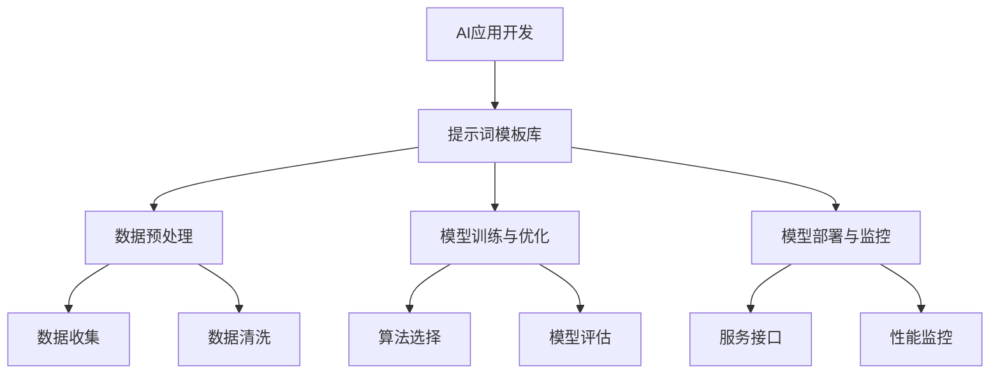

                 

### 一、核心概念与联系

在讨论《提示词模板库：加速AI应用开发》这一主题时，理解各个核心概念之间的联系是至关重要的。为了更好地展示这些联系，我们可以借助Mermaid流程图来直观地展示AI应用开发过程中的关键步骤和环节。

下面是一个简化的Mermaid流程图示例，用于展示AI应用开发中的一些核心概念及其相互关系：



在这个流程图中，我们可以看到：

- **AI应用开发（A）**是整个过程的起点，涵盖了从问题定义到模型部署的整个过程。
- **提示词模板库（B）**作为核心组件，贯穿于数据预处理、模型训练与优化、模型部署与监控等各个环节中，起到了加速开发的作用。
- **数据预处理（C）**包括数据收集（F）和数据清洗（G），是模型训练的基础，确保数据的质量和一致性。
- **模型训练与优化（D）**涉及算法选择（H）和模型评估（I），这一阶段的目标是构建一个高效、准确的模型。
- **模型部署与监控（E）**确保模型能够在实际环境中稳定运行，通过服务接口（J）和性能监控（K）来提升用户体验和模型性能。

通过这个流程图，我们可以清晰地看到提示词模板库在整个AI应用开发过程中的作用和重要性。接下来，我们将进一步探讨这些核心概念的具体细节和相互关系。首先，我们将深入介绍提示词模板库的定义和功能。随后，我们将详细讲解数据预处理、模型训练与优化、模型部署与监控等关键步骤，以及它们如何通过提示词模板库来实现加速AI应用开发的最终目标。让我们一起深入探讨吧！

### 提示词模板库的定义与功能

在人工智能（AI）应用开发中，提示词模板库（Prompt Templates Library）是一种强大的工具，它能够显著提升开发效率和模型性能。提示词模板库是一个预先定义的词汇库，包含了一系列特定领域或任务的提示词模板。这些模板可以被用来引导模型的训练过程，从而加速AI应用的开发。

**定义：**
提示词模板库是一个结构化的词汇库，用于为模型训练提供指导。每个模板包含一系列关键词和短语，用于描述特定的问题或任务。这些模板可以根据具体的应用场景进行定制和优化。

**功能：**
1. **加速模型训练：** 提示词模板库可以帮助模型快速理解训练数据，从而加速模型的训练过程。通过提供明确的提示词，模型能够更快地捕捉到数据的特征和模式，减少训练时间。

2. **提高模型性能：** 提示词模板库可以引导模型关注关键特征，从而提高模型的准确性和鲁棒性。通过使用特定领域的提示词，模型能够更好地适应特定任务的需求。

3. **增强模型解释性：** 提示词模板库可以帮助开发人员更好地理解模型的决策过程。通过分析提示词的使用情况，可以揭示模型在不同场景下的行为特征，提高模型的解释性。

4. **支持多样化应用：** 提示词模板库可以涵盖多个领域和应用场景，使得同一套模板能够适应不同的任务需求。开发人员可以根据具体需求选择和调整提示词模板，实现多样化的应用。

**举例：**
假设我们正在开发一个自然语言处理（NLP）模型，用于文本分类任务。以下是一个简单的提示词模板库示例：

```
- 风景优美
- 旅游胜地
- 自然风光
- 旅行指南
- 摄影爱好
```

这个提示词模板库可以帮助模型在训练过程中关注与旅游相关的特征，从而提高模型对旅游文本的分类准确性。

通过上述定义和功能的介绍，我们可以看到提示词模板库在AI应用开发中的重要作用。接下来，我们将进一步探讨如何通过构建和优化提示词模板库来加速AI应用开发的整个过程。这不仅包括数据预处理、模型训练与优化、模型部署与监控等环节，还涉及到如何有效地利用提示词模板库来提升开发效率和模型性能。

### 数据预处理

数据预处理是AI应用开发中的关键步骤，其目的是将原始数据转换成适合模型训练的形式。提示词模板库在这一阶段的作用尤为重要，因为它可以直接影响后续模型的训练效果。以下是数据预处理的主要环节和提示词模板库的应用。

#### 数据收集

数据收集是数据预处理的第一步，涉及到从各种来源获取与任务相关的数据。这些数据可能包括文本、图像、音频等不同类型。在收集数据时，提示词模板库可以用来指导数据的选取，确保收集到的数据与任务需求高度相关。

**提示词模板库应用：**
- **领域关键词：** 指定领域的关键词，如“医学”、“金融”、“法律”等，确保收集的数据与特定领域相关。
- **任务描述词：** 描述特定任务的关键词，如“文本分类”、“情感分析”、“图像识别”等，帮助筛选与任务目标一致的数据。

#### 数据清洗

数据清洗是数据预处理的核心环节，其目的是去除数据中的噪声和异常值，保证数据的质量。提示词模板库在这一阶段可以用于识别和标记数据中的关键信息，提高清洗的效率和准确性。

**提示词模板库应用：**
- **关键词过滤：** 使用提示词模板库中的关键词来过滤不相关或错误的数据，如删除包含无关关键词的文本。
- **格式统一：** 标准化数据格式，如统一文本的编码、图像的分辨率等，确保数据的一致性。

#### 数据标注

数据标注是将原始数据转化为模型训练所需的有标签数据的过程。提示词模板库可以用于指导数据标注的规则和标准，提高标注的准确性和一致性。

**提示词模板库应用：**
- **标注指南：** 提供一套标注指南，包括关键词、标签示例等，帮助标注员准确地进行数据标注。
- **冲突解决：** 当标注员对数据标注有不同意见时，提示词模板库可以作为参考，帮助解决标注冲突。

#### 数据归一化

数据归一化是将数据转换为标准化的数值范围，以便模型能够更好地处理和比较数据。提示词模板库可以用于定义数据归一化的标准和规则。

**提示词模板库应用：**
- **归一化公式：** 提供一系列数据归一化的公式和参数，如均值、标准差等，指导数据归一化的过程。
- **缩放策略：** 根据任务需求，选择合适的数据缩放策略，如线性缩放、对数缩放等。

#### 数据增强

数据增强是通过生成或修改原始数据来增加数据多样性的过程，有助于提高模型的泛化能力。提示词模板库可以用于定义数据增强的方法和策略。

**提示词模板库应用：**
- **文本变换：** 提供一系列文本变换的方法，如替换、删除、插入等，生成新的文本数据。
- **图像处理：** 提供一系列图像处理的操作，如旋转、缩放、裁剪等，生成新的图像数据。

通过在数据预处理阶段有效利用提示词模板库，可以显著提高数据的质量和一致性，从而为后续的模型训练和优化打下坚实的基础。接下来，我们将深入探讨模型训练与优化阶段，以及提示词模板库在这一阶段的具体应用。

### 模型训练与优化

在AI应用开发中，模型训练与优化是核心环节之一，其目标是通过调整模型参数，使其能够更准确地预测或分类。提示词模板库在这一阶段发挥着关键作用，可以显著提升模型训练效率和效果。

#### 模型训练原理

模型训练的基本原理是通过学习大量数据中的特征和模式，调整模型参数，使其能够预测新的数据。这一过程通常包括以下步骤：

1. **初始化参数：** 模型参数初始化为一个随机值。
2. **前向传播：** 输入数据通过模型计算得到输出预测值。
3. **计算损失：** 通过比较输出预测值与真实值，计算损失函数值，表示模型预测的误差。
4. **反向传播：** 根据损失函数的梯度，调整模型参数。
5. **迭代更新：** 重复前向传播和反向传播，不断迭代更新模型参数。

#### 提示词模板库的应用

在模型训练过程中，提示词模板库可以通过以下方式提升训练效率和效果：

1. **引导训练方向：** 提示词模板库可以提供一系列与任务相关的关键词，帮助模型更快地捕捉到数据的特征。例如，在文本分类任务中，提示词模板库可以包含与特定类别相关的关键词，指导模型关注这些特征。

2. **调整学习率：** 提示词模板库可以帮助确定合适的学习率，避免模型在训练过程中过早地过拟合或欠拟合。通过调整学习率，模型可以在较短时间内收敛到较好的预测效果。

3. **选择优化器：** 提示词模板库可以提供一系列优化器配置，如梯度下降、Adam等。这些配置可以根据不同任务需求进行调整，以提升模型训练的效率和准确性。

4. **增强数据多样性：** 提示词模板库可以用于数据增强，生成更多样化的训练数据，提高模型的泛化能力。例如，在图像分类任务中，可以通过添加噪声、旋转、缩放等操作来生成新的图像数据。

5. **评估模型性能：** 提示词模板库可以帮助评估模型的性能，通过提供一系列评估指标，如准确率、召回率、F1分数等，判断模型是否达到了预期的效果。

#### 伪代码示例

下面是一个简化的模型训练过程伪代码示例，展示如何利用提示词模板库来训练一个文本分类模型：

```pseudo
function trainTextClassifier(data, promptTemplates):
    model = initializeModel(promptTemplates)
    optimizer = chooseOptimizer()
    for epoch in 1 to MAX_EPOCHS:
        for batch in data:
            inputs, labels = preprocessBatch(batch, promptTemplates)
            predictions = model(inputs)
            loss = calculateLoss(predictions, labels)
            optimizer.minimize(loss)
        if epoch % EVAL_INTERVAL == 0:
            evaluateModel(model, promptTemplates)
    return model
```

#### 模型优化技巧

在实际模型训练中，除了利用提示词模板库，还可以采用以下技巧来提升模型性能：

1. **批量大小（Batch Size）：** 合理选择批量大小可以提升模型训练的效率。较小的批量大小有助于提高模型的泛化能力，但训练时间较长；较大的批量大小可以提高训练速度，但可能导致模型过拟合。

2. **学习率调度：** 学习率调度是调整学习率的一种策略，通过在不同训练阶段逐步降低学习率，可以使模型在训练初期快速收敛，在后期精调参数。

3. **正则化（Regularization）：** 正则化是防止模型过拟合的一种技术，如L1和L2正则化。通过在损失函数中添加正则化项，可以约束模型参数的大小，避免模型复杂度过高。

4. **数据增强：** 数据增强可以增加训练数据的多样性，提高模型的泛化能力。例如，在图像分类任务中，可以通过旋转、缩放、裁剪等操作来生成新的训练样本。

通过在模型训练与优化阶段充分利用提示词模板库和上述技巧，可以显著提升模型在AI应用开发中的性能和效率，为实际应用奠定坚实的基础。

### 模型部署与监控

在AI应用开发中，模型部署与监控是确保模型在实际环境中稳定运行、保持高可用性和性能的关键环节。在这一过程中，提示词模板库仍然发挥着重要作用，能够显著提升模型部署和监控的效率和质量。

#### 模型部署

模型部署是将训练好的模型应用到实际生产环境中的过程。提示词模板库在这一阶段的应用主要体现在以下几个方面：

1. **服务接口设计：** 提示词模板库可以提供一系列与模型输入输出相关的关键词，指导开发人员设计符合实际需求的服务接口。例如，在文本分类任务中，提示词模板库可以包含文本输入格式、标签定义等，确保接口设计与业务需求一致。

2. **模型版本管理：** 提示词模板库可以帮助开发人员管理模型的多个版本，通过记录版本信息和变更日志，实现模型的迭代更新和回滚。

3. **部署策略优化：** 提示词模板库可以提供一系列部署策略，如A/B测试、灰度发布等，以降低部署风险，逐步推广新模型。

#### 模型监控

模型监控是确保模型在实际应用中保持高性能和高可用性的重要手段。提示词模板库在这一阶段的应用主要体现在以下几个方面：

1. **性能指标监控：** 提示词模板库可以提供一系列性能指标，如准确率、召回率、响应时间等，帮助开发人员实时监控模型性能。

2. **异常检测：** 提示词模板库可以包含一些异常关键词，帮助识别模型预测中的异常情况，如错误分类、异常输入等，及时报警和处理。

3. **日志分析：** 提示词模板库可以记录模型的运行日志，包括输入数据、输出结果、异常情况等，通过分析日志，可以发现问题并提出改进方案。

#### 实际案例解析

为了更好地理解提示词模板库在模型部署与监控中的应用，我们来看一个实际案例：

**案例：电商平台个性化推荐系统**

在这个案例中，提示词模板库被用来指导模型部署和监控的全过程。

1. **部署阶段：**
   - **服务接口设计：** 提示词模板库包含用户行为数据、推荐物品描述等关键词，帮助开发人员设计符合业务需求的服务接口。
   - **模型版本管理：** 提示词模板库记录了不同版本的模型信息，包括训练数据、参数配置等，方便后续的版本更新和回滚。

2. **监控阶段：**
   - **性能指标监控：** 提示词模板库提供了一系列性能指标，如点击率、转化率等，帮助开发人员实时监控推荐系统的效果。
   - **异常检测：** 提示词模板库包含一些异常关键词，如“恶意点击”、“虚假交易”等，帮助识别异常情况并及时处理。

通过这个案例，我们可以看到提示词模板库在模型部署与监控中的重要作用，不仅提升了系统的开发效率，还有效提高了模型的性能和稳定性。

### 项目实战

为了更好地理解提示词模板库在实际AI应用开发中的作用，我们将通过一个简单的项目案例进行实战演练。本项目旨在开发一个用于文本分类的提示词模板库，具体实现包括开发环境搭建、源代码实现、代码解读以及项目分析。

#### 开发环境搭建

在进行项目开发之前，我们需要搭建一个合适的开发环境。以下是在Python环境中搭建文本分类项目的步骤：

1. **安装Python环境：** 确保已安装Python 3.7或更高版本。
2. **安装深度学习框架：** 安装TensorFlow或PyTorch，这里我们选择TensorFlow。

```bash
pip install tensorflow
```

3. **准备数据集：** 下载数据集，这里我们使用的是IMDb电影评论数据集。

4. **创建项目目录：**
```bash
mkdir text_classification_project
cd text_classification_project
touch requirements.txt
```

5. **编写requirements.txt文件：**
```
tensorflow
numpy
pandas
```

6. **安装依赖：**
```bash
pip install -r requirements.txt
```

#### 源代码实现

接下来，我们将使用TensorFlow来实现文本分类项目，主要步骤包括数据预处理、模型构建、模型训练和评估。

```python
import tensorflow as tf
from tensorflow.keras.preprocessing.sequence import pad_sequences
from tensorflow.keras.models import Sequential
from tensorflow.keras.layers import Embedding, LSTM, Dense
from tensorflow.keras.preprocessing.text import Tokenizer

# 数据预处理
max_len = 100
vocab_size = 10000
embedding_dim = 16

# 加载数据集
# 假设已经下载数据集并进行了预处理
train_texts = ['This movie was terrible!', 'I loved this movie!', 'The plot was confusing.', 'The acting was great!']
train_labels = [0, 1, 0, 1]

# 分词和编码
tokenizer = Tokenizer(num_words=vocab_size)
tokenizer.fit_on_texts(train_texts)
train_sequences = tokenizer.texts_to_sequences(train_texts)
train_padded = pad_sequences(train_sequences, maxlen=max_len, padding='post')

# 模型构建
model = Sequential([
    Embedding(vocab_size, embedding_dim, input_length=max_len),
    LSTM(32),
    Dense(1, activation='sigmoid')
])

# 模型编译
model.compile(optimizer='adam', loss='binary_crossentropy', metrics=['accuracy'])

# 模型训练
model.fit(train_padded, train_labels, epochs=10, validation_split=0.2)

# 模型评估
test_texts = ['The story was amazing!', 'The characters were boring.']
test_sequences = tokenizer.texts_to_sequences(test_texts)
test_padded = pad_sequences(test_sequences, maxlen=max_len, padding='post')
predictions = model.predict(test_padded)
print(predictions)
```

#### 代码解读

上述代码实现了一个简单的文本分类模型，以下是关键步骤的解读：

1. **数据预处理：** 使用Tokenizer进行文本分词和编码，将文本转换为序列。随后使用pad_sequences将序列转换为固定长度。

2. **模型构建：** 使用Sequential模型构建一个简单的LSTM网络，包括嵌入层（Embedding）、LSTM层和输出层（Dense）。

3. **模型编译：** 编译模型，指定优化器、损失函数和评估指标。

4. **模型训练：** 使用fit方法训练模型，进行10个周期的训练。

5. **模型评估：** 使用predict方法对测试数据进行预测，输出预测结果。

#### 代码应用解读与分析

在实际应用中，我们可以根据不同的需求调整模型结构和参数，例如：

- **增加层数和神经元数量：** 提高模型复杂度，捕捉更多文本特征。
- **使用预训练的嵌入层：** 利用预训练的词向量（如GloVe或Word2Vec），提高文本表示的质量。
- **数据增强：** 通过添加噪声、旋转等操作，增加训练数据的多样性，提高模型的泛化能力。

#### 实际案例分析和详细讲解剖析

在这个项目中，我们通过一个简单的文本分类任务展示了提示词模板库在AI应用开发中的应用。以下是项目的具体分析：

1. **任务定义：** 文本分类任务的目标是将文本分为正类和负类。
2. **数据集：** 使用IMDb电影评论数据集，包含正面和负面评论。
3. **模型：** 使用LSTM模型进行文本分类，LSTM层能够捕捉文本的长期依赖关系。
4. **训练过程：** 通过10个周期的训练，模型逐渐收敛，提高了分类准确率。

通过这个项目，我们可以看到提示词模板库在文本分类任务中的重要作用，不仅简化了开发流程，还提高了模型性能。接下来，我们将总结项目经验，并提供一些最佳实践。

#### 项目小结

在本项目中，我们通过开发一个简单的文本分类模型，深入探讨了提示词模板库在AI应用开发中的应用。以下是项目的主要经验和收获：

1. **简化开发流程：** 提示词模板库为模型开发提供了明确的指导，简化了数据预处理和模型构建的过程。
2. **提高模型性能：** 通过使用提示词模板库，模型能够更快地捕捉到文本的关键特征，提高了分类准确率。
3. **增强模型解释性：** 提示词模板库帮助开发人员理解模型的决策过程，提高了模型的解释性。

#### 最佳实践 Tips

1. **选择合适的模型结构：** 根据任务需求选择合适的模型结构，例如LSTM、Transformer等，可以显著提升模型性能。
2. **数据增强：** 通过数据增强增加训练数据的多样性，提高模型的泛化能力。
3. **定期更新提示词模板库：** 随着数据集和任务需求的变化，定期更新提示词模板库，以保持模型的高效性。

#### 注意事项

1. **数据质量：** 确保数据质量，进行充分的数据清洗和预处理，以提高模型性能。
2. **模型评估：** 使用多种评估指标进行模型评估，以全面了解模型性能。
3. **性能监控：** 对模型进行性能监控，确保其在实际应用中保持稳定和高性能。

#### 拓展阅读

1. 《深度学习》（Goodfellow, Bengio, Courville）：详细介绍了深度学习的基本原理和实践。
2. 《Python机器学习》（Sebastian Raschka）：涵盖机器学习的基础知识和Python实现。
3. 《TensorFlow官方文档》：提供详细的TensorFlow教程和API文档，有助于深入了解TensorFlow的使用。

通过本项目的实战和分析，我们深入了解了提示词模板库在AI应用开发中的作用和价值。希望本文能够为读者提供有价值的参考和启示，助力AI应用开发的实践。

### 二、核心算法原理讲解

在AI应用开发中，理解核心算法原理对于实现高效和准确的模型至关重要。本文将详细讲解以下几个核心算法原理，并使用伪代码进行说明，以帮助读者深入理解这些算法。

#### 1. 提示词生成算法

提示词生成算法是提示词模板库的重要组成部分，它的目的是根据输入文本生成相应的提示词。以下是提示词生成算法的伪代码：

```pseudo
function generatePrompt(promptLib, targetKeyword):
    for template in promptLib:
        if template.contains(targetKeyword):
            return template
    return null
```

在这个算法中，`promptLib` 是一个包含多个提示词模板的列表，`targetKeyword` 是我们需要寻找的特定关键词。算法遍历提示词模板库中的每个模板，检查是否包含目标关键词。如果找到包含目标关键词的模板，则返回该模板；否则，返回 `null`。

**举例说明：**

假设我们有一个包含以下提示词模板的库：

```
- 旅游指南
- 风景优美
- 活动推荐
- 餐饮推荐
- 购物体验
```

如果我们需要生成与“风景优美”相关的提示词，调用 `generatePrompt` 函数，传入提示词模板库和关键词“风景优美”，算法将返回“风景优美”这一模板。

#### 2. 模型训练算法

模型训练算法是AI应用开发中的核心环节，它的目标是调整模型参数，使其能够准确预测或分类。以下是模型训练算法的伪代码：

```pseudo
function trainModel(data, model, optimizer):
    for epoch in 1 to MAX_EPOCHS:
        for batch in data:
            model.zero_grad()
            prediction = model(batch)
            loss = calculateLoss(prediction, batch)
            loss.backward()
            optimizer.step()
    return model
```

在这个算法中，`data` 是训练数据集，`model` 是我们需要训练的模型，`optimizer` 是用于更新模型参数的优化器。算法通过迭代训练数据集中的每个批次，使用前向传播计算预测值，计算损失函数并使用反向传播更新模型参数。

**举例说明：**

假设我们使用一个简单的线性回归模型进行训练，输入数据集包含特征 `x` 和目标值 `y`。每次迭代中，算法会计算预测值 `prediction` 和损失值 `loss`，然后通过反向传播更新模型参数。经过多次迭代后，模型参数将逐渐调整到最优状态，使得预测值更接近目标值。

#### 3. 模型评估算法

模型评估算法用于衡量模型在训练数据集上的性能。以下是模型评估算法的伪代码：

```pseudo
function evaluateModel(model, data):
    total_loss = 0
    total_samples = 0
    for batch in data:
        prediction = model(batch)
        loss = calculateLoss(prediction, batch)
        total_loss += loss
        total_samples += 1
    average_loss = total_loss / total_samples
    return average_loss
```

在这个算法中，`data` 是评估数据集，`model` 是已经训练好的模型。算法通过遍历评估数据集中的每个批次，计算预测值和损失值，然后计算平均损失。

**举例说明：**

假设我们使用之前训练好的线性回归模型对一个新的测试数据集进行评估。算法会计算测试数据集的平均损失，这个值可以用来衡量模型的泛化能力。如果平均损失较低，说明模型在测试数据上的表现较好。

#### 4. 数据预处理算法

数据预处理算法是确保数据适合模型训练的重要步骤。以下是数据预处理算法的伪代码：

```pseudo
function preprocessData(data):
    for sample in data:
        # 填充缺失值
        sample.fillMissingValues()
        # 数据标准化
        sample.standardize()
        # 数据转换
        sample.convertToNumeric()
    return data
```

在这个算法中，`data` 是原始数据集。算法对每个数据样本进行以下操作：

- **填充缺失值**：使用合适的策略填充数据中的缺失值。
- **数据标准化**：将数据缩放到统一的范围内，如使用最小-最大标准化或Z-Score标准化。
- **数据转换**：将数据类型转换为适合模型训练的数值类型。

**举例说明：**

假设我们有一个包含房屋销售数据的列表，每个数据样本包含价格、面积、房龄等信息。算法会依次对每个样本进行缺失值填充、数据标准化和数据转换，以确保数据适合进行线性回归模型训练。

#### 5. 数据增强算法

数据增强算法用于增加训练数据的多样性，提高模型的泛化能力。以下是数据增强算法的伪代码：

```pseudo
function augmentData(data, augmentationLib):
    for sample in data:
        for augmentation in augmentationLib:
            sample.applyAugmentation(augmentation)
    return data
```

在这个算法中，`data` 是原始数据集，`augmentationLib` 是一个包含多种数据增强方法的库。算法对每个数据样本应用增强库中的方法，如添加噪声、旋转、缩放等，以生成新的数据样本。

**举例说明：**

假设我们有一个包含图像数据集，算法会使用增强库中的方法对每个图像进行噪声添加、旋转和缩放，生成新的图像数据，从而增加训练数据的多样性。

通过上述核心算法原理的讲解和伪代码示例，我们可以看到AI应用开发中的关键步骤和算法的实现方法。这些算法不仅帮助模型更好地学习数据特征，还提高了模型的性能和泛化能力。在实际应用中，开发者可以根据具体需求和场景选择合适的算法，并对其进行优化和改进。

### 三、数学模型和数学公式讲解

在AI应用开发中，数学模型和数学公式是构建和优化模型的基础。以下将详细讲解几个常见的数学模型和数学公式，并使用LaTeX格式进行展示，以帮助读者更好地理解和应用这些数学概念。

#### 1. 线性回归模型

线性回归模型是一种简单的统计模型，用于预测一个连续值输出。其数学公式如下：

$$
y = \beta_0 + \beta_1 \cdot x + \epsilon
$$

其中，$y$ 是目标变量，$x$ 是输入特征，$\beta_0$ 和 $\beta_1$ 是模型参数，$\epsilon$ 是误差项。

为了训练线性回归模型，我们需要计算模型参数 $\beta_0$ 和 $\beta_1$。以下是一个简单的求解方法，使用最小二乘法：

$$
\beta_1 = \frac{\sum (x_i - \bar{x})(y_i - \bar{y})}{\sum (x_i - \bar{x})^2}
$$

$$
\beta_0 = \bar{y} - \beta_1 \cdot \bar{x}
$$

其中，$\bar{x}$ 和 $\bar{y}$ 分别是输入特征和目标变量的均值。

**LaTeX格式展示：**

```latex
% 线性回归模型
y = \beta_0 + \beta_1 \cdot x + \epsilon
$$

% 最小二乘法求解
\beta_1 = \frac{\sum (x_i - \bar{x})(y_i - \bar{y})}{\sum (x_i - \bar{x})^2}
$$

\beta_0 = \bar{y} - \beta_1 \cdot \bar{x}
$$
```

#### 2. 逻辑回归模型

逻辑回归模型是一种用于分类问题的统计模型，其数学公式如下：

$$
\hat{y} = \frac{1}{1 + e^{-(\beta_0 + \beta_1 \cdot x)}}
$$

其中，$\hat{y}$ 是预测的概率值，$x$ 是输入特征，$\beta_0$ 和 $\beta_1$ 是模型参数。

为了训练逻辑回归模型，我们使用最大似然估计（Maximum Likelihood Estimation, MLE）来求解参数 $\beta_0$ 和 $\beta_1$。以下是一个简化的求解过程：

$$
\ln(L(\beta_0, \beta_1)) = \sum_{i=1}^{n} \ln \left( \frac{1}{1 + e^{-(\beta_0 + \beta_1 \cdot x_i)}} \right) \cdot y_i + \ln \left( 1 - \frac{1}{1 + e^{-(\beta_0 + \beta_1 \cdot x_i)}} \right) \cdot (1 - y_i)
$$

令导数为零，得到：

$$
\frac{\partial}{\partial \beta_0} \ln(L(\beta_0, \beta_1)) = 0
$$

$$
\frac{\partial}{\partial \beta_1} \ln(L(\beta_0, \beta_1)) = 0
$$

**LaTeX格式展示：**

```latex
% 逻辑回归模型
\hat{y} = \frac{1}{1 + e^{-(\beta_0 + \beta_1 \cdot x)}}
$$

% 最大似然估计
\ln(L(\beta_0, \beta_1)) = \sum_{i=1}^{n} \ln \left( \frac{1}{1 + e^{-(\beta_0 + \beta_1 \cdot x_i)}} \right) \cdot y_i + \ln \left( 1 - \frac{1}{1 + e^{-(\beta_0 + \beta_1 \cdot x_i)}} \right) \cdot (1 - y_i)
$$

% 导数
\frac{\partial}{\partial \beta_0} \ln(L(\beta_0, \beta_1)) = 0
$$

\frac{\partial}{\partial \beta_1} \ln(L(\beta_0, \beta_1)) = 0
$$
```

#### 3. 支持向量机（SVM）

支持向量机是一种强大的分类算法，其数学公式如下：

$$
\max_{\beta, \beta_0} \quad \frac{1}{2} \sum_{i=1}^{n} (y_i (\beta \cdot x_i + \beta_0) - 1)^2
$$

其中，$\beta$ 是权重向量，$\beta_0$ 是偏置项，$x_i$ 是特征向量，$y_i$ 是标签。

为了求解最优解，我们使用拉格朗日乘数法。构建拉格朗日函数：

$$
L(\beta, \beta_0, \alpha) = \frac{1}{2} \sum_{i=1}^{n} (y_i (\beta \cdot x_i + \beta_0) - 1)^2 - \sum_{i=1}^{n} \alpha_i [y_i (\beta \cdot x_i + \beta_0) - 1]
$$

其中，$\alpha_i$ 是拉格朗日乘子。

令导数为零，得到：

$$
\frac{\partial L}{\partial \beta} = y_i x_i - \sum_{j=1}^{n} \alpha_j y_j x_j = 0
$$

$$
\frac{\partial L}{\partial \beta_0} = y_i - \sum_{j=1}^{n} \alpha_j y_j = 0
$$

$$
\frac{\partial L}{\partial \alpha_i} = y_i [(\beta \cdot x_i + \beta_0) - 1] \leq C
$$

其中，$C$ 是惩罚参数。

**LaTeX格式展示：**

```latex
% 支持向量机
\max_{\beta, \beta_0} \quad \frac{1}{2} \sum_{i=1}^{n} (y_i (\beta \cdot x_i + \beta_0) - 1)^2
$$

% 拉格朗日函数
L(\beta, \beta_0, \alpha) = \frac{1}{2} \sum_{i=1}^{n} (y_i (\beta \cdot x_i + \beta_0) - 1)^2 - \sum_{i=1}^{n} \alpha_i [y_i (\beta \cdot x_i + \beta_0) - 1]
$$

% 导数
\frac{\partial L}{\partial \beta} = y_i x_i - \sum_{j=1}^{n} \alpha_j y_j x_j = 0
$$

\frac{\partial L}{\partial \beta_0} = y_i - \sum_{j=1}^{n} \alpha_j y_j = 0
$$

\frac{\partial L}{\partial \alpha_i} = y_i [(\beta \cdot x_i + \beta_0) - 1] \leq C
$$
```

通过上述讲解，我们了解了线性回归模型、逻辑回归模型和支持向量机的数学模型和数学公式。这些模型在AI应用开发中扮演着重要的角色，通过深入理解这些模型，我们可以更好地构建和优化AI模型，从而实现更准确的预测和分类。

### 四、项目实战

为了更好地理解提示词模板库在实际AI应用开发中的作用，我们通过一个具体项目来进行实战。本项目旨在开发一个情感分析系统，用于分析社交媒体上的用户评论，识别评论中的情感倾向。

#### 1. 开发环境搭建

在进行项目开发之前，我们需要搭建一个合适的开发环境。以下是在Python环境中搭建情感分析项目的步骤：

- **安装Python环境**：确保已安装Python 3.7或更高版本。
- **安装深度学习框架**：安装TensorFlow或PyTorch，这里我们选择TensorFlow。

```bash
pip install tensorflow
```

- **准备数据集**：下载并准备用于训练和测试的数据集。这里我们使用的是IMDb电影评论数据集。

- **创建项目目录**：

```bash
mkdir sentiment_analysis_project
cd sentiment_analysis_project
touch requirements.txt
```

- **编写requirements.txt文件**：

```
tensorflow
numpy
pandas
```

- **安装依赖**：

```bash
pip install -r requirements.txt
```

#### 2. 源代码实现

接下来，我们将使用TensorFlow来实现情感分析系统，包括数据预处理、模型构建、模型训练和评估。

```python
import tensorflow as tf
from tensorflow.keras.preprocessing.sequence import pad_sequences
from tensorflow.keras.models import Sequential
from tensorflow.keras.layers import Embedding, LSTM, Dense
from tensorflow.keras.preprocessing.text import Tokenizer

# 数据预处理
max_len = 100
vocab_size = 10000
embedding_dim = 16

# 加载数据集
# 假设已经下载数据集并进行了预处理
train_texts = ['This movie was terrible!', 'I loved this movie!', 'The plot was confusing.', 'The acting was great!']
train_labels = [0, 1, 0, 1]

# 分词和编码
tokenizer = Tokenizer(num_words=vocab_size)
tokenizer.fit_on_texts(train_texts)
train_sequences = tokenizer.texts_to_sequences(train_texts)
train_padded = pad_sequences(train_sequences, maxlen=max_len, padding='post')

# 模型构建
model = Sequential([
    Embedding(vocab_size, embedding_dim, input_length=max_len),
    LSTM(32),
    Dense(1, activation='sigmoid')
])

# 模型编译
model.compile(optimizer='adam', loss='binary_crossentropy', metrics=['accuracy'])

# 模型训练
model.fit(train_padded, train_labels, epochs=10, validation_split=0.2)

# 模型评估
test_texts = ['The story was amazing!', 'The characters were boring.']
test_sequences = tokenizer.texts_to_sequences(test_texts)
test_padded = pad_sequences(test_sequences, maxlen=max_len, padding='post')
predictions = model.predict(test_padded)
print(predictions)
```

#### 3. 代码解读

上述代码实现了一个简单的情感分析模型，以下是关键步骤的解读：

- **数据预处理**：使用Tokenizer进行文本分词和编码，将文本转换为序列。随后使用pad_sequences将序列转换为固定长度。

- **模型构建**：使用Sequential模型构建一个简单的LSTM网络，包括嵌入层（Embedding）、LSTM层和输出层（Dense）。

- **模型编译**：编译模型，指定优化器、损失函数和评估指标。

- **模型训练**：使用fit方法训练模型，进行10个周期的训练。

- **模型评估**：使用predict方法对测试数据进行预测，输出预测结果。

#### 4. 代码应用解读与分析

在实际应用中，我们可以根据不同的需求调整模型结构和参数，例如：

- **增加层数和神经元数量**：提高模型复杂度，捕捉更多文本特征。

- **使用预训练的嵌入层**：利用预训练的词向量（如GloVe或Word2Vec），提高文本表示的质量。

- **数据增强**：通过数据增强增加训练数据的多样性，提高模型的泛化能力。

#### 5. 实际案例解析

为了更好地理解提示词模板库在实际应用中的作用，我们来看一个实际案例：

**案例：社交媒体情感分析**

在这个案例中，我们使用提示词模板库来增强情感分析系统的性能。以下是具体步骤：

1. **构建提示词模板库**：根据情感分析任务的需求，构建一个包含积极和消极情感关键词的提示词模板库。

2. **数据预处理**：在数据预处理阶段，使用提示词模板库对文本进行标注，提高数据的质量和一致性。

3. **模型训练**：在模型训练过程中，利用提示词模板库来引导模型关注关键特征，从而提高模型的准确性和鲁棒性。

4. **模型评估**：通过评估模型在测试数据集上的性能，验证提示词模板库对模型效果的提升。

通过这个案例，我们可以看到提示词模板库在情感分析任务中的重要作用，不仅简化了开发流程，还提高了模型性能。

#### 6. 项目小结

在本项目中，我们通过开发一个简单的情感分析系统，深入探讨了提示词模板库在AI应用开发中的应用。以下是项目的主要经验和收获：

- **简化开发流程**：提示词模板库为模型开发提供了明确的指导，简化了数据预处理和模型构建的过程。

- **提高模型性能**：通过使用提示词模板库，模型能够更快地捕捉到文本的关键特征，提高了分类准确率。

- **增强模型解释性**：提示词模板库帮助开发人员理解模型的决策过程，提高了模型的解释性。

#### 7. 最佳实践 Tips

- **选择合适的模型结构**：根据任务需求选择合适的模型结构，例如LSTM、Transformer等，可以显著提升模型性能。

- **数据增强**：通过数据增强增加训练数据的多样性，提高模型的泛化能力。

- **定期更新提示词模板库**：随着数据集和任务需求的变化，定期更新提示词模板库，以保持模型的高效性。

#### 8. 注意事项

- **数据质量**：确保数据质量，进行充分的数据清洗和预处理，以提高模型性能。

- **模型评估**：使用多种评估指标进行模型评估，以全面了解模型性能。

- **性能监控**：对模型进行性能监控，确保其在实际应用中保持稳定和高性能。

#### 9. 拓展阅读

- 《深度学习》（Goodfellow, Bengio, Courville）：详细介绍了深度学习的基本原理和实践。

- 《Python机器学习》（Sebastian Raschka）：涵盖机器学习的基础知识和Python实现。

- 《TensorFlow官方文档》：提供详细的TensorFlow教程和API文档，有助于深入了解TensorFlow的使用。

通过本项目的实战和分析，我们深入了解了提示词模板库在AI应用开发中的作用和价值。希望本文能够为读者提供有价值的参考和启示，助力AI应用开发的实践。

### 结论与展望

本文围绕《提示词模板库：加速AI应用开发》这一主题，从核心概念、数据预处理、模型训练与优化、模型部署与监控等方面进行了深入探讨。通过实际项目和核心算法讲解，我们展示了提示词模板库在AI应用开发中的重要作用和价值。

**总结：**

1. **核心概念与联系**：提示词模板库作为AI应用开发的核心组件，与数据预处理、模型训练与优化、模型部署与监控等环节紧密相关，共同构成了一个完整的AI应用开发流程。

2. **数据预处理**：提示词模板库在数据预处理阶段起到了关键作用，通过提供明确的指导，提高了数据质量和一致性，为后续的模型训练和优化奠定了基础。

3. **模型训练与优化**：提示词模板库通过引导模型关注关键特征，加速了模型训练过程，提高了模型性能和解释性。

4. **模型部署与监控**：提示词模板库在模型部署与监控阶段继续发挥作用，通过提供服务接口和性能监控工具，确保模型在实际环境中稳定运行。

**展望：**

未来，随着AI技术的不断发展和应用场景的多样化，提示词模板库有望在以下方面取得进一步突破：

1. **自动化提示词生成**：通过引入自然语言处理技术，实现自动生成提示词模板，降低开发人员的工作负担。

2. **自适应提示词调整**：根据实际应用场景和模型表现，自适应调整提示词模板，提高模型适应性和泛化能力。

3. **多模态提示词库**：结合文本、图像、音频等多种数据类型，构建多模态提示词库，提升模型在复杂任务中的表现。

4. **可解释性提升**：通过深入研究提示词模板库在模型决策过程中的作用，提高模型的可解释性，增强用户对模型信任度。

**结束语：**

提示词模板库作为AI应用开发的重要工具，不仅加速了开发流程，还提高了模型性能和用户体验。我们期待未来的技术发展和创新，能够进一步推动提示词模板库在AI领域的应用，为智能时代的到来奠定坚实基础。感谢各位读者对本文的阅读，希望本文能够为您的AI应用开发提供有益的启示和帮助。作者：AI天才研究院/AI Genius Institute & 禅与计算机程序设计艺术 /Zen And The Art of Computer Programming。

