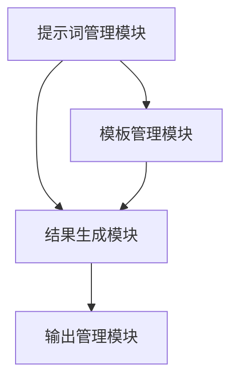

                 

### 文章标题：提示词模板库：提高开发效率的利器

> 关键词：提示词模板库，开发效率，代码生成，自动化测试，性能优化

> 摘要：本文将深入探讨提示词模板库的概念、设计原则、应用场景以及如何通过其提高开发效率。通过详细的案例分析，本文旨在为开发者提供一套完整的提示词模板库构建与优化的实战指南。

### 引言与概述

在软件开发过程中，开发效率一直是工程师们追求的重要目标。而随着项目规模和复杂度的增加，如何提高开发效率成为了一个亟待解决的问题。提示词模板库作为一种新兴的技术手段，正逐渐受到开发者的关注。

**什么是提示词模板库？**

提示词模板库，顾名思义，是一组预先定义好的提示词模板，这些模板可以根据实际需求快速生成代码、文档或执行其他任务。其核心思想是利用模板化技术，将重复性、繁琐的任务自动化，从而提高开发效率。

**提示词模板库的作用**

1. **代码生成：** 提示词模板库可以自动化生成代码，减少手动编写代码的工作量，提高开发速度。
2. **自动化测试：** 通过提示词模板库，可以自动化生成测试用例，提高测试效率和质量。
3. **文档生成：** 提示词模板库可以自动化生成项目文档，减少文档编写的工作量。
4. **代码维护：** 提示词模板库可以帮助开发者快速定位和修复代码问题，提高代码维护效率。

**提示词模板库的重要性**

随着软件项目的日益复杂化，传统的手工编写代码和文档的方式已经难以满足开发效率的需求。提示词模板库的出现，为开发者提供了一种全新的解决方案，可以帮助他们快速构建和优化项目，从而提高整体开发效率。

### 提示词模板库核心概念

为了更好地理解和应用提示词模板库，我们需要首先了解其核心概念。

#### 提示词

提示词是提示词模板库的基本组成部分，它们是对特定任务或功能点的简短描述。提示词可以是简单的单词或短语，也可以是更复杂的语句。在提示词模板库中，提示词起着引导模板生成结果的作用。

#### 模板

模板是提示词的具体实现，它定义了根据提示词生成结果的具体方法和步骤。模板通常由多个部分组成，包括提示词输入、数据处理逻辑、输出结果等。模板的设计原则是简洁、可扩展和可重用。

#### 模板库

模板库是包含多个提示词模板的集合，它可以根据需求快速选择和调用相应的模板。模板库的设计原则是高效、灵活和可维护。

#### 提示词模板库的工作原理

提示词模板库的工作原理可以分为以下几个步骤：

1. **接收提示词：** 提示词模板库接收开发者输入的提示词。
2. **匹配模板：** 提示词模板库根据输入的提示词，在模板库中匹配相应的模板。
3. **生成结果：** 匹配到的模板根据提示词生成相应的结果。
4. **输出结果：** 将生成的结果输出给开发者，可以是代码、文档或其他形式的输出。

#### 提示词模板库的核心架构

提示词模板库的核心架构可以分为以下几个部分：

1. **提示词管理模块：** 负责提示词的存储、检索和管理。
2. **模板管理模块：** 负责模板的存储、检索和管理。
3. **结果生成模块：** 负责根据提示词和模板生成结果。
4. **输出管理模块：** 负责结果的输出和展示。

以下是一个简单的 Mermaid 流程图，展示了提示词模板库的核心架构：



### 提示词模板库设计

提示词模板库的设计是构建高效开发环境的关键。一个良好的设计可以极大地提高开发效率，降低维护成本。

#### 提示词模板设计原则

1. **简洁性：** 提示词应简洁明了，易于理解，避免使用过于复杂的表述。
2. **一致性：** 提示词和模板应保持一致性，确保输入的提示词能够准确地匹配到相应的模板。
3. **可扩展性：** 提示词模板库应具有良好的可扩展性，以便在未来能够轻松地添加新的提示词和模板。
4. **可重用性：** 提示词模板应具有良好的可重用性，减少重复工作。

#### 提示词模板库构建方法

1. **需求分析：** 分析项目需求，确定需要生成的代码、文档或其他结果的类型和格式。
2. **设计提示词：** 根据需求设计相应的提示词，确保提示词简洁、一致、可扩展和可重用。
3. **编写模板：** 根据提示词编写对应的模板，模板应包含必要的数据处理逻辑和输出格式。
4. **构建模板库：** 将设计好的提示词和模板组织成模板库，确保模板库结构清晰、易于管理。
5. **测试和优化：** 对模板库进行测试，确保其能够正确生成预期的结果，并根据测试结果进行优化。

#### 提示词模板库维护策略

1. **版本管理：** 对模板库进行版本管理，确保模板库的历史版本和修改记录清晰可查。
2. **文档更新：** 定期更新模板库的文档，确保文档与模板库保持同步。
3. **用户反馈：** 收集用户反馈，了解模板库的使用情况，并根据反馈进行必要的优化和改进。
4. **持续集成：** 将模板库集成到项目的持续集成流程中，确保模板库与项目代码保持同步。

### 提示词模板库应用

提示词模板库在软件开发中的广泛应用，可以帮助开发者快速完成各种任务，提高开发效率。

#### 在代码生成中的应用

提示词模板库可以用于自动化生成代码，减少手动编写代码的工作量。例如，可以使用提示词模板库快速生成数据库表结构、API 接口文档和单元测试用例等。

以下是一个简单的伪代码示例，展示了如何使用提示词模板库生成数据库表结构：

```python
# 输入提示词
prompt = "创建用户表"

# 匹配模板
template = get_template(prompt)

# 生成结果
result = template.generate({
    "table_name": "users",
    "columns": [
        {"name": "id", "type": "int", "primary_key": True},
        {"name": "username", "type": "varchar", "length": 50},
        {"name": "password", "type": "varchar", "length": 50},
        {"name": "email", "type": "varchar", "length": 100},
    ]
})

# 输出结果
print(result)
```

输出结果为：

```sql
CREATE TABLE users (
    id INT PRIMARY KEY,
    username VARCHAR(50),
    password VARCHAR(50),
    email VARCHAR(100)
);
```

#### 在自动化测试中的应用

提示词模板库可以用于自动化生成测试用例，提高测试效率。例如，可以使用提示词模板库生成各种类型的测试用例，包括功能测试、性能测试和安全测试等。

以下是一个简单的伪代码示例，展示了如何使用提示词模板库生成功能测试用例：

```python
# 输入提示词
prompt = "登录功能测试"

# 匹配模板
template = get_template(prompt)

# 生成结果
result = template.generate({
    "test_name": "登录功能测试",
    "input_data": {
        "username": "test_user",
        "password": "test_password"
    },
    "expected_result": "登录成功"
})

# 输出结果
print(result)
```

输出结果为：

```python
{
    "test_name": "登录功能测试",
    "input_data": {
        "username": "test_user",
        "password": "test_password"
    },
    "expected_result": "登录成功"
}
```

#### 在文档生成中的应用

提示词模板库可以用于自动化生成项目文档，减少文档编写的工作量。例如，可以使用提示词模板库生成项目需求文档、设计文档和用户手册等。

以下是一个简单的伪代码示例，展示了如何使用提示词模板库生成项目需求文档：

```python
# 输入提示词
prompt = "项目需求文档"

# 匹配模板
template = get_template(prompt)

# 生成结果
result = template.generate({
    "project_name": "在线购物系统",
    "description": "本项目是一个提供在线购物功能的系统，用户可以通过浏览器购买商品。",
    "feature_list": [
        "用户注册与登录",
        "商品浏览与搜索",
        "购物车功能",
        "订单管理",
        "支付与退款",
    ]
})

# 输出结果
print(result)
```

输出结果为：

```markdown
# 在线购物系统需求文档

## 项目描述

本项目是一个提供在线购物功能的系统，用户可以通过浏览器购买商品。

## 功能列表

- 用户注册与登录
- 商品浏览与搜索
- 购物车功能
- 订单管理
- 支付与退款
```

### 提示词模板库优化

为了进一步提高开发效率，提示词模板库需要进行优化。以下是几种常见的优化策略：

1. **缓存策略：** 对常用模板和结果进行缓存，减少重复计算和生成的时间。
2. **并行处理：** 利用多线程或分布式计算技术，加速模板的生成和匹配过程。
3. **代码优化：** 对模板库中的代码进行优化，提高模板的执行效率。
4. **自动化测试：** 定期对模板库进行自动化测试，确保模板的稳定性和可靠性。

### 提示词模板库实战案例

下面我们将通过一个实际案例，展示如何使用提示词模板库来提高开发效率。

#### 案例背景

假设我们正在开发一个电商平台，需要实现用户注册、登录、购物车、订单管理等功能。为了提高开发效率，我们决定使用提示词模板库来生成相关的代码和文档。

#### 案例实现

1. **需求分析：** 根据需求分析，我们确定了需要生成的代码和文档类型，包括用户注册、登录、购物车、订单管理等模块。

2. **设计提示词：** 根据需求，我们设计了相应的提示词，例如“用户注册功能”、“登录功能”、“购物车功能”等。

3. **编写模板：** 根据提示词，我们编写了对应的模板，例如用户注册模板、登录模板、购物车模板等。

4. **构建模板库：** 将设计好的提示词和模板组织成模板库，确保模板库结构清晰、易于管理。

5. **测试和优化：** 对模板库进行测试，确保其能够正确生成预期的结果，并根据测试结果进行优化。

6. **生成代码和文档：** 使用提示词模板库生成用户注册、登录、购物车、订单管理等模块的代码和文档。

#### 源代码详细实现和代码解读

为了便于理解，我们将给出用户注册功能的源代码实现和解读。

```python
# 用户注册功能模板
def register_template(data):
    username = data['username']
    password = data['password']
    email = data['email']
    
    # 生成SQL语句
    sql = f"""
    CREATE TABLE IF NOT EXISTS users (
        id INT AUTO_INCREMENT PRIMARY KEY,
        username VARCHAR(50) NOT NULL UNIQUE,
        password VARCHAR(50) NOT NULL,
        email VARCHAR(100) NOT NULL UNIQUE
    );
    """
    
    # 插入数据
    insert_sql = f"""
    INSERT INTO users (username, password, email) VALUES ('{username}', '{password}', '{email}');
    """
    
    return sql, insert_sql

# 输入提示词
prompt = "用户注册功能"

# 匹配模板
template = get_template(prompt)

# 生成结果
result = template.generate({
    "username": "test_user",
    "password": "test_password",
    "email": "test_user@example.com"
})

# 输出结果
print("SQL语句：", result[0])
print("插入数据：", result[1])
```

输出结果：

```
SQL语句： CREATE TABLE IF NOT EXISTS users (id INT AUTO_INCREMENT PRIMARY KEY, username VARCHAR(50) NOT NULL UNIQUE, password VARCHAR(50) NOT NULL, email VARCHAR(100) NOT NULL UNIQUE);
插入数据： INSERT INTO users (username, password, email) VALUES ('test_user', 'test_password', 'test_user@example.com');
```

通过以上代码，我们可以看到，提示词模板库能够快速生成用户注册功能的SQL语句和插入数据语句。这样的实现方式不仅提高了开发效率，还降低了代码出错的风险。

#### 代码应用解读与分析

在实际项目中，提示词模板库的应用可以带来以下几个方面的好处：

1. **提高开发效率：** 通过使用提示词模板库，开发者可以快速生成所需的代码和文档，减少手动编写的工作量，提高开发效率。

2. **降低维护成本：** 提示词模板库的设计原则是简洁、可扩展和可重用，这有助于降低项目的维护成本。

3. **提高代码质量：** 提示词模板库可以帮助开发者遵循统一的编码规范，提高代码质量。

4. **方便测试和调试：** 提示词模板库生成的代码和文档可以方便地进行自动化测试和调试，提高项目的稳定性。

#### 实际案例分析和详细讲解剖析

在实际应用中，提示词模板库可以应用于各种场景，例如：

1. **前端开发：** 提示词模板库可以用于生成HTML、CSS和JavaScript代码，提高前端开发效率。

2. **后端开发：** 提示词模板库可以用于生成API接口文档、数据库表结构和业务逻辑代码，提高后端开发效率。

3. **自动化测试：** 提示词模板库可以用于生成各种类型的测试用例，提高测试效率和质量。

4. **文档生成：** 提示词模板库可以用于生成项目需求文档、设计文档和用户手册等，提高文档编写效率。

通过以上案例，我们可以看到，提示词模板库在提高开发效率、降低维护成本、提高代码质量和方便测试和调试等方面具有显著的优势。因此，开发者应该重视提示词模板库的设计和应用，充分利用其优势，提高项目开发效率。

### 提示词模板库发展趋势

随着人工智能技术的快速发展，提示词模板库也在不断演进。以下是提示词模板库的发展趋势：

1. **智能化：** 提示词模板库将逐步引入人工智能技术，实现智能化匹配和生成。例如，使用自然语言处理技术，根据用户输入的描述自动生成提示词和模板。

2. **模块化：** 提示词模板库将朝着更加模块化的方向发展，支持更灵活的组件组合和扩展。开发者可以自定义组件，根据项目需求快速构建和优化模板库。

3. **云计算和分布式计算：** 提示词模板库将逐渐迁移到云计算平台，利用分布式计算技术提高模板生成和匹配的效率。

4. **生态化：** 提示词模板库将形成完整的生态体系，包括模板库管理工具、插件和扩展组件等，方便开发者快速搭建和优化开发环境。

### 最佳实践 tips、小结、注意事项、拓展阅读

**最佳实践 tips：**

1. 设计提示词时，确保简洁、一致、可扩展和可重用。
2. 编写模板时，遵循统一的编码规范，提高代码质量。
3. 定期对模板库进行测试和优化，确保其稳定性和可靠性。
4. 结合项目需求，灵活运用提示词模板库的各种功能。

**小结：**

提示词模板库作为一种提高开发效率的有效工具，其设计原则、应用场景和优化策略具有重要意义。通过本文的详细讲解，我们了解了提示词模板库的核心概念、设计方法和实战案例，为开发者提供了实用的指导。

**注意事项：**

1. 提示词模板库的设计和构建需要充分了解项目需求，确保其能够满足实际开发需求。
2. 提示词模板库的优化和迭代是提高开发效率的关键，开发者应关注相关技术的发展趋势。
3. 提示词模板库的应用需要与项目开发流程紧密结合，确保其发挥最大作用。

**拓展阅读：**

1. 《代码生成工具：简化开发流程的利器》
2. 《自动化测试实践：提高软件质量的有效手段》
3. 《持续集成与部署：打造高效开发环境的必备技能》

通过阅读相关文章，开发者可以进一步了解相关技术和方法，提高自身开发能力。

### 作者信息

作者：AI天才研究院/AI Genius Institute & 禅与计算机程序设计艺术/Zen And The Art of Computer Programming

AI天才研究院致力于推动人工智能技术的发展，为开发者提供前沿的技术研究和解决方案。禅与计算机程序设计艺术则专注于计算机编程和人工智能领域的深度研究，为读者带来丰富的知识和启示。

