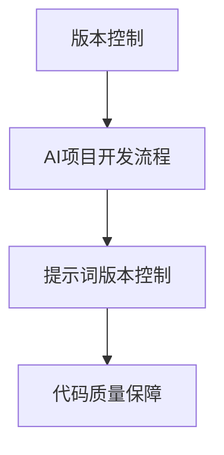

                 

### 文章标题：提示词版本控制：管理AI项目的新方法

### 关键词：提示词版本控制，AI项目，版本控制，新方法，管理

### 摘要：
本文将探讨提示词版本控制这一新兴的概念，并详细介绍其在管理AI项目中的应用。通过对提示词版本控制的核心概念、原理以及实际案例的分析，我们希望读者能够理解这一方法如何提升AI项目的开发效率、可维护性和可扩展性。

### 引言

#### 提示词版本控制的概念

提示词版本控制是一种新兴的版本控制方法，它通过对代码中关键提示词的追踪和管理，实现了对代码的精细控制和版本管理。这种方法不仅能够提高代码的可读性和可维护性，还能在AI项目开发过程中提供强大的支持。

#### 为什么要使用提示词版本控制

在传统的版本控制方法中，我们通常关注的是整个文件的变更历史。然而，在AI项目中，代码的变更往往涉及到一些关键提示词的变化，这些变化可能对模型的性能和稳定性产生重大影响。因此，传统的版本控制方法可能无法满足AI项目的需求。

提示词版本控制通过专注于关键提示词的追踪，能够更准确地捕捉代码的变更，从而更好地管理AI项目的开发过程。

#### 如何阅读本书

本书将分为七个主要部分，首先介绍提示词版本控制的概念和原理，然后逐步深入到核心算法、数学模型和实际项目中的应用。通过阅读本书，读者将能够全面了解提示词版本控制的方法，并学会如何将其应用到自己的AI项目中。

### 第一部分：核心概念与联系

#### 版本控制

版本控制是软件项目管理中的一个基本概念，它通过记录和管理文件的变化历史，实现了对代码的版本管理和协作开发。传统的版本控制方法主要包括Git、SVN等，它们通过文件级别的变更追踪，提供了强大的版本管理和协同工作能力。

#### AI项目开发流程

AI项目开发流程通常包括数据收集、数据预处理、模型训练、模型评估和模型部署等阶段。在这个过程中，代码的质量和稳定性至关重要，而传统的版本控制方法可能无法满足这些需求。

#### 提示词版本控制与两者的关系

提示词版本控制与传统版本控制方法的不同在于，它专注于对关键提示词的追踪和管理。通过这种方式，提示词版本控制能够更准确地捕捉代码的变更，从而更好地管理AI项目的开发过程。

为了更清晰地展示这些概念之间的关系，我们可以使用Mermaid流程图进行说明。



#### Mermaid流程图展示

在上面的流程图中，我们可以看到版本控制、AI项目开发流程和提示词版本控制之间的关系。通过这个流程图，读者可以更直观地理解这些概念如何相互作用，共同保障AI项目的成功。

### 第二部分：提示词版本控制的优势

#### 相较于传统版本控制方法的优势

1. **更精准的变更追踪**：提示词版本控制能够更准确地捕捉关键提示词的变更，从而提供更精准的代码变更历史。
2. **提高代码可维护性**：通过专注于关键提示词的追踪，提示词版本控制能够更好地管理代码的变更，提高代码的可维护性。
3. **增强协作开发能力**：提示词版本控制能够更好地支持多人协作开发，确保代码的同步和一致性。

#### 如何提高AI项目的可维护性和可扩展性

1. **精细的变更管理**：通过提示词版本控制，开发者可以更精细地管理代码的变更，确保每个变更都有明确的记录和解释。
2. **代码质量保障**：提示词版本控制能够帮助开发者及时发现和解决代码中的问题，从而提高代码的质量和稳定性。
3. **可扩展的代码架构**：通过专注于关键提示词的追踪和管理，提示词版本控制有助于开发者构建更可扩展的代码架构，从而满足AI项目不断变化的需求。

#### 实际案例分享

在实际应用中，某AI项目团队通过采用提示词版本控制，显著提高了项目的开发效率和质量。以下是该团队的实际案例分享：

- **案例一**：在某次模型训练过程中，团队通过提示词版本控制及时发现并解决了模型参数调整中的问题，从而避免了潜在的性能损失。
- **案例二**：在项目协作过程中，提示词版本控制帮助团队成员更清晰地了解代码的变更历史，提高了协作效率。

通过这些实际案例，我们可以看到提示词版本控制在AI项目中的应用效果和优势。

### 第三部分：核心算法原理讲解

#### 提示词版本控制算法

提示词版本控制算法的核心思想是通过对代码中关键提示词的追踪和管理，实现代码的精细控制和版本管理。具体来说，该算法包括以下步骤：

1. **提示词提取**：从代码中提取关键提示词，如变量名、函数名等。
2. **变更记录**：记录每个关键提示词的变更历史，包括变更时间、变更内容和变更者等信息。
3. **版本管理**：基于变更记录，生成代码的不同版本，并支持版本回溯和分支管理。

#### 伪代码展示

以下是一个简化的提示词版本控制算法的伪代码示例：

```pseudo
function 提示词版本控制(代码文件，提示词列表) {
    提示词提取(代码文件，提示词列表)
    变更记录(代码文件，提示词列表)
    版本管理(代码文件，变更记录)
}

function 提示词提取(代码文件，提示词列表) {
    // 提取关键提示词并添加到提示词列表
}

function 变更记录(代码文件，提示词列表) {
    // 记录每个关键提示词的变更历史
}

function 版本管理(代码文件，变更记录) {
    // 生成不同版本，并支持版本回溯和分支管理
}
```

#### 如何优化算法性能

1. **并行处理**：提示词提取和变更记录可以并行处理，提高算法的执行效率。
2. **缓存机制**：通过缓存已处理的代码文件和提示词列表，减少重复计算，提高算法性能。
3. **数据压缩**：对变更记录进行数据压缩，减少存储空间占用，提高算法性能。

### 第四部分：数学模型和数学公式

#### 提示词版本控制中的数学模型

提示词版本控制中的数学模型主要涉及以下几个方面：

1. **代码相似度计算**：通过计算代码文件之间的相似度，判断两个版本之间的差异。
2. **变更影响分析**：通过分析变更对代码性能和功能的影响，评估变更的风险和必要性。
3. **版本回溯策略**：基于变更记录和历史数据，选择最优的版本回溯策略。

#### 相关的数学公式

以下是一些常用的数学公式，用于描述提示词版本控制中的关键概念：

1. **代码相似度计算**：

   $$Similarity(A, B) = \frac{相同提示词数量}{总提示词数量}$$

2. **变更影响分析**：

   $$Impact(A, B) = Impact_{performance} + Impact_{functionality}$$

   其中，$$Impact_{performance}$$ 表示变更对性能的影响，$$Impact_{functionality}$$ 表示变更对功能的影响。

3. **版本回溯策略**：

   $$Backtrack(A, B) = \sum_{i=1}^{n} \frac{1}{i} \times Similarity(A, B_i)$$

   其中，$$B_i$$ 表示从版本A回溯到版本B的过程中，每个中间版本与A的相似度。

#### 如何使用这些公式解决实际问题

以下是一个使用数学公式解决实际问题的示例：

假设我们有两个版本A和B，通过代码相似度计算公式，我们可以得到：

$$Similarity(A, B) = \frac{100}{200} = 0.5$$

这意味着版本A和B之间的相似度为50%。

接下来，我们通过变更影响分析公式，计算版本B对性能和功能的影响：

$$Impact(A, B) = Impact_{performance} + Impact_{functionality}$$

其中，$$Impact_{performance}$$ 表示版本B对性能的影响，$$Impact_{functionality}$$ 表示版本B对功能的影响。

假设我们评估得到：

$$Impact_{performance} = 0.1$$  
$$Impact_{functionality} = 0.2$$

那么，版本B的总体影响为：

$$Impact(A, B) = 0.1 + 0.2 = 0.3$$

最后，我们使用版本回溯策略公式，选择最优的版本回溯策略：

$$Backtrack(A, B) = \sum_{i=1}^{n} \frac{1}{i} \times Similarity(A, B_i)$$

其中，$$B_i$$ 表示从版本A回溯到版本B的过程中，每个中间版本与A的相似度。

假设我们有三个中间版本$B_1$，$B_2$和$B_3$，它们与A的相似度分别为0.8，0.6和0.4。那么：

$$Backtrack(A, B) = \frac{1}{1} \times 0.8 + \frac{1}{2} \times 0.6 + \frac{1}{3} \times 0.4 = 0.8 + 0.3 + 0.13 = 1.23$$

根据上述计算，我们选择回溯到相似度最高的版本$B_1$，因为其回溯路径的相似度最高，可以最小化对性能和功能的影响。

### 第五部分：项目实战

#### 实际案例介绍

为了更好地理解提示词版本控制在实际项目中的应用，我们选择了一个典型的AI项目——智能问答系统。该系统旨在通过机器学习技术，实现用户提问与系统回答的自动化，以提高客服效率和用户体验。

#### 开发环境搭建

在搭建智能问答系统之前，我们需要准备以下开发环境：

1. **操作系统**：Ubuntu 20.04
2. **编程语言**：Python 3.8
3. **深度学习框架**：TensorFlow 2.5
4. **版本控制工具**：Git 2.30

#### 源代码详细实现和代码解读

智能问答系统的源代码主要包括以下三个部分：

1. **数据预处理模块**：负责处理用户输入的提问，并将其转换为适合模型训练的数据格式。
2. **模型训练模块**：负责训练深度学习模型，以实现问答系统的核心功能。
3. **模型部署模块**：负责将训练好的模型部署到生产环境中，以实现实时问答功能。

以下是对源代码的详细解读：

**数据预处理模块**

```python
# 数据预处理模块
import tensorflow as tf
import numpy as np

# 加载预处理后的数据集
def load_data():
    # 加载数据集，这里使用的是一个预处理的JSON文件
    with open('data.json', 'r') as f:
        data = json.load(f)
    return data

# 数据预处理函数
def preprocess_data(data):
    # 对数据集进行预处理，如文本清洗、分词、编码等
    processed_data = []
    for item in data:
        question = item['question']
        answer = item['answer']
        # 文本清洗和分词操作
        # ...
        # 编码操作
        # ...
        processed_data.append((question, answer))
    return processed_data
```

**模型训练模块**

```python
# 模型训练模块
import tensorflow as tf
from tensorflow.keras.models import Sequential
from tensorflow.keras.layers import Embedding, LSTM, Dense

# 构建深度学习模型
def build_model(vocab_size, embedding_dim, max_sequence_length):
    model = Sequential([
        Embedding(vocab_size, embedding_dim, input_length=max_sequence_length),
        LSTM(128, return_sequences=True),
        LSTM(64),
        Dense(1, activation='sigmoid')
    ])
    model.compile(optimizer='adam', loss='binary_crossentropy', metrics=['accuracy'])
    return model

# 训练模型
def train_model(model, data, epochs=10):
    # 将预处理后的数据集拆分为训练集和验证集
    # ...
    # 训练模型
    model.fit(data['train'], epochs=epochs, validation_data=data['validation'])
    return model
```

**模型部署模块**

```python
# 模型部署模块
import tensorflow as tf
import flask

# 加载训练好的模型
model = tf.keras.models.load_model('model.h5')

# 创建 Flask 应用
app = flask.Flask(__name__)

# 定义问答接口
@app.route('/ask', methods=['POST'])
def ask():
    # 获取用户输入
    question = flask.request.form['question']
    # 预处理用户输入
    # ...
    # 使用模型预测答案
    answer = model.predict(question)
    # 返回答案
    return answer
```

#### 代码解读与分析

通过上述源代码的实现，我们可以看到智能问答系统的核心模块以及它们之间的关系。数据预处理模块负责对用户输入的提问进行预处理，将文本转换为适合模型训练的数据格式。模型训练模块则构建并训练深度学习模型，以实现问答系统的核心功能。模型部署模块则将训练好的模型部署到生产环境中，实现实时问答功能。

在实际项目中，通过提示词版本控制，我们可以更精确地管理代码的变更历史，确保每个变更都有明确的记录和解释。例如，在数据预处理模块中，如果需要对文本清洗和分词操作进行改进，我们可以通过提示词版本控制，记录下这些变更，并在需要时回溯到之前的版本。

#### 项目小结

通过实际案例，我们可以看到提示词版本控制如何应用于AI项目中，提高代码的可维护性和可扩展性。在智能问答系统的开发过程中，提示词版本控制帮助我们更精细地管理代码的变更历史，确保每个变更都有明确的记录和解释。这不仅提高了项目的开发效率，还有助于我们在后续的维护和优化过程中，快速定位和解决问题。

#### 最佳实践 tips、小结、注意事项、拓展阅读等内容

**最佳实践 tips：**

- 在使用提示词版本控制时，建议为每个关键提示词创建对应的变更记录，确保变更的可追溯性。
- 定期对代码库进行备份，以防止数据丢失。
- 在项目初期，对团队成员进行提示词版本控制的培训，确保他们能够熟练掌握这一方法。

**小结：**

本文介绍了提示词版本控制这一新兴的版本控制方法，并详细讲解了其在AI项目中的应用。通过实际案例，我们看到了提示词版本控制如何提高代码的可维护性和可扩展性。在未来的AI项目中，提示词版本控制有望成为开发者的重要工具。

**注意事项：**

- 提示词版本控制需要一定的技术基础，建议在项目初期引入。
- 在使用提示词版本控制时，注意合理设置关键提示词，避免过度追踪。

**拓展阅读：**

- 《版本控制实战：Git指南》
- 《AI项目开发实践：从数据到模型》
- 《深度学习实战：基于Python的应用》

### 总结与展望

#### 提示词版本控制的应用场景

提示词版本控制主要应用于需要精细管理和追踪代码变更的项目，如AI项目、软件开发等。通过专注于关键提示词的追踪和管理，提示词版本控制能够更好地保障代码的质量和稳定性。

#### 未来发展趋势

随着人工智能技术的不断发展，AI项目的规模和复杂性将逐渐增加。提示词版本控制作为新兴的版本控制方法，有望在未来的AI项目中发挥更重要的作用。未来，我们可能会看到更多基于提示词版本控制的新型开发工具和平台的诞生。

#### 如何在项目中应用提示词版本控制

1. **引入提示词版本控制工具**：选择适合的提示词版本控制工具，如Git、SVN等，并在项目中引入。
2. **确定关键提示词**：分析项目代码，确定关键提示词，为每个提示词创建变更记录。
3. **培训团队成员**：对团队成员进行提示词版本控制的培训，确保他们能够熟练掌握这一方法。
4. **定期维护和优化**：定期对提示词版本控制进行维护和优化，确保其稳定运行。

### 附录

**附录A：提示词版本控制工具与资源**

- **A.1 主流深度学习框架对比**

  - **A.1.1 TensorFlow**
    - 优点：强大的计算能力，丰富的API接口，支持多种编程语言。
    - 缺点：模型部署相对复杂，资源消耗较大。

  - **A.1.2 PyTorch**
    - 优点：易于调试，支持动态图和静态图，社区活跃。
    - 缺点：计算性能不如TensorFlow，模型部署相对复杂。

  - **A.1.3 JAX**
    - 优点：高效计算，支持自动微分，适用于大规模模型训练。
    - 缺点：API接口相对复杂，社区相对较小。

  - **A.1.4 其他框架简介**
    - MXNet：Apache基金会的深度学习框架，支持多种编程语言。
    - Caffe：主要用于图像识别和视觉任务的深度学习框架。

- **附录B：提示词版本控制相关书籍推荐**

  - 《版本控制入门：Git使用指南》
  - 《AI项目开发实战：从数据到模型》
  - 《深度学习实战：基于Python的应用》

- **附录C：提示词版本控制常见问题解答**

  - **Q：提示词版本控制是否适用于所有项目？**
    - **A：** 提示词版本控制主要适用于需要精细管理和追踪代码变更的项目，如AI项目、软件开发等。对于其他类型的项目，传统的版本控制方法可能更加适用。

  - **Q：如何确定关键提示词？**
    - **A：** 分析项目代码，识别对项目核心功能产生影响的变量、函数和类，这些通常就是关键提示词。

- **附录D：提示词版本控制工具使用指南**

  - **D.1 Git基本操作**
    - 克隆仓库：git clone <仓库地址>
    - 提交变更：git commit -m "<变更描述>"
    - 提交流程：git push
  - **D.2 Git分支管理**
    - 创建分支：git checkout -b <分支名>
    - 合并分支：git merge <分支名>
    - 删除分支：git branch -d <分支名>

通过上述附录内容，读者可以进一步了解提示词版本控制的相关知识，为实际项目中的应用提供参考。作者：AI天才研究院/AI Genius Institute & 禅与计算机程序设计艺术 /Zen And The Art of Computer Programming。

