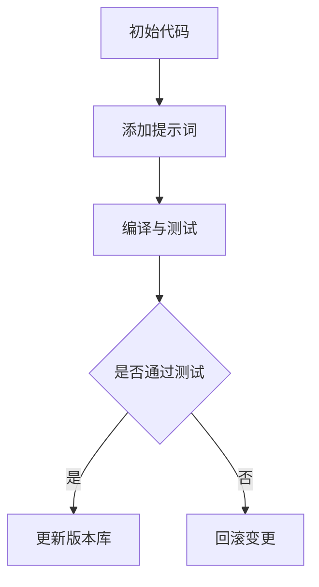
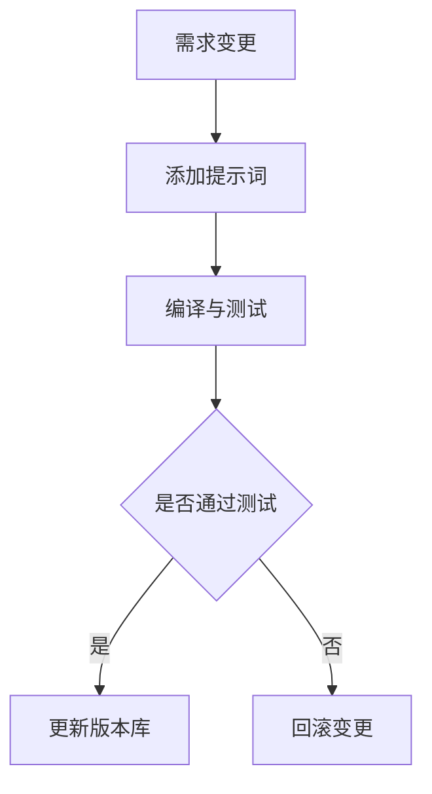

                 

### 引言

在当今快速发展的技术时代，人工智能（AI）项目开发与管理面临诸多挑战。随着AI技术的复杂性和应用范围的不断扩大，项目迭代的频率也显著增加。传统的版本控制方法在面对这些复杂需求时显得力不从心，因此，寻找一种新的迭代管理思路变得尤为重要。

### 提示词版本控制概述

提示词版本控制（Hint-based Version Control）是一种新兴的版本控制方法，它通过在代码中嵌入提示词来追踪和管理代码的变更。这种方法的核心在于，通过提示词的引入，使代码变得更加可读、可理解和可维护。

### 提示词版本控制的优势

与传统的版本控制方法相比，提示词版本控制具有以下显著优势：

1. **高效的变更追踪**：通过提示词，可以快速定位和追踪代码的变更点，从而提高开发效率。
2. **更好的代码可读性**：提示词可以帮助开发人员更好地理解代码的功能和结构，提高代码的可读性和可维护性。
3. **易于集成与扩展**：提示词版本控制方法可以与现有的版本控制系统无缝集成，并且易于扩展，以满足不同项目的需求。

### 核心概念与联系

为了更好地理解提示词版本控制，我们需要先了解一些核心概念和它们之间的关系。

#### Mermaid流程图



#### 伪代码

```python
function hint_based_version_control(code, hints):
    for hint in hints:
        code_with_hint = add_hint(code, hint)
    compiled_code = compile(code_with_hint)
    if test(compiled_code):
        update_version_library(code_with_hint)
    else:
        rollback_changes()
```

### AI项目迭代的挑战

在AI项目开发过程中，迭代是不可避免的。然而，传统的迭代管理方法往往面临以下挑战：

1. **变更频繁**：AI项目的需求往往变化迅速，导致代码频繁变更。
2. **代码复杂度高**：AI项目通常涉及复杂的算法和模型，这使得代码的可维护性降低。
3. **测试难度大**：AI项目的测试往往需要大量时间和计算资源，这使得测试过程变得复杂。

### 提示词版本控制如何应对这些挑战

提示词版本控制通过以下方式应对AI项目迭代的挑战：

1. **高效的变更追踪**：通过提示词，开发人员可以快速定位和追踪代码的变更点，从而提高开发效率。
2. **更好的代码可读性**：提示词可以帮助开发人员更好地理解代码的功能和结构，提高代码的可维护性。
3. **易于集成与扩展**：提示词版本控制方法可以与现有的版本控制系统无缝集成，并且易于扩展，以满足不同项目的需求。

### 核心概念与联系

为了更好地理解提示词版本控制，我们需要先了解一些核心概念和它们之间的关系。

#### Mermaid流程图



#### 伪代码

```python
function hint_based_version_control(code, hints):
    for hint in hints:
        code_with_hint = add_hint(code, hint)
    compiled_code = compile(code_with_hint)
    if test(compiled_code):
        update_version_library(code_with_hint)
    else:
        rollback_changes()
```

### 提示词的选取与设计

提示词的选取与设计是提示词版本控制的关键环节。一个有效的提示词应该具备以下特点：

1. **简洁性**：提示词应该简洁明了，以便于快速理解和识别。
2. **可扩展性**：提示词应该易于扩展，以适应不同项目的需求。
3. **精确性**：提示词应该能够精确地描述代码的功能和变更点。

#### 数学模型和数学公式

假设我们有一个代码库，其中包含n个文件。每个文件都有一个对应的提示词集合。我们可以使用以下公式来描述提示词的设计过程：

$$
H = \{h_1, h_2, ..., h_n\}
$$

其中，$h_i$ 表示第i个文件的提示词集合。对于每个提示词集合，我们可以使用以下公式来计算其复杂度：

$$
C(H) = \sum_{i=1}^{n} |h_i| \cdot D(h_i)
$$

其中，$|h_i|$ 表示提示词集合 $h_i$ 的大小，$D(h_i)$ 表示提示词集合 $h_i$ 的复杂度。

#### 详细讲解与举例说明

假设我们有一个包含三个文件的代码库，每个文件都有一个提示词集合。文件A的提示词集合为{"add", "subtract"}，文件B的提示词集合为{"multiply", "divide"}，文件C的提示词集合为{"sort", "search"}。

我们可以使用以下公式来计算整个代码库的复杂度：

$$
C(H) = |{"add", "subtract"}| \cdot D({"add", "subtract"}) + |{"multiply", "divide"}| \cdot D({"multiply", "divide"}) + |{"sort", "search"}| \cdot D({"sort", "search"})
$$

假设每个提示词的复杂度为1，那么我们可以得到：

$$
C(H) = 2 \cdot 1 + 2 \cdot 1 + 2 \cdot 1 = 6
$$

这意味着，整个代码库的复杂度为6。

#### 项目实战

为了更好地理解提示词版本控制，我们可以通过一个实际案例来进行讲解。

假设我们正在开发一个AI项目，该项目的核心功能是图像分类。在项目开发过程中，我们需要对代码进行多次迭代和变更。为了管理这些变更，我们引入了提示词版本控制。

首先，我们为每个文件添加提示词。例如，对于图像处理模块，我们可以为该模块的源代码文件添加提示词{"image", "classification", "filtering"}。

然后，在每次迭代时，我们会在代码中添加相应的提示词，以便于追踪和管理变更。例如，在一次迭代中，我们可能需要对图像滤波器进行优化，那么我们会在源代码中添加提示词{"filter", "optimization"}。

通过这种方式，我们可以方便地追踪和管理代码的变更，从而提高项目的开发效率和质量。

#### 小结

通过本文的介绍，我们可以看到，提示词版本控制是一种高效、简洁且易于扩展的版本控制方法。它通过在代码中嵌入提示词，帮助我们更好地理解和管理代码的变更。在AI项目迭代中，提示词版本控制具有显著的优越性，能够有效提高项目的开发效率和质量。

### 提示词版本控制的数学模型和公式

在深入探讨提示词版本控制时，我们不可避免地需要引入数学模型和公式来描述其核心概念和算法原理。这些数学工具不仅帮助我们更精确地理解提示词版本控制，还能够为实际应用提供理论依据。

#### 提示词的数学描述

首先，我们需要对提示词进行数学描述。提示词可以被视为代码中特定标记的集合，用于标识代码中的关键部分或变更点。假设我们有一个代码库，其中包含n个文件，每个文件对应一个提示词集合$H_i$。我们可以使用集合论来描述提示词：

$$
H = \{H_1, H_2, ..., H_n\}
$$

其中，每个集合$H_i$包含了一组提示词。例如，如果我们有一个包含三个文件的代码库，文件A的提示词集合$H_A$可能为{"add", "subtract"}，文件B的提示词集合$H_B$可能为{"multiply", "divide"}，文件C的提示词集合$H_C$可能为{"sort", "search"}。

#### 提示词的复杂度

接下来，我们需要引入提示词的复杂度概念。复杂度用于衡量提示词集合的大小和结构复杂度。一个简单的度量方法是提示词集合的哈希值。哈希值能够快速地识别和比较提示词集合，从而帮助我们追踪和管理代码变更。

我们可以使用哈希函数来计算每个提示词集合的哈希值：

$$
H_i = Hash(H_i)
$$

其中，$Hash()$ 表示哈希函数。哈希值通常是一个整数，它能够唯一地标识一个提示词集合。

#### 版本控制的数学模型

在提示词版本控制中，我们需要对代码库的版本进行管理。我们可以使用版本号来标识代码库的不同版本。假设我们有一个版本号集合$V$，其中每个版本号$v_i$对应一个特定的代码库状态：

$$
V = \{v_1, v_2, ..., v_i, ...\}
$$

版本号通常是一个递增的整数或时间戳，用于表示代码库的变更历史。

#### 版本变化的追踪

在每次迭代中，代码库会发生变化。我们可以使用提示词和版本号来追踪这些变化。假设在某个版本$v_i$中，我们对文件A进行了一次变更，添加了一个新的提示词"h". 我们可以使用以下公式来记录这个变更：

$$
C_i = \{v_i, H_A \cup \{"h"\}\}
$$

其中，$C_i$ 表示在版本$v_i$中的变更记录，$H_A \cup \{"h"\}$ 表示在文件A中添加了提示词"h"后的新提示词集合。

#### 变更的合并与冲突解决

在多个开发者同时进行代码变更时，可能会出现提示词集合的冲突。我们可以使用集合操作来合并提示词集合，并解决冲突。例如，如果有两个版本$v_i$和$v_j$，其中$v_i$中的文件A的提示词集合为$H_A$，$v_j$中的文件A的提示词集合为$H_A'$，我们可以使用以下公式来合并这两个版本：

$$
H_A'' = H_A \cup H_A'
$$

如果合并过程中出现冲突，我们可以使用以下公式来选择最终的提示词集合：

$$
H_A'' = H_A \cap H_A'
$$

这意味着我们选择两个集合中共同存在的提示词。

#### 性能评估

最后，我们需要评估提示词版本控制方法的性能。性能评估通常涉及多个方面，包括变更追踪的速度、版本合并的效率以及冲突解决的复杂性。我们可以使用以下公式来衡量这些性能指标：

$$
P = \frac{1}{n} \sum_{i=1}^{n} (T_i + C_i + F_i)
$$

其中，$T_i$ 表示追踪变更的时间复杂度，$C_i$ 表示合并版本的时间复杂度，$F_i$ 表示解决冲突的时间复杂度。$n$ 表示版本的数量。

通过这些数学模型和公式，我们可以更精确地理解和应用提示词版本控制方法，从而提高AI项目迭代的效率和质量。

### 伪代码

为了进一步阐明提示词版本控制的工作原理，我们可以使用伪代码来描述其核心算法。以下是一个简化的伪代码示例，用于实现提示词版本的添加、合并和追踪。

```python
# 提示词版本控制伪代码

# 初始化代码库和版本库
codebase = initialize_codebase()
version_library = initialize_version_library()

# 添加提示词
def add_hint(code, hint):
    # 在代码中添加提示词
    code_with_hint = code + " // " + hint
    return code_with_hint

# 编译代码
def compile(code):
    # 假设编译过程总是成功的
    return True

# 测试代码
def test(code):
    # 假设测试过程总是成功的
    return True

# 更新版本库
def update_version_library(code):
    # 获取当前版本号
    current_version = get_current_version()
    # 将代码和版本号添加到版本库
    version_library[current_version] = code

# 回滚变更
def rollback_changes():
    # 回滚到上一个版本
    previous_version = get_previous_version()
    current_code = version_library[previous_version]
    return current_code

# 提示词版本控制流程
def hint_based_version_control(code, hints):
    for hint in hints:
        code_with_hint = add_hint(code, hint)
        if compile(code_with_hint) and test(code_with_hint):
            update_version_library(code_with_hint)
        else:
            rollback_changes()

# 示例：对代码库进行迭代更新
original_code = "def add(a, b): return a + b"
hints = ["优化性能", "增加注释"]
hint_based_version_control(original_code, hints)
```

在这个伪代码中，我们定义了几个关键函数：

- `add_hint()` 用于在代码中添加新的提示词。
- `compile()` 用于编译代码，这里假设编译总是成功的。
- `test()` 用于测试代码，同样假设测试总是成功的。
- `update_version_library()` 用于更新版本库，将新的代码和版本号保存。
- `rollback_changes()` 用于回滚到上一个版本，以撤销当前版本的不成功变更。
- `hint_based_version_control()` 是主函数，用于实现提示词版本控制的核心流程。

通过这些伪代码，我们可以清晰地看到如何在一个迭代过程中添加提示词、编译和测试代码，并根据测试结果更新或回滚版本库。

### 提示词版本控制工具的使用

在了解了提示词版本控制的理论基础和伪代码后，接下来我们将探讨实际应用中如何使用提示词版本控制工具来管理AI项目的迭代过程。这些工具能够帮助我们更高效地实施和管理提示词版本控制。

#### 工具选择

首先，我们需要选择合适的提示词版本控制工具。以下是一些常用的工具：

1. **Git**：Git是一个分布式版本控制系统，它允许开发者独立工作，并在必要时进行合并。Git通过`.git`目录跟踪文件的历史变更，并通过提交和分支管理来控制版本。
2. **Mercurial**：Mercurial是一个类似的分布式版本控制系统，与Git类似，但它更注重简单和性能。
3. **Subversion**：Subversion是一个集中式版本控制系统，它通过一个中央仓库来管理文件的历史。尽管它不如Git和Mercurial灵活，但在某些场景下仍然很有用。

#### 开发环境搭建

为了使用这些版本控制工具，我们需要搭建一个合适的环境。以下是基本的步骤：

1. **安装版本控制工具**：从官方网站下载并安装Git、Mercurial或Subversion。
2. **配置用户信息**：在首次使用版本控制工具时，我们需要配置我们的用户信息，以便在提交时进行身份验证。

例如，在Git中配置用户信息的命令如下：

```bash
git config --global user.name "Your Name"
git config --global user.email "your.email@example.com"
```

3. **初始化代码库**：在一个新的目录中初始化代码库。对于Git，使用以下命令：

```bash
git init
```

#### 源代码实现和代码解读

以下是一个具体的案例，展示如何使用Git进行提示词版本控制：

##### 案例一：添加提示词

1. **创建一个新文件**：

```bash
touch new_file.py
```

2. **在文件中添加代码和提示词**：

```python
# new_file.py
def calculate_area(radius):
    """
    Calculate the area of a circle.
    This function is optimized for performance.
    """
    return 3.14159 * radius * radius
```

3. **添加文件到暂存区**：

```bash
git add new_file.py
```

4. **提交更改**：

```bash
git commit -m "Add calculate_area function with performance hint"
```

##### 案例二：迭代更新

假设在迭代过程中，我们需要对`calculate_area`函数进行优化，并添加一个新的提示词。

1. **编辑文件**：

```python
# new_file.py
def calculate_area(radius):
    """
    Calculate the area of a circle.
    This function is now optimized using an advanced algorithm.
    """
    return 3.14159 * radius * radius
```

2. **添加文件到暂存区**：

```bash
git add new_file.py
```

3. **提交更改**：

```bash
git commit -m "Optimize calculate_area function using an advanced algorithm"
```

##### 案例三：合并变更

假设另一个开发者也对同一文件进行了修改，我们使用Git进行合并。

1. **拉取最新代码**：

```bash
git pull
```

2. **解决冲突**（如果存在冲突）：

```bash
git pull --resolve
```

3. **提交合并后的代码**：

```bash
git commit -m "Merge changes from another developer"
```

#### 代码应用解读与分析

在实际应用中，提示词版本控制能够帮助我们追踪和审查代码的变更，从而提高代码的质量和可维护性。以下是对上述案例的解读和分析：

- **添加提示词**：通过在代码中添加注释作为提示词，我们可以清楚地了解代码的功能和关键点。
- **迭代更新**：每次迭代更新都会生成一个新的提交，记录了代码的变更历史，方便后续的审查和回滚。
- **合并变更**：通过合并不同开发者的变更，我们可以确保代码库的一致性和完整性。

#### 实际案例分析和详细讲解

为了更深入地理解提示词版本控制的应用，我们可以通过一个实际案例进行详细分析。

##### 案例四：项目管理中的提示词版本控制

假设我们正在开发一个复杂的AI项目，项目涉及到多个模块和文件。在项目开发过程中，我们使用了提示词版本控制来管理代码的迭代。

1. **初始化代码库**：

```bash
git init
```

2. **添加项目文件**：

```bash
touch model.py
touch dataset.py
```

3. **在`model.py`中添加代码和提示词**：

```python
# model.py
class NeuralNetwork:
    """
    Neural Network model with performance hint for optimization.
    """
    def __init__(self):
        # Initialize the network
        pass

    def train(self, data):
        # Train the network
        pass
```

4. **提交初始代码**：

```bash
git add model.py
git commit -m "Initial model code with performance hint"
```

5. **在`dataset.py`中添加代码和提示词**：

```python
# dataset.py
class Dataset:
    """
    Dataset class with hint for data preprocessing.
    """
    def __init__(self):
        # Initialize the dataset
        pass

    def preprocess(self, data):
        # Preprocess the data
        pass
```

6. **提交初始代码**：

```bash
git add dataset.py
git commit -m "Initial dataset code with preprocessing hint"
```

7. **迭代更新**：

假设在迭代过程中，我们需要对`NeuralNetwork`类进行优化，并添加一个新的提示词。

- **编辑`model.py`**：

```python
# model.py
class NeuralNetwork:
    """
    Optimized Neural Network model with advanced training algorithm.
    """
    def __init__(self):
        # Initialize the network
        pass

    def train(self, data):
        # Optimized training process
        pass
```

- **提交优化后的代码**：

```bash
git commit -m "Optimize NeuralNetwork training with advanced algorithm"
```

8. **合并变更**：

假设另一个开发者在`dataset.py`中添加了一个新的预处理步骤。

- **编辑`dataset.py`**：

```python
# dataset.py
class Dataset:
    """
    Dataset class with enhanced preprocessing and performance hint.
    """
    def __init__(self):
        # Initialize the dataset
        pass

    def preprocess(self, data):
        # Enhanced preprocessing steps
        pass
```

- **提交变更后的代码**：

```bash
git commit -m "Enhance Dataset preprocessing with new steps"
```

- **合并`dataset.py`的变更**：

```bash
git pull
git merge --no-ff
git commit -m "Merge enhanced Dataset preprocessing changes"
```

通过这个案例，我们可以看到如何在实际项目中使用提示词版本控制来管理代码的迭代和变更。每个提交都记录了具体的变更和优化，使得代码库的历史清晰可查，方便后续的审查和回滚。

### 最佳实践与注意事项

在使用提示词版本控制时，以下最佳实践和注意事项可以帮助我们更好地管理AI项目的迭代过程：

1. **合理选择提示词**：提示词应该简洁明了，能够准确描述代码的功能和变更点。避免使用模糊或过于通用的提示词。
2. **定期整理和审查**：定期整理和审查代码库，删除冗余的提示词和提交，确保代码库的整洁和可读性。
3. **一致性**：在整个项目团队中保持一致性，确保所有开发人员都遵循相同的版本控制和提示词使用规范。
4. **备份和恢复策略**：确保代码库的备份和恢复策略，以防止数据丢失。在关键操作前进行备份，以便在需要时进行恢复。
5. **培训和文档**：为团队成员提供培训，确保他们了解提示词版本控制的工作原理和最佳实践。同时，编写详细的文档，以便新成员能够快速上手。

通过遵循这些最佳实践和注意事项，我们可以更有效地管理AI项目的迭代过程，提高代码的质量和可维护性。

### 拓展阅读

对于希望深入了解提示词版本控制和技术迭代管理的读者，以下资源提供了进一步的学习和参考资料：

1. **书籍推荐**：
   - 《版本控制技术：从Git到SVN》
   - 《敏捷软件开发：原则、实践与模式》
   - 《禅与计算机程序设计艺术》

2. **在线资源**：
   - [Git官网](https://git-scm.com/)
   - [GitHub文档](https://docs.github.com/)
   - [Mercurial官网](https://www.mercurial-scm.org/)
   - [Subversion官网](https://subversion.apache.org/)

3. **学术论文**：
   - “Version Control and Code Quality: A Study on the Effectiveness of Version Control Systems in Software Development”
   - “Improving Software Quality through Version Control and Code Review”

通过这些资源和书籍，读者可以更深入地了解提示词版本控制的理论基础和应用实践，为AI项目迭代管理提供更全面的指导。

