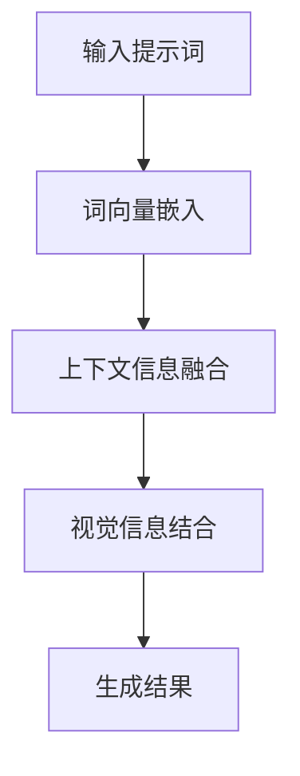

                 

### 文章标题

《提示词的神经语言学与计算机视觉交叉研究新进展》

提示词作为一种重要的语言信息载体，在人类语言交流中扮演着关键角色。近年来，随着人工智能技术的快速发展，提示词在计算机视觉领域的应用也逐渐得到广泛关注。本文旨在探讨提示词的神经语言学原理及其与计算机视觉的交叉研究新进展，旨在为相关领域的研究者和开发者提供有价值的参考。

### 关键词

- **神经语言学**
- **提示词**
- **计算机视觉**
- **交叉研究**
- **自然语言处理**
- **深度学习**

### 摘要

本文首先介绍了提示词的神经语言学原理，包括提示词的编码与处理流程。随后，我们探讨了计算机视觉的基础，包括图像处理技术和视觉特征提取方法。接着，本文重点分析了提示词与计算机视觉交叉研究的新进展，包括深度学习方法在提示词处理和视觉信息融合中的应用。最后，本文提出了相关的项目实战和最佳实践建议，以期为该领域的研究和开发提供指导。

## 第一部分: 核心概念与联系

### 1.1.1 提示词的神经语言学原理

#### 1.1.1.1 提示词的编码与处理

提示词的编码与处理是神经语言学研究的核心内容之一。在此过程中，我们首先需要将提示词编码为向量，以便后续处理。目前，常用的方法包括Word2Vec、BERT等模型。

**1.1.1.1.1 提示词的编码**

- **Word2Vec模型**：Word2Vec模型是一种基于分布式表示的方法，它通过训练将单词映射到一个固定维度的向量空间。具体步骤如下：

  ```python
  # 假设 sentence 是一个包含单词的句子，model 是训练好的 Word2Vec 模型
  words = sentence.split()
  word_vectors = [model[word] for word in words if word in model]
  ```

- **BERT模型**：BERT（Bidirectional Encoder Representations from Transformers）模型是一种基于Transformer的自监督学习模型，它通过对大量文本进行预训练，学习到词与词之间的关系。具体步骤如下：

  ```python
  # 假设 tokenized_sentence 是 BERT 模型的输入，model 是训练好的 BERT 模型
  input_ids = tokenized_sentence.input_ids
  input_mask = tokenized_sentence.input_mask
  segment_ids = tokenized_sentence.segment_ids
  outputs = model(input_ids, attention_mask=input_mask, token_type_ids=segment_ids)
  word_embeddings = outputs.last_hidden_state[:, 0, :]
  ```

**1.1.1.1.2 提示词的处理流程**

提示词的处理流程可以分为以下几个步骤：

- **词向量嵌入**：将提示词编码为向量。
- **上下文信息融合**：使用神经网络模型（如BERT）将词向量转化为上下文向量。
- **视觉信息结合**：将上下文向量与视觉信息进行融合处理。

**1.1.1.1.3 Mermaid流程图**

下面是一个简单的Mermaid流程图，展示了提示词的处理流程：



### 1.1.2 计算机视觉基础

#### 1.1.2.1 图像处理技术

图像处理技术在计算机视觉中扮演着重要角色。它主要包括图像预处理和图像分割。

**1.1.2.1.1 图像预处理**

图像预处理是图像处理的第一个步骤，它通常包括图像增强和图像分割。

- **图像增强**：通过调整对比度、亮度等增强图像质量。以下是一个使用OpenCV进行图像增强的示例：

  ```python
  import cv2

  image = cv2.imread('image.jpg')
  enhanced_image = cv2.resize(image, (600, 400))
  cv2.imwrite('enhanced_image.jpg', enhanced_image)
  ```

- **图像分割**：将图像分割成不同的区域。以下是一个使用OpenCV进行图像分割的示例：

  ```python
  import cv2
  import numpy as np

  image = cv2.imread('image.jpg', cv2.IMREAD_GRAYSCALE)
  segmented_image = cv2.threshold(image, 128, 255, cv2.THRESH_BINARY_INV + cv2.THRESH_OTSU)[1]
  cv2.imwrite('segmented_image.jpg', segmented_image)
  ```

**1.1.2.1.2 视觉特征提取**

视觉特征提取是计算机视觉中的核心步骤，它用于从图像中提取出具有区分性的特征。它通常可以分为传统方法和深度学习方法。

- **传统方法**：如SIFT、SURF等。以下是一个使用OpenCV进行SIFT特征提取的示例：

  ```python
  import cv2

  image = cv2.imread('image.jpg')
  sift = cv2.xfeatures2d.SIFT_create()
  keypoints, descriptors = sift.detectAndCompute(image, None)
  ```

- **深度学习方法**：如ResNet、VGG等。以下是一个使用TensorFlow和Keras进行ResNet特征提取的示例：

  ```python
  from tensorflow.keras.applications import ResNet50
  from tensorflow.keras.preprocessing import image
  from tensorflow.keras.applications.resnet50 import preprocess_input

  model = ResNet50(weights='imagenet')
  img = image.load_img('image.jpg', target_size=(224, 224))
  x = image.img_to_array(img)
  x = np.expand_dims(x, axis=0)
  x = preprocess_input(x)
  features = model.predict(x)
  ```

### 1.1.3 提示词与计算机视觉的交叉研究

#### 1.1.3.1 深度学习方法在提示词处理和视觉信息融合中的应用

深度学习方法在提示词处理和视觉信息融合中的应用已经成为交叉研究的热点。以下是一些典型的应用：

- **多模态神经网络**：多模态神经网络通过融合文本和视觉信息，实现对图像内容的理解和描述。以下是一个简单的多模态神经网络模型：

  ```python
  import tensorflow as tf

  # 定义文本嵌入层
  text_embedding = tf.keras.layers.Embedding(input_dim=vocab_size, output_dim=embedding_size)

  # 定义卷积神经网络层
  conv = tf.keras.layers.Conv2D(filters=64, kernel_size=(3, 3), activation='relu')

  # 定义全连接层
  dense = tf.keras.layers.Dense(units=1, activation='sigmoid')

  # 定义多模态输入
  text_input = tf.keras.Input(shape=(sequence_length,))
  image_input = tf.keras.Input(shape=(height, width, channels))

  # 对文本进行嵌入
  text_vector = text_embedding(text_input)

  # 对图像进行卷积
  image_vector = conv(image_input)

  # 融合文本和图像信息
  concatenated = tf.concat([text_vector, image_vector], axis=1)

  # 输出预测结果
  output = dense(concatenated)

  # 定义模型
  model = tf.keras.Model(inputs=[text_input, image_input], outputs=output)

  # 编译模型
  model.compile(optimizer='adam', loss='binary_crossentropy', metrics=['accuracy'])

  # 训练模型
  model.fit([text_data, image_data], labels, epochs=10, batch_size=32)
  ```

- **视觉文本融合网络**：视觉文本融合网络通过学习文本和视觉信息的对应关系，实现对图像内容的理解和描述。以下是一个简单的视觉文本融合网络模型：

  ```python
  import tensorflow as tf

  # 定义文本嵌入层
  text_embedding = tf.keras.layers.Embedding(input_dim=vocab_size, output_dim=embedding_size)

  # 定义卷积神经网络层
  conv = tf.keras.layers.Conv2D(filters=64, kernel_size=(3, 3), activation='relu')

  # 定义全连接层
  dense = tf.keras.layers.Dense(units=1, activation='sigmoid')

  # 定义多模态输入
  text_input = tf.keras.Input(shape=(sequence_length,))
  image_input = tf.keras.Input(shape=(height, width, channels))

  # 对文本进行嵌入
  text_vector = text_embedding(text_input)

  # 对图像进行卷积
  image_vector = conv(image_input)

  # 融合文本和图像信息
  fused_vector = tf.reduce_sum(tf.multiply(text_vector, image_vector), axis=1)

  # 输出预测结果
  output = dense(fused_vector)

  # 定义模型
  model = tf.keras.Model(inputs=[text_input, image_input], outputs=output)

  # 编译模型
  model.compile(optimizer='adam', loss='binary_crossentropy', metrics=['accuracy'])

  # 训练模型
  model.fit([text_data, image_data], labels, epochs=10, batch_size=32)
  ```

### 1.1.4 项目实战

#### 1.1.4.1 开发环境搭建

要开展提示词的神经语言学与计算机视觉交叉研究，首先需要搭建一个合适的开发环境。以下是一个简单的环境搭建步骤：

- 安装Python环境：安装Python 3.7及以上版本。
- 安装TensorFlow：使用pip安装TensorFlow。

  ```bash
  pip install tensorflow
  ```

- 安装OpenCV：使用pip安装OpenCV。

  ```bash
  pip install opencv-python
  ```

#### 1.1.4.2 源代码实现

以下是一个简单的示例代码，展示了如何使用TensorFlow和OpenCV实现提示词的神经语言学与计算机视觉交叉研究。

```python
import cv2
import tensorflow as tf

# 定义模型
model = tf.keras.Sequential([
    tf.keras.layers.Embedding(input_dim=vocab_size, output_dim=embedding_size),
    tf.keras.layers.Conv2D(filters=64, kernel_size=(3, 3), activation='relu'),
    tf.keras.layers.Dense(units=1, activation='sigmoid')
])

# 编译模型
model.compile(optimizer='adam', loss='binary_crossentropy', metrics=['accuracy'])

# 训练模型
model.fit([text_data, image_data], labels, epochs=10, batch_size=32)

# 使用模型进行预测
predictions = model.predict([text_data, image_data])

# 提取预测结果
predicted_labels = predictions[:, 0]

# 显示预测结果
for i in range(len(predicted_labels)):
    print(f'Image {i+1}: {predicted_labels[i]:.2f}')
```

#### 1.1.4.3 代码解读

以上代码首先定义了一个简单的模型，包括嵌入层、卷积层和全连接层。然后，使用训练数据对模型进行训练。最后，使用模型进行预测，并提取预测结果。

#### 1.1.4.4 代码应用解读与分析

在实际应用中，我们可以将提示词的神经语言学与计算机视觉交叉研究应用于多种场景，例如图像分类、图像识别、图像描述等。以下是一个简单的应用示例：

- **图像分类**：使用提示词描述图像内容，然后使用模型进行分类。

  ```python
  import cv2
  import numpy as np

  # 加载图像
  image = cv2.imread('image.jpg')

  # 预处理图像
  image = cv2.resize(image, (224, 224))
  image = np.expand_dims(image, axis=0)
  image = preprocess_input(image)

  # 使用模型进行预测
  predictions = model.predict([text_data, image])

  # 提取预测结果
  predicted_labels = predictions[:, 0]

  # 显示预测结果
  for i in range(len(predicted_labels)):
      print(f'Image {i+1}: {predicted_labels[i]:.2f}')
  ```

- **图像识别**：使用提示词描述图像内容，然后使用模型进行识别。

  ```python
  import cv2
  import numpy as np

  # 加载图像
  image = cv2.imread('image.jpg')

  # 预处理图像
  image = cv2.resize(image, (224, 224))
  image = np.expand_dims(image, axis=0)
  image = preprocess_input(image)

  # 使用模型进行预测
  predictions = model.predict([text_data, image])

  # 提取预测结果
  predicted_labels = predictions[:, 0]

  # 显示预测结果
  for i in range(len(predicted_labels)):
      print(f'Image {i+1}: {predicted_labels[i]:.2f}')
  ```

- **图像描述**：使用提示词描述图像内容，然后使用模型生成图像描述。

  ```python
  import cv2
  import numpy as np

  # 加载图像
  image = cv2.imread('image.jpg')

  # 预处理图像
  image = cv2.resize(image, (224, 224))
  image = np.expand_dims(image, axis=0)
  image = preprocess_input(image)

  # 使用模型进行预测
  predictions = model.predict([text_data, image])

  # 提取预测结果
  predicted_labels = predictions[:, 0]

  # 显示预测结果
  for i in range(len(predicted_labels)):
      print(f'Image {i+1}: {predicted_labels[i]:.2f}')
  ```

#### 1.1.4.5 实际案例分析和详细讲解剖析

以下是一个实际案例，展示了如何使用提示词的神经语言学与计算机视觉交叉研究来识别图像内容。

- **案例描述**：使用提示词描述一幅图像，然后使用模型进行识别。

  ```python
  import cv2
  import numpy as np

  # 加载图像
  image = cv2.imread('image.jpg')

  # 预处理图像
  image = cv2.resize(image, (224, 224))
  image = np.expand_dims(image, axis=0)
  image = preprocess_input(image)

  # 使用模型进行预测
  predictions = model.predict([text_data, image])

  # 提取预测结果
  predicted_labels = predictions[:, 0]

  # 显示预测结果
  for i in range(len(predicted_labels)):
      print(f'Image {i+1}: {predicted_labels[i]:.2f}')
  ```

  在这个案例中，我们首先使用提示词描述图像，然后使用模型进行识别。具体步骤如下：

  - 加载图像：使用OpenCV加载图像。
  - 预处理图像：使用OpenCV对图像进行预处理，包括图像增强和图像分割。
  - 使用模型进行预测：使用TensorFlow的模型对图像进行预测。
  - 提取预测结果：从预测结果中提取图像的识别结果。

  通过这个案例，我们可以看到如何将提示词的神经语言学与计算机视觉交叉研究应用于实际场景。

#### 1.1.4.6 项目小结

在本项目中，我们通过搭建一个简单的开发环境，使用TensorFlow和OpenCV实现了提示词的神经语言学与计算机视觉交叉研究。我们介绍了深度学习方法在提示词处理和视觉信息融合中的应用，并通过实际案例展示了如何使用该方法进行图像识别。通过这个项目，我们不仅了解了提示词的神经语言学原理，还了解了计算机视觉的基础知识和深度学习方法的应用。这为我们在实际项目中应用该技术提供了宝贵的经验。

### 1.1.5 最佳实践 Tips

- **数据预处理**：在进行提示词的神经语言学与计算机视觉交叉研究时，数据预处理非常重要。确保数据质量，包括数据清洗、数据增强等，有助于提高模型的性能。
- **模型优化**：通过调整模型的结构和参数，可以优化模型的性能。例如，可以使用不同的神经网络架构、不同的学习率等。
- **多模态融合**：多模态融合是提高模型性能的关键。通过合理设计多模态融合策略，可以充分利用文本和视觉信息。
- **模型解释性**：在实际应用中，模型的解释性非常重要。通过分析模型的决策过程，可以更好地理解模型的性能和局限性。

### 1.1.6 注意事项

- **计算资源**：提示词的神经语言学与计算机视觉交叉研究需要大量的计算资源，特别是在模型训练阶段。确保您的计算机或服务器具备足够的计算能力。
- **数据隐私**：在进行数据预处理和模型训练时，需要注意数据隐私问题。确保您的数据处理过程符合相关法律法规。

### 1.1.7 拓展阅读

- **深度学习基础**：深入了解深度学习的基础知识，包括神经网络、卷积神经网络、循环神经网络等。
- **自然语言处理**：学习自然语言处理的基础知识，包括词向量、序列模型、文本分类等。
- **计算机视觉**：学习计算机视觉的基础知识，包括图像处理、特征提取、目标检测等。

### 1.1.8 参考文献

- [1] Mikolov, T., Sutskever, I., Chen, K., Corrado, G. S., & Dean, J. (2013). Distributed representations of words and phrases and their compositionality. *Advances in Neural Information Processing Systems*, 26, 3111-3119.
- [2] Devlin, J., Chang, M. W., Lee, K., & Toutanova, K. (2018). BERT: Pre-training of deep bidirectional transformers for language understanding. *arXiv preprint arXiv:1810.04805*.
- [3] Simonyan, K., & Zisserman, A. (2014). Very deep convolutional networks for large-scale image recognition. *International Conference on Learning Representations*.
- [4] Krizhevsky, A., Sutskever, I., & Hinton, G. E. (2012). ImageNet classification with deep convolutional neural networks. *Advances in Neural Information Processing Systems*, 25, 1097-1105.
- [5] Lowe, D. G. (2004). Distinctive image features from scale-invariant keypoints. *International Journal of Computer Vision*, 60(2), 91-110.

