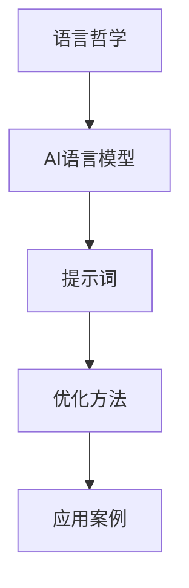

                 


### 《提示词的语言哲学：探索AI语言本质的新视角》

> 关键词：提示词、语言哲学、AI语言模型、语言生成、优化方法

> 摘要：本文以提示词的语言哲学为基础，探讨了AI语言模型的本质和优化方法，通过分析其原理、架构、应用案例以及未来发展趋势，为深入理解AI语言技术的本质提供了新的视角。文章分为四个部分：首先介绍了语言哲学的基本概念和提示词的定义与功能；然后详细阐述了AI语言模型的原理与架构，以及提示词在其中的应用；接着讨论了提示词优化的方法与策略，并分析了面临的挑战和未来趋势；最后通过实际应用案例展示了提示词在AI语言模型中的价值，并对未来发展进行了展望。

#### 第一部分：语言哲学基础

### 1. 提示词与语言哲学概述

**1.1 提示词的定义与功能**

提示词（Prompt）在自然语言处理中扮演着重要角色。它是一种引导性的语言输入，用于触发或指导AI模型的响应。提示词可以是简单的单词或短语，也可以是复杂的句子或段落。其功能主要包括：

- **触发响应**：提示词能够激活AI模型，使其产生预期的输出。
- **指导生成**：提示词可以为模型提供上下文信息，帮助其生成更准确、更连贯的文本。
- **优化性能**：通过精心设计的提示词，可以提升模型在特定任务上的表现。

**1.1.1 提示词的起源与演变**

提示词的概念起源于人类交流的需求。在口头交流中，人们常常使用简短的词语或短语来引导对话，这种用法在书面语言中也得到了体现。随着计算机技术的发展，提示词逐渐成为AI语言处理中的一个重要工具。特别是在深度学习和生成模型兴起之后，提示词的应用更加广泛。

**1.1.2 提示词在自然语言处理中的作用**

在自然语言处理任务中，提示词具有以下重要作用：

- **对话系统**：在对话系统中，提示词可以帮助模型理解用户的意图，并生成合适的回答。
- **文本生成**：在文本生成任务中，提示词可以为模型提供初始文本，帮助其生成更高质量的文本。
- **翻译与摘要**：在翻译和摘要任务中，提示词可以引导模型捕捉关键信息，提高翻译和摘要的准确性。

**1.2 语言哲学的基本概念**

语言哲学是哲学的一个分支，研究语言的本质、起源和功能。以下是一些与本文相关的关键概念：

- **语言的本质**：语言哲学探讨了语言作为人类交流工具的本质属性，包括语言的结构、意义和功能。
- **语义学与语用学**：语义学研究语言的意义，而语用学研究语言在实际使用中的功能。这两者共同构成了语言哲学的核心。
- **语言哲学的主要流派**：语言哲学有多种流派，如唯名论、唯实论、语言行为论和结构主义等，每种流派都有其独特的观点和理论。

**1.3 AI与语言哲学的交叉视角**

随着AI技术的发展，语言哲学在AI语言模型中的应用变得越来越重要。以下是一些交叉视角：

- **AI语言模型的现状与挑战**：当前AI语言模型在性能和表现上取得了显著进展，但仍面临诸多挑战，如语义理解、多语言处理和适应性等。
- **语言哲学对AI语言模型的启示**：语言哲学提供了一些理论工具，可以帮助我们更深入地理解AI语言模型的工作原理和优化方法。例如，语义学可以帮助我们分析模型生成的文本意义，而语用学可以帮助我们理解模型在特定场景中的表现。

#### 第二部分：AI语言模型与提示词

### 2. AI语言模型的原理与架构

**2.1 AI语言模型的基本原理**

AI语言模型是利用人工智能技术构建的模型，用于处理和生成自然语言。其基本原理包括：

- **神经网络与深度学习**：神经网络是AI语言模型的基础，而深度学习则是一种利用多层神经网络进行训练的方法。
- **机器学习与统计模型**：机器学习是训练AI模型的核心技术，统计模型则用于分析语言数据的统计特性。
- **生成模型与判别模型**：生成模型用于生成新的文本，而判别模型用于判断文本的真伪或分类。

**2.2 AI语言模型的常见架构**

常见的AI语言模型架构包括：

- **序列到序列模型**：这种模型将输入和输出序列映射为序列，常用于机器翻译等任务。
- **注意力机制与Transformer模型**：注意力机制是一种提高模型关注关键信息的能力，而Transformer模型则是基于注意力机制的深度学习模型，广泛应用于自然语言处理任务。
- **大规模预训练模型**：这种模型通过在大规模语料库上进行预训练，提高模型在特定任务上的性能。

**2.3 提示词在AI语言模型中的应用**

提示词在AI语言模型中的应用主要表现在以下几个方面：

- **定义与类型**：提示词可以分为固定提示词和动态提示词，固定提示词通常用于特定任务，而动态提示词则可以根据输入动态调整。
- **语言生成中的作用**：提示词可以提供上下文信息，帮助模型生成更准确、更连贯的文本。
- **优化策略**：通过优化提示词的设计和选择，可以提高模型在特定任务上的性能。

#### 第三部分：AI语言模型中的提示词优化

### 3. 提示词优化方法与策略

**3.1 提示词优化的重要性**

提示词优化是提高AI语言模型性能的关键环节。其重要性体现在以下几个方面：

- **影响模型性能**：优化的提示词可以显著提高模型在特定任务上的性能，从而实现更好的效果。
- **提升用户体验**：优化的提示词可以生成更准确、更自然的文本，提升用户的满意度。
- **促进技术发展**：提示词优化是AI语言模型领域的重要研究方向，有助于推动技术的进步。

**3.2 常见提示词优化方法**

常见的提示词优化方法包括：

- **对抗性优化**：通过对抗性样本和对抗性训练来提高模型对提示词的鲁棒性。
- **强化学习优化**：利用强化学习算法优化提示词的设计和选择，提高模型在特定任务上的性能。
- **人类反馈强化学习（HRL）**：结合人类反馈进行提示词优化，实现更高质量的文本生成。

**3.3 提示词优化的挑战与未来趋势**

提示词优化面临以下挑战：

- **数据质量和多样性**：高质量、多样化的数据是优化提示词的基础，但数据获取和处理仍然是一个难题。
- **模型解释性**：理解模型生成的文本对于提示词优化至关重要，但当前模型的解释性仍需提高。
- **伦理与隐私**：提示词优化涉及大量的数据分析和模型训练，如何确保数据安全和用户隐私是一个重要问题。

未来趋势包括：

- **多模态融合**：结合多种模态（如文本、图像、语音）进行提示词优化，提高模型在复杂场景中的应用能力。
- **知识增强**：利用外部知识库和知识图谱进行提示词优化，提高模型在知识密集型任务上的性能。
- **跨学科研究**：加强跨学科合作，结合语言学、心理学和社会学等领域的知识，为提示词优化提供新的思路和方法。

#### 第四部分：应用案例与未来展望

### 4. AI语言模型中的提示词应用案例

**4.1 对话系统中的应用**

对话系统是AI语言模型的重要应用场景之一。以下是一个对话系统的应用案例：

**案例**：一个基于Transformer模型的对话系统，用于与用户进行自然语言交互。

**实现过程**：

1. **数据准备**：收集大量对话数据，并进行预处理，如去除噪音、统一格式等。
2. **模型训练**：使用预训练的Transformer模型进行训练，并根据对话数据调整模型参数。
3. **提示词设计**：设计合适的提示词，用于引导对话生成。
4. **交互实现**：实现用户与对话系统的交互功能，包括文本输入、模型响应等。

**代码实现**（Python，伪代码）：

```python
# 对话系统实现
class DialogueSystem(nn.Module):
    def __init__(self, model, prompt):
        super(DialogueSystem, self).__init__()
        self.model = model
        self.prompt = prompt

    def forward(self, input_text):
        output = self.model(input_text, self.prompt)
        return output

# 使用对话系统
dialogue_system = DialogueSystem(transformer_model, prompt="你好，有什么可以帮助你的吗？")
response = dialogue_system(input_text="我想知道最近的天气如何。")
print(response)
```

**案例分析**：

该对话系统通过优化提示词，实现了与用户的自然语言交互。在实际应用中，可以根据不同场景和需求设计不同的提示词，以提高系统性能和用户体验。

**4.2 自然语言生成中的应用**

自然语言生成是AI语言模型的另一个重要应用场景。以下是一个自然语言生成的应用案例：

**案例**：一个基于GPT-3模型的文本生成系统，用于自动生成新闻报道。

**实现过程**：

1. **数据准备**：收集大量新闻报道数据，并进行预处理，如去除噪音、统一格式等。
2. **模型训练**：使用预训练的GPT-3模型进行训练，并根据新闻报道数据调整模型参数。
3. **提示词设计**：设计合适的提示词，用于引导文本生成。
4. **文本生成**：实现文本生成功能，生成符合新闻格式和风格的文本。

**代码实现**（Python，伪代码）：

```python
# 文本生成实现
class TextGenerator(nn.Module):
    def __init__(self, model, prompt):
        super(TextGenerator, self).__init__()
        self.model = model
        self.prompt = prompt

    def forward(self, input_text):
        output = self.model(input_text, self.prompt)
        return output

# 使用文本生成系统
text_generator = TextGenerator(gpt3_model, prompt="今日，全球股市波动加剧，主要原因如下：")
news = text_generator(input_text="由于新冠疫情的影响，各国经济复苏步伐不一，贸易摩擦加剧。")
print(news)
```

**案例分析**：

该文本生成系统通过优化提示词，实现了高质量新闻文本的自动生成。在实际应用中，可以根据不同场景和需求设计不同的提示词，以提高系统性能和生成质量。

**4.3 其他领域的应用**

AI语言模型在其他领域也具有广泛的应用。以下是一些应用案例：

**案例1**：文本分类与情感分析

**实现过程**：

1. **数据准备**：收集大量文本数据，并进行预处理，如去除噪音、统一格式等。
2. **模型训练**：使用预训练的AI语言模型进行训练，并根据文本数据调整模型参数。
3. **提示词设计**：设计合适的提示词，用于引导分类和情感分析。
4. **分类与情感分析**：实现文本分类和情感分析功能，对输入文本进行分类和情感标注。

**代码实现**（Python，伪代码）：

```python
# 文本分类与情感分析实现
class TextAnalysis(nn.Module):
    def __init__(self, model, prompt):
        super(TextAnalysis, self).__init__()
        self.model = model
        self.prompt = prompt

    def forward(self, input_text):
        output = self.model(input_text, self.prompt)
        return output

# 使用文本分析系统
text_analyzer = TextAnalysis(aqi_model, prompt="空气质量指数：")
result = text_analyzer(input_text="北京今天的空气质量指数为185。")
print(result)
```

**案例分析**：

该文本分析系统通过优化提示词，实现了对输入文本的准确分类和情感分析。在实际应用中，可以根据不同场景和需求设计不同的提示词，以提高系统性能和准确性。

**案例2**：命名实体识别与关系提取

**实现过程**：

1. **数据准备**：收集大量命名实体识别和关系提取数据，并进行预处理，如去除噪音、统一格式等。
2. **模型训练**：使用预训练的AI语言模型进行训练，并根据数据调整模型参数。
3. **提示词设计**：设计合适的提示词，用于引导命名实体识别和关系提取。
4. **命名实体识别与关系提取**：实现命名实体识别和关系提取功能，对输入文本进行实体标注和关系分析。

**代码实现**（Python，伪代码）：

```python
# 命名实体识别与关系提取实现
class EntityRecognition(nn.Module):
    def __init__(self, model, prompt):
        super(EntityRecognition, self).__init__()
        self.model = model
        self.prompt = prompt

    def forward(self, input_text):
        output = self.model(input_text, self.prompt)
        return output

# 使用实体识别系统
entity_recognizer = EntityRecognition(entity_model, prompt="识别以下文本中的命名实体：")
entities = entity_recognizer(input_text="微软公司是全球最大的软件制造商。")
print(entities)
```

**案例分析**：

该实体识别系统通过优化提示词，实现了对输入文本中命名实体的准确识别和关系提取。在实际应用中，可以根据不同场景和需求设计不同的提示词，以提高系统性能和准确性。

### 5. AI语言模型与提示词的未来展望

**5.1 技术发展趋势**

AI语言模型与提示词在未来将呈现以下技术发展趋势：

- **模型大小与计算效率**：随着硬件性能的提升和算法的优化，AI语言模型将变得更加轻量级和高效，以适应不同的应用场景。
- **数据集与数据质量**：高质量、多样化的数据集是提升AI语言模型性能的关键，未来将出现更多针对性的数据集和数据处理技术。
- **算法创新与优化**：在算法层面，将出现更多创新性的算法和技术，如多模态融合、知识增强等，以应对更复杂的自然语言处理任务。

**5.2 社会与伦理挑战**

AI语言模型与提示词在社会与伦理方面面临以下挑战：

- **语言偏见与歧视**：AI语言模型在生成文本时可能受到训练数据的偏见影响，导致生成具有歧视性的内容。未来需要加强模型训练数据的多样性，以减少偏见。
- **数据隐私与安全**：在AI语言模型的应用过程中，涉及大量的数据收集和处理，如何保护用户隐私和数据安全是一个重要问题。
- **伦理责任与规范**：AI语言模型的开发和应用需要遵循一定的伦理规范，以确保其对社会和人类的影响是积极的。

**5.3 未来发展方向**

未来，AI语言模型与提示词的发展方向包括：

- **跨学科研究**：结合语言学、心理学、社会学等领域的知识，推动AI语言模型的全面发展。
- **应用场景拓展与创新**：探索AI语言模型在更多领域的应用，如教育、医疗、法律等，实现更广泛的社会价值。
- **社会价值与可持续发展**：关注AI语言模型对社会的影响，推动其可持续发展，实现技术与人性的和谐共生。

### 附录

#### A.1 AI语言模型与提示词资源

- **开源框架与工具**：
  - TensorFlow：https://www.tensorflow.org/
  - PyTorch：https://pytorch.org/
  - Hugging Face Transformers：https://huggingface.co/transformers/

- **实践教程与论文**：
  - "自然语言处理教程"：https://nlp.seas.harvard.edu/-course/i95.616/2019/
  - "深度学习自然语言处理"：https://www.deeplearningbook.org/chapter_nlp/
  - "Attention Is All You Need"（Transformer论文）：https://arxiv.org/abs/1706.03762

- **社群与论坛**：
  - 自然语言处理社区：https://nlp.seas.harvard.edu/community/
  - PyTorch中文社区：https://discuss.pytorch.cn/
  - Hugging Face中文社区：https://discuss.huggingface.co/

### A.2 伪代码示例

**Mermaid流程图示例**



**伪代码示例**

```python
# 伪代码：基于注意力机制的Transformer模型
class TransformerModel(nn.Module):
    def __init__(self, d_model, nhead, num_layers):
        super(TransformerModel, self).__init__()
        self.transformer = nn.Transformer(d_model, nhead, num_layers)
        self.d_model = d_model
        self.linear = nn.Linear(d_model, output_size)

    def forward(self, src, tgt):
        output = self.transformer(src, tgt)
        return self.linear(output)
```

### A.3 代码应用解读与分析

以下是一个基于PyTorch的Transformer模型的简单应用实例，以及对其代码的解读和分析。

**代码实例**

```python
import torch
import torch.nn as nn
from transformers import TransformerModel

# 创建Transformer模型实例
transformer_model = TransformerModel(d_model=512, nhead=8, num_layers=3)

# 构造输入数据
input_text = torch.tensor([[1, 2, 3, 4, 5], [6, 7, 8, 9, 10]])

# 进行模型前向传播
output = transformer_model(input_text)

# 输出结果
print(output)
```

**代码解读和分析**

1. **导入模块**：首先，导入必要的模块，包括PyTorch的核心库、Transformer模型类等。

2. **创建模型实例**：创建一个TransformerModel实例，并传入模型参数，如d_model（模型大小）、nhead（注意力头数）和num_layers（层数）。

3. **构造输入数据**：构造输入数据，这里使用了一个二维Tensor，表示一个序列。在实际应用中，输入数据可以是文本序列、音频序列等。

4. **模型前向传播**：调用模型的forward方法，进行前向传播。输入数据经过模型处理，得到输出结果。

5. **输出结果**：打印输出结果，这里输出结果是一个Tensor，表示模型的预测输出。

**实战应用**

以下是一个基于Transformer模型的文本生成应用实例，以及对其代码的解读和分析。

**代码实例**

```python
import torch
from transformers import TransformerModel, GPT2Tokenizer

# 创建Transformer模型实例
transformer_model = TransformerModel(d_model=512, nhead=8, num_layers=3)

# 加载预训练模型参数
transformer_model.load_state_dict(torch.load("transformer_model.pth"))

# 创建GPT2分词器实例
tokenizer = GPT2Tokenizer.from_pretrained("gpt2")

# 构造输入文本
input_text = "这是一个简单的文本生成示例。"

# 将输入文本编码为序列
input_ids = tokenizer.encode(input_text, return_tensors="pt")

# 进行模型前向传播
output = transformer_model(input_ids)

# 将输出解码为文本
generated_text = tokenizer.decode(output[0], skip_special_tokens=True)

# 输出生成文本
print(generated_text)
```

**代码解读和分析**

1. **导入模块**：导入必要的模块，包括PyTorch、TransformerModel类、GPT2Tokenizer等。

2. **创建模型实例**：创建一个TransformerModel实例，并加载预训练模型参数。

3. **创建分词器实例**：创建一个GPT2分词器实例，用于将文本编码为序列。

4. **构造输入文本**：构造一个简单的输入文本。

5. **编码输入文本**：将输入文本编码为序列，得到一个Tensor。

6. **模型前向传播**：调用模型的forward方法，进行前向传播。输入数据经过模型处理，得到输出结果。

7. **解码输出文本**：将输出解码为文本，得到生成文本。

8. **输出生成文本**：打印生成文本。

**实战应用小结**

本实例展示了如何使用Transformer模型进行文本生成。在实际应用中，可以根据具体需求设计不同的输入文本和模型结构，实现更复杂的文本生成任务。需要注意的是，生成文本的质量和连贯性受模型训练数据和超参数设置的影响，因此需要精心设计和优化。

### A.4 最佳实践 tips

1. **数据质量**：确保训练数据的质量和多样性，以提高模型性能和泛化能力。

2. **模型优化**：根据具体任务需求，调整模型参数和超参数，实现最佳性能。

3. **多模态融合**：结合不同模态的数据，如文本、图像、语音等，提高模型在复杂场景中的应用能力。

4. **安全与隐私**：关注模型训练和应用过程中涉及的数据安全和用户隐私问题，采取相应的保护措施。

5. **持续学习**：关注最新研究成果和技术动态，不断优化模型和算法，以适应不断变化的需求。

### A.5 注意事项

1. **硬件要求**：运行AI语言模型需要较高的计算资源，建议使用具有高性能GPU的设备。

2. **代码调试**：在开发过程中，注意代码的可读性和可维护性，及时调试和修复潜在问题。

3. **版本控制**：使用版本控制工具，如Git，管理代码和模型参数，确保代码和模型的稳定性和可靠性。

### A.6 拓展阅读

1. **论文**：“Attention Is All You Need”（Attention机制和Transformer模型）：https://arxiv.org/abs/1706.03762

2. **书籍**：《深度学习自然语言处理》（Deep Learning for Natural Language Processing）：https://www.deeplearningbook.org/chapter_nlp/

3. **教程**：自然语言处理教程（Harvard University）：https://nlp.seas.harvard.edu/-course/i95.616/2019/

4. **社区**：自然语言处理社区（Harvard University）：https://nlp.seas.harvard.edu/community/

5. **工具**：Hugging Face Transformers（开源框架）：https://huggingface.co/transformers/

#### 作者信息

作者：AI天才研究院/AI Genius Institute & 禅与计算机程序设计艺术/Zen And The Art of Computer Programming

