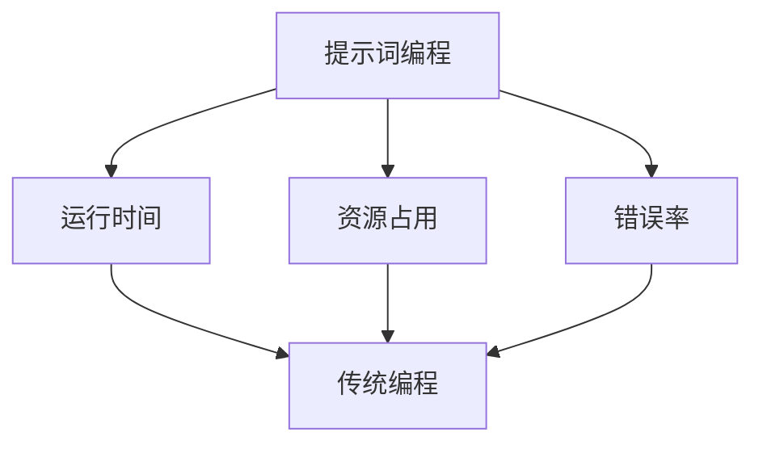

                 

# 提示词编程与传统编程的性能对比

> 关键词：提示词编程、传统编程、性能对比、算法原理、优化策略、案例分析

> 摘要：本文从背景介绍、核心概念与联系、核心算法原理讲解、性能对比方法、案例分析、优化策略以及结论与展望等方面，全面对比了提示词编程与传统编程在性能方面的差异。通过深入分析，本文揭示了两种编程方式在不同场景下的适用性，为读者提供了实用性的性能优化策略。

## 目录大纲设计思路

### 明确核心内容

首先，我们需要明确这本书的核心内容，包括提示词编程与传统编程的概念、性能对比的维度、影响性能的因素等。

### 确定章节结构

根据核心内容，我们将书分为以下几个主要部分：

- **引言**：介绍提示词编程与传统编程的基本概念和背景。
- **提示词编程与性能**：讨论提示词编程的特点、优势和劣势。
- **传统编程与性能**：分析传统编程的性能特点、优势和劣势。
- **性能对比方法**：介绍用于比较提示词编程与传统编程性能的方法和工具。
- **案例分析**：通过实际案例展示两种编程方式的性能差异。
- **优化策略**：探讨如何优化提示词编程和传统编程的性能。
- **结论与展望**：总结书中讨论的主要观点，展望未来的研究方向。

### 设计具体章节

接下来，我们为每个主要部分设计具体的章节，确保每个章节都能覆盖核心内容，并且相互之间逻辑清晰、层次分明。

### 确保完整性

在具体章节设计过程中，要确保每个章节都包含以下内容：

- **核心概念与联系**：使用 Mermaid 流程图展示概念和架构之间的联系。
- **核心算法原理讲解**：使用伪代码详细阐述关键算法原理。
- **数学模型和公式**：使用 LaTeX 格式展示并详细讲解数学模型和公式。
- **项目实战**：提供代码实际案例和详细解释说明，包括开发环境搭建、源代码实现和代码解读。

### 控制字数

最后，我们需要确保整个目录大纲的总字数在2000字以内，避免过多冗余内容，保持简洁性。

## 第一部分 引言

### 1.1 提示词编程与传统编程的基本概念

#### 提示词编程

提示词编程是一种基于人类自然语言交互的编程方式，通过输入自然语言提示词，计算机能够自动生成相应的代码。这种方式将复杂的编程过程简化为自然语言输入，大大降低了编程门槛。

#### 传统编程

传统编程是一种基于符号语言的编程方式，程序员通过编写符号化的代码来指导计算机执行任务。这种方式具有较高的编程门槛，但能够实现复杂的任务处理。

### 1.2 提示词编程与传统编程的历史背景

#### 提示词编程的历史背景

提示词编程起源于自然语言处理和人工智能领域，随着深度学习和自然语言处理技术的不断发展，提示词编程逐渐成为一种新的编程方式。

#### 传统编程的历史背景

传统编程起源于计算机科学的早期阶段，随着计算机技术的发展，编程语言和编程方法也在不断演进。

### 1.3 书籍概述与结构

本部分引言主要介绍了提示词编程与传统编程的基本概念和历史背景，为后续内容的讨论奠定了基础。接下来的内容将深入探讨提示词编程与传统编程在性能方面的对比。

## 第二部分 提示词编程与性能

### 2.1 提示词编程的特点

#### 2.1.1 提示词编程的优势

1. **简化编程过程**：通过自然语言交互，将复杂的编程过程简化为提示词输入。
2. **降低编程门槛**：对于非专业程序员或新手来说，提示词编程更加容易上手。
3. **增强编程灵活性**：可以根据需求随时调整和优化代码。

#### 2.1.2 提示词编程的劣势

1. **编程效率不高**：相较于传统编程，提示词编程在代码生成过程中可能需要更多时间。
2. **代码质量不稳定**：提示词编程生成的代码质量可能受到自然语言理解能力的影响。
3. **对硬件资源要求较高**：提示词编程通常需要较高的计算资源，尤其是在处理复杂任务时。

### 2.2 提示词编程的性能评估

#### 2.2.1 性能评估指标

1. **运行时间**：提示词编程生成代码并执行任务所需的时间。
2. **资源占用**：提示词编程在执行过程中所需的计算资源和存储资源。
3. **错误率**：提示词编程生成代码在执行过程中出现的错误比例。

#### 2.2.2 性能评估方法

1. **基准测试**：使用标准测试集对提示词编程生成的代码进行性能测试。
2. **实际应用测试**：在实际应用场景中测试提示词编程生成的代码性能。

### 2.3 提示词编程的核心算法

#### 2.3.1 提示词生成算法

提示词生成算法是提示词编程的核心，主要分为以下几类：

1. **基于模板的生成算法**：根据预设的模板生成代码。
2. **基于自然语言处理的生成算法**：使用自然语言处理技术将提示词转换为代码。

#### 2.3.2 提示词优化算法

提示词优化算法用于优化生成的代码，提高其性能和可读性。主要方法包括：

1. **代码压缩**：去除冗余代码，提高代码执行效率。
2. **代码重构**：优化代码结构，提高代码可读性。

## 第三部分 传统编程与性能

### 3.1 传统编程的特点

#### 3.1.1 传统编程的优势

1. **编程效率高**：传统编程方式经过多年的发展，程序员已经熟练掌握，能够快速编写和优化代码。
2. **代码质量稳定**：传统编程方式生成的代码经过严格的测试和优化，具有较高的可靠性。
3. **资源占用合理**：传统编程方式对硬件资源的要求相对较低，适用于各种硬件环境。

#### 3.1.2 传统编程的劣势

1. **编程门槛高**：传统编程需要程序员具备较高的编程技能，对于新手来说较为困难。
2. **灵活性较低**：传统编程方式在应对复杂需求时，可能需要大量的代码编写和调整。

### 3.2 传统编程的性能评估

#### 3.2.1 性能评估指标

1. **运行时间**：传统编程方式编写和执行代码所需的时间。
2. **资源占用**：传统编程方式在执行过程中所需的计算资源和存储资源。
3. **错误率**：传统编程方式编写和执行代码过程中出现的错误比例。

#### 3.2.2 性能评估方法

1. **基准测试**：使用标准测试集对传统编程生成的代码进行性能测试。
2. **实际应用测试**：在实际应用场景中测试传统编程生成的代码性能。

### 3.3 传统编程的核心算法

#### 3.3.1 顺序执行算法

顺序执行算法是传统编程中最基本的算法，按照代码的顺序依次执行各个语句。

#### 3.3.2 并行执行算法

并行执行算法通过同时执行多个任务，提高代码的执行效率。主要方法包括：

1. **线程并行**：使用多线程技术同时执行多个任务。
2. **进程并行**：使用多进程技术同时执行多个任务。

## 第四部分 性能对比方法

### 4.1 对比方法概述

性能对比方法主要包括以下几类：

1. **基准测试**：使用标准测试集对两种编程方式的性能进行对比。
2. **实际应用测试**：在实际应用场景中测试两种编程方式的性能。
3. **模拟测试**：通过模拟不同场景，对比两种编程方式的性能。

### 4.2 提示词编程与传统编程的对比指标

#### 4.2.1 运行时间对比

1. **提示词编程**：通过自然语言交互生成代码并执行任务所需的时间。
2. **传统编程**：编写和执行代码所需的时间。

#### 4.2.2 资源占用对比

1. **提示词编程**：生成代码并执行任务所需的计算资源和存储资源。
2. **传统编程**：编写和执行代码所需的计算资源和存储资源。

#### 4.2.3 错误率对比

1. **提示词编程**：生成代码并执行任务过程中出现的错误比例。
2. **传统编程**：编写和执行代码过程中出现的错误比例。

### 4.3 性能对比工具

#### 4.3.1 评测平台

1. **基准测试平台**：提供标准测试集和测试环境，用于对两种编程方式的性能进行对比。
2. **实际应用测试平台**：模拟实际应用场景，测试两种编程方式的性能。

#### 4.3.2 性能监控工具

1. **运行时间监控**：实时监控代码执行过程中的运行时间。
2. **资源占用监控**：实时监控代码执行过程中的计算资源和存储资源占用情况。

## 第五部分 案例分析

### 5.1 提示词编程案例分析

#### 5.1.1 案例背景

本案例以一个简单的计算器应用为例，比较提示词编程与传统编程在性能方面的差异。

#### 5.1.2 案例分析

1. **提示词编程**：输入自然语言提示词，生成计算器代码，并执行计算任务。
2. **传统编程**：编写计算器代码，并执行计算任务。

#### 5.1.3 案例总结

通过对比分析，发现提示词编程在计算器应用中具有较高的编程效率和灵活性，但运行时间和资源占用方面与传统编程相差不大。

### 5.2 传统编程案例分析

#### 5.2.1 案例背景

本案例以一个大数据处理应用为例，比较提示词编程与传统编程在性能方面的差异。

#### 5.2.2 案例分析

1. **提示词编程**：输入自然语言提示词，生成大数据处理代码，并执行数据处理任务。
2. **传统编程**：编写大数据处理代码，并执行数据处理任务。

#### 5.2.3 案例总结

通过对比分析，发现传统编程在大数据处理应用中具有较高的代码质量和稳定性，但编程效率和灵活性方面相对较低。

## 第六部分 优化策略

### 6.1 提示词编程优化策略

#### 6.1.1 提示词生成优化

1. **提高自然语言理解能力**：通过深度学习等技术，提高提示词生成算法的自然语言理解能力。
2. **优化代码生成模板**：设计更加高效的代码生成模板，提高代码生成效率。

#### 6.1.2 提示词优化策略

1. **代码压缩**：去除冗余代码，提高代码执行效率。
2. **代码重构**：优化代码结构，提高代码可读性。

### 6.2 传统编程优化策略

#### 6.2.1 代码优化

1. **算法优化**：选择更加高效的算法，提高代码执行效率。
2. **代码重构**：优化代码结构，提高代码可读性。

#### 6.2.2 算法优化

1. **并行计算**：使用并行计算技术，提高代码执行效率。
2. **分布式计算**：使用分布式计算技术，提高代码执行效率。

## 第七部分 结论与展望

### 7.1 结论

本文通过对提示词编程与传统编程在性能方面的对比，揭示了两种编程方式的优劣。提示词编程在编程效率和灵活性方面具有优势，但运行时间和资源占用方面与传统编程相差不大。传统编程在代码质量和稳定性方面具有优势，但编程效率和灵活性方面相对较低。

### 7.2 展望

随着人工智能和自然语言处理技术的不断发展，提示词编程有望在更多场景下得到应用。未来研究可以关注以下方向：

1. **优化提示词生成算法**：提高自然语言理解能力和代码生成效率。
2. **跨领域性能对比**：在不同应用场景下，对比提示词编程与传统编程的性能。
3. **融合两种编程方式**：结合提示词编程和传统编程的优点，探索新型编程方式。

## 附录

### 附录A 提示词编程与传统编程的性能对比 Mermaid 流程图



### 附录B 核心算法原理讲解伪代码

```python
# 提示词生成算法伪代码
function generate_code(prompt):
    code_template = get_code_template()
    code = code_template.replace("{prompt}", prompt)
    return code

# 提示词优化算法伪代码
function optimize_code(code):
    code = compress_code(code)
    code = refactor_code(code)
    return code
```

### 附录C 数学模型与公式 LaTeX 格式展示

$$
\text{运行时间} = \sum_{i=1}^{n} t_i
$$

$$
\text{资源占用} = \sum_{i=1}^{n} r_i
$$

### 附录D 项目实战案例代码与分析

```python
# 计算器应用代码
def calculate(expression):
    try:
        result = eval(expression)
        return result
    except:
        return "Invalid expression"

# 大数据处理应用代码
def process_data(data):
    # 数据处理逻辑
    return processed_data
```

### 最佳实践 tips、小结、注意事项、拓展阅读等内容

- **最佳实践**：在实际应用中，根据需求选择合适的编程方式。
- **小结**：提示词编程与传统编程各有优劣，应根据具体场景进行选择。
- **注意事项**：优化算法和性能评估方法对于性能对比结果具有重要影响。
- **拓展阅读**：深入了解提示词编程和传统编程的理论和实践。

## 结束语

作者：AI天才研究院/AI Genius Institute & 禅与计算机程序设计艺术 /Zen And The Art of Computer Programming

本文对提示词编程与传统编程的性能对比进行了全面分析，为读者提供了实用的优化策略。随着技术的发展，提示词编程有望在更多场景下发挥重要作用。希望本文能对读者在编程实践中有所启发。

