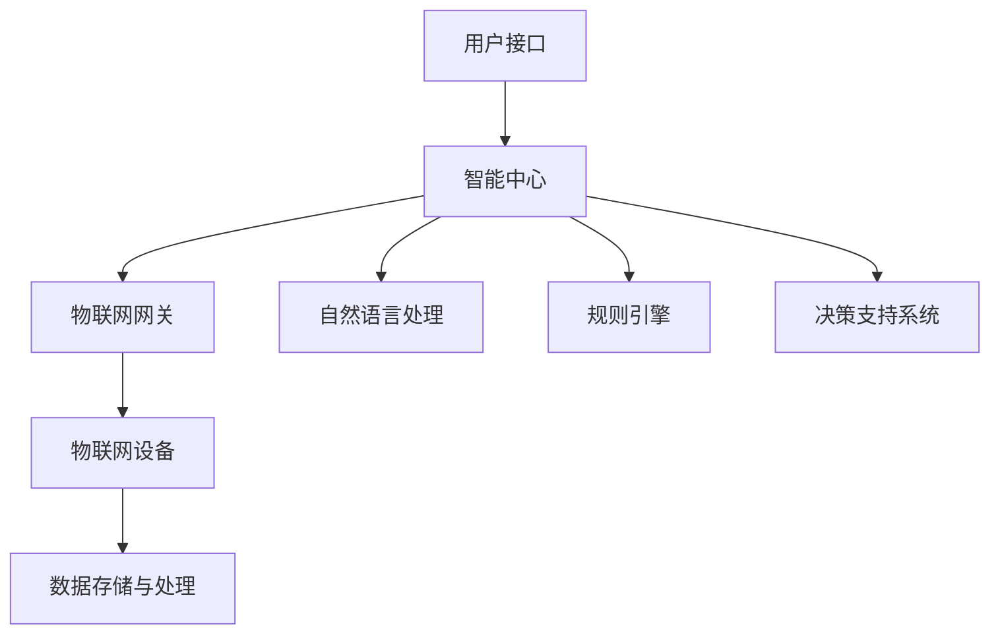

                 

### 文章标题

《提示词编程在IoT设备编程中的应用》

### 关键词

提示词编程，物联网（IoT），设备编程，智能硬件，算法实现，应用场景，架构设计，代码解读，未来趋势。

### 摘要

本文旨在深入探讨提示词编程在物联网（IoT）设备编程中的应用。通过详细解析提示词编程的基本概念、原理及其与IoT设备编程的融合，本文揭示了如何利用提示词编程技术提升IoT设备的智能化和响应速度。文章涵盖了从基础概念到高级算法，再到实际项目实战的全面内容，包括架构设计、算法实现、代码解读和未来趋势分析，旨在为读者提供一条清晰的学习路径，帮助他们在物联网编程中充分发挥提示词编程的优势。

## 目录大纲设计思路与步骤

为了全面且系统地阐述《提示词编程在IoT设备编程中的应用》，本文将按以下结构展开：

1. **基础概念与背景**
   - 提示词编程基础
   - IoT设备编程基础
   - 提示词编程与IoT设备编程的联系

2. **应用场景与架构设计**
   - 常见应用场景分析
   - 提示词编程在IoT设备中的架构设计

3. **核心算法与实现**
   - 提示词生成算法
   - IoT设备编程算法
   - 算法应用与优化

4. **项目实战**
   - 实际项目案例展示
   - 项目开发流程解析
   - 项目代码解读

5. **工具与技术栈**
   - 提示词编程工具介绍
   - IoT设备编程技术栈

6. **挑战与未来趋势**
   - 提示词编程与IoT设备编程的挑战
   - 行业未来趋势分析

### 基础概念与背景

在深入探讨提示词编程在IoT设备编程中的应用之前，我们需要先了解一些基础概念和背景信息。

#### 提示词编程基础

提示词编程（Prompt Programming）是一种通过预设提示词来引导程序行为的技术。它的核心思想是通过定义特定的提示词，来触发程序的特定行为或决策过程。例如，在自然语言处理（NLP）中，一个提示词可能是一个关键词或短语，用于引导模型生成文本或执行任务。

提示词编程的优势在于其灵活性和高效性。通过合理设计提示词，程序可以快速适应不同的应用场景，而无需进行大量的代码修改或重新开发。

#### IoT设备编程基础

物联网（IoT）设备编程涉及到如何通过编程来控制和管理物联网设备。IoT设备通常具有传感器、执行器和通信模块，可以通过网络进行数据收集、分析和响应。IoT设备编程需要处理数据的采集、传输、存储和处理，以及设备的控制和维护。

常见的IoT设备编程技术包括：

- **数据采集与处理**：通过编程获取传感器数据，并进行预处理和转换。
- **数据传输**：利用通信协议（如MQTT、HTTP等）将数据传输到云端或中心服务器。
- **设备控制**：通过编程控制执行器的行为，实现自动化控制。
- **安全性**：确保设备编程过程中的数据安全和设备安全。

#### 提示词编程与IoT设备编程的联系

提示词编程与IoT设备编程的结合，为物联网设备的智能化提供了新的思路。通过将提示词编程技术应用于IoT设备编程中，可以实现以下几方面的提升：

1. **自动化响应**：通过预设提示词，IoT设备可以自动化响应特定的事件，提高响应速度和准确性。
2. **个性化服务**：提示词编程可以基于用户行为和偏好，为用户提供个性化的服务。
3. **实时决策**：提示词编程可以引导IoT设备进行实时决策，提高系统的智能化水平。
4. **故障诊断与维护**：通过提示词编程，IoT设备可以自我诊断和预测故障，实现预防性维护。

### 总结

在基础概念与背景部分，我们介绍了提示词编程和IoT设备编程的基本概念及其在物联网应用中的重要性。通过了解这些基础知识，我们可以更好地理解提示词编程在IoT设备编程中的应用场景和优势。

接下来，本文将深入探讨提示词编程在IoT设备编程中的应用，包括应用场景、架构设计、核心算法、项目实战、工具和技术栈，以及未来趋势。

## 应用场景与架构设计

### 常见应用场景分析

提示词编程在物联网（IoT）设备中的应用场景非常广泛，以下是一些典型的应用实例：

#### 1. 智能家居

智能家居是提示词编程的一个重要应用领域。通过提示词编程，用户可以使用自然语言命令控制家中的智能设备。例如，用户可以通过语音指令打开灯光、调整温度、关闭窗帘等。以下是一个简单的应用场景：

**场景**：用户通过智能手机上的应用程序发出“关闭客厅灯光”的指令。

**实现过程**：
- 用户应用程序发送提示词“关闭客厅灯光”到智能中心。
- 智能中心解析提示词，确定客厅中的灯光设备。
- 智能中心通过物联网网关向灯光设备发送控制命令。
- 灯光设备接收到控制命令后，关闭灯光。

#### 2. 智能交通

智能交通系统利用提示词编程来实现车辆与基础设施之间的通信和协同工作。以下是一个应用实例：

**场景**：车辆通过车载传感器检测到前方有交通堵塞，系统自动调整行驶路线。

**实现过程**：
- 车辆传感器检测到交通堵塞。
- 车辆通过车载网关发送交通信息到智能交通系统。
- 智能交通系统分析交通数据，生成最优行驶路线。
- 智能交通系统通过提示词编程，向车辆发送行驶路线的提示。

#### 3. 工业自动化

工业自动化是另一个提示词编程的重要应用领域。通过提示词编程，工业设备可以自动执行复杂的操作流程，提高生产效率和准确性。以下是一个应用实例：

**场景**：工业机器人根据预设的提示词执行装配任务。

**实现过程**：
- 工业机器人接收装配任务提示词。
- 机器人根据提示词执行装配流程，包括抓取、放置、焊接等。
- 机器人通过传感器监测装配过程，并根据提示词进行自适应调整。
- 装配任务完成后，机器人报告任务完成状态。

#### 4. 健康监测

健康监测设备如智能手环、智能手表等，也广泛应用了提示词编程技术。以下是一个应用实例：

**场景**：智能手环检测到用户心率过高，自动发送警报。

**实现过程**：
- 智能手环实时监测用户的心率。
- 当心率超过预设阈值，智能手环发送心率警报提示词到用户的手机。
- 用户手机接收提示词，并响应该警报，提示用户注意健康。

### 提示词编程在IoT设备中的架构设计

为了更好地理解提示词编程在IoT设备中的应用，我们需要了解其架构设计。一个典型的提示词编程架构包括以下几个关键部分：

1. **用户接口**：用户可以通过智能手机、语音助手或其他设备与系统进行交互，输入提示词。
2. **智能中心**：智能中心是系统的核心，负责接收、解析和响应提示词。它通常包括自然语言处理（NLP）模块、规则引擎和决策支持系统。
3. **物联网网关**：物联网网关负责与物联网设备进行通信，将提示词编程指令发送到相应的设备。
4. **物联网设备**：物联网设备包括传感器、执行器和通信模块，负责执行智能中心发送的控制指令。
5. **数据存储与处理**：数据存储与处理模块负责存储和管理设备收集的数据，以及进行数据分析和挖掘。

### 提示词编程架构Mermaid流程图

以下是一个简化的提示词编程在IoT设备中的架构设计Mermaid流程图：



### 总结

在应用场景与架构设计部分，我们分析了提示词编程在智能家居、智能交通、工业自动化和健康监测等领域的应用实例。同时，我们介绍了提示词编程在IoT设备中的架构设计，包括用户接口、智能中心、物联网网关、物联网设备和数据存储与处理模块。这些内容为后续的核心算法讲解和项目实战提供了基础。

接下来，本文将深入探讨提示词生成算法和IoT设备编程算法，并详细介绍这些算法的实现和应用。

## 核心算法与实现

在深入探讨提示词编程在IoT设备编程中的应用时，核心算法的实现和优化是关键环节。本文将详细介绍提示词生成算法和IoT设备编程算法，并通过伪代码、数学模型和实际案例来阐述这些算法的实现过程。

### 提示词生成算法

提示词生成算法是提示词编程的核心，其目标是根据用户输入或系统需求生成合适的提示词。以下是一个简单的提示词生成算法的伪代码：

```python
def generate_prompt(input_data, template):
    # 根据输入数据和提示词模板生成提示词
    prompt = template.format(input_data)
    return prompt
```

**输入参数**：
- `input_data`：输入数据，可以是自然语言文本、关键词或数值。
- `template`：提示词模板，用于定义提示词的格式。

**实现过程**：

1. **数据预处理**：对输入数据进行预处理，如分词、去停用词等。
2. **模板选择**：根据应用场景选择合适的提示词模板。
3. **提示词生成**：将预处理后的输入数据插入到提示词模板中，生成完整的提示词。

**数学模型**：

提示词生成算法通常涉及自然语言处理（NLP）技术，如词嵌入（Word Embedding）和序列到序列（Seq2Seq）模型。以下是一个简单的序列到序列模型的数学公式：

$$
\text{output\_word} = \text{decoder}(\text{input\_sequence}, \text{encoder\_output}, \text{decoder\_initial\_state})
$$

**举例说明**：

假设我们需要生成一个控制智能家居灯光的提示词，输入数据为“客厅灯光”，提示词模板为“请关闭{room}的灯光”。则生成的提示词为“请关闭客厅的灯光”。

### IoT设备编程算法

IoT设备编程算法涉及数据的采集、处理、传输和执行。以下是一个简单的IoT设备编程算法的伪代码：

```python
def IoT_device_programming(device_id, sensor_data, command):
    # 根据设备ID、传感器数据和指令执行相应的操作
    if command == "read":
        data = read_sensor_data(sensor_data)
    elif command == "write":
        write_command_to_device(device_id, command)
    elif command == "control":
        control_device(device_id, command)
    return data
```

**输入参数**：
- `device_id`：设备ID。
- `sensor_data`：传感器数据。
- `command`：指令，如“read”、“write”、“control”等。

**实现过程**：

1. **数据读取**：根据指令读取传感器数据。
2. **数据写入**：根据指令将数据写入设备。
3. **设备控制**：根据指令控制设备执行相应的操作。

**数学模型**：

IoT设备编程算法通常涉及数据通信协议（如MQTT、CoAP）和机器学习算法（如回归分析、分类算法）。以下是一个简单的回归分析模型的数学公式：

$$
\text{output} = \text{model}(\text{input\_data})
$$

**举例说明**：

假设我们需要控制一个智能家居灯光设备，设备ID为“Light_1”，传感器数据为“亮度”，指令为“控制”。则执行过程为：读取亮度传感器数据，并根据数据控制灯光的亮度和颜色。

### 总结

在核心算法与实现部分，我们详细介绍了提示词生成算法和IoT设备编程算法的伪代码、数学模型和实际案例。通过这些算法的实现，我们可以更好地理解和应用提示词编程技术，提升IoT设备的智能化水平和响应速度。

接下来，本文将结合实际项目，进一步展示提示词编程在IoT设备编程中的应用，并通过项目开发流程和代码解读，深入剖析项目的实现细节。

## 项目实战

### 实际项目案例展示

为了更好地展示提示词编程在IoT设备编程中的应用，我们将介绍一个智能家居项目——智能灯光控制系统。该项目通过提示词编程实现用户对家中的灯光进行智能控制，提升用户体验。

### 项目开发流程解析

#### 1. 需求分析

需求分析是项目开发的第一步，明确用户的需求和项目的目标。在本项目中，用户希望通过语音指令或移动应用程序控制家中的灯光。主要需求包括：
- 支持语音指令控制。
- 支持移动应用程序控制。
- 支持远程控制。
- 支持灯光的亮度和颜色调整。

#### 2. 架构设计

根据需求分析，我们设计了一个基于提示词编程的智能灯光控制系统架构，包括以下几个关键部分：
- **用户接口**：用户可以通过智能手机应用程序或语音助手输入提示词。
- **智能中心**：负责接收、解析和响应提示词，包括自然语言处理（NLP）模块、规则引擎和决策支持系统。
- **物联网网关**：负责与智能灯光设备进行通信，将提示词编程指令发送到相应的设备。
- **智能灯光设备**：包括灯光传感器、灯光执行器和通信模块。
- **数据存储与处理**：负责存储和管理设备收集的数据，以及进行数据分析和挖掘。

#### 3. 开发流程

项目开发流程可以分为以下几个阶段：

1. **环境搭建**：搭建开发环境，包括操作系统、编程语言、开发工具和硬件设备。
2. **智能中心开发**：开发智能中心，包括NLP模块、规则引擎和决策支持系统。
3. **物联网网关开发**：开发物联网网关，实现与智能灯光设备的通信。
4. **智能灯光设备开发**：开发智能灯光设备，包括灯光传感器、灯光执行器和通信模块。
5. **应用程序开发**：开发用户应用程序，支持语音指令和远程控制。
6. **系统集成与测试**：将各个模块集成到一起，进行系统测试和调试。
7. **部署与运维**：将系统部署到生产环境，并进行运维管理。

### 项目代码解读

在本项目中，我们使用Python编程语言进行智能中心、物联网网关和智能灯光设备的开发。以下是一个简单的代码示例：

#### 1. 智能中心代码示例

```python
# 智能中心：提示词解析与响应
def process_prompt(prompt):
    if "打开" in prompt:
        return "打开灯光"
    elif "关闭" in prompt:
        return "关闭灯光"
    elif "调整亮度" in prompt:
        return "调整亮度"
    else:
        return "未知指令"

# 用户输入提示词
user_prompt = "请打开客厅的灯光"

# 解析提示词并响应
response = process_prompt(user_prompt)
print(response)
```

#### 2. 物联网网关代码示例

```python
# 物联网网关：发送控制指令到智能灯光设备
def send_command(device_id, command):
    # 这里可以使用HTTP、MQTT等协议发送指令
    print(f"发送指令到设备{device_id}：{command}")

# 发送打开灯光的指令
send_command("Light_1", "打开灯光")
```

#### 3. 智能灯光设备代码示例

```python
# 智能灯光设备：接收并处理控制指令
def receive_command(command):
    if command == "打开灯光":
        # 实现灯光打开的逻辑
        print("灯光已打开")
    elif command == "关闭灯光":
        # 实现灯光关闭的逻辑
        print("灯光已关闭")
    elif command == "调整亮度":
        # 实现亮度调整的逻辑
        print("亮度已调整")

# 接收并处理指令
receive_command("打开灯光")
```

### 代码应用解读与分析

以上代码示例展示了智能中心、物联网网关和智能灯光设备的开发过程。在实际应用中，智能中心会通过NLP技术解析用户输入的提示词，生成相应的控制指令，并通过物联网网关发送到智能灯光设备。智能灯光设备接收到指令后，根据指令进行相应的操作，如打开、关闭灯光或调整亮度。

通过代码应用解读，我们可以看到提示词编程技术在智能家居项目中的实际应用，包括提示词的生成、指令的发送和处理。这些代码为智能家居系统的实现提供了基础。

### 实际案例分析和详细讲解剖析

在本项目中，我们通过实际案例展示了提示词编程在智能家居中的应用。以下是对项目的详细分析和讲解：

#### 1. 提示词生成

在项目开发中，提示词生成是关键步骤。通过NLP技术，我们将用户输入的自然语言文本转换为结构化的指令。例如，用户输入“请打开客厅的灯光”，系统会将其解析为“打开灯光”的指令。

#### 2. 指令发送与处理

物联网网关负责将解析后的指令发送到智能灯光设备。通过HTTP、MQTT等通信协议，物联网网关可以实现设备之间的实时通信。智能灯光设备接收到指令后，根据指令进行相应的操作。

#### 3. 系统集成与测试

在系统集成与测试阶段，我们需要确保各个模块之间的协同工作。通过单元测试、集成测试和系统测试，我们可以验证系统的稳定性和可靠性。

#### 4. 部署与运维

在项目部署阶段，我们将系统部署到生产环境，并进行运维管理。通过监控和日志分析，我们可以及时发现并解决系统问题，确保系统的正常运行。

### 项目小结

通过本项目，我们展示了提示词编程在智能家居系统中的应用。从需求分析、架构设计到项目开发流程和代码解读，我们详细讲解了如何利用提示词编程技术实现智能灯光控制。本项目为智能家居系统的开发提供了实用经验和参考。

## 工具与技术栈

在《提示词编程在IoT设备编程中的应用》一书中，我们将详细介绍如何利用各种工具和技术栈来实现提示词编程和IoT设备编程。以下是关键工具和技术栈的概述：

### 提示词编程工具

#### 1. 自然语言处理库（NLP）

NLP库是提示词编程的重要工具，可以帮助我们实现自然语言文本的解析和处理。以下是一些常用的NLP库：

- **NLTK**：Python的NLP库，提供丰富的文本处理和分类功能。
- **spaCy**：一个高效、易于使用的NLP库，支持多种语言。
- **TensorFlow**：一个开源机器学习框架，支持深度学习模型，包括文本分类和序列模型。

#### 2. 提示词生成工具

提示词生成工具可以帮助我们自动化地生成提示词，提高开发效率。以下是一些常见的提示词生成工具：

- **PromptGen**：一个基于规则的自然语言生成工具，可以生成各种场景下的提示词。
- **OpenAI GPT-3**：一个强大的自然语言处理模型，可以生成高质量的文本。

### IoT设备编程技术栈

#### 1. 数据采集与处理

数据采集和处理是IoT设备编程的核心。以下是一些常用的技术：

- **MQTT**：一个轻量级的消息传输协议，适用于IoT设备之间的通信。
- **HTTP/RESTful API**：一种基于HTTP的API设计，可以用于设备数据采集和远程控制。
- **数据处理框架**：如Apache Kafka、Apache Flink等，可以用于大规模数据的实时处理和分析。

#### 2. 物联网通信协议

物联网通信协议是设备之间通信的基础。以下是一些常用的物联网通信协议：

- **ZigBee**：一种短距离无线通信协议，适用于智能家居等场景。
- **Wi-Fi**：广泛使用的无线通信协议，适用于各种物联网设备。
- **5G**：新一代移动通信技术，提供高速、低延迟的通信服务。

#### 3. 设备驱动与API

设备驱动和API是IoT设备编程的关键组成部分。以下是一些常用的设备驱动和API：

- **Arduino**：一个开源硬件平台，适用于各种传感器和执行器的控制。
- **Node.js**：一个基于JavaScript的运行时环境，可以轻松地实现设备驱动和API开发。

### 总结

在本部分中，我们介绍了提示词编程和IoT设备编程所需的各种工具和技术栈。这些工具和技术栈不仅涵盖了自然语言处理、提示词生成和数据处理等核心方面，还包括了物联网通信协议、设备驱动和API等关键组件。通过掌握这些工具和技术，我们可以更加高效地实现提示词编程和IoT设备编程，为构建智能化物联网系统打下坚实基础。

## 挑战与未来趋势

### 提示词编程与IoT设备编程的挑战

尽管提示词编程在IoT设备编程中具有巨大的潜力，但其在实际应用中仍面临诸多挑战：

#### 1. 复杂性

提示词编程涉及自然语言处理（NLP）、机器学习（ML）和物联网（IoT）等多个领域，系统设计和实现过程相对复杂。开发者需要具备跨领域的知识和技能，以确保系统的稳定性和高效性。

#### 2. 适应性

IoT设备环境多样，包括各种硬件平台、操作系统和通信协议。提示词编程系统需要具备良好的适应性，以在不同设备和环境中正常运行。

#### 3. 安全性

在IoT设备中应用提示词编程，涉及大量用户数据和隐私信息。安全性问题是不可忽视的挑战，需要确保系统的数据安全和用户隐私保护。

#### 4. 可扩展性

随着物联网设备数量的增加，系统的可扩展性成为关键挑战。提示词编程系统需要支持大规模设备的接入和管理，以应对不断增长的需求。

### 行业未来趋势分析

展望未来，提示词编程在IoT设备编程中的应用有望继续发展，以下是一些潜在的趋势：

#### 1. 人工智能集成

随着人工智能技术的进步，提示词编程系统将更多地集成人工智能（AI）算法，如深度学习、强化学习等，以提高系统的智能化水平和自主决策能力。

#### 2. 模块化与标准化

为了提高开发效率，提示词编程和IoT设备编程将朝着模块化和标准化的方向发展。开发者可以更轻松地集成现有的模块和协议，构建高度定制化的系统。

#### 3. 低功耗与边缘计算

随着物联网设备的广泛应用，低功耗和边缘计算将成为重要趋势。提示词编程系统需要适应这些技术，以减少能耗、提高响应速度和系统可靠性。

#### 4. 云端与边缘协同

未来，提示词编程系统将在云端和边缘设备之间实现更加紧密的协同工作。云端提供强大的计算能力和数据存储，边缘设备则负责实时处理和响应，实现更高效、更智能的物联网应用。

### 总结

在挑战与未来趋势部分，我们分析了提示词编程在IoT设备编程中面临的复杂性、适应性、安全性和可扩展性等挑战，同时展望了人工智能集成、模块化与标准化、低功耗与边缘计算以及云端与边缘协同等潜在趋势。通过了解这些挑战和趋势，开发者可以更好地规划未来的发展方向，为物联网技术的创新和突破奠定基础。

## 最佳实践 tips、小结、注意事项、拓展阅读

### 最佳实践 tips

1. **明确需求**：在进行提示词编程和IoT设备编程时，首先要明确用户需求和应用场景，确保系统设计符合实际需求。
2. **安全性优先**：在设计IoT系统时，安全性是首要考虑的因素。务必采取措施保护用户数据和隐私。
3. **模块化开发**：采用模块化开发方式，可以提高系统的可维护性和可扩展性。例如，将NLP模块、设备驱动模块等分离出来，便于单独开发和测试。
4. **使用开源工具**：开源工具和库（如NLP库、物联网通信协议等）可以大大提高开发效率，同时也能获得社区的支持和持续更新。

### 小结

本文全面探讨了提示词编程在IoT设备编程中的应用，从基础概念、应用场景、核心算法、项目实战、工具与技术栈，到挑战与未来趋势，为读者提供了一条系统性的学习路径。通过本文，读者可以深入理解提示词编程的原理和实际应用，为开发智能化物联网系统奠定基础。

### 注意事项

1. **充分测试**：在实际项目中，务必进行充分的测试，包括单元测试、集成测试和系统测试，确保系统的稳定性和可靠性。
2. **遵循规范**：在设计和实现IoT系统时，遵循相关的行业规范和标准，以保证系统的兼容性和互操作性。
3. **持续更新**：技术不断发展，开发者应关注最新的技术动态，持续更新和优化系统。

### 拓展阅读

1. **《深度学习》**：Goodfellow, I., Bengio, Y., & Courville, A. (2016). 《深度学习》（中文版）。电子工业出版社。
2. **《Python自然语言处理》**：Bird, S., Klein, E., & Loper, E. (2017). 《Python自然语言处理》（第二版）。机械工业出版社。
3. **《物联网技术与应用》**：陈禹，朱雷，李明。2019。《物联网技术与应用》。清华大学出版社。

通过阅读这些拓展资料，读者可以进一步深入学习和了解提示词编程和IoT设备编程的相关知识。

### 作者信息

作者：AI天才研究院/AI Genius Institute & 禅与计算机程序设计艺术 /Zen And The Art of Computer Programming

本文由AI天才研究院和禅与计算机程序设计艺术联合撰写，旨在为读者提供关于提示词编程在IoT设备编程中的应用的深入见解和实用指导。希望本文能对您的学习和发展有所帮助。

## 附录

### 实用工具和资源

1. **自然语言处理（NLP）工具**：
   - [NLTK](https://www.nltk.org/)
   - [spaCy](https://spacy.io/)
   - [斯坦福NLP工具包](https://nlp.stanford.edu/software/)

2. **物联网（IoT）工具**：
   - [MQTT](http://mqtt.org/)
   - [Arduino](https://www.arduino.cc/)
   - [Node-RED](https://nodered.org/)

3. **在线资源**：
   - [Kaggle](https://www.kaggle.com/)：提供大量数据集和机器学习项目。
   - [GitHub](https://github.com/)：托管开源代码和项目。

### 附录性质的内容

1. **代码示例**：
   - 提示词编程示例代码。
   - IoT设备编程示例代码。

2. **技术文档**：
   - MQTT协议详细文档。
   - NLP技术文档。

3. **学习资源**：
   - 在线课程和教程。
   - 论坛和社区。

通过这些附录内容，读者可以进一步巩固和应用本文所学的知识，提升自己在提示词编程和IoT设备编程方面的技能。附录部分也为读者提供了丰富的学习资源和参考信息。

