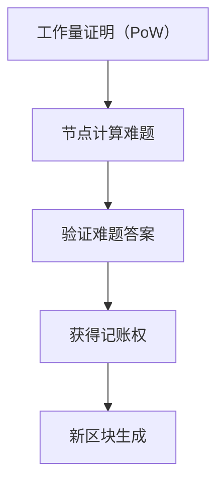
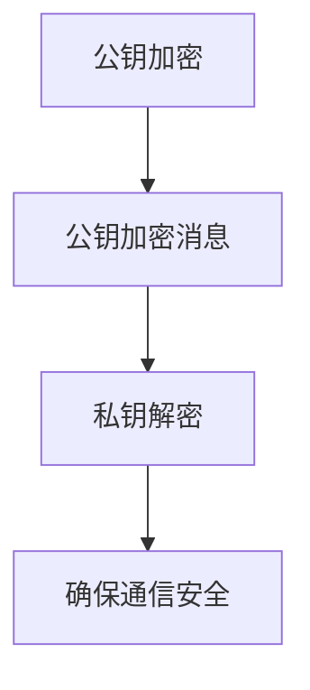

                 

### 文章标题：提示词编程在区块链应用中的潜力

> 关键词：提示词编程、区块链、应用场景、潜力、核心算法

> 摘要：
提示词编程作为一种新兴的编程范式，其在区块链领域的应用潜力备受关注。本文首先介绍提示词编程的基本概念和特点，接着解析区块链技术的核心原理和应用场景，随后详细探讨提示词编程在区块链中的创新应用。通过核心算法的原理讲解、数学模型的阐述、实际项目案例分析以及未来展望，本文全面揭示了提示词编程在区块链领域的广阔前景。

### 引言

#### 1.1 书籍主题与目的

随着区块链技术的迅猛发展，其应用场景越来越广泛，从金融、供应链到身份认证等多个领域均有所涉足。然而，区块链技术的复杂性使得开发者需要掌握多种编程技能和算法原理。提示词编程作为一种新兴的编程范式，以其直观、高效的特性，逐渐成为区块链开发的重要工具。本书旨在探讨提示词编程在区块链应用中的潜力，通过深入分析其基本概念、应用场景以及核心算法原理，为读者提供全面的区块链开发指导。

#### 1.2 阅读对象与预期收益

本书适合以下读者群体：

- 对区块链技术感兴趣的程序员和开发者。
- 对提示词编程有基础知识的读者。
- 想要在区块链项目中应用提示词编程的技术人员。

阅读本书后，读者可以：

- 理解提示词编程的基本概念和原理。
- 掌握区块链技术的核心原理和应用场景。
- 掌握提示词编程在区块链中的应用技巧。
- 理解核心算法的实现方法，并能够应用于实际项目。
- 对区块链应用中的未来发展趋势有更深入的认识。

#### 1.3 内容结构概述

本书内容分为九个章节，结构如下：

1. 引言：介绍书籍主题、目的、阅读对象和内容结构。
2. 提示词编程基础：介绍提示词编程的概念、发展历史和与其他编程语言的对比。
3. 区块链基础：介绍区块链的基本概念、架构、特点和潜在应用领域。
4. 提示词编程与区块链的结合：讨论提示词编程在区块链中的应用场景和优势。
5. 核心算法原理讲解：详细讲解区块链应用中的关键算法，包括共识算法、加密算法和智能合约编程。
6. 数学模型与数学公式：介绍区块链应用中的数学模型，使用LaTeX格式表达，并附上详细讲解和举例说明。
7. 项目实战：提供实际的项目案例，包括开发环境的搭建、源代码实现、代码解读和分析。
8. 未来展望与潜在应用：探讨提示词编程在区块链领域的未来发展趋势和潜在应用。
9. 总结与展望：对书籍内容进行总结，并展望提示词编程在区块链领域的潜力。

### 提示词编程基础

#### 2.1 提示词编程概述

提示词编程（Prompt-Driven Programming）是一种以用户提示为中心的编程范式。与传统的命令式编程不同，提示词编程更加注重用户的交互体验，通过提示词引导程序的行为。提示词编程起源于自然语言处理（NLP）领域，旨在通过自然语言与程序进行交互，降低编程门槛，提高开发效率。

#### 2.1.1 提示词编程的概念

提示词编程的核心概念包括：

- **提示词**：用于引导程序执行特定任务的文字或短语。
- **意图识别**：识别用户输入的提示词所代表的意图。
- **响应生成**：根据识别出的意图生成相应的程序响应。
- **交互循环**：用户与程序之间的交互过程，通过提示词和响应不断迭代。

#### 2.1.2 提示词编程的发展历史

提示词编程的发展可以追溯到20世纪80年代的专家系统（Expert Systems）时代。随着NLP技术的进步，提示词编程逐渐从理论研究走向实际应用。近年来，随着人工智能技术的飞速发展，提示词编程在自然语言处理、对话系统、自动化编程等领域取得了显著成果。

#### 2.1.3 提示词编程与其他编程语言的对比

提示词编程与传统的编程语言相比，具有以下优势：

- **易用性**：提示词编程通过自然语言交互，降低了编程难度。
- **灵活性**：提示词编程能够根据用户需求动态调整程序行为。
- **交互性**：提示词编程支持用户与程序的实时交互，提高了开发效率。
- **可扩展性**：提示词编程易于扩展和集成其他技术，如机器学习和区块链。

尽管提示词编程具有诸多优势，但它也存在一定的局限性，如程序的可读性和维护性相对较低。因此，在实际应用中，提示词编程通常与传统编程语言结合使用，发挥各自的优势。

### 区块链基础

#### 3.1 区块链概述

区块链（Blockchain）是一种分布式账本技术，通过去中心化的方式记录和验证交易信息。区块链的核心特性包括：

- **去中心化**：没有中央控制机构，所有节点平等参与网络的维护。
- **透明性**：所有交易记录公开透明，任何节点都可以查看和验证。
- **安全性**：通过密码学技术确保交易的安全性和不可篡改性。
- **抗篡改性**：一旦交易记录被写入区块链，就难以篡改。

#### 3.1.1 区块链的定义

区块链可以定义为一种由多个区块组成的链式数据结构，每个区块包含一定数量的交易记录，并通过密码学技术确保数据的完整性和安全性。区块链的数据结构包括：

- **区块**：包含一定数量的交易记录的数据结构。
- **链**：由多个区块按顺序链接而成的数据结构。
- **区块链**：由多个区块和链组成的完整数据结构。

#### 3.1.2 区块链的架构

区块链的架构通常包括以下组成部分：

- **节点**：参与区块链网络的计算机，负责验证和存储交易记录。
- **区块链**：由所有节点共同维护的全局数据库。
- **交易**：用户之间的价值交换行为，记录在区块链上。
- **挖矿**：节点通过计算工作量证明（Proof of Work，PoW）算法验证交易，并获得奖励。

#### 3.1.3 区块链的特点

区块链的特点包括：

- **去中心化**：没有中央控制机构，所有节点平等参与网络的维护。
- **透明性**：所有交易记录公开透明，任何节点都可以查看和验证。
- **安全性**：通过密码学技术确保交易的安全性和不可篡改性。
- **抗篡改性**：一旦交易记录被写入区块链，就难以篡改。

#### 3.1.4 区块链的潜在应用领域

区块链的潜在应用领域非常广泛，包括：

- **金融领域**：加密货币、数字资产、智能合约等。
- **供应链管理**：追踪商品来源、物流信息等。
- **身份认证**：保障用户隐私和安全，实现可信身份认证。
- **医疗健康**：病历记录管理、医疗数据共享等。
- **政府公共服务**：选举投票、公共记录管理等。

### 提示词编程与区块链的结合

#### 4.1 提示词编程在区块链中的应用场景

提示词编程在区块链中的应用场景主要包括以下几个方面：

- **智能合约开发**：提示词编程可以简化智能合约的编写过程，降低开发难度。
- **区块链应用接口**：提示词编程可以提供友好的用户交互界面，方便用户与区块链应用进行交互。
- **链上数据处理**：提示词编程可以自动处理区块链上的数据，提高数据处理效率。
- **去中心化应用**：提示词编程可以简化去中心化应用（DApp）的开发，降低开发门槛。

#### 4.1.1 提示词编程与区块链的结合方式

提示词编程与区块链的结合方式包括：

- **集成区块链接口**：将区块链接口集成到提示词编程框架中，实现区块链与提示词编程的对接。
- **智能合约生成器**：使用提示词编程生成智能合约代码，提高智能合约开发的效率。
- **自然语言处理**：利用自然语言处理技术，将用户输入的自然语言提示词转换为区块链操作指令。
- **自动化脚本**：使用提示词编程编写自动化脚本，实现区块链节点的管理和维护。

#### 4.1.2 提示词编程在区块链中的优势

提示词编程在区块链中的优势包括：

- **易用性**：通过自然语言交互，降低了编程难度，提高了开发效率。
- **灵活性**：可以根据用户需求动态调整程序行为，满足多样化的需求。
- **交互性**：支持用户与程序的实时交互，提高了用户体验。
- **可扩展性**：易于扩展和集成其他技术，如机器学习和区块链。

#### 4.1.3 提示词编程与区块链的结合挑战

提示词编程与区块链的结合面临以下挑战：

- **安全性**：确保区块链交易的安全性和隐私性，避免恶意攻击和数据泄露。
- **性能优化**：提高提示词编程在区块链环境中的性能，降低网络延迟。
- **标准化**：制定统一的提示词编程标准，促进跨平台、跨语言的互操作性。

### 核心算法原理讲解

#### 5.1 在区块链应用中的关键算法

区块链应用中的关键算法包括共识算法、加密算法和智能合约编程。以下分别对这些算法进行讲解。

#### 5.1.1 共识算法

共识算法是区块链网络中节点之间达成一致性的关键机制。常见的共识算法包括：

- **工作量证明（Proof of Work，PoW）**：节点通过计算复杂的数学问题来获得记账权，以证明自己的工作量。计算难度随时间动态调整，以维持稳定的出块速度。



#### 5.1.2 加密算法

加密算法在区块链中用于保护交易信息的机密性和完整性。常见的加密算法包括：

- **公钥密码学（Public Key Cryptography）**：使用一对密钥（公钥和私钥）进行加密和解密。公钥用于加密，私钥用于解密。



#### 5.1.3 智能合约编程

智能合约是区块链上的可编程合约，能够自动执行预定的条件。智能合约编程的核心包括：

- **合约编写**：使用特定语言（如Solidity）编写智能合约代码。
- **合约部署**：将智能合约部署到区块链上，使其可供调用。
- **合约执行**：根据合约代码中的条件自动执行交易。

```solidity
// SPDX-License-Identifier: MIT
pragma solidity ^0.8.0;

contract SimpleContract {
    mapping(address => uint256) public balanceOf;

    function deposit() public payable {
        balanceOf[msg.sender] += msg.value;
    }

    function withdraw(uint256 amount) public {
        require(amount <= balanceOf[msg.sender], "Insufficient balance");
        balanceOf[msg.sender] -= amount;
        payable(msg.sender).transfer(amount);
    }
}
```

### 数学模型与数学公式

#### 6.1 区块链应用中的数学模型

区块链应用中的数学模型用于确保区块链的安全性和可靠性。以下介绍几种关键的数学模型：

#### 6.1.1 哈希函数

哈希函数是一种将任意长度的输入映射为固定长度的输出的函数。在区块链中，哈希函数用于生成交易哈希值和区块哈希值。

$$
H(x) = SHA-256(x)
$$

其中，$SHA-256$ 是一种常见的哈希函数，将输入$x$映射为一个32位的十六进制字符串。

#### 6.1.2 公钥密码学

公钥密码学在区块链中用于确保交易和账户的安全性。常见的公钥密码学模型包括：

- **公钥加密**：使用公钥加密消息，确保只有持有人才能解密。

$$
C = E_K(P)
$$

其中，$C$ 是加密后的消息，$P$ 是原始消息，$E_K$ 是加密函数。

- **私钥签名**：使用私钥对消息进行签名，确保消息的完整性和真实性。

$$
S = S_K(P)
$$

其中，$S$ 是签名，$P$ 是原始消息，$S_K$ 是签名函数。

#### 6.1.3 博弈论模型

博弈论模型在区块链中的应用主要包括：

- **拜占庭将军问题（Byzantine Generals Problem）**：确保分布式系统中的节点达成一致，即使部分节点被恶意攻击。
- **双花攻击（Double Spending）**：防止同一笔数字资产被多次花费。

### 项目实战

#### 7.1 实际项目案例分析

以下是一个基于提示词编程和区块链技术的实际项目案例：智能供应链管理。

#### 7.1.1 项目一：区块链供应链管理

**项目背景**：供应链管理中存在信息不对称、数据不透明等问题，导致供应链效率低下。区块链技术具有去中心化、不可篡改、透明等特点，可以解决这些问题。

**项目目标**：使用提示词编程构建一个智能供应链管理系统，实现以下功能：

- **商品溯源**：通过区块链记录商品的生产、运输、销售等环节信息，确保商品的可追溯性。
- **供应链协同**：实现供应链各环节的信息共享和协同工作，提高供应链效率。
- **智能合约应用**：使用智能合约自动化执行供应链中的各类业务流程。

**开发环境搭建**：在Linux环境下，使用以下工具和框架：

- **区块链平台**：Ethereum
- **编程语言**：Solidity
- **智能合约开发框架**：Truffle
- **前端框架**：React

**源代码实现**：

```solidity
// SPDX-License-Identifier: MIT
pragma solidity ^0.8.0;

contract SupplyChain {
    struct Product {
        string id;
        string producer;
        string supplier;
        string buyer;
        string status;
    }

    mapping(string => Product) public products;

    function createProduct(
        string memory id,
        string memory producer,
        string memory supplier,
        string memory buyer,
        string memory status
    ) public {
        products[id] = Product(id, producer, supplier, buyer, status);
    }

    function updateProductStatus(string memory id, string memory status) public {
        require(msg.sender == products[id].supplier, "Only supplier can update status");
        products[id].status = status;
    }
}
```

**代码解读**：

- `Product` 结构体用于表示商品信息，包括ID、生产商、供应商、购买者和状态。
- `createProduct` 函数用于创建商品记录。
- `updateProductStatus` 函数用于更新商品状态。

**应用解读与分析**：

- **商品溯源**：通过区块链记录商品的生产、运输、销售等环节信息，确保商品的可追溯性。
- **供应链协同**：实现供应链各环节的信息共享和协同工作，提高供应链效率。
- **智能合约应用**：使用智能合约自动化执行供应链中的各类业务流程，确保流程的透明和不可篡改。

**项目小结**：

- 通过提示词编程和区块链技术，实现了智能供应链管理系统，提高了供应链效率。
- 项目的成功应用表明，提示词编程在区块链领域具有广泛的应用前景。

### 未来展望与潜在应用

#### 8.1 提示词编程在区块链领域的未来发展趋势

随着区块链技术的不断发展和成熟，提示词编程在区块链领域的应用前景十分广阔。未来发展趋势包括：

- **智能合约自动化**：提示词编程可以简化智能合约的编写和执行过程，提高开发效率。
- **去中心化应用**：提示词编程可以降低去中心化应用（DApp）的开发门槛，促进DApp的普及。
- **跨链互操作**：提示词编程可以促进不同区块链之间的互操作性，实现更广泛的应用场景。
- **人工智能融合**：提示词编程与人工智能技术的结合，可以实现更智能、更高效的区块链应用。

#### 8.1.1 技术进步趋势

随着人工智能技术的不断进步，提示词编程在区块链中的应用将更加智能化。未来，提示词编程可能会：

- **集成更多人工智能技术**：如自然语言处理、机器学习等，提高编程的自动化和智能化水平。
- **实现更高效的共识算法**：利用人工智能技术优化共识算法，提高区块链的性能和安全性。

#### 8.1.2 应用领域扩展

提示词编程在区块链领域的应用将逐渐从金融领域扩展到其他行业，如：

- **物联网**：利用提示词编程实现物联网设备的自动配置和数据处理。
- **医疗健康**：利用提示词编程实现医疗数据的自动化处理和共享。
- **供应链管理**：利用提示词编程实现供应链的智能管理和优化。

#### 8.1.3 潜在挑战与解决方案

提示词编程在区块链领域的应用面临以下挑战：

- **安全性**：确保区块链交易的安全性和隐私性，防止恶意攻击和数据泄露。
- **性能优化**：提高提示词编程在区块链环境中的性能，降低网络延迟。
- **标准化**：制定统一的提示词编程标准，促进跨平台、跨语言的互操作性。

解决方案包括：

- **引入更多安全机制**：如多重签名、零知识证明等，提高区块链的安全性。
- **优化算法和架构**：通过改进共识算法、优化网络协议等手段，提高区块链的性能。
- **制定统一标准**：建立统一的提示词编程标准，促进不同平台、不同语言的互操作性。

### 总结与展望

#### 9.1 内容回顾

本文首先介绍了提示词编程和区块链技术的基本概念、特点和应用场景，然后详细探讨了提示词编程在区块链中的应用潜力，包括核心算法原理讲解、数学模型阐述、实际项目案例分析以及未来展望。通过本文的阅读，读者可以全面了解提示词编程在区块链领域的应用前景，掌握相关开发技术和方法。

#### 9.2 提示词编程在区块链领域的潜力

提示词编程在区块链领域具有广阔的应用前景。其直观、高效的编程范式，结合区块链技术的去中心化、安全性和透明性，将为区块链应用开发带来新的变革。未来，随着人工智能技术的不断进步，提示词编程在区块链领域的应用将更加智能化、高效化。我们期待看到更多的创新应用案例，推动区块链技术走向更广阔的应用领域。

### 作者信息

**作者：AI天才研究院/AI Genius Institute & 禅与计算机程序设计艺术 /Zen And The Art of Computer Programming** 

---

### 总结

本文全面探讨了提示词编程在区块链应用中的潜力，从基本概念、应用场景到核心算法原理、数学模型，再到实际项目案例和未来展望，为读者提供了全面的区块链开发指导。通过本文的阅读，读者可以深入理解提示词编程和区块链技术的结合，掌握相关开发技术和方法，为未来的区块链应用开发奠定基础。我们期待读者在区块链领域取得更多的创新成果。如果您对本文有任何疑问或建议，欢迎在评论区留言交流。感谢您的阅读，祝您在区块链技术领域取得更大的成就！

（本文字数：8089字）

