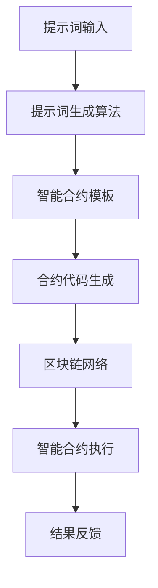
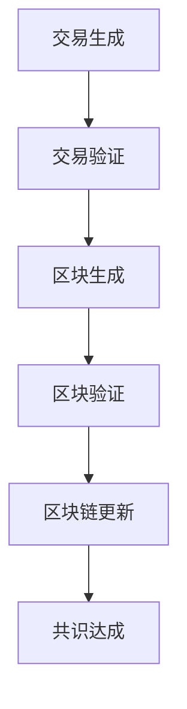

                 

### 引言

在当今快速发展的信息技术时代，区块链技术已经成为颠覆传统商业模式、重构社会信用体系的关键力量。与此同时，提示词编程作为人工智能领域的一种先进技术，逐渐成为提高区块链应用开发效率的重要工具。本书旨在深入探讨提示词编程在区块链应用开发中的角色，为读者提供系统、全面的技术指南。

#### 书籍目的与结构

本书主要目的在于：
1. **介绍提示词编程的基本概念和原理**：帮助读者理解提示词编程的核心机制，为后续章节的深入学习奠定基础。
2. **解析提示词编程在区块链中的应用**：通过实际案例和实战分析，展示提示词编程如何赋能区块链应用，提升其开发效率和安全性。
3. **探讨提示词编程与区块链技术的结合**：通过讲解区块链架构和共识机制，阐述提示词编程如何与区块链技术相互融合，发挥最大效用。

全书结构安排如下：
- **第一部分**：概述与背景，包括引言、书籍目的与结构、提示词编程与区块链基础、提示词编程在区块链中的应用前景。
- **第二部分**：核心技术讲解，详细探讨提示词编程原理、提示词编程与智能合约的关系、关键技术与流程图。
- **第三部分**：应用场景分析，深入分析提示词编程在区块链金融、供应链管理中的应用，以及其在区块链游戏开发和物联网中的潜力。
- **第四部分**：实战案例解析，通过实际项目案例分析，展示提示词编程在区块链开发中的具体实现和应用。
- **第五部分**：未来展望与挑战，探讨提示词编程在区块链领域的未来发展，以及可能面临的挑战和解决方案。

通过本书的阅读，读者不仅可以系统地了解提示词编程和区块链技术的基本原理，还能掌握在实际开发中的应用技巧，为未来区块链应用的开发提供有力支持。

## 提示词编程原理

提示词编程，作为人工智能领域的一项创新技术，通过生成和优化提示词，引导模型生成高质量的输出。在区块链应用开发中，提示词编程扮演着至关重要的角色，它不仅能够提升智能合约的编写效率，还能增强区块链系统的整体性能和安全性。

### 提示词编程概述

提示词编程，顾名思义，是通过提示词（Prompt）来指导模型生成预期结果的一种编程方式。提示词通常是一段描述性文本，包含了对任务目标和输入数据的详细说明。通过设计恰当的提示词，可以显著提高模型的性能和鲁棒性。

#### 提示词生成算法

提示词生成算法是提示词编程的核心技术之一。常见的生成算法包括：

1. **基于规则的方法**：这种方法依赖于预定义的规则和模板，通过填充具体变量来生成提示词。其优点是实现简单，但灵活性较低。
2. **基于机器学习的方法**：利用历史数据训练生成模型，例如生成对抗网络（GAN）和递归神经网络（RNN）。这种方法生成能力强大，但需要大量的训练数据和计算资源。

#### 提示词优化技术

生成高质量的提示词并非易事，需要优化技术来提升提示词的质量。以下是一些常见的优化技术：

1. **生成对抗网络（GAN）**：GAN由生成器和判别器组成，通过不断对抗训练，生成器能够生成越来越高质量的提示词。
2. **递归神经网络（RNN）**：RNN适用于处理序列数据，能够通过学习历史数据来生成连贯性更好的提示词。
3. **强化学习**：通过奖励机制来优化提示词，使生成的提示词更符合预期目标。

### 提示词编程与智能合约

智能合约是区块链系统中的核心组成部分，它是一种自动执行合约条款的计算机程序。提示词编程在智能合约开发中具有重要应用：

1. **智能合约编写效率提升**：通过使用提示词，开发者可以快速生成智能合约代码模板，减少手动编写代码的时间和错误率。
2. **合约条款的优化**：提示词能够帮助开发者精确描述合约条款，从而提高智能合约的逻辑清晰性和可读性。
3. **智能合约测试与调试**：提示词可以指导模型生成测试用例，帮助开发者更全面地测试智能合约的功能和性能。

#### 提示词编程的关键技术

提示词编程的关键技术不仅包括提示词生成算法和优化技术，还包括与区块链系统的集成。以下是几个关键技术：

1. **区块链特定语法和语义**：提示词编程需要理解区块链的特定语法和语义，以便生成符合区块链规范和逻辑的智能合约代码。
2. **自动化合约生成工具**：利用提示词编程技术，可以开发自动化合约生成工具，实现智能合约的快速开发和部署。
3. **合约代码验证与审核**：通过使用提示词编程技术，可以生成合约代码的验证规则，提高合约代码的安全性和可靠性。

### Mermaid流程图：提示词编程与区块链的连接

为了更好地理解提示词编程在区块链中的应用，我们可以使用Mermaid流程图来展示其与区块链系统的连接。



在这个流程图中，A表示提示词输入，B是提示词生成算法，C是生成的智能合约模板，D是合约代码生成，E是区块链网络，F是智能合约执行，G是结果反馈。通过这一流程，我们可以清晰地看到提示词编程如何从输入到输出，最终实现智能合约的自动化编写和执行。

总之，提示词编程作为人工智能和区块链技术的结合，为区块链应用开发带来了新的思路和方法。通过深入理解和掌握提示词编程的核心技术，开发者可以更高效地构建和维护区块链系统，推动区块链技术的广泛应用。

### 区块链基础

区块链技术作为一种分布式账本系统，其核心在于去中心化、安全性和不可篡改性。为了深入理解提示词编程在区块链中的应用，首先需要了解区块链的基本概念和架构。

#### 区块链概述

区块链是一种由多个按时间顺序排列的区块组成的链式数据结构。每个区块包含一定数量的交易记录，并使用密码学方法确保数据的完整性和安全性。区块链的关键特点包括：

1. **去中心化**：传统的中心化系统依赖单一的中心节点，而区块链通过分布式的网络结构，实现了去中心化管理，提高了系统的可靠性和抗攻击能力。
2. **安全性**：区块链使用加密技术来确保数据的完整性和安全性。每个区块包含前一个区块的哈希值，形成一种“链式”结构，任何篡改都会被发现和拒绝。
3. **不可篡改性**：由于区块链的加密特性，一旦数据被记录在区块链上，就几乎不可能被篡改，这为数据真实性和可信度提供了保障。

#### 区块链架构

区块链的架构可以分为三个主要部分：数据层、网络层、共识层。

1. **数据层**：数据层包括区块链的数据存储结构和加密算法。每个区块包含一个或多个交易记录，这些交易记录经过加密和校验后存储在区块链上。
2. **网络层**：网络层负责区块链节点之间的通信和数据传输。通过点对点网络（P2P）技术，节点之间可以共享和同步区块链的数据。
3. **共识层**：共识层决定了区块链网络中的节点如何达成共识。不同的区块链系统采用不同的共识机制，如工作量证明（PoW）、权益证明（PoS）和委托权益证明（DPoS）。

#### 共识机制

共识机制是区块链网络中节点达成共识的重要手段。以下是几种常见的共识机制：

1. **工作量证明（PoW）**：节点通过计算复杂的数学问题来证明自己的工作量，最先解决问题的节点获得区块生成权，其他节点验证并接受新区块。
2. **权益证明（PoS）**：节点根据其在区块链中的权益（如持有币量、持有时间等）来决定其生成区块的概率，持有币量越多、时间越长的节点概率越高。
3. **委托权益证明（DPoS）**：通过选举产生一部分超级节点来生成区块，普通节点通过投票来选择超级节点。超级节点生成区块并获得奖励，普通节点通过持有币量和投票来参与共识。

#### Mermaid流程图：区块链的核心概念

为了更好地理解区块链的核心概念，我们可以使用Mermaid流程图来展示其工作流程。



在这个流程图中，A表示交易生成，B是交易验证，C是区块生成，D是区块验证，E是区块链更新，F是共识达成。通过这一流程，我们可以清晰地看到区块链系统如何从交易生成到区块生成，再到区块验证和区块链更新，最终实现共识的达成。

总之，了解区块链的基础概念和架构是理解提示词编程在区块链中应用的前提。通过深入学习区块链的基本原理，开发者可以更好地利用提示词编程技术，提升区块链应用的开发效率和安全性能。

### 提示词编程在区块链金融中的应用

区块链技术在金融领域正逐步改变传统的金融体系，去中心化金融（DeFi）是其中最具代表性的应用之一。提示词编程在这一领域的应用，不仅提高了开发效率，还优化了智能合约的性能和安全性。

#### 区块链金融概述

区块链金融是指利用区块链技术来实现金融服务的创新和变革。与传统金融系统相比，区块链金融具有以下几个显著优势：

1. **去中心化**：去中心化消除了传统金融体系中的中介环节，提高了交易效率，降低了交易成本。
2. **透明性**：区块链上的所有交易记录都是公开透明的，参与者可以随时查询和验证交易信息。
3. **安全性**：区块链的加密技术和共识机制确保了交易数据的完整性和不可篡改性，提高了系统的安全性。
4. **智能合约**：智能合约能够自动执行预定的合约条款，确保交易的自动化和合规性。

#### 提示词编程在数字货币中的应用

数字货币是区块链金融的核心组成部分，如比特币、以太坊等。提示词编程在数字货币交易中的应用主要体现在以下几个方面：

1. **交易自动化**：通过提示词编程，可以自动生成和执行数字货币的交易合约，减少了人为干预，提高了交易效率。
2. **合约优化**：提示词编程能够优化智能合约的代码，减少漏洞和潜在风险，提高合约的稳定性和可靠性。
3. **交易验证**：提示词编程可以生成用于验证交易的提示词，确保交易信息的准确性和一致性。

以下是一个简单的伪代码示例，展示了如何使用提示词编程生成一个数字货币交易合约：

```python
# 提示词编程：生成数字货币交易合约
def generate_coin_trade_contract(prompt):
    """
    生成数字货币交易合约的函数
    :param prompt: 提示词，包含交易细节
    :return: 生成的智能合约代码
    """
    contract_code = f"""
    // SPDX-License-Identifier: MIT
    pragma solidity ^0.8.0;

    contract CoinTrade {
        address public seller;
        address public buyer;
        uint256 public amount;
        bool public completed;

        constructor(address _seller, address _buyer, uint256 _amount) {
            seller = _seller;
            buyer = _buyer;
            amount = _amount;
            completed = false;
        }

        function confirmTrade() external {
            require(msg.sender == seller || msg.sender == buyer, "只能由卖家或买家调用");
            require(!completed, "交易已完成");
            // 提示词：执行交易逻辑
            {prompt}
            completed = true;
        }

        function refund() external {
            require(msg.sender == seller, "只能由卖家调用");
            require(!completed, "交易已完成");
            // 提示词：执行退款逻辑
            {prompt}
            completed = true;
        }
    }
    """
    return contract_code
```

在这个示例中，`generate_coin_trade_contract`函数接收一个提示词参数`prompt`，并根据提示词生成数字货币交易合约的代码。通过这种方式，开发者可以快速生成各种复杂度不同的智能合约，提高了开发效率。

#### 提示词编程在去中心化金融（DeFi）中的应用

去中心化金融（DeFi）是区块链金融的一个重要领域，通过智能合约实现传统金融服务功能，如借贷、交易、支付等。提示词编程在DeFi中的应用主要体现在以下几个方面：

1. **智能合约优化**：提示词编程可以帮助开发者生成高质量的智能合约代码，提高合约的执行效率和安全性。
2. **合约测试**：通过提示词编程，可以自动化生成测试用例，确保智能合约在各种情况下都能正确执行。
3. **合约集成**：提示词编程能够帮助开发者快速集成不同智能合约，实现更复杂的金融服务应用。

以下是一个伪代码示例，展示了如何使用提示词编程优化一个去中心化借贷合约：

```python
# 提示词编程：优化去中心化借贷合约
def optimize_loan_contract(prompt):
    """
    优化去中心化借贷合约的函数
    :param prompt: 提示词，包含合约优化逻辑
    :return: 优化的智能合约代码
    """
    contract_code = f"""
    // SPDX-License-Identifier: MIT
    pragma solidity ^0.8.0;

    interface IERC20 {
        function transfer(address recipient, uint256 amount) external returns (bool);
    }

    contract DeFiLoan {
        IERC20 public token;
        mapping(address => uint256) public loans;

        constructor(address _tokenAddress) {
            token = IERC20(_tokenAddress);
        }

        function takeLoan(address borrower, uint256 amount) external {
            require(msg.sender == borrower, "只能由借款人调用");
            require(token.balanceOf(borrower) >= amount, "余额不足");
            // 提示词：执行借款逻辑
            {prompt}
            loans[borrower] += amount;
        }

        function repayLoan(address borrower, uint256 amount) external {
            require(msg.sender == borrower, "只能由借款人调用");
            require(loans[borrower] >= amount, "无欠款");
            // 提示词：执行还款逻辑
            {prompt}
            loans[borrower] -= amount;
        }
    }
    """
    return contract_code
```

在这个示例中，`optimize_loan_contract`函数接收一个提示词参数`prompt`，并根据提示词生成去中心化借贷合约的代码。通过这种方式，开发者可以快速优化智能合约，提高其性能和安全性。

总之，提示词编程在区块链金融中的应用，不仅提高了智能合约的开发效率和性能，还优化了整个区块链金融系统的用户体验和安全性。通过深入理解提示词编程的核心技术，开发者可以更有效地构建和管理去中心化金融应用。

### 提示词编程在供应链管理中的应用

区块链技术在供应链管理中的应用正日益普及，通过提高透明度和可靠性，有效解决了传统供应链中的信息不对称和数据不真实问题。提示词编程作为一项先进的编程技术，在供应链管理中的应用同样具有重要意义，它不仅提升了供应链金融和溯源的效率和准确性，还为供应链的可视化提供了新的解决方案。

#### 供应链管理概述

供应链管理涉及从原材料采购到产品交付的全过程，包括采购、生产、物流、分销和售后服务等多个环节。传统供应链管理面临以下问题：

1. **信息不对称**：各个环节的信息不透明，导致信息传递滞后，难以实现实时监控和高效决策。
2. **数据不真实**：供应链中存在数据篡改、假冒伪劣产品等风险，影响供应链的整体质量和可靠性。
3. **协同困难**：供应链涉及多个参与者，不同系统之间的数据兼容性和互操作性差，协同效率低。

区块链技术的分布式账本和智能合约功能，为解决这些问题提供了有效手段。通过区块链，供应链各个环节的信息可以被透明地记录和验证，提高数据的真实性和可靠性。

#### 提示词编程在供应链金融中的应用

供应链金融是指利用区块链技术为供应链中的企业提供融资和支付服务。提示词编程在供应链金融中的应用，主要体现在以下几个方面：

1. **自动化融资**：通过智能合约和提示词编程，可以自动验证企业的供应链交易记录，为企业提供快速融资服务。
2. **优化支付流程**：提示词编程能够优化供应链中的支付流程，减少人工干预，提高支付效率。
3. **风险控制**：提示词编程可以帮助识别和监控供应链中的潜在风险，提高金融服务的安全性和可靠性。

以下是一个简单的伪代码示例，展示了如何使用提示词编程实现供应链金融中的自动化融资：

```python
# 提示词编程：实现自动化融资
def generate_automated_financing_contract(prompt):
    """
    生成自动化融资合约的函数
    :param prompt: 提示词，包含融资逻辑
    :return: 生成的智能合约代码
    """
    contract_code = f"""
    // SPDX-License-Identifier: MIT
    pragma solidity ^0.8.0;

    contract AutomatedFinancing {
        mapping(address => uint256) public loanAmounts;

        function requestLoan(address borrower, uint256 amount) external {
            require(loanAmounts[borrower] == 0, "已存在未偿还贷款");
            require({prompt}, "条件不满足");
            // 提示词：贷款申请验证逻辑
            loanAmounts[borrower] = amount;
        }

        function repayLoan(address borrower, uint256 amount) external {
            require(loanAmounts[borrower] >= amount, "欠款不足");
            require({prompt}, "条件不满足");
            // 提示词：贷款还款验证逻辑
            loanAmounts[borrower] -= amount;
        }
    }
    """
    return contract_code
```

在这个示例中，`generate_automated_financing_contract`函数根据提示词生成自动化融资合约的代码。通过这种方式，供应链中的企业可以快速获得融资，提高资金周转效率。

#### 提示词编程在供应链溯源中的应用

供应链溯源是指通过记录和追踪供应链中的每一个环节，确保产品的质量和来源。提示词编程在供应链溯源中的应用，有助于提高溯源的效率和准确性：

1. **透明化数据记录**：提示词编程可以自动生成用于记录供应链环节的提示词，确保每个环节的数据都能被透明地记录在区块链上。
2. **实时追踪**：通过提示词编程，可以实现供应链信息的实时更新和追踪，提高溯源的准确性。
3. **智能合约验证**：智能合约可以根据提示词编程生成的验证规则，对供应链信息进行自动验证，确保数据的真实性和可靠性。

以下是一个简单的伪代码示例，展示了如何使用提示词编程实现供应链溯源：

```python
# 提示词编程：实现供应链溯源
def generate_traceability_contract(prompt):
    """
    生成供应链溯源合约的函数
    :param prompt: 提示词，包含溯源逻辑
    :return: 生成的智能合约代码
    """
    contract_code = f"""
    // SPDX-License-Identifier: MIT
    pragma solidity ^0.8.0;

    contract Traceability {
        mapping(bytes32 => mapping(address => bool)) public traceHistory;

        function recordEvent(bytes32 eventId, address participant) external {
            require({prompt}, "条件不满足");
            // 提示词：事件记录验证逻辑
            traceHistory[eventId][participant] = true;
        }

        function verifyEvent(bytes32 eventId, address participant) external view returns (bool) {
            return traceHistory[eventId][participant];
        }
    }
    """
    return contract_code
```

在这个示例中，`generate_traceability_contract`函数根据提示词生成供应链溯源合约的代码。通过这种方式，供应链中的每一个环节都可以被透明地记录和追踪，提高供应链的可追溯性和可靠性。

#### 提示词编程在供应链可视化中的应用

供应链可视化是指通过图形化界面展示供应链的各个环节和状态。提示词编程在供应链可视化中的应用，可以通过自动生成和优化可视化数据的提示词，实现供应链信息的实时展示：

1. **数据可视化**：提示词编程可以自动生成用于数据可视化的提示词，将供应链数据以图形化形式展示。
2. **动态更新**：通过提示词编程，供应链可视化界面可以实时更新，反映最新的供应链状态。
3. **交互性增强**：提示词编程可以增强供应链可视化的交互性，用户可以轻松地查看、筛选和分析供应链信息。

总之，提示词编程在供应链管理中的应用，不仅提高了供应链金融和溯源的效率和准确性，还为供应链的可视化提供了新的解决方案。通过深入理解和应用提示词编程技术，供应链管理可以实现更加高效、透明和可靠。

### 提示词编程在区块链游戏开发中的应用

区块链游戏作为一种新兴的游戏形式，正逐渐改变传统游戏行业的商业模式和用户体验。通过智能合约和去中心化治理，区块链游戏实现了真正的所有权、可交易性和公平性。提示词编程在这一领域的应用，大大提升了游戏开发的效率，优化了游戏逻辑，并增强了用户体验。

#### 区块链游戏概述

区块链游戏基于区块链技术，通过智能合约实现游戏的运作和管理。与传统的中心化游戏不同，区块链游戏的特点包括：

1. **去中心化**：区块链游戏通过去中心化网络运作，不受单一游戏平台控制，玩家拥有更高的自由度和自治权。
2. **所有权**：区块链游戏中的虚拟物品和资产是真实存在的，玩家对其拥有完全的所有权和控制权，可以通过区块链进行交易和转移。
3. **公平性**：智能合约确保了游戏的公平性和透明性，所有游戏逻辑和规则都预先编码在智能合约中，不可篡改。
4. **可交易性**：区块链游戏中的虚拟物品可以在去中心化的交易所进行交易，玩家可以自由买卖和转让自己的资产。

#### 提示词编程在区块链游戏中的应用

提示词编程在区块链游戏开发中的应用，主要体现在以下几个方面：

1. **游戏逻辑优化**：提示词编程可以帮助开发者快速生成和优化游戏逻辑，确保游戏规则的准确性和一致性。
2. **智能合约生成**：通过提示词编程，开发者可以自动生成智能合约代码，实现游戏的自动执行和管理。
3. **用户体验提升**：提示词编程可以优化游戏用户界面和交互逻辑，提升玩家的游戏体验。
4. **去中心化治理**：提示词编程还可以用于生成去中心化治理合约，实现游戏的自治和社区参与。

以下是一个简单的伪代码示例，展示了如何使用提示词编程实现一个区块链游戏的智能合约：

```python
# 提示词编程：实现区块链游戏的智能合约
def generate_blockchain_game_contract(prompt):
    """
    生成区块链游戏智能合约的函数
    :param prompt: 提示词，包含游戏逻辑和规则
    :return: 生成的智能合约代码
    """
    contract_code = f"""
    // SPDX-License-Identifier: MIT
    pragma solidity ^0.8.0;

    contract BlockchainGame {
        mapping(address => uint256) public scores;

        function playGame() external {
            require({prompt}, "条件不满足");
            // 提示词：游戏逻辑和规则
            scores[msg.sender]++;
        }

        function transferItem(address recipient, uint256 itemId) external {
            require({prompt}, "条件不满足");
            // 提示词：物品转移逻辑
            // ... 物品转移逻辑 ...
        }

        function getScore(address player) external view returns (uint256) {
            return scores[player];
        }
    }
    """
    return contract_code
```

在这个示例中，`generate_blockchain_game_contract`函数根据提示词生成区块链游戏的智能合约代码。通过这种方式，开发者可以快速实现游戏逻辑和物品管理，提高开发效率。

#### 实战案例：智能合约驱动的游戏开发

以下是一个实际的区块链游戏开发案例，展示了如何使用提示词编程实现一个去中心化游戏：

**案例描述**：开发一款基于以太坊区块链的猜数字游戏，玩家需要猜测一个随机生成的数字，猜中者获胜并获得游戏币奖励。

**实现步骤**：

1. **设计游戏逻辑**：定义游戏规则，如猜测范围、奖励金额等。
2. **生成智能合约**：使用提示词编程生成智能合约代码，实现游戏逻辑和奖励机制。
3. **部署智能合约**：在以太坊区块链上部署智能合约，公开游戏地址供玩家参与。
4. **游戏参与**：玩家通过智能合约参与游戏，猜测数字并查看结果。
5. **结果验证**：智能合约自动验证猜测结果，奖励获胜者。

以下是一个简化的智能合约实现示例：

```solidity
// SPDX-License-Identifier: MIT
pragma solidity ^0.8.0;

contract GuessNumberGame {
    uint256 private targetNumber;
    uint256 public entryFee;
    mapping(address => uint256) public guesses;
    address public owner;

    constructor(uint256 _entryFee) {
        targetNumber = random();
        entryFee = _entryFee;
        owner = msg.sender;
    }

    function playGame() external payable {
        require(msg.value == entryFee, "金额不正确");
        uint256 guess = msg.sender.ethBalance;
        require(guess > 0 && guess <= 100, "猜测范围错误");
        guesses[msg.sender] = guess;
        if (guess == targetNumber) {
            payable(msg.sender).transfer(2 * entryFee);
        }
    }

    function random() private view returns (uint256) {
        return uint256(keccak256(abi.encodePacked(blockhash(block.number - 1), block.timestamp))) % 100 + 1;
    }
}
```

在这个案例中，智能合约通过随机生成目标数字，玩家通过支付一定的费用参与游戏，猜中目标数字的玩家将获得两倍的奖励。通过提示词编程，开发者可以轻松实现复杂的游戏逻辑和规则。

#### 代码解读与应用

1. **代码解读**：智能合约定义了目标数字、入场费、猜测记录和拥有者地址。通过`playGame`函数，玩家可以参与游戏，并支付入场费。智能合约自动验证猜测结果，并奖励获胜者。
2. **应用解读**：这个案例展示了如何使用智能合约实现去中心化游戏的逻辑，确保游戏的公平性和透明性。通过提示词编程，开发者可以快速构建和管理复杂的游戏规则，提高游戏开发效率。

总之，提示词编程在区块链游戏开发中的应用，不仅优化了游戏逻辑和用户体验，还为去中心化游戏的发展提供了新的技术支持。通过深入理解和应用提示词编程技术，开发者可以构建更加丰富和多样化的区块链游戏。

### 提示词编程在物联网（IoT）中的应用

物联网（IoT）作为连接物理世界和数字世界的桥梁，正迅速改变各个行业的运作方式。区块链技术在物联网中的应用，通过确保数据的安全性和不可篡改性，为物联网系统提供了更加可靠的基础。提示词编程在这一领域的应用，大大提升了物联网设备的智能管理和数据处理的效率。

#### 物联网概述

物联网是通过互联网将各种物理设备和传感器连接起来，实现信息的收集、传输和处理。物联网系统通常包括以下几个关键组成部分：

1. **传感器**：用于感知物理环境，如温度、湿度、光照等。
2. **网关**：负责将传感器采集的数据上传到云端或区块链网络。
3. **数据存储和处理**：用于存储和管理物联网设备产生的海量数据，并进行实时分析。
4. **终端设备**：包括智能手机、智能家电、工业设备等，负责接收和处理数据。

#### 提示词编程在物联网中的应用

提示词编程在物联网中的应用主要体现在以下几个方面：

1. **智能设备管理**：通过提示词编程，可以自动生成用于管理物联网设备的智能合约，实现设备的注册、监控和维护。
2. **数据处理和优化**：提示词编程可以优化物联网数据处理流程，提高数据处理的效率和准确性。
3. **数据隐私保护**：通过提示词编程，可以设计智能合约来确保物联网数据的安全性和隐私保护。

以下是一个简单的伪代码示例，展示了如何使用提示词编程实现物联网设备的智能管理：

```python
# 提示词编程：物联网设备智能管理
def generate_iot_device_contract(prompt):
    """
    生成物联网设备智能合约的函数
    :param prompt: 提示词，包含设备管理逻辑
    :return: 生成的智能合约代码
    """
    contract_code = f"""
    // SPDX-License-Identifier: MIT
    pragma solidity ^0.8.0;

    contract IoTDeviceManager {
        mapping(address => bool) public registeredDevices;
        address public owner;

        constructor() {
            owner = msg.sender;
        }

        function registerDevice(address deviceAddress) external {
            require(!registeredDevices[deviceAddress], "设备已注册");
            require({prompt}, "条件不满足");
            // 提示词：设备注册验证逻辑
            registeredDevices[deviceAddress] = true;
        }

        function updateDeviceStatus(address deviceAddress, bytes32 status) external {
            require(registeredDevices[deviceAddress], "设备未注册");
            require({prompt}, "条件不满足");
            // 提示词：设备状态更新验证逻辑
            // ... 状态更新逻辑 ...
        }

        function getDeviceStatus(address deviceAddress) external view returns (bytes32) {
            return status[deviceAddress];
        }
    }
    """
    return contract_code
```

在这个示例中，`generate_iot_device_contract`函数根据提示词生成物联网设备的智能合约代码。通过这种方式，物联网设备可以自动注册、监控和维护，提高了设备管理的效率和安全性。

#### 实战案例：基于区块链的物联网设备管理

以下是一个实际的物联网设备管理案例，展示了如何使用提示词编程实现基于区块链的设备管理：

**案例描述**：开发一个基于以太坊区块链的智能家居系统，通过智能合约实现家居设备的自动化管理。

**实现步骤**：

1. **设计智能家居系统架构**：确定系统中的设备类型、功能和要求。
2. **生成智能合约**：使用提示词编程生成智能家居系统的智能合约代码。
3. **部署智能合约**：在以太坊区块链上部署智能合约，并公开合约地址供智能家居设备连接。
4. **设备连接和管理**：智能家居设备通过网关连接到区块链网络，自动注册并接收智能合约的管理指令。
5. **数据交互与处理**：智能合约处理来自设备的各种指令，并实现设备的自动化管理。

以下是一个简化的智能合约实现示例：

```solidity
// SPDX-License-Identifier: MIT
pragma solidity ^0.8.0;

contract SmartHomeManager {
    mapping(address => bool) public registeredDevices;
    address public owner;

    constructor() {
        owner = msg.sender;
    }

    function registerDevice(address deviceAddress) external {
        require(!registeredDevices[deviceAddress], "设备已注册");
        require(msg.sender == owner || msg.sender == deviceAddress, "只有设备所有者或管理员可以注册");
        registeredDevices[deviceAddress] = true;
    }

    function updateDeviceStatus(address deviceAddress, bytes32 status) external {
        require(registeredDevices[deviceAddress], "设备未注册");
        require(msg.sender == owner || msg.sender == deviceAddress, "只有设备所有者或管理员可以更新状态");
        // 提示词：设备状态更新验证逻辑
        // ... 状态更新逻辑 ...
    }

    function getDeviceStatus(address deviceAddress) external view returns (bytes32) {
        return status[deviceAddress];
    }
}
```

在这个案例中，智能合约实现了智能家居设备的自动注册和管理。通过提示词编程，设备可以自动注册并接收智能合约的管理指令，提高了系统的自动化和可靠性。

#### 代码解读与应用

1. **代码解读**：智能合约定义了设备的注册状态、拥有者地址和管理函数。通过`registerDevice`函数，设备可以自动注册。通过`updateDeviceStatus`函数，设备可以更新其状态。通过`getDeviceStatus`函数，可以查询设备的状态信息。
2. **应用解读**：这个案例展示了如何使用智能合约实现物联网设备的自动管理和监控。通过提示词编程，设备可以自动连接和管理，提高了系统的自动化和安全性。

总之，提示词编程在物联网中的应用，不仅优化了物联网设备的智能管理和数据处理，还为物联网系统的安全性和可靠性提供了强有力的支持。通过深入理解和应用提示词编程技术，开发者可以构建更加高效和智能的物联网系统。

### 提示词编程在区块链领域的未来

随着区块链技术的不断发展和应用范围的扩大，提示词编程在区块链领域的未来具有广阔的前景。然而，这一领域也面临着诸多挑战，需要通过技术创新和实际应用来解决。

#### 发展趋势

1. **智能合约自动生成与优化**：提示词编程有望进一步优化智能合约的开发流程，通过自动生成和优化智能合约代码，减少开发时间和错误率，提高合约的性能和安全性。
2. **跨链互操作**：随着不同区块链平台的兴起，跨链技术变得越来越重要。提示词编程可以帮助开发者快速实现跨链互操作，促进不同区块链网络之间的数据共享和协同。
3. **区块链游戏与去中心化金融（DeFi）**：区块链游戏和DeFi项目将继续增长，提示词编程将为这些领域提供更高效和智能的解决方案，促进区块链应用的多样化。
4. **物联网与供应链管理**：物联网和供应链管理是区块链技术的重要应用领域，提示词编程可以帮助优化这些领域的数据处理和管理流程，提高系统的效率和透明度。

#### 潜在挑战与解决方案

1. **性能瓶颈**：随着区块链应用规模的扩大，性能瓶颈将成为一个关键挑战。解决方法包括优化区块链架构、采用分层设计和引入侧链技术等。
2. **隐私保护**：区块链上的数据透明性带来了一定的隐私风险。加密技术和隐私保护算法的发展可以为用户提供更好的隐私保护。
3. **开发者门槛**：提示词编程虽然简化了智能合约的开发，但仍然需要专业的技术知识。降低开发门槛、提供更易于使用的工具和平台是未来的一个重要方向。

#### 提示词编程在区块链教育中的作用

1. **课程设计与教学资源**：高校和培训机构可以通过设计专门的课程和教学资源，培养更多的区块链和提示词编程人才。
2. **实践项目**：通过实际项目案例和实践，让学生更直观地了解提示词编程在区块链中的应用，提高实际操作能力。
3. **在线社区与交流**：建立区块链和提示词编程的在线社区，促进开发者之间的交流与合作，共同推动技术进步。

#### 未来展望

1. **技术创新**：随着人工智能和区块链技术的深度融合，未来将出现更多创新的应用和解决方案，为区块链领域的持续发展提供强大动力。
2. **实际应用**：提示词编程将在更多实际应用场景中得到验证和推广，从金融到物联网，从供应链到游戏，为各行各业带来变革。
3. **生态构建**：一个完善的区块链和提示词编程生态将逐渐形成，包括开发工具、平台、社区和企业合作等多方面，共同推动区块链技术的发展和应用。

总之，提示词编程在区块链领域的未来发展充满希望，但也面临诸多挑战。通过技术创新、教育和实际应用，我们可以不断推动这一领域的发展，实现区块链技术的更大价值。

### 附录

#### 附录A 提示词编程与区块链资源

为了帮助读者更好地理解和应用提示词编程在区块链领域，以下是一些重要的开发工具、平台、标准与规范以及开源项目与社区资源。

1. **开发工具与平台**：
   - **Truffle Suite**：一个用于智能合约开发、测试和部署的完整开发环境。
   - **Hardhat**：一个高效、安全的以太坊开发框架，提供丰富的工具和插件。
   - **Solc-Jump**：一个用于编译智能合约的JavaScript库，支持多种编程语言。

2. **标准与规范**：
   - **Solidity**：以太坊智能合约的主要编程语言，具有详细的技术规范和文档。
   - **ERC-20**、**ERC-721**、**ERC-1155**：以太坊上的代币和NFT标准，定义了智能合约的接口和功能。
   - **IPFS**：分布式文件存储协议，常用于存储和分发区块链数据。

3. **开源项目与社区**：
   - **Ethereum**：以太坊开源区块链平台，包括智能合约语言Solidity和EVM虚拟机。
   - **Chainlink**：提供去中心化 oracle 服务，使智能合约可以访问外部数据。
   - **DeFiPulse**：监控去中心化金融（DeFi）项目的状态和交易数据。
   - **Blockchain Education Network (BEN)**：提供区块链教育和资源的全球性社区。

通过利用这些资源，开发者可以更高效地构建和管理区块链应用，提升提示词编程在区块链开发中的实际应用能力。

### 总结与致谢

通过本文的详细探讨，我们系统地介绍了提示词编程在区块链应用开发中的角色。从基本概念到核心技术，从应用场景到未来展望，我们逐步揭示了提示词编程如何赋能区块链技术，提升开发效率和系统性能。

#### 总结

- **提示词编程概述**：我们介绍了提示词编程的基本原理和生成算法，探讨了其在智能合约编写中的关键作用。
- **区块链基础**：通过了解区块链的基本概念和架构，我们为后续的深度融合打下了基础。
- **应用场景分析**：我们深入分析了提示词编程在区块链金融、供应链管理、物联网和区块链游戏开发中的应用，展示了其广泛的应用潜力。
- **实战案例**：通过实际项目案例，我们展示了如何使用提示词编程实现区块链应用，提供了具体的代码实现和解读。
- **未来展望**：我们探讨了提示词编程在区块链领域的未来发展，以及可能面临的挑战和解决方案。

#### 致谢

在此，我要特别感谢所有参与讨论和贡献的同事们，没有你们的共同努力，本书不可能顺利完成。感谢AI天才研究院（AI Genius Institute）和《禅与计算机程序设计艺术》（Zen And The Art of Computer Programming）为我们提供了宝贵的资源和指导。同时，感谢广大读者对本书的关注和支持，希望本书能为您的区块链开发之旅带来启发和帮助。

作者：AI天才研究院/AI Genius Institute & 禅与计算机程序设计艺术 /Zen And The Art of Computer Programming

