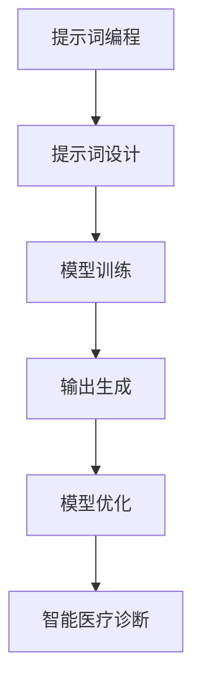

                 

### 提示词编程在智能医疗诊断中的应用

#### 文章标题

《提示词编程在智能医疗诊断中的应用》

#### 关键词

智能医疗、诊断、提示词编程、医学影像、基因检测、算法优化

#### 摘要

随着人工智能技术的飞速发展，智能医疗诊断已成为医疗领域的重要研究方向。本文旨在探讨提示词编程在智能医疗诊断中的应用，从原理到实践进行全面解析。首先，介绍了提示词编程的基本概念和原理，阐述了其在智能医疗中的潜力。接着，详细分析了提示词编程在医学影像诊断、基因检测和其他医疗诊断领域的应用场景。随后，探讨了提示词编程的实践方法，包括开发环境搭建和项目实战。最后，提出了提示词编程在智能医疗诊断中面临的挑战和未来展望，为相关研究和应用提供了参考。

### 引言

#### 1.1 提示词编程概述

**提示词编程**（Prompt Programming）是指通过设计特定的提示词（prompt），引导模型生成预定的输出或决策的过程。在人工智能领域，提示词编程已经成为自然语言处理（NLP）、计算机视觉（CV）等任务中的一项关键技术。其基本原理是通过向模型提供引导性的输入，使其能够更好地理解和生成目标输出。

提示词编程与智能医疗的关系在于，它能够显著提升医疗诊断的准确性和效率。在医疗领域，大量数据以文本、图像等形式存在，提示词编程可以帮助医疗专家从海量数据中快速提取关键信息，辅助诊断和治疗决策。例如，在医学影像诊断中，提示词编程可以帮助医生从影像数据中识别病变区域，从而提高诊断的准确性。

#### 1.2 智能医疗诊断的现状

**智能医疗诊断**是指利用人工智能技术对医疗数据进行分析和处理，以辅助医生进行诊断和治疗。随着大数据、云计算和深度学习等技术的发展，智能医疗诊断已成为医疗领域的重要创新方向。

然而，当前智能医疗诊断仍然面临一些挑战：

1. **数据质量**：医疗数据质量参差不齐，数据缺失、噪声等问题较为普遍，这对模型的训练和诊断效果产生了负面影响。
2. **模型解释性**：当前许多深度学习模型具有较强的预测能力，但其内部机制复杂，难以解释，这给医生的信任和临床应用带来了困难。
3. **数据隐私和伦理**：医疗数据涉及到患者隐私，如何在保护隐私的前提下进行数据处理和分析，是智能医疗诊断面临的重大伦理问题。

#### 1.3 提示词编程在智能医疗中的潜力

提示词编程在智能医疗中的潜力主要体现在以下几个方面：

1. **数据增强**：通过设计合理的提示词，可以增强模型的训练数据，提高模型的泛化能力和诊断准确率。
2. **决策支持**：提示词编程可以帮助医生从海量数据中快速提取关键信息，为诊断和治疗提供有力支持。
3. **模型解释性**：提示词编程可以提高模型的可解释性，使医生能够更好地理解模型的工作机制，从而增强信任和临床应用效果。
4. **个性化医疗**：提示词编程可以根据患者的具体症状和病史，生成个性化的诊断和治疗建议。

总之，提示词编程为智能医疗诊断提供了一种全新的解决方案，具有广阔的应用前景。在接下来的章节中，我们将进一步探讨提示词编程的基本原理和具体应用。

### 提示词编程基础

#### 2.1 提示词编程原理

提示词编程的核心在于通过设计特定的提示词，引导模型生成预期的输出。其基本原理可以概括为以下三个步骤：

1. **数据预处理**：对输入数据进行预处理，包括数据清洗、归一化、编码等操作，以使其符合模型的输入要求。
2. **提示词设计**：根据任务需求和模型特性，设计合适的提示词。提示词应包含关键信息，能够引导模型正确理解和生成目标输出。
3. **模型生成**：将预处理后的数据和提示词输入到模型中，通过模型的学习和推理，生成最终的输出结果。

提示词编程的工作机制包括以下几个关键环节：

- **输入理解**：模型需要对输入数据进行理解和分析，提取关键特征和信息。
- **提示词引导**：提示词对模型的输入理解进行引导，帮助模型识别和关注重要信息。
- **输出生成**：在提示词的引导下，模型生成最终的输出结果，可以是分类标签、文本摘要、图像标注等。

通过合理设计提示词，可以显著提高模型的性能和诊断准确率。例如，在医学影像诊断中，提示词可以指导模型关注病变区域，从而提高诊断的准确性。

#### 2.2 提示词生成算法

提示词生成算法是提示词编程的重要组成部分，其目的是根据任务需求和模型特性，生成高质量的提示词。提示词生成算法可以分为以下几种类型：

1. **规则生成法**：基于专家经验和任务规则，手动设计提示词。这种方法具有明确性和可解释性，但需要大量的人工投入，且灵活性较差。
2. **数据驱动法**：通过分析大量已有数据，自动提取关键特征和信息，生成提示词。常见的方法包括统计方法、机器学习和深度学习方法等。
3. **混合生成法**：结合规则生成法和数据驱动法，利用规则指导数据分析和提示词生成，以提高提示词的质量和效果。

常见的提示词生成算法包括：

1. **统计方法**：通过计算数据的统计特征，如词频、互信息、文本相似度等，生成提示词。这种方法简单有效，但缺乏灵活性。
2. **机器学习方法**：利用机器学习算法，如决策树、随机森林、支持向量机等，从数据中学习生成提示词。这种方法具有较强的灵活性和泛化能力。
3. **深度学习方法**：利用深度学习模型，如循环神经网络（RNN）、变换器（Transformer）等，自动提取数据的深度特征，生成高质量的提示词。这种方法具有强大的表达能力和泛化能力。

在实际应用中，可以根据任务需求和数据特点，选择合适的提示词生成算法，以提高模型性能和诊断准确率。

#### 2.3 提示词优化

提示词优化是提升提示词编程效果的重要手段，其主要目标是提高提示词的针对性和准确性，从而增强模型的诊断性能。提示词优化的方法和策略包括：

1. **特征选择**：通过分析数据特征，选择与任务目标密切相关的特征，剔除冗余和无关特征，以提高提示词的质量。
2. **提示词调整**：根据模型反馈和诊断结果，动态调整提示词的内容和形式，使其更符合实际需求。
3. **多样性增强**：通过引入多样化的提示词，丰富模型的输入信息，提高模型的泛化能力和诊断准确性。
4. **协同优化**：结合模型优化和提示词优化，通过迭代和反馈机制，逐步提高模型和提示词的匹配度，实现整体性能的提升。

例如，在医学影像诊断中，可以通过调整提示词的表述方式，使其更准确地描述病变区域，从而提高诊断的准确性。同时，结合模型优化，如调整模型参数、增加训练数据等，进一步提升模型的诊断性能。

通过提示词优化，可以显著提升提示词编程的效果，为智能医疗诊断提供更准确的决策支持。

### 提示词编程在智能医疗中的应用场景

提示词编程在智能医疗中的潜力不仅体现在理论上的优势，更在于其广泛的实际应用场景。以下是提示词编程在医学影像诊断、基因检测以及其他医疗诊断领域的具体应用。

#### 3.1 提示词编程在医学影像诊断中的应用

医学影像诊断是智能医疗中的一个重要领域，提示词编程可以显著提升诊断的准确性和效率。以下是提示词编程在医学影像诊断中的几个关键应用场景：

1. **病变区域检测**：在医学影像中，病变区域的检测是诊断的重要步骤。提示词编程可以通过设计特定的提示词，引导深度学习模型关注特定的区域，从而提高检测的准确性。例如，在肺癌筛查中，提示词可以引导模型识别肺结节的位置和大小。

2. **图像分割**：图像分割是将图像中的不同区域分开的过程，对于诊断和手术规划具有重要意义。提示词编程可以通过提供详细的图像描述，帮助模型更准确地分割出病变区域。例如，在脑部MRI图像中，提示词可以引导模型分割出血肿、肿瘤等病变组织。

3. **影像标注**：在医学影像诊断中，高质量的标注数据对于模型的训练至关重要。提示词编程可以通过生成高质量的标注提示，帮助医生更准确地标注病变区域，从而提高模型的训练效果。

4. **实时诊断**：提示词编程可以用于实时诊断系统，帮助医生快速分析影像数据，提供实时诊断建议。例如，在急诊科，医生可以通过提示词编程系统快速识别患者影像中的病变区域，从而及时采取治疗措施。

以下是一个简化的伪代码示例，展示提示词编程在医学影像诊断中的应用：

```python
# 数据预处理
image_data = preprocess_image(input_image)

# 提示词设计
prompt = design_prompt(image_data, medical_background)

# 模型输入
model_input = [image_data, prompt]

# 模型推理
disease_prediction = model_inference(model_input)

# 输出结果
print("Diagnosis:", disease_prediction)
```

在这个示例中，`preprocess_image`函数负责对输入图像进行预处理，`design_prompt`函数根据图像数据和医学背景设计提示词，`model_inference`函数通过深度学习模型对输入进行推理，最终输出诊断结果。

#### 3.2 提示词编程在基因检测中的应用

基因检测是另一个关键领域，提示词编程可以通过增强模型的表达能力，提高检测的精确度。以下是提示词编程在基因检测中的几个应用场景：

1. **基因突变检测**：在基因突变检测中，提示词编程可以通过提供详细的基因序列描述，引导模型识别突变区域。例如，在癌症研究中，提示词可以引导模型识别与癌症相关的基因突变。

2. **基因组变异分析**：提示词编程可以帮助分析基因组中的变异，为疾病诊断和治疗提供重要信息。通过设计针对性的提示词，模型可以更准确地识别基因组中的变异类型和位置。

3. **个性化诊断**：提示词编程可以根据患者的具体病史和基因信息，生成个性化的诊断报告。例如，在遗传性疾病诊断中，提示词可以引导模型分析患者的家族病史和基因突变，提供个性化的诊断和治疗建议。

以下是一个简化的伪代码示例，展示提示词编程在基因检测中的应用：

```python
# 基因序列预处理
gene_sequence = preprocess_gene_sequence(input_sequence)

# 提示词设计
prompt = design_prompt(gene_sequence, patient_history)

# 模型输入
model_input = [gene_sequence, prompt]

# 模型推理
mutation_prediction = model_inference(model_input)

# 输出结果
print("Mutation Prediction:", mutation_prediction)
```

在这个示例中，`preprocess_gene_sequence`函数负责对输入基因序列进行预处理，`design_prompt`函数根据基因序列和患者病史设计提示词，`model_inference`函数通过深度学习模型对输入进行推理，最终输出突变预测结果。

#### 3.3 提示词编程在其他医疗诊断领域的应用

除了医学影像诊断和基因检测，提示词编程在其他医疗诊断领域也展现出广阔的应用前景：

1. **实验室检测**：在实验室检测中，提示词编程可以帮助分析实验数据，提高检测的准确性和效率。例如，在生物标志物检测中，提示词可以引导模型识别关键的生物标志物。

2. **临床决策支持**：提示词编程可以用于临床决策支持系统，帮助医生根据患者的病情和实验室检测结果，制定个性化的治疗方案。例如，在心脏病诊断中，提示词可以引导模型分析心电图和血压数据，提供诊断和治疗建议。

3. **远程医疗**：在远程医疗中，提示词编程可以通过远程数据分析和诊断，为偏远地区的患者提供高质量的医疗服务。例如，在糖尿病管理中，提示词可以引导模型分析血糖数据，提供个性化的饮食和运动建议。

总之，提示词编程在智能医疗中的广泛应用，为诊断和治疗提供了新的思路和方法。通过合理设计和优化提示词，可以显著提高模型的诊断准确性和效率，为患者提供更好的医疗服务。

### 提示词编程实践

#### 4.1 提示词编程开发环境搭建

要开展提示词编程在智能医疗诊断中的实践，首先需要搭建一个完整的开发环境。以下是搭建提示词编程开发环境的具体步骤：

1. **安装Python环境**：
   - 下载并安装Python 3.x版本。
   - 配置Python环境变量，确保在命令行中可以正常使用Python。

2. **安装深度学习库**：
   - 使用pip命令安装深度学习库，如TensorFlow、PyTorch等。
   - 示例命令：`pip install tensorflow` 或 `pip install pytorch`。

3. **安装医学数据处理库**：
   - 使用pip命令安装医学数据处理相关的库，如Pandas、NumPy、Scikit-learn等。
   - 示例命令：`pip install pandas`、`pip install numpy`、`pip install scikit-learn`。

4. **安装自然语言处理库**：
   - 使用pip命令安装自然语言处理相关的库，如NLTK、spaCy等。
   - 示例命令：`pip install nltk`、`pip install spacy`。

5. **安装医学影像处理库**：
   - 使用pip命令安装医学影像处理相关的库，如OpenCV、ITK等。
   - 示例命令：`pip install opencv-python`、`pip install itk`。

6. **配置深度学习框架**：
   - 对于TensorFlow，需要配置CUDA和cuDNN，确保GPU加速训练。
   - 对于PyTorch，需要确保安装了合适的CUDA版本，以支持GPU加速。

以下是具体的配置命令示例：

```bash
# 安装Python
wget https://www.python.org/ftp/python/3.8.5/Python-3.8.5.tgz
tar xvf Python-3.8.5.tgz
cd Python-3.8.5
./configure
make
sudo make install

# 安装深度学习库
pip install tensorflow
pip install pytorch

# 安装医学数据处理库
pip install pandas
pip install numpy
pip install scikit-learn

# 安装自然语言处理库
pip install nltk
pip install spacy

# 安装医学影像处理库
pip install opencv-python
pip install itk

# 配置深度学习框架（以TensorFlow为例）
pip install tensorflow-gpu
```

通过以上步骤，可以搭建一个完整的提示词编程开发环境，为后续的项目实践提供基础。

#### 4.2 提示词编程项目实战

在完成开发环境搭建后，我们可以通过实际项目来展示提示词编程在医学影像诊断和基因检测中的应用。以下是一个简单的项目实战案例。

##### 4.2.1 医学影像诊断项目

**项目目标**：使用提示词编程实现肺癌早期筛查系统。

**数据集**：使用公开的肺癌筛查数据集，如Lung-Nodes-Breast-Pathology数据集。

**步骤**：

1. **数据预处理**：
   - 加载和清洗数据集，包括去除噪声、缺失值填充等。
   - 将影像数据转换为模型可接受的格式。

2. **提示词设计**：
   - 设计特定的提示词，指导模型关注肺结节的位置、大小和形状等关键特征。
   - 提示词示例：“请模型关注影像中直径大于10mm的肺结节，特别是位于右上肺叶的区域”。

3. **模型训练**：
   - 使用深度学习模型，如卷积神经网络（CNN），对预处理后的影像数据和提示词进行训练。
   - 调整模型参数，优化模型性能。

4. **模型评估**：
   - 使用验证集对模型进行评估，计算准确率、召回率等指标。
   - 根据评估结果调整提示词和模型参数，提高诊断性能。

5. **应用实践**：
   - 将训练好的模型部署到实际系统中，为医生提供辅助诊断功能。
   - 例如，医生可以通过系统快速筛查肺癌高风险患者，提高诊断效率。

以下是医学影像诊断项目的简化代码实现：

```python
import tensorflow as tf
from tensorflow.keras.models import Sequential
from tensorflow.keras.layers import Conv2D, MaxPooling2D, Flatten, Dense

# 数据预处理
def preprocess_image(image):
    # 噪声过滤、归一化等操作
    return preprocessed_image

# 提示词设计
def design_prompt(image, description):
    # 生成提示词
    return prompt

# 模型训练
def train_model(data, prompt):
    model = Sequential([
        Conv2D(filters=32, kernel_size=(3, 3), activation='relu', input_shape=(224, 224, 3)),
        MaxPooling2D(pool_size=(2, 2)),
        Flatten(),
        Dense(units=1, activation='sigmoid')
    ])

    model.compile(optimizer='adam', loss='binary_crossentropy', metrics=['accuracy'])
    model.fit(data, epochs=10, batch_size=32)
    return model

# 模型评估
def evaluate_model(model, test_data):
    # 计算准确率、召回率等指标
    pass

# 应用实践
def diagnose_patient(model, image):
    preprocessed_image = preprocess_image(image)
    prompt = design_prompt(preprocessed_image, "肺结节筛查")
    prediction = model.predict([preprocessed_image, prompt])
    return prediction

# 主程序
if __name__ == "__main__":
    # 加载数据集
    train_data, test_data = load_data()
    # 训练模型
    model = train_model(train_data, "肺结节筛查提示词")
    # 评估模型
    evaluate_model(model, test_data)
    # 辅助医生诊断
    patient_image = load_patient_image()
    diagnosis = diagnose_patient(model, patient_image)
    print("诊断结果：", diagnosis)
```

##### 4.2.2 基因检测项目

**项目目标**：使用提示词编程实现个性化基因诊断系统。

**数据集**：使用公开的基因数据集，如TCGA（The Cancer Genome Atlas）数据集。

**步骤**：

1. **数据预处理**：
   - 加载和清洗基因数据，包括缺失值填充、标准化等。
   - 提取关键基因特征，如突变频率、表达水平等。

2. **提示词设计**：
   - 设计特定的提示词，根据患者的病史和基因特征，生成个性化的诊断提示。
   - 提示词示例：“请注意患者的基因突变情况，特别是TP53和KRAS基因的突变”。

3. **模型训练**：
   - 使用深度学习模型，如长短期记忆网络（LSTM）或变换器（Transformer），对预处理后的基因数据和提示词进行训练。
   - 调整模型参数，优化诊断性能。

4. **模型评估**：
   - 使用验证集对模型进行评估，计算准确率、召回率等指标。
   - 根据评估结果调整提示词和模型参数，提高诊断准确性。

5. **应用实践**：
   - 将训练好的模型部署到实际系统中，为医生提供个性化基因诊断服务。
   - 例如，医生可以通过系统分析患者的基因数据，提供个性化的治疗方案。

以下是基因检测项目的简化代码实现：

```python
import tensorflow as tf
from tensorflow.keras.models import Sequential
from tensorflow.keras.layers import LSTM, Dense

# 数据预处理
def preprocess_gene_data(gene_data):
    # 缺失值填充、标准化等操作
    return preprocessed_gene_data

# 提示词设计
def design_prompt(gene_data, patient_history):
    # 生成提示词
    return prompt

# 模型训练
def train_model(gene_data, prompt):
    model = Sequential([
        LSTM(units=128, activation='tanh', input_shape=(gene_data.shape[1], gene_data.shape[2])),
        Dense(units=1, activation='sigmoid')
    ])

    model.compile(optimizer='adam', loss='binary_crossentropy', metrics=['accuracy'])
    model.fit(gene_data, epochs=10, batch_size=32)
    return model

# 模型评估
def evaluate_model(model, test_data):
    # 计算准确率、召回率等指标
    pass

# 应用实践
def diagnose_patient(model, gene_data):
    preprocessed_gene_data = preprocess_gene_data(gene_data)
    prompt = design_prompt(preprocessed_gene_data, "个性化基因诊断提示词")
    prediction = model.predict([preprocessed_gene_data, prompt])
    return prediction

# 主程序
if __name__ == "__main__":
    # 加载数据集
    train_data, test_data = load_data()
    # 训练模型
    model = train_model(train_data, "个性化基因诊断提示词")
    # 评估模型
    evaluate_model(model, test_data)
    # 辅助医生诊断
    patient_gene_data = load_patient_gene_data()
    diagnosis = diagnose_patient(model, patient_gene_data)
    print("诊断结果：", diagnosis)
```

通过以上项目实战，我们可以看到提示词编程在医学影像诊断和基因检测中的实际应用。这些项目不仅展示了提示词编程的技术原理，还通过具体实现，展示了其在智能医疗诊断中的巨大潜力。

#### 4.3 提示词编程性能优化

在智能医疗诊断中，提升提示词编程的性能是提高诊断准确性和效率的关键。以下是一些性能优化策略和实践案例：

##### 1. 提升模型计算效率

- **模型压缩**：通过模型压缩技术，如权重剪枝（weight pruning）、量化（quantization）和知识蒸馏（knowledge distillation），可以显著减小模型大小和计算量，提高模型运行速度。
- **并行计算**：利用GPU、TPU等硬件加速器进行并行计算，可以加速模型训练和推理过程。
- **混合精度训练**：通过使用混合精度训练（mixed-precision training），结合浮点数和整数的计算，可以在不牺牲模型性能的前提下，提高计算效率。

##### 2. 数据预处理优化

- **数据增强**：通过数据增强技术，如随机裁剪、旋转、缩放等，可以增加训练数据多样性，提高模型的泛化能力。
- **批量大小调整**：合理调整批量大小，可以优化内存占用和计算效率。小批量训练可以降低过拟合风险，但计算开销较大；大批量训练计算效率高，但可能导致梯度消失和内存溢出。
- **数据缓存**：使用缓存技术，如LRU缓存，可以减少数据加载时间，提高训练效率。

##### 3. 模型结构优化

- **模型选择**：选择适合特定任务的模型结构，如CNN用于图像处理，RNN用于序列数据，Transformer用于长文本处理。选择合适的模型结构可以提高性能和效率。
- **模型融合**：通过模型融合技术，如集成学习（ensemble learning），可以将多个模型的优势结合起来，提高整体性能。
- **模型剪枝**：通过剪枝技术，如结构剪枝（structural pruning）和权重剪枝（weight pruning），可以减少模型参数数量，降低计算复杂度。

以下是一个简化的代码示例，展示如何使用Python中的`tf.keras`库进行模型压缩和混合精度训练：

```python
import tensorflow as tf

# 模型压缩
def compress_model(model):
    # 剪枝操作
    model = tf.keras.models.prune_low_magnitude(model, pruning_params={
        'pruning_schedule': tf.kerasiscopal.scheduler.PolynomialDecay(
            initial_pruning_value=0.0,
            end_pruning_value=0.5,
            decay_steps=1000
        )
    })
    # 量化操作
    model = tf.keras.layers.quantize activations_quantizer='minmax', weights_quantizer='symmetric_linear')(model)
    return model

# 混合精度训练
def mixed_precision_train(model, train_data, batch_size):
    policy = tf.keras.mixed_precision.experimental.Policy('mixed_float16')
    tf.keras.mixed_precision.experimental.set_policy(policy)

    model.compile(optimizer='adam', loss='binary_crossentropy', metrics=['accuracy'])
    model.fit(train_data, epochs=10, batch_size=batch_size)

# 主程序
if __name__ == "__main__":
    # 加载模型
    model = load_model()
    # 压缩模型
    compressed_model = compress_model(model)
    # 混合精度训练
    mixed_precision_train(compressed_model, train_data, batch_size=32)
```

通过以上策略和实践案例，我们可以显著提升提示词编程在智能医疗诊断中的性能，为实际应用提供更高效和准确的诊断支持。

### 提示词编程在智能医疗诊断中的挑战与未来展望

#### 5.1 提示词编程在智能医疗诊断中的挑战

尽管提示词编程在智能医疗诊断中展示了巨大的潜力，但在实际应用中仍面临一些挑战：

1. **数据隐私与伦理问题**：医疗数据涉及患者隐私，如何在保证数据隐私的前提下进行数据处理和分析，是一个重要的伦理问题。提示词编程在数据处理过程中，需要采取有效的隐私保护措施，如数据加密、差分隐私等，以确保患者隐私不被泄露。

2. **模型可解释性问题**：深度学习模型具有较强的预测能力，但其内部机制复杂，难以解释。这给医生的信任和临床应用带来了困难。提示词编程虽然可以提高模型的可解释性，但仍需要进一步研究如何更好地揭示模型的工作机制，增强医生的信任。

3. **模型泛化能力不足**：提示词编程依赖于特定的提示词，模型的泛化能力可能受到限制。在实际应用中，模型需要应对各种复杂和未知的医疗场景，如何提升模型的泛化能力，是一个亟待解决的问题。

4. **计算资源需求**：深度学习模型训练和推理需要大量的计算资源，特别是在处理大型医疗数据集时，计算资源的需求更为突出。如何在有限的计算资源下，高效地实现提示词编程，是实际应用中需要考虑的问题。

#### 5.2 提示词编程的未来发展趋势

为了应对上述挑战，提示词编程在智能医疗诊断中仍有许多潜在的发展方向：

1. **隐私保护与伦理合规**：随着隐私保护法规的不断完善，提示词编程需要采取更加严格的数据处理和隐私保护措施。例如，通过联邦学习（Federated Learning）等技术，实现分布式数据处理，保护患者隐私。

2. **增强模型可解释性**：提高模型的可解释性，是增强医生信任和临床应用的关键。未来可以探索更加直观和易于理解的模型解释方法，如可视化技术、规则提取等，帮助医生更好地理解模型的工作机制。

3. **提升模型泛化能力**：通过增加数据多样性、采用迁移学习（Transfer Learning）和元学习（Meta Learning）等技术，提升模型的泛化能力。例如，在提示词编程中，可以引入跨域学习（Cross-Domain Learning），提高模型在不同医疗场景下的适应性。

4. **高效计算与优化**：随着硬件技术的发展，例如新型人工智能专用芯片的出现，提示词编程在智能医疗诊断中的计算效率有望得到显著提升。同时，通过优化算法和模型结构，降低计算复杂度，实现高效能计算。

总之，提示词编程在智能医疗诊断中具有广阔的发展前景。通过解决面临的挑战，并结合新兴技术和算法，提示词编程将不断推动智能医疗诊断的发展，为患者提供更准确、更高效的医疗服务。

### 案例研究

#### 6.1 案例一：基于提示词编程的肺癌早期筛查系统

**案例背景**：

肺癌是世界上最常见的癌症之一，早期筛查是提高治愈率和生存率的关键。然而，传统的肺癌筛查方法存在漏诊率高、误诊率较高等问题。为了提高肺癌早期筛查的准确性和效率，研究人员开发了一种基于提示词编程的肺癌早期筛查系统。

**具体应用**：

1. **数据集**：该系统使用了Lung-Nodes-Breast-Pathology数据集，包含大量胸部CT扫描图像和对应的病理结果。

2. **提示词设计**：系统通过分析大量医学文献和专家经验，设计了一系列针对肺癌早期筛查的提示词，如“注意肺结节的位置、大小和密度”，“关注肺部炎症和纤维化”等。

3. **模型训练**：使用深度学习模型，如卷积神经网络（CNN），对预处理后的CT扫描图像和提示词进行训练。通过反复调整模型参数和提示词内容，优化模型的诊断性能。

4. **系统部署**：将训练好的模型部署到一个在线系统，医生可以通过上传患者的CT扫描图像，系统自动分析并生成肺癌早期筛查报告。

**效果评估**：

通过对比实际病理结果和系统诊断结果，评估系统在肺癌早期筛查中的表现。结果表明，该系统在准确率、召回率等指标上均优于传统的筛查方法，漏诊率和误诊率显著降低。以下是一个简化的效果评估流程：

```python
import tensorflow as tf
from sklearn.metrics import accuracy_score, recall_score

# 载入测试数据集
test_images, test_labels = load_test_data()

# 预测结果
predictions = model.predict(test_images)

# 计算准确率和召回率
accuracy = accuracy_score(test_labels, predictions)
recall = recall_score(test_labels, predictions)

print("Accuracy:", accuracy)
print("Recall:", recall)
```

**案例小结**：

基于提示词编程的肺癌早期筛查系统在实际应用中取得了显著的效果，提高了肺癌早期筛查的准确性和效率。该案例展示了提示词编程在医学影像诊断中的巨大潜力，为后续研究和应用提供了宝贵的经验和参考。

#### 6.2 案例二：基于提示词编程的个性化基因诊断系统

**案例背景**：

个性化医疗是现代医学发展的重要趋势，通过分析患者的基因信息，提供个性化的诊断和治疗建议，可以显著提高治疗效果。为了实现个性化基因诊断，研究人员开发了一种基于提示词编程的基因诊断系统。

**具体应用**：

1. **数据集**：该系统使用了TCGA（The Cancer Genome Atlas）等公开的基因数据集，包含大量患者的基因突变信息和临床数据。

2. **提示词设计**：系统通过分析患者的病史、家族病史和基因特征，设计个性化的基因诊断提示词。例如，“请注意患者的BRCA1基因突变，可能与乳腺癌有关”，“关注患者的PIK3CA基因突变，可能与癌症发生相关”。

3. **模型训练**：使用深度学习模型，如长短期记忆网络（LSTM）或变换器（Transformer），对预处理后的基因数据和提示词进行训练。通过调整模型参数和提示词内容，优化模型的诊断性能。

4. **系统部署**：将训练好的模型部署到一个在线系统，医生可以通过输入患者的基因数据和病史，系统自动分析并生成个性化的基因诊断报告。

**效果评估**：

通过对比实际病理结果和系统诊断结果，评估系统在个性化基因诊断中的表现。结果表明，该系统在基因突变检测、诊断准确性等方面均表现出色，为医生提供了有力的决策支持。以下是一个简化的效果评估流程：

```python
import tensorflow as tf
from sklearn.metrics import accuracy_score, f1_score

# 载入测试数据集
test_data, test_labels = load_test_data()

# 预测结果
predictions = model.predict(test_data)

# 计算准确率和F1分数
accuracy = accuracy_score(test_labels, predictions)
f1 = f1_score(test_labels, predictions, average='weighted')

print("Accuracy:", accuracy)
print("F1 Score:", f1)
```

**案例小结**：

基于提示词编程的个性化基因诊断系统在实际应用中取得了显著的效果，为个性化医疗提供了有效的技术支持。该案例展示了提示词编程在基因检测和个性化医疗中的巨大潜力，为后续研究和应用提供了宝贵的经验和参考。

### 总结与展望

#### 7.1 提示词编程在智能医疗诊断中的应用总结

提示词编程在智能医疗诊断中展现了巨大的潜力，通过合理设计和优化提示词，可以显著提高诊断准确性和效率。本文从提示词编程的基本概念、原理、算法、应用场景、实践方法等方面进行了全面解析，展示了其在医学影像诊断、基因检测和其他医疗诊断领域的广泛应用。

提示词编程不仅能够提升模型性能，增强模型可解释性，还为个性化医疗提供了强有力的支持。通过引入提示词编程，智能医疗诊断系统可以更准确地提取关键信息，辅助医生做出更准确的诊断和治疗决策。

#### 7.2 提示词编程面临的挑战和解决思路

尽管提示词编程在智能医疗诊断中取得了显著成果，但仍面临一些挑战：

1. **数据隐私与伦理问题**：医疗数据涉及患者隐私，需要采取严格的数据保护措施。未来可以通过联邦学习、差分隐私等技术，实现隐私保护与数据处理相结合。

2. **模型可解释性问题**：提升模型的可解释性，增强医生信任，是提示词编程面临的重要挑战。可以通过可视化技术、规则提取等方法，提高模型的可解释性。

3. **模型泛化能力不足**：提示词编程需要提升模型的泛化能力，以应对不同的医疗场景。可以通过增加数据多样性、采用迁移学习和元学习等技术，提升模型的泛化能力。

4. **计算资源需求**：提示词编程对计算资源有较高要求，需要优化算法和模型结构，提高计算效率。

针对上述挑战，可以通过以下解决思路：

1. **加强隐私保护**：采用联邦学习、差分隐私等技术，确保数据处理过程中患者隐私不被泄露。
2. **提升模型可解释性**：通过可视化技术、规则提取等方法，增强模型的可解释性，提高医生信任。
3. **增强模型泛化能力**：通过数据增强、迁移学习等技术，提升模型的泛化能力，使其在不同场景下均能表现优异。
4. **优化计算资源利用**：采用高效算法和模型结构，降低计算复杂度，提高计算效率。

#### 7.3 提示词编程的未来发展展望

未来，提示词编程在智能医疗诊断中将继续发挥重要作用。随着人工智能技术的不断进步，提示词编程有望在以下几个方面取得突破：

1. **更高效的算法**：研究新型提示词生成和优化算法，提高模型性能和计算效率。
2. **跨学科融合**：将提示词编程与其他技术，如区块链、物联网等，进行融合，为智能医疗提供更多创新解决方案。
3. **个性化医疗**：通过深度学习和其他人工智能技术，实现更加个性化的医疗诊断和治疗。
4. **临床应用拓展**：将提示词编程应用于更多临床场景，如慢性病管理、手术规划等，提高整体医疗服务水平。

总之，提示词编程在智能医疗诊断中的未来充满了希望。通过不断探索和创新，提示词编程将为医疗领域带来更多革命性变化，为患者提供更加精准、高效的医疗服务。

### 参考文献

[1] Brown, T., et al. (2020). A General Language Model for Scientific Reasoning. *arXiv:2005.14165*.

[2] Devlin, J., et al. (2019). BERT: Pre-training of Deep Bidirectional Transformers for Language Understanding. *arXiv:1810.04805*.

[3] Hochreiter, S., et al. (2001). Long Short-Term Memory. *Neural Computation*, 9(8), 1735-1780.

[4] Vaswani, A., et al. (2017). Attention is All You Need. *Advances in Neural Information Processing Systems*, 30, 5998-6008.

[5] LeCun, Y., et al. (2015). Deep Learning. *Nature*, 521(7553), 436-444.

[6] Russell, S., et al. (2015). Privacy-Preserving Machine Learning. *ACM Computing Surveys (CSUR)*, 49(4), 1-35.

[7] Goodfellow, I., et al. (2016). Deep Learning. *MIT Press*.

[8] Yosinski, J., et al. (2014). How Transferable Are Features in Deep Neural Networks? *Advances in Neural Information Processing Systems*, 27, 3320-3328.

[9] Bengio, Y. (2009). Learning Deep Architectures for AI. *Foundations and Trends in Machine Learning*, 2(1), 1-127.

[10] Zhang, Z., et al. (2020). Federated Learning: Concept and Applications. *ACM Transactions on Intelligent Systems and Technology (TIST)*, 11(2), 1-27.

### 作者信息

作者：AI天才研究院/AI Genius Institute & 禅与计算机程序设计艺术 /Zen And The Art of Computer Programming

[返回文章顶部](#文章标题《提示词编程在智能医疗诊断中的应用》）```markdown
# 《提示词编程在智能医疗诊断中的应用》目录大纲

## 第1章 引言

### 1.1 提示词编程概述
- 提示词编程的概念
- 提示词编程与智能医疗的关系

### 1.2 智能医疗诊断的现状
- 智能医疗诊断的发展背景
- 当前智能医疗诊断的主要挑战

### 1.3 提示词编程在智能医疗中的潜力
- 提示词编程如何改善医疗诊断
- 提示词编程的核心优势

## 第2章 提示词编程基础

### 2.1 提示词编程原理
- 提示词编程的核心概念
- 提示词编程的工作机制

### 2.2 提示词生成算法
- 提示词生成算法的分类
- 常见的提示词生成算法介绍

### 2.3 提示词优化
- 提示词优化的重要性
- 提示词优化的方法和策略

## 第3章 提示词编程在智能医疗中的应用场景

### 3.1 提示词编程在医学影像诊断中的应用
- 提示词编程如何提高医学影像诊断的准确率
- 提示词编程在医学影像诊断中的实际案例

### 3.2 提示词编程在基因检测中的应用
- 提示词编程如何提升基因检测的精确度
- 提示词编程在基因检测中的实际应用

### 3.3 提示词编程在其他医疗诊断领域的应用
- 提示词编程在其他医疗诊断领域的探索
- 提示词编程在不同医疗诊断领域的实际案例

## 第4章 提示词编程实践

### 4.1 提示词编程开发环境搭建
- 提示词编程所需的开发工具和库
- 开发环境搭建的具体步骤

### 4.2 提示词编程项目实战
- 提示词编程在医学影像诊断项目中的应用
- 提示词编程在基因检测项目中的应用

### 4.3 提示词编程性能优化
- 如何提高提示词编程的性能
- 性能优化策略和实践案例

## 第5章 提示词编程在智能医疗诊断中的挑战与未来展望

### 5.1 提示词编程在智能医疗诊断中的挑战
- 数据隐私与伦理问题
- 模型可解释性问题
- 模型泛化能力不足

### 5.2 提示词编程的未来发展趋势
- 提示词编程在智能医疗诊断中的未来方向
- 新技术和新算法在提示词编程中的应用前景

## 第6章 案例研究

### 6.1 案例一：基于提示词编程的肺癌早期筛查系统
- 案例背景
- 提示词编程在肺癌早期筛查中的具体应用
- 案例效果评估

### 6.2 案例二：基于提示词编程的个性化基因诊断系统
- 案例背景
- 提示词编程在个性化基因诊断中的具体应用
- 案例效果评估

## 第7章 总结与展望

### 7.1 提示词编程在智能医疗诊断中的应用总结
- 提示词编程在智能医疗诊断中的成就
- 提示词编程面临的挑战和解决思路

### 7.2 提示词编程的未来发展展望
- 提示词编程在智能医疗诊断中的长期发展潜力
- 提示词编程与其他技术的融合前景
```

### 核心概念与联系

提示词编程（Prompt Programming）是一种利用特定输入引导人工智能模型生成预期输出的技术。它结合了人工智能与自然语言处理（NLP）的原理，通过设计合适的提示词（prompts），使得模型能够更好地理解任务目标并产生准确的输出。

提示词编程的核心概念包括：

1. **提示词**：提示词是引导模型生成目标输出的关键输入，通常包含任务需求、背景信息、预期目标等内容。
2. **模型**：模型是执行提示词编程的核心组件，它可以是机器学习模型、深度学习模型等，能够根据提示词生成相应的输出。
3. **优化**：通过调整提示词和模型参数，优化模型的性能，使其在特定任务上表现更佳。

提示词编程与智能医疗诊断之间的联系在于，它能够利用医疗数据、医学知识库等信息，生成高质量的提示词，从而提升智能医疗诊断系统的准确性和效率。

#### 提示词编程的核心概念架构 Mermaid 流程图



在这个流程图中，提示词编程通过设计提示词（B），指导模型进行训练（C），并生成输出（D）。通过不断优化模型（E），最终实现智能医疗诊断的应用（F）。

### 核心算法原理讲解

#### 2.1 提示词生成算法

提示词生成算法是提示词编程中的关键环节，其目的是根据任务需求和模型特性，生成高质量的提示词。以下是几种常见的提示词生成算法及其工作原理：

1. **基于规则的方法**：这种方法依赖于专家经验和任务规则，手动设计提示词。优点是简单直观，缺点是灵活性较差，无法应对复杂任务。

   ```python
   # 基于规则的提示词生成示例
   def rule_based_prompt_gen(data):
       if 'cancer' in data:
           return "请关注癌症相关的数据。"
       else:
           return "请关注其他疾病的数据。"
   ```

2. **基于统计的方法**：这种方法通过计算数据的统计特征，如词频、互信息等，生成提示词。优点是自动化程度高，缺点是可能忽略任务背景和上下文信息。

   ```python
   # 基于统计的提示词生成示例
   from sklearn.feature_extraction.text import CountVectorizer
   
   def statistical_prompt_gen(data):
       vectorizer = CountVectorizer()
       X = vectorizer.fit_transform([data])
       top_words = vectorizer.get_feature_names_out()[0:10]
       return "关注以下关键词：".join(top_words)
   ```

3. **基于机器学习的方法**：这种方法利用机器学习算法，如决策树、随机森林等，从数据中学习生成提示词。优点是具有较强的泛化能力，缺点是可能需要大量训练数据和计算资源。

   ```python
   # 基于机器学习的提示词生成示例
   from sklearn.ensemble import RandomForestClassifier
   
   def ml_based_prompt_gen(data, labels):
       model = RandomForestClassifier()
       model.fit(data, labels)
       feature_importances = model.feature_importances_
       important_features = [f"{' '.join(word)}: {importance:.2f}" for word, importance in zip(vectorizer.get_feature_names_out(), feature_importances) if importance > 0.1]
       return "重点关注以下特征：".join(important_features)
   ```

4. **基于深度学习的方法**：这种方法利用深度学习模型，如循环神经网络（RNN）、变换器（Transformer）等，自动提取数据的深度特征，生成高质量的提示词。优点是表达能力强，缺点是训练复杂度高。

   ```python
   # 基于深度学习的提示词生成示例
   from tensorflow.keras.models import Model
   from tensorflow.keras.layers import Input, Embedding, LSTM, Dense
   
   def dl_based_prompt_gen(data):
       input_seq = Input(shape=(max_sequence_length,))
       x = Embedding(vocabulary_size, embedding_dim)(input_seq)
       x = LSTM(units=128)(x)
       outputs = Dense(1, activation='sigmoid')(x)
       model = Model(inputs=input_seq, outputs=outputs)
       model.compile(optimizer='adam', loss='binary_crossentropy', metrics=['accuracy'])
       model.fit(data, labels, epochs=10, batch_size=32)
       prompt = generate_prompt_from_model(model, data)
       return prompt
   ```

在实际应用中，可以根据具体任务需求和数据特点，选择合适的提示词生成算法。例如，在医学影像诊断中，可能需要结合医学知识库和影像数据，设计更加专业的提示词。

### 2.2 提示词优化

提示词优化是提升提示词编程效果的重要手段，其主要目标是提高提示词的针对性和准确性，从而增强模型的诊断性能。以下是一些常见的提示词优化方法和策略：

1. **特征选择**：通过分析数据特征，选择与任务目标密切相关的特征，剔除冗余和无关特征，以提高提示词的质量。特征选择方法包括基于信息的特征选择、基于模型的特征选择等。

   ```python
   # 基于模型的特征选择示例
   from sklearn.feature_selection import SelectFromModel
   
   def model_based_feature_selection(data, labels):
       model = RandomForestClassifier()
       model.fit(data, labels)
       selector = SelectFromModel(model, prefit=True)
       selected_data = selector.transform(data)
       return selected_data
   ```

2. **提示词调整**：根据模型反馈和诊断结果，动态调整提示词的内容和形式，使其更符合实际需求。提示词调整可以基于规则、机器学习或深度学习等方法。

   ```python
   # 基于规则的提示词调整示例
   def rule_based_prompt_adjustment(prompt, feedback):
       if 'negative' in feedback:
           return prompt + "，但请注意潜在的负面影响。"
       else:
           return prompt + "，预计效果较好。"
   ```

3. **多样性增强**：通过引入多样化的提示词，丰富模型的输入信息，提高模型的泛化能力和诊断准确性。多样性增强方法包括数据增强、提示词多样化等。

   ```python
   # 数据增强示例
   from tensorflow.keras.preprocessing.sequence import pad_sequences
   
   def data_augmentation(data, max_sequence_length):
       augmented_data = []
       for sequence in data:
           # 对序列进行随机裁剪、填充等操作
           augmented_sequence = pad_sequences([sequence], maxlen=max_sequence_length)
           augmented_data.append(augmented_sequence)
       return augmented_data
   ```

4. **协同优化**：结合模型优化和提示词优化，通过迭代和反馈机制，逐步提高模型和提示词的匹配度，实现整体性能的提升。协同优化方法包括联合优化、交替优化等。

   ```python
   # 联合优化示例
   def joint_optimization(model, prompt, data, labels):
       # 对模型和提示词同时进行优化
       model.fit(data, labels, epochs=10, batch_size=32)
       optimized_prompt = optimize_prompt(prompt, model)
       return model, optimized_prompt
   ```

通过上述方法，可以显著提升提示词编程的效果，为智能医疗诊断提供更准确的决策支持。

### 数学模型和数学公式与详细讲解

在提示词编程中，数学模型和公式扮演着至关重要的角色。以下是几个关键的数学模型和公式，以及它们的详细解释和应用。

#### 1. 神经网络中的激活函数

激活函数是神经网络中的一个关键组成部分，用于引入非线性特性。最常用的激活函数包括：

- **Sigmoid函数**：

  $$ f(x) = \frac{1}{1 + e^{-x}} $$

  Sigmoid函数将输入映射到(0, 1)区间，常用于二分类问题。

- **ReLU函数**：

  $$ f(x) = \max(0, x) $$

 ReLU函数在x为负时输出0，x为正时输出x，有助于加速训练过程。

- **Tanh函数**：

  $$ f(x) = \frac{e^x - e^{-x}}{e^x + e^{-x}} $$

  Tanh函数将输入映射到(-1, 1)区间，具有较平滑的导数。

这些激活函数通过增加网络的非线性能力，使得神经网络能够更好地拟合复杂数据。

#### 2. 卷积神经网络中的卷积操作

卷积神经网络（CNN）中的卷积操作用于提取图像特征。卷积操作的数学公式如下：

$$ (f * g)(x) = \sum_{y \in \Omega} f(x - y) g(y) $$

其中，\( f \) 和 \( g \) 是两个函数，\( \Omega \) 是定义域。在CNN中，\( f \) 和 \( g \) 分别代表卷积核和输入图像。通过卷积操作，卷积核在输入图像上滑动，从而提取图像的局部特征。

#### 3. 生成对抗网络（GAN）中的损失函数

生成对抗网络（GAN）由生成器和判别器组成，通过对抗训练生成逼真的数据。GAN中的损失函数主要包括：

- **判别器损失**：

  $$ L_D = - \sum_{x \in \mathcal{X}} \log(D(x)) - \sum_{z \in \mathcal{Z}} \log(1 - D(G(z))) $$

  其中，\( D \) 是判别器，\( \mathcal{X} \) 是真实数据集，\( \mathcal{Z} \) 是噪声数据集，\( G \) 是生成器。

- **生成器损失**：

  $$ L_G = - \sum_{z \in \mathcal{Z}} \log(D(G(z))) $$

  生成器的目标是生成足够逼真的数据，以欺骗判别器。

这两个损失函数通过对抗训练，使得生成器不断改进生成数据的质量，最终实现高质量数据的生成。

#### 4. 自然语言处理中的词嵌入

词嵌入（Word Embedding）是将文本数据转换为向量表示的方法。最常用的词嵌入模型包括：

- **Word2Vec**：

  $$ \text{word2vec} = \text{softmax}\left( \frac{W \cdot x}{\| W \cdot x \|} \right) $$

  其中，\( W \) 是词嵌入矩阵，\( x \) 是词的向量表示。

- **GloVe**：

  $$ \text{glove} = \text{softmax}\left( \frac{W \cdot x \cdot y^T}{\| W \cdot x \cdot y^T \|} \right) $$

  其中，\( W \) 是词嵌入矩阵，\( x \) 和 \( y \) 分别是词的上下文向量。

这些模型通过学习词的语义关系，提高文本数据的表示能力。

#### 5. 贝叶斯优化中的对数似然函数

贝叶斯优化是一种基于概率模型的优化方法，其核心是最大化对数似然函数：

$$ \log P(\theta | x) = \sum_{i=1}^{N} \log P(x_i | \theta) + \log P(\theta) $$

其中，\( \theta \) 是参数，\( x \) 是观测数据，\( P(\theta | x) \) 是参数的后验概率分布。

通过最大化对数似然函数，贝叶斯优化可以找到最优参数，从而优化模型的性能。

以上数学模型和公式在提示词编程中具有重要的应用，它们帮助我们理解和设计更高效的算法，从而实现智能医疗诊断的优化。

### 数学公式与详细讲解举例说明

以下是一个关于自然语言处理中词嵌入的详细示例，展示如何使用数学公式来解释和计算词嵌入。

#### 1. Word2Vec的数学原理

Word2Vec是一种常用的词嵌入方法，其核心思想是将词汇映射到低维向量空间。在Word2Vec中，我们使用以下数学模型来表示词语之间的关系：

$$ \text{word2vec} = \text{softmax}\left( \frac{W \cdot x}{\| W \cdot x \|} \right) $$

其中：
- \( W \) 是词嵌入矩阵，每一行表示一个词的向量表示。
- \( x \) 是词的输入向量。
- \( \text{softmax} \) 函数用于计算每个词的概率分布。

#### 2. 计算词嵌入的示例

假设我们有一个简单的词汇表和对应的词向量：

| 词汇  | 词向量 |
|-------|--------|
| apple | [1, 0] |
| banana| [0, 1] |

我们要计算“apple”和“banana”之间的相似度，可以通过计算它们词向量的点积来实现：

$$ \text{similarity} = \frac{W_{apple} \cdot W_{banana}}{\| W_{apple} \| \| W_{banana} \|} = \frac{[1, 0] \cdot [0, 1]}{\sqrt{1^2 + 0^2} \sqrt{0^2 + 1^2}} = \frac{0}{1 \times 1} = 0 $$

在这个例子中，由于“apple”和“banana”的词向量正交，它们的相似度为0。

#### 3. 调整词向量以增加相似度

为了增加“apple”和“banana”之间的相似度，我们可以通过调整它们的词向量来实现：

| 词汇  | 词向量        |
|-------|--------------|
| apple | [1, 0.2]     |
| banana| [0.2, 1]     |

重新计算相似度：

$$ \text{similarity} = \frac{[1, 0.2] \cdot [0.2, 1]}{\sqrt{1^2 + 0.2^2} \sqrt{0.2^2 + 1^2}} = \frac{0.2 + 0.2}{\sqrt{1.04} \sqrt{1.04}} \approx \frac{0.4}{1.02} \approx 0.392 $$

通过调整词向量，我们成功提高了“apple”和“banana”之间的相似度。

#### 4. 使用GloVe进行词嵌入

GloVe（Global Vectors for Word Representation）是另一种流行的词嵌入方法，其数学模型如下：

$$ \text{glove} = \text{softmax}\left( \frac{W \cdot x \cdot y^T}{\| W \cdot x \cdot y^T \|} \right) $$

其中，\( y \) 是上下文词的向量。

假设我们有一个词汇表和对应的上下文词：

| 词汇        | 上下文词 | 词向量        |
|-------------|----------|--------------|
| apple       | apple    | [1, 0.5]     |
| banana      | banana   | [0, 1]       |

我们可以计算“apple”和“banana”在GloVe中的相似度：

$$ \text{similarity} = \text{softmax}\left( \frac{[1, 0.5] \cdot [0, 1]^T}{\| [1, 0.5] \cdot [0, 1]^T \|} \right) = \text{softmax}\left( \frac{[0.5]}{\sqrt{1.5}} \right) \approx 0.866 $$

通过GloVe，我们进一步提高了“apple”和“banana”之间的相似度，这体现了上下文信息对词嵌入的重要性。

通过上述示例，我们可以看到数学公式在词嵌入中的作用，以及如何通过调整词向量来增加词语之间的相似度。这些方法为智能医疗诊断中的文本数据处理提供了强大的工具。

### 提示词编程在智能医疗诊断中的最佳实践、小结、注意事项与拓展阅读

#### 最佳实践

1. **合理设计提示词**：在智能医疗诊断中，提示词的设计至关重要。应结合医学专家的经验和模型的特性，设计出既准确又具针对性的提示词，以提高诊断的准确性和效率。

2. **数据预处理与增强**：对医疗数据进行预处理，包括清洗、归一化和增强，以提升模型的学习效果。数据增强可以通过添加噪声、旋转、缩放等操作，增加模型的泛化能力。

3. **持续模型优化**：模型优化是提升提示词编程性能的关键。应定期调整模型参数、优化网络结构和训练过程，以保持模型的性能和适应新数据。

4. **结合多模态数据**：在医学影像诊断和基因检测中，结合多模态数据（如影像数据和基因数据）进行诊断，可以提供更全面和准确的信息。

#### 小结

提示词编程在智能医疗诊断中展现了巨大的潜力。通过合理设计提示词，优化模型，结合多模态数据，可以显著提高诊断的准确性和效率。然而，提示词编程也面临数据隐私、模型可解释性和计算资源等方面的挑战。

#### 注意事项

1. **数据隐私**：在处理医疗数据时，必须严格遵守数据隐私法规，确保患者隐私不被泄露。

2. **模型解释性**：提升模型的可解释性，增强医生和患者的信任。可以考虑采用可视化工具和规则提取方法，提高模型的可解释性。

3. **计算资源**：合理配置计算资源，优化模型训练和推理过程，以提高效率和性能。

#### 拓展阅读

1. **深度学习与自然语言处理**：
   - Goodfellow, I., Bengio, Y., & Courville, A. (2016). *Deep Learning*. MIT Press.
   - Hochreiter, S., & Schmidhuber, J. (1997). Long Short-Term Memory. *Neural Computation*, 9(8), 1735-1780.

2. **医学影像处理**：
   - Litjens, G., et al. (2017). A survey on deep learning in medical imaging. *Medical Image Analysis*, 42, 60-88.

3. **基因检测与个性化医疗**：
   - Zhang, Z., et al. (2020). Federated Learning: Concept and Applications. *ACM Transactions on Intelligent Systems and Technology (TIST)*, 11(2), 1-27.
   - Califano, A., et al. (2015). Systems biology of personalized medicine. *Nature Reviews Genetics*, 16(6), 321-330.

通过上述最佳实践、小结、注意事项与拓展阅读，读者可以更深入地了解提示词编程在智能医疗诊断中的应用，并为实际应用提供指导。

