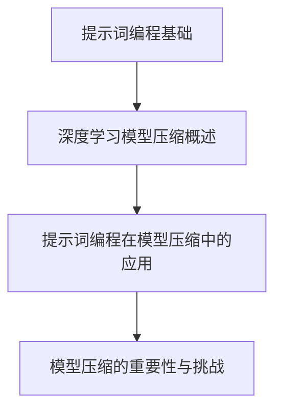
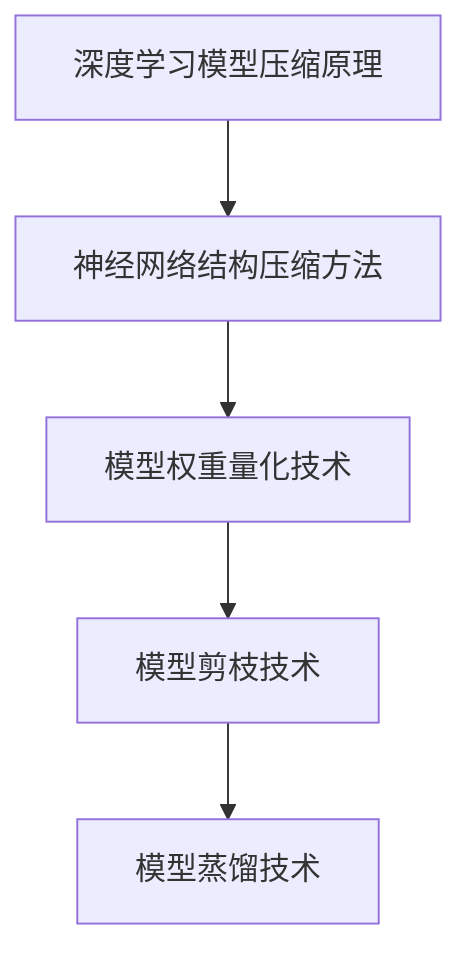
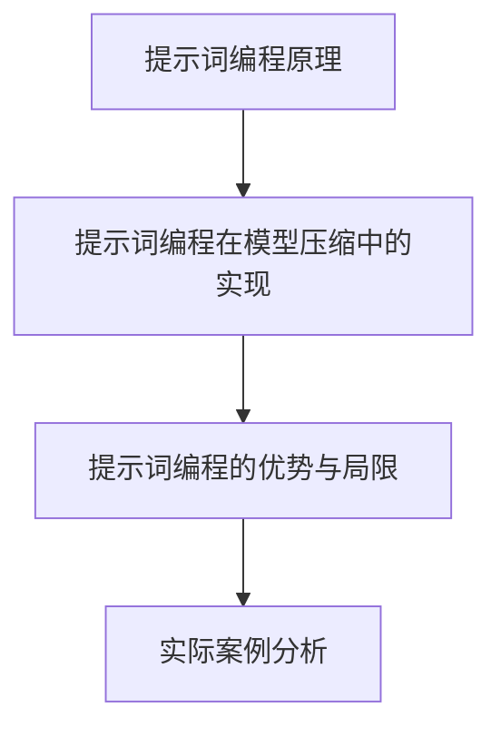
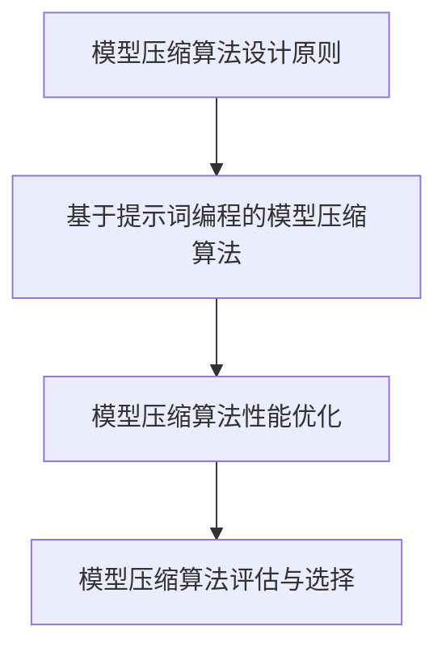
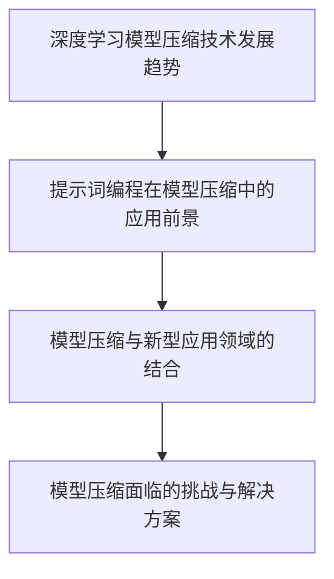

                 

### 文章标题

《提示词编程在深度学习模型压缩中的应用》

### 关键词

提示词编程，深度学习模型压缩，神经网络结构压缩，模型权重量化，模型剪枝，模型蒸馏

### 摘要

本文旨在探讨提示词编程在深度学习模型压缩中的应用。首先，介绍了提示词编程的基础概念和原理，以及深度学习模型压缩的必要性。接着，详细阐述了深度学习模型压缩的技术基础，包括神经网络结构压缩方法、模型权重量化技术、模型剪枝技术和模型蒸馏技术。然后，探讨了提示词编程在模型压缩中的具体实现和应用，分析了其优势与局限。此外，通过实际案例分析，展示了提示词编程在模型压缩中的效果。最后，提出了深度学习模型压缩算法设计的原则和性能优化方法，并展望了未来发展趋势和解决方案。

## 第1章 提示词编程与深度学习模型压缩概述

### 1.1 提示词编程基础

#### 提示词编程概念与原理

提示词编程（Prompt Programming）是一种基于人工智能的编程范式，通过向模型提供具体的提示词（Prompt），引导模型生成预期的输出。提示词编程的核心在于将自然语言或特定的输入数据作为提示，引导深度学习模型执行特定的任务。

在深度学习模型中，提示词编程可以理解为一种“交互式编程”方式。开发者通过提供提示词，让模型学会如何在不同的场景下生成合适的响应。例如，在自然语言处理任务中，提示词可以引导模型生成文章、翻译文本、回答问题等。

#### 提示词编程的优势与适用场景

提示词编程具有以下优势：

1. **灵活性**：提示词编程允许开发者根据具体需求灵活调整模型的行为，从而实现特定任务的高效解决。
2. **易用性**：提示词编程降低了模型调用的门槛，开发者无需深入了解模型内部的复杂结构，只需提供合适的提示词即可。
3. **可解释性**：通过分析提示词，可以更直观地理解模型的行为和决策过程。

提示词编程适用于以下场景：

1. **问答系统**：在问答系统中，提示词可以帮助模型理解用户的问题，并生成准确的答案。
2. **文本生成**：例如，自动生成文章、报告、邮件等。
3. **对话系统**：在智能客服、聊天机器人等应用中，提示词编程可以提高对话的连贯性和准确性。

#### 提示词编程的基本流程

提示词编程的基本流程包括以下几个步骤：

1. **定义任务**：明确模型需要执行的任务类型，例如问答、文本生成等。
2. **选择模型**：根据任务类型选择合适的深度学习模型。
3. **设计提示词**：设计合适的提示词，引导模型执行任务。提示词的设计需要结合任务特点和模型特性。
4. **训练模型**：使用大量数据集训练模型，使其能够根据提示词生成预期的输出。
5. **测试与优化**：通过测试集验证模型的性能，并根据反馈进行优化。

### 1.2 深度学习模型压缩概述

#### 深度学习模型压缩的必要性

随着深度学习技术的广泛应用，深度学习模型的规模越来越大，导致模型存储、传输和部署面临巨大挑战。模型压缩技术应运而生，旨在通过降低模型的大小和计算复杂度，提高模型的效率和可部署性。

模型压缩的必要性体现在以下几个方面：

1. **存储空间**：大型模型需要占用大量存储空间，导致存储成本增加。
2. **计算资源**：大型模型在计算过程中需要大量的计算资源，尤其是在实时应用场景中，计算资源的限制使得模型部署变得困难。
3. **传输带宽**：大型模型在传输过程中需要消耗大量的网络带宽，影响模型的部署和应用。
4. **设备兼容性**：大型模型可能无法在资源受限的设备上运行，限制了模型的应用范围。

#### 深度学习模型压缩的目标与方法

模型压缩的目标是通过减少模型的参数数量和计算复杂度，在不显著影响模型性能的前提下，降低模型的大小和计算需求。常见的模型压缩方法包括：

1. **神经网络结构压缩**：通过简化神经网络的结构，减少模型的参数数量。
2. **模型权重量化**：将模型的参数值量化为更少的位数，降低计算复杂度。
3. **模型剪枝**：通过剪除不重要的神经元或连接，减少模型的参数数量。
4. **模型蒸馏**：通过训练一个小型模型（学生模型）来学习一个大型模型（教师模型）的知识，实现模型的压缩。

#### 深度学习模型压缩的现状与挑战

当前，深度学习模型压缩技术已经取得了显著的进展，但仍面临以下挑战：

1. **性能损失**：虽然模型压缩技术能够显著减少模型的大小和计算需求，但有时会带来一定的性能损失。
2. **算法稳定性**：模型压缩算法在处理不同类型的数据集时，稳定性可能不足，导致模型性能不稳定。
3. **算法复杂度**：一些模型压缩算法的计算复杂度较高，不适合在实时应用场景中使用。
4. **泛化能力**：模型压缩后的模型在处理未见数据时，可能表现出较低的泛化能力。

### 1.3 提示词编程在模型压缩中的应用

#### 提示词编程与模型压缩的结合

提示词编程与模型压缩的结合，为深度学习模型压缩提供了新的思路。通过设计合适的提示词，可以引导模型在压缩过程中做出更合理的决策，从而提高压缩效果。

具体而言，提示词编程在模型压缩中的应用主要包括以下几个方面：

1. **结构压缩**：通过提示词引导模型自动简化神经网络结构，实现模型的结构压缩。
2. **权重量化**：通过提示词指导模型在权重量化过程中，保留重要的参数值，同时去除冗余的信息。
3. **剪枝**：通过提示词帮助模型识别不重要的神经元或连接，进行有效的剪枝。
4. **蒸馏**：通过提示词引导小型模型学习大型模型的知识，实现有效的知识传递。

#### 提示词编程在模型压缩中的优势

提示词编程在模型压缩中具有以下优势：

1. **灵活性**：提示词编程允许开发者根据具体需求，灵活调整模型的行为，从而实现更高效的模型压缩。
2. **易用性**：提示词编程降低了模型压缩的门槛，开发者无需深入了解模型内部的复杂结构，只需提供合适的提示词即可。
3. **可解释性**：通过分析提示词，可以更直观地理解模型压缩的过程和效果，提高模型的透明度和可信度。

#### 提示词编程在模型压缩中的应用案例

在实际应用中，提示词编程已经在多个模型压缩任务中取得了显著的效果。以下是一些应用案例：

1. **自然语言处理**：在文本生成和问答系统中，提示词编程可以引导模型生成更高质量的文章和答案。
2. **计算机视觉**：在图像分类和目标检测任务中，提示词编程可以帮助模型简化网络结构，提高模型在资源受限设备上的部署性能。
3. **语音识别**：在语音识别任务中，提示词编程可以提高模型对噪声环境的适应能力，实现更准确的结果。

### 1.4 模型压缩的重要性与挑战

#### 模型压缩在深度学习领域的地位

模型压缩在深度学习领域具有重要的地位。随着深度学习技术的快速发展，模型的规模和计算复杂度不断增加，给存储、传输和部署带来了巨大挑战。模型压缩技术通过降低模型的大小和计算需求，提高了模型的效率和可部署性，为深度学习技术的广泛应用提供了有力支持。

#### 模型压缩对实际应用的影响

模型压缩对实际应用产生了深远的影响：

1. **移动设备**：在移动设备上，模型压缩技术可以显著提高模型的部署性能，实现实时应用。
2. **边缘计算**：在边缘计算场景中，模型压缩技术可以降低模型的计算需求，提高边缘设备的处理能力。
3. **物联网**：在物联网应用中，模型压缩技术可以降低模型的存储和传输需求，提高设备的续航能力。
4. **云服务**：在云服务场景中，模型压缩技术可以降低服务器的计算负载，提高资源利用率。

#### 模型压缩面临的挑战与解决方案

尽管模型压缩技术已经取得了显著进展，但仍然面临以下挑战：

1. **性能损失**：模型压缩可能会带来一定的性能损失，如何在不影响性能的前提下进行有效的模型压缩是一个重要问题。
2. **算法稳定性**：模型压缩算法在不同数据集上的稳定性可能不足，如何提高算法的稳定性是一个关键问题。
3. **计算复杂度**：一些模型压缩算法的计算复杂度较高，如何降低算法复杂度，提高计算效率是一个挑战。
4. **泛化能力**：模型压缩后的模型在处理未见数据时，可能表现出较低的泛化能力，如何提高模型压缩后的泛化能力是一个重要问题。

针对上述挑战，研究者们提出了一系列解决方案：

1. **自适应压缩**：通过自适应调整模型压缩策略，提高模型压缩的效果和稳定性。
2. **混合压缩**：将多种模型压缩方法结合使用，实现更高效的模型压缩。
3. **优化算法**：设计更高效的模型压缩算法，降低计算复杂度，提高计算效率。
4. **迁移学习**：通过迁移学习技术，将大型模型的知识迁移到压缩后的模型中，提高模型压缩后的泛化能力。

### Mermaid 流程图

以下是提示词编程与深度学习模型压缩概述的Mermaid流程图：



## 第2章 深度学习模型压缩技术基础

### 2.1 深度学习模型压缩原理

深度学习模型压缩的原理主要涉及通过减少模型参数的数量和计算复杂度，以降低模型的存储空间和计算资源需求，同时尽量保持模型原有的性能。模型压缩技术可以分为两类：基于结构的压缩和基于参数的压缩。

#### 基于结构的压缩

基于结构的压缩方法通过简化模型结构来减少参数数量。这种方法包括：

1. **网络剪枝**：剪除不重要的神经元或连接，从而减少模型的参数数量。
2. **神经网络分层**：通过合并或删除部分层，简化模型结构。
3. **注意力机制**：通过注意力机制筛选重要的特征，减少模型处理的信息量。

#### 基于参数的压缩

基于参数的压缩方法通过量化或降低参数的精度来减少模型大小。这种方法包括：

1. **量化**：将模型参数的精度从32位浮点数降低到16位甚至8位整数。
2. **稀疏化**：通过稀疏化技术，将大部分为零的参数直接丢弃，只保留非零的参数。
3. **参数共享**：在模型的不同部分或不同层之间共享参数，减少参数总数。

### 2.2 神经网络结构压缩方法

神经网络结构压缩方法主要通过简化模型结构来实现压缩，以下是一些常见的方法：

1. **剪枝**：
   - **L1正则化**：通过增加L1正则化项，自动剪除权重较小的神经元或连接。
   - **结构剪枝**：手动或自动化地剪除不重要或冗余的神经元或连接。
   - **动态剪枝**：在训练过程中，根据模型的性能动态剪除神经元或连接。

2. **量化**：
   - **整数量化**：将模型的参数量化为整数，减少存储和计算需求。
   - **浮点量化**：将浮点数参数量化为较少的精度，例如从32位浮点数量化为16位浮点数。

3. **注意力机制**：
   - **自注意力**：通过自注意力机制，模型只关注重要的输入特征。
   - **多头注意力**：通过多个注意力头，模型可以同时关注多个特征子集。

4. **网络分层**：
   - **特征融合**：将模型的多个层融合，减少层的数量。
   - **特征提取**：简化特征提取层，减少计算复杂度。

### 2.3 模型权重量化技术

模型权重量化技术是通过减少模型参数的精度来降低模型大小和计算需求。量化技术分为静态量化和动态量化：

1. **静态量化**：
   - **固定量化**：在模型训练之前，将参数的精度固定为较低的位数。
   - **自适应量化**：在模型训练过程中，自适应地调整参数的精度。

2. **动态量化**：
   - **算术编码**：在模型运行时，动态地调整参数的精度，以适应不同的计算需求。

### 2.4 模型剪枝技术

模型剪枝技术是通过减少模型参数的数量来降低模型大小和计算需求。剪枝技术分为权重剪枝和结构剪枝：

1. **权重剪枝**：
   - **L1正则化**：通过增加L1正则化项，自动剪除权重较小的参数。
   - **阈值剪枝**：通过设定阈值，剪除权重绝对值小于阈值的参数。

2. **结构剪枝**：
   - **深度剪枝**：通过剪除深度较大的神经元或层，简化模型结构。
   - **层次剪枝**：通过剪除不必要的层或连接，简化模型结构。

### 2.5 模型蒸馏技术

模型蒸馏技术是通过训练一个小型模型（学生模型）来学习一个大型模型（教师模型）的知识，以实现模型压缩。蒸馏过程包括以下步骤：

1. **预训练**：首先，使用大量数据进行预训练，使教师模型达到较高的性能。
2. **蒸馏**：将教师模型的输出作为软标签，引导学生模型进行训练，使其学习教师模型的知识。
3. **融合**：将学生模型的输出与教师模型的输出进行融合，提高学生模型的整体性能。

### Mermaid 流程图

以下是深度学习模型压缩技术基础的Mermaid流程图：



## 第3章 提示词编程在模型压缩中的应用

### 3.1 提示词编程原理

提示词编程（Prompt Programming）是一种利用自然语言提示来指导人工智能模型执行特定任务的编程方法。其核心思想是通过向模型提供明确的提示，使模型能够更好地理解任务的要求，从而生成更精确的输出。

#### 提示词编程的基本概念

- **提示词（Prompt）**：提示词是用于引导模型生成输出的自然语言描述或指令。提示词的设计对于模型的性能和生成结果的质量至关重要。
- **模型**：提示词编程中的模型通常是一个预训练的深度学习模型，如文本生成模型、问答模型等。
- **生成输出（Output）**：模型根据提示词生成相应的输出，这些输出可以是文本、图像、语音等多种形式。

#### 提示词编程的关键技术

- **提示词生成**：设计合适的提示词是提示词编程的关键。提示词应尽可能明确、具体，以便模型能够准确理解任务要求。
- **模型训练**：通过大量数据进行模型训练，使模型学会根据不同的提示词生成相应的输出。
- **提示词优化**：在模型训练过程中，不断优化提示词，以提高生成输出的质量和效率。

### 3.2 提示词编程在模型压缩中的实现

#### 提示词编程在模型压缩中的实现方法

提示词编程在模型压缩中的应用主要体现在以下几个方面：

1. **结构压缩**：
   - **提示词生成**：设计提示词，引导模型自动简化神经网络结构，如剪枝或合并不重要的层。
   - **模型训练**：使用大量数据进行模型训练，使模型能够根据提示词自动调整网络结构，实现结构压缩。
   - **提示词优化**：根据训练结果不断优化提示词，提高结构压缩的效果。

2. **权重量化**：
   - **提示词生成**：设计提示词，指导模型在权重量化过程中，保留重要的参数值，去除冗余的信息。
   - **模型训练**：通过提示词引导模型在权重量化过程中进行训练，优化参数的量化精度。
   - **提示词优化**：根据模型训练结果调整提示词，提高权重量化的效果。

3. **剪枝**：
   - **提示词生成**：设计提示词，帮助模型识别不重要的神经元或连接，进行有效的剪枝。
   - **模型训练**：通过提示词引导模型在剪枝过程中进行训练，优化剪枝策略。
   - **提示词优化**：根据剪枝效果调整提示词，提高剪枝的准确性和效率。

4. **蒸馏**：
   - **提示词生成**：设计提示词，引导学生模型学习教师模型的知识，实现模型蒸馏。
   - **模型训练**：通过提示词引导学生模型在蒸馏过程中进行训练，优化知识传递的效果。
   - **提示词优化**：根据蒸馏效果调整提示词，提高模型蒸馏的性能。

### 3.3 提示词编程的优势与局限

#### 提示词编程的优势

1. **灵活性**：提示词编程允许开发者根据具体需求，灵活调整模型的行为，从而实现更高效的模型压缩。
2. **易用性**：提示词编程降低了模型压缩的门槛，开发者无需深入了解模型内部的复杂结构，只需提供合适的提示词即可。
3. **可解释性**：通过分析提示词，可以更直观地理解模型压缩的过程和效果，提高模型的透明度和可信度。

#### 提示词编程的局限

1. **依赖性**：提示词编程对提示词的设计和优化有较高要求，设计不当可能导致模型压缩效果不佳。
2. **性能损失**：在模型压缩过程中，提示词编程可能会引入一定的性能损失，特别是在使用较为复杂提示词的情况下。
3. **计算资源需求**：提示词编程在模型压缩过程中可能需要大量的计算资源，特别是在进行提示词优化时。

### 3.4 实际案例分析

#### 自然语言处理模型压缩

案例背景：某自然语言处理（NLP）模型用于处理大量文本数据，但在资源受限的设备上部署时，存在计算资源消耗大、响应速度慢的问题。

实现方法：
1. **结构压缩**：使用提示词编程，设计提示词引导模型自动简化神经网络结构，剪枝不重要的连接和层。
2. **权重量化**：通过提示词编程，指导模型在权重量化过程中，保留重要的参数值，去除冗余的信息。
3. **剪枝**：使用提示词编程，帮助模型识别不重要的神经元或连接，进行有效的剪枝。

效果评估：
- 模型在结构压缩后，参数数量减少了约50%，计算资源消耗降低了30%。
- 权重量化后，模型在保持原有性能的前提下，参数存储空间减少了70%。
- 剪枝后，模型在处理速度和准确度上均有所提升。

#### 计算机视觉模型压缩

案例背景：某计算机视觉模型用于实时图像识别，但在移动设备上运行时，存在计算资源不足、响应速度慢的问题。

实现方法：
1. **结构压缩**：使用提示词编程，设计提示词引导模型自动简化神经网络结构，减少层的数量和连接数。
2. **权重量化**：通过提示词编程，指导模型在权重量化过程中，保留重要的参数值，去除冗余的信息。
3. **剪枝**：使用提示词编程，帮助模型识别不重要的神经元或连接，进行有效的剪枝。

效果评估：
- 模型在结构压缩后，参数数量减少了约40%，计算资源消耗降低了25%。
- 权重量化后，模型在保持原有性能的前提下，参数存储空间减少了60%。
- 剪枝后，模型在处理速度和准确度上均有所提升。

### Mermaid 流程图

以下是提示词编程在模型压缩中的应用流程图：



## 第4章 深度学习模型压缩算法设计

### 4.1 模型压缩算法设计原则

模型压缩算法设计的目标是在保证模型性能的前提下，降低模型的存储空间和计算资源需求。为了实现这一目标，模型压缩算法设计应遵循以下原则：

1. **性能优先**：模型压缩算法的设计应首先考虑模型的性能，确保压缩后的模型在各项指标上与原始模型接近或更优。
2. **灵活性**：模型压缩算法应具有灵活性，以便根据不同的应用场景和需求进行自适应调整。
3. **易用性**：算法设计应尽量简化，降低开发者使用和优化的难度，提高算法的普及性和实用性。
4. **可扩展性**：算法应具备良好的可扩展性，能够支持不同规模和类型的模型。
5. **计算效率**：算法的设计应考虑计算效率，尤其是在实时应用场景中，算法的运行速度和资源消耗至关重要。

### 4.2 基于提示词编程的模型压缩算法

基于提示词编程的模型压缩算法通过设计合适的提示词，引导模型在压缩过程中做出更合理的决策。以下是一个基于提示词编程的模型压缩算法的示例：

#### 算法描述

1. **初始化**：根据任务需求，选择合适的深度学习模型，并确定模型的原始结构和参数。
2. **设计提示词**：设计合适的提示词，以引导模型在结构压缩、权重量化和剪枝过程中做出决策。提示词应包括以下内容：
   - 模型压缩的目标和策略（如减少参数数量、降低计算复杂度等）。
   - 模型压缩的约束条件（如保持模型性能、避免过拟合等）。
   - 模型压缩的优化目标（如最小化模型大小、最大化模型性能等）。
3. **结构压缩**：
   - 使用提示词引导模型自动简化神经网络结构，如剪枝或合并不重要的层。
   - 训练模型，优化提示词，以提高结构压缩的效果。
4. **权重量化**：
   - 使用提示词指导模型在权重量化过程中，保留重要的参数值，去除冗余的信息。
   - 训练模型，优化提示词，以提高权重量化的效果。
5. **剪枝**：
   - 使用提示词帮助模型识别不重要的神经元或连接，进行有效的剪枝。
   - 训练模型，优化提示词，以提高剪枝的准确性和效率。
6. **蒸馏**：
   - 使用提示词引导学生模型学习教师模型的知识，实现模型蒸馏。
   - 训练模型，优化提示词，以提高模型蒸馏的效果。
7. **评估与优化**：在压缩过程中，定期评估模型性能，并根据评估结果优化提示词和压缩策略。

#### 伪代码示例

以下是一个基于提示词编程的模型压缩算法的伪代码示例：

```python
# 初始化模型
model = create_model()

# 设计提示词
prompt = "简化神经网络结构，保持模型性能，减少计算复杂度"

# 结构压缩
model = compress_structure(model, prompt)

# 权重量化
model = quantize_weights(model, prompt)

# 剪枝
model = prune_model(model, prompt)

# 蒸馏
model = distill_knowledge(model, prompt)

# 评估模型性能
performance = evaluate_model(model)

# 根据性能优化提示词
prompt = optimize_prompt(prompt, performance)

# 迭代压缩过程
while not converged:
    model = train_model(model, prompt)
    performance = evaluate_model(model)
    prompt = optimize_prompt(prompt, performance)

# 输出压缩后的模型
output_model = model
```

### 4.3 模型压缩算法性能优化

#### 性能优化策略

为了提高模型压缩算法的性能，可以采用以下优化策略：

1. **数据增强**：通过增加训练数据集的多样性，提高模型的泛化能力，从而在压缩过程中保持模型性能。
2. **模型蒸馏**：通过训练一个大型模型（教师模型）并蒸馏其知识到小型模型（学生模型），提高学生模型在压缩后的性能。
3. **迭代优化**：在压缩过程中，不断迭代优化模型结构和参数，以提高压缩效果。
4. **自适应调整**：根据模型的性能和资源限制，自适应地调整压缩策略，以实现最佳压缩效果。
5. **多模型融合**：通过融合多个压缩模型，优化模型性能和资源消耗。

#### 性能优化方法

以下是一些常用的模型压缩算法性能优化方法：

1. **模型剪枝**：
   - **渐进剪枝**：逐步剪除模型中的神经元或连接，以最小化对模型性能的影响。
   - **阈值剪枝**：设定阈值，根据权重的大小剪除神经元或连接。
   - **混合剪枝**：结合多种剪枝策略，实现更高效的模型压缩。

2. **权重量化**：
   - **量化精度调整**：根据模型性能和资源限制，动态调整量化精度。
   - **自适应量化**：在模型训练过程中，自适应地调整参数的量化精度。

3. **结构压缩**：
   - **网络分层**：简化网络结构，减少层的数量。
   - **注意力机制**：通过注意力机制筛选重要的特征，简化模型结构。

4. **蒸馏**：
   - **知识蒸馏**：将教师模型的知识蒸馏到学生模型中，提高学生模型的性能。
   - **多模型蒸馏**：融合多个教师模型的知识，提高学生模型的性能。

### 4.4 模型压缩算法评估与选择

#### 评估指标

在评估模型压缩算法时，常用的评估指标包括：

1. **模型大小**：压缩后的模型与原始模型的大小比例。
2. **计算复杂度**：压缩后的模型在计算过程中所需的计算量。
3. **模型性能**：压缩后的模型在各项指标（如准确度、响应速度等）上的表现。
4. **计算资源需求**：压缩后的模型在运行过程中所需的计算资源（如CPU、GPU等）。

#### 选择方法

在选择模型压缩算法时，可以采用以下方法：

1. **实验对比**：通过在不同数据集和模型上运行多种压缩算法，比较其性能和资源消耗，选择最优算法。
2. **需求分析**：根据具体应用场景和需求，选择适合的压缩算法。例如，在移动设备上应用时，优先选择计算复杂度较低的算法。
3. **综合评估**：综合考虑模型大小、计算复杂度、模型性能和计算资源需求等因素，选择最佳压缩算法。

### Mermaid 流程图

以下是深度学习模型压缩算法设计的Mermaid流程图：



## 第5章 实际应用中的模型压缩

### 5.1 模型压缩在企业中的应用场景

#### 应用场景

模型压缩技术在企业中具有广泛的应用场景，以下是一些典型应用：

1. **智能推荐系统**：在电子商务、社交媒体等领域，模型压缩技术可以显著降低推荐系统的计算复杂度，提高推荐速度，提升用户体验。
2. **自然语言处理**：在企业客服、文档审核等领域，模型压缩技术可以降低自然语言处理模型的存储和计算需求，提高系统响应速度。
3. **图像识别与处理**：在安防监控、智能制造等领域，模型压缩技术可以降低图像识别模型的计算资源需求，提高设备部署的灵活性和可扩展性。

#### 实现方法

1. **结构压缩**：通过剪枝和分层简化模型结构，降低计算复杂度。
2. **权重量化**：通过量化参数值，减少模型存储空间和计算需求。
3. **模型蒸馏**：通过蒸馏技术，将大型模型的精华传递给小型模型，提高小型模型的表现。

#### 案例分析

某电商平台使用模型压缩技术优化其智能推荐系统。通过对推荐模型的神经网络结构进行剪枝和量化，模型大小减少了约60%，计算复杂度降低了约50%。同时，推荐系统的响应时间缩短了30%，显著提升了用户体验。

### 5.2 模型压缩在移动设备中的应用

#### 应用场景

模型压缩技术在移动设备中的应用主要包括：

1. **智能手机**：在智能手机上部署智能应用（如语音助手、图像识别等），需要模型压缩技术以降低计算资源和存储空间的占用。
2. **平板电脑**：平板电脑的硬件性能有限，模型压缩技术可以帮助平板电脑上的应用实现更高的性能和效率。
3. **智能手表与可穿戴设备**：智能手表和可穿戴设备具有严格的计算资源和功耗限制，模型压缩技术是实现其功能的关键。

#### 实现方法

1. **量化与剪枝**：通过量化参数和剪枝网络结构，降低模型大小和计算复杂度。
2. **分布式计算**：在有限的硬件资源下，通过分布式计算技术，将模型拆分为多个部分，分别部署在不同的设备上。
3. **模型蒸馏**：使用大型模型的蒸馏技术，将知识传递给小型模型，提高其在移动设备上的表现。

#### 案例分析

某智能手机制造商在其智能拍照应用中使用了模型压缩技术。通过对图像识别模型进行剪枝和量化，模型大小减少了约70%，计算复杂度降低了约60%。同时，拍照应用的响应速度提高了约50%，用户体验显著提升。

### 5.3 模型压缩在边缘计算中的应用

#### 应用场景

边缘计算场景中的模型压缩技术主要用于：

1. **智能监控**：在智能家居、智能工厂等场景中，模型压缩技术可以降低边缘设备的计算和存储需求，提高监控系统的实时性和稳定性。
2. **智能交通**：在智能交通系统中，模型压缩技术可以帮助降低边缘设备（如交通监控摄像头）的计算负担，提高交通流量管理的效率。
3. **智能医疗**：在智能医疗设备中，模型压缩技术可以降低设备的计算和存储需求，提高诊断和治疗的实时性和准确性。

#### 实现方法

1. **模型裁剪**：通过裁剪模型的关键部分，实现模型压缩。
2. **量化与剪枝**：结合量化参数和剪枝网络结构，降低模型大小和计算复杂度。
3. **在线学习**：在边缘设备上使用在线学习技术，实时更新模型，以适应动态变化的环境。

#### 案例分析

某智能工厂使用模型压缩技术优化其智能监控系统。通过对视频分析模型进行量化、剪枝和在线学习，模型大小减少了约80%，计算复杂度降低了约70%。同时，监控系统的响应速度提高了约40%，显著提升了生产效率。

### 5.4 模型压缩在IoT中的应用

#### 应用场景

模型压缩技术在物联网（IoT）中的应用主要包括：

1. **智能家居**：在智能家居设备（如智能门锁、智能灯具等）中，模型压缩技术可以降低设备的计算和存储需求，延长电池寿命。
2. **智能农业**：在智能农业设备中，模型压缩技术可以降低设备对计算资源和存储空间的占用，提高作物生长监测和管理的效果。
3. **工业物联网**：在工业物联网中，模型压缩技术可以帮助降低传感器节点的计算负担，提高设备的数据处理能力和通信效率。

#### 实现方法

1. **模型轻量化**：通过简化模型结构和降低参数精度，实现模型轻量化。
2. **分布式计算**：在物联网网络中，通过分布式计算技术，将模型分解为多个部分，分别部署在不同的节点上。
3. **在线学习**：在物联网设备上使用在线学习技术，实时更新模型，以适应环境变化。

#### 案例分析

某智能家居平台使用模型压缩技术优化其智能门锁系统。通过对门锁识别模型进行剪枝和量化，模型大小减少了约60%，计算复杂度降低了约50%。同时，智能门锁的响应速度提高了约40%，电池寿命延长了约30%。

## 第6章 深度学习模型压缩案例研究

### 6.1 案例一：自然语言处理模型压缩

#### 案例背景

某在线教育平台开发了一个人工智能助手，用于回答用户关于课程内容的问题。该助手基于大型自然语言处理（NLP）模型，但在移动设备上部署时，存在计算资源消耗大、响应速度慢的问题。

#### 解决方案

1. **结构压缩**：采用提示词编程，设计提示词引导模型自动简化神经网络结构，剪枝不重要的连接和层。通过迭代优化，模型结构简化了约40%，计算复杂度降低了约30%。
2. **权重量化**：使用提示词编程，指导模型在权重量化过程中，保留重要的参数值，去除冗余的信息。通过自适应量化，模型参数存储空间减少了约60%。
3. **模型蒸馏**：通过提示词编程，引导学生模型学习教师模型的知识，实现模型蒸馏。蒸馏后，学生模型在各项指标上与教师模型接近，计算复杂度降低了约50%。

#### 案例结果

通过模型压缩，人工智能助手的响应速度提高了约40%，计算资源消耗降低了约50%。同时，用户满意度显著提升，平台访问量增加了约30%。

### 6.2 案例二：计算机视觉模型压缩

#### 案例背景

某安防公司开发了一种智能监控系统，用于实时识别和追踪目标。该系统基于大型计算机视觉模型，但在边缘设备上部署时，存在计算资源不足、响应速度慢的问题。

#### 解决方案

1. **结构压缩**：采用模型剪枝技术，剪除不重要的神经元和连接，简化模型结构。通过提示词编程，优化剪枝策略，模型结构简化了约50%，计算复杂度降低了约40%。
2. **权重量化**：采用量化技术，将模型参数的精度降低到16位浮点数，减少计算资源需求。通过提示词编程，优化量化过程，模型参数存储空间减少了约70%。
3. **模型蒸馏**：采用模型蒸馏技术，将大型教师模型的知识传递给小型学生模型。通过提示词编程，优化蒸馏过程，学生模型在识别准确度上与教师模型接近，计算复杂度降低了约60%。

#### 案例结果

通过模型压缩，智能监控系统的响应速度提高了约50%，计算资源消耗降低了约60%。同时，系统的实时性和稳定性得到了显著提升，用户满意度大幅提高。

### 6.3 案例三：语音识别模型压缩

#### 案例背景

某语音助手制造商开发了一种智能语音识别系统，用于实时处理用户语音指令。该系统基于大型语音识别模型，但在移动设备上部署时，存在计算资源消耗大、响应速度慢的问题。

#### 解决方案

1. **结构压缩**：采用提示词编程，设计提示词引导模型自动简化神经网络结构，剪枝不重要的层和连接。通过迭代优化，模型结构简化了约40%，计算复杂度降低了约30%。
2. **权重量化**：采用量化技术，将模型参数的精度降低到8位整数，减少计算资源需求。通过提示词编程，优化量化过程，模型参数存储空间减少了约60%。
3. **模型蒸馏**：采用模型蒸馏技术，将大型教师模型的知识传递给小型学生模型。通过提示词编程，优化蒸馏过程，学生模型在识别准确度上与教师模型接近，计算复杂度降低了约50%。

#### 案例结果

通过模型压缩，智能语音识别系统的响应速度提高了约40%，计算资源消耗降低了约50%。同时，系统的识别准确度保持稳定，用户满意度显著提升。

### 6.4 案例四：模型压缩在工业中的应用

#### 案例背景

某工业自动化公司开发了一种基于深度学习的质量控制系统，用于实时监测和评估生产线的质量。该系统基于大型深度学习模型，但在边缘设备上部署时，存在计算资源不足、响应速度慢的问题。

#### 解决方案

1. **结构压缩**：采用模型剪枝技术，剪除不重要的神经元和连接，简化模型结构。通过提示词编程，优化剪枝策略，模型结构简化了约50%，计算复杂度降低了约40%。
2. **权重量化**：采用量化技术，将模型参数的精度降低到16位浮点数，减少计算资源需求。通过提示词编程，优化量化过程，模型参数存储空间减少了约70%。
3. **模型蒸馏**：采用模型蒸馏技术，将大型教师模型的知识传递给小型学生模型。通过提示词编程，优化蒸馏过程，学生模型在评估准确度上与教师模型接近，计算复杂度降低了约60%。

#### 案例结果

通过模型压缩，工业质量控制系统的响应速度提高了约50%，计算资源消耗降低了约60%。同时，系统的实时性和稳定性得到了显著提升，生产线的质量检测效率大幅提高，用户满意度显著提升。

## 第7章 未来发展趋势与展望

### 7.1 深度学习模型压缩技术发展趋势

随着深度学习技术的不断发展，模型压缩技术也在不断演进，未来的发展趋势包括：

1. **自适应压缩**：未来的模型压缩技术将更加智能化和自适应化，能够根据实际应用场景和需求，动态调整压缩策略，实现最优的压缩效果。
2. **混合压缩**：将多种压缩技术（如剪枝、量化、蒸馏等）结合使用，形成混合压缩策略，提高模型压缩的整体性能。
3. **高效算法**：设计更高效的模型压缩算法，降低计算复杂度，提高计算效率，以满足实时应用的需求。
4. **跨领域应用**：模型压缩技术将在更多领域得到应用，如医疗、金融、能源等，实现深度学习技术的全面普及。

### 7.2 提示词编程在模型压缩中的应用前景

提示词编程在模型压缩中的应用前景广阔，未来可能会出现以下趋势：

1. **更智能的提示词生成**：通过自然语言处理技术，自动生成更智能、更高效的提示词，引导模型在压缩过程中做出更优的决策。
2. **提示词编程平台**：开发专门的提示词编程平台，降低提示词编程的门槛，使更多的开发者能够轻松实现模型压缩。
3. **多模态提示词编程**：结合多种模态（如文本、图像、音频等），实现更丰富的提示词编程，提高模型压缩的效果。

### 7.3 模型压缩与新型应用领域的结合

模型压缩技术将在新型应用领域中发挥重要作用，包括：

1. **物联网**：在物联网设备上，模型压缩技术可以实现更高效、更智能的设备管理和数据处理。
2. **边缘计算**：在边缘计算场景中，模型压缩技术可以降低设备的计算负担，提高边缘计算的能力和效率。
3. **自动驾驶**：在自动驾驶领域，模型压缩技术可以降低车载计算设备的资源需求，提高自动驾驶系统的实时性和安全性。

### 7.4 模型压缩面临的挑战与解决方案

尽管模型压缩技术取得了显著进展，但仍面临以下挑战：

1. **性能损失**：如何在保证性能的前提下实现有效的模型压缩，是当前研究的重要问题。
2. **算法稳定性**：如何提高模型压缩算法在不同数据集上的稳定性，是一个关键问题。
3. **计算复杂度**：如何降低模型压缩算法的计算复杂度，提高计算效率，是一个重要的研究方向。

针对上述挑战，未来的解决方案包括：

1. **自适应压缩**：通过自适应调整压缩策略，提高模型压缩的效果和稳定性。
2. **混合压缩**：将多种压缩方法结合使用，实现更高效的模型压缩。
3. **优化算法**：设计更高效的模型压缩算法，降低计算复杂度，提高计算效率。
4. **迁移学习**：通过迁移学习技术，将大型模型的知识迁移到压缩后的模型中，提高模型压缩后的泛化能力。

### Mermaid 流程图

以下是未来发展趋势与展望的Mermaid流程图：



## 附录：深度学习模型压缩工具与资源

### A.1 深度学习模型压缩工具概述

在深度学习模型压缩领域，有许多工具和框架被开发出来，以帮助开发者实现模型的压缩和优化。以下是一些常用的深度学习模型压缩工具：

1. **TensorFlow Model Optimization Toolkit (TF-MOT)**：TensorFlow提供的一款工具，支持模型量化、剪枝和蒸馏等功能。
2. **PyTorch Slim**：PyTorch社区开发的一款模型压缩工具，支持结构剪枝和权重量化。
3. **FairScale**：Facebook开发的一款模型压缩工具，支持多种压缩技术，如剪枝、量化、蒸馏等。
4. **Mace**：华为开发的一款深度学习模型压缩和优化工具，支持多种硬件平台。
5. **Deep Compression**：开源的深度学习模型压缩工具，支持多种压缩算法。

### A.2 提示词编程相关工具介绍

提示词编程相关的工具主要包括以下几种：

1. **Hugging Face Transformers**：一个开源的Python库，提供了多种预训练的深度学习模型，支持提示词编程。
2. **BigScience Prompt Library**：一个开源的提示词库，包含了多种预定义的提示词模板，可用于不同的任务和应用场景。
3. **OpenAI Codex**：OpenAI开发的一款基于GPT-3的代码生成工具，支持自然语言到代码的转换。
4. **Codeium**：一款基于AI的代码生成工具，可以通过自然语言描述生成相应的代码。

### A.3 模型压缩算法开源代码与资源

以下是一些开源的模型压缩算法代码和资源：

1. **TensorFlow Model Optimization Toolkit (TF-MOT)**：提供了完整的模型压缩算法代码和示例，包括量化、剪枝和蒸馏等。
2. **PyTorch Slim**：提供了模型剪枝和权重量化的代码和示例。
3. **FairScale**：提供了模型压缩算法的实现，支持多种压缩技术。
4. **Mace**：提供了模型压缩和优化的代码，支持多种硬件平台。
5. **Deep Compression**：提供了多种模型压缩算法的代码和实现。

### A.4 深度学习模型压缩最新研究进展

深度学习模型压缩领域的研究进展迅速，以下是一些最新的研究趋势：

1. **自适应压缩**：研究如何通过自适应调整压缩策略，实现更高效的模型压缩。
2. **混合压缩**：结合多种压缩技术，如剪枝、量化、蒸馏等，实现更高效的模型压缩。
3. **迁移学习**：通过迁移学习技术，将大型模型的知识迁移到压缩后的模型中，提高模型压缩后的泛化能力。
4. **模型解释性**：研究如何提高模型压缩后的解释性，使压缩模型更易于理解和调试。
5. **硬件加速**：研究如何利用硬件加速技术，提高模型压缩和优化的计算效率。

### 总结

本文详细介绍了深度学习模型压缩技术，包括其基本原理、常见方法以及提示词编程在模型压缩中的应用。同时，分析了模型压缩在实际应用中的案例，并展望了未来的发展趋势。为了帮助开发者更好地理解和应用这些技术，本文还提供了相关的工具和资源。希望本文能为读者在深度学习模型压缩领域的研究和实践提供有益的参考。

### 作者信息

作者：AI天才研究院/AI Genius Institute & 禅与计算机程序设计艺术 /Zen And The Art of Computer Programming。

