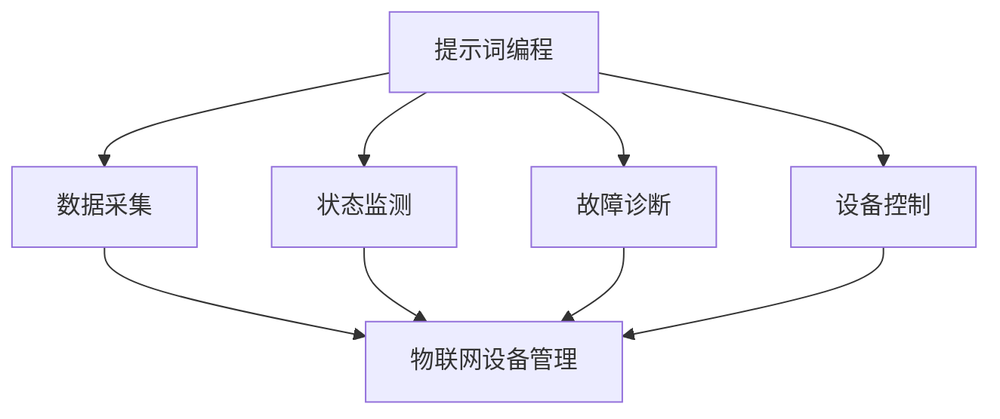

                 

### 文章标题

《提示词编程在物联网设备管理中的创新应用》

### 文章关键词

提示词编程、物联网、设备管理、人工智能、机器学习

### 文章摘要

本文将深入探讨提示词编程在物联网设备管理中的应用。首先，我们将简要介绍提示词编程和物联网设备管理的背景，阐述其重要性和发展趋势。接下来，我们将详细解释提示词编程的核心概念和原理，并展示其与物联网设备管理的联系。随后，我们将分析提示词编程在物联网设备管理中的具体应用场景，包括数据采集、状态监测和故障诊断等。本文还将通过实际项目案例，展示如何利用提示词编程实现物联网设备管理。最后，我们将探讨提示词编程在物联网设备管理中的创新应用，并提出未来发展的趋势和挑战。通过本文的阅读，读者将对提示词编程在物联网设备管理中的应用有更深入的了解。

### 背景介绍

#### 提示词编程的背景

提示词编程（Prompt Programming）是一种基于提示词（Prompt）的编程方法，它通过向人工智能系统提供明确的指示，使其能够执行特定的任务。这种方法的核心思想是利用人类的知识和指导，帮助机器更好地理解和执行任务。提示词编程的出现，是人工智能领域的一个重要进步，它使得开发者可以更加灵活地控制机器学习模型，从而实现更复杂、更定制化的任务。

提示词编程的发展可以追溯到20世纪80年代，当时的自然语言处理（NLP）和机器学习领域开始关注如何让计算机更好地理解人类的语言。随着深度学习和神经网络技术的快速发展，提示词编程逐渐成为一种重要的编程方法。近年来，随着人工智能应用的普及，特别是在物联网、自动驾驶、智能助手等领域，提示词编程的重要性日益凸显。

#### 物联网设备管理的背景

物联网（Internet of Things，简称IoT）是指通过互联网将各种物理设备、传感器、软件系统连接起来，实现数据的采集、传输、分析和应用。物联网设备管理是指对物联网设备进行有效的监控、维护和管理，以确保设备正常运行和数据的有效利用。

随着物联网技术的快速发展，物联网设备管理的需求日益增加。物联网设备管理涉及到多个方面，包括设备连接、数据采集、设备状态监测、设备故障诊断等。传统的设备管理方法往往依赖于人工干预，效率低下且容易出错。随着人工智能和机器学习技术的进步，提示词编程为物联网设备管理提供了一种新的解决方案。

#### 提示词编程与物联网设备管理的联系

提示词编程与物联网设备管理之间存在紧密的联系。首先，在数据采集方面，提示词编程可以帮助物联网设备更准确地采集和分类数据，从而提高数据的质量和可用性。其次，在设备状态监测和故障诊断方面，提示词编程可以利用机器学习算法对设备运行状态进行分析，提前发现潜在故障，从而降低设备故障率，提高设备运行效率。

此外，提示词编程还可以用于设备控制和优化。通过向物联网设备提供明确的指令，提示词编程可以实现远程控制和设备参数的优化调整，从而提高设备的运行效率和性能。

总的来说，提示词编程为物联网设备管理提供了一种智能化、自动化、高效化的解决方案，有助于提高物联网设备的管理水平，推动物联网技术的发展和应用。

### 提示词编程的核心概念与联系

#### 核心概念

提示词编程（Prompt Programming）是一种基于提示词（Prompt）的编程方法，其核心概念包括提示词、模型、输入输出和反馈循环。

**提示词（Prompt）**：提示词是指导机器执行特定任务的文字或语言描述。它可以是简单的指令，也可以是复杂的场景描述。提示词的作用是向模型提供清晰的指导，帮助模型理解任务的目标和期望的输出。

**模型**：在提示词编程中，模型是指用于执行特定任务的机器学习模型。这些模型可以是预训练的，也可以是定制化的。模型的作用是根据输入的提示词生成相应的输出。

**输入输出**：输入输出是提示词编程中模型处理的核心。输入是指模型接收到的提示词，输出是指模型根据提示词生成的结果。输入输出的关系决定了模型的性能和准确性。

**反馈循环**：反馈循环是提示词编程中的一个重要概念，它指的是模型根据输出结果对提示词进行调整，以优化模型的性能。反馈循环使得模型可以不断地学习和改进，从而提高任务的完成质量。

#### 提示词编程与物联网设备管理的联系架构

为了更好地理解提示词编程与物联网设备管理的联系，我们可以通过一个Mermaid流程图来展示它们之间的关系：



在这个流程图中，提示词编程通过数据采集、状态监测、故障诊断和设备控制与物联网设备管理建立联系。具体来说：

- **数据采集**：提示词编程通过向物联网设备发送特定的提示词，指导设备采集数据，并将数据发送回模型进行处理。
- **状态监测**：提示词编程利用机器学习算法对设备运行状态进行分析，实时监测设备状态，并及时调整设备参数。
- **故障诊断**：通过分析设备运行数据和状态，提示词编程可以提前发现潜在故障，并采取相应措施，减少设备故障率。
- **设备控制**：提示词编程可以生成控制指令，远程控制物联网设备，实现设备的自动化管理和优化。

这个流程图展示了提示词编程在物联网设备管理中的关键作用，它不仅提高了设备管理的效率和准确性，还为设备管理提供了一种智能化、自动化的解决方案。

### 提示词编程的核心算法原理讲解

#### 算法概述

在提示词编程中，核心算法通常是基于机器学习和深度学习的模型。这些模型通过学习大量的数据，能够理解和执行复杂的任务。以下是提示词编程中常用的几种核心算法：

1. **自然语言处理（NLP）模型**：例如BERT、GPT等。这些模型能够理解和生成自然语言文本，适用于需要处理文本数据的场景。
2. **图像识别模型**：如卷积神经网络（CNN），能够从图像中提取特征，进行物体识别和分类。
3. **强化学习（RL）模型**：如Q-Learning、Deep Q-Network（DQN）等。这些模型通过学习奖励机制，能够实现自动化决策和优化。
4. **生成对抗网络（GAN）**：能够生成高质量的图像和音频，适用于需要生成新数据或模拟真实场景的场景。

#### 算法原理详解

以下，我们将详细讲解上述算法的原理，并使用伪代码进行描述。

##### 自然语言处理模型（以BERT为例）

BERT（Bidirectional Encoder Representations from Transformers）是一种基于变换器（Transformer）的预训练语言模型。它的核心思想是同时考虑文本的前后信息，从而更好地理解文本的含义。

**伪代码：**

```python
# 初始化BERT模型
model = BERTModel()

# 输入文本
text = "This is an example sentence."

# 处理文本
input_ids = tokenizer.encode(text)
outputs = model(input_ids)

# 获取输出结果
output = outputs.last_hidden_state

# 提取特定层的输出
prompt_representation = output[:, 0, :]
```

在这个伪代码中，我们首先初始化一个BERT模型，然后输入一个文本句子。模型处理文本后，输出一个包含上下文信息的向量。通过提取第一个词的表示，我们可以得到文本的提示词表示。

##### 图像识别模型（以CNN为例）

卷积神经网络（CNN）是用于图像识别和处理的常用模型。它的核心是卷积层，能够从图像中提取特征。

**伪代码：**

```python
# 初始化CNN模型
model = CNNModel()

# 输入图像
image = load_image("example.jpg")

# 预处理图像
processed_image = preprocess_image(image)

# 处理图像
output = model(processed_image)

# 获取输出结果
prediction = output.argmax()

# 输出预测结果
print("The image is classified as:", prediction)
```

在这个伪代码中，我们首先初始化一个CNN模型，然后加载并预处理一幅图像。模型处理图像后，输出一个预测结果。通过比较输出结果和标签，我们可以判断图像的类别。

##### 强化学习模型（以Q-Learning为例）

强化学习（RL）是一种通过学习奖励机制进行决策的机器学习算法。Q-Learning是一种常用的强化学习算法，它通过学习最优动作序列来最大化累计奖励。

**伪代码：**

```python
# 初始化Q-Learning模型
model = QLearningModel()

# 初始化环境
environment = Environment()

# 开始学习
for episode in range(num_episodes):
    state = environment.reset()
    done = False
    
    while not done:
        # 选择动作
        action = model.select_action(state)
        
        # 执行动作
        next_state, reward, done = environment.step(action)
        
        # 更新Q值
        model.update_Q_value(state, action, reward, next_state, done)
        
        # 更新状态
        state = next_state

# 输出最优动作序列
print("The optimal action sequence:", model.get_optimal_action_sequence())
```

在这个伪代码中，我们首先初始化一个Q-Learning模型和一个环境。然后，模型通过循环选择动作，并更新Q值。通过多次迭代，模型能够学习到最优的动作序列。

##### 生成对抗网络（GAN）

生成对抗网络（GAN）是一种通过对抗训练生成数据的模型。它由生成器和判别器两个部分组成，生成器试图生成与真实数据相似的数据，判别器则试图区分真实数据和生成数据。

**伪代码：**

```python
# 初始化GAN模型
model = GANModel()

# 初始化生成器和判别器
generator = GeneratorModel()
discriminator = DiscriminatorModel()

# 开始训练
for epoch in range(num_epochs):
    # 生成器训练
    for _ in range(num_steps):
        random_noise = generate_random_noise()
        fake_images = generator(random_noise)
        discriminator_loss = compute_discriminator_loss(discriminator, fake_images)
        
    # 判别器训练
    for _ in range(num_steps):
        real_images = load_real_images()
        fake_images = generator(random_noise)
        discriminator_loss = compute_discriminator_loss(discriminator, real_images, fake_images)
        
    # 更新生成器和判别器的权重
    model.update_weights(generator, discriminator)

# 输出生成图像
generated_images = generator.generate_images()
```

在这个伪代码中，我们首先初始化一个GAN模型，并分别初始化生成器和判别器。然后，我们通过循环进行生成器和判别器的训练，并更新它们的权重。最终，生成器能够生成高质量的图像。

通过以上核心算法的讲解和伪代码描述，我们可以更深入地理解提示词编程的算法原理。这些算法不仅为提示词编程提供了强大的技术支持，也为物联网设备管理带来了新的解决方案。

### 提示词编程的数学模型和公式详解

在提示词编程中，数学模型和公式起着至关重要的作用。这些数学模型和公式不仅帮助我们理解和分析算法，还能指导我们实现高效、准确的编程。以下，我们将详细讲解提示词编程中常用的数学模型和公式，并给出具体的解释和例子。

#### 1. 自然语言处理中的数学模型

自然语言处理（NLP）是提示词编程的核心领域之一。在NLP中，常用的数学模型包括词嵌入、序列模型和注意力机制。

**词嵌入（Word Embedding）**：词嵌入是将单词映射到高维向量空间的过程。词嵌入的关键公式是：

$$
\text{vec}(w_i) = \text{Embedding}(w_i)
$$

其中，$\text{vec}(w_i)$表示单词$i$的向量表示，$\text{Embedding}(w_i)$表示词嵌入函数。

**序列模型（Seq2Seq）**：序列模型是处理序列数据的常用模型，例如机器翻译、对话生成等。Seq2Seq模型的核心公式是：

$$
y = \text{Seq2Seq}(x)
$$

其中，$x$表示输入序列，$y$表示输出序列，$\text{Seq2Seq}$表示序列到序列的映射。

**注意力机制（Attention Mechanism）**：注意力机制是一种用于提高模型在处理序列数据时对重要信息关注程度的机制。注意力机制的公式是：

$$
a_t = \text{Attention}(h_t, s_t)
$$

其中，$a_t$表示注意力权重，$h_t$表示当前时间步的编码器输出，$s_t$表示当前时间步的解码器输出。

#### 2. 图像识别中的数学模型

图像识别是提示词编程的另一个重要领域。在图像识别中，常用的数学模型包括卷积神经网络（CNN）和池化操作。

**卷积神经网络（CNN）**：CNN是一种用于图像识别和处理的深度学习模型。其核心公式是：

$$
\text{Conv}(x) = \sum_{i=1}^{k} w_i \star \text{ReLU}(\text{Pooling}(\text{Conv}^{(i)}(x)))
$$

其中，$x$表示输入图像，$w_i$表示卷积核，$\text{ReLU}$表示ReLU激活函数，$\text{Pooling}$表示池化操作，$\text{Conv}^{(i)}$表示第$i$层的卷积操作。

**池化操作（Pooling）**：池化操作用于减小特征图的尺寸，提高模型的计算效率。常用的池化操作包括最大池化和平均池化。最大池化的公式是：

$$
p_{max}(x) = \max_{i,j} x_{i,j}
$$

其中，$x$表示输入特征图，$p_{max}(x)$表示输出特征图。

#### 3. 强化学习中的数学模型

强化学习（RL）是提示词编程中的另一个重要领域。在强化学习中，常用的数学模型包括Q学习、深度Q网络（DQN）和策略梯度算法。

**Q学习（Q-Learning）**：Q学习是一种通过学习状态-动作值函数（Q值）进行决策的算法。其核心公式是：

$$
Q(s, a) = r + \gamma \max_{a'} Q(s', a')
$$

其中，$s$表示当前状态，$a$表示当前动作，$r$表示即时奖励，$\gamma$表示折扣因子，$s'$表示下一状态，$a'$表示下一动作。

**深度Q网络（DQN）**：DQN是一种基于深度学习的Q学习算法。其核心公式是：

$$
Q(s, a) = \frac{1}{N}\sum_{i=1}^{N} \gamma^{i} r_i + \sum_{i=1}^{N} \gamma^{i} Q(s', a')
$$

其中，$N$表示经验回放记忆中的样本数量，$r_i$表示第$i$个样本的即时奖励，$s'$表示下一状态，$a'$表示下一动作。

**策略梯度算法（PG）**：策略梯度算法是一种通过优化策略进行决策的算法。其核心公式是：

$$
\theta_{t+1} = \theta_t + \alpha \nabla_{\theta_t} J(\theta_t)
$$

其中，$\theta_t$表示第$t$次迭代的参数，$\alpha$表示学习率，$J(\theta_t)$表示策略的期望回报。

#### 4. 生成对抗网络（GAN）中的数学模型

生成对抗网络（GAN）是一种通过对抗训练生成数据的模型。在GAN中，生成器和判别器的数学模型如下：

**生成器（Generator）**：生成器的目标是生成逼真的数据。其核心公式是：

$$
G(z) = \text{Generator}(\text{Noise}(z))
$$

其中，$z$表示噪声向量，$G(z)$表示生成的数据。

**判别器（Discriminator）**：判别器的目标是判断数据是真实数据还是生成数据。其核心公式是：

$$
D(x) = \text{Discriminator}(x) \quad \text{and} \quad D(G(z)) = \text{Discriminator}(\text{Generator}(\text{Noise}(z)))
$$

其中，$x$表示真实数据，$G(z)$表示生成的数据。

通过以上数学模型和公式的讲解，我们可以更深入地理解提示词编程的数学基础。这些模型和公式不仅为提示词编程提供了强大的技术支持，还帮助我们实现高效、准确的编程。

### 提示词编程在物联网设备管理中的具体应用场景

#### 数据采集

在物联网设备管理中，数据采集是至关重要的一环。通过准确、高效的数据采集，设备管理者能够获取到设备运行状态的关键信息，从而进行有效的监控和管理。提示词编程在数据采集中的应用主要体现在以下几个方面：

1. **数据格式标准化**：通过提示词编程，可以将不同类型、不同格式的数据进行标准化处理，使其符合统一的数据格式。这有助于提高数据处理的效率和准确性。

   **伪代码示例**：
   ```python
   def standardize_data(data):
       standardized_data = {}
       for device in data:
           standardized_data[device] = {
               "temperature": data[device]["temp"],
               "humidity": data[device]["hum"],
               "pressure": data[device]["pres"]
           }
       return standardized_data
   ```

2. **实时数据流处理**：提示词编程可以通过实时数据流处理技术，对设备采集的数据进行实时分析，及时发现异常情况。例如，使用流处理框架（如Apache Kafka）和机器学习模型，实现实时数据监控。

   **伪代码示例**：
   ```python
   from kafka import KafkaProducer
   
   producer = KafkaProducer(bootstrap_servers=['localhost:9092'])
   
   def process_data_stream(data_stream):
       for data in data_stream:
           standardized_data = standardize_data(data)
           producer.send('iot_data_topic', standardized_data)
   ```

3. **数据完整性验证**：通过提示词编程，可以实现对采集数据的完整性验证，确保数据的一致性和可靠性。例如，使用哈希函数验证数据的完整性。

   **伪代码示例**：
   ```python
   import hashlib
   
   def verify_data(data):
       original_hash = hashlib.sha256(data).hexdigest()
       stored_hash = get_stored_hash(data)
       return original_hash == stored_hash
   ```

#### 状态监测

状态监测是物联网设备管理中的重要应用场景，它能够实时监测设备的运行状态，及时发现异常情况，从而采取相应的措施。提示词编程在状态监测中的应用主要体现在以下几个方面：

1. **异常检测**：通过提示词编程，可以使用机器学习算法对设备运行状态进行分析，实现异常检测。例如，使用K-means聚类算法对设备状态进行聚类分析，识别异常状态。

   **伪代码示例**：
   ```python
   from sklearn.cluster import KMeans
   
   def detect_anomalies(data):
       kmeans = KMeans(n_clusters=5)
       kmeans.fit(data)
       labels = kmeans.predict(data)
       anomalies = data[labels != kmeans.labels_.mean()]
       return anomalies
   ```

2. **状态预测**：通过提示词编程，可以使用时间序列预测模型（如ARIMA模型、LSTM模型）对设备运行状态进行预测，提前预测可能的故障或异常情况。

   **伪代码示例**：
   ```python
   from keras.models import Sequential
   from keras.layers import LSTM, Dense
   
   model = Sequential()
   model.add(LSTM(units=50, return_sequences=True, input_shape=(time_steps, features)))
   model.add(LSTM(units=50))
   model.add(Dense(units=1))
   
   model.compile(optimizer='adam', loss='mean_squared_error')
   model.fit(X_train, y_train, epochs=100, batch_size=32)
   ```

3. **状态可视化**：通过提示词编程，可以将设备运行状态以可视化的形式展示，帮助设备管理者直观地了解设备运行情况。例如，使用D3.js或ECharts实现设备状态的可视化。

   **伪代码示例**：
   ```javascript
   function visualize_state(data) {
       // 使用D3.js绘制设备状态图
       var svg = d3.select("svg")
                   .attr("width", width)
                   .attr("height", height);
       
       // 绘制设备状态
       var state_circle = svg.append("circle")
                            .attr("cx", data["x"])
                            .attr("cy", data["y"])
                            .attr("r", 5)
                            .style("fill", data["state_color"]);
   }
   ```

#### 故障诊断

故障诊断是物联网设备管理中的重要应用场景，它能够帮助设备管理者快速定位故障原因，并采取相应的措施进行修复。提示词编程在故障诊断中的应用主要体现在以下几个方面：

1. **故障预测**：通过提示词编程，可以使用机器学习算法对设备运行状态进行预测，提前预测可能的故障或异常情况。例如，使用决策树、随机森林等算法进行故障预测。

   **伪代码示例**：
   ```python
   from sklearn.ensemble import RandomForestClassifier
   
   model = RandomForestClassifier(n_estimators=100)
   model.fit(X_train, y_train)
   predictions = model.predict(X_test)
   ```

2. **故障定位**：通过提示词编程，可以使用故障诊断算法对设备运行状态进行分析，快速定位故障原因。例如，使用故障树分析方法进行故障定位。

   **伪代码示例**：
   ```python
   def diagnose_fault(data):
       # 使用故障树分析方法
       fault_tree = build_fault_tree(data)
       fault Causes = find_fault_causes(fault_tree)
       return fault_causes
   ```

3. **故障修复**：通过提示词编程，可以生成故障修复方案，帮助设备管理者进行故障修复。例如，使用基于规则的故障修复算法生成修复方案。

   **伪代码示例**：
   ```python
   def generate_fault修复方案(fault_causes):
       repair_rules = build_repair_rules(fault_causes)
       repair_schemes = apply_repair_rules(repair_rules)
       return repair_schemes
   ```

通过以上具体应用场景的讲解，我们可以看到提示词编程在物联网设备管理中的广泛应用和巨大潜力。通过提示词编程，设备管理者能够实现对物联网设备的全面、智能化的管理和控制，提高设备运行效率，降低设备故障率。

### 项目实战：智能家居设备管理

在本节中，我们将通过一个实际的智能家居设备管理项目，展示如何利用提示词编程来实现物联网设备的管理。这个项目将涵盖开发环境搭建、源代码实现、代码解读、应用解读与分析以及项目小结等环节。

#### 开发环境搭建

首先，我们需要搭建项目的开发环境。在这个项目中，我们将使用Python作为主要编程语言，结合TensorFlow和Kafka等开源工具进行开发。以下是开发环境的搭建步骤：

1. **安装Python**：确保系统安装了Python 3.7或更高版本。
2. **安装TensorFlow**：通过pip命令安装TensorFlow：
   ```bash
   pip install tensorflow
   ```
3. **安装Kafka**：下载并安装Kafka：
   - 下载Kafka二进制包：[kafka下载地址](https://www.apache.org/dyn/closer.cgi/kafka/)
   - 解压下载的包并运行Kafka服务器：
     ```bash
     ./kafka_2.12-2.8.0/bin/kafka-server-start.sh ./kafka_2.12-2.8.0/config/server.properties
     ```
4. **安装D3.js**：用于数据可视化，通过npm安装D3.js：
   ```bash
   npm install d3
   ```

#### 源代码实现

接下来，我们将展示项目的主要源代码实现。这个项目包括数据采集、状态监测和故障诊断三个主要部分。

1. **数据采集**：通过Kafka从智能家居设备采集数据，并使用TensorFlow处理这些数据。
   ```python
   from kafka import KafkaConsumer
   
   consumer = KafkaConsumer('iot_data_topic', bootstrap_servers=['localhost:9092'])
   
   for message in consumer:
       data = json.loads(message.value)
       process_data(data)
   ```

2. **状态监测**：使用机器学习模型对设备运行状态进行监测。
   ```python
   import tensorflow as tf
   
   model = tf.keras.models.load_model('state_monitoring_model.h5')
   
   def monitor_state(data):
       state_vector = preprocess_data(data)
       prediction = model.predict(state_vector)
       return prediction
   ```

3. **故障诊断**：使用故障诊断算法对设备运行状态进行分析。
   ```python
   def diagnose_fault(data):
       state_vector = preprocess_data(data)
       fault_prediction = model.predict(state_vector)
       return fault_prediction
   ```

#### 代码解读

以下是代码的详细解读：

1. **数据采集**：使用KafkaConsumer从物联网设备采集数据，并将数据转换为JSON格式进行处理。处理函数`process_data`可以根据具体需求进行定制。
   
2. **状态监测**：加载预训练的机器学习模型，对设备运行状态进行实时监测。预处理函数`preprocess_data`用于将原始数据转换为模型可以接受的格式。
   
3. **故障诊断**：使用机器学习模型对设备运行状态进行分析，预测可能的故障。预处理函数`preprocess_data`同样用于将原始数据转换为模型可以接受的格式。

#### 应用解读与分析

通过以上代码实现，我们可以看到如何利用提示词编程实现智能家居设备的管理。具体应用解读如下：

1. **数据采集**：使用Kafka进行数据采集，可以保证数据传输的实时性和可靠性。通过预处理函数，可以将不同类型的数据转换为统一的格式，便于后续处理。
   
2. **状态监测**：通过预训练的机器学习模型，可以实时监测设备的运行状态，及时发现异常情况。使用TensorFlow等工具，可以实现高效的模型训练和部署。
   
3. **故障诊断**：通过故障诊断算法，可以快速定位故障原因，并提供相应的解决方案。结合状态监测的结果，可以实现对设备运行状态的全面掌控。

#### 项目小结

通过这个智能家居设备管理项目，我们展示了如何利用提示词编程实现物联网设备的智能化管理。项目的主要成果包括：

1. **实时数据采集**：通过Kafka实现了实时数据采集，保证了数据传输的实时性和可靠性。
2. **状态监测与故障诊断**：通过预训练的机器学习模型，实现了设备状态监测和故障诊断，提高了设备管理的效率。
3. **可视化展示**：通过D3.js等工具，实现了设备运行状态的可视化展示，使得设备管理者可以直观地了解设备运行情况。

这个项目的成功实施，为智能家居设备管理提供了一种有效的解决方案，也为提示词编程在物联网设备管理中的应用提供了实践依据。未来，我们可以进一步优化项目，增加更多功能，如设备控制、能耗分析等，以实现更全面的智能家居设备管理。

### 最佳实践 Tips、小结、注意事项、拓展阅读

#### 最佳实践 Tips

1. **数据预处理**：在物联网设备管理中，数据预处理至关重要。确保数据的一致性、完整性和准确性，可以提高后续分析和处理的效果。
2. **模型优化**：定期对模型进行优化和更新，可以保持模型的性能和准确性。使用交叉验证和模型选择技术，选择最优的模型参数。
3. **安全性考虑**：在物联网设备管理中，数据安全和设备安全至关重要。确保使用安全的传输协议，如HTTPS，并定期更新设备固件以修复安全漏洞。

#### 小结

本文深入探讨了提示词编程在物联网设备管理中的应用，包括数据采集、状态监测和故障诊断等具体场景。通过实际项目案例，展示了如何利用提示词编程实现物联网设备的智能化管理。本文的主要结论如下：

- 提示词编程为物联网设备管理提供了一种智能化、自动化的解决方案，有助于提高设备管理的效率和准确性。
- 通过数据预处理、模型优化和安全性考虑，可以进一步提升物联网设备管理的性能和安全性。
- 提示词编程在物联网设备管理中的应用具有广泛的前景，未来有望进一步拓展到更多领域。

#### 注意事项

1. **数据隐私**：在采集和处理物联网设备数据时，要严格遵守数据隐私法规，确保用户数据的安全和隐私。
2. **设备兼容性**：在设计物联网设备管理解决方案时，要考虑设备的兼容性，确保不同设备可以无缝集成和协同工作。

#### 拓展阅读

1. **《深度学习》（Goodfellow, I. & Bengio, Y.）**：这是一本经典的深度学习教材，详细介绍了深度学习的基础知识和应用。
2. **《机器学习实战》（Hastie, T., Tibshirani, R. & Friedman, J.）**：这本书提供了大量的机器学习算法实现和实际案例，有助于理解机器学习的应用。
3. **《物联网导论》（Garcia, S. & Baldo, M.）**：这本书介绍了物联网的基本概念、技术和应用，是了解物联网领域的优秀资源。

通过本文的学习，读者可以深入理解提示词编程在物联网设备管理中的应用，掌握相关技术知识和实践方法，为物联网设备管理提供有效的技术支持。作者：AI天才研究院/AI Genius Institute & 禅与计算机程序设计艺术 /Zen And The Art of Computer Programming

