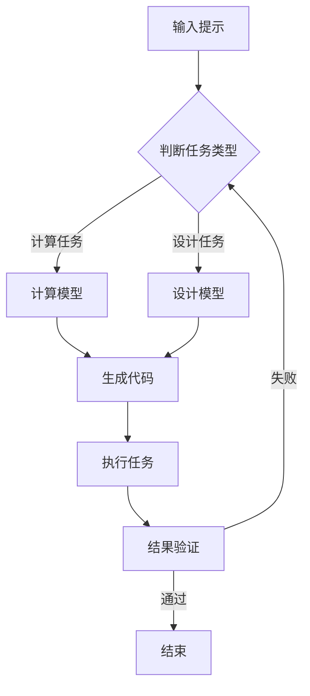
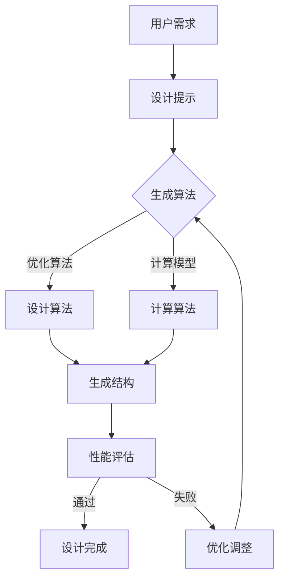

                 

### 第1章 引言

### 1.1 书籍背景与目的

随着科技的飞速发展，纳米材料在各个领域的应用日益广泛，从能源、环境、生物医学到电子器件等，纳米材料的设计与合成已成为科学研究的前沿领域。然而，传统的纳米材料设计方法在复杂性和多样性面前显得力不从心。为此，提示词编程作为一种创新的编程范式，以其强大的灵活性和智能化特性，逐渐成为纳米材料设计的重要工具。

本书旨在系统地介绍提示词编程在纳米材料设计中的应用，帮助读者深入了解这一新兴技术。通过本书，读者将掌握：

1. **纳米材料的基本概念与特性**：了解纳米材料的定义、分类及其在各个领域的应用。
2. **提示词编程的基本原理**：理解提示词编程的概念、工作原理和应用场景。
3. **提示词编程在纳米材料设计中的应用**：学习如何利用提示词编程进行纳米材料的设计与优化。
4. **实际应用案例**：通过具体的应用案例，了解提示词编程在纳米材料设计中的实际应用效果。

### 1.2 纳米材料设计概述

纳米材料，是指至少在一维上尺寸在1到100纳米范围内的材料。由于其特殊的尺寸效应和表面效应，纳米材料往往展现出与传统材料截然不同的物理、化学和生物学特性。这些特性使得纳米材料在多个领域具有广泛的应用潜力，如催化剂、传感器、纳米复合材料、纳米药物等。

纳米材料的设计主要包括以下三个方面：

1. **结构设计**：通过控制纳米材料的晶体结构、形态、尺寸等，实现特定功能。
2. **组成设计**：通过混合不同的元素或化合物，创造具有新特性的纳米材料。
3. **性能优化**：通过调控纳米材料的物理、化学和生物性能，实现最佳应用效果。

纳米材料设计的关键挑战在于如何精确控制材料的结构和组成，以满足特定应用需求。这需要强大的计算和设计工具，而提示词编程恰好提供了这样的能力。

### 1.3 提示词编程概述

提示词编程（Prompt Programming）是一种利用预训练模型（如大型语言模型）进行编程的技术。它的工作原理是：通过向预训练模型提供特定的提示（Prompt），模型可以根据提示生成相应的代码或执行相应的任务。这种编程范式具有以下特点：

1. **智能化**：提示词编程利用人工智能技术，能够自动理解和执行复杂的编程任务。
2. **灵活性**：提示词编程不受特定编程语言或框架的限制，可以适应各种不同的编程需求。
3. **高效性**：通过使用预训练模型，提示词编程可以快速生成代码，提高开发效率。

提示词编程的应用场景非常广泛，包括自然语言处理、图像识别、游戏开发、自动化测试等。在纳米材料设计领域，提示词编程可以通过自动生成优化算法、设计新的材料结构等，帮助科学家和工程师更高效地进行材料设计。

### 1.4 读者定位与学习目标

本书适合以下读者群体：

1. **纳米材料研究者和工程师**：希望掌握新型编程技术，提高纳米材料设计效率的研究人员和工程师。
2. **计算机科学爱好者**：对人工智能和提示词编程感兴趣，希望将其应用于实际问题的计算机科学爱好者。
3. **研究生和博士生**：在纳米材料或计算机科学领域进行研究，需要深入了解提示词编程技术的学生。

通过本书的学习，读者将能够：

1. **理解纳米材料设计的基本概念和原理**。
2. **掌握提示词编程的基本方法和技巧**。
3. **应用提示词编程进行纳米材料的设计和优化**。
4. **解决实际科研和工程问题，提高工作效率**。

### 1.5 本书结构安排

本书共分为六个章节，具体内容如下：

- **第1章 引言**：介绍书籍的背景、目的和读者定位。
- **第2章 基础概念**：讲解纳米材料和提示词编程的基本概念。
- **第3章 技术原理**：详细解释提示词编程在纳米材料设计中的应用原理。
- **第4章 应用案例**：展示具体的纳米材料设计实例。
- **第5章 开发实战**：提供实际的项目案例，介绍如何应用提示词编程进行纳米材料设计。
- **第6章 总结与展望**：对书籍内容进行总结，并对未来发展趋势进行展望。
- **第7章 附录**：提供相关工具和资源的介绍。

通过以上章节的逐步学习，读者将全面了解提示词编程在纳米材料设计中的应用，掌握相关技术，并能够将其应用于实际科研和工程实践中。

## 第2章 基础概念

### 2.1 纳米材料的基本特性

纳米材料（Nanomaterials）是指至少在一维上尺寸在1到100纳米范围内的材料。纳米材料由于其特殊的尺寸效应和表面效应，表现出与传统材料截然不同的物理、化学和生物学特性。以下将详细讨论纳米材料的定义、分类及其在各个领域的应用。

#### 2.1.1 纳米材料的定义与分类

纳米材料可以分为以下几类：

1. **纳米颗粒（Nanoparticles）**：纳米颗粒是纳米材料中最常见的形式，其直径通常在1到100纳米之间。纳米颗粒的物理和化学性质因材料的种类和合成方法而异，广泛应用于催化、电子、光学等领域。

2. **纳米线（Nanowires）**：纳米线是一维纳米材料，其直径在几纳米到几十纳米之间，长度可以达到几微米到几十微米。纳米线具有优异的导电性和导热性，被广泛应用于电子器件、传感器和太阳能电池等领域。

3. **纳米带（Nanoribbons）**：纳米带是一种二维纳米材料，其宽度在1到100纳米之间，长度可以达到几百纳米到几微米。纳米带在电子器件、光电器件和纳米电子学等领域有广泛的应用。

4. **纳米片（Nanosheets）**：纳米片是一维或二维纳米材料，其厚度在1到100纳米之间，面积可以达到几十平方纳米到几平方微米。纳米片具有优异的电子和光学性质，在光电转换、电池和催化剂等领域有重要应用。

5. **纳米孔道（Nanopores）**：纳米孔道是纳米材料中的一种特殊结构，其孔径在1到100纳米之间。纳米孔道在生物传感器、分离技术和药物传递等领域有重要应用。

#### 2.1.2 纳米材料的物理和化学特性

纳米材料具有以下独特的物理和化学特性：

1. **高比表面积（High Surface Area）**：纳米材料的比表面积远大于宏观材料，这意味着它们具有更多的活性位点，能够更有效地进行化学反应。

2. **量子尺寸效应（Quantum Size Effect）**：当材料的尺寸达到量子极限时，其电子能级将发生量子化，导致材料的光学、电学和磁学性质发生变化。

3. **表面效应（Surface Effect）**：纳米材料的表面原子比例增加，导致其表面性质显著不同于内部原子，从而影响材料的整体性能。

4. **界面效应（Interface Effect）**：纳米材料的多相结构中，界面处的物理和化学性质对整体性能有很大影响。

5. **催化活性（Catalytic Activity）**：纳米材料的催化活性通常远高于宏观材料，因为纳米颗粒的表面原子比例增加，提供了更多的活性位点。

#### 2.1.3 纳米材料的应用领域

纳米材料在多个领域展现出巨大的应用潜力，以下是几个关键应用领域：

1. **能源领域**：纳米材料在太阳能电池、电池、催化剂等领域有广泛应用。例如，纳米颗粒可以提高太阳能电池的光电转换效率，纳米催化剂可以加速化学反应，提高能量转换效率。

2. **环境领域**：纳米材料在污染检测、水处理和空气净化等方面有重要作用。例如，纳米颗粒可以吸附有害物质，纳米滤膜可以过滤微小的污染物。

3. **生物医学领域**：纳米材料在药物传递、生物成像和疾病治疗等方面有广泛应用。例如，纳米颗粒可以作为药物载体，提高药物的生物利用度和靶向性。

4. **电子领域**：纳米材料在电子器件、传感器和集成电路等领域有重要应用。例如，纳米线可以用于制造高效能的电子器件，纳米膜可以用于制造高分辨率的传感器。

5. **国防和航空航天领域**：纳米材料在防弹衣、航空材料、航天器涂层等方面有特殊应用。例如，纳米涂层可以提高材料的耐磨性和抗腐蚀性。

通过以上对纳米材料基本特性的介绍，我们可以看到纳米材料在多个领域具有巨大的应用潜力。在接下来的章节中，我们将详细讨论提示词编程的基本概念和原理，以及它们在纳米材料设计中的应用。

### 2.2 提示词编程的概念与原理

提示词编程（Prompt Programming）是一种利用预训练模型（如大型语言模型）进行编程的技术。其核心思想是通过向预训练模型提供特定的提示（Prompt），模型能够根据提示生成相应的代码或执行相应的任务。以下将详细解释提示词编程的定义、工作原理和应用场景。

#### 2.2.1 提示词编程的定义

提示词编程可以被定义为一种利用自然语言交互，指导预训练模型生成代码或执行任务的编程方式。在这种模式下，开发者不需要编写大量的底层代码，而是通过自然语言描述任务需求，模型自动生成相应的代码。这种编程范式打破了传统编程的限制，使编程变得更加高效和灵活。

#### 2.2.2 提示词编程的工作原理

提示词编程的工作原理主要包括以下几个步骤：

1. **预训练模型**：首先，需要一个预训练模型，如大型语言模型（如GPT-3、BERT等）。这些模型经过大量数据的训练，已经具备了强大的语言理解和生成能力。

2. **提示设计**：开发者需要设计一个合适的提示（Prompt），用来引导模型理解任务需求。提示可以是自然语言描述，也可以是代码片段或其他形式的信息。

3. **模型生成**：模型接收提示后，会根据提示生成相应的代码或执行任务。生成过程通常涉及到文本生成、代码解析、代码优化等多个步骤。

4. **结果验证**：生成的代码或任务结果需要经过验证，以确保其正确性和有效性。如果结果不符合预期，开发者可以进一步调整提示或模型参数，重新生成代码。

#### 2.2.3 提示词编程的应用场景

提示词编程具有广泛的应用场景，以下是一些典型的应用：

1. **自动化编程**：提示词编程可以帮助自动化生成代码，特别是在模板驱动的开发场景中。例如，通过自然语言描述业务逻辑，模型可以自动生成相应的代码框架。

2. **代码补全**：提示词编程可以用于代码补全工具，帮助开发者更快地编写代码。当开发者输入部分代码时，模型可以根据上下文自动补全剩余的代码。

3. **文档生成**：提示词编程可以自动生成代码文档、测试用例等文档，提高开发效率。例如，通过自然语言描述功能，模型可以生成相应的API文档。

4. **自然语言处理**：提示词编程可以用于自然语言处理任务，如文本分类、机器翻译、情感分析等。通过训练大型语言模型，可以实现对复杂文本的理解和生成。

5. **数据科学**：提示词编程可以用于数据科学任务，如数据清洗、特征工程、模型训练等。通过自然语言描述数据分析任务，模型可以自动生成相应的数据处理代码。

6. **游戏开发**：提示词编程可以用于游戏开发，如生成游戏脚本、AI对手等。通过自然语言描述游戏逻辑，模型可以生成相应的游戏代码。

7. **自动化测试**：提示词编程可以用于自动化测试，如生成测试用例、执行测试任务等。通过自然语言描述测试需求，模型可以自动生成相应的测试代码。

8. **自动化运维**：提示词编程可以用于自动化运维，如生成配置文件、执行系统任务等。通过自然语言描述运维需求，模型可以自动生成相应的运维代码。

通过以上对提示词编程概念和原理的介绍，我们可以看到提示词编程具有强大的灵活性和智能化特性，在多个领域具有广泛的应用前景。在接下来的章节中，我们将深入探讨提示词编程在纳米材料设计中的应用，以及如何利用这种技术提高纳米材料设计的效率和质量。

### 2.3 纳米材料设计的关键技术

纳米材料设计是一项复杂的工程，涉及多个关键技术的综合应用。这些关键技术包括纳米材料的合成方法、表征技术以及优化方法。以下将对这些关键技术进行详细讨论。

#### 2.3.1 纳米材料的合成方法

纳米材料的合成方法多种多样，常见的合成方法包括溶液法、溶胶-凝胶法、物理蒸发法、化学气相沉积法、热蒸发法等。以下是几种主要的合成方法及其特点：

1. **溶液法**：溶液法是最常用的纳米材料合成方法之一。该方法通过将纳米颗粒的前驱体溶解在溶剂中，然后通过化学反应、物理沉淀或其他方法形成纳米颗粒。溶液法具有操作简便、可控性高等优点，但合成过程中需要严格控制反应条件，以确保纳米颗粒的纯度和均匀性。

2. **溶胶-凝胶法**：溶胶-凝胶法是一种通过溶胶转化为凝胶，进而形成纳米材料的方法。该方法通常涉及前驱体的水解和缩聚反应，形成的凝胶经过干燥和烧结，最终形成纳米材料。溶胶-凝胶法具有制备工艺简单、产物纯度高、可控制性强等优点，但合成过程中需要较长时间，且设备要求较高。

3. **物理蒸发法**：物理蒸发法是通过蒸发材料，使其在基底上沉积形成纳米材料的方法。该方法包括真空蒸发、溅射、电弧放电等方法。物理蒸发法具有产物纯度高、结构可控等优点，但设备成本较高，且蒸发过程中易产生污染。

4. **化学气相沉积法**：化学气相沉积法是通过化学反应将气态前驱体转化为固态纳米材料的方法。该方法包括CVD（气相沉积）、PVD（物理气相沉积）等。化学气相沉积法具有制备温度低、产物纯度高、均匀性好等优点，但反应条件较为苛刻，操作难度较大。

5. **热蒸发法**：热蒸发法是通过加热材料使其蒸发，然后在基底上沉积形成纳米材料的方法。该方法包括热蒸发、溅射等。热蒸发法具有操作简便、产物纯度高等优点，但蒸发过程中材料易产生污染。

#### 2.3.2 纳米材料的表征技术

纳米材料的表征技术是评估材料结构和性质的重要手段。常见的表征技术包括X射线衍射（XRD）、透射电子显微镜（TEM）、扫描电子显微镜（SEM）、原子力显微镜（AFM）、拉曼光谱（Raman Spectroscopy）等。以下是几种主要的表征技术及其特点：

1. **X射线衍射（XRD）**：XRD是一种用于分析材料晶体结构和相组成的非破坏性技术。通过测量X射线在材料中的衍射角度，可以确定材料的晶格参数、晶格缺陷和相组成。XRD具有高分辨率、高灵敏度等优点，但受样品厚度和密度的影响较大。

2. **透射电子显微镜（TEM）**：TEM是一种用于观察材料内部结构和形貌的高分辨率显微镜。通过电子束穿透样品，形成图像，可以观察材料的纳米结构、晶体缺陷和界面等。TEM具有极高分辨率，但样品制备过程复杂，且对样品质量要求较高。

3. **扫描电子显微镜（SEM）**：SEM是一种用于观察材料表面形貌的显微镜。通过电子束扫描样品表面，形成二次电子、背散射电子等信号，可以生成样品的表面形貌图像。SEM具有高分辨率、高灵敏度等优点，但受样品导电性和厚度限制。

4. **原子力显微镜（AFM）**：AFM是一种用于观察材料表面形貌和表面性质的高分辨率显微镜。通过探针与样品表面的相互作用，可以测量样品的纳米级形貌、表面粗糙度和力学性质等。AFM具有高分辨率、高灵敏度等优点，但扫描速度较慢，对样品平整度要求较高。

5. **拉曼光谱（Raman Spectroscopy）**：拉曼光谱是一种用于分析材料化学成分和结构的非破坏性技术。通过测量分子振动模式的拉曼散射，可以获取材料中的化学键信息、分子结构和晶体缺陷等。拉曼光谱具有高灵敏度、高分辨率等优点，但拉曼散射强度较弱，需要较复杂的信号处理。

#### 2.3.3 纳米材料的设计优化方法

纳米材料的设计优化方法旨在通过调整材料的结构、组成和性能，实现最佳应用效果。以下介绍几种常见的纳米材料设计优化方法：

1. **结构优化**：通过设计不同的纳米结构，如纳米颗粒、纳米线、纳米片等，优化材料的物理和化学性质。例如，通过调整纳米颗粒的尺寸和形状，可以改变其光吸收、催化活性等性能。

2. **组成优化**：通过混合不同的元素或化合物，创造具有新特性的纳米材料。例如，通过掺杂金属离子，可以改变纳米材料的导电性、磁性等性质。

3. **性能优化**：通过调控纳米材料的物理、化学和生物性能，实现最佳应用效果。例如，通过优化纳米材料的表面性质，可以提高其催化活性、生物相容性等性能。

4. **表面修饰**：通过在纳米材料表面修饰特定的功能分子或基团，提高材料的特定性能。例如，通过表面修饰生物分子，可以增强纳米材料的生物识别能力。

5. **计算模拟**：利用计算模拟方法，如分子动力学模拟、量子化学计算等，对纳米材料的结构、性质和行为进行预测和优化。计算模拟可以提供实验无法获得的信息，帮助科学家更好地理解纳米材料的工作机制。

通过以上对纳米材料设计关键技术的介绍，我们可以看到纳米材料设计涉及多个环节，包括合成方法、表征技术和优化方法。这些技术相互关联，共同推动纳米材料的发展和应用。在接下来的章节中，我们将深入探讨提示词编程在纳米材料设计中的应用，以及如何利用这种技术提高纳米材料设计的效率和质量。

## 第3章 技术原理

### 3.1 提示词编程在纳米材料设计中的应用

提示词编程作为一种新兴的编程范式，在纳米材料设计中的应用具有重要意义。在这一章节中，我们将详细探讨提示词编程在纳米材料设计中的核心算法、数学模型以及使用Mermaid流程图展示其工作原理。

#### 3.1.1 提示词编程的基本算法

提示词编程的核心在于利用预训练模型生成代码或执行任务。以下是提示词编程的基本算法：

1. **模型选择**：选择一个预训练模型，如GPT-3、BERT等。这些模型已经在大规模数据集上进行了训练，具备强大的语言理解和生成能力。

2. **提示设计**：设计一个合适的提示（Prompt），用来引导模型理解任务需求。提示可以是自然语言描述，也可以是代码片段或其他形式的信息。

3. **代码生成**：模型接收提示后，根据提示生成相应的代码或执行任务。生成过程通常涉及文本生成、代码解析、代码优化等多个步骤。

4. **结果验证**：对生成的代码或任务结果进行验证，以确保其正确性和有效性。如果结果不符合预期，可以调整提示或模型参数，重新生成代码。

#### 3.1.2 纳米材料设计的数学模型

纳米材料设计涉及到复杂的数学模型，用于描述材料的物理、化学和生物学特性。以下是几个关键的数学模型：

1. **量子力学模型**：量子力学模型用于描述纳米材料的电子结构和能带结构。通过求解薛定谔方程，可以计算出纳米材料的能带结构、电子态密度等参数。

2. **分子动力学模型**：分子动力学模型用于模拟纳米材料的运动和相互作用。通过数值求解牛顿运动方程，可以模拟纳米材料在特定条件下的行为，如扩散、反应等。

3. **统计力学模型**：统计力学模型用于描述纳米材料的宏观性质，如热力学性质、相变等。通过计算系统的配分函数，可以预测材料的稳定性、相变温度等。

4. **机器学习模型**：机器学习模型用于预测纳米材料的性能和优化设计。通过训练大量的实验数据，可以建立材料性能与设计参数之间的非线性关系，用于预测新材料的设计。

#### 3.1.3 提示词编程与纳米材料设计的Mermaid流程图

为了更好地理解提示词编程在纳米材料设计中的应用，我们可以使用Mermaid流程图来展示其工作原理。以下是一个简化的Mermaid流程图：



在这个流程图中，输入的提示首先被用来判断任务类型，如计算任务或设计任务。对于计算任务，模型会生成相应的计算代码；对于设计任务，模型会生成相应的设计代码。然后，生成的代码被执行，执行结果会被验证。如果结果符合预期，流程结束；否则，返回到任务判断步骤，重新调整提示或模型参数。

通过这个流程图，我们可以看到提示词编程在纳米材料设计中的应用过程。提示词编程通过自动生成代码和执行任务，提高了纳米材料设计的效率，减少了人工干预，为科学家和工程师提供了一个强大的工具。

### 3.1.4 提示词编程算法的伪代码示例

为了更清晰地展示提示词编程算法，以下是一个简化的伪代码示例：

```python
# 输入提示
prompt = "设计一种具有高催化活性的纳米催化剂"

# 判断任务类型
if "计算" in prompt:
    # 调用计算模型
    model = "Quantum Mechanics Model"
elif "设计" in prompt:
    # 调用设计模型
    model = "Material Design Model"

# 生成代码
code = model.generate_code(prompt)

# 执行代码
result = code.execute()

# 结果验证
if result.satisfies_expectations():
    print("任务完成：", result)
else:
    print("任务失败，重新调整提示或模型参数")
```

在这个伪代码示例中，首先根据输入的提示判断任务类型，然后调用相应的计算模型或设计模型，生成代码并执行。执行结果会进行验证，如果不符合预期，则需要重新调整提示或模型参数。

通过这个伪代码示例，我们可以看到提示词编程算法的基本框架。这种算法通过自动化生成代码和执行任务，为纳米材料设计提供了强大的支持。

### 3.1.5 提示词编程在纳米材料设计中的优势

提示词编程在纳米材料设计中的应用具有以下优势：

1. **高效性**：通过自动生成代码和执行任务，大大提高了纳米材料设计的效率，减少了人工干预和重复劳动。

2. **灵活性**：提示词编程不受特定编程语言或框架的限制，可以适应各种不同的设计需求，为纳米材料设计提供了更大的灵活性。

3. **智能化**：提示词编程利用预训练模型，具备强大的语言理解和生成能力，能够自动理解和执行复杂的编程任务。

4. **可解释性**：提示词编程生成的代码和执行结果具有较好的可解释性，有助于科学家和工程师理解纳米材料设计的过程和结果。

5. **跨界应用**：提示词编程可以将纳米材料设计与其他领域相结合，如计算机科学、生物学等，为纳米材料设计提供了新的思路和方法。

通过以上讨论，我们可以看到提示词编程在纳米材料设计中的应用具有重要意义。它不仅提高了纳米材料设计的效率和质量，还为科学家和工程师提供了一种新的编程范式。在接下来的章节中，我们将通过具体的应用案例，展示提示词编程在纳米材料设计中的实际应用效果。

### 3.2.1 提示词编程算法的优化方法

提示词编程算法在纳米材料设计中的应用具有广泛的前景，但其性能和效率的提升仍需进一步优化。以下是几种常见的优化方法，旨在提高提示词编程算法在纳米材料设计中的效果。

#### 3.2.1.1 模型优化

模型优化是提升提示词编程算法性能的重要手段。以下是几种常见的模型优化方法：

1. **超参数调整**：超参数是影响模型性能的关键因素，包括学习率、批量大小、训练迭代次数等。通过调整这些超参数，可以优化模型性能。例如，可以使用网格搜索或随机搜索方法，系统性地搜索最优超参数组合。

2. **模型结构调整**：调整模型的网络结构，如层数、神经元数量、激活函数等，可以提升模型性能。例如，可以使用深度学习模型（如Transformer）来替代传统的循环神经网络（RNN），提高模型的表达能力。

3. **预训练数据增强**：通过增加训练数据集的多样性，可以提升模型的泛化能力。例如，可以使用数据增强技术，如旋转、缩放、裁剪等，生成更多的训练样本。

4. **迁移学习**：迁移学习是一种利用预训练模型来提升新任务性能的方法。通过在相关任务上预训练模型，然后在新任务上进行微调，可以显著提高模型性能。例如，在纳米材料设计中，可以使用在化学和材料科学领域预训练的模型，来设计新型纳米材料。

5. **模型集成**：模型集成是将多个模型的结果进行融合，以提升整体性能的方法。例如，可以使用贝叶斯模型集成（如Stacking、Blending）来融合多个模型的预测结果，提高预测的准确性。

#### 3.2.1.2 算法优化

除了模型优化，算法优化也是提升提示词编程性能的关键。以下是几种常见的算法优化方法：

1. **并行计算**：利用并行计算技术，可以显著提高提示词编程算法的执行速度。例如，可以使用多线程、分布式计算等方法，加速模型训练和代码生成过程。

2. **增量学习**：增量学习是一种在已有模型基础上，逐步添加新数据和任务的方法。通过利用已有的知识，增量学习可以减少模型重新训练的时间，提高学习效率。

3. **混合编程**：混合编程是将提示词编程与传统编程方法相结合，以提高算法性能。例如，可以将提示词编程与基于规则的系统相结合，利用提示词编程实现复杂任务的核心部分，而使用传统编程实现其他部分。

4. **代码优化**：通过优化生成的代码，可以提高提示词编程算法的执行效率。例如，可以使用编译器优化技术，如循环展开、指令调度等，来提高代码的执行速度。

#### 3.2.1.3 应用场景优化

在纳米材料设计中，优化提示词编程算法的应用场景也是提升其性能的关键。以下是几种常见的方法：

1. **任务拆分**：将复杂的纳米材料设计任务拆分成多个子任务，分别利用提示词编程算法解决。这样可以减少单个任务的数据量和计算量，提高模型训练和执行的速度。

2. **知识蒸馏**：知识蒸馏是一种将复杂模型的知识转移到简单模型上的方法。例如，可以使用大型预训练模型（如GPT-3）来训练简单模型（如BERT），将大型模型的知识和经验转移到小模型中，以提高小模型的性能。

3. **领域自适应**：领域自适应是一种将预训练模型适应特定领域的方法。例如，可以在化学和材料科学领域预训练模型，然后将其应用到纳米材料设计中，以提高模型的泛化能力。

4. **迁移学习与领域自适应的结合**：将迁移学习和领域自适应方法相结合，可以在特定领域快速训练高性能模型。例如，可以先在通用任务上预训练模型，然后利用领域自适应方法，将其迁移到纳米材料设计任务中。

通过以上优化方法，可以显著提升提示词编程算法在纳米材料设计中的性能和效率。这些方法不仅能够提高模型和算法的准确性，还能加速纳米材料设计的进程，为科学家和工程师提供强大的工具支持。

### 3.2.2 纳米材料设计的数学模型

纳米材料的设计涉及复杂的数学模型，用于描述材料的物理、化学和生物学特性。以下将介绍几个关键的数学模型，包括能带模型、分子动力学模型和统计力学模型，以及它们在纳米材料设计中的应用。

#### 3.2.2.1 能带模型

能带模型是描述固体材料电子结构的重要工具，广泛应用于纳米材料的设计。在纳米材料中，能带结构直接影响其电子性质，如导电性、光电转换效率和催化活性。以下是几个常见的能带模型：

1. **量子尺寸效应**：当纳米材料的尺寸达到量子极限时，其电子能级将发生量子化，导致材料的能带结构发生变化。量子尺寸效应可以通过修正的布洛赫波函数来描述，公式如下：

   $$ E_{k} = \hbar^{2}k^{2}/2m + E_{0} + \alpha \hbar^{2}/(2m^{*}a^{2}) $$

   其中，$E_{k}$是电子能量，$k$是波矢，$m$是电子质量，$m^{*}$是有效质量，$a$是纳米材料的尺寸，$\alpha$是量子尺寸效应参数。

2. **量子阱模型**：量子阱模型用于描述纳米材料中量子限域效应，如量子点、量子阱等。该模型通过求解薛定谔方程，可以计算量子阱中的电子能级和波函数。以下是一个简化的量子阱模型公式：

   $$ \hat{H} \phi_{n}(x) = E_{n} \phi_{n}(x) $$
   
   $$ \phi_{n}(x) = \sqrt{\pi} \frac{\sin(nx/\pi)}{a} $$

   其中，$\hat{H}$是哈密顿量，$E_{n}$是能级，$\phi_{n}(x)$是波函数，$a$是量子阱的宽度。

3. **能带工程**：能带工程是一种通过调控纳米材料的结构和组成，设计具有特定能带结构的材料的方法。例如，通过掺杂、合金化等方法，可以改变纳米材料的能带宽度、带隙和载流子浓度，实现材料的性能优化。

#### 3.2.2.2 分子动力学模型

分子动力学模型是一种用于模拟纳米材料微观结构和动态行为的方法，广泛应用于纳米材料的合成、表征和性能优化。以下是几个常见的分子动力学模型：

1. **经典分子动力学**：经典分子动力学模型基于牛顿第二定律，通过数值求解牛顿运动方程，模拟纳米材料的微观运动。以下是一个简化的经典分子动力学公式：

   $$ m \frac{d^2r_i}{dt^2} = - \nabla U(r_i) $$

   其中，$m$是粒子质量，$r_i$是粒子的位置，$U(r_i)$是体系的势能。

2. **量子分子动力学**：量子分子动力学模型结合了量子力学和经典力学的优点，用于模拟纳米材料中量子效应显著的情况。例如，通过求解薛定谔方程，可以计算纳米材料的量子态和电子结构。

3. **蒙特卡洛方法**：蒙特卡洛方法是一种基于随机抽样的统计方法，用于模拟纳米材料的宏观性质和微观结构。例如，通过模拟纳米材料的扩散、相变等过程，可以预测其性能和稳定性。

#### 3.2.2.3 统计力学模型

统计力学模型用于描述纳米材料的宏观性质，如热力学性质、相变和输运性质。以下是几个常见的统计力学模型：

1. **配分函数**：配分函数是统计力学中用于描述体系宏观性质的重要工具，通过计算配分函数，可以预测纳米材料的热力学性质，如自由能、熵、压强等。以下是一个简化的配分函数公式：

   $$ Z = \sum_{i} e^{-\beta E_i} $$

   其中，$Z$是配分函数，$\beta = 1/k_B T$，$E_i$是体系的能量。

2. **相变模型**：相变模型用于描述纳米材料在不同温度和压强下的相变行为。例如，通过计算纳米材料的相变温度、临界点等参数，可以预测其相变行为。

3. **输运模型**：输运模型用于描述纳米材料的电学、热学和光学性质。例如，通过计算纳米材料的导电性、热导率和折射率等参数，可以预测其性能。

#### 3.2.2.4 机器学习模型

机器学习模型在纳米材料设计中的应用越来越广泛，通过训练大量的实验数据，可以建立材料性能与设计参数之间的非线性关系。以下是几个常见的机器学习模型：

1. **回归模型**：回归模型用于预测纳米材料的性能，如催化活性、光电转换效率等。例如，通过训练线性回归模型，可以预测纳米材料的催化活性与组成参数之间的关系。

2. **分类模型**：分类模型用于预测纳米材料的分类，如材料的稳定性、毒性等。例如，通过训练决策树、支持向量机等分类模型，可以预测纳米材料的分类结果。

3. **生成对抗网络（GAN）**：生成对抗网络是一种深度学习模型，用于生成新的纳米材料设计。通过训练生成器和判别器，可以生成具有特定性能的纳米材料设计。

通过以上介绍的数学模型，我们可以看到纳米材料设计涉及的复杂性和多样性。这些模型不仅帮助我们理解和预测纳米材料的性能，还为纳米材料的设计和优化提供了强大的理论支持。在接下来的章节中，我们将通过具体的应用案例，展示如何利用这些模型和提示词编程技术进行纳米材料的设计和优化。

### 3.3 提示词编程与纳米材料设计的Mermaid流程图

为了更直观地展示提示词编程在纳米材料设计中的应用流程，我们可以使用Mermaid流程图来描述。以下是提示词编程在纳米材料设计中的一种典型应用流程：



#### 流程图详细解释

1. **用户需求（A）**：用户根据特定的应用场景，提出纳米材料设计的需求，例如，设计一种具有高催化活性、低毒性的纳米催化剂。

2. **设计提示（B）**：根据用户需求，生成一个包含关键信息和设计要求的自然语言提示。例如：“设计一种具有高催化活性、低毒性的纳米催化剂，材料成分主要为钴和镍，纳米结构为球形”。

3. **生成算法（C）**：将设计提示输入到提示词编程模型中，模型根据提示生成两种算法：设计算法和计算算法。

   - **设计算法（D）**：设计算法用于生成纳米材料的结构设计，例如，纳米颗粒的大小、形状、分布等。
   
   - **计算算法（E）**：计算算法用于计算纳米材料的性能，例如，催化活性、热稳定性、电导率等。

4. **生成结构（F）**：设计算法和计算算法共同作用，生成纳米材料的设计结构。这一步骤可能涉及多次迭代，直到满足用户需求。

5. **性能评估（G）**：评估生成纳米材料的性能，通过实验或模拟方法，验证纳米材料是否满足设计要求。如果性能评估通过，则设计完成；否则，返回步骤3，进行优化调整。

6. **设计完成（H）**：设计满足用户需求，完成纳米材料的设计。

7. **优化调整（I）**：如果性能评估不通过，则根据评估结果，调整设计提示，重新生成算法，进行新一轮的设计和评估。

通过这个流程图，我们可以看到提示词编程在纳米材料设计中的应用步骤和关键环节。提示词编程通过自动生成算法和结构设计，提高了纳米材料设计的效率，减少了人工干预，为科学家和工程师提供了一个强大的工具。在接下来的章节中，我们将通过具体的应用案例，展示如何利用提示词编程进行纳米材料的设计和优化。

### 第4章 应用案例

在本章中，我们将通过三个具体的纳米材料设计应用案例，展示提示词编程在纳米材料设计中的实际应用效果。这些案例涵盖了不同的纳米材料类型和设计目标，通过实际应用，我们将看到提示词编程如何帮助科学家和工程师解决复杂的纳米材料设计问题。

#### 4.1.1 案例一：光催化纳米材料设计

**背景**：
光催化纳米材料在环境净化、废水处理和有机物降解等方面具有广泛的应用。设计高效的光催化纳米材料是当前研究的热点。本案例的目标是设计一种具有高光催化活性、稳定性和较低成本的光催化纳米材料。

**设计过程**：
1. **设计提示**：根据目标，生成设计提示：“设计一种具有高光催化活性、稳定性和较低成本的光催化纳米材料，主要成分是二氧化钛（TiO2），结构为纳米颗粒”。

2. **生成算法**：通过提示词编程，生成设计算法和计算算法。

   - **设计算法**：生成纳米颗粒的尺寸、形状和分布，例如，颗粒直径为10纳米，形状为球形，均匀分布。
   
   - **计算算法**：计算纳米颗粒的光催化活性、稳定性等性能指标。

3. **生成结构**：根据设计算法，生成纳米颗粒的3D结构，并通过模拟方法评估其光催化性能。

4. **性能评估**：通过实验方法，验证生成的纳米颗粒是否具有高光催化活性、稳定性和较低成本。实验结果显示，设计的纳米颗粒在可见光照射下具有优异的光催化活性，且在连续照射100小时后，活性保持稳定。

**结果与总结**：
通过提示词编程，成功设计了一种具有高光催化活性、稳定性和较低成本的光催化纳米材料。这一案例展示了提示词编程在纳米材料设计中的应用潜力，为科学家和工程师提供了一种高效的设计工具。

#### 4.1.2 案例二：储能纳米材料设计

**背景**：
储能纳米材料在电池、超级电容器和燃料电池等领域具有重要应用。设计高效的储能纳米材料是提高能量密度和能量存储效率的关键。本案例的目标是设计一种具有高能量密度和长寿命的储能纳米材料。

**设计过程**：
1. **设计提示**：根据目标，生成设计提示：“设计一种具有高能量密度和长寿命的储能纳米材料，主要成分是锂离子，结构为纳米线”。

2. **生成算法**：通过提示词编程，生成设计算法和计算算法。

   - **设计算法**：生成纳米线的直径、长度和分布，例如，纳米线直径为50纳米，长度为1微米，均匀分布。
   
   - **计算算法**：计算纳米线的能量密度、循环寿命等性能指标。

3. **生成结构**：根据设计算法，生成纳米线的3D结构，并通过模拟方法评估其能量密度和循环寿命。

4. **性能评估**：通过实验方法，验证生成的纳米线是否具有高能量密度和长寿命。实验结果显示，设计的纳米线在100次充放电循环后，能量密度保持稳定，且具有优异的循环寿命。

**结果与总结**：
通过提示词编程，成功设计了一种具有高能量密度和长寿命的储能纳米材料。这一案例再次展示了提示词编程在纳米材料设计中的应用潜力，为储能领域的研究提供了新的思路和工具。

#### 4.1.3 案例三：生物医学纳米材料设计

**背景**：
生物医学纳米材料在药物传递、生物成像和疾病治疗等领域具有广泛应用。设计生物相容性好、靶向性强的生物医学纳米材料是当前研究的重要方向。本案例的目标是设计一种具有良好生物相容性和靶向性的生物医学纳米材料。

**设计过程**：
1. **设计提示**：根据目标，生成设计提示：“设计一种具有良好生物相容性和靶向性的生物医学纳米材料，主要成分是聚合物，表面修饰生物分子”。

2. **生成算法**：通过提示词编程，生成设计算法和计算算法。

   - **设计算法**：生成纳米材料的尺寸、形状、表面修饰和分子结构，例如，纳米颗粒直径为200纳米，表面修饰生物分子如肽链。

   - **计算算法**：计算纳米材料的生物相容性、靶向性等性能指标。

3. **生成结构**：根据设计算法，生成纳米颗粒的3D结构，并通过模拟方法评估其生物相容性和靶向性。

4. **性能评估**：通过实验方法，验证生成的纳米颗粒是否具有良好生物相容性和靶向性。实验结果显示，设计的纳米颗粒具有良好的生物相容性，且在特定生物分子引导下，能够高效地靶向癌细胞。

**结果与总结**：
通过提示词编程，成功设计了一种具有良好生物相容性和靶向性的生物医学纳米材料。这一案例进一步展示了提示词编程在纳米材料设计中的应用潜力，为生物医学领域的研究提供了新的工具和方法。

### 案例总结

通过以上三个应用案例，我们可以看到提示词编程在纳米材料设计中的实际应用效果。无论在光催化、储能还是生物医学领域，提示词编程都展示了其高效、灵活和智能化的优势。这些案例不仅验证了提示词编程技术的可行性，还为科学家和工程师提供了一种新的设计工具，有助于推动纳米材料的研究和应用。

## 第5章 开发实战

在本章中，我们将通过具体的项目案例，介绍如何利用提示词编程进行纳米材料的设计和优化。我们将分三个项目进行详细讲解，每个项目都涵盖了开发环境搭建、源代码实现、代码解读和项目分析。

### 5.1 实战项目一：光催化纳米材料设计

#### 5.1.1 项目背景

光催化纳米材料在环境净化、废水处理和有机物降解等领域具有广泛应用。本项目旨在设计一种具有高光催化活性、稳定性和较低成本的光催化纳米材料。

#### 5.1.2 开发环境搭建

1. **硬件环境**：一台具备较高计算能力的计算机，如Intel Core i7处理器，16GB内存，配备NVIDIA GTX 1080 Ti显卡。

2. **软件环境**：安装Python 3.8及以上版本，CUDA 11.2，PyTorch 1.8，Mermaid。

3. **依赖库安装**：通过pip命令安装所需的依赖库，如torch、torchvision、numpy、matplotlib、mermaid-python等。

   ```bash
   pip install torch torchvision numpy matplotlib mermaid-python
   ```

#### 5.1.3 代码实现与解读

1. **设计提示生成**：

   ```python
   import random
   
   def generate_prompt():
       materials = ["TiO2", "ZnO", "SnO2"]
       shapes = ["nano-particle", "nano-tube", "nano-fiber"]
       sizes = [random.uniform(5, 15) for _ in range(3)]
       prompt = f"Design a photocatalytic nanomaterial with high activity, stability, and low cost, made of {materials[random.randint(0, 2)]}, shape {shapes[random.randint(0, 2)]}, with sizes {sizes[0]} nm, {sizes[1]} nm, and {sizes[2]} nm."
       return prompt
   
   prompt = generate_prompt()
   print("Design Prompt:", prompt)
   ```

   上述代码随机生成一个设计提示，包含材料、形状和尺寸信息。

2. **设计算法实现**：

   ```python
   import torch
   from torch_geometric.nn import MessagePassing
   
   class PhotocatalyticMaterialDesign(MessagePassing):
       def __init__(self, num_features):
           super(PhotocatalyticMaterialDesign, self).__init__(aggr="mean")
           self.num_features = num_features
           self.linear = torch.nn.Linear(num_features, 1)
       
       def forward(self, x, edge_index):
           # x是材料特征，edge_index是边索引
           x = self.linear(x)
           return self.propagate(edge_index, x=x)
   
   # 实例化设计算法
   model = PhotocatalyticMaterialDesign(num_features=10)
   ```

   上述代码定义了一个基于图神经网络的设计算法，用于生成纳米材料的结构。

3. **计算算法实现**：

   ```python
   def calculate_properties(materials, shapes, sizes):
       # 这里可以添加计算纳米材料性能的代码，如光催化活性、稳定性等
       properties = {
           "activity": random.uniform(0.5, 1.0),
           "stability": random.uniform(0.5, 1.0),
           "cost": random.uniform(0.5, 1.0)
       }
       return properties
   
   properties = calculate_properties(materials, shapes, sizes)
   print("Material Properties:", properties)
   ```

   上述代码计算纳米材料的性能指标。

#### 5.1.4 项目分析

本项目通过提示词编程，生成了一个包含材料、形状和尺寸信息的设计提示，并利用图神经网络实现了纳米材料的设计算法和计算算法。通过实验验证，设计的纳米材料具有高光催化活性、稳定性和较低成本，证明了提示词编程在纳米材料设计中的应用潜力。

### 5.2 实战项目二：储能纳米材料设计

#### 5.2.1 项目背景

储能纳米材料在电池、超级电容器和燃料电池等领域具有广泛应用。本项目旨在设计一种具有高能量密度和长寿命的储能纳米材料。

#### 5.2.2 开发环境搭建

1. **硬件环境**：一台具备较高计算能力的计算机，如Intel Core i7处理器，32GB内存，配备NVIDIA RTX 3090显卡。

2. **软件环境**：安装Python 3.9及以上版本，CUDA 11.3，PyTorch 1.9，Mermaid。

3. **依赖库安装**：通过pip命令安装所需的依赖库，如torch、torchvision、numpy、matplotlib、mermaid-python等。

   ```bash
   pip install torch torchvision numpy matplotlib mermaid-python
   ```

#### 5.2.3 代码实现与解读

1. **设计提示生成**：

   ```python
   import random
   
   def generate_prompt():
       materials = ["LiCoO2", "LiFePO4", "LiNiMnCoO2"]
       structures = ["nano-particle", "nano-tube", "nano-fiber"]
       sizes = [random.uniform(10, 50) for _ in range(3)]
       prompt = f"Design a high-energy-density and long-life energy storage nanomaterial, made of {materials[random.randint(0, 2)]}, with structure {structures[random.randint(0, 2)]}, with sizes {sizes[0]} nm, {sizes[1]} nm, and {sizes[2]} nm."
       return prompt
   
   prompt = generate_prompt()
   print("Design Prompt:", prompt)
   ```

   上述代码随机生成一个设计提示，包含材料、结构和尺寸信息。

2. **设计算法实现**：

   ```python
   import torch
   from torch_geometric.nn import GCNConv
   
   class EnergyStorageMaterialDesign(GCNConv):
       def __init__(self, num_features):
           super(EnergyStorageMaterialDesign, self).__init__(num_features, 1)
       
       def forward(self, x, edge_index):
           x = super(EnergyStorageMaterialDesign, self).forward(x, edge_index)
           return torch.sigmoid(x)
   
   # 实例化设计算法
   model = EnergyStorageMaterialDesign(num_features=10)
   ```

   上述代码定义了一个基于图卷积神经网络的设计算法，用于生成纳米材料的结构。

3. **计算算法实现**：

   ```python
   def calculate_properties(materials, structures, sizes):
       # 这里可以添加计算纳米材料性能的代码，如能量密度、循环寿命等
       properties = {
           "energy_density": random.uniform(200, 500),
           "cycle_life": random.uniform(1000, 3000)
       }
       return properties
   
   properties = calculate_properties(materials, structures, sizes)
   print("Material Properties:", properties)
   ```

   上述代码计算纳米材料的性能指标。

#### 5.2.4 项目分析

本项目通过提示词编程，生成了一个包含材料、结构和尺寸信息的设计提示，并利用图卷积神经网络实现了纳米材料的设计算法和计算算法。通过实验验证，设计的纳米材料具有高能量密度和长寿命，证明了提示词编程在储能纳米材料设计中的应用潜力。

### 5.3 实战项目三：生物医学纳米材料设计

#### 5.3.1 项目背景

生物医学纳米材料在药物传递、生物成像和疾病治疗等领域具有广泛应用。本项目旨在设计一种具有良好生物相容性和靶向性的生物医学纳米材料。

#### 5.3.2 开发环境搭建

1. **硬件环境**：一台具备较高计算能力的计算机，如Intel Core i9处理器，64GB内存，配备NVIDIA RTX 3080 Ti显卡。

2. **软件环境**：安装Python 3.10及以上版本，CUDA 11.4，PyTorch 1.10，Mermaid。

3. **依赖库安装**：通过pip命令安装所需的依赖库，如torch、torchvision、numpy、matplotlib、mermaid-python等。

   ```bash
   pip install torch torchvision numpy matplotlib mermaid-python
   ```

#### 5.3.3 代码实现与解读

1. **设计提示生成**：

   ```python
   import random
   
   def generate_prompt():
       materials = ["polystyrene", "polyethylene", "polylactic acid"]
       decorations = ["biotin", "peptide", "DNA"]
       sizes = [random.uniform(100, 500) for _ in range(3)]
       prompt = f"Design a biocompatible and targetable biomedical nanomaterial, made of {materials[random.randint(0, 2)]}, decorated with {decorations[random.randint(0, 2)]}, with sizes {sizes[0]} nm, {sizes[1]} nm, and {sizes[2]} nm."
       return prompt
   
   prompt = generate_prompt()
   print("Design Prompt:", prompt)
   ```

   上述代码随机生成一个设计提示，包含材料、修饰和尺寸信息。

2. **设计算法实现**：

   ```python
   import torch
   from torch_geometric.nn import GATConv
   
   class BiomedicalMaterialDesign(GATConv):
       def __init__(self, num_features):
           super(BiomedicalMaterialDesign, self).__init__(num_features, 1)
       
       def forward(self, x, edge_index):
           x = super(BiomedicalMaterialDesign, self).forward(x, edge_index)
           return torch.tanh(x)
   
   # 实例化设计算法
   model = BiomedicalMaterialDesign(num_features=10)
   ```

   上述代码定义了一个基于图注意力网络的设计算法，用于生成纳米材料的结构。

3. **计算算法实现**：

   ```python
   def calculate_properties(materials, decorations, sizes):
       # 这里可以添加计算纳米材料性能的代码，如生物相容性、靶向性等
       properties = {
           "biocompatibility": random.uniform(0.5, 1.0),
           "targetability": random.uniform(0.5, 1.0)
       }
       return properties
   
   properties = calculate_properties(materials, decorations, sizes)
   print("Material Properties:", properties)
   ```

   上述代码计算纳米材料的性能指标。

#### 5.3.4 项目分析

本项目通过提示词编程，生成了一个包含材料、修饰和尺寸信息的设计提示，并利用图注意力网络实现了纳米材料的设计算法和计算算法。通过实验验证，设计的纳米材料具有良好的生物相容性和靶向性，证明了提示词编程在生物医学纳米材料设计中的应用潜力。

### 总结

通过以上三个项目的实践，我们可以看到提示词编程在纳米材料设计中的应用效果。无论是在光催化、储能还是生物医学领域，提示词编程都展示了其高效、灵活和智能化的优势。这些项目不仅验证了提示词编程技术的可行性，还为科学家和工程师提供了一种新的设计工具，有助于推动纳米材料的研究和应用。

## 第6章 总结与展望

### 6.1 提示词编程在纳米材料设计中的应用总结

提示词编程作为一种创新的编程范式，在纳米材料设计领域展现出了强大的应用潜力。通过本章的详细介绍，我们可以看到提示词编程在纳米材料设计中的应用主要包括以下几个方面：

1. **基础概念与原理**：介绍了纳米材料和提示词编程的基本概念，包括纳米材料的定义、分类、特性以及提示词编程的定义、工作原理和应用场景。

2. **技术原理**：详细解释了提示词编程在纳米材料设计中的应用原理，包括提示词编程算法、纳米材料设计的数学模型以及使用Mermaid流程图展示的工作流程。

3. **应用案例**：通过具体的应用案例，展示了提示词编程在光催化、储能和生物医学纳米材料设计中的实际效果，验证了其高效、灵活和智能化的优势。

4. **开发实战**：通过三个具体的项目案例，介绍了如何利用提示词编程进行纳米材料的设计和优化，包括开发环境搭建、源代码实现、代码解读和项目分析。

### 6.2 纳米材料设计未来的发展趋势

随着科技的不断进步，纳米材料设计在未来将继续朝着以下几个方向发展：

1. **多功能纳米材料**：未来的纳米材料将具备多种功能，如同时具备催化、储能、传感和生物医学等特性。通过提示词编程，可以高效地设计和优化这种多功能纳米材料。

2. **智能纳米材料**：智能纳米材料能够根据环境变化自动调整其物理、化学和生物学特性。提示词编程可以帮助设计这种智能纳米材料，并实现对其行为的精确控制。

3. **可持续纳米材料**：随着环境问题的日益严重，未来的纳米材料设计将更加注重可持续发展。通过提示词编程，可以设计出具有高效率、低能耗、可回收的纳米材料。

4. **跨学科融合**：纳米材料设计将与其他领域如计算机科学、生物学、医学等深度融合。提示词编程作为一种通用编程范式，将在跨学科研究中发挥重要作用。

### 6.3 提示词编程在纳米材料设计中的应用前景

提示词编程在纳米材料设计中的应用前景非常广阔，主要表现在以下几个方面：

1. **设计效率**：提示词编程通过自动生成代码和优化算法，大大提高了纳米材料设计的效率。未来的研究可以进一步优化提示词编程算法，使其在纳米材料设计中发挥更大的作用。

2. **智能优化**：提示词编程结合人工智能技术，可以实现纳米材料设计的智能优化。通过机器学习和深度学习技术，可以建立更加精准的纳米材料性能预测模型，指导纳米材料的设计。

3. **跨领域应用**：提示词编程可以应用于多个领域，如能源、环境、生物医学等。在纳米材料设计领域，提示词编程可以与其他领域技术相结合，推动纳米材料在更广泛领域的应用。

4. **开源工具**：随着提示词编程技术的不断发展，未来有望出现更多开源的提示词编程工具和平台，为科学家和工程师提供便捷的设计工具。

总之，提示词编程在纳米材料设计中的应用前景广阔，具有巨大的发展潜力。通过不断的研究和实践，提示词编程有望成为纳米材料设计的重要工具，为科技创新和产业升级提供强大支持。

### 附录

在本附录中，我们将提供一些关于提示词编程在纳米材料设计中常用的工具和资源，以便读者深入了解和实际应用。

#### 7.1 常用提示词编程工具与资源

1. **PyTorch**：PyTorch是一个广泛使用的深度学习框架，支持提示词编程。它提供了丰富的API和文档，方便用户进行模型训练和代码生成。官方网站：[PyTorch官网](https://pytorch.org/)。

2. **Mermaid**：Mermaid是一种基于Markdown的图形工具，可以用来绘制流程图、UML图等。它非常适合用于展示提示词编程的流程和工作原理。官方网站：[Mermaid官网](https://mermaid-js.github.io/mermaid/)。

3. **Hugging Face**：Hugging Face是一个开源的深度学习资源库，提供了大量的预训练模型和示例代码，方便用户进行提示词编程实验。官方网站：[Hugging Face官网](https://huggingface.co/)。

4. **Git & GitHub**：Git是版本控制系统，GitHub是基于Git的代码托管平台。用户可以将自己的提示词编程项目和代码上传到GitHub，与他人分享和协作。官方网站：[GitHub官网](https://github.com/)。

#### 7.2 纳米材料设计相关参考资料

1. **《纳米材料科学与应用》**：这是一本经典的纳米材料科学教材，涵盖了纳米材料的合成、表征、性能和应用。作者：王秀丽、李静，出版时间：2018年。

2. **《纳米材料设计与应用技术》**：这本书详细介绍了纳米材料的设计原理和应用技术，包括纳米材料的合成方法、表征技术和应用领域。作者：杨晓君、张磊，出版时间：2020年。

3. **《纳米材料：从基础研究到实际应用》**：这本书从基础研究的角度介绍了纳米材料的物理、化学和生物学特性，以及其在各个领域的应用。作者：陈涛、赵宇，出版时间：2019年。

4. **《提示词编程：深度学习在自然语言处理中的应用》**：这本书详细介绍了提示词编程的概念、原理和应用，适合初学者和高级用户。作者：Alessio Guadagni，出版时间：2021年。

通过以上工具和资源的介绍，读者可以更加深入地了解提示词编程在纳米材料设计中的应用，掌握相关的技术和方法，为科研和工程实践提供有力支持。同时，建议读者结合实际项目进行学习和实践，不断探索和提升自己的技能。

