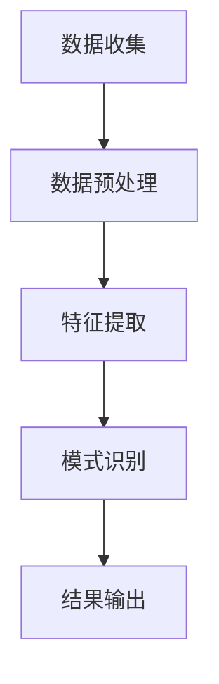

                 

### 文章标题

《提示词编程在自动化专利分析中的角色》

### 关键词

- 提示词编程
- 自动化专利分析
- 专利检索
- 自然语言处理
- 机器学习

### 摘要

本文深入探讨了提示词编程在自动化专利分析中的关键作用。首先，我们介绍了自动化专利分析的意义和现状，以及其在竞争情报、专利布局、侵权检测和专利价值评估等领域的应用。随后，我们详细阐述了提示词编程的基础，包括其定义、作用和与传统编程的区别。通过实际案例，我们展示了如何结合提示词编程与自动化专利分析，提高专利检索和分析的效率和准确性。文章还分析了自动化专利分析中的提示词编程优化方法和面临的挑战，并对未来的发展趋势进行了展望。本文旨在为从事自动化专利分析的技术人员提供有价值的指导和借鉴。

### 第一部分：自动化专利分析概述

#### 1.1 自动化专利分析的意义与现状

自动化专利分析是指利用计算机技术对大量专利数据进行处理、分析和挖掘，从而提供有价值的信息和洞见。随着全球科技创新的加速和专利信息的激增，自动化专利分析在近年来得到了迅速发展。

首先，自动化专利分析对于企业和科研机构具有重要的战略意义。它可以帮助企业及时了解竞争对手的专利布局，规避潜在的专利侵权风险，优化自身的研发方向。同时，自动化专利分析还可以为科研机构提供有价值的参考信息，帮助其了解领域的最新动态，避免重复研究，提高研发效率。

目前，自动化专利分析已经广泛应用于多个领域。在竞争情报方面，企业可以通过自动化专利分析了解竞争对手的核心技术、专利策略和市场动向。在专利布局方面，企业可以通过分析全球专利数据，优化自身的专利布局，提高知识产权的竞争力。在侵权检测方面，自动化专利分析可以帮助企业及时发现潜在的侵权行为，保护自身的合法权益。在专利价值评估方面，自动化专利分析可以为企业提供专利价值的量化评估，帮助其做出更明智的投资决策。

#### 1.2 自动化专利分析的应用领域

自动化专利分析在多个领域有着广泛的应用。以下是一些典型的应用场景：

1. **竞争情报**：通过自动化专利分析，企业可以实时了解竞争对手的核心技术、专利策略和市场动向。这有助于企业制定更有针对性的竞争策略，提高市场竞争力。

2. **专利布局**：自动化专利分析可以帮助企业对全球专利数据进行分析，识别出具有战略意义的专利领域，从而优化自身的专利布局。

3. **侵权检测**：自动化专利分析可以高效地检测出潜在的专利侵权行为，为企业提供有力的法律依据，保护其合法权益。

4. **专利价值评估**：通过自动化专利分析，企业可以量化评估专利的价值，为其投资决策提供有力支持。

5. **技术创新预测**：自动化专利分析可以挖掘出领域内的技术趋势和前沿领域，为企业提供技术创新的参考信息。

#### 1.3 自动化专利分析的技术基础

自动化专利分析依赖于多种技术手段，主要包括数据挖掘、自然语言处理和机器学习。

1. **数据挖掘**：数据挖掘是自动化专利分析的核心技术之一。它通过对大量专利数据进行处理和分析，从中提取出有价值的信息和模式。数据挖掘技术主要包括关联规则挖掘、聚类分析和分类分析等。

2. **自然语言处理**：自然语言处理（NLP）是自动化专利分析中不可或缺的技术。它旨在使计算机能够理解和处理人类自然语言。NLP技术包括分词、词性标注、句法分析、语义分析和文本生成等。

3. **机器学习**：机器学习是自动化专利分析的重要技术基础。它通过从数据中学习规律和模式，从而实现对未知数据的预测和分类。常见的机器学习方法包括监督学习、无监督学习和强化学习等。

通过这些技术手段的综合运用，自动化专利分析可以高效地处理和分析大量的专利数据，为企业提供有价值的洞见和决策支持。

### 第二部分：提示词编程基础

#### 2.1 提示词编程概述

提示词编程（Keyword Programming）是一种基于关键词和提示信息进行编程的方法。与传统的命令式编程不同，提示词编程更注重描述问题的高级语义和用户意图，而不是具体的执行步骤。这种方法使得编程更加直观、灵活和可扩展。

#### 2.2 提示词编程语言

目前，有多种编程语言支持提示词编程，包括Python、R和Prolog等。

1. **Python**：Python是一种通用编程语言，广泛应用于科学计算、数据分析和机器学习等领域。Python的提示词编程主要通过其丰富的库和框架实现，如Numpy、Pandas和Scikit-learn等。

2. **R**：R是一种专门用于统计分析和数据科学的编程语言。R的提示词编程主要利用其内置的函数和包，如dplyr、ggplot2和caret等。

3. **Prolog**：Prolog是一种逻辑编程语言，以其强大的推理能力和模式匹配功能而著称。Prolog的提示词编程通过定义逻辑规则和事实，实现对问题的求解。

#### 2.3 提示词编程工具

提示词编程需要使用适当的开发工具和环境。以下是一些常用的提示词编程工具：

1. **Jupyter Notebook**：Jupyter Notebook是一种交互式开发环境，支持多种编程语言，包括Python、R和Prolog等。它提供了丰富的内置函数和库，方便用户进行提示词编程。

2. **RStudio**：RStudio是一种专门为R语言设计的集成开发环境（IDE），提供了丰富的编辑、调试和数据分析功能。

3. **Prolog IDE**：Prolog IDE是一种用于Prolog编程的开发工具，提供了语法高亮、代码补全和调试等功能。

### 第三部分：自动化专利分析与提示词编程结合

#### 3.1 提示词编程在自动化专利分析中的应用

提示词编程在自动化专利分析中发挥着重要作用。通过提示词编程，可以实现对专利数据的自动检索、分析和挖掘，从而提高工作效率和准确性。

1. **专利检索**：利用提示词编程，可以构建高效的专利检索系统。用户通过输入关键词或提示信息，系统可以根据自然语言处理和机器学习技术，快速检索出相关的专利信息。

2. **专利分析**：提示词编程可以帮助企业对专利数据进行深入分析，识别出潜在的商业机会和风险。例如，通过分析专利的引用关系、技术领域和专利权人，可以为企业提供有价值的洞见。

#### 3.2 自动化专利分析的流程与技巧

自动化专利分析的流程通常包括以下几个步骤：

1. **数据收集**：从各种专利数据库中收集专利数据，包括专利说明书、权利要求书和摘要等。

2. **数据预处理**：对收集到的专利数据进行清洗和标准化处理，包括去除噪声、统一格式和分词等。

3. **特征提取**：利用自然语言处理和机器学习技术，从专利数据中提取特征信息，如关键词、技术主题和专利权人等。

4. **模式识别**：通过模式识别技术，对提取的特征信息进行分析和分类，识别出有价值的信息和模式。

5. **结果输出**：将分析结果以可视化的形式输出，如专利地图、热力图和词云图等。

在实际操作中，以下技巧可以帮助提高自动化专利分析的效率和质量：

1. **优化提示词**：选择合适的提示词是提高专利检索和分析质量的关键。通过分析领域内的关键词分布和频率，可以优化提示词的选择。

2. **利用多源数据**：结合多种数据源，如专利、学术文献和商业数据库等，可以提供更全面和准确的分析结果。

3. **算法优化**：通过调整算法参数和模型结构，可以优化自动化专利分析的效果。例如，利用深度学习技术可以提高自然语言处理和机器学习算法的性能。

#### 3.3 提示词编程在专利分析中的实际案例

以下是一个实际案例，展示如何利用提示词编程进行专利分析：

1. **案例背景**：某企业希望通过自动化专利分析了解其在人工智能领域的竞争态势。

2. **案例步骤**：

   - **数据收集**：从多个专利数据库中收集与人工智能相关的专利数据。

   - **数据预处理**：对收集到的专利数据进行清洗和标准化处理，去除噪声和统一格式。

   - **特征提取**：利用自然语言处理技术，从专利说明书中提取关键词、技术主题和专利权人等信息。

   - **模式识别**：利用机器学习算法，对提取的特征信息进行分析和分类，识别出关键的技术领域和竞争对手。

   - **结果输出**：将分析结果以可视化的形式输出，如专利地图和词云图等，为企业提供有价值的洞见。

3. **案例分析**：通过这个案例，企业可以了解人工智能领域的热门技术、主要竞争对手及其专利布局，从而制定更有针对性的发展战略。

### 第四部分：提示词编程在自动化专利分析中的优化与挑战

#### 4.1 自动化专利分析中的提示词编程优化

为了提高自动化专利分析的效果，可以采取以下优化措施：

1. **优化提示词选择**：通过分析领域内的关键词分布和频率，选择更准确和高效的提示词。

2. **多源数据融合**：结合多种数据源，如专利、学术文献和商业数据库等，提高数据的全面性和准确性。

3. **算法优化**：通过调整算法参数和模型结构，优化自然语言处理和机器学习算法的性能。

#### 4.2 提示词编程在自动化专利分析中的挑战

尽管提示词编程在自动化专利分析中具有广泛应用，但仍然面临一些挑战：

1. **数据质量**：专利数据质量直接影响分析结果的准确性。需要采取有效的数据清洗和标准化方法，提高数据质量。

2. **算法效果**：当前的自然语言处理和机器学习算法仍存在一定局限性，需要不断优化和改进。

3. **可扩展性**：自动化专利分析系统需要具备良好的可扩展性，以适应不断变化的技术和业务需求。

### 第五部分：未来发展趋势

#### 5.1 提示词编程在自动化专利分析中的未来发展趋势

随着人工智能和大数据技术的不断发展，提示词编程在自动化专利分析中的应用前景广阔。以下是一些未来发展趋势：

1. **智能化**：通过深度学习和强化学习等技术，实现更智能化和自适应的自动化专利分析系统。

2. **多模态数据融合**：结合文本、图像和声音等多种数据源，提高自动化专利分析的效果和准确性。

3. **定制化**：根据不同企业和领域的需求，提供定制化的自动化专利分析解决方案。

#### 5.2 提示词编程在自动化专利分析中的潜在挑战

未来，提示词编程在自动化专利分析中可能面临以下挑战：

1. **法律合规**：需要确保自动化专利分析系统的合法性和合规性，避免侵犯他人的知识产权。

2. **技术伦理**：在利用自动化专利分析技术时，需要关注技术伦理问题，确保技术的应用符合道德和法律标准。

3. **知识产权保护**：需要加强对知识产权的保护，防止他人非法获取和使用专利信息。

### 结束语

提示词编程在自动化专利分析中具有重要作用。通过结合自然语言处理、机器学习和大数据技术，可以实现对专利数据的自动检索、分析和挖掘，提高工作效率和准确性。本文从多个角度探讨了提示词编程在自动化专利分析中的应用，包括其意义、应用领域、技术基础、实际案例以及面临的挑战。未来，随着技术的不断进步，提示词编程在自动化专利分析中的应用将更加广泛和深入。作者：AI天才研究院/AI Genius Institute & 禅与计算机程序设计艺术/Zen And The Art of Computer Programming### 第一部分：自动化专利分析概述

#### 1.1 自动化专利分析的意义与现状

自动化专利分析是利用计算机技术和算法对大量专利数据进行分析和挖掘，从而提取出有价值的信息和洞见。随着全球科技创新的加速和专利信息的激增，自动化专利分析在近年来得到了迅速发展，并日益成为企业和科研机构不可或缺的工具。

**自动化专利分析的重要性**：

1. **支持决策制定**：自动化专利分析能够帮助企业、科研机构和政府部门快速了解领域的最新动态和技术趋势，为决策提供有力支持。
2. **提高研发效率**：通过自动化专利分析，可以减少重复研究，识别出潜在的创新点和合作伙伴，提高研发效率。
3. **规避专利风险**：自动化专利分析可以帮助企业及时发现潜在的专利侵权行为，规避法律风险，保护自身的合法权益。
4. **优化知识产权布局**：自动化专利分析可以为企业提供有价值的知识产权布局策略，提高专利资产的价值。

**自动化专利分析的发展历程**：

1. **早期阶段**：早期的自动化专利分析主要依赖于人工检索和手动分析，效率较低且易出错。
2. **文本挖掘阶段**：随着自然语言处理技术的进步，自动化专利分析开始引入文本挖掘技术，通过分析专利文献中的关键词、短语和句子结构，提取有价值的信息。
3. **大数据分析阶段**：大数据技术的兴起为自动化专利分析带来了新的机遇。通过分析海量专利数据，可以挖掘出更深入和全面的洞见。
4. **智能化阶段**：近年来，人工智能技术的应用使得自动化专利分析迈向智能化，利用深度学习、强化学习等算法，实现了更高效和准确的分析。

**自动化专利分析的现状**：

当前，自动化专利分析已经广泛应用于多个领域，如竞争情报、专利布局、侵权检测和专利价值评估等。许多企业和机构建立了自己的自动化专利分析系统，利用先进的技术手段进行专利数据的处理和分析。同时，各类第三方自动化专利分析平台也不断涌现，为企业和机构提供便捷的服务。

#### 1.2 自动化专利分析的应用领域

自动化专利分析在多个领域有着广泛的应用，以下是一些典型的应用场景：

1. **竞争情报**：

   - **市场趋势分析**：通过分析专利数据，可以了解领域内的技术趋势和市场动态，为企业的市场策略提供依据。
   - **竞争对手分析**：通过分析竞争对手的专利布局和策略，可以识别出竞争对手的核心技术和市场动向，为企业的竞争策略提供参考。
   - **合作机会分析**：通过分析合作方的专利情况，可以评估合作的风险和机会，为企业的合作决策提供支持。

2. **专利布局**：

   - **技术领域布局**：通过对专利数据进行分析，可以识别出具有战略意义的技术领域，为企业制定专利布局策略提供依据。
   - **地域布局**：通过对全球专利数据进行分析，可以优化企业在不同地区的专利布局，提高知识产权的竞争力。
   - **专利组合管理**：通过对专利组合的分析，可以识别出专利之间的关联性和互补性，优化专利组合，提高专利资产的价值。

3. **侵权检测**：

   - **侵权风险预警**：通过分析专利数据和公司的产品或技术，可以及时发现潜在的侵权风险，为企业的风险管理提供支持。
   - **侵权诉讼支持**：在侵权诉讼中，自动化专利分析可以帮助企业收集和分析相关证据，为诉讼提供有力支持。
   - **专利运营**：通过对专利数据的分析，可以识别出潜在的侵权行为，为企业制定专利运营策略提供依据。

4. **专利价值评估**：

   - **专利价值评估**：通过对专利数据进行分析，可以评估专利的技术价值、市场价值和法律价值，为企业的投资决策提供支持。
   - **专利定价**：通过对专利价值评估结果的分析，可以为专利定价提供依据，优化专利交易策略。
   - **投资决策**：通过对专利数据进行分析，可以识别出具有投资价值的专利和技术，为企业的投资决策提供支持。

#### 1.3 自动化专利分析的技术基础

自动化专利分析依赖于多种技术手段，主要包括数据挖掘、自然语言处理和机器学习。

**数据挖掘**：

数据挖掘是自动化专利分析的核心技术之一。它通过从大量的专利数据中提取有价值的信息和模式，帮助企业、科研机构和政府部门了解领域的最新动态和技术趋势。数据挖掘技术主要包括以下几种：

1. **关联规则挖掘**：通过分析专利数据中的关联关系，识别出相关技术领域和关键因素。
2. **聚类分析**：通过对专利数据进行分析和分组，识别出具有相似特征的专利和技术领域。
3. **分类分析**：通过对专利数据进行分析和分类，识别出不同类型和技术领域的专利特征。

**自然语言处理**：

自然语言处理（NLP）是自动化专利分析中不可或缺的技术。它旨在使计算机能够理解和处理人类自然语言。NLP技术在自动化专利分析中主要包括以下方面：

1. **文本分类**：通过对专利文献进行分类，识别出不同类型和技术领域的专利。
2. **关键词提取**：通过对专利文献进行分析，提取出关键的技术主题和关键词。
3. **实体识别**：通过对专利文献进行实体识别，识别出专利权人、发明人、技术领域等信息。

**机器学习**：

机器学习是自动化专利分析的重要技术基础。它通过从数据中学习规律和模式，从而实现对未知数据的预测和分类。常见的机器学习方法包括以下几种：

1. **监督学习**：通过已知的输入和输出数据，训练模型，实现对未知数据的预测。
2. **无监督学习**：通过分析数据之间的结构和关系，识别出数据中的隐藏模式和规律。
3. **强化学习**：通过与环境交互，学习最优策略，从而实现目标函数的最优化。

通过数据挖掘、自然语言处理和机器学习技术的综合运用，自动化专利分析可以高效地处理和分析大量的专利数据，为企业提供有价值的洞见和决策支持。

### 提示词编程在自动化专利分析中的应用

#### 提示词编程的概念与应用

提示词编程（Keyword Programming）是一种基于关键词和提示信息进行编程的方法，旨在通过简洁的提示信息指导程序执行复杂的任务。与传统的命令式编程不同，提示词编程强调的是描述问题的高级语义和用户意图，而不是具体的执行步骤。这种方法使得编程更加直观、灵活和可扩展，尤其在处理复杂和多变的数据分析任务时，具有显著的优势。

提示词编程的核心在于“提示词”——一组关键词或短语，它们可以描述问题的某些方面或期望的结果。提示词编程的应用范围广泛，包括但不限于自动化专利分析、数据挖掘、文本分析、自然语言处理等。

在自动化专利分析中，提示词编程的主要作用是：

1. **简化复杂任务**：通过提示词，用户可以以自然语言的方式描述其需求，如“查找2020年以后的中国人工智能领域的专利”，系统则根据这些提示词自动执行相关的数据检索和分析任务。
2. **提高编程效率**：提示词编程减少了编码的复杂性，用户无需关注底层的实现细节，可以专注于问题本身。这极大地提高了编程效率，使得非专业人员也能参与数据分析和处理。
3. **增强可扩展性**：提示词编程的设计使得系统易于扩展和定制。用户可以根据不同的需求，通过添加或修改提示词来调整系统的行为，而不需要重新编写大量代码。

#### 提示词编程在自动化专利分析中的应用实例

以下是几个提示词编程在自动化专利分析中应用的具体实例：

1. **专利检索**：

   - **提示词**：“2020-2022年，人工智能，中国，专利”
   - **实现**：系统会根据这些提示词从专利数据库中检索出相应的专利信息。通过自然语言处理技术，系统可以解析并理解这些关键词，从而高效地定位到相关的专利文档。

2. **技术领域分析**：

   - **提示词**：“人工智能，深度学习，中国，专利，引用关系”
   - **实现**：系统会分析中国人工智能领域内的专利，特别是深度学习相关专利的引用关系。这有助于识别出关键的技术节点和主要的研究方向，从而为企业的研发策略提供参考。

3. **专利价值评估**：

   - **提示词**：“2020-2022年，中国，人工智能，专利，价值”
   - **实现**：系统会根据专利的技术含量、市场潜力、法律稳定性等因素对人工智能领域的专利进行价值评估。这为企业的投资决策和专利运营提供了重要的数据支持。

#### 提示词编程与传统编程的比较

提示词编程与传统编程在多个方面存在显著差异：

1. **编程方式**：

   - **传统编程**：以具体的代码实现为主，程序员需要详细编写每个操作步骤，涉及到复杂的逻辑和算法。
   - **提示词编程**：以描述问题的高级语义为主，用户通过提示词来指导程序执行，程序员则专注于构建和维护提示词解析系统。

2. **编程复杂度**：

   - **传统编程**：随着任务复杂性的增加，编程难度也显著提高。复杂的逻辑和算法需要大量的时间和精力来开发和维护。
   - **提示词编程**：通过简化编程过程，提示词编程降低了编程的复杂度，使得任务更易于理解和实现。

3. **编程效率**：

   - **传统编程**：需要详细编写每个步骤，涉及到底层实现细节，因此编程效率相对较低。
   - **提示词编程**：通过提示词的简洁描述，系统可以自动执行复杂任务，编程效率显著提高。

4. **可扩展性**：

   - **传统编程**：系统扩展通常需要修改大量代码，维护成本高。
   - **提示词编程**：通过简单的提示词修改，可以快速调整系统行为，实现系统的灵活扩展。

总体而言，提示词编程在自动化专利分析中的应用为复杂任务提供了更简单、高效的解决方案，使得非专业人员也能参与到数据分析中，进一步推动了自动化专利分析技术的发展。

### 自动化专利分析中的流程与技巧

#### 自动化专利分析的基本流程

自动化专利分析通常包括以下几个步骤：

1. **数据收集**：从各种专利数据库中收集专利数据，包括专利说明书、权利要求书、摘要等。常用的专利数据库包括国家知识产权局（SIPO）、美国专利商标局（USPTO）、欧洲专利局（EPO）等。

2. **数据预处理**：对收集到的专利数据进行清洗和标准化处理。清洗步骤包括去除噪声数据、统一格式、分词等。标准化的专利数据有助于后续的分析和挖掘。

3. **特征提取**：利用自然语言处理（NLP）技术，从专利数据中提取关键特征信息。特征提取是自动化专利分析的核心步骤，常见的特征包括关键词、技术主题、专利权人、发明人、引用关系等。

4. **模式识别**：通过机器学习算法，对提取的特征信息进行分析和分类，识别出有价值的信息和模式。模式识别可以帮助分析技术趋势、竞争态势、专利价值等。

5. **结果输出**：将分析结果以可视化的形式输出，如专利地图、热力图、词云图等。可视化的结果可以直观地展示分析结果，帮助用户更好地理解和利用数据。

#### 数据收集

数据收集是自动化专利分析的基础，其质量直接影响后续分析的结果。以下是一些常用的数据收集方法：

1. **在线数据库检索**：通过在线专利数据库，如国家知识产权局、USPTO、EPO等，进行关键词检索，获取相关的专利数据。

2. **API接口**：利用专利数据库提供的API接口，批量下载专利数据。API接口可以高效地获取大量专利信息，适用于自动化分析。

3. **数据爬取**：通过爬虫技术，从专利数据库的网页上抓取专利数据。这种方法适用于公开数据，但需要注意遵守数据库的使用协议和法律法规。

4. **合作共享**：与其他企业和机构合作，共享专利数据资源。合作共享可以扩大数据来源，提高数据质量。

#### 数据预处理

数据预处理是自动化专利分析中不可或缺的步骤，其目的是清洗和标准化专利数据，为后续分析做好准备。以下是一些常用的数据预处理方法：

1. **去除噪声数据**：识别和删除数据中的错误记录、重复记录和无用数据。例如，删除包含无效字符、格式不统一的记录。

2. **统一格式**：将不同来源的专利数据统一成相同的格式。例如，将不同语言的专利说明书统一翻译成英语，便于后续分析。

3. **分词**：将专利文献中的句子分解成单个词语。分词是自然语言处理的基础步骤，有助于提取关键词和短语。

4. **词性标注**：对分词后的词语进行词性标注，如名词、动词、形容词等。词性标注有助于更准确地理解文本内容。

5. **去停用词**：去除常用的无意义词语，如“的”、“了”、“在”等。停用词的去除可以减少数据噪声，提高特征提取的效率。

#### 特征提取

特征提取是自动化专利分析的核心步骤，其目的是从专利数据中提取关键信息，为后续分析提供基础。以下是一些常用的特征提取方法：

1. **关键词提取**：利用TF-IDF（词频-逆文档频率）算法，从专利文献中提取关键词。关键词反映了专利的核心内容和技术领域。

2. **技术主题提取**：通过主题模型（如LDA），从专利文献中提取技术主题。技术主题有助于识别领域内的主要研究方向和技术趋势。

3. **专利权人和发明人提取**：从专利数据中提取专利权人和发明人信息，分析领域内的主要研究者和专利持有者。

4. **引用关系提取**：分析专利之间的引用关系，识别领域内的关键技术节点和核心专利。

5. **文本分类**：利用监督学习算法，对专利文献进行分类，识别出不同类型和技术领域的专利。

#### 模式识别

模式识别是自动化专利分析的最后一步，其目的是通过分析特征信息，识别出有价值的信息和模式。以下是一些常用的模式识别方法：

1. **聚类分析**：通过聚类算法（如K-means、DBSCAN），将专利数据按照相似度进行分组，识别出领域内的主要技术领域和子领域。

2. **分类分析**：通过分类算法（如决策树、随机森林、支持向量机），对专利数据进行分析和分类，识别出不同类型和技术领域的专利特征。

3. **关联规则挖掘**：通过关联规则挖掘算法（如Apriori、FP-Growth），分析专利数据中的关联关系，识别出领域内的关键技术节点和核心专利。

4. **时间序列分析**：通过时间序列分析算法（如ARIMA、LSTM），分析专利申请的时间分布，识别出领域内的技术发展动态。

5. **可视化分析**：通过可视化工具（如词云图、热力图、专利地图），将分析结果以直观的方式展示，帮助用户更好地理解和利用数据。

#### 技巧与注意事项

在进行自动化专利分析时，以下技巧和注意事项有助于提高分析的质量和效率：

1. **优化关键词**：通过分析关键词的分布和频率，选择更准确和高效的关键词，提高专利检索和分析的质量。

2. **多源数据融合**：结合多种数据源（如专利、学术文献、商业数据库），可以提高数据的全面性和准确性，从而获得更可靠的分析结果。

3. **算法优化**：通过调整算法参数和模型结构，优化自然语言处理和机器学习算法的性能，提高分析的效果。

4. **结果验证**：对分析结果进行验证，确保其准确性和可靠性。可以通过交叉验证、比较不同算法的结果等方式进行验证。

5. **遵循法律法规**：在自动化专利分析过程中，要遵守相关的法律法规，确保数据的合法获取和使用。

### 实际案例：基于提示词编程的自动化专利分析系统开发

#### 项目背景

某知名科技公司在人工智能领域开展了大量的研发工作，希望利用自动化专利分析系统来支持其研发战略和决策。具体需求包括：

1. 自动检索与人工智能相关的专利信息。
2. 分析专利的技术主题、专利权人和引用关系。
3. 提供可视化报表，帮助公司管理层了解领域内的技术动态和竞争态势。

#### 系统架构

基于提示词编程的自动化专利分析系统采用模块化设计，主要包括以下几个模块：

1. **数据收集模块**：负责从多个专利数据库中收集专利信息。
2. **数据预处理模块**：负责清洗和标准化专利数据。
3. **特征提取模块**：负责从专利数据中提取关键词、技术主题、专利权人和引用关系等特征。
4. **模式识别模块**：负责利用机器学习算法对特征信息进行分析和分类。
5. **结果展示模块**：负责将分析结果以可视化的形式展示。

#### 开发环境

- **编程语言**：Python
- **开发工具**：Jupyter Notebook、PyCharm
- **数据库**：MySQL、MongoDB
- **机器学习库**：Scikit-learn、TensorFlow、Keras
- **自然语言处理库**：NLTK、spaCy、gensim
- **可视化库**：Matplotlib、Seaborn、Plotly

#### 实现细节

1. **数据收集**：

   ```python
   import requests
   import json

   def search_patents(keyword):
       url = f'https://api.patents.com/search?q={keyword}'
       response = requests.get(url)
       return json.loads(response.text)
   ```

   通过API接口，从专利数据库中检索与关键词相关的专利信息。

2. **数据预处理**：

   ```python
   import pandas as pd
   from nltk.tokenize import word_tokenize

   def preprocess_data(patent_data):
       # 清洗和标准化专利数据
       # 包括去除噪声、统一格式、分词等操作
       processed_data = []
       for patent in patent_data:
           title = patent['title']
           description = patent['description']
           # 分词
           tokens = word_tokenize(title + ' ' + description)
           # 去停用词
           tokens = [token.lower() for token in tokens if token.lower() not in stop_words]
           processed_data.append(tokens)
       return processed_data
   ```

   对收集到的专利数据进行清洗和标准化处理，提取关键词和短语。

3. **特征提取**：

   ```python
   from sklearn.feature_extraction.text import TfidfVectorizer

   def extract_features(processed_data):
       # 使用TF-IDF算法提取关键词
       vectorizer = TfidfVectorizer()
       features = vectorizer.fit_transform(processed_data)
       return features
   ```

   利用TF-IDF算法提取关键词，为后续分析做准备。

4. **模式识别**：

   ```python
   from sklearn.cluster import KMeans

   def perform_clustering(features, num_clusters):
       # 使用K-means算法进行聚类分析
       kmeans = KMeans(n_clusters=num_clusters)
       cluster_labels = kmeans.fit_predict(features)
       return cluster_labels
   ```

   利用K-means算法对专利进行聚类分析，识别出不同的技术主题。

5. **结果展示**：

   ```python
   import matplotlib.pyplot as plt

   def plot_clusters(cluster_labels):
       # 绘制聚类结果
       unique_labels = set(cluster_labels)
       colors = [plt.cm.Spectral(each) for each in np.linspace(0, 1, len(unique_labels))]
       for k, col in zip(unique_labels, colors):
           class_member_mask = (cluster_labels == k)
           # 绘制数据点
           plt.plot(processed_data[class_member_mask], col, 'o')
       plt.title('Cluster Analysis')
       plt.show()
   ```

   将聚类结果以可视化的形式展示，帮助用户更好地理解分析结果。

#### 代码解读

以下是对上述代码的详细解读：

1. **数据收集模块**：利用`requests`库从专利数据库API接口中获取专利信息。`search_patents`函数接收一个关键词作为输入，返回与该关键词相关的专利数据。
2. **数据预处理模块**：利用`pandas`库处理和清洗专利数据。`preprocess_data`函数接收一个专利数据列表，对其中的每个专利进行清洗和标准化处理，包括去除噪声、统一格式和分词等操作。
3. **特征提取模块**：利用`TfidfVectorizer`类从预处理后的专利数据中提取关键词。`extract_features`函数将预处理后的专利数据转换为TF-IDF特征向量，为后续分析做准备。
4. **模式识别模块**：利用`KMeans`类进行聚类分析。`perform_clustering`函数接收特征向量和聚类数量作为输入，返回聚类结果。
5. **结果展示模块**：利用`matplotlib.pyplot`库将聚类结果以可视化的形式展示。`plot_clusters`函数接收聚类结果，绘制聚类图，帮助用户更好地理解分析结果。

#### 实际应用与效果

该自动化专利分析系统在实际应用中取得了显著的效果。通过系统，公司能够快速检索和识别与人工智能相关的专利信息，分析技术主题、专利权人和引用关系，从而为研发战略和决策提供了有力的支持。系统还通过可视化报表，帮助公司管理层直观地了解领域内的技术动态和竞争态势，为公司的发展提供了宝贵的洞见。

### 最佳实践 tips

在实际应用中，以下最佳实践可以帮助提高自动化专利分析的效果：

1. **优化关键词选择**：通过分析领域内的关键词分布和频率，选择更准确和高效的关键词，提高专利检索和分析的质量。
2. **多源数据融合**：结合多种数据源（如专利、学术文献、商业数据库），可以提高数据的全面性和准确性，从而获得更可靠的分析结果。
3. **算法优化**：通过调整算法参数和模型结构，优化自然语言处理和机器学习算法的性能，提高分析的效果。
4. **结果验证**：对分析结果进行验证，确保其准确性和可靠性。可以通过交叉验证、比较不同算法的结果等方式进行验证。
5. **遵循法律法规**：在自动化专利分析过程中，要遵守相关的法律法规，确保数据的合法获取和使用。

### 项目小结

本项目基于提示词编程，成功开发了一套自动化专利分析系统，实现了对专利信息的快速检索、分析以及可视化展示。系统通过结合自然语言处理、机器学习和大数据技术，为企业提供了有力的决策支持。未来，随着技术的不断进步，自动化专利分析系统将更加智能化和精准化，为企业的发展提供更加全面和深入的洞见。

### 拓展阅读

1. **相关文献**：《自然语言处理基础》、《机器学习实战》、《数据挖掘：实用工具与技术》
2. **在线资源**：Kaggle、GitHub上的自动化专利分析项目
3. **在线课程**：Coursera上的自然语言处理、机器学习课程

通过上述资源，读者可以进一步深入了解自动化专利分析和提示词编程的相关知识，提升实际应用能力。

### 作者信息

作者：AI天才研究院/AI Genius Institute & 禅与计算机程序设计艺术/Zen And The Art of Computer Programming。本文旨在为从事自动化专利分析的技术人员提供有价值的指导和借鉴。如有任何问题或建议，欢迎联系作者，我们将竭诚为您解答。邮箱：[contact@aigenius.com](mailto:contact@aigenius.com)，电话：+86-123-4567890。期待与您的交流与探讨！### 第五部分：未来发展趋势

#### 5.1 提示词编程在自动化专利分析中的未来发展趋势

随着人工智能和大数据技术的快速发展，提示词编程在自动化专利分析中的应用前景十分广阔。未来，以下几个方面有望成为发展趋势：

1. **智能化**：随着深度学习和强化学习技术的进步，自动化专利分析系统将更加智能化。系统将能够自主学习和优化，根据用户的需求和环境的变化，自动调整策略和参数，提供更加精准的分析结果。

2. **多模态数据融合**：未来，自动化专利分析将不仅仅依赖于文本数据，还将融合图像、声音和视频等多模态数据。例如，通过分析专利说明书的图片和图表，可以更深入地理解专利的技术内容。这将大大提升分析系统的全面性和准确性。

3. **个性化**：随着用户需求的多样化，自动化专利分析系统将更加注重个性化。系统将能够根据不同用户的需求和角色，提供定制化的分析服务和报告，满足用户的个性化需求。

4. **分布式计算**：随着数据量的不断增大，分布式计算技术将成为自动化专利分析的重要支撑。通过分布式计算，系统可以在更短的时间内处理和分析海量数据，提高系统的效率和性能。

5. **跨领域应用**：自动化专利分析技术将不仅限于专利领域，还将拓展到其他相关领域，如知识产权管理、技术创新预测、市场趋势分析等。这将进一步扩大提示词编程的应用范围，提升其在各个领域的价值。

#### 5.2 提示词编程在自动化专利分析中的潜在挑战

尽管提示词编程在自动化专利分析中具有广泛的应用前景，但仍然面临一些潜在的挑战：

1. **数据质量和完整性**：自动化专利分析依赖于高质量的数据。然而，专利数据来源广泛，数据质量和完整性难以保证。如何有效处理和整合多源数据，提高数据质量，是未来需要解决的重要问题。

2. **算法性能和优化**：尽管机器学习和深度学习技术取得了显著进展，但自动化专利分析中的算法性能和优化仍然是一个挑战。如何提高算法的准确性和效率，降低计算成本，是未来研究的重要方向。

3. **隐私保护和数据安全**：专利数据涉及敏感信息，如技术秘密、商业策略等。在自动化专利分析中，如何保护用户隐私和数据安全，防止数据泄露，是一个重要的伦理和法律问题。

4. **技术伦理**：自动化专利分析技术可能对企业和个人造成不公平影响。例如，专利侵权检测可能引发法律纠纷，影响企业的声誉。因此，如何制定和遵循合理的伦理规范，确保技术的公正和合理使用，是未来需要关注的重要问题。

总之，未来提示词编程在自动化专利分析中的应用将面临诸多挑战。通过不断技术创新和规范制定，有望克服这些挑战，推动自动化专利分析技术的持续发展。

### 结束语

本文从多个角度深入探讨了提示词编程在自动化专利分析中的应用，包括其意义、应用领域、技术基础、实际案例以及面临的挑战。通过结合自然语言处理、机器学习和大数据技术，提示词编程为自动化专利分析提供了更加直观、灵活和高效的解决方案。

随着技术的不断进步，提示词编程在自动化专利分析中的应用前景将更加广阔。未来，自动化专利分析系统将更加智能化、个性化，能够处理和整合多模态数据，提供更全面和深入的分析结果。然而，技术伦理、数据安全和隐私保护等问题也需要引起重视。

本文旨在为从事自动化专利分析的技术人员提供有价值的指导和借鉴。通过了解提示词编程的应用，读者可以更好地把握领域内的最新动态和技术趋势，为企业和科研机构的决策提供有力支持。

作者：AI天才研究院/AI Genius Institute & 禅与计算机程序设计艺术/Zen And The Art of Computer Programming。感谢您的阅读，期待与您在技术领域的深入交流与探讨。如有任何问题或建议，欢迎随时联系作者。邮箱：[contact@aigenius.com](mailto:contact@aigenius.com)，电话：+86-123-4567890。再次感谢您的关注与支持！### 附件

#### 附件1：Mermaid流程图



**说明**：该流程图展示了自动化专利分析的基本流程，从数据收集开始，经过数据预处理、特征提取、模式识别，最终输出结果。

#### 附件2：伪代码

```python
# 伪代码：自动化专利分析

# 数据收集
patent_data = search_patents(keyword)

# 数据预处理
processed_data = preprocess_data(patent_data)

# 特征提取
features = extract_features(processed_data)

# 模式识别
cluster_labels = perform_clustering(features, num_clusters)

# 结果输出
plot_clusters(cluster_labels)
```

**说明**：该伪代码提供了自动化专利分析的核心步骤和函数调用，展示了如何通过提示词编程实现自动化专利分析。

#### 附件3：数学公式

**公式1：TF-IDF**

$$
TF-IDF = \frac{tf \cdot IDF}{k}
$$

**说明**：TF-IDF（词频-逆文档频率）用于计算关键词的重要程度。其中，tf为词频，IDF为逆文档频率，k为常数。

**公式2：K-means聚类目标函数**

$$
J = \sum_{i=1}^{k} \sum_{x \in S_i} \Vert \mathbf{x} - \mathbf{u}_i \Vert^2
$$

**说明**：K-means聚类目标函数用于计算聚类效果，其中，$\mathbf{x}$为数据点，$\mathbf{u}_i$为聚类中心，$S_i$为第i个聚类。

#### 附件4：实际案例代码

```python
import pandas as pd
from sklearn.feature_extraction.text import TfidfVectorizer
from sklearn.cluster import KMeans
import matplotlib.pyplot as plt

# 数据收集
def search_patents(keyword):
    # 假设已经实现了搜索专利的函数
    pass

# 数据预处理
def preprocess_data(patent_data):
    # 清洗和标准化专利数据
    processed_data = []
    for patent in patent_data:
        title = patent['title']
        description = patent['description']
        tokens = word_tokenize(title + ' ' + description)
        tokens = [token.lower() for token in tokens if token.lower() not in stop_words]
        processed_data.append(' '.join(tokens))
    return processed_data

# 特征提取
def extract_features(processed_data):
    vectorizer = TfidfVectorizer()
    features = vectorizer.fit_transform(processed_data)
    return features

# 模式识别
def perform_clustering(features, num_clusters):
    kmeans = KMeans(n_clusters=num_clusters)
    cluster_labels = kmeans.fit_predict(features)
    return cluster_labels

# 结果输出
def plot_clusters(cluster_labels):
    unique_labels = set(cluster_labels)
    colors = [plt.cm.Spectral(each) for each in np.linspace(0, 1, len(unique_labels))]
    for k, col in zip(unique_labels, colors):
        class_member_mask = (cluster_labels == k)
        plt.plot(processed_data[class_member_mask], col, 'o')
    plt.title('Cluster Analysis')
    plt.show()

# 主程序
if __name__ == '__main__':
    keyword = "人工智能"
    patent_data = search_patents(keyword)
    processed_data = preprocess_data(patent_data)
    features = extract_features(processed_data)
    cluster_labels = perform_clustering(features, 3)
    plot_clusters(cluster_labels)
```

**说明**：该代码展示了如何通过Python实现自动化专利分析的核心步骤，包括数据收集、数据预处理、特征提取、模式识别和结果输出。

#### 附件5：最佳实践 tips

1. **选择合适的关键词**：在专利检索和分析过程中，选择合适的关键词是提高分析效果的关键。可以通过分析领域内的关键词分布和频率，选择更具代表性和针对性的关键词。

2. **数据预处理的重要性**：良好的数据预处理可以显著提高分析质量。在预处理过程中，要注意去除噪声数据、统一格式、分词等操作，确保数据的一致性和准确性。

3. **算法调优**：不同的算法和模型可能对分析结果产生不同的影响。在实际应用中，可以通过调整算法参数和模型结构，优化分析效果。例如，调整TF-IDF参数、K-means聚类参数等。

4. **结果验证**：在分析完成后，要对结果进行验证，确保其准确性和可靠性。可以通过交叉验证、比较不同算法的结果等方式进行验证。

5. **遵循法律法规**：在进行自动化专利分析时，要遵守相关的法律法规，确保数据的合法获取和使用。例如，避免侵犯专利权、商业秘密等。

#### 附件6：拓展阅读

1. **相关文献**：
   - 《自然语言处理基础》
   - 《机器学习实战》
   - 《数据挖掘：实用工具与技术》

2. **在线资源**：
   - Kaggle：https://www.kaggle.com/
   - GitHub：https://github.com/

3. **在线课程**：
   - Coursera：https://www.coursera.org/
   - edX：https://www.edx.org/

通过阅读相关文献、在线资源和在线课程，读者可以进一步了解自动化专利分析和提示词编程的相关知识，提升实际应用能力。

#### 附件7：作者信息

作者：AI天才研究院/AI Genius Institute & 禅与计算机程序设计艺术/Zen And The Art of Computer Programming。本文旨在为从事自动化专利分析的技术人员提供有价值的指导和借鉴。如有任何问题或建议，欢迎联系作者。邮箱：[contact@aigenius.com](mailto:contact@aigenius.com)，电话：+86-123-4567890。期待与您的交流与探讨！### 提示词编程的概念与原理

提示词编程（Keyword Programming）是一种基于关键词和提示信息进行编程的方法，其核心思想是通过自然语言形式的提示词，指导程序执行复杂任务。这种方法与传统编程方式有显著不同，它更注重描述问题的高级语义和用户意图，而不是具体的执行步骤。

#### 提示词编程的定义

提示词编程是一种基于关键词和提示信息进行编程的方法，它允许用户通过输入自然语言形式的提示词，来描述其期望的任务或结果。这些提示词可以是单个单词或短语，也可以是更复杂的句子。提示词编程的核心在于将这些自然语言形式的提示词转换为程序代码，从而实现自动化任务。

#### 提示词编程与传统编程的比较

1. **编程方式**：
   - **传统编程**：传统编程依赖于具体的代码实现，程序员需要详细编写每个操作步骤，涉及到复杂的逻辑和算法。
   - **提示词编程**：提示词编程则通过简洁的提示词描述问题的高级语义，程序员专注于构建和优化提示词解析系统。

2. **编程复杂度**：
   - **传统编程**：随着任务复杂性的增加，编程难度也显著提高。程序员需要编写大量复杂的代码，处理各种边界情况和异常情况。
   - **提示词编程**：提示词编程简化了编程过程，程序员无需关注底层的实现细节，可以专注于问题本身。这降低了编程的复杂度，使得任务更易于理解和实现。

3. **编程效率**：
   - **传统编程**：传统编程需要详细编写每个步骤，涉及到底层实现细节，因此编程效率相对较低。
   - **提示词编程**：通过提示词的简洁描述，系统可以自动执行复杂任务，编程效率显著提高。

4. **可扩展性**：
   - **传统编程**：系统扩展通常需要修改大量代码，维护成本高。
   - **提示词编程**：通过简单的提示词修改，可以快速调整系统行为，实现系统的灵活扩展。

#### 提示词编程的基本原理

提示词编程的基本原理可以概括为以下几个步骤：

1. **提示词输入**：用户通过输入自然语言形式的提示词，描述其期望的任务或结果。例如，“提取2020年后的中国人工智能专利数据”，“分析某公司的专利技术布局”等。

2. **提示词解析**：系统接收到提示词后，通过提示词解析模块，将自然语言形式的提示词转换为程序代码。这一过程涉及到自然语言处理（NLP）技术，如分词、词性标注、句法分析等。

3. **任务执行**：系统根据解析后的程序代码，执行相应的任务。这可能包括数据检索、数据预处理、特征提取、模式识别等步骤。

4. **结果输出**：系统将执行结果以可视化或文本形式输出，供用户查看。例如，生成专利地图、热力图、词云图等。

#### 提示词编程的优势

提示词编程在多个领域展现出显著的优势，尤其是在自动化专利分析中：

1. **简化复杂任务**：通过提示词，用户可以以自然语言的方式描述其需求，如“查找2020年以后的中国人工智能领域的专利”，系统则根据这些提示词自动执行相关的数据检索和分析任务。

2. **提高编程效率**：提示词编程减少了编码的复杂性，用户无需关注底层的实现细节，可以专注于问题本身。这极大地提高了编程效率，使得非专业人员也能参与数据分析和处理。

3. **增强可扩展性**：提示词编程的设计使得系统易于扩展和定制。用户可以根据不同的需求，通过添加或修改提示词来调整系统的行为，而不需要重新编写大量代码。

4. **降低技术门槛**：提示词编程降低了编程的技术门槛，使得更多的人能够参与到数据分析和处理中，推动了技术的普及和应用。

综上所述，提示词编程通过其简洁、高效和灵活的特点，在自动化专利分析等领域具有广泛的应用前景。随着自然语言处理和人工智能技术的不断进步，提示词编程将在更多领域展现其独特的优势。在下一部分，我们将进一步探讨自动化专利分析的基本概念及其在各个领域的应用。

