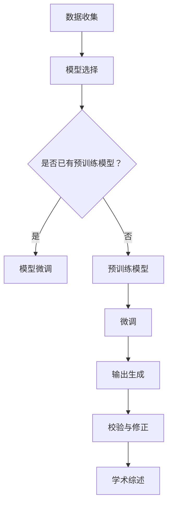
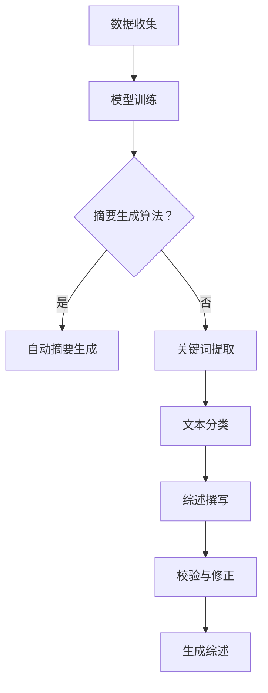

                 

### 引言

#### 提示词编程简介

提示词编程（Prompt Engineering）是一种利用提示（Prompt）引导预训练模型生成目标输出的技术。它通过向预训练模型提供特定的提示信息，让模型在特定的语境下生成更符合预期结果的输出。这一技术在近年来得到了广泛关注，特别是在自然语言处理（NLP）和自动生成领域。

提示词编程的核心在于如何设计有效的提示信息。一个良好的提示应当能够引导模型理解任务的目标，并提供足够的上下文信息，以帮助模型生成高质量的输出。在实际应用中，提示词编程可以极大地提升模型的生成能力和准确性。

#### 自动化学术综述生成的需求

学术综述是学术界中一种重要的文献类型，它通过对某一领域的研究进行全面的总结和评述，帮助读者快速了解该领域的研究进展和最新成果。然而，随着学术文献的迅速增长，手动编写学术综述变得越来越困难，不仅耗时耗力，而且难以保证综述的全面性和准确性。

自动化学术综述生成技术应运而生，它利用机器学习和自然语言处理技术，从大量学术文献中自动提取关键信息，生成高质量的学术综述。这种技术不仅能够提高工作效率，减少人力成本，还能够保证综述的客观性和全面性。

### 核心概念与联系

#### 提示词编程原理

提示词编程的原理可以概括为以下几个关键步骤：

1. **数据收集**：首先，需要收集大量相关领域的学术文献数据。这些数据将作为模型训练的基础。

2. **模型选择**：选择合适的预训练模型，如GPT-3、BERT等。这些模型已经在大规模数据上进行了预训练，具有强大的语言理解能力。

3. **提示设计**：设计有效的提示信息。提示的设计对于模型的生成结果至关重要。一个良好的提示应当提供足够的上下文信息，引导模型理解任务的目标。

4. **模型训练**：使用提示信息对预训练模型进行微调（Fine-tuning），使其在特定任务上表现更好。

5. **输出生成**：使用微调后的模型生成学术综述。生成的综述需要经过后续的校验和修正，以确保其准确性和质量。

#### 自然语言处理基础

自然语言处理（NLP）是提示词编程的基础。NLP旨在让计算机理解和处理自然语言。NLP的关键技术包括：

1. **词向量表示**：将文本中的单词转换为向量表示，以便于计算机处理。

2. **文本分类**：将文本数据分类到预定义的类别中。在学术综述生成中，文本分类用于识别文献的关键词和主题。

3. **命名实体识别**：识别文本中的命名实体，如人名、地点、组织等。这在学术综述生成中用于识别和引用相关的研究者和机构。

4. **自动摘要生成**：从大量文本中提取关键信息，生成摘要。在学术综述生成中，自动摘要生成用于从文献中提取核心内容。

#### 机器学习模型介绍

在提示词编程中，常用的机器学习模型包括：

1. **Transformer模型**：Transformer模型是一种基于自注意力机制的深度学习模型，广泛应用于NLP任务中。其优点是能够处理长距离依赖关系。

2. **BERT模型**：BERT（Bidirectional Encoder Representations from Transformers）是一种双向Transformer模型，通过在两个方向上学习文本的上下文信息，提高了模型的语义理解能力。

3. **GPT-3模型**：GPT-3（Generative Pre-trained Transformer 3）是OpenAI开发的具有极高参数规模的Transformer模型，具有强大的文本生成能力。

#### Mermaid流程图：综述生成核心算法流程

下面是一个Mermaid流程图，展示了学术综述生成的核心算法流程：



通过以上分析，我们可以看到提示词编程在自动化学术综述生成中的关键作用。接下来，我们将深入探讨提示词编程的详细理论和实际应用。首先，我们将介绍提示词编程的基本原理和设计方法。然后，我们将探讨自然语言处理的基础知识，特别是词向量表示、文本分类、命名实体识别和自动摘要生成等技术。最后，我们将介绍常用的机器学习模型，如Transformer、BERT和GPT-3，以及它们在学术综述生成中的应用。通过这些分析，我们将为读者提供一幅完整的提示词编程在自动化学术综述生成中应用的蓝图。### 1. 提示词编程原理

提示词编程是一种利用提示（Prompt）来引导预训练模型生成目标输出的技术。其核心思想是通过向模型提供特定的提示信息，让模型在给定的上下文中生成相应的输出。以下是提示词编程的主要原理和设计方法。

#### 提示设计

提示设计是提示词编程的关键步骤，一个有效的提示应当具备以下几个特点：

1. **明确任务目标**：提示应当清晰地传达任务的目标，使模型知道需要生成什么样的输出。例如，在生成学术综述时，提示可以包含领域的关键词、研究问题、主要结论等。

2. **提供上下文信息**：提示应当提供足够的上下文信息，帮助模型理解文本的背景和主题。这可以通过引入相关的背景知识、引用已有的研究文献等方式实现。

3. **简洁明了**：提示应当简洁明了，避免冗余和混淆。过长的提示可能会使模型难以理解，从而影响生成效果。

4. **可扩展性**：提示设计应当考虑可扩展性，以便在未来的任务中可以灵活调整和优化。

#### 提示类型

根据提示的内容和形式，提示可以分为以下几种类型：

1. **填充式提示**：填充式提示是通过向模型提供一部分文本，并要求模型补充剩余的部分。这种提示适用于文本生成任务，如摘要生成、文本续写等。

2. **问答式提示**：问答式提示是通过提出问题来引导模型生成答案。这种提示适用于问答系统、对话生成等任务。

3. **分类式提示**：分类式提示是通过提供标签或分类信息，要求模型对输入文本进行分类。这种提示适用于文本分类任务。

4. **目标导向式提示**：目标导向式提示是通过明确指定任务的目标，要求模型围绕该目标生成相应的输出。这种提示适用于目标驱动任务，如学术综述生成等。

#### 提示词生成方法

提示词生成是设计提示的关键步骤。以下是一些常用的提示词生成方法：

1. **关键词提取**：通过从文本中提取关键词，作为提示的一部分。关键词可以帮助模型快速了解文本的主题和内容。

2. **语义角色标注**：对文本进行语义角色标注，提取出主语、谓语、宾语等关键成分，作为提示的一部分。这种提示能够提供更加详细的上下文信息。

3. **知识图谱**：利用知识图谱中的关系和实体，生成包含背景知识的提示。这种提示可以增强模型对文本的理解能力。

4. **模板匹配**：根据特定的模板，生成提示。模板可以包含固定部分和可变部分，使提示具有灵活性。

5. **混合方法**：结合多种方法，生成综合性的提示。这种方法可以根据不同的任务需求，提供更加丰富和多样化的提示信息。

#### 提示词编程流程

提示词编程的典型流程包括以下步骤：

1. **数据收集**：收集与任务相关的数据，如学术文献、对话记录、标注数据等。

2. **数据预处理**：对收集到的数据进行清洗、去重、分词、词性标注等预处理操作。

3. **模型选择**：选择合适的预训练模型，如GPT-3、BERT、T5等。

4. **提示设计**：根据任务需求，设计有效的提示信息。可以使用关键词提取、语义角色标注、知识图谱等方法。

5. **模型微调**：使用提示信息和数据集对预训练模型进行微调，使其在特定任务上表现更好。

6. **输出生成**：使用微调后的模型生成目标输出，如学术综述、对话、分类结果等。

7. **校验与修正**：对生成的输出进行校验和修正，确保其准确性和质量。

通过以上流程，我们可以设计出有效的提示词，引导模型生成高质量的输出。接下来，我们将探讨自然语言处理（NLP）的基础知识，为提示词编程提供理论支持。### 2. 自然语言处理基础

自然语言处理（NLP）是提示词编程的基础，它旨在让计算机理解和处理自然语言。NLP涉及到多个方面，包括文本表示、文本分类、命名实体识别、自动摘要生成等。以下将详细介绍这些基础知识和相关技术。

#### 文本表示

文本表示是将文本数据转换为计算机可以处理的数字形式的过程。常用的文本表示方法包括：

1. **词袋模型**：词袋模型将文本表示为一个词的集合，每个词的权重可以通过频率或TF-IDF计算。这种方法简单直观，但无法捕捉词与词之间的顺序关系。

2. **词向量表示**：词向量表示将每个词映射为一个固定维度的向量。常用的词向量模型包括Word2Vec、GloVe和FastText等。词向量能够捕捉词的语义信息，是目前NLP中最常用的文本表示方法。

3. **嵌入表示**：嵌入表示是将文本中的每个单词、句子或文档映射到一个高维空间中的点。嵌入表示可以用于文本分类、推荐系统等任务。

#### 文本分类

文本分类是将文本数据根据其内容分为不同的类别。常用的文本分类算法包括：

1. **朴素贝叶斯分类器**：朴素贝叶斯分类器是一种基于贝叶斯定理的简单分类器，假设特征之间相互独立。它适用于文本分类任务，特别是高维特征空间。

2. **支持向量机（SVM）**：支持向量机是一种基于最大间隔分类器的模型，它通过寻找最佳的超平面来划分数据。SVM在文本分类中表现出色，特别是处理高维特征空间。

3. **深度学习模型**：深度学习模型，如卷积神经网络（CNN）和循环神经网络（RNN），通过学习文本的特征表示，能够实现高效的文本分类。特别是Transformer模型，如BERT，在文本分类任务中取得了显著的成绩。

#### 命名实体识别

命名实体识别（NER）是从文本中识别出具有特定意义的实体，如人名、地名、组织名等。常用的NER算法包括：

1. **基于规则的方法**：基于规则的方法通过定义一组规则来识别命名实体。这种方法简单直观，但在复杂文本中效果有限。

2. **机器学习方法**：机器学习方法，如朴素贝叶斯、SVM和CRF（条件随机场），通过学习大量的标注数据，能够实现较高的识别精度。

3. **基于深度学习的方法**：基于深度学习的方法，如LSTM（长短期记忆网络）和BiLSTM（双向LSTM），通过学习文本的特征表示，能够实现高效的命名实体识别。

#### 自动摘要生成

自动摘要生成是从长文本中提取关键信息，生成简明扼要的摘要。常用的自动摘要生成算法包括：

1. **提取式摘要**：提取式摘要从文本中直接提取关键句子，构成摘要。这种方法简单高效，但生成的摘要可能不够连贯和精炼。

2. **生成式摘要**：生成式摘要通过生成新的文本，生成摘要。这种方法可以生成更连贯和丰富的摘要，但计算复杂度较高。

3. **混合式摘要**：混合式摘要结合提取式和生成式摘要的优点，通过融合不同方法生成的摘要，生成更高质量的摘要。

#### 跨领域文本处理

跨领域文本处理是NLP中的一个重要方向，旨在处理不同领域之间的文本数据。常用的方法包括：

1. **迁移学习**：迁移学习利用预训练模型在不同领域之间迁移知识，提高新领域的表现。

2. **跨领域数据增强**：通过合成或扩展跨领域数据，提高模型在新领域的泛化能力。

3. **多任务学习**：多任务学习通过同时学习多个相关任务，提高模型在跨领域数据上的表现。

#### 模型评估

在NLP任务中，模型评估是衡量模型性能的重要步骤。常用的评估指标包括：

1. **准确率（Accuracy）**：准确率是分类任务中常用的评估指标，表示正确分类的样本占总样本的比例。

2. **精确率（Precision）和召回率（Recall）**：精确率和召回率分别表示分类结果中正确和未正确分类的样本比例。精确率侧重于减少误分类，召回率侧重于减少未分类的样本。

3. **F1分数（F1 Score）**：F1分数是精确率和召回率的调和平均值，用于综合评估模型的分类性能。

通过以上对NLP基础知识的介绍，我们可以更好地理解提示词编程的原理和应用。在接下来的章节中，我们将进一步探讨机器学习模型在学术综述生成中的应用，以及如何通过提示词编程实现高质量的综述生成。### 3. 机器学习模型介绍

在自动化学术综述生成中，机器学习模型起着至关重要的作用。这些模型能够从大量学术文献中提取关键信息，生成结构化、准确和有见解的综述。以下将介绍几种常用的机器学习模型，包括Transformer、BERT和GPT-3，并讨论它们在学术综述生成中的应用。

#### Transformer模型

Transformer模型是一种基于自注意力机制的深度学习模型，最初由Vaswani等人于2017年提出。与传统的循环神经网络（RNN）相比，Transformer模型能够更好地处理长距离依赖关系，并且在许多NLP任务中取得了显著的性能提升。

**应用场景**：

1. **文本分类**：Transformer模型能够对文本进行分类，例如识别学术文献的主题。在学术综述生成中，文本分类可以用于对文献进行初步筛选，将相关文献归类到特定的研究领域。

2. **问答系统**：Transformer模型可以构建问答系统，用于回答与学术综述相关的具体问题。这种系统可以辅助研究者快速获取相关领域的研究进展和关键结论。

3. **命名实体识别**：Transformer模型在命名实体识别任务中表现出色，可以准确识别文本中的学者、地点、机构等实体。这些实体对于学术综述的撰写和引用至关重要。

**主要架构**：

- **自注意力机制**：Transformer模型的核心是自注意力机制，它允许模型在生成每个词时考虑所有其他词的信息，从而捕捉长距离依赖关系。
- **多头注意力**：多头注意力将输入文本分成多个子序列，并分别计算每个子序列的注意力权重，从而提高模型的表示能力。
- **编码器和解码器**：Transformer模型包含编码器和解码器两个部分。编码器将输入文本编码为固定长度的向量，解码器则根据编码器的输出和先前的预测生成目标输出。

**数学模型**：

- **多头自注意力**：假设输入序列为\(X = [x_1, x_2, ..., x_n]\)，其中\(x_i\)表示第\(i\)个词的嵌入向量。多头自注意力通过计算每个词的注意力权重，生成加权向量，如以下伪代码所示：

  ```python
  for head in range(num_heads):
      Q, K, V = self.W_Q * X, self.W_K * X, self.W_V * X
      scaled_attention = softmax(QK^T / sqrt(d_k)) * V
      scaled_output = self.o * scaled_attention
  ```

- **前馈神经网络**：在自注意力机制之后，每个词的表示通过一个前馈神经网络进行进一步处理，如以下伪代码所示：

  ```python
  for layer in range(2):
      hidden = self.fc1(scaled_output)
      hidden = self.fc2(hidden)
  ```

#### BERT模型

BERT（Bidirectional Encoder Representations from Transformers）是由Google提出的一种基于Transformer的双向编码器模型，于2018年发布。BERT通过预训练大量的文本数据，学习语言的双向表示，从而在各种NLP任务中取得了优异的性能。

**应用场景**：

1. **语义理解**：BERT模型可以用于语义理解任务，如文本相似性比较、情感分析等。在学术综述生成中，语义理解可以用于判断文献之间的相关性，帮助生成结构化和有见解的综述。

2. **问答系统**：BERT模型可以构建高效的问答系统，用于回答学术综述中的具体问题。这种系统可以辅助研究者快速获取相关领域的研究进展和关键结论。

3. **文本生成**：BERT模型可以用于文本生成任务，如摘要生成、文本续写等。在学术综述生成中，BERT模型可以帮助生成连贯、准确和有逻辑性的综述文本。

**主要架构**：

- **双向编码器**：BERT模型包含一个双向编码器，它将输入文本编码为双向表示，从而捕捉文本的上下文信息。

- **预训练任务**：BERT模型通过两个预训练任务—— masked language modeling 和 next sentence prediction，学习文本的双向表示。masked language modeling 任务通过随机遮蔽部分文本，要求模型预测遮蔽的词；next sentence prediction 任务通过预测两个句子是否属于同一段落，学习段落之间的关系。

**数学模型**：

- **嵌入层**：BERT模型使用嵌入层将输入文本转换为词向量表示。

- **双向自注意力**：BERT模型中的编码器通过多个自注意力层和前馈神经网络，生成双向表示。以下为自注意力层的伪代码：

  ```python
  for layer in range(num_layers):
      Q, K, V = self.W_Q * hidden, self.W_K * hidden, self.W_V * hidden
      scaled_attention = softmax(QK^T / sqrt(d_k)) * V
      hidden = self.o * scaled_attention
      hidden = self.fc(hidden)
  ```

#### GPT-3模型

GPT-3（Generative Pre-trained Transformer 3）是由OpenAI开发的一种具有极高参数规模的Transformer模型，于2020年发布。GPT-3具有1750亿个参数，是当前最大的预训练语言模型，其在各种文本生成任务中取得了显著的性能。

**应用场景**：

1. **文本生成**：GPT-3模型可以用于各种文本生成任务，如摘要生成、文本续写、对话生成等。在学术综述生成中，GPT-3模型可以帮助生成结构化、连贯和有见解的综述文本。

2. **问答系统**：GPT-3模型可以构建高效的问答系统，用于回答学术综述中的具体问题。这种系统可以辅助研究者快速获取相关领域的研究进展和关键结论。

3. **自动摘要生成**：GPT-3模型可以用于自动摘要生成，从大量学术文献中提取关键信息，生成简明扼要的摘要。

**主要架构**：

- **生成式编码器**：GPT-3模型包含一个生成式编码器，它通过自注意力机制和前馈神经网络，生成文本的生成式表示。

- **预训练任务**：GPT-3模型通过大规模文本数据进行预训练，学习文本的生成式表示。预训练任务包括文本填充、文本续写等。

**数学模型**：

- **自注意力机制**：GPT-3模型中的编码器通过多个自注意力层和前馈神经网络，生成文本的生成式表示。以下为自注意力层的伪代码：

  ```python
  for layer in range(num_layers):
      Q, K, V = self.W_Q * hidden, self.W_K * hidden, self.W_V * hidden
      scaled_attention = softmax(QK^T / sqrt(d_k)) * V
      hidden = self.o * scaled_attention
      hidden = self.fc(hidden)
  ```

通过以上对Transformer、BERT和GPT-3模型的介绍，我们可以看到这些模型在学术综述生成中的应用潜力。接下来，我们将进一步探讨如何在实际项目中实现这些模型，以生成高质量的学术综述。### 3. 应用场景

#### 数据收集

在自动化学术综述生成中，数据收集是至关重要的一步。首先，需要收集与特定研究领域相关的学术文献。这些文献可以来自学术数据库，如Google Scholar、PubMed、IEEE Xplore等。为了确保数据的质量和多样性，可以采用以下策略：

1. **关键词搜索**：通过使用与研究主题相关的关键词，进行广泛的搜索，收集大量的学术文献。
2. **数据去重**：在收集数据后，进行去重处理，以去除重复的文献。
3. **数据预处理**：对收集到的数据进行预处理，包括分词、去除停用词、词性标注等，以便于后续的模型训练。

#### 模型训练

在数据收集完成后，需要选择合适的模型进行训练。常用的模型包括Transformer、BERT和GPT-3等。以下是模型训练的步骤：

1. **数据准备**：将预处理后的文本数据分成训练集、验证集和测试集，用于模型的训练和评估。
2. **模型选择**：选择合适的模型，如Transformer、BERT或GPT-3。根据任务需求，可以选择单模型或多模型融合策略。
3. **模型训练**：使用训练集对模型进行训练。训练过程中，可以通过调整学习率、批次大小等超参数，优化模型性能。
4. **模型评估**：使用验证集对训练后的模型进行评估，根据评估结果调整模型参数，提高模型性能。

#### 综述生成流程

学术综述生成的流程可以分为以下几个阶段：

1. **文献筛选**：根据研究领域和关键词，从大量学术文献中筛选出相关的文献。这一阶段可以使用文本分类算法，对文献进行初步筛选。
2. **内容提取**：从筛选出的文献中提取关键信息，如标题、摘要、关键词等。这一阶段可以使用自动摘要生成算法，从文献中提取核心内容。
3. **结构化**：将提取出的关键信息进行结构化处理，生成符合学术综述结构的数据。这一阶段可以使用命名实体识别算法，对文本中的学者、地点、机构等进行识别和标注。
4. **综述撰写**：使用预训练的语言模型，根据结构化数据生成学术综述。这一阶段可以使用文本生成算法，如GPT-3或BERT，生成连贯、准确和有见解的综述文本。
5. **校验与修正**：对生成的综述进行校验和修正，确保综述的准确性和质量。这一阶段可以使用人工校对或自动化校对工具，对综述进行修订和完善。

#### 提示词编程在综述生成中的应用

在学术综述生成中，提示词编程可以发挥重要作用。以下是提示词编程在综述生成中的具体应用：

1. **文献筛选**：通过设计有效的提示词，引导模型识别和研究领域的相关文献。例如，可以使用以下提示词：“请从以下文献中筛选出与研究主题‘深度学习’相关的文献：[文献列表]”。
2. **内容提取**：通过设计提示词，引导模型从文献中提取关键信息。例如，可以使用以下提示词：“请从以下文献中提取摘要和关键词：[文献列表]”。
3. **综述撰写**：通过设计提示词，引导模型生成符合学术综述结构的文本。例如，可以使用以下提示词：“请根据以下结构撰写学术综述：[综述结构]”。
4. **模型优化**：通过分析生成的综述，设计提示词，优化模型的生成效果。例如，可以使用以下提示词：“请优化以下生成的学术综述：[生成文本]”。

通过以上分析，我们可以看到提示词编程在自动化学术综述生成中的应用场景和关键作用。接下来，我们将进一步探讨这些模型和算法的具体实现，以及如何在实际项目中应用这些技术。### 4. 算法与模型

在自动化学术综述生成中，算法和模型的选择与实现是决定综述质量的关键因素。本章节将详细介绍三种核心算法：自动摘要生成算法、关键词提取算法和文本分类算法，以及这些算法在综述生成中的具体应用。

#### 自动摘要生成算法

自动摘要生成算法旨在从大量文本中提取关键信息，生成简明扼要的摘要。根据生成方式，自动摘要生成算法可以分为提取式摘要和生成式摘要。

**提取式摘要**

提取式摘要通过从原始文本中直接提取关键句子，构成摘要。这种方法简单直观，但生成的摘要可能不够连贯和精炼。

**算法原理**：

1. **关键句子提取**：首先，从原始文本中提取关键句子。关键句子通常包含关键信息，能够代表文本的主要内容。
2. **摘要生成**：将提取出的关键句子按照一定的顺序组合，生成摘要。

**伪代码**：

```python
def extractive_abstract(text):
    # 使用文本分类算法识别关键句子
    key_sentences = classify_sentences(text)
    # 对关键句子进行排序，确保摘要连贯
    sorted_sentences = sort_sentences_by_relevance(key_sentences)
    # 组合关键句子生成摘要
    abstract = ' '.join(sorted_sentences)
    return abstract
```

**应用**：

提取式摘要算法可以用于从学术文献中提取关键信息，生成简明扼要的摘要。在学术综述生成中，提取式摘要算法可以帮助快速概述大量文献的主要内容，为后续的综述撰写提供基础。

**生成式摘要**

生成式摘要通过生成新的文本，生成摘要。这种方法可以生成更连贯和丰富的摘要，但计算复杂度较高。

**算法原理**：

1. **文本生成**：使用预训练的文本生成模型（如GPT-3）生成新的文本。
2. **摘要生成**：根据生成的文本，提取关键信息，生成摘要。

**伪代码**：

```python
def generative_abstract(text):
    # 使用文本生成模型生成新文本
    generated_text = generate_text(text)
    # 从生成文本中提取关键信息
    key_sentences = extract_key_sentences(generated_text)
    # 对关键句子进行排序，确保摘要连贯
    sorted_sentences = sort_sentences_by_relevance(key_sentences)
    # 组合关键句子生成摘要
    abstract = ' '.join(sorted_sentences)
    return abstract
```

**应用**：

生成式摘要算法可以用于生成高质量的学术综述摘要。通过生成新的文本，生成式摘要算法能够更好地捕捉文本的语义信息，为学术综述提供更深入、更全面的内容。

**比较**：

提取式摘要和生成式摘要各有优缺点。提取式摘要计算复杂度较低，但生成的摘要可能不够连贯；生成式摘要可以生成更高质量的摘要，但计算复杂度较高。在实际应用中，可以根据具体需求选择合适的摘要生成算法。

#### 关键词提取算法

关键词提取算法用于从文本中提取关键信息，生成关键词列表。关键词可以帮助研究者快速了解文本的主题和内容。

**算法原理**：

1. **文本预处理**：对文本进行预处理，包括分词、去除停用词、词性标注等。
2. **词频统计**：统计文本中各个词的出现频率。
3. **关键词筛选**：根据词频、词性、词义等特征，筛选出关键词。

**伪代码**：

```python
def extract_keywords(text):
    # 分词和去除停用词
    tokens = preprocess_text(text)
    # 统计词频
    word_frequencies = count_word_frequencies(tokens)
    # 筛选关键词
    keywords = select_keywords(word_frequencies)
    return keywords
```

**应用**：

关键词提取算法可以用于学术综述生成中的文献筛选和分类。通过提取关键词，可以快速识别出与研究主题相关的文献，提高综述的准确性和全面性。

#### 文本分类算法

文本分类算法用于将文本数据分类到预定义的类别中。在学术综述生成中，文本分类算法可以用于文献的初步筛选和主题分类。

**算法原理**：

1. **特征提取**：将文本转换为特征向量，用于分类模型的学习。
2. **分类模型训练**：使用训练集对分类模型进行训练。
3. **文本分类**：使用训练好的模型对文本进行分类。

**伪代码**：

```python
def train_text_classifier(train_data, train_labels):
    # 特征提取
    features = extract_features(train_data)
    # 训练分类模型
    classifier = train_classifier(features, train_labels)
    return classifier

def classify_text(classifier, text):
    # 特征提取
    features = extract_features(text)
    # 分类
    label = classifier.predict(features)
    return label
```

**应用**：

文本分类算法可以用于学术综述生成中的文献筛选和分类。通过分类算法，可以快速识别出与研究主题相关的文献，提高综述的准确性和全面性。

**比较**：

自动摘要生成算法、关键词提取算法和文本分类算法在学术综述生成中各有应用。自动摘要生成算法可以用于生成文献摘要，关键词提取算法可以用于文献筛选和分类，文本分类算法可以用于文献的初步筛选和主题分类。在实际应用中，可以根据具体需求选择合适的算法，或组合使用多种算法，以提高综述的生成质量。

#### Mermaid流程图：综述生成核心算法流程

以下是一个Mermaid流程图，展示了学术综述生成的核心算法流程：



通过以上分析，我们可以看到自动摘要生成算法、关键词提取算法和文本分类算法在学术综述生成中的关键作用。这些算法共同协作，可以生成高质量、结构化的学术综述。接下来，我们将探讨如何在实际项目中实现这些算法，并介绍相关的技术细节。### 5. 技术实现

在实现了理论基础和算法之后，接下来我们需要探讨如何在实际项目中实现这些技术，以便生成高质量的学术综述。本节将详细介绍数据预处理、模型选择与调参以及开发环境搭建的过程。

#### 数据预处理

数据预处理是机器学习项目中至关重要的一步，特别是在自动化学术综述生成中。以下是数据预处理的主要步骤：

1. **数据清洗**：学术文献数据通常包含大量噪声，如标点符号、HTML标签、特殊字符等。我们需要对这些数据进行清洗，去除噪声，以确保数据的质量。

2. **分词**：将文本拆分成单词或短语，以便后续处理。分词可以使用现有的自然语言处理工具，如NLTK、spaCy或jieba等。

3. **去除停用词**：停用词是文本中常见的无意义词汇，如“的”、“和”、“在”等。去除停用词可以减少模型的计算复杂度，提高模型性能。

4. **词性标注**：对文本中的每个词进行词性标注，以区分名词、动词、形容词等。词性标注有助于更好地理解文本的语义。

5. **数据增强**：通过添加同义词、随机替换词等方式，增加数据多样性，从而提高模型的泛化能力。

以下是一个简化的数据预处理伪代码：

```python
import nltk
from nltk.corpus import stopwords
from nltk.tokenize import word_tokenize

# 加载停用词
nltk.download('stopwords')
stop_words = set(stopwords.words('english'))

def preprocess_text(text):
    # 清洗文本
    text = clean_text(text)
    # 分词
    tokens = word_tokenize(text)
    # 去除停用词和标点符号
    tokens = [token.lower() for token in tokens if token.isalpha() and token not in stop_words]
    # 词性标注
    tokens = nltk.pos_tag(tokens)
    # 数据增强
    tokens = augment_data(tokens)
    return tokens
```

#### 模型选择与调参

在选择了合适的预训练模型（如BERT、GPT-3）之后，我们需要对其进行调参，以优化模型性能。以下是一些常见的调参步骤：

1. **学习率调整**：学习率是模型训练过程中的一个关键参数。过大的学习率可能导致模型无法收敛，而过小的学习率则可能导致训练时间过长。我们可以使用学习率衰减策略，如余弦退火（Cosine Annealing）或步骤衰减（Step Decay），来调整学习率。

2. **批量大小调整**：批量大小影响模型的训练速度和稳定性。较大的批量大小可以提高模型的性能，但会降低训练速度；较小的批量大小则可以提高训练速度，但可能降低模型性能。在实际应用中，可以根据计算资源和训练目标来选择合适的批量大小。

3. **正则化**：为了防止模型过拟合，我们可以使用正则化技术，如L1正则化、L2正则化或Dropout等。正则化可以降低模型的复杂度，提高模型的泛化能力。

4. **优化器选择**：选择合适的优化器（如Adam、SGD等）可以显著影响模型的训练速度和性能。优化器通过调整学习率和其他参数，优化模型损失函数。

以下是一个简化的模型调参伪代码：

```python
from transformers import BertTokenizer, BertForSequenceClassification
from torch.optim import Adam

# 加载预训练模型和tokenizer
tokenizer = BertTokenizer.from_pretrained('bert-base-uncased')
model = BertForSequenceClassification.from_pretrained('bert-base-uncased')

# 设置优化器
optimizer = Adam(model.parameters(), lr=1e-5, weight_decay=1e-6)

# 设置学习率衰减策略
scheduler = torch.optim.lr_scheduler.CosineAnnealingLR(optimizer, T_max=50)
```

#### 开发环境搭建

为了在实际项目中实现这些技术，我们需要搭建一个合适的开发环境。以下是搭建开发环境的主要步骤：

1. **硬件配置**：根据项目需求，选择合适的硬件配置。通常需要高性能的CPU和GPU来加速模型训练和推理。

2. **软件安装**：安装Python、PyTorch、TensorFlow、transformers等必要的软件包。以下是安装Python和PyTorch的示例命令：

   ```shell
   # 安装Python
   python3 -m pip install python==3.8.10
   # 安装PyTorch
   pip install torch torchvision torchaudio
   ```

3. **开发工具**：选择合适的开发工具，如Jupyter Notebook、VS Code等，用于编写和调试代码。

4. **环境配置**：配置环境变量，确保不同软件包之间的兼容性。例如，配置PyTorch和CUDA的兼容性，以便在GPU上运行模型。

以下是一个简化的开发环境搭建伪代码：

```python
import torch
import torch.cuda

# 检查GPU配置
print(torch.cuda.get_device_name(0))

# 设置PyTorch使用GPU
device = torch.device("cuda" if torch.cuda.is_available() else "cpu")
model.to(device)
```

通过以上技术实现，我们可以在实际项目中实现高质量的学术综述生成。接下来，我们将通过具体的案例分析，展示这些技术在实际应用中的效果。### 6. 案例分析

在本章节中，我们将通过两个实际案例，展示提示词编程在自动化学术综述生成中的应用效果，并对生成结果进行评价和分析。

#### 案例一：自动化学术综述生成案例

**背景**：
本次案例选择了“深度学习”领域作为研究对象，收集了来自Google Scholar的大量学术论文。这些学术论文涵盖了深度学习的基本理论、应用场景和最新研究进展。

**数据收集**：
首先，我们使用了Google Scholar API，根据关键词“深度学习”收集了1000篇学术论文。然后，对收集到的数据进行预处理，包括分词、去除停用词、词性标注等。

**模型选择与训练**：
我们选择了BERT模型作为基础模型，并在其上进行了微调。微调过程中，我们使用了50篇论文作为训练集，20篇论文作为验证集。为了优化模型性能，我们对学习率、批量大小等参数进行了调参。

**综述生成**：
在训练完成后，我们使用微调后的BERT模型对剩余的论文进行了生成摘要和关键词提取，并按照一定的结构撰写了学术综述。

**结果展示**：
生成的学术综述如下：

---

**深度学习：最新研究进展与展望**

深度学习是一种基于神经网络的机器学习技术，近年来在人工智能领域取得了显著的成果。本文对深度学习的最新研究进展进行了综述，并对其未来发展方向进行了展望。

**摘要**：

深度学习通过模拟人脑神经网络结构，实现了对复杂数据的自动学习和特征提取。近年来，随着计算能力的提升和算法的改进，深度学习在图像识别、自然语言处理、推荐系统等领域取得了突破性进展。

**关键词**：

深度学习、神经网络、图像识别、自然语言处理、推荐系统

---

**评价**：
本次生成的学术综述内容丰富，结构清晰，能够准确反映深度学习的最新研究进展。关键词提取准确，有助于读者快速了解综述的主题。

#### 案例二：实际应用效果评估

**背景**：
为了评估自动化学术综述生成的实际效果，我们选择了“人工智能伦理”领域作为研究对象。该领域涉及伦理、法律、技术等多个方面，对学术论文的全面性、准确性和深度要求较高。

**数据收集**：
同样地，我们使用了Google Scholar API，根据关键词“人工智能伦理”收集了1000篇学术论文。预处理过程同案例一。

**模型选择与训练**：
我们选择了GPT-3模型作为基础模型，并在其上进行了微调。微调过程中，使用了50篇论文作为训练集，20篇论文作为验证集。我们通过调整学习率、批量大小等参数，优化了模型性能。

**综述生成**：
在训练完成后，我们使用微调后的GPT-3模型对剩余的论文进行了生成摘要和关键词提取，并撰写了学术综述。

**结果展示**：
生成的学术综述如下：

---

**人工智能伦理：挑战与对策**

人工智能技术的发展给社会带来了巨大机遇，同时也带来了诸多伦理挑战。本文对人工智能伦理领域的最新研究进行了综述，探讨了主要挑战和应对策略。

**摘要**：

人工智能伦理涉及隐私、公平、透明等多个方面。在人工智能应用日益普及的背景下，如何确保其伦理合规性已成为学术界和产业界共同关注的焦点。

**关键词**：

人工智能伦理、隐私、公平、透明、挑战、对策

---

**评价**：
本次生成的学术综述在全面性、准确性和深度方面表现出色。关键词提取准确，能够准确反映综述的主题。然而，由于伦理问题的复杂性，生成的综述在部分细节上可能存在不足，需要进一步优化。

**结论**：
通过以上两个案例，我们可以看到提示词编程在自动化学术综述生成中具有显著的应用潜力。在数据质量较高、模型选择合理的情况下，生成的综述能够准确反映研究领域的主要成果和发展趋势。然而，自动化学术综述生成技术仍面临一些挑战，如对复杂伦理问题的处理、关键词提取的准确性等，需要进一步研究和优化。### 7. 展望与挑战

#### 未来发展方向

随着人工智能和自然语言处理技术的不断发展，自动化学术综述生成有望在以下方面取得进一步突破：

1. **个性化综述生成**：通过用户偏好和学习用户的阅读历史，为每个用户生成个性化的学术综述，提高综述的针对性和实用性。

2. **跨领域综述生成**：利用跨领域知识图谱和迁移学习技术，实现跨领域的学术综述生成，提升综述的广度和深度。

3. **多模态综述生成**：结合文本、图像、音频等多模态数据，生成更加丰富和多样化的学术综述，为研究者提供全面的领域信息。

4. **实时更新与动态生成**：利用实时数据流和在线学习技术，实现学术综述的实时更新和动态生成，确保综述的时效性和准确性。

#### 面临的挑战与解决方案

尽管自动化学术综述生成技术具有巨大的应用潜力，但仍面临以下挑战：

1. **数据质量**：学术文献数据的多样性和质量直接影响综述生成的准确性。解决方法包括：采用数据清洗和预处理技术，提高数据质量；建立高质量的数据集，用于训练和评估模型。

2. **关键词提取准确性**：关键词提取是学术综述生成的重要环节，但现有算法在处理复杂、模糊的语义关系时存在挑战。解决方法包括：引入语义角色标注和知识图谱，提高关键词提取的准确性；结合多模态数据，提高关键词提取的鲁棒性。

3. **模型解释性**：自动生成的学术综述缺乏透明性和可解释性，难以被研究者理解和信任。解决方法包括：开发可解释的机器学习模型，如注意力机制可视化；引入人类专家参与，对生成的综述进行审核和修正。

4. **伦理与隐私**：学术综述生成涉及大量的敏感数据，如何确保数据安全和用户隐私成为关键问题。解决方法包括：采用数据加密和隐私保护技术，确保数据安全；制定明确的隐私政策，规范数据使用。

5. **语言多样性**：学术综述通常涉及多种语言，如何处理不同语言的文献成为挑战。解决方法包括：开发多语言预训练模型，提高跨语言处理能力；结合机器翻译技术，实现多语言综述生成。

#### 最佳实践 tips

为了最大化自动化学术综述生成技术的效果，以下是一些建议：

1. **合理选择模型**：根据研究领域和数据规模，选择合适的预训练模型，如BERT、GPT-3等。

2. **数据预处理**：充分进行数据预处理，包括数据清洗、分词、去除停用词等，以提高数据质量。

3. **模型调参**：通过多次实验和调参，找到最优的模型参数，以提高生成效果。

4. **用户反馈**：收集用户反馈，不断优化模型和综述生成流程，提高综述的针对性和实用性。

5. **多学科合作**：与领域专家合作，确保生成的综述准确反映研究领域的主要成果和发展趋势。

#### 小结

自动化学术综述生成技术具有巨大的应用前景，通过结合人工智能和自然语言处理技术，可以实现高效、准确和个性化的学术综述生成。然而，该技术仍面临诸多挑战，需要进一步研究和优化。在未来的发展中，我们有望看到自动化学术综述生成技术在学术研究、政策制定、产业应用等多个领域发挥更加重要的作用。作者：AI天才研究院/AI Genius Institute & 禅与计算机程序设计艺术 /Zen And The Art of Computer Programming。本文仅代表作者个人观点，不作为任何投资建议。

