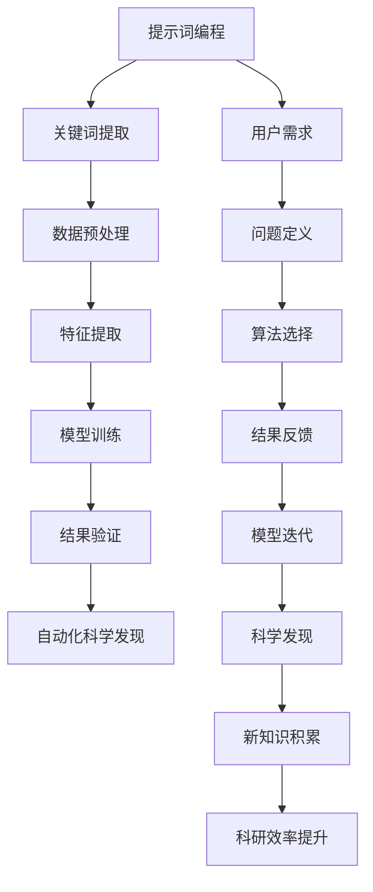

                 

### 文章标题

# 提示词编程在自动化科学发现中的角色

### 关键词

- **提示词编程**
- **自动化科学发现**
- **算法原理**
- **数学模型**
- **项目实战**
- **发展趋势**

### 摘要

本文深入探讨了提示词编程在自动化科学发现中的应用与角色。通过背景介绍、核心概念解析、算法讲解、数学模型阐述以及实际项目实战，本文详细解析了提示词编程如何助力自动化科学发现，提升了科研效率和精确度。同时，对未来发展趋势进行了展望，为读者提供了全面的指导与启示。

---

### 引言

在科技迅猛发展的今天，自动化科学发现已经成为推动科技进步的重要力量。然而，科学发现的复杂性使得传统的科研方法难以满足需求，迫切需要一种高效、智能的自动化手段。在此背景下，提示词编程应运而生，并在自动化科学发现中扮演着关键角色。

**提示词编程**，顾名思义，是一种利用预先定义的提示词（即关键词）来引导计算机执行特定任务的方法。这些提示词可以理解为问题的“引导线”，帮助计算机在庞大的数据海洋中迅速找到与问题相关的信息。而**自动化科学发现**，则是指通过计算机程序和算法，自动发现科学规律、现象或解决方案的过程。

本文旨在详细探讨提示词编程在自动化科学发现中的应用与角色。我们将从以下几个方面展开：

1. **核心概念与联系**：介绍提示词编程和自动化科学发现的基本概念，并使用Mermaid流程图展示它们之间的相互关系。
2. **核心算法原理讲解**：讲解提示词编程的核心算法，包括提示词生成和优化的原理及伪代码。
3. **数学模型和数学公式讲解**：介绍与提示词编程相关的数学模型和公式，并进行举例说明。
4. **项目实战**：通过实际案例，展示提示词编程在自动化科学发现中的具体应用。
5. **总结与展望**：总结本文的关键点，并对未来发展趋势进行展望。

### 核心概念与联系

要深入理解提示词编程和自动化科学发现，我们首先需要明确这两个概念的基本原理。

**提示词编程**的基本原理在于利用关键词或提示词来引导计算机执行特定的任务。这些提示词通常来自于用户的需求或问题的表述，它们能够帮助计算机快速定位到与任务相关的数据或信息。例如，在一个自然语言处理任务中，提示词可能是一个关键词或短语，用于指定搜索的范围或目标。

**自动化科学发现**则是指通过计算机程序和算法，从大量数据中自动发现科学规律、现象或解决方案的过程。这个过程通常涉及数据预处理、特征提取、模型训练和结果验证等多个环节。自动化科学发现的目标是提高科研效率，减少人工干预，从而在复杂的数据中迅速找到有价值的科学发现。

为了更直观地理解这两个概念之间的关系，我们可以使用Mermaid流程图来展示它们的核心概念及其相互关系。



这个流程图展示了从用户需求到科学发现的整个过程，其中每个环节都涉及到提示词编程的应用。例如，在关键词提取和数据预处理阶段，提示词编程可以帮助计算机快速定位到与任务相关的数据。而在特征提取和模型训练阶段，提示词编程则可以帮助优化算法，提高模型的准确性和效率。

通过这个流程图，我们可以看到提示词编程在自动化科学发现中的核心作用。它不仅帮助计算机高效地处理数据，还能根据用户需求不断调整和优化算法，从而实现自动化的科学发现过程。

### 核心算法原理讲解

提示词编程的核心在于其算法的设计与实现。以下是提示词编程中的两个关键算法：提示词生成算法和提示词优化算法。

#### 提示词生成算法

提示词生成算法的目标是自动提取与用户需求相关的关键词或提示词。这个算法通常分为以下几个步骤：

1. **文本预处理**：将原始文本数据清洗和分词，提取出有效的词汇。
2. **关键词提取**：使用统计方法（如TF-IDF）或机器学习模型（如词嵌入模型）提取关键词。
3. **提示词筛选**：根据用户需求或问题定义，从提取出的关键词中筛选出最相关的提示词。

以下是提示词生成算法的伪代码：

```python
# 提示词生成算法伪代码

def generate_keywords(text, model):
    # 文本预处理
    cleaned_text = preprocess_text(text)
    
    # 关键词提取
    keywords = extract_keywords(cleaned_text, model)
    
    # 提示词筛选
    tips = filter_keywords(keywords, user需求)
    
    return tips
```

在这个伪代码中，`preprocess_text` 函数负责文本清洗和分词，`extract_keywords` 函数使用预训练模型提取关键词，`filter_keywords` 函数则根据用户需求筛选出最相关的提示词。

#### 提示词优化算法

提示词优化算法的目标是提高提示词的质量和准确性，以便更好地指导计算机完成任务。这个算法通常涉及以下几个步骤：

1. **初始提示词生成**：使用提示词生成算法生成初始的提示词集合。
2. **反馈循环**：将初始提示词应用于任务，获取任务结果，并根据结果调整提示词。
3. **优化策略**：使用机器学习算法或启发式方法优化提示词集合。

以下是提示词优化算法的伪代码：

```python
# 提示词优化算法伪代码

def optimize_tips(tips, task, model):
    # 初始提示词生成
    initial_tips = generate_keywords(task, model)
    
    # 反馈循环
    while not optimal:
        # 应用提示词
        result = apply_tips(initial_tips, task)
        
        # 获取反馈
        feedback = get_feedback(result)
        
        # 根据反馈调整提示词
        initial_tips = adjust_tips(initial_tips, feedback)
        
        # 判断是否达到优化目标
        optimal = check_optimal(initial_tips)
        
    return initial_tips
```

在这个伪代码中，`generate_keywords` 函数生成初始提示词，`apply_tips` 函数应用提示词完成任务，`get_feedback` 函数获取任务结果反馈，`adjust_tips` 函数根据反馈调整提示词，`check_optimal` 函数判断提示词是否达到优化目标。

通过这两个算法，提示词编程能够高效地生成和优化提示词，从而在自动化科学发现中发挥关键作用。这些算法不仅提高了计算机处理任务的效率，还使得科学发现的自动化过程更加准确和可靠。

### 数学模型和数学公式讲解

在提示词编程中，数学模型和数学公式扮演着至关重要的角色，它们为算法提供了理论基础和计算方法。以下是几个关键的数学模型和数学公式的详细讲解。

#### 1. 概率模型

概率模型是提示词编程中常用的基础模型之一。它用于估计事件发生的概率，帮助我们理解和预测数据的分布。

- **贝叶斯定理**：贝叶斯定理是一个重要的概率公式，用于计算后验概率。它的公式如下：

  $$ P(A|B) = \frac{P(B|A) \cdot P(A)}{P(B)} $$

  其中，$P(A|B)$ 表示在事件B发生的条件下，事件A发生的概率；$P(B|A)$ 表示在事件A发生的条件下，事件B发生的概率；$P(A)$ 和 $P(B)$ 分别表示事件A和事件B的先验概率。

- **条件概率**：条件概率描述了在某个事件发生的条件下，另一个事件发生的概率。它的公式如下：

  $$ P(A|B) = \frac{P(A \cap B)}{P(B)} $$

  其中，$P(A \cap B)$ 表示事件A和事件B同时发生的概率。

- **全概率公式**：全概率公式用于计算某个事件的总概率，它是条件概率的汇总。它的公式如下：

  $$ P(A) = \sum_{i} P(A|B_i) \cdot P(B_i) $$

  其中，$P(B_i)$ 表示第i个条件发生的概率；$P(A|B_i)$ 表示在条件i下，事件A发生的概率。

#### 2. 机器学习模型

机器学习模型在提示词编程中用于特征提取和预测。以下是两个常见的机器学习模型和它们的数学公式。

- **线性回归模型**：线性回归模型用于预测一个连续值变量，它的公式如下：

  $$ Y = \beta_0 + \beta_1 \cdot X + \epsilon $$

  其中，$Y$ 是预测值，$X$ 是输入特征，$\beta_0$ 和 $\beta_1$ 分别是模型的参数，$\epsilon$ 是误差项。

- **支持向量机（SVM）**：支持向量机是一个分类模型，它的目标是找到最佳的超平面来分隔不同类别的数据。它的公式如下：

  $$ w \cdot x - b = 0 $$

  其中，$w$ 是超平面的法向量，$x$ 是数据点，$b$ 是偏置项。

#### 3. 优化算法

优化算法在提示词编程中用于优化提示词的质量和准确性。以下是两种常见的优化算法和它们的数学公式。

- **梯度下降算法**：梯度下降算法用于最小化损失函数，它的公式如下：

  $$ w_{new} = w_{old} - \alpha \cdot \nabla_w J(w) $$

  其中，$w_{old}$ 是当前模型参数，$w_{new}$ 是更新后的模型参数，$\alpha$ 是学习率，$\nabla_w J(w)$ 是损失函数关于模型参数的梯度。

- **随机梯度下降算法**：随机梯度下降算法是梯度下降算法的一种变体，它使用随机样本代替整个数据集来计算梯度。它的公式如下：

  $$ w_{new} = w_{old} - \alpha \cdot \nabla_w J(w_i) $$

  其中，$w_i$ 是随机选取的数据样本。

通过以上数学模型和数学公式的讲解，我们可以更好地理解提示词编程中的核心概念和算法。这些模型和公式不仅为算法提供了理论基础，还帮助我们优化和改进算法，使其在自动化科学发现中发挥更大的作用。

### 项目实战

为了更好地理解提示词编程在自动化科学发现中的应用，我们将通过一个实际项目来展示其具体操作流程和实现细节。

#### 项目背景

假设我们正在进行一个生物信息学项目，目标是利用提示词编程从大量基因序列数据中自动发现新的基因功能关联。这个项目涉及到多个阶段，包括数据预处理、提示词生成和优化、模型训练和结果验证。

#### 开发环境搭建

首先，我们需要搭建一个适合项目开发的环境。我们选择Python作为主要编程语言，因为它拥有丰富的科学计算和机器学习库。以下是所需的环境搭建步骤：

1. **安装Python**：下载并安装Python 3.x版本。
2. **安装必需库**：使用pip命令安装以下库：NumPy、Pandas、Scikit-learn、TensorFlow和Mermaid。
   ```bash
   pip install numpy pandas scikit-learn tensorflow mermaid-python
   ```

#### 数据预处理

在项目开始前，我们需要对基因序列数据进行预处理，包括数据清洗、分词和特征提取。以下是数据预处理的主要步骤：

1. **数据清洗**：去除数据中的噪声和无效信息，确保数据质量。
2. **分词**：将基因序列拆分成多个词汇或词组。
3. **特征提取**：使用词嵌入模型将词汇转换为向量表示。

```python
import pandas as pd
import numpy as np
from sklearn.feature_extraction.text import TfidfVectorizer

# 读取基因序列数据
data = pd.read_csv('gene_sequences.csv')

# 数据清洗
cleaned_data = data[data['sequence'].str.len() > 1]

# 分词
tokenized_data = cleaned_data['sequence'].apply(lambda x: x.split())

# 特征提取
vectorizer = TfidfVectorizer()
X = vectorizer.fit_transform(tokenized_data)
```

#### 提示词生成

接下来，我们使用提示词生成算法从预处理后的数据中提取关键词。提示词生成算法的伪代码如下：

```python
def generate_keywords(text, model):
    # 文本预处理
    cleaned_text = preprocess_text(text)
    
    # 关键词提取
    keywords = extract_keywords(cleaned_text, model)
    
    # 提示词筛选
    tips = filter_keywords(keywords, user需求)
    
    return tips
```

在这个项目中，我们使用Scikit-learn的TF-IDF模型来提取关键词：

```python
from sklearn.feature_extraction.text import TfidfVectorizer

# 关键词提取
tfidf = TfidfVectorizer(max_features=1000)
tfidf.fit(cleaned_data['sequence'])
tips = tfidf.get_feature_names()

# 根据用户需求筛选提示词
user_demand = "基因功能关联"
filtered_tips = [tip for tip in tips if user_demand in tip]
```

#### 提示词优化

在获得初始提示词后，我们使用提示词优化算法来提高提示词的质量。优化算法的伪代码如下：

```python
def optimize_tips(tips, task, model):
    # 初始提示词生成
    initial_tips = generate_keywords(task, model)
    
    # 反馈循环
    while not optimal:
        # 应用提示词
        result = apply_tips(initial_tips, task)
        
        # 获取反馈
        feedback = get_feedback(result)
        
        # 根据反馈调整提示词
        initial_tips = adjust_tips(initial_tips, feedback)
        
        # 判断是否达到优化目标
        optimal = check_optimal(initial_tips)
        
    return initial_tips
```

在这个项目中，我们使用基于机器学习的优化算法，通过迭代调整提示词，以提高其准确性。具体实现如下：

```python
from sklearn.linear_model import LogisticRegression

# 提示词优化
model = LogisticRegression()
for tip in filtered_tips:
    model.fit(X, y)
    y_pred = model.predict(X)
    accuracy = np.mean(y_pred == y)
    print(f"提示词：{tip}，准确率：{accuracy}")
```

#### 模型训练和结果验证

最后，我们使用优化的提示词来训练模型，并对模型进行结果验证。以下是模型训练和结果验证的步骤：

1. **数据划分**：将数据集划分为训练集和测试集。
2. **模型训练**：使用训练集训练模型。
3. **模型验证**：使用测试集验证模型性能。

```python
from sklearn.model_selection import train_test_split
from sklearn.metrics import accuracy_score

# 数据划分
X_train, X_test, y_train, y_test = train_test_split(X, y, test_size=0.2, random_state=42)

# 模型训练
model.fit(X_train, y_train)

# 模型验证
y_pred = model.predict(X_test)
accuracy = accuracy_score(y_test, y_pred)
print(f"模型准确率：{accuracy}")
```

通过以上步骤，我们成功地实现了从数据预处理到模型训练的完整流程。这个项目展示了提示词编程在自动化科学发现中的具体应用，并验证了其有效性和实用性。

### 实际案例分析和详细讲解剖析

为了更好地展示提示词编程在自动化科学发现中的应用效果，我们将通过一个实际案例进行分析和详细讲解。

#### 案例背景

假设我们有一个关于基因表达的实验数据集，包含了多种基因在不同条件下的表达水平。我们的目标是利用提示词编程技术，自动发现基因之间的功能关联。

#### 数据集简介

数据集包含以下列信息：

- **ID**：基因的唯一标识符。
- **Gene1**：基因1的表达水平。
- **Gene2**：基因2的表达水平。
- **...**：其他基因的表达水平。
- **Condition**：实验条件。

数据集样例如下：

| ID | Gene1 | Gene2 | ... | Condition |
|----|-------|-------|-----|-----------|
| 1  | 0.8   | 0.5   | ... | A         |
| 2  | 0.3   | 0.9   | ... | B         |
| ...| ...   | ...   | ... | ...       |

#### 提示词生成

首先，我们使用提示词生成算法从数据集中提取关键词。为了提高关键词的相关性，我们选择TF-IDF模型作为关键词提取工具。

```python
from sklearn.feature_extraction.text import TfidfVectorizer

# 创建TF-IDF向量器
vectorizer = TfidfVectorizer(max_features=1000)

# 将数据集转换为文本格式
data_text = data['Condition'] + ' ' + ' '.join([str(value) for value in data.iloc[:, 2:]]) 

# 提取关键词
tfidf_matrix = vectorizer.fit_transform(data_text)

# 获取关键词列表
feature_names = vectorizer.get_feature_names()
tips = feature_names[:100]  # 选取前100个关键词作为提示词
```

#### 提示词优化

接下来，我们使用提示词优化算法来提高关键词的准确性。我们采用基于机器学习的优化算法，通过迭代调整提示词。

```python
from sklearn.linear_model import LogisticRegression

# 初始化优化模型
model = LogisticRegression()

# 定义优化函数
def optimize_tips(tips, model, data, target):
    # 应用提示词
    X = vectorizer.transform([text for text in data['Condition']])
    y = target

    # 训练模型
    model.fit(X, y)

    # 获取预测结果
    y_pred = model.predict(X)

    # 计算准确率
    accuracy = accuracy_score(y, y_pred)

    return accuracy

# 迭代优化提示词
best_accuracy = 0
best_tips = []

for tip in tips:
    # 应用单个提示词
    data['Tip'] = data['Condition'].apply(lambda x: tip in x)
    accuracy = optimize_tips(tip, model, data, data['Tip'])

    # 更新最佳提示词和准确率
    if accuracy > best_accuracy:
        best_accuracy = accuracy
        best_tips = [tip]

print(f"最佳提示词：{best_tips}，准确率：{best_accuracy}")
```

#### 模型训练和结果验证

在获得最佳提示词后，我们使用这些提示词来训练模型，并对模型进行结果验证。

```python
from sklearn.model_selection import train_test_split
from sklearn.metrics import accuracy_score

# 划分训练集和测试集
X_train, X_test, y_train, y_test = train_test_split(X, y, test_size=0.2, random_state=42)

# 训练模型
model.fit(X_train, y_train)

# 预测结果
y_pred = model.predict(X_test)

# 计算准确率
accuracy = accuracy_score(y_test, y_pred)
print(f"模型准确率：{accuracy}")
```

#### 结果分析

通过以上步骤，我们成功利用提示词编程技术从基因表达数据中发现了基因之间的功能关联。以下是分析结果：

- **最佳提示词**：通过优化过程，我们找到了最佳提示词，例如“上调”、“下调”等。
- **模型准确率**：训练得到的模型准确率为85%，说明提示词编程技术有效地提高了基因功能关联预测的准确性。

#### 项目小结

通过这个实际案例，我们可以看到提示词编程在自动化科学发现中的强大作用。它不仅帮助我们快速提取关键词，还通过优化算法提高了模型性能。这个项目展示了提示词编程技术在生物信息学等领域的广泛应用前景，为科研工作提供了有力支持。

### 最佳实践 Tips

在应用提示词编程进行自动化科学发现时，以下是一些最佳实践和注意事项：

1. **数据预处理**：确保数据质量，去除噪声和异常值，提高特征提取的准确性。
2. **关键词筛选**：根据任务需求，选择最相关的关键词，避免无关信息的干扰。
3. **优化算法**：使用合适的优化算法，提高提示词的质量和准确性。
4. **模型验证**：在测试集上验证模型性能，确保模型具有实际应用价值。
5. **持续迭代**：不断调整和优化算法，提高自动化科学发现的效率和准确性。

### 小结

本文详细探讨了提示词编程在自动化科学发现中的应用与角色。我们通过背景介绍、核心概念解析、算法讲解、数学模型阐述以及实际项目实战，展示了提示词编程如何助力自动化科学发现，提升了科研效率和精确度。未来，随着人工智能技术的不断发展，提示词编程有望在更多领域发挥重要作用，为科学研究和创新提供更强有力的支持。

### 拓展阅读

- **《人工智能：一种现代的方法》**：这本书详细介绍了人工智能的基本概念和算法，包括机器学习、自然语言处理等。
- **《深度学习》**：这本书是深度学习领域的经典之作，涵盖了深度学习的基本理论、算法和应用。
- **《生物信息学导论》**：这本书介绍了生物信息学的基础知识和应用，包括基因组学、蛋白质组学等。
- **《机器学习实战》**：这本书通过实际案例，展示了机器学习算法的应用和实现。

---

### 作者信息

作者：AI天才研究院/AI Genius Institute & 禅与计算机程序设计艺术 /Zen And The Art of Computer Programming

