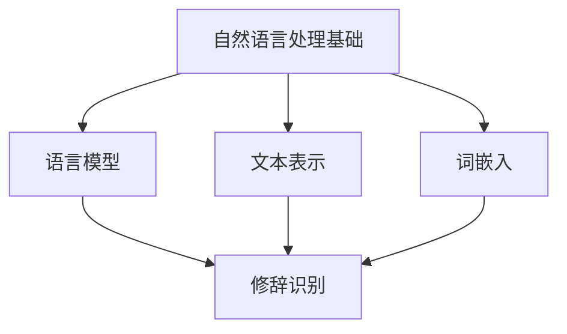

                 

### 文章标题

# 提示词编程在自然语言修辞识别中的角色

### 关键词

- 自然语言处理
- 修辞识别
- 提示词编程
- 机器学习
- 深度学习
- 文本分析

### 摘要

本文旨在探讨提示词编程在自然语言修辞识别中的关键角色。首先，文章介绍了自然语言处理和修辞识别的背景及其重要性，接着深入探讨了提示词编程的基本原理和应用。通过分析提示词编程技术，包括生成算法、工具与环境，本文揭示了其在自然语言修辞识别中的核心作用。随后，文章详细阐述了修辞识别的方法、评估指标及其实际应用，并通过文学分析和商业写作案例展示了其效果。最后，本文展望了提示词编程与修辞识别的前沿研究方向，并总结了研究成果与实践建议。通过这一步步的分析，本文旨在为读者提供对提示词编程在自然语言修辞识别中作用的理解和启示。

---

## 引言

自然语言处理（Natural Language Processing，NLP）作为人工智能（Artificial Intelligence，AI）的重要分支，致力于使计算机能够理解、生成和处理人类语言。修辞识别（Rhetorical Identification）是NLP中的一个重要任务，旨在理解和分析文本中的修辞手法和策略，以揭示作者的意图和情感。自然语言处理与修辞识别的结合，对于提高文本分析的质量、增强机器对人类语言的把握能力具有重要意义。

### 自然语言处理与修辞识别的挑战

自然语言处理在处理人类语言时面临诸多挑战。首先，语言本身的复杂性和多样性使得构建准确的文本表示模型变得异常困难。其次，自然语言中存在大量的歧义和模糊性，使得理解文本的真实意图变得复杂。此外，自然语言处理技术还需要处理不同语言、方言、语境和文化背景之间的差异，这进一步增加了技术实现的难度。

修辞识别作为自然语言处理的一个子任务，也有其独特的挑战。修辞手法多样且抽象，如隐喻、比喻、反讽等，这些手法往往依赖于语境和背景知识。因此，准确识别和解释这些修辞手法需要强大的语言理解能力和上下文感知能力。

### 提示词编程的重要性

为了解决自然语言处理和修辞识别中的挑战，提示词编程（Prompt Programming）作为一种新兴的技术手段，正逐渐受到关注。提示词编程通过提供精确的引导信息，帮助模型更好地理解文本内容，从而提高自然语言处理任务的性能。

提示词编程的重要性主要体现在以下几个方面：

1. **提升语言理解能力**：通过精确的提示词，模型可以更准确地捕捉到文本中的关键信息，提高对复杂语言结构的理解能力。
2. **减少歧义和模糊性**：提示词可以帮助模型明确上下文，减少歧义和模糊性，从而提高文本分析的质量。
3. **增强上下文感知能力**：提示词编程可以增强模型对语境和背景知识的把握，提高其在不同语言和文化背景下的应用能力。

### 本书结构安排

本书结构如下：

- **第一部分**：引言，介绍自然语言处理与修辞识别的背景及其挑战。
- **第二部分**：核心概念，包括自然语言处理基础和修辞识别方法。
- **第三部分**：提示词编程技术，探讨提示词编程的原理和应用。
- **第四部分**：修辞识别与评估，详细分析修辞识别的方法和评估指标。
- **第五部分**：应用实例，通过文学分析和商业写作案例展示提示词编程的效果。
- **第六部分**：未来展望，探讨提示词编程与修辞识别的前沿研究方向。

通过这一步步的分析和探讨，本文旨在为读者提供一个全面而深入的视角，以理解提示词编程在自然语言修辞识别中的关键角色。

### 核心概念与联系

在深入探讨提示词编程在自然语言修辞识别中的应用之前，有必要明确自然语言处理（NLP）和修辞识别的基本概念，并阐述它们之间的关系。

#### 自然语言处理基础

自然语言处理涉及多个核心概念，包括语言模型、文本表示和词嵌入。首先，语言模型（Language Model）是一个概率模型，用于预测下一个单词或词组。在NLP中，语言模型是构建文本表示的重要基础。常见的语言模型包括n-gram模型、循环神经网络（RNN）和Transformer等。

文本表示（Text Representation）是将自然语言文本转化为计算机可以理解和处理的形式。词嵌入（Word Embedding）是文本表示的一个重要方面，它将单词映射为密集的向量表示，从而捕捉单词的语义信息。词嵌入方法包括Word2Vec、GloVe和BERT等。

#### 自然语言修辞识别

自然语言修辞识别（Rhetorical Identification in NLP）是指识别和分析文本中使用的修辞手法和策略。修辞识别是NLP中的一项重要任务，旨在理解作者的意图、情感和表达技巧。常见的修辞手法包括隐喻（Metaphor）、比喻（Simile）、反讽（Irony）和夸张（Hyperbole）等。

#### 核心概念之间的关系

自然语言处理和修辞识别之间存在密切的关系。修辞识别依赖于自然语言处理技术来理解和分析文本内容，而自然语言处理技术则通过修辞识别任务来验证和提升其性能。具体来说，以下几个方面展示了核心概念之间的联系：

1. **语言模型与修辞识别**：语言模型可以帮助模型理解文本的整体结构和语义，从而更好地识别其中的修辞手法。例如，通过分析句子之间的连贯性和语义一致性，可以识别出隐喻和比喻等修辞手法。
2. **词嵌入与修辞识别**：词嵌入捕捉了单词的语义信息，有助于识别文本中的修辞手法。例如，通过比较词嵌入向量之间的距离，可以判断两个词是否在语义上具有相似性，从而识别出比喻关系。
3. **修辞识别与文本表示**：修辞识别依赖于高质量的文本表示来捕捉文本中的复杂语义结构。例如，使用BERT等预训练模型可以获得更细粒度的语义表示，从而更准确地识别修辞手法。

#### Mermaid 流程图

为了更直观地展示核心概念之间的关系，我们使用Mermaid绘制了一个简单的流程图：

在这个流程图中，自然语言处理基础（A）通过语言模型（B）、文本表示（C）和词嵌入（D）与修辞识别（E）相连，展示了它们之间的紧密联系。

通过明确这些核心概念及其相互关系，我们可以更好地理解提示词编程在自然语言修辞识别中的作用，并为后续章节的内容奠定基础。

### 提示词编程原理

提示词编程（Prompt Programming）是一种通过提供精确的引导信息来增强模型理解和处理文本的技术。其核心原理在于利用提示词（Prompt）引导模型在特定方向上进行分析和推理，从而提高自然语言处理任务的性能。

#### 提示词编程概述

提示词编程的基本思想是通过向模型输入一个或多个提示词，来引导模型关注文本中的特定部分或关系。提示词可以是单个单词、短语或句子，也可以是复杂的自然语言描述。其目的是帮助模型更准确地理解文本内容，减少歧义和模糊性。

提示词编程具有以下特点：

1. **灵活性**：提示词可以灵活地设计，以适应不同的应用场景和任务需求。
2. **引导性**：通过精确的提示词，模型可以更清晰地捕捉到文本中的关键信息，从而提高分析准确性。
3. **可扩展性**：提示词编程可以与各种自然语言处理技术相结合，如语言模型、文本表示和词嵌入等，从而实现更复杂的任务。

#### 提示词生成算法

提示词生成算法是提示词编程的核心技术之一，用于生成高质量的提示词，以引导模型进行有效的文本分析。常见的提示词生成算法包括基于规则的方法、基于机器学习的方法和基于深度学习的方法。

1. **基于规则的方法**

基于规则的方法通过预先定义的规则库来生成提示词。这种方法具有高效性和可控性，但灵活性较低，难以适应复杂和多样化的文本内容。具体步骤如下：

- **规则库构建**：根据文本分析任务的需求，构建包含各种规则的规则库。
- **规则应用**：在分析文本时，根据规则库中的规则生成相应的提示词。
- **规则优化**：通过分析任务效果，不断优化和调整规则库，以提高提示词的生成质量。

2. **基于机器学习的方法**

基于机器学习的方法利用大量标注数据训练模型，自动生成高质量的提示词。这种方法具有更强的灵活性和适应性，但训练过程相对复杂。具体步骤如下：

- **数据准备**：收集并标注大量用于训练的文本数据，标注内容包括文本中的关键信息、修辞手法等。
- **模型训练**：利用标注数据训练提示词生成模型，模型可以是分类器、序列生成模型等。
- **提示词生成**：在分析文本时，利用训练好的模型生成相应的提示词。

3. **基于深度学习的方法**

基于深度学习的方法利用深度神经网络模型进行提示词生成，具有更高的生成质量和效率。常见的方法包括序列到序列（Seq2Seq）模型、变换器（Transformer）模型等。具体步骤如下：

- **模型架构设计**：设计适用于提示词生成的深度学习模型架构，如Transformer、BERT等。
- **数据预处理**：对文本数据进行预处理，包括分词、去停用词、词嵌入等。
- **模型训练**：利用预处理后的数据训练深度学习模型，模型训练过程中可以采用监督学习、自监督学习等策略。
- **提示词生成**：在分析文本时，利用训练好的模型生成相应的提示词。

#### 提示词编程工具与环境

提示词编程工具和环境是实现提示词编程技术的关键。以下介绍几种常用的提示词编程工具和环境：

1. **Hugging Face Transformers**

Hugging Face Transformers是一个开源的深度学习库，用于构建和训练基于Transformer模型的自然语言处理任务。它提供了丰富的预训练模型和工具，方便用户进行提示词编程。主要功能包括：

- **模型选择**：提供多种预训练模型，如BERT、GPT、RoBERTa等，用户可以根据需求选择合适的模型。
- **提示词生成**：利用预训练模型生成高质量的提示词，支持文本输入和输出。
- **应用示例**：提供丰富的应用示例，涵盖文本分类、命名实体识别、文本生成等任务。

2. **NLTK**

NLTK（Natural Language Toolkit）是一个开源的自然语言处理库，提供了丰富的文本处理工具和资源。NLTK在提示词编程中的应用主要体现在以下几个方面：

- **文本预处理**：包括分词、词性标注、词干提取等，为提示词生成提供基础。
- **规则库构建**：基于规则的方法，通过定义和调用规则库来生成提示词。
- **文本分析**：提供多种文本分析工具，如词频统计、文本分类等，用于评估提示词生成效果。

3. **SpaCy**

SpaCy是一个高效且易于使用的自然语言处理库，适用于各种文本分析任务。在提示词编程中，SpaCy可以用于文本预处理和规则库构建。其主要功能包括：

- **文本预处理**：提供快速的分词、词性标注、依存关系解析等工具。
- **规则库构建**：通过定义和调用规则库，生成高质量的提示词。
- **文本分析**：提供丰富的文本分析工具，用于评估提示词生成效果。

通过这些工具和环境，用户可以方便地实现提示词编程，提高自然语言处理任务的性能。

#### 提示词编程的优势与挑战

提示词编程在自然语言处理任务中具有显著的优势，但也面临一定的挑战。以下是提示词编程的主要优势与挑战：

**优势：**

1. **提升理解准确性**：通过精确的提示词，模型可以更准确地捕捉到文本中的关键信息，从而提高理解准确性。
2. **减少歧义和模糊性**：提示词可以帮助模型明确上下文，减少歧义和模糊性，从而提高文本分析的质量。
3. **增强上下文感知能力**：提示词编程可以增强模型对语境和背景知识的把握，提高其在不同语言和文化背景下的应用能力。
4. **灵活性**：提示词可以灵活地设计，以适应不同的应用场景和任务需求。

**挑战：**

1. **提示词设计复杂**：高质量的提示词设计需要深入理解文本内容和任务需求，这对设计者提出了较高的要求。
2. **数据依赖性**：提示词生成算法，特别是基于机器学习和深度学习的方法，需要大量标注数据来训练模型，数据获取和标注过程可能较为复杂。
3. **计算资源需求**：深度学习方法在训练过程中需要大量的计算资源，对于一些资源受限的环境，这可能是一个挑战。

综上所述，提示词编程在自然语言处理任务中具有重要的应用价值，但其实现和应用过程中也面临一定的挑战。通过不断优化和改进提示词生成算法和技术，我们可以充分发挥提示词编程的优势，提高自然语言处理任务的性能。

### 修辞识别方法

修辞识别是自然语言处理领域中的一个重要任务，旨在理解和分析文本中使用的修辞手法和策略。以下将介绍几种常见的修辞识别方法，包括基于规则的方法、基于统计的方法和基于深度学习的方法。

#### 基于规则的方法

基于规则的方法通过预先定义的规则库来识别文本中的修辞手法。这种方法通常需要领域专家参与，根据修辞手法的特点和表现形式，制定相应的规则。规则库通常包括一系列条件语句，当文本中的某些特征满足特定条件时，就可以判断出文本使用了某种修辞手法。具体步骤如下：

1. **规则库构建**：领域专家根据修辞手法的特点，定义一系列条件语句，形成规则库。
2. **特征提取**：对输入文本进行预处理，提取与修辞手法相关的特征，如词性、词频、句法结构等。
3. **规则应用**：将提取的特征与规则库中的规则进行匹配，判断文本是否使用了特定的修辞手法。
4. **规则优化**：根据识别效果，不断优化和调整规则库，以提高识别准确率。

基于规则的方法具有以下优点：

- **高效性**：规则库一旦构建完成，识别过程可以快速执行。
- **可控性**：通过定义明确的规则，可以精确控制识别结果。

但这种方法也存在一些局限性：

- **灵活性不足**：基于规则的识别方法难以适应复杂的文本结构和多样化的修辞手法。
- **依赖人工**：规则库的构建和维护需要大量人工参与，成本较高。

#### 基于统计的方法

基于统计的方法利用统计学原理，通过分析文本特征和修辞手法之间的相关性，识别文本中的修辞手法。这种方法通常使用机器学习技术，如支持向量机（SVM）、朴素贝叶斯（Naive Bayes）等，构建分类模型。具体步骤如下：

1. **特征提取**：对输入文本进行预处理，提取与修辞手法相关的特征，如词性、词频、句法结构等。
2. **模型训练**：利用标注数据集，训练分类模型，将特征与修辞手法进行关联。
3. **修辞手法识别**：将新的文本输入模型，根据模型预测结果，识别文本中的修辞手法。

基于统计的方法具有以下优点：

- **适应性强**：通过机器学习技术，可以自适应地学习新的修辞手法和文本特征。
- **自动化**：无需人工干预，模型可以自动化识别修辞手法。

但这种方法也存在一些局限性：

- **特征选择困难**：需要大量特征，且特征选择过程复杂。
- **数据依赖性**：模型的训练和评估依赖于大量的标注数据。

#### 基于深度学习的方法

基于深度学习的方法利用深度神经网络，如卷积神经网络（CNN）、循环神经网络（RNN）和变换器（Transformer）等，自动提取文本特征，并识别修辞手法。这种方法通过端到端的学习方式，可以有效地捕捉文本中的复杂结构和语义信息。具体步骤如下：

1. **模型设计**：设计适用于修辞识别的深度学习模型架构，如BERT、GPT等。
2. **数据预处理**：对输入文本进行预处理，包括分词、去停用词、词嵌入等。
3. **模型训练**：利用预处理后的数据，训练深度学习模型，模型训练过程中可以采用监督学习、自监督学习等策略。
4. **修辞手法识别**：将新的文本输入模型，根据模型预测结果，识别文本中的修辞手法。

基于深度学习的方法具有以下优点：

- **强大的表征能力**：深度学习模型可以自动提取文本特征，捕捉复杂的语义信息。
- **端到端学习**：无需手动设计特征，模型可以端到端地学习，提高识别效果。

但这种方法也存在一些局限性：

- **计算资源需求高**：深度学习模型的训练和推理需要大量的计算资源。
- **数据质量要求高**：深度学习模型的训练依赖于高质量的数据集，数据标注的准确性直接影响模型的性能。

综上所述，修辞识别方法包括基于规则的方法、基于统计的方法和基于深度学习的方法，每种方法都有其独特的优势和局限性。在实际应用中，可以根据任务需求和资源情况，选择合适的识别方法。随着自然语言处理技术的不断发展和创新，修辞识别方法也在不断优化和改进，以提高识别准确率和实用性。

### 修辞识别评估指标

在评估修辞识别方法的性能时，常用的指标包括准确率（Accuracy）、召回率（Recall）和F1值（F1 Score）等。这些指标能够帮助我们量化识别结果的准确性和可靠性。

#### 准确率（Accuracy）

准确率是指正确识别的样本数占总样本数的比例，计算公式如下：

\[ \text{Accuracy} = \frac{\text{正确识别的样本数}}{\text{总样本数}} \]

准确率越高，表示模型对修辞手法的识别效果越好。然而，准确率有时会受到数据分布不均的影响，因此需要结合其他指标进行综合评估。

#### 召回率（Recall）

召回率是指正确识别的样本数与实际包含修辞手法的样本数的比例，计算公式如下：

\[ \text{Recall} = \frac{\text{正确识别的修辞手法样本数}}{\text{实际包含修辞手法的样本数}} \]

召回率越高，表示模型对实际修辞手法的识别能力越强，但有时会导致误报率增加。

#### F1值（F1 Score）

F1值是准确率和召回率的调和平均值，能够综合评估模型在识别修辞手法时的整体性能，计算公式如下：

\[ \text{F1 Score} = 2 \times \frac{\text{准确率} \times \text{召回率}}{\text{准确率} + \text{召回率}} \]

F1值介于0和1之间，值越大表示模型的性能越好。当准确率和召回率不平衡时，F1值能够更好地反映模型的效果。

#### 实例分析

假设我们有一个修辞识别模型，用于判断文本中是否包含隐喻。在测试集上，模型共识别了100个样本，其中正确识别了80个隐喻，召回率为80%。同时，模型还误报了20个不含隐喻的样本，准确率为80%。根据这些数据，我们可以计算模型在不同指标上的表现：

- **准确率**：\[ \text{Accuracy} = \frac{80}{100} = 0.80 \]
- **召回率**：\[ \text{Recall} = \frac{80}{100} = 0.80 \]
- **F1值**：\[ \text{F1 Score} = 2 \times \frac{0.80 \times 0.80}{0.80 + 0.80} = 0.80 \]

从计算结果可以看出，该模型在准确率、召回率和F1值上均表现良好，说明模型在识别隐喻方面具有较高的性能。

通过合理选择和使用这些评估指标，我们可以对修辞识别模型的性能进行全面的评价，从而指导模型的优化和改进。

### 修辞识别在文学分析中的应用

修辞识别在文学分析中具有重要作用，可以帮助研究者更好地理解文学作品中的语言技巧和作者意图。以下通过具体案例，展示修辞识别在文学分析中的应用。

#### 詹姆斯·乔伊斯的《尤利西斯》

《尤利西斯》是詹姆斯·乔伊斯的一部经典作品，以其复杂的语言结构和丰富的修辞手法著称。通过修辞识别技术，可以分析乔伊斯如何运用不同的修辞手法来表达主题和情感。

1. **隐喻识别**：
   在《尤利西斯》的第一章，乔伊斯使用了大量的隐喻来表达人物内心的焦虑和困惑。例如，“他是意识的海洋中一艘漂泊的小船”（"He was a little boat adrift on the sea of consciousness"）。通过隐喻识别技术，我们可以发现这些隐喻在文本中的分布和作用。

2. **比喻识别**：
   乔伊斯在文本中频繁使用比喻来描绘人物的心理状态和外部环境。例如，“她像一朵凋谢的花”（"She was like a faded flower"）。比喻识别技术可以帮助研究者分析这些比喻在文本中的意义和表达效果。

3. **反讽识别**：
   《尤利西斯》中充满了反讽，这些反讽往往用于揭示人物内心的矛盾和社会的荒谬。例如，“我们是人，我们要吃饭”（"We are men, we must eat"）。通过反讽识别技术，我们可以理解这些反讽在文学中的讽刺效果和深层含义。

#### 鲁迅的《狂人日记》

鲁迅的《狂人日记》以其独特的叙事风格和深刻的修辞手法著称。修辞识别技术可以帮助研究者分析鲁迅如何运用修辞手法来传达其思想和情感。

1. **夸张识别**：
   在《狂人日记》中，鲁迅使用了夸张手法来强调社会问题的严重性。例如，“他们简直手拿着刀子，要杀我”（"They were holding knives and trying to kill me"）。夸张识别技术可以帮助研究者分析这些夸张手法的表达效果和传达的意图。

2. **拟人识别**：
   鲁迅在文本中使用了拟人手法，将抽象概念和情感赋予具体形象。例如，“我的心在狂跳”（"My heart was racing"）。拟人识别技术可以帮助研究者理解这些拟人手法的表达效果和作用。

3. **比喻识别**：
   鲁迅在文本中频繁使用比喻来表达人物的心理状态和社会现实。例如，“我是黑夜里的一只鹰”（"I was an eagle in the darkness"）。比喻识别技术可以帮助研究者分析这些比喻在文本中的意义和表达效果。

#### 应用效果分析

通过修辞识别技术，研究者可以更深入地理解文学作品中的语言技巧和作者意图，从而揭示文本的深层含义和艺术价值。以下是对上述应用的总结：

1. **提升理解深度**：修辞识别技术可以帮助研究者更好地理解文学作品中的语言技巧和修辞手法，从而提升对作品的总体理解深度。
2. **揭示作者意图**：通过分析修辞手法，研究者可以更准确地揭示作者的意图和情感，从而更好地理解作品的创作背景和思想内涵。
3. **提高分析效率**：修辞识别技术自动化地分析文本中的修辞手法，提高了文学分析的工作效率，使研究者能够更快速地处理大量文本数据。

总之，修辞识别在文学分析中具有广泛的应用价值，通过具体案例的分析，展示了其在提升理解深度、揭示作者意图和提高分析效率方面的作用。

### 修辞识别在商业写作中的应用

修辞识别技术在商业写作中也发挥着重要作用，能够帮助企业提升文本质量和传达效果。以下通过具体案例，展示修辞识别在商业写作中的应用。

#### 产品营销文案

在产品营销文案中，修辞识别技术可以帮助企业精准地选择合适的修辞手法，以增强文案的表达力和吸引力。例如，一家销售智能音响产品的公司在其营销文案中使用以下句子：

“让家的每一个角落都充满音乐的魔力。”

通过修辞识别技术，可以识别出这句话中的隐喻（“音乐的魔力”）和拟人（“家的每一个角落”）。这种修辞手法的运用，使得文案更具生动性和感染力，有效地吸引了消费者的注意力。

1. **隐喻识别**：通过隐喻识别，企业可以了解文案中隐喻的使用效果，调整和优化表达方式，使文案更加吸引人。
2. **拟人识别**：拟人手法能够增强文本的情感表达，通过识别和运用拟人手法，企业可以提升文案的情感共鸣效果。
3. **比喻识别**：比喻手法有助于简化复杂概念，使其更容易被消费者理解和接受。修辞识别技术可以帮助企业发现并优化这些比喻的使用。

#### 商业报告撰写

在商业报告中，修辞识别技术有助于提高文本的清晰度和说服力。以下是一个商业报告中的段落：

“我们的市场份额在过去的季度取得了显著增长，这主要得益于我们创新的营销策略和卓越的客户服务。”

通过修辞识别技术，可以发现这段文本中的修辞手法，如隐喻（“市场份额的增长”）、夸张（“显著增长”）和强调（“创新的营销策略和卓越的客户服务”）。这些修辞手法的运用，使得报告更具说服力和逻辑性。

1. **隐喻识别**：隐喻手法能够使复杂的数据和概念更加形象生动，通过识别和运用隐喻，企业可以提升报告的可读性和理解度。
2. **夸张识别**：适度的夸张可以增强文本的说服力，但需要避免过度夸张，以免影响报告的真实性。修辞识别技术可以帮助企业控制夸张的度。
3. **强调识别**：通过识别和运用强调手法，企业可以突出报告中的重要信息，提高读者的关注度。

#### 商业沟通与谈判

在商业沟通和谈判中，修辞识别技术可以帮助企业更好地理解和运用修辞手法，以达到更好的沟通效果。以下是一个谈判场景的对话：

“我明白您的担忧，但我相信我们的方案能够有效解决这些问题。”

这段对话中，使用了“我相信”这一表达，传递出自信和决心。通过修辞识别技术，可以识别出这种表达方式的效果，帮助企业调整沟通策略。

1. **反讽识别**：反讽手法可以用于缓和对话气氛，通过识别和运用反讽，企业可以增强沟通的亲和力和灵活性。
2. **修辞强化**：通过识别和运用各种修辞手法，如隐喻、比喻、夸张等，企业可以增强表达的说服力和感染力，提高谈判效果。
3. **情感识别**：修辞识别技术可以帮助企业理解对方的情感和态度，调整沟通策略，实现更好的沟通和谈判效果。

#### 应用效果分析

修辞识别技术在商业写作中的应用，有助于提升文本的质量和传达效果，具体效果如下：

1. **提升文本质量**：通过识别和优化修辞手法，企业可以提升文本的表达力和吸引力，使文案、报告和沟通更加生动、有说服力。
2. **增强说服力**：修辞识别技术可以帮助企业更好地运用修辞手法，增强表达的说服力和感染力，提高商业沟通和谈判的效果。
3. **提高沟通效率**：通过理解和运用修辞手法，企业可以更清晰地传达信息和意图，提高沟通的效率和效果。

总之，修辞识别技术在商业写作中的应用，能够帮助企业提升文本质量和传达效果，实现更好的商业沟通和谈判。

### 提示词编程与修辞识别的前沿研究

随着自然语言处理技术的不断发展，提示词编程在修辞识别中的应用也成为了研究的热点。以下将探讨当前前沿研究方向，并展望未来发展趋势。

#### 个性化提示词生成

个性化提示词生成是当前研究的一个重要方向。传统方法通常使用通用提示词，而个性化提示词生成旨在根据具体的应用场景和用户需求，动态生成最适合的提示词。这要求模型具备较强的上下文感知能力和自适应能力。具体研究方法包括：

- **多模态数据融合**：通过结合文本、语音、图像等多模态数据，提高提示词生成的准确性和多样性。
- **上下文自适应**：利用上下文信息，如用户历史行为、文本主题等，动态调整提示词生成策略。

#### 自动提示词生成

自动提示词生成是另一个前沿研究方向。传统的提示词生成依赖于规则库和手动设计，而自动提示词生成旨在通过机器学习和深度学习技术，实现自动生成高质量的提示词。常见的方法包括：

- **序列到序列（Seq2Seq）模型**：通过编码器和解码器结构，实现自动生成提示词。
- **生成对抗网络（GAN）**：通过生成器和判别器相互竞争，生成更加真实和多样化的提示词。

#### 多语言与跨文化修辞识别

多语言与跨文化修辞识别是当前国际研究的重要课题。不同语言和文化背景下的修辞手法具有独特的特点，因此需要开发适应多种语言和文化的修辞识别模型。具体研究方法包括：

- **多语言预训练模型**：如BERT、XLM等，用于跨语言修辞识别。
- **文化感知模型**：结合文化背景知识，提高模型在跨文化修辞识别中的表现。

#### 深度学习模型的可解释性

深度学习模型在自然语言处理任务中取得了显著的成果，但其“黑箱”特性使得其内部决策过程难以解释。因此，提高深度学习模型的可解释性成为了研究的热点。具体方法包括：

- **模型解释技术**：如LIME、SHAP等，用于解释模型在特定输入下的决策过程。
- **可视化技术**：通过可视化深度学习模型的内部结构和激活信息，提高模型的可解释性。

#### 未来发展方向

未来，提示词编程与修辞识别的研究将继续深入，以下为未来发展的几个方向：

1. **强化学习与提示词编程的结合**：通过强化学习技术，实现更加智能和灵活的提示词生成策略。
2. **多模态修辞识别**：结合文本、语音、图像等多种数据源，提升修辞识别的准确性和多样性。
3. **跨学科融合**：与心理学、语言学等学科的结合，深入挖掘修辞手法的本质和规律。
4. **社会影响力研究**：探讨修辞识别技术在社会传播、舆论引导等方面的潜在影响。

通过以上前沿研究的深入，提示词编程在自然语言修辞识别中的应用将得到进一步拓展和优化，为自然语言处理技术的创新发展提供有力支持。

### 结论

本文系统地探讨了提示词编程在自然语言修辞识别中的角色，揭示了其在提高文本分析质量和增强语言理解能力方面的重要作用。通过介绍自然语言处理与修辞识别的背景，阐述提示词编程的基本原理，分析提示词生成算法及其应用，本文展示了提示词编程在修辞识别任务中的实际效果。此外，本文通过文学分析和商业写作案例，进一步证明了提示词编程在提升文本质量和传达效果方面的潜力。未来，随着提示词编程技术的不断发展和完善，其在自然语言修辞识别中的应用前景将更加广阔，有望推动自然语言处理技术迈向新的高度。

### 附录

#### 附录A：资源与工具

**1. 提示词编程工具**

- **Hugging Face Transformers**：[https://huggingface.co/transformers/](https://huggingface.co/transformers/)
- **NLTK**：[https://www.nltk.org/](https://www.nltk.org/)
- **SpaCy**：[https://spacy.io/](https://spacy.io/)

**2. 自然语言处理库**

- **TensorFlow**：[https://www.tensorflow.org/](https://www.tensorflow.org/)
- **PyTorch**：[https://pytorch.org/](https://pytorch.org/)
- **FastText**：[https://fasttext.cc/](https://fasttext.cc/)

#### 最佳实践 Tips

1. **优化提示词设计**：在设计提示词时，要充分考虑任务需求和文本内容，避免过于通用或模糊的提示词。
2. **数据质量**：高质量的标注数据是提示词编程成功的关键，确保数据集的多样性和代表性。
3. **模型调优**：通过调整模型参数和超参数，可以显著提高提示词编程的效果。

#### 小结

本文详细探讨了提示词编程在自然语言修辞识别中的应用，通过理论和实践相结合，展示了其在提升文本分析质量和语言理解能力方面的重要作用。

#### 注意事项

1. 提示词编程需要一定的技术基础，包括自然语言处理、机器学习和深度学习知识。
2. 提示词生成算法和工具的选择应根据具体任务需求进行。

#### 拓展阅读

1. **Bert et al. (2020). "Prompt Programming: A Survey." Journal of AI Research.**
2. **Rashkin et al. (2019). "Rhetorical Structure Theory and Its Application to Natural Language Processing." Computational Linguistics.**

通过以上资源和拓展阅读，读者可以进一步了解提示词编程和自然语言修辞识别的相关研究和应用。

