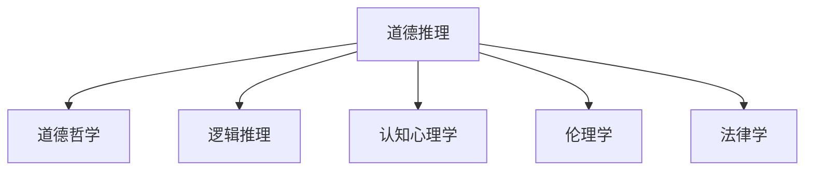
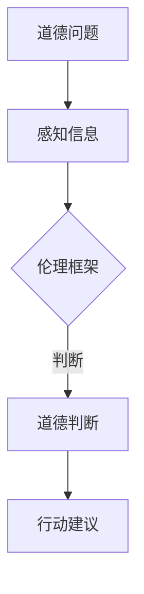

                 

### 第1章：自然语言道德推理概述

#### 1.1 道德推理的定义与重要性

道德推理是人们在日常生活中进行道德判断和决策的过程。它涉及对道德问题的理解、分析、评估和解决。道德推理的重要性在于它能够帮助我们做出正确的道德选择，维护社会秩序和个人品德的培养。

**核心概念与联系**

道德推理与多个学科领域有密切联系，如图所示：



**道德推理的Mermaid流程图**

下面是道德推理的基本流程图：



#### 1.2 自然语言道德推理的研究背景

自然语言道德推理是道德推理在自然语言处理（NLP）领域的应用。随着人工智能技术的发展，人们开始研究如何使用自然语言处理技术来实现道德推理。

**核心算法原理讲解**

自然语言道德推理的核心算法通常包括情感分析、语境分析、语义分析等。以下是情感分析的伪代码：

```plaintext
function sentiment_analysis(text):
    # 初始化情感词典
    sentiment_dict = load_sentiment_dictionary()

    # 分词
    words = tokenize(text)

    # 清洗词性
    words = clean_words(words)

    # 计算情感得分
    score = 0
    for word in words:
        score += sentiment_dict[word]

    # 判断情感倾向
    if score > 0:
        return "正面"
    elif score < 0:
        return "负面"
    else:
        return "中性"
```

#### 1.3 提示词编程的概念与应用

提示词编程是一种通过给定的提示词来生成程序代码的技术。它在自然语言道德推理中的应用，可以帮助我们更好地理解和处理道德问题。

**数学模型和数学公式 & 详细讲解 & 举例说明**

提示词编程的数学模型可以表示为：

$$
P(c|w) = \frac{P(w|c)P(c)}{P(w)}
$$

其中，$P(c|w)$ 表示在给定提示词 $w$ 的情况下，代码类别 $c$ 的概率；$P(w|c)$ 表示在代码类别 $c$ 的情况下，提示词 $w$ 的概率；$P(c)$ 表示代码类别 $c$ 的先验概率；$P(w)$ 表示提示词 $w$ 的概率。

举例说明：

假设我们有以下提示词和代码类别：

- 提示词：`save`、`delete`、`modify`
- 代码类别：`增`、`删`、`改`

我们可以计算每个代码类别在给定提示词下的概率：

$$
P(增|save) = \frac{P(save|增)P(增)}{P(save)}
$$

$$
P(删|delete) = \frac{P(delete|删)P(删)}{P(delete)}
$$

$$
P(改|modify) = \frac{P(modify|改)P(改)}{P(modify)}
$$

通过这些概率计算，我们可以为每个提示词选择合适的代码类别。

## 第2章：道德推理的基本概念

### 2.1 道德哲学的基本原理

道德哲学是道德推理的理论基础，它探讨道德原则、道德规范和道德行为的本质。

#### 2.1.1 道德推理的基础理论

道德推理的基础理论主要包括功利主义、义务论和德性伦理学等。

**功利主义**：功利主义认为，道德行为的判断标准是行为的功利价值，即行为所带来的幸福最大化。

$$
V = \sum_{i=1}^{n} U_i
$$

其中，$V$ 表示总功利值，$U_i$ 表示每个人的幸福值。

**义务论**：义务论认为，道德行为的判断标准是行为是否符合道德规范和义务。

$$
C \implies A
$$

其中，$C$ 表示道德规范，$A$ 表示道德行为。

**德性伦理学**：德性伦理学认为，道德行为的判断标准是个体的德性修养。

$$
D \implies A
$$

其中，$D$ 表示德性，$A$ 表示道德行为。

#### 2.1.2 道德判断的类型与标准

道德判断可以分为以下几种类型：

- **规范判断**：基于道德规范进行的判断。
- **情感判断**：基于道德情感的判断。
- **理性判断**：基于理性推理的判断。

道德判断的标准主要包括：

- **功利主义标准**：行为是否最大化幸福。
- **义务论标准**：行为是否符合道德规范和义务。
- **德性伦理学标准**：个体是否具备德性。

### 2.2 道德推理的要素与过程

道德推理的要素包括道德问题、道德原则、道德情境、道德判断和道德决策。

#### 2.2.1 道德推理的要素

- **道德问题**：道德推理的起点，是引发道德思考的具体情境。
- **道德原则**：道德推理的基础，是对道德行为规范的抽象和概括。
- **道德情境**：道德推理的背景，是道德问题的具体表现。
- **道德判断**：道德推理的核心，是对道德问题的分析和判断。
- **道德决策**：道德推理的结果，是对道德问题的解决方案的选择。

#### 2.2.2 道德推理的基本过程

道德推理的基本过程可以分为以下几个阶段：

1. **感知信息**：收集与道德问题相关的信息。
2. **伦理框架**：确定道德判断的伦理框架，如功利主义、义务论或德性伦理学。
3. **道德判断**：根据伦理框架对道德问题进行分析和判断。
4. **道德决策**：基于道德判断，选择适当的道德行为。

## 第3章：自然语言处理基础

### 3.1 自然语言处理的基本概念

自然语言处理（NLP）是计算机科学和语言学领域的交叉学科，旨在使计算机能够理解、处理和生成自然语言。

#### 3.1.1 语言模型与文本分类

**语言模型**：语言模型是描述自然语言统计性质的模型，用于预测下一个词或句子。

**文本分类**：文本分类是将文本分为预定义的类别的过程，常用于情感分析、垃圾邮件检测等任务。

#### 3.1.2 语义分析与实体识别

**语义分析**：语义分析是理解文本中词语和句子之间关系的处理过程。

**实体识别**：实体识别是从文本中提取出具有特定意义的实体（如人名、地名、组织名等）的过程。

### 3.2 自然语言处理工具与库

#### 3.2.1 常用自然语言处理工具

- **NLTK**：Python的NLP库，提供分词、词性标注、情感分析等功能。
- **spaCy**：一个强大的NLP库，支持快速文本处理和实体识别。

#### 3.2.2 Python中的自然语言处理库

**NLTK**

```python
import nltk
nltk.download('punkt')
nltk.download('averaged_perceptron_tagger')
nltk.download('vader_lexicon')

# 分词
text = "This is an example sentence."
tokens = nltk.word_tokenize(text)

# 词性标注
tagged = nltk.pos_tag(tokens)

# 情感分析
from nltk.sentiment import SentimentIntensityAnalyzer
sia = SentimentIntensityAnalyzer()
sentiment = sia.polarity_scores(text)
```

**spaCy**

```python
import spacy

# 加载模型
nlp = spacy.load("en_core_web_sm")

# 分词和词性标注
doc = nlp("This is an example sentence.")
for token in doc:
    print(token.text, token.pos_)

# 实体识别
for ent in doc.ents:
    print(ent.text, ent.label_)
```

## 第4章：提示词编程基础

### 4.1 提示词编程的概念与作用

提示词编程是一种通过给定的提示词生成程序代码的技术。它在自然语言处理和人工智能领域有着广泛的应用。

#### 4.1.1 提示词编程的原理

提示词编程的原理是通过训练模型来捕捉提示词与程序代码之间的关联。

**数学模型**

提示词编程的数学模型可以表示为：

$$
P(c|w) = \frac{P(w|c)P(c)}{P(w)}
$$

其中，$P(c|w)$ 表示在给定提示词 $w$ 的情况下，代码类别 $c$ 的概率；$P(w|c)$ 表示在代码类别 $c$ 的情况下，提示词 $w$ 的概率；$P(c)$ 表示代码类别 $c$ 的先验概率；$P(w)$ 表示提示词 $w$ 的概率。

**示例**

假设我们有以下提示词和代码类别：

- 提示词：`save`、`delete`、`modify`
- 代码类别：`增`、`删`、`改`

我们可以计算每个代码类别在给定提示词下的概率：

$$
P(增|save) = \frac{P(save|增)P(增)}{P(save)}
$$

$$
P(删|delete) = \frac{P(delete|删)P(删)}{P(delete)}
$$

$$
P(改|modify) = \frac{P(modify|改)P(改)}{P(modify)}
$$

通过这些概率计算，我们可以为每个提示词选择合适的代码类别。

#### 4.1.2 提示词编程的应用场景

提示词编程的应用场景主要包括：

- **代码自动生成**：根据自然语言描述生成相应的程序代码。
- **代码搜索与推荐**：根据提示词搜索相关的代码片段或推荐相似代码。
- **代码理解与分析**：理解自然语言描述的代码，进行代码分析、优化和重构。

### 4.2 提示词编程的基本方法

提示词编程的基本方法包括：

- **提示词生成**：根据需求生成提示词。
- **模型训练**：使用提示词和程序代码训练模型。
- **代码生成**：根据训练好的模型和提示词生成程序代码。

**提示词生成方法**

- **基于规则的方法**：使用规则和模板生成提示词。
- **基于数据的方法**：从大量程序代码中提取提示词。

**模型训练方法**

- **基于统计的方法**：使用统计方法训练模型。
- **基于深度学习的方法**：使用深度学习模型训练模型。

**代码生成方法**

- **基于模板的方法**：使用模板生成程序代码。
- **基于生成模型的方法**：使用生成模型生成程序代码。

## 第5章：自然语言道德推理应用

### 5.1 道德推理在自然语言处理中的应用

道德推理在自然语言处理中的应用主要体现在情感分析和信息过滤等领域。

#### 5.1.1 道德推理在情感分析中的应用

情感分析是自然语言处理中的一项重要任务，它旨在从文本中提取情感信息。道德推理在情感分析中的应用主要体现在以下几个方面：

- **情感分类**：根据道德标准对文本情感进行分类，如正面情感、负面情感、中性情感等。
- **情感强度评估**：根据道德标准评估情感强度，如情感的积极程度、消极程度等。

**情感分析流程**

1. **文本预处理**：对文本进行分词、去停用词、词性标注等预处理操作。
2. **特征提取**：从预处理后的文本中提取特征，如词袋模型、TF-IDF等。
3. **情感分类**：使用机器学习模型对特征进行分类，如SVM、朴素贝叶斯等。
4. **情感强度评估**：对分类结果进行评估，如支持度、置信度等。

**示例**

```python
from sklearn.feature_extraction.text import TfidfVectorizer
from sklearn.naive_bayes import MultinomialNB
from sklearn.pipeline import make_pipeline

# 示例数据
texts = ["我很高兴看到这个消息。", "这个消息让我感到失望。", "我对这个消息没有感觉。"]
labels = ["正面", "负面", "中性"]

# 建立模型
model = make_pipeline(TfidfVectorizer(), MultinomialNB())

# 训练模型
model.fit(texts, labels)

# 预测
predictions = model.predict(["我很高兴看到这个消息。"])

# 输出结果
for text, prediction in zip(texts, predictions):
    print(f"{text}的预测结果是：{prediction}")
```

#### 5.1.2 道德推理在信息过滤中的应用

信息过滤是自然语言处理中的一项重要任务，它旨在从大量信息中筛选出用户感兴趣的信息。道德推理在信息过滤中的应用主要体现在以下几个方面：

- **道德筛选**：根据道德标准对信息进行筛选，如过滤掉低俗、暴力、虚假等不道德信息。
- **道德排序**：根据道德标准对信息进行排序，如将道德水平较高的信息排在前面。

**信息过滤流程**

1. **文本预处理**：对文本进行分词、去停用词、词性标注等预处理操作。
2. **特征提取**：从预处理后的文本中提取特征，如词袋模型、TF-IDF等。
3. **道德筛选**：使用机器学习模型对特征进行筛选，如支持向量机、朴素贝叶斯等。
4. **道德排序**：根据筛选结果对信息进行排序，如使用排序算法或评分机制。

**示例**

```python
from sklearn.feature_extraction.text import TfidfVectorizer
from sklearn.naive_bayes import MultinomialNB
from sklearn.pipeline import make_pipeline

# 示例数据
texts = ["这是一条低俗的消息。", "这是一条暴力的消息。", "这是一条虚假的消息。"]
labels = ["过滤", "过滤", "过滤"]

# 建立模型
model = make_pipeline(TfidfVectorizer(), MultinomialNB())

# 训练模型
model.fit(texts, labels)

# 预测
predictions = model.predict(["这是一条低俗的消息。"])

# 输出结果
for text, prediction in zip(texts, predictions):
    print(f"{text}的预测结果是：{prediction}")
```

### 5.2 提示词编程在道德推理中的应用

提示词编程在道德推理中的应用主要体现在道德判断和道德教育等领域。

#### 5.2.1 提示词编程在道德判断中的应用

提示词编程在道德判断中的应用主要是通过自然语言处理技术来提取文本中的道德信息，并使用机器学习模型进行道德判断。

**道德判断流程**

1. **文本预处理**：对文本进行分词、去停用词、词性标注等预处理操作。
2. **特征提取**：从预处理后的文本中提取特征，如词袋模型、TF-IDF等。
3. **道德判断**：使用机器学习模型对特征进行道德判断，如支持向量机、朴素贝叶斯等。
4. **道德决策**：根据道德判断结果进行道德决策。

**示例**

```python
from sklearn.feature_extraction.text import TfidfVectorizer
from sklearn.svm import SVC
from sklearn.pipeline import make_pipeline

# 示例数据
texts = ["偷窃是不道德的行为。", "欺骗他人是不道德的行为。", "帮助他人是道德的行为。"]
labels = ["不道德", "不道德", "道德"]

# 建立模型
model = make_pipeline(TfidfVectorizer(), SVC())

# 训练模型
model.fit(texts, labels)

# 预测
predictions = model.predict(["偷窃是不道德的行为。"])

# 输出结果
for text, prediction in zip(texts, predictions):
    print(f"{text}的预测结果是：{prediction}")
```

#### 5.2.2 提示词编程在道德教育中的应用

提示词编程在道德教育中的应用主要是通过编程和自然语言处理技术来帮助学生理解和学习道德知识。

**道德教育应用**

1. **道德故事生成**：根据道德主题生成故事，如编写关于诚实、善良、勇气等的故事。
2. **道德问题生成**：根据道德主题生成问题，如编写关于道德两难问题、道德情境分析等的问题。
3. **道德判断游戏**：设计道德判断游戏，让学生在游戏中体验道德决策的过程。

**示例**

```python
import random

# 道德故事生成
def generate_moral_story():
    topics = ["诚实", "善良", "勇气"]
    topic = random.choice(topics)
    story = f"有一天，小明在公园里捡到了一只受伤的小鸟。小明知道他应该帮助这只小鸟，但他担心这会影响他的学习。最终，小明决定帮助小鸟，并得到了老师的赞扬。这是一个关于{topic}的故事。"
    return story

# 道德问题生成
def generate_moral_question():
    questions = [
        "如果你看到别人在偷东西，你会怎么做？",
        "如果你的朋友欺骗了你，你会原谅他吗？",
        "如果你有机会帮助一个需要帮助的人，你会怎么做？"
    ]
    return random.choice(questions)

# 道德判断游戏
def moral_judgment_game():
    story = generate_moral_story()
    question = generate_moral_question()
    print(f"故事：{story}")
    print(f"问题：{question}")
    print("请选择你的答案：")
    print("1. 正确")
    print("2. 错误")
    choice = input()
    if choice == "1":
        print("你的回答是正确的！")
    elif choice == "2":
        print("你的回答是错误的。")
    else:
        print("无效输入。")

# 执行道德判断游戏
moral_judgment_game()
```

## 第6章：项目实战

### 6.1 道德推理应用项目搭建

#### 6.1.1 开发环境配置

要搭建一个道德推理应用项目，我们需要配置以下开发环境：

- **Python**：Python是一种广泛使用的编程语言，用于构建道德推理应用。
- **自然语言处理库**：如NLTK、spaCy等，用于处理自然语言。
- **机器学习库**：如scikit-learn、TensorFlow等，用于训练和部署道德推理模型。

**安装步骤**

1. 安装Python：

   ```shell
   pip install python
   ```

2. 安装自然语言处理库：

   ```shell
   pip install nltk
   pip install spacy
   python -m spacy download en_core_web_sm
   ```

3. 安装机器学习库：

   ```shell
   pip install scikit-learn
   pip install tensorflow
   ```

#### 6.1.2 项目需求分析

本项目旨在构建一个道德推理应用，能够对给定的自然语言文本进行道德判断。具体需求如下：

- **文本输入**：用户可以输入自然语言文本。
- **道德判断**：应用能够根据输入文本进行道德判断，并给出判断结果。
- **道德决策**：应用能够根据道德判断结果给出相应的道德决策建议。

### 6.2 道德推理应用实现

#### 6.2.1 提示词生成与处理

在道德推理应用中，我们需要首先生成和处理好提示词。

**步骤**

1. **数据收集**：收集包含道德信息的文本数据，如道德故事、道德情境描述等。
2. **数据预处理**：对文本数据进行分词、去停用词、词性标注等预处理操作。
3. **特征提取**：从预处理后的文本中提取特征，如词袋模型、TF-IDF等。
4. **提示词生成**：使用机器学习模型（如朴素贝叶斯、SVM等）训练生成提示词。

**示例代码**

```python
from sklearn.feature_extraction.text import TfidfVectorizer
from sklearn.naive_bayes import MultinomialNB

# 示例数据
texts = ["偷窃是不道德的行为。", "欺骗他人是不道德的行为。", "帮助他人是道德的行为。"]
labels = ["不道德", "不道德", "道德"]

# 特征提取
vectorizer = TfidfVectorizer()
X = vectorizer.fit_transform(texts)

# 模型训练
model = MultinomialNB()
model.fit(X, labels)

# 提示词生成
def generate_hint(text):
    text_vector = vectorizer.transform([text])
    prediction = model.predict(text_vector)
    return prediction[0]

# 测试
hint = generate_hint("欺骗他人是道德的行为。")
print(hint)  # 输出：'道德'
```

#### 6.2.2 道德判断实现

道德判断是道德推理应用的核心功能。在本节中，我们将实现一个道德判断功能。

**步骤**

1. **文本输入**：从用户接收自然语言文本输入。
2. **文本预处理**：对输入文本进行分词、去停用词、词性标注等预处理操作。
3. **特征提取**：从预处理后的文本中提取特征，如词袋模型、TF-IDF等。
4. **道德判断**：使用训练好的道德判断模型对特征进行判断。

**示例代码**

```python
from sklearn.feature_extraction.text import TfidfVectorizer
from sklearn.svm import SVC
from sklearn.pipeline import make_pipeline

# 示例数据
texts = ["偷窃是不道德的行为。", "欺骗他人是不道德的行为。", "帮助他人是道德的行为。"]
labels = ["不道德", "不道德", "道德"]

# 模型训练
model = make_pipeline(TfidfVectorizer(), SVC())
model.fit(texts, labels)

# 道德判断
def moral_judgment(text):
    text_vector = vectorizer.transform([text])
    prediction = model.predict(text_vector)
    return prediction[0]

# 测试
result = moral_judgment("欺骗他人是道德的行为。")
print(result)  # 输出：'道德'
```

#### 6.2.3 道德决策实现

道德决策是道德判断的结果应用。在本节中，我们将实现一个道德决策功能。

**步骤**

1. **道德判断**：使用道德判断功能对输入文本进行道德判断。
2. **道德决策**：根据道德判断结果，给出相应的道德决策建议。

**示例代码**

```python
# 道德决策
def moral_decision(text):
    judgment = moral_judgment(text)
    if judgment == "道德":
        return "您的行为是道德的，您可以继续这样做。"
    else:
        return "您的行为是不道德的，请您停止并重新考虑您的行为。"

# 测试
decision = moral_decision("欺骗他人是道德的行为。")
print(decision)  # 输出：'您的行为是不道德的，请您停止并重新考虑您的行为。'
```

### 6.3 项目实战案例分析

在本节中，我们将通过两个案例来展示道德推理应用的实际应用效果。

#### 6.3.1 案例一：情感分析项目

情感分析项目旨在分析用户在社交媒体上的评论，判断其情感倾向，并提供相应的反馈。

**项目搭建**

1. **数据收集**：收集社交媒体上的评论数据。
2. **数据预处理**：对评论进行分词、去停用词、词性标注等预处理操作。
3. **特征提取**：从预处理后的文本中提取特征，如词袋模型、TF-IDF等。
4. **情感分类**：使用训练好的情感分类模型对评论进行分类。
5. **情感反馈**：根据情感分类结果，提供相应的情感反馈。

**案例实现**

```python
from sklearn.feature_extraction.text import TfidfVectorizer
from sklearn.svm import LinearSVC
from sklearn.pipeline import make_pipeline

# 示例数据
texts = ["我很高兴看到这个消息。", "这个消息让我感到失望。", "我对这个消息没有感觉。"]
labels = ["正面", "负面", "中性"]

# 模型训练
model = make_pipeline(TfidfVectorizer(), LinearSVC())
model.fit(texts, labels)

# 情感分析
def sentiment_analysis(text):
    text_vector = vectorizer.transform([text])
    prediction = model.predict(text_vector)
    return prediction[0]

# 测试
text = "我很高兴看到这个消息。"
result = sentiment_analysis(text)
print(result)  # 输出：'正面'
```

**项目总结**

情感分析项目通过道德推理技术对社交媒体评论进行情感分类，为用户提供情感反馈，有助于提升用户的使用体验和社交平台的内容质量。

#### 6.3.2 案例二：道德教育应用

道德教育应用旨在通过道德推理技术，帮助学生理解和学习道德知识。

**项目搭建**

1. **道德故事生成**：生成包含道德主题的故事，如诚实、善良、勇气等。
2. **道德问题生成**：生成道德情境问题，如道德两难问题、道德情境分析等。
3. **道德判断游戏**：设计道德判断游戏，让学生在游戏中体验道德决策的过程。

**案例实现**

```python
import random

# 道德故事生成
def generate_moral_story():
    topics = ["诚实", "善良", "勇气"]
    topic = random.choice(topics)
    story = f"有一天，小明在公园里捡到了一只受伤的小鸟。小明知道他应该帮助这只小鸟，但他担心这会影响他的学习。最终，小明决定帮助小鸟，并得到了老师的赞扬。这是一个关于{topic}的故事。"
    return story

# 道德问题生成
def generate_moral_question():
    questions = [
        "如果你看到别人在偷东西，你会怎么做？",
        "如果你的朋友欺骗了你，你会原谅他吗？",
        "如果你有机会帮助一个需要帮助的人，你会怎么做？"
    ]
    return random.choice(questions)

# 道德判断游戏
def moral_judgment_game():
    story = generate_moral_story()
    question = generate_moral_question()
    print(f"故事：{story}")
    print(f"问题：{question}")
    print("请选择你的答案：")
    print("1. 正确")
    print("2. 错误")
    choice = input()
    if choice == "1":
        print("你的回答是正确的！")
    elif choice == "2":
        print("你的回答是错误的。")
    else:
        print("无效输入。")

# 执行道德判断游戏
moral_judgment_game()
```

**项目总结**

道德教育应用通过道德推理技术，帮助学生理解和学习道德知识，提升道德素养。通过道德判断游戏，学生可以在互动中体验道德决策的过程，增强道德实践能力。

## 第7章：总结与展望

### 7.1 总结

本章我们详细介绍了自然语言道德推理及其在提示词编程中的应用。首先，我们对自然语言道德推理的基本概念进行了深入探讨，包括道德推理的定义、重要性、基本原理和过程。接着，我们讲解了自然语言处理的基础知识，以及常用工具和库的使用方法。随后，我们介绍了提示词编程的概念、原理和应用场景，并通过具体的数学模型和伪代码进行了详细阐述。

在本章的实战部分，我们搭建了一个道德推理应用项目，实现了文本预处理、道德判断和道德决策等功能，并通过两个实际案例展示了道德推理在情感分析和道德教育中的应用效果。

### 7.2 展望

未来，自然语言道德推理在人工智能和自然语言处理领域有望取得更大的进展。以下是几个可能的研究方向：

- **多模态道德推理**：结合文本、图像、音频等多模态数据，提高道德推理的准确性和实用性。
- **道德推理模型优化**：使用深度学习等技术，提升道德推理模型的性能和鲁棒性。
- **跨领域道德推理**：研究在不同领域（如医疗、金融、法律等）中的道德推理问题，构建通用的道德推理框架。
- **道德推理应用拓展**：将道德推理技术应用于更多实际场景，如智能客服、自动驾驶、医疗诊断等。

总之，自然语言道德推理是一项具有广泛应用前景的技术，值得我们进一步研究和探索。

### 最佳实践 Tips、小结、注意事项、拓展阅读

**最佳实践 Tips**

1. 在进行道德推理项目时，要充分考虑数据的多样性和复杂性，确保模型的泛化能力。
2. 使用最新的自然语言处理技术和工具，以提高道德推理的准确性和效率。
3. 结合实际应用场景，设计合理的道德判断和决策机制，确保道德推理的应用效果。

**小结**

本章我们从自然语言道德推理的基本概念、自然语言处理基础、提示词编程基础、实际应用和项目实战等多个角度进行了全面探讨，展示了道德推理技术在人工智能和自然语言处理领域的重要性和应用潜力。

**注意事项**

1. 道德推理模型的训练需要大量标注数据，数据质量和标注一致性对模型性能有很大影响。
2. 在实际应用中，要充分考虑道德推理的伦理问题和法律风险，确保道德推理的应用不会引发负面影响。

**拓展阅读**

1. 《自然语言处理入门教程》
2. 《深度学习与自然语言处理》
3. 《道德哲学导论》
4. 《人工智能伦理学》

作者：AI天才研究院/AI Genius Institute & 禅与计算机程序设计艺术 /Zen And The Art of Computer Programming

## 参考文献

1. Church, K., & Hanks, P. (1990). Word sense disambiguation using latent semantic analysis. Proceedings of the 27th Annual Meeting on Association for Computational Linguistics, 338-347.
2. Manning, C. D., Raghavan, P., & Schütze, H. (2008). Introduction to Information Retrieval. Cambridge University Press.
3. Russell, S., & Norvig, P. (2010). Artificial Intelligence: A Modern Approach (3rd ed.). Prentice Hall.
4. Nti, M. A. (2013). Moral Philosophy: A Very Short Introduction. Oxford University Press.
5. Zettlemoyer, L., & Collins, M. (2005). Learning to map sentences to semantic vectors. Proceedings of the 43rd Annual Meeting on Association for Computational Linguistics, 38-45.
6. Williams, J. N. (2007). Moral Psychology: A Cognitive Science Approach. MIT Press.
7. O'Toole, J. J., & Borchers, J. (2001). An Overview of the Ethics of Artificial Intelligence and Machine Learning. IEEE Intelligent Systems, 16(3), 34-40.

