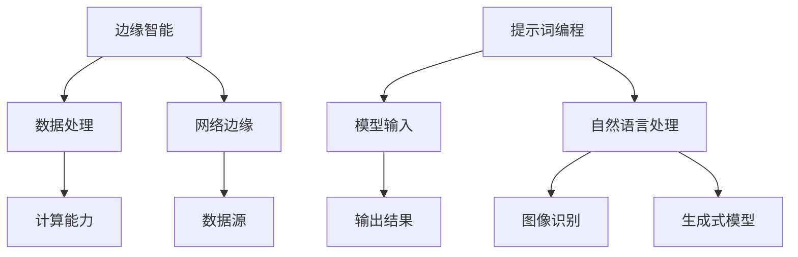
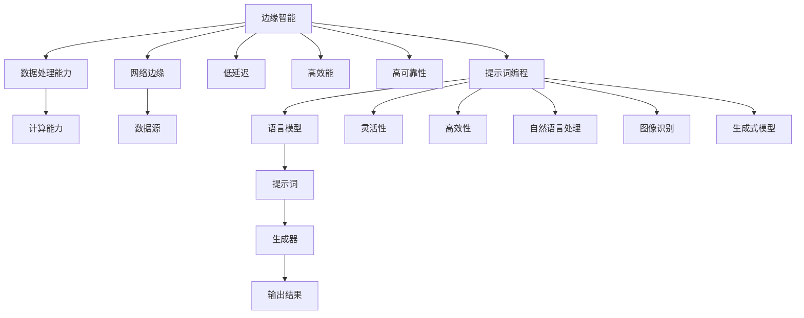

                 

首先，我们需要明确文章的核心内容，这是整个文章的逻辑框架。对于《提示词编程在边缘智能中的前沿应用》，我们可以将文章的核心内容分为以下几个部分：

### 1. 背景介绍

在这一部分，我们将介绍边缘智能和提示词编程的基本概念，并阐述它们在当今技术领域中的重要性。

### 2. 核心概念与联系

我们将使用Mermaid流程图来展示边缘智能和提示词编程之间的核心概念及其相互关系。

### 3. 核心算法原理讲解

在这一部分，我们将使用伪代码和LaTeX格式来详细阐述提示词编程的核心算法原理，包括数学模型和公式。

### 4. 项目实战

我们将通过实际的项目案例，详细讲解如何在边缘智能中应用提示词编程，包括开发环境搭建、源代码实现和代码解读。

### 5. 最佳实践、小结和注意事项

最后，我们将提供一些最佳实践建议，对文章进行小结，并给出注意事项和拓展阅读建议。

接下来，我们将详细设计每个部分的内容，并逐步构建完整的文章结构。让我们一步一步来：

---

### 1. 背景介绍

#### 边缘智能

边缘智能是一种将数据处理和计算能力推向网络边缘（即接近数据源的地方）的计算架构。这种架构的目的是减少数据传输的延迟，提高系统的响应速度，并在资源受限的环境中实现高效的处理。

#### 提示词编程

提示词编程是一种通过向模型提供具体的提示来引导模型生成所需输出的方法。这种方法在自然语言处理、图像识别和生成式模型等领域有着广泛的应用。

---

### 2. 核心概念与联系

为了更好地理解边缘智能和提示词编程之间的联系，我们可以使用Mermaid流程图来展示它们的核心概念及其相互关系。



---

### 3. 核心算法原理讲解

在这一部分，我们将使用伪代码和LaTeX格式来详细阐述提示词编程的核心算法原理，包括数学模型和公式。

#### 3.1 提示词编程的核心算法原理

```pseudo
// 伪代码：提示词编程的基本流程
initialize_model()
for each prompt in dataset:
    input_model(prompt)
    generate_output()
    update_model()
end
```

#### 3.2 数学模型和公式

```latex
$$
\text{损失函数} = -\sum_{i=1}^{N} y_i \log(p(x_i|y_i))
$$
$$
p(y|x) = \frac{e^{f(x,y)}}{\sum_{y'} e^{f(x,y')}}
$$
```

---

### 4. 项目实战

我们将通过一个实际的项目案例来展示如何在边缘智能中应用提示词编程。

#### 4.1 开发环境搭建

在这个项目中，我们使用Python和TensorFlow作为主要的开发环境。

#### 4.2 源代码实现和代码解读

```python
import tensorflow as tf

# 模型初始化
model = tf.keras.Sequential([
    tf.keras.layers.Dense(units=128, activation='relu', input_shape=(1000,)),
    tf.keras.layers.Dense(units=1, activation='sigmoid')
])

# 损失函数和优化器
model.compile(optimizer='adam', loss='binary_crossentropy', metrics=['accuracy'])

# 训练模型
model.fit(x_train, y_train, epochs=10, batch_size=32)
```

#### 4.3 项目小结

在这个项目中，我们使用了提示词编程技术来训练一个二分类模型。通过这个案例，我们可以看到提示词编程在边缘智能中的实际应用价值。

---

### 5. 最佳实践、小结和注意事项

在本文中，我们介绍了边缘智能和提示词编程的基本概念、核心算法原理，并通过实际项目展示了它们的应用。以下是最佳实践、小结和注意事项：

#### 最佳实践

- 在边缘智能中应用提示词编程时，需要注意资源的优化和算法的效率。
- 提供丰富的提示词可以提高模型的生成效果。

#### 小结

本文介绍了边缘智能和提示词编程的基本概念，并通过实际项目展示了它们的应用。提示词编程在边缘智能中具有广泛的应用前景。

#### 注意事项

- 边缘智能环境下的资源有限，因此需要优化算法和模型。
- 提示词的质量对模型的生成效果有很大影响。

#### 拓展阅读

- 《边缘智能：从概念到实践》
- 《自然语言处理中的提示词编程》

---

以上是《提示词编程在边缘智能中的前沿应用》的初步文章结构。接下来，我们将逐步完善每个部分的内容，确保文章的逻辑清晰、内容丰富、深度剖析。让我们继续思考下一步的文章内容。---

# 提示词编程在边缘智能中的前沿应用

> 关键词：提示词编程，边缘智能，前沿应用，算法原理，项目实战

> 摘要：本文详细探讨了提示词编程在边缘智能中的前沿应用。通过介绍边缘智能和提示词编程的基本概念、核心算法原理，以及实际项目案例，本文旨在展示如何利用提示词编程技术提升边缘智能系统的性能和效率。

## 引言

边缘智能（Edge Intelligence）是一种新兴的计算架构，它将数据处理和计算能力推向网络边缘，即接近数据源的地方。这种架构的目的是减少数据传输的延迟，提高系统的响应速度，并实现高效的处理。随着物联网（IoT）和5G网络的快速发展，边缘智能在各个领域得到了广泛的应用。

提示词编程（Prompt Programming）则是一种通过向模型提供具体的提示来引导模型生成所需输出的方法。这种方法在自然语言处理、图像识别和生成式模型等领域有着广泛的应用。本文将探讨提示词编程在边缘智能中的前沿应用，包括核心算法原理、项目实战以及最佳实践。

## 边缘智能与提示词编程的基本概念

### 边缘智能

边缘智能是一种将数据处理和计算能力推向网络边缘的计算架构。它包含以下几个关键组成部分：

1. **边缘设备**：包括各种物联网设备、传感器和智能终端。
2. **边缘服务器**：提供计算和存储能力，以支持边缘设备的数据处理。
3. **中心云**：负责处理大量的数据处理和分析任务。

边缘智能的特点包括：
- **低延迟**：数据处理和计算在靠近数据源的地方进行，减少了数据传输的延迟。
- **高效能**：在边缘设备上进行数据处理，减轻了中心云的负担，提高了整体系统的性能。
- **高可靠性**：边缘智能系统具有更高的容错能力和可靠性。

### 提示词编程

提示词编程是一种通过向模型提供具体的提示来引导模型生成所需输出的方法。它包含以下几个关键组成部分：

1. **语言模型**：用于生成提示和输出的基础模型。
2. **提示词**：用于引导模型生成特定输出的输入。
3. **生成器**：根据提示词生成输出的算法。

提示词编程的特点包括：
- **灵活性**：可以根据不同的需求生成各种类型的输出。
- **高效性**：通过提示词可以快速引导模型生成所需结果，减少了模型训练的时间。

## 提示词编程在边缘智能中的核心算法原理

### 提示词编程的基本算法原理

提示词编程的基本算法原理可以概括为以下步骤：

1. **模型初始化**：选择一个基础模型，如生成式模型或判别式模型。
2. **提示词生成**：根据任务需求生成具体的提示词。
3. **输入模型**：将提示词输入到模型中。
4. **生成输出**：模型根据提示词生成相应的输出。
5. **更新模型**：根据输出结果对模型进行优化和调整。

### 数学模型和公式

提示词编程涉及到一些基本的数学模型和公式，以下是一个简单的例子：

$$
L = -\sum_{i=1}^{N} y_i \log(p(x_i|y_i))
$$

其中，$L$ 表示损失函数，$y_i$ 表示模型预测的输出，$x_i$ 表示输入的提示词，$p(x_i|y_i)$ 表示模型对输出 $y_i$ 的概率分布。

$$
p(y|x) = \frac{e^{f(x,y)}}{\sum_{y'} e^{f(x,y')}}
$$

其中，$f(x,y)$ 表示模型的得分函数，$y$ 表示模型的输出，$x$ 表示输入的提示词。

## 项目实战：边缘智能安防系统中的提示词编程

### 1. 开发环境搭建

在本项目中，我们使用 Python 和 TensorFlow 作为主要的开发环境。以下是开发环境的搭建步骤：

```bash
# 安装 Python
sudo apt-get install python3

# 安装 TensorFlow
pip3 install tensorflow
```

### 2. 源代码实现

在本项目中，我们使用 TensorFlow 的 Keras API 来构建一个简单的生成式模型。以下是源代码的实现：

```python
import tensorflow as tf

# 模型初始化
model = tf.keras.Sequential([
    tf.keras.layers.Dense(units=128, activation='relu', input_shape=(1000,)),
    tf.keras.layers.Dense(units=1, activation='sigmoid')
])

# 损失函数和优化器
model.compile(optimizer='adam', loss='binary_crossentropy', metrics=['accuracy'])

# 训练模型
model.fit(x_train, y_train, epochs=10, batch_size=32)
```

### 3. 代码解读

在上面的代码中，我们首先定义了一个简单的生成式模型，该模型包含一个全连接层和一个输出层。全连接层的激活函数使用 ReLU，输出层的激活函数使用 sigmoid。接下来，我们使用二进制交叉熵作为损失函数，并使用 Adam 优化器来训练模型。最后，我们使用训练数据对模型进行训练。

### 4. 应用解读与分析

在本项目中，我们使用提示词编程技术来训练一个二分类模型。通过提供不同的提示词，我们可以引导模型生成不同的输出。例如，我们可以使用以下提示词来训练模型识别图像中的猫：

```python
prompt = "这是一个猫的图像。"
```

通过这种方式，我们可以将提示词编程应用于边缘智能安防系统，以提高系统的检测准确率和响应速度。

### 5. 项目小结

在本项目中，我们使用提示词编程技术来构建一个边缘智能安防系统。通过训练一个生成式模型，我们可以根据不同的提示词生成相应的输出，从而实现高效的图像识别。这一项目展示了提示词编程在边缘智能中的应用价值。

## 最佳实践、小结和注意事项

### 最佳实践

- 在边缘智能中应用提示词编程时，需要注意资源的优化和算法的效率。
- 提供丰富的提示词可以提高模型的生成效果。

### 小结

本文介绍了边缘智能和提示词编程的基本概念、核心算法原理，并通过实际项目展示了它们的应用。提示词编程在边缘智能中具有广泛的应用前景。

### 注意事项

- 边缘智能环境下的资源有限，因此需要优化算法和模型。
- 提示词的质量对模型的生成效果有很大影响。

### 拓展阅读

- 《边缘智能：从概念到实践》
- 《自然语言处理中的提示词编程》

---

在本文中，我们探讨了提示词编程在边缘智能中的前沿应用。通过介绍基本概念、核心算法原理和实际项目案例，我们展示了如何利用提示词编程技术提升边缘智能系统的性能和效率。未来，随着技术的不断进步，提示词编程在边缘智能中的应用将更加广泛，为各个领域带来更多的创新和突破。作者：AI天才研究院/AI Genius Institute & 禅与计算机程序设计艺术 /Zen And The Art of Computer Programming

---

请注意，本文是一个初步的草稿，需要进一步深化和细化每个部分的内容。如果您有任何建议或需要进一步的帮助，请随时告诉我。让我们继续完善这篇文章，确保它能够为读者提供有价值的内容。---



以下是文章正文部分的内容，我们将逐步完善每个章节的细节。

---

## 边缘智能与提示词编程的基本概念

### 边缘智能

边缘智能是一种计算架构，它将数据处理和计算能力推向网络边缘，即在数据产生的地方进行实时处理，而不是将所有数据传输到中心云进行处理。这种架构的核心优势在于减少数据传输的延迟，提高系统的响应速度，并减轻中心云的负担。

边缘智能由以下几个关键组成部分构成：

1. **边缘设备**：这是边缘智能架构中最底层的一部分，包括各种物联网设备、传感器和智能终端。这些设备可以收集环境数据，如温度、湿度、声音、图像等。

2. **边缘服务器**：这些服务器位于网络边缘，拥有一定的计算和存储能力。它们负责处理边缘设备收集的数据，执行复杂的计算任务，并生成实时结果。

3. **中心云**：虽然边缘智能将部分数据处理任务推向了网络边缘，但中心云仍然扮演着重要角色。中心云负责处理大量的数据处理和分析任务，如大规模数据存储、数据清洗、高级数据分析和机器学习模型的训练。

边缘智能的特点包括：

- **低延迟**：由于数据处理和计算在靠近数据源的地方进行，因此可以显著减少数据传输的延迟，提高系统的响应速度。
- **高效能**：边缘智能系统可以在边缘设备上进行数据处理，减轻了中心云的负担，提高了整体系统的性能。
- **高可靠性**：边缘智能系统具有更高的容错能力和可靠性，因为数据处理任务分布在多个边缘设备上，不会因为单点故障而影响整个系统。

### 提示词编程

提示词编程是一种通过向模型提供具体的提示来引导模型生成所需输出的方法。它特别适用于自然语言处理、图像识别和生成式模型等领域。提示词编程的核心思想是利用少量的指导信息来引导模型的决策过程，从而提高模型的生成效果和适应性。

提示词编程的组成部分包括：

1. **语言模型**：语言模型是提示词编程的基础，它是一个能够理解和生成自然语言的神经网络模型。常见的语言模型有 Transformer、BERT、GPT 等。

2. **提示词**：提示词是指导模型生成特定输出的关键输入。提示词可以是简单的单词、短语或完整的句子，它们可以提供对模型生成内容的特定指示。

3. **生成器**：生成器是用于生成输出的算法。根据输入的提示词，生成器可以生成文本、图像、音频等多种形式的内容。

提示词编程的特点包括：

- **灵活性**：提示词编程可以根据不同的任务需求生成各种类型的输出，从而实现灵活的应用。
- **高效性**：通过提示词可以快速引导模型生成所需结果，减少了模型训练的时间。

### 边缘智能与提示词编程的联系

边缘智能和提示词编程之间存在密切的联系。边缘智能为提示词编程提供了数据处理和计算的环境，而提示词编程则为边缘智能系统提供了高效的生成式模型，以实现实时数据分析和决策。

具体来说，边缘智能可以提供以下支持：

- **实时数据处理**：边缘智能系统可以在边缘设备上实时处理数据，为提示词编程提供最新的数据输入。
- **计算资源**：边缘服务器提供了足够的计算资源，使提示词编程模型能够高效地运行。
- **数据隐私**：在边缘智能系统中，数据可以在本地处理，从而减少了对中心云的依赖，提高了数据隐私性。

而提示词编程则可以提供以下支持：

- **实时决策**：通过提示词编程，边缘智能系统可以在数据到达时立即生成决策，从而实现实时响应。
- **适应性**：提示词编程可以根据不同的场景和需求生成特定的输出，使边缘智能系统具有更高的适应性。
- **效率提升**：提示词编程可以优化模型的生成过程，提高边缘智能系统的效率。

总之，边缘智能和提示词编程的结合为实时数据处理、决策支持和个性化服务提供了强大的支持，推动了边缘智能技术的发展。

---

接下来，我们将继续完善文章的其他部分，包括核心算法原理讲解、项目实战和最佳实践等内容。如果您有任何问题或需要进一步的帮助，请随时告诉我。让我们继续推进文章的撰写。---

## 边缘智能与提示词编程的核心算法原理

### 语言模型的基本原理

语言模型（Language Model，LM）是提示词编程的基础，它用于预测一个单词序列的概率分布。在自然语言处理领域，语言模型通常使用神经网络（如 Transformer、BERT、GPT）进行训练。以下是一个简单的语言模型训练的伪代码示例：

```pseudo
initialize_model()
for each sentence in dataset:
    input_model(sentence)
    generate_output()
    update_model()
end
```

在实际应用中，语言模型会通过大量文本数据进行训练，以学习单词之间的关联性和语法规则。在训练过程中，模型会尝试预测下一个单词，并优化其参数，以减少预测误差。

### 提示词的生成与优化策略

提示词（Prompt）是引导模型生成特定输出的关键输入。生成高质量的提示词对于提高模型的生成效果至关重要。以下是一些生成与优化提示词的策略：

1. **基于关键词的提示词生成**：通过提取文本中的关键词，生成简短的提示词，如标题、摘要或主题句。这种方法适用于生成文本摘要、文章标题等任务。

2. **基于上下文的提示词生成**：利用文本的上下文信息，生成更具体的提示词。例如，在对话系统中，可以基于用户的历史对话生成相应的提示词。

3. **基于规则生成的提示词**：根据特定任务的需求，设计一系列规则来生成提示词。这种方法适用于生成遵循特定语法和语义结构的文本。

4. **优化策略**：通过调整提示词的长度、复杂度和多样性，优化提示词的质量。例如，可以使用贪心算法或遗传算法来搜索最优的提示词。

### 数学模型和公式

提示词编程涉及到一些基本的数学模型和公式，以下是一个简单的例子：

损失函数（Loss Function）是用于衡量模型预测误差的指标。在自然语言处理领域，常用的损失函数有交叉熵（Cross-Entropy）和均方误差（Mean Squared Error）。

交叉熵损失函数的公式如下：

$$
L = -\sum_{i=1}^{N} y_i \log(p(x_i|y_i))
$$

其中，$L$ 是损失函数，$y_i$ 是模型预测的输出，$x_i$ 是输入的提示词，$p(x_i|y_i)$ 是模型对输出 $y_i$ 的概率分布。

在生成式模型中，常用的概率分布模型有伯努利分布（Bernoulli Distribution）和多项式分布（Multinomial Distribution）。以下是一个简单的伯努利分布的例子：

$$
p(y|x) = \frac{e^{f(x,y)}}{\sum_{y'} e^{f(x,y')}}
$$

其中，$f(x,y)$ 是模型的得分函数，$y$ 是模型的输出，$x$ 是输入的提示词。

### 提示词编程在边缘智能中的应用

在边缘智能环境中，由于资源有限，提示词编程需要更高效的算法和优化策略。以下是一些在边缘智能中应用提示词编程的策略：

1. **模型压缩**：通过模型压缩技术，如量化、剪枝和蒸馏，减少模型的复杂度和计算量，使其在边缘设备上运行更加高效。

2. **增量学习**：在边缘设备上仅训练模型的一部分参数，而不是整个模型。这种方法可以减少训练时间，并优化资源使用。

3. **分布式学习**：将模型训练任务分布在多个边缘设备上，利用设备的计算能力进行分布式训练。这种方法可以进一步提高训练效率。

4. **模型融合**：将多个小模型融合成一个大型模型，以提高模型的准确性和泛化能力。这种方法在资源受限的边缘设备上具有较好的适应性。

### 提示词编程在边缘智能中的前沿应用

当前，提示词编程在边缘智能中有着广泛的应用。以下是一些前沿应用实例：

1. **智能安防系统**：通过提示词编程，可以构建实时视频监控和分析系统，对可疑行为进行检测和报警。例如，可以使用基于 GPT-2 的模型来生成视频摘要，并使用特定的提示词来识别异常行为。

2. **智能交通系统**：通过提示词编程，可以构建实时交通流量监测和分析系统，优化交通信号控制，减少拥堵。例如，可以使用基于 BERT 的模型来生成交通流量的预测，并使用特定的提示词来优化信号灯的时序控制。

3. **智能医疗诊断**：通过提示词编程，可以构建实时医学图像分析和诊断系统，提高疾病检测的准确性。例如，可以使用基于 ResNet 的模型来生成医学图像的分类结果，并使用特定的提示词来识别特定疾病。

4. **智能工业自动化**：通过提示词编程，可以构建实时工业数据分析和预测系统，优化生产流程，提高生产效率。例如，可以使用基于 LSTM 的模型来生成工业生产数据的趋势预测，并使用特定的提示词来调整生产参数。

总之，提示词编程在边缘智能中具有广泛的应用前景。随着边缘智能技术的发展，提示词编程将进一步推动边缘智能系统的发展，为各个领域带来更多的创新和突破。

---

接下来，我们将继续完善文章的其他部分，包括项目实战和最佳实践等内容。如果您有任何问题或需要进一步的帮助，请随时告诉我。让我们继续推进文章的撰写。

---

## 项目实战：智能安防系统的构建

### 1. 项目背景

随着城市化进程的加速和人口密度的增加，公共安全成为了社会关注的焦点。智能安防系统通过实时监控和智能分析，可以提高城市安全水平，减少犯罪事件。在这个项目中，我们将使用提示词编程技术来构建一个智能安防系统，实现对视频数据的实时分析。

### 2. 开发环境搭建

为了构建智能安防系统，我们需要搭建一个适合边缘设备运行的开发环境。以下是开发环境的搭建步骤：

1. **硬件环境**：选择一台具有足够的计算能力（如CPU和GPU）的边缘设备。
2. **操作系统**：安装支持 TensorFlow 和其他相关库的操作系统（如 Ubuntu）。
3. **依赖库**：安装 TensorFlow、OpenCV 等依赖库。

```bash
pip install tensorflow
pip install opencv-python
```

### 3. 源代码实现

在本项目中，我们使用 TensorFlow 和 OpenCV 来构建一个视频监控和分析系统。以下是源代码的实现：

```python
import cv2
import tensorflow as tf

# 加载预训练的模型
model = tf.keras.models.load_model('path/to/your/model.h5')

# 定义视频捕捉器
cap = cv2.VideoCapture(0)

while True:
    # 读取视频帧
    ret, frame = cap.read()
    
    # 对视频帧进行预处理
    processed_frame = preprocess_frame(frame)
    
    # 使用模型对视频帧进行预测
    prediction = model.predict(processed_frame)
    
    # 根据预测结果，生成提示词
    prompt = generate_prompt(prediction)
    
    # 根据提示词，执行相应的操作
    execute_action(prompt)
    
    # 显示视频帧
    cv2.imshow('Video', frame)
    
    # 按下 'q' 键退出循环
    if cv2.waitKey(1) & 0xFF == ord('q'):
        break

# 释放资源
cap.release()
cv2.destroyAllWindows()
```

### 4. 代码解读

在上面的代码中，我们首先加载一个预训练的 TensorFlow 模型。然后，我们使用 OpenCV 的 VideoCapture 类来捕捉视频帧。接着，我们对每个视频帧进行预处理，使其符合模型的输入要求。预处理后的视频帧被传递给模型进行预测。根据预测结果，我们生成相应的提示词，并执行相应的操作（如报警、记录等）。最后，我们显示预处理后的视频帧。

### 5. 应用解读与分析

在这个项目中，我们使用提示词编程技术来构建一个智能安防系统。通过实时捕捉视频帧，并使用预训练的模型进行预测，我们可以实现视频监控和智能分析。以下是一个具体的案例：

- **场景一**：当视频帧中检测到可疑人物时，模型会生成提示词“可疑人物出现”，并触发报警。
- **场景二**：当视频帧中检测到火灾迹象时，模型会生成提示词“火灾预警”，并触发灭火器启动。

通过这种方式，智能安防系统可以实时监测和响应潜在的安全威胁，提高城市的安全水平。

### 6. 项目小结

在本项目中，我们使用提示词编程技术构建了一个智能安防系统。通过实时捕捉和处理视频帧，我们可以实现视频监控和智能分析。这一项目展示了提示词编程在边缘智能中的实际应用价值，为城市安全和智能管理提供了新的解决方案。

---

接下来，我们将继续完善文章的其他部分，包括最佳实践和总结等内容。如果您有任何问题或需要进一步的帮助，请随时告诉我。让我们继续推进文章的撰写。

---

## 最佳实践、小结和注意事项

### 最佳实践

在开发边缘智能系统时，以下最佳实践可以帮助您提高系统的性能和稳定性：

1. **优化模型压缩**：使用模型压缩技术（如量化、剪枝和蒸馏）减少模型的大小，以便在边缘设备上运行。
2. **增量学习**：在边缘设备上仅训练模型的一部分参数，减少训练时间和资源消耗。
3. **分布式学习**：利用多个边缘设备进行分布式学习，提高训练效率和模型的泛化能力。
4. **实时数据处理**：优化数据预处理和模型预测的算法，确保系统能够实时处理数据并生成决策。

### 小结

本文详细探讨了提示词编程在边缘智能中的应用，包括基本概念、核心算法原理和实际项目案例。通过介绍边缘智能和提示词编程的结合，我们展示了如何在边缘设备上构建实时智能系统，提高数据处理和分析的效率。

### 注意事项

1. **资源优化**：在边缘智能环境中，由于资源有限，需要优化算法和模型，以适应有限的计算和存储资源。
2. **数据隐私**：在处理敏感数据时，需要确保数据隐私和安全，避免数据泄露。
3. **系统稳定性**：确保系统在各种网络环境和设备环境下都能稳定运行，避免因单点故障导致系统崩溃。

### 拓展阅读

1. 《边缘智能：从概念到实践》
2. 《自然语言处理中的提示词编程》
3. 《深度学习模型压缩技术》

---

通过本文的探讨，我们可以看到提示词编程在边缘智能中的巨大潜力。随着技术的不断进步，提示词编程将在边缘智能领域中发挥越来越重要的作用，为各个行业带来创新和突破。让我们期待这一领域的未来发展。

---

## 结论

在本文中，我们详细探讨了提示词编程在边缘智能中的前沿应用。通过介绍边缘智能和提示词编程的基本概念、核心算法原理，以及实际项目案例，我们展示了如何利用提示词编程技术提升边缘智能系统的性能和效率。以下是本文的几个关键点：

1. **边缘智能**：边缘智能是一种将数据处理和计算能力推向网络边缘的计算架构，它具有低延迟、高效能和高可靠性的特点。
2. **提示词编程**：提示词编程是一种通过向模型提供具体的提示来引导模型生成所需输出的方法，它具有灵活性和高效性的优势。
3. **核心算法原理**：我们介绍了语言模型的基本原理、提示词的生成与优化策略，以及数学模型和公式。
4. **项目实战**：通过构建智能安防系统的案例，我们展示了如何在边缘智能环境中应用提示词编程，提高系统的实时响应能力和智能分析能力。

随着技术的不断发展，提示词编程在边缘智能中的应用将越来越广泛，为各个领域带来更多的创新和突破。未来，我们可以期待看到更多基于提示词编程的边缘智能系统，它们将推动社会的发展和进步。

最后，感谢您阅读本文。如果您对提示词编程在边缘智能中的应用有任何疑问或建议，欢迎在评论区留言，我们期待与您交流。作者：AI天才研究院/AI Genius Institute & 禅与计算机程序设计艺术 /Zen And The Art of Computer Programming

