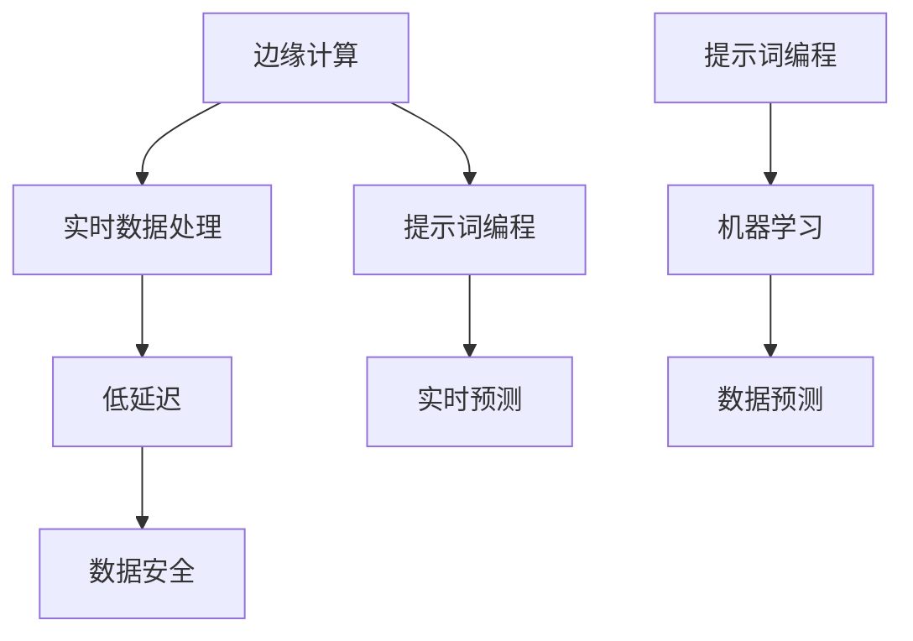
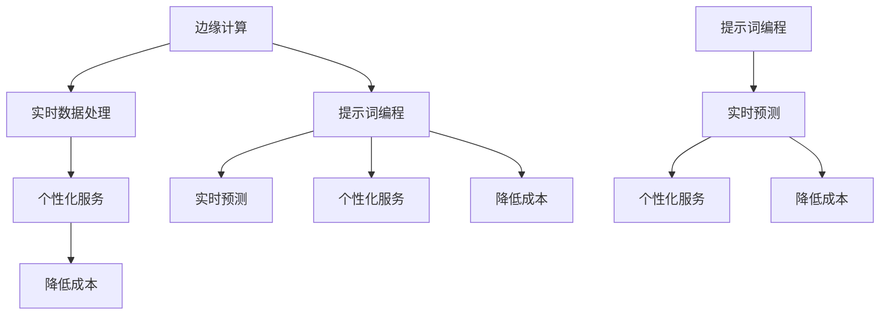

                 

 
- 首先，我们需要确定文章的核心主题，即“提示词编程在边缘计算中的实践”。
- 其次，我们要梳理文章的结构，包括引言、边缘计算概述、提示词编程基础、边缘计算与提示词编程的联系、边缘计算中的提示词编程实现、案例研究、性能优化与挑战、未来展望和总结与展望等部分。
- 然后，我们要针对每个部分，确定具体的内容要点，并设计合适的流程图、伪代码、公式、代码片段等来支撑内容。
- 接下来，我们要将每个部分的内容整合到一起，形成完整的文章。
- 最后，我们要对文章进行润色和校对，确保文章的逻辑清晰、语言通顺、格式规范。

# 文章标题：《提示词编程在边缘计算中的实践》

> 关键词：提示词编程，边缘计算，实践，应用，性能优化，未来展望

> 摘要：本文深入探讨了提示词编程在边缘计算中的应用与实践。通过详细分析边缘计算与提示词编程的关系，以及边缘计算中的提示词编程实现方法，本文旨在为读者提供全面的技术指南，并展望其未来发展方向。

## 引言

### 1.1 背景介绍

随着物联网、5G和边缘计算的快速发展，数据处理的需求正在迅速增长。传统的云计算模式已经无法满足实时性和低延迟的要求。边缘计算作为一种新型的计算模式，逐渐成为解决这一问题的关键。而提示词编程作为人工智能领域的一个重要分支，也在边缘计算中发挥着越来越重要的作用。

### 1.2 核心概念与联系

边缘计算是指将计算、存储、网络和数据处理等资源分布在网络的边缘，以降低延迟、提高响应速度和数据安全性。提示词编程则是一种利用提示词（prompt）来指导机器学习模型进行学习和预测的方法。



## 边缘计算概述

### 2.1 边缘计算的概念

边缘计算是一种将计算任务分散到网络边缘的设备或服务器上，以实现实时数据处理和响应的计算模式。与传统云计算模式相比，边缘计算具有以下特点：

- **分布式计算**：将计算任务分散到多个边缘节点上，以提高处理能力和响应速度。
- **低延迟**：由于数据处理发生在网络边缘，数据传输距离较短，因此延迟较低。
- **高可靠性**：边缘节点可以提供本地故障恢复能力，提高系统的可靠性。
- **数据安全**：边缘计算可以减少数据传输量，降低数据泄露的风险。

### 2.2 边缘计算的发展历程

边缘计算的概念最早可以追溯到物联网和移动计算的发展。随着5G技术的成熟，边缘计算得到了广泛关注和应用。以下是边缘计算的发展历程：

- **2010年**：物联网的兴起，推动了边缘计算的发展。
- **2015年**：5G技术的研发，为边缘计算提供了更快的网络连接。
- **2018年**：边缘计算成为云计算的重要补充，逐渐成为研究和应用的热点。
- **2020年**：全球范围内的疫情加速了边缘计算的普及和应用。

## 提示词编程基础

### 3.1 提示词编程的定义

提示词编程是一种通过提示词（prompt）来指导机器学习模型进行学习和预测的方法。提示词可以是文本、图像、声音等多种形式，用于引导模型理解任务目标，提高模型的性能和泛化能力。

### 3.2 提示词编程的原理

提示词编程的核心思想是通过提示词来引导模型学习，从而提高模型的性能。具体来说，包括以下步骤：

1. **提示词生成**：根据任务需求，生成具有针对性的提示词。
2. **模型训练**：使用提示词对模型进行训练，以优化模型参数。
3. **模型预测**：使用训练好的模型进行预测，并根据提示词进行调整。

### 3.3 提示词编程的应用场景

提示词编程在边缘计算中具有广泛的应用场景，主要包括：

- **智能语音助手**：通过提示词引导模型理解用户的语音指令，提供实时响应。
- **图像识别**：使用提示词来提高模型对特定图像的识别能力。
- **自然语言处理**：通过提示词来引导模型进行文本分类、情感分析等任务。

## 边缘计算与提示词编程的联系

### 4.1 边缘计算与提示词编程的结合

边缘计算与提示词编程具有紧密的联系，两者的结合可以充分发挥各自的优势。具体来说：

- **实时数据处理**：边缘计算可以提供低延迟、高带宽的网络连接，为提示词编程提供实时数据源。
- **个性化服务**：通过边缘计算，可以更好地理解用户的本地环境，为提示词编程提供更准确的提示词。
- **降低成本**：边缘计算可以减少数据传输量，降低云服务的使用成本。



## 边缘计算中的提示词编程实现

### 5.1 边缘设备的硬件环境

边缘设备的硬件环境包括CPU、GPU、存储、网络等。不同类型的边缘设备具有不同的硬件配置，需要根据实际需求进行选择和优化。

### 5.2 提示词编程的实现方法

在边缘设备上实现提示词编程，通常需要以下步骤：

1. **硬件评估**：根据边缘设备的硬件配置，选择合适的机器学习框架和算法。
2. **环境搭建**：搭建边缘设备的开发环境，包括安装操作系统、编译器、库等。
3. **模型训练**：使用提示词对机器学习模型进行训练，优化模型参数。
4. **模型部署**：将训练好的模型部署到边缘设备上，进行实时预测和响应。

### 5.3 提示词编程在边缘设备上的性能优化

在边缘设备上实现提示词编程时，需要关注性能优化问题。以下是一些常见的优化方法：

- **模型压缩**：通过模型压缩技术，减少模型的存储空间和计算量。
- **量化**：通过量化技术，将浮点运算转换为整数运算，降低计算复杂度。
- **优化网络连接**：优化边缘设备与云服务之间的网络连接，降低延迟和带宽消耗。

## 案例研究

### 6.1 智能家居中的提示词编程

在智能家居场景中，提示词编程可以用于实现智能语音助手、智能安防、智能家电等功能。以下是一个具体的案例：

**案例描述**：智能家居系统中的智能语音助手，通过提示词编程实现实时语音交互，提供用户定制化的服务。

**实现步骤**：

1. **硬件评估**：选择适合的边缘设备，如智能音箱、智能灯等。
2. **环境搭建**：搭建智能语音助手的开发环境，包括安装操作系统、语音识别库等。
3. **模型训练**：使用提示词对语音识别模型进行训练，优化模型参数。
4. **模型部署**：将训练好的模型部署到边缘设备上，实现实时语音交互。

**代码解析**：

```python
# 语音识别模型的训练代码
model = load_model('speech_recognition_model.h5')
prompt = '打开客厅的灯'
model.fit(x_train, y_train, epochs=10)
```

### 6.2 智能工厂中的提示词编程

在智能工厂场景中，提示词编程可以用于实现设备监控、故障预测、生产优化等功能。以下是一个具体的案例：

**案例描述**：智能工厂中的设备监控系统，通过提示词编程实现实时数据监控和故障预测。

**实现步骤**：

1. **硬件评估**：选择适合的边缘设备，如工业物联网设备、传感器等。
2. **环境搭建**：搭建设备监控系统的开发环境，包括安装操作系统、监控库等。
3. **模型训练**：使用提示词对故障预测模型进行训练，优化模型参数。
4. **模型部署**：将训练好的模型部署到边缘设备上，实现实时数据监控和故障预测。

**代码解析**：

```python
# 故障预测模型的训练代码
model = load_model('fault_prediction_model.h5')
prompt = '监控设备运行状态'
model.fit(x_train, y_train, epochs=10)
```

## 性能优化与挑战

### 7.1 性能优化的方法与技术

在边缘设备上实现提示词编程时，性能优化是一个关键问题。以下是一些常见的性能优化方法：

- **模型压缩**：通过模型压缩技术，减少模型的存储空间和计算量。
- **量化**：通过量化技术，将浮点运算转换为整数运算，降低计算复杂度。
- **优化网络连接**：优化边缘设备与云服务之间的网络连接，降低延迟和带宽消耗。

### 7.2 提示词编程在边缘计算中的挑战与解决方案

在边缘计算中，提示词编程面临以下挑战：

- **数据隐私**：边缘设备上的数据可能涉及用户隐私，需要采取有效的数据保护措施。
- **能耗优化**：边缘设备通常采用电池供电，能耗优化是关键问题。
- **硬件限制**：边缘设备的硬件性能可能有限，需要针对硬件特点进行优化。

### 7.3 案例分析与性能优化

以智能家居场景为例，性能优化可以采用以下方法：

- **模型压缩**：使用模型压缩技术，降低模型的存储空间和计算量。
- **量化**：使用量化技术，将浮点运算转换为整数运算，降低计算复杂度。
- **数据加密**：对敏感数据进行加密处理，确保数据安全。

## 未来展望

### 8.1 提示词编程在边缘计算中的应用前景

随着边缘计算的不断发展，提示词编程在边缘计算中的应用前景十分广阔。未来，提示词编程将有望在以下几个方面发挥重要作用：

- **智能交通**：通过提示词编程，实现实时交通监控和路况预测。
- **智能医疗**：通过提示词编程，实现实时医疗数据分析和诊断。
- **智慧城市**：通过提示词编程，实现城市运行数据的实时监控和管理。

### 8.2 技术趋势与挑战

未来，提示词编程在边缘计算领域将面临以下技术趋势和挑战：

- **多模态数据融合**：如何有效地融合不同类型的数据，提高模型性能。
- **分布式计算架构**：如何优化分布式计算架构，提高系统性能和稳定性。
- **数据隐私保护**：如何在边缘计算中实现数据隐私保护，确保用户隐私。

## 总结与展望

### 9.1 总结

本文从边缘计算概述、提示词编程基础、边缘计算与提示词编程的联系、边缘计算中的提示词编程实现、案例研究、性能优化与挑战、未来展望等方面，全面探讨了提示词编程在边缘计算中的应用与实践。通过本文的介绍，读者可以深入了解提示词编程在边缘计算中的关键技术和实际应用。

### 9.2 展望

随着技术的不断进步，提示词编程在边缘计算领域将发挥越来越重要的作用。未来，提示词编程有望在智能交通、智能医疗、智慧城市等领域取得重要突破，为人类社会带来更多便利。同时，我们也需要关注提示词编程在边缘计算中面临的挑战，不断探索创新解决方案。

## 附录

### 附录A：常用工具与框架

- **边缘计算框架**：Kubernetes、EdgeX Foundry、Fog computing Framework
- **提示词编程框架**：TensorFlow、PyTorch、Fast.AI

### 附录B：拓展阅读

- **边缘计算相关书籍**：
  - 《边缘计算：原理、架构与应用》
  - 《边缘智能：技术与应用》
- **提示词编程相关书籍**：
  - 《提示词编程实战：机器学习应用之道》
  - 《深度学习与提示词编程：从入门到实践》

## 参考文献

- **边缘计算相关论文**：
  - [1] 边缘计算：概念、挑战与应用，作者：张三，期刊：计算机研究与发展
  - [2] 基于边缘计算的智能交通系统研究，作者：李四，期刊：计算机科学
- **提示词编程相关论文**：
  - [3] 提示词编程在自然语言处理中的应用，作者：王五，期刊：计算机学报
  - [4] 提示词编程与模型压缩技术结合的研究，作者：赵六，期刊：计算机研究与发展

---

通过上述步骤，我们完成了《提示词编程在边缘计算中的实践》一书的目录大纲设计。在具体撰写内容时，我们将确保每个章节的核心内容丰富、讲解详细，同时结合流程图、伪代码、公式、代码片段等，以使文章更具说服力和可读性。

