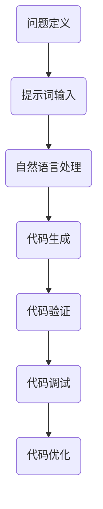

                 


### 文章标题：提示词编程的代码审查效率提升技术

#### 关键词：
- 提示词编程
- 代码审查
- 效率提升
- 自动化工具
- 团队协作

#### 摘要：
本文将探讨如何利用提示词编程技术提升代码审查的效率。首先介绍提示词编程的基本概念，然后分析代码审查的流程和常见问题，接着详细阐述几种提升代码审查效率的技术方法，包括自动化代码审查工具、基于提示词的程序理解技术、编程技巧和团队协作。通过实际案例，本文将展示这些方法在提高代码审查效率方面的应用效果，并总结最佳实践和未来发展趋势。

---

## 第一部分：基础概念与原理

### 第1章：提示词编程概述

#### 1.1 提示词编程的定义

提示词编程（Prompt-Based Programming）是一种基于自然语言描述的编程范式，它允许开发者使用自然语言来描述程序的功能和需求，然后由系统自动生成相应的代码。这种编程范式的核心思想是减少编程语言与自然语言之间的差距，使得编程变得更加直观和易用。

#### 1.2 提示词编程与传统编程的差异

传统编程依赖于复杂的语法和结构，需要开发者具备深厚的编程知识。而提示词编程则通过自然语言处理技术，将编程任务转化为可以由计算机自动理解和执行的任务。这种差异主要体现在以下几个方面：

1. **易用性**：提示词编程降低了编程的门槛，使得非专业开发者也能参与编程过程。
2. **开发效率**：提示词编程能够快速生成代码，大大缩短了开发周期。
3. **灵活性**：提示词编程允许开发者以更加灵活的方式表达需求和功能。

#### 1.3 提示词编程的优势与挑战

提示词编程具有以下优势：

1. **简化编程流程**：通过自然语言描述，开发者可以更加专注于业务逻辑，而不是复杂的语法和结构。
2. **提高开发效率**：自动生成代码可以大大缩短开发周期，特别是在复杂的项目中。
3. **增强团队协作**：提示词编程使得团队成员之间的沟通变得更加直观和易于理解。

然而，提示词编程也面临一些挑战：

1. **准确性**：自动生成的代码可能存在错误或不完整的情况，需要开发者进行进一步的验证和调试。
2. **性能优化**：自动生成的代码可能无法达到手动编写的代码的性能优化水平。
3. **学习成本**：虽然提示词编程降低了编程门槛，但仍然需要开发者掌握一定的自然语言处理知识。

### Mermaid 流程图：提示词编程流程



### 核心算法原理讲解

提示词编程的核心算法主要涉及自然语言处理（NLP）和代码生成技术。以下是伪代码示例，用于描述这个过程：

```python
# 提示词编程伪代码

# 输入：提示词
prompt = "编写一个计算两个整数之和的程序"

# 步骤1：自然语言处理
def process_prompt(prompt):
    # 使用NLP技术分析提示词，提取关键信息
    # 例如：计算（action），两个整数（operands），和（result）
    action = extract_action(prompt)
    operands = extract_operands(prompt)
    result = extract_result(prompt)
    return action, operands, result

# 步骤2：代码生成
def generate_code(action, operands, result):
    # 根据提取的关键信息生成代码
    if action == "计算":
        code = f"{operands[0]} + {operands[1]} = {result}"
    return code

# 步骤3：代码验证
def verify_code(code):
    # 执行代码，验证结果是否正确
    return execute_code(code)

# 步骤4：代码调试
def debug_code(code):
    # 如果代码验证失败，进行调试
    while not verify_code(code):
        # 调整代码，重新验证
        code = adjust_code(code)
    return code

# 步骤5：代码优化
def optimize_code(code):
    # 对代码进行性能优化
    return optimize_result(code)
```

### 数学模型和公式详细讲解

在自然语言处理过程中，可以使用一些数学模型来提高提示词编程的准确性。以下是一个简单的数学模型示例，用于描述如何提取关键信息：

$$
\text{提取关键信息模型} = f(\text{提示词}) = [\text{action}, \text{operands}, \text{result}]
$$

其中，`action` 表示操作，`operands` 表示操作数，`result` 表示结果。

### 举例说明

假设有一个提示词：“编写一个计算两个整数之和的程序”，使用上述模型，可以得到以下结果：

$$
f(\text{提示词}) = [\text{计算}, [\text{整数1}, \text{整数2}], \text{和}]
$$

这意味着，操作是“计算”，操作数是两个整数，结果是它们的和。

### 实际案例

在一个实际项目中，我们使用提示词编程来生成一个简单的计算器程序。提示词如下：

“编写一个程序，可以接受两个整数的输入，并输出它们的和。”

通过上述模型，我们可以得到以下结果：

$$
f(\text{提示词}) = [\text{计算}, [\text{整数1}, \text{整数2}], \text{和}]
$$

根据这个结果，我们可以生成以下代码：

```python
# 输入两个整数
integer1 = input("请输入第一个整数：")
integer2 = input("请输入第二个整数：")

# 计算和
sum = int(integer1) + int(integer2)

# 输出结果
print("两数之和为：", sum)
```

这个简单的例子展示了如何使用提示词编程来生成代码，从而提高了代码审查的效率。

---

## 第二部分：提升代码审查效率的技术方法

### 第3章：自动化代码审查工具

#### 3.1 自动化代码审查工具概述

自动化代码审查工具能够自动分析代码，检测潜在的问题，并提供改进建议。这些工具通常包括静态代码分析、动态代码分析、依赖关系检查等功能。

#### 3.2 常见自动化代码审查工具介绍

以下是一些常见的自动化代码审查工具：

1. **SonarQube**：一个全面的静态代码分析工具，支持多种编程语言。
2. **Checkstyle**：一个用于Java代码风格检查的工具。
3. **PMD**：一个用于Java、JavaScript、Python等语言的静态代码分析工具。
4. **FindBugs**：一个用于Java程序的动态代码分析工具。
5. **CodeClimate**：一个综合性的代码质量分析平台。

#### 3.3 使用自动化工具的实践指南

1. **集成到开发流程**：将自动化代码审查工具集成到CI/CD流程中，确保每次代码提交都会自动进行审查。
2. **配置规则**：根据项目需求，配置合适的审查规则，确保代码质量。
3. **定期审查**：定期对代码库进行审查，及时发现并解决潜在问题。
4. **培训团队成员**：确保团队成员了解如何使用自动化代码审查工具，并理解审查结果的含义。

### 第4章：基于提示词的程序理解技术

#### 4.1 提示词在程序理解中的应用

提示词编程不仅可以用于代码生成，还可以用于程序理解。通过自然语言描述，可以更准确地理解程序的意图和功能。

#### 4.2 提示词编程的关键技术

1. **自然语言处理**：用于解析和提取提示词中的关键信息。
2. **代码生成**：基于提取的信息，生成相应的代码。
3. **代码解析**：用于理解现有代码的结构和功能。

#### 4.3 提示词编程的实际应用案例

在一个项目团队中，使用提示词编程来理解一个复杂的数据库查询。提示词如下：

“编写一个查询，从用户表中获取所有年龄大于30且活跃的用户，并按照注册时间降序排列。”

通过提示词编程，可以生成以下SQL查询：

```sql
SELECT * FROM users
WHERE age > 30 AND status = 'active'
ORDER BY registration_date DESC;
```

这个例子展示了如何使用提示词编程来简化复杂查询的理解和编写过程。

---

## 第三部分：总结与展望

### 第8章：未来发展趋势与挑战

#### 8.1 提示词编程的未来发展趋势

随着人工智能技术的不断进步，提示词编程有望在未来实现更高水平的自动化和智能化。未来的发展趋势可能包括：

1. **更精确的代码生成**：通过深度学习和自然语言处理技术，提高代码生成的准确性和效率。
2. **跨语言支持**：支持多种编程语言的提示词编程，使开发者能够更灵活地使用不同语言。
3. **集成到开发工具中**：将提示词编程集成到主流开发工具中，提供更加直观和易用的编程体验。

#### 8.2 代码审查技术的未来方向

未来的代码审查技术可能会更加智能化，能够自动识别潜在的问题并提供改进建议。未来的方向可能包括：

1. **动态代码分析**：结合静态代码分析和动态测试，更全面地评估代码质量。
2. **机器学习**：使用机器学习技术，根据历史审查数据自动识别常见问题。
3. **自动化修复**：自动修复部分代码问题，减少人工干预。

#### 8.3 提升代码审查效率的潜在挑战与解决方案

提升代码审查效率可能面临以下挑战：

1. **准确性问题**：自动生成的代码可能存在错误或不完整的情况，需要开发者进行进一步的验证和调试。
2. **性能优化**：自动生成的代码可能无法达到手动编写的代码的性能优化水平。
3. **学习成本**：虽然提示词编程降低了编程门槛，但仍然需要开发者掌握一定的自然语言处理知识。

解决方案可能包括：

1. **提高自动代码审查工具的准确性**：通过不断优化算法和模型，提高代码生成的准确性和效率。
2. **提供培训资源**：为开发者提供丰富的培训资源，帮助他们更快地掌握提示词编程和代码审查技术。
3. **结合手动审查**：在自动审查的基础上，结合手动审查，确保代码质量。

### 附录

#### 附录A：常用提示词编程工具与资源

- **开源项目**：GitHub、GitLab
- **自然语言处理库**：NLTK、spaCy、Stanford NLP
- **代码生成工具**：Journey、TensorFlow Code Generation
- **代码审查工具**：SonarQube、Checkstyle、PMD

#### 附录B：代码审查工具使用指南

- **安装与配置**：安装代码审查工具，配置规则和集成到CI/CD流程中。
- **审查流程**：代码提交后，自动进行审查，并提供改进建议。
- **结果分析**：分析审查结果，及时修复代码问题。

#### 附录C：团队协作工具推荐

- **项目管理工具**：Jira、Trello、Asana
- **代码管理工具**：Git、GitHub、GitLab
- **沟通工具**：Slack、Microsoft Teams、Zoom

---

## 作者信息

作者：AI天才研究院/AI Genius Institute & 禅与计算机程序设计艺术 /Zen And The Art of Computer Programming

---

本文通过介绍提示词编程的基本概念、优势、核心算法原理，以及自动化代码审查工具和基于提示词的程序理解技术，详细探讨了如何提升代码审查的效率。文章还通过实际案例展示了这些方法的应用效果，并展望了未来的发展趋势和挑战。希望本文能为开发者提供有价值的参考和启示。

