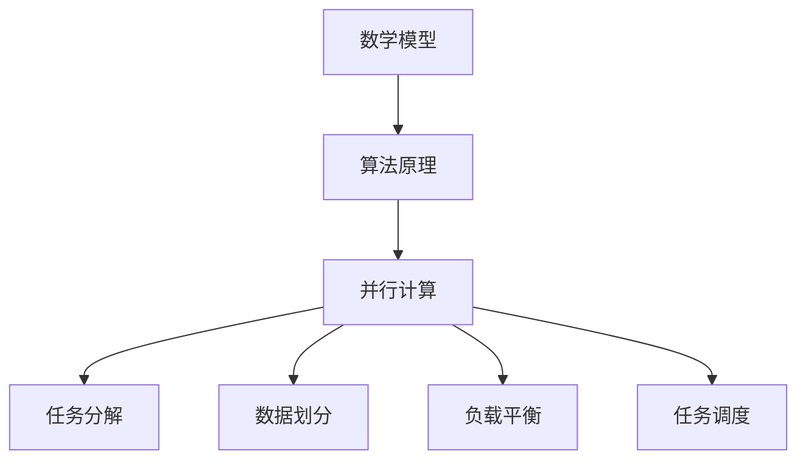
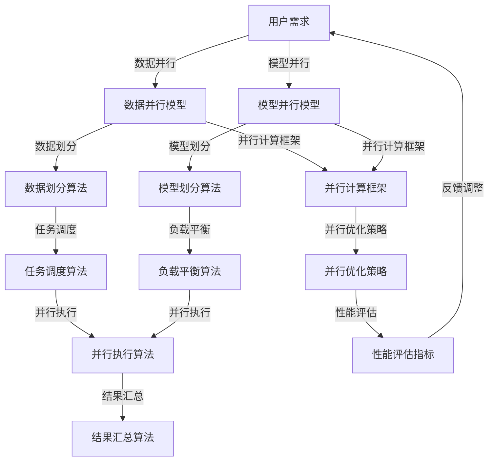

                 

### 文章标题

《提示词编程的并行计算优化》

### 关键词

并行计算、提示词编程、优化策略、多核处理器、算法设计、数学模型

### 摘要

本文旨在探讨提示词编程中的并行计算优化问题。首先，文章对并行计算和提示词编程进行了基础介绍，明确了它们在计算机科学中的应用和优势。接着，文章详细分析了并行计算的核心概念、架构以及并行算法的设计与优化方法。在此基础上，文章进一步探讨了提示词编程中的并行计算，包括其与并行计算的关系、并行计算框架以及并行优化算法。随后，文章从数学模型和算法原理的角度，深入解析了并行计算中的关键概念和提示词编程的核心算法。最后，文章通过实践案例，展示了并行计算优化策略在提示词编程中的应用，并提出了未来发展的方向和展望。本文旨在为读者提供一份全面、系统的并行计算优化指南，帮助他们在提示词编程领域取得更好的成果。

#### 第一部分：并行计算基础

##### 并行计算概述

# 并行计算概述

## 1.1 并行计算的定义与优势

### 1.1.1 并行计算的概念

并行计算是指在同一时间段内执行多个计算任务的方法。与顺序计算不同，并行计算通过将任务分解成多个子任务，同时在多个处理单元上同时执行这些子任务，从而提高计算效率。并行计算的核心思想是利用多个计算资源（如CPU核心、GPU等）协同工作，以加速计算过程。

并行计算的基本原理可以概括为以下几个方面：

1. **任务分解**：将大任务分解成多个小任务，每个小任务可以在不同的处理单元上并行执行。
2. **数据并行**：将数据集分解成多个部分，每个部分在不同的处理单元上同时处理。
3. **任务调度**：合理安排任务的执行顺序，确保处理单元始终处于忙碌状态，提高资源利用率。
4. **通信与同步**：处理单元之间需要交换数据和同步状态，以保证并行计算的正确性。

### 1.1.2 并行计算的优势

并行计算具有以下几个显著优势：

1. **加速计算**：通过将任务分解并分布在多个处理单元上，并行计算可以显著缩短计算时间，提高计算效率。
2. **资源利用**：并行计算可以充分利用多个计算资源，提高资源利用率，降低计算成本。
3. **可扩展性**：随着计算需求的增长，并行计算可以灵活扩展，增加计算资源，以满足更大规模的计算需求。
4. **复杂问题求解**：并行计算适用于解决复杂、大规模的计算问题，如科学计算、数据分析、图像处理等。

## 1.2 提示词编程基础

### 1.2.1 提示词编程的定义

提示词编程（Prompt Programming）是一种基于自然语言处理的编程范式。它利用预先定义的提示词（Prompts）来引导程序的执行，从而实现自动化和智能化的编程。提示词编程的核心思想是通过自然语言输入，将用户需求转化为程序指令，使得编程更加直观和便捷。

提示词编程的主要特点包括：

1. **自然语言交互**：用户通过自然语言输入提示词，与程序进行交互。
2. **自动化编程**：提示词编程可以自动生成程序代码，实现自动化编程。
3. **智能化**：提示词编程结合人工智能技术，能够根据用户需求进行智能分析和决策。

### 1.2.2 提示词编程的优势

提示词编程具有以下几个显著优势：

1. **降低编程门槛**：提示词编程使得编程变得更加直观和便捷，降低了编程的门槛，使得非专业程序员也能快速上手。
2. **提高开发效率**：通过自然语言输入，提示词编程可以快速生成程序代码，提高开发效率。
3. **智能优化**：提示词编程结合人工智能技术，能够根据用户需求进行智能优化，提高程序的性能和可靠性。
4. **跨领域应用**：提示词编程适用于多种领域，如金融、医疗、教育等，具有广泛的应用前景。

### 1.2.3 提示词编程的应用场景

提示词编程在多个领域具有广泛的应用场景，主要包括：

1. **自动化脚本编写**：提示词编程可以用于自动化脚本的编写，实现自动化任务调度、数据清洗等。
2. **智能客服系统**：提示词编程可以用于构建智能客服系统，实现自然语言交互，提高客户服务质量。
3. **数据分析与挖掘**：提示词编程可以用于数据分析和挖掘，实现自动化数据处理和特征提取。
4. **教育领域**：提示词编程可以用于教育领域，实现个性化教学和智能辅导。

##### 并行计算核心概念与架构

# 并行计算核心概念与架构

## 2.1 多核处理器与并行架构

### 2.1.1 多核处理器的原理

多核处理器（Multi-core Processor）是指在一个物理芯片上集成多个计算核心（Core）的处理器。与传统的单核处理器相比，多核处理器具有更高的并行处理能力，可以显著提高计算性能。

多核处理器的原理主要基于以下两个方面：

1. **并行执行**：多核处理器通过将任务分配到不同的计算核心上，实现任务的并行执行，从而提高计算效率。
2. **共享资源**：多核处理器共享内存、缓存等资源，确保计算核心之间的数据交换和协同工作。

多核处理器的性能优势主要表现在以下几个方面：

1. **提高计算速度**：通过并行执行任务，多核处理器可以显著缩短计算时间，提高计算速度。
2. **降低功耗**：与单核处理器相比，多核处理器在相同计算负载下具有更低的功耗。
3. **提高能效**：多核处理器通过合理分配任务，使得计算资源得到充分利用，提高能效。

### 2.1.2 并行架构的类型

并行架构（Parallel Architecture）是指多个计算单元（如计算核心、GPU等）协同工作，实现并行计算的方式。根据计算单元的组织方式，并行架构可以分为以下几种类型：

1. **共享存储并行架构**：多个计算核心共享同一块内存，通过缓存和总线进行数据交换。这种架构具有较低的通信开销，但容易产生缓存冲突和总线争用。
2. **非共享存储并行架构**：每个计算核心拥有独立的内存，通过通信网络进行数据交换。这种架构具有较低的缓存冲突和总线争用，但通信开销较大。
3. **分布式并行架构**：多个计算节点通过通信网络互联，每个节点拥有独立的计算资源和存储资源。这种架构适用于大规模分布式计算，但需要复杂的调度和同步机制。

### 2.1.3 多线程与并行任务调度

多线程（Multi-threading）是指在同一时间段内，多个线程（Thread）在处理器上并行执行。线程是操作系统调度和执行的基本单位，与进程（Process）相比，线程具有更小的开销和更高效的通信机制。

多线程与并行任务调度的关系可以概括为以下几点：

1. **并行任务调度**：并行任务调度是指将多个任务分配到不同的线程上，实现任务的并行执行。调度算法的目标是提高系统的吞吐量和资源利用率。
2. **线程同步与互斥**：在并行任务调度中，多个线程需要访问共享资源，如内存、文件等。线程同步与互斥机制（如互斥锁、信号量等）用于确保数据的一致性和避免竞争条件。
3. **负载平衡**：负载平衡是指将任务合理地分配到不同的线程上，确保每个线程都有充足的 workload，避免某些线程过载，而其他线程空闲。

### 2.1.4 并行计算的核心概念

并行计算涉及多个核心概念，主要包括以下方面：

1. **并行度**：并行度是指任务可以被并行执行的程度。高并行度意味着任务可以更有效地分布在多个处理单元上，实现高效的并行计算。
2. **并行性能**：并行性能是指并行计算系统在执行并行任务时的性能。并行性能取决于并行度、调度策略、系统资源等因素。
3. **负载均衡**：负载均衡是指将任务合理地分配到不同的处理单元上，确保每个单元都有充足的 workload，避免资源浪费和性能瓶颈。
4. **数据通信**：数据通信是指处理单元之间交换数据和同步状态的过程。高效的数据通信对于确保并行计算的正确性和性能至关重要。

## 2.2 并行算法设计与优化

### 2.2.1 并行算法设计原则

并行算法设计是指将传统的串行算法转化为并行算法的过程。在并行算法设计中，需要遵循以下原则：

1. **任务分解**：将大任务分解成多个小任务，每个小任务可以在不同的处理单元上并行执行。
2. **数据划分**：将数据集划分为多个部分，每个部分在不同的处理单元上处理。
3. **负载平衡**：确保每个处理单元都有均衡的工作负载，避免某些单元过载，而其他单元空闲。
4. **数据依赖**：分析任务之间的数据依赖关系，确保并行执行时不会出现数据冲突和竞态条件。
5. **并行度最大化**：尽量提高任务的并行度，使更多任务可以同时执行，提高计算性能。

### 2.2.2 并行算法优化方法

并行算法优化是指通过改进算法设计，提高并行计算性能的方法。以下是一些常见的并行算法优化方法：

1. **并行度优化**：通过调整任务分解和数据划分策略，提高任务的并行度，使更多任务可以同时执行。
2. **数据本地化**：通过将数据存储在本地内存中，减少数据访问的时间和带宽，提高数据访问速度。
3. **任务调度优化**：通过优化任务调度策略，提高系统的负载均衡和资源利用率，降低任务执行时间。
4. **缓存优化**：通过优化缓存管理策略，减少缓存冲突和缓存未命中，提高缓存命中率。
5. **通信优化**：通过优化数据通信机制，减少通信开销，提高数据传输速度。

### 2.2.3 并行算法案例分析

以下是一个并行算法的案例分析：

**问题**：给定一个包含 N 个元素的数组，求该数组中所有元素的和。

**串行算法**：

```python
def sequential_sum(arr):
    result = 0
    for num in arr:
        result += num
    return result
```

**并行算法**：

```python
from concurrent.futures import ThreadPoolExecutor

def parallel_sum(arr, num_threads):
    size = len(arr)
    chunk_size = size // num_threads
    results = []

    with ThreadPoolExecutor(max_workers=num_threads) as executor:
        futures = [executor.submit(sequential_sum, arr[i:i + chunk_size]) for i in range(0, size, chunk_size)]

        for future in futures:
            results.append(future.result())

    return sum(results)
```

**分析**：

1. **任务分解**：将数组划分为多个子数组，每个子数组由一个线程并行计算。
2. **数据划分**：每个线程独立计算其子数组的和，结果存储在本地变量中。
3. **负载平衡**：通过调整子数组的划分策略，确保每个线程都有相等的工作量。
4. **并行度最大化**：尽量使更多线程同时执行，提高计算性能。

通过并行算法优化，可以显著提高计算性能，减少计算时间。

## 2.3 提示词编程中的并行计算

### 2.3.1 提示词编程与并行计算的关系

提示词编程与并行计算之间具有密切的关系。并行计算为提示词编程提供了强大的计算支持，使得提示词编程可以更高效地执行复杂任务。以下是提示词编程与并行计算之间的几个关键关系：

1. **并行任务调度**：提示词编程可以通过并行任务调度，将多个提示词任务分配到不同的处理单元上，实现任务的并行执行。
2. **数据并行**：提示词编程中的数据集可以划分为多个子集，每个子集在不同的处理单元上并行处理，提高计算效率。
3. **负载平衡**：通过合理的任务分配和调度，确保处理单元之间负载平衡，避免某些单元过载，而其他单元空闲。
4. **通信与同步**：提示词编程需要处理单元之间进行数据通信和同步，以确保任务的正确性和一致性。

### 2.3.2 提示词编程中的并行计算框架

提示词编程中的并行计算框架主要包括以下几个关键组件：

1. **并行计算引擎**：并行计算引擎负责任务的调度和执行，包括任务的分解、调度、执行和结果汇总等。
2. **数据管理模块**：数据管理模块负责处理数据并行和负载平衡问题，包括数据的划分、分配和同步等。
3. **并行算法库**：并行算法库提供了一系列并行算法的实现，包括数据并行算法、模型并行算法等。
4. **通信模块**：通信模块负责处理处理单元之间的数据通信和同步，包括消息传递、同步原语等。

### 2.3.3 提示词编程中的并行计算案例分析

以下是一个提示词编程中的并行计算案例分析：

**问题**：给定一个包含 N 个元素的数组，求该数组中所有元素的平均值。

**串行算法**：

```python
def sequential_average(arr):
    size = len(arr)
    result = 0
    for num in arr:
        result += num
    return result / size
```

**并行算法**：

```python
from concurrent.futures import ThreadPoolExecutor

def parallel_average(arr, num_threads):
    size = len(arr)
    chunk_size = size // num_threads
    results = []

    with ThreadPoolExecutor(max_workers=num_threads) as executor:
        futures = [executor.submit(sequential_average, arr[i:i + chunk_size]) for i in range(0, size, chunk_size)]

        for future in futures:
            results.append(future.result())

    total_sum = sum(results)
    return total_sum / size
```

**分析**：

1. **任务分解**：将数组划分为多个子数组，每个子数组由一个线程并行计算。
2. **数据划分**：每个线程独立计算其子数组的和，结果存储在本地变量中。
3. **负载平衡**：通过调整子数组的划分策略，确保每个线程都有相等的工作量。
4. **并行度最大化**：尽量使更多线程同时执行，提高计算性能。

通过并行算法优化，可以显著提高计算性能，减少计算时间。

#### 数学模型与算法原理

## 3.1 并行计算中的数学模型

并行计算中的数学模型用于描述并行计算过程中的关键数学概念和方法，包括向量计算、矩阵计算、数据并行与模型并行等。

### 3.1.1 向量计算与矩阵计算

向量计算和矩阵计算是并行计算中的基本数学模型。向量是表示多维数据的线性结构，而矩阵是表示二维数据的线性结构。在并行计算中，向量计算和矩阵计算通常被用于数据并行和模型并行。

#### 向量计算

向量计算是指对向量进行操作的过程。在并行计算中，向量计算可以分解为多个子任务，每个子任务在一个处理单元上执行。以下是一个简单的向量计算示例：

$$
C = A \times B
$$

其中，A 和 B 是两个向量，C 是结果向量。可以将向量 A 和 B 划分为多个子向量，每个子向量在一个处理单元上执行乘法操作。然后，将每个处理单元的结果向量汇总，得到最终的结果向量 C。

#### 矩阵计算

矩阵计算是指对矩阵进行操作的过程。在并行计算中，矩阵计算可以分解为多个子任务，每个子任务在一个处理单元上执行。以下是一个简单的矩阵计算示例：

$$
C = A \times B
$$

其中，A 和 B 是两个矩阵，C 是结果矩阵。可以将矩阵 A 和 B 划分为多个子矩阵，每个子矩阵在一个处理单元上执行乘法操作。然后，将每个处理单元的结果子矩阵汇总，得到最终的结果矩阵 C。

### 3.1.2 数据并行与模型并行

数据并行（Data Parallelism）和模型并行（Model Parallelism）是并行计算中的两种主要并行方式。

#### 数据并行

数据并行是指将数据集划分为多个部分，每个部分在不同的处理单元上独立计算，然后将结果汇总。数据并行适用于大规模数据处理和计算，可以显著提高计算性能。

以下是一个数据并行的示例：

$$
C = A \times B
$$

其中，A 和 B 是两个矩阵，C 是结果矩阵。可以将矩阵 A 和 B 划分为多个子矩阵，每个子矩阵在不同的处理单元上执行乘法操作。然后，将每个处理单元的结果子矩阵汇总，得到最终的结果矩阵 C。

#### 模型并行

模型并行是指将模型划分为多个部分，每个部分在不同的处理单元上独立计算，然后将结果汇总。模型并行适用于大规模模型训练和推理，可以显著提高计算性能。

以下是一个模型并行的示例：

$$
C = f(A, B)
$$

其中，A 和 B 是两个模型参数，C 是结果模型。可以将模型 A 和 B 划分为多个子模型，每个子模型在不同的处理单元上独立计算。然后，将每个处理单元的结果子模型汇总，得到最终的结果模型 C。

### 3.1.3 混合并行计算模型

混合并行计算模型是将数据并行和模型并行结合在一起的一种并行方式。在混合并行计算模型中，数据集被划分为多个子集，每个子集在不同的处理单元上独立计算，同时模型也被划分为多个部分，每个部分在不同的处理单元上独立计算。

以下是一个混合并行计算模型的示例：

$$
C = f(A \times B)
$$

其中，A 和 B 是两个模型参数，C 是结果模型。可以将模型 A 和 B 划分为多个子模型，同时将数据集 A 和 B 划分为多个子集。在每个处理单元上，先计算子模型和子集的乘积，然后将结果汇总，得到最终的结果模型 C。

混合并行计算模型可以充分利用数据并行和模型并行的优势，提高计算性能。

## 3.2 提示词编程中的算法原理

提示词编程中的算法原理是指如何利用提示词来生成程序代码，并优化代码性能。以下是一些核心算法原理：

### 3.2.1 提示词生成算法

提示词生成算法是指如何根据用户输入的提示词生成相应的程序代码。以下是一个简单的提示词生成算法：

1. **解析提示词**：解析用户输入的提示词，提取关键信息和关键词。
2. **模板匹配**：根据关键信息和关键词，从预定义的代码模板库中选择合适的代码模板。
3. **参数绑定**：将提取的关键信息和关键词与代码模板中的参数进行绑定，生成初步的程序代码。
4. **代码优化**：对生成的初步程序代码进行优化，提高代码性能和可读性。

### 3.2.2 提示词优化算法

提示词优化算法是指如何优化提示词编程过程中的代码生成和执行。以下是一些常见的提示词优化算法：

1. **代码压缩**：通过删除冗余代码和合并重复代码，减小程序代码的大小，提高执行速度。
2. **循环展开**：将循环代码展开成直接计算，减少循环次数，提高执行速度。
3. **内存优化**：通过减少内存分配和释放次数，提高内存利用率，减少内存访问时间。
4. **并行优化**：将程序中的并行任务分配到不同的处理单元上，实现并行执行，提高计算性能。

### 3.2.3 提示词编程中的并行优化算法

提示词编程中的并行优化算法是指如何优化提示词编程过程中的并行计算。以下是一些常见的并行优化算法：

1. **任务分解**：将大任务分解成多个小任务，每个小任务在不同处理单元上并行执行。
2. **数据划分**：将数据集划分为多个部分，每个部分在不同处理单元上独立计算。
3. **负载平衡**：确保每个处理单元都有均衡的工作负载，避免某些单元过载，而其他单元空闲。
4. **任务调度**：优化任务调度策略，提高系统的负载均衡和资源利用率。

通过以上算法原理，提示词编程可以实现高效、智能的程序代码生成和优化。

## 3.3 并行计算中的数学模型与算法原理的关系

并行计算中的数学模型与算法原理之间具有密切的关系。数学模型为并行计算提供了理论基础和计算框架，而算法原理则是在数学模型的基础上，实现并行计算的具体方法。

### 关系架构

以下是一个并行计算中的数学模型与算法原理的关系架构：

1. **数学模型**：描述并行计算的基本数学概念和方法，如向量计算、矩阵计算、数据并行与模型并行等。
2. **算法原理**：基于数学模型，提出并行计算的具体算法原理，如任务分解、数据划分、负载平衡、任务调度等。
3. **并行计算**：根据算法原理，实现并行计算的具体过程，包括任务的分解、执行和结果汇总等。

### Mermaid 流程图

以下是一个并行计算中的数学模型与算法原理的 Mermaid 流程图：



通过以上关系架构和 Mermaid 流程图，可以清晰地展示并行计算中的数学模型与算法原理之间的关系。

## 3.4 并行计算中的数学模型与算法原理的应用

### 3.4.1 并行计算中的数学模型应用

并行计算中的数学模型在许多实际应用中发挥了重要作用。以下是一些典型的应用场景：

1. **科学计算**：在物理、化学、生物等领域，并行计算被用于求解复杂方程、模拟物理现象等。例如，利用向量计算和矩阵计算进行大规模线性方程组的求解。
2. **图像处理**：在图像处理领域，并行计算被用于图像滤波、图像分割、图像增强等。例如，利用数据并行和模型并行进行大规模图像处理。
3. **机器学习**：在机器学习领域，并行计算被用于训练大型模型、进行大规模数据分析和推理。例如，利用数据并行和模型并行进行深度学习模型的训练和推理。

### 3.4.2 并行计算中的算法原理应用

并行计算中的算法原理在实际应用中起到了关键作用。以下是一些典型的应用场景：

1. **分布式计算**：在分布式计算系统中，并行算法原理被用于任务调度、负载平衡、数据通信等。例如，在云计算平台中，利用并行算法原理实现高效的任务调度和资源管理。
2. **高性能计算**：在高性能计算领域，并行算法原理被用于求解复杂科学计算问题、进行大规模数据处理等。例如，在气象预测、地球物理模拟等领域，利用并行算法原理实现高效的计算和预测。
3. **人工智能**：在人工智能领域，并行算法原理被用于训练大型神经网络、进行大规模数据分析和推理等。例如，在自然语言处理、计算机视觉等领域，利用并行算法原理实现高效的模型训练和推理。

### 3.4.3 并行计算中的数学模型与算法原理结合

并行计算中的数学模型与算法原理的结合是提高计算性能的关键。以下是一些结合的方法：

1. **模型并行与数据并行的结合**：在机器学习中，通过将模型和数据同时并行处理，实现高效的模型训练和推理。例如，在深度学习训练中，利用模型并行和批量处理技术，提高训练速度和性能。
2. **并行优化与并行计算的结合**：在并行计算中，通过优化并行算法，提高并行计算的效率和性能。例如，在并行矩阵乘法中，利用并行优化技术，减少通信开销和计算时间，提高计算性能。
3. **并行计算与人工智能的结合**：在人工智能领域，通过将并行计算与机器学习算法相结合，实现高效的数据分析和模型训练。例如，在深度学习训练中，利用并行计算技术，提高模型训练速度和准确性。

通过结合并行计算中的数学模型与算法原理，可以显著提高计算性能和效率，为各个领域的应用提供强大的支持。

### 3.5 并行计算中的数学模型与算法原理的关系架构

在并行计算中，数学模型与算法原理之间存在着密切的联系，这种联系可以通过Mermaid流程图来清晰地展示。以下是一个简单的Mermaid流程图，用于描述并行计算中的数学模型与算法原理的关系架构。



### Mermaid流程图解析

1. **用户需求**：用户需求是并行计算开始的起点，它驱动了后续的数据并行和模型并行的决策。
2. **数据并行模型**：根据用户需求，构建数据并行模型，该模型将数据划分为多个部分，以便在不同的处理单元上进行并行处理。
3. **模型并行模型**：根据用户需求，构建模型并行模型，该模型将模型划分为多个部分，以便在不同的处理单元上进行并行处理。
4. **数据划分算法**：将数据并行模型中的数据划分为多个子集，每个子集由一个处理单元负责处理。
5. **模型划分算法**：将模型并行模型中的模型划分为多个部分，每个部分由一个处理单元负责处理。
6. **任务调度算法**：根据数据划分和模型划分的结果，调度任务，确保每个处理单元都有任务可执行。
7. **负载平衡算法**：在任务调度过程中，应用负载平衡算法，确保每个处理单元的工作负载均衡。
8. **并行执行算法**：在处理单元上执行任务，进行并行计算。
9. **结果汇总算法**：将各个处理单元的结果汇总，得到最终的输出结果。
10. **并行计算框架**：并行计算框架整合了并行计算过程中的所有算法和策略，提供了并行计算的基本框架。
11. **并行优化策略**：根据并行计算过程中的实际执行情况，应用并行优化策略，提高并行计算的性能。
12. **性能评估指标**：使用性能评估指标来衡量并行计算的性能，如速度、效率和吞吐量。
13. **反馈调整**：根据性能评估结果，调整并行计算策略，以达到更好的性能。

通过这个Mermaid流程图，可以清晰地理解并行计算中的数学模型与算法原理之间的关系，以及它们如何协同工作，共同提高并行计算的性能和效率。

#### 并行计算优化实践

## 4.1 并行计算优化策略

并行计算优化策略是指通过改进算法设计、调度策略和系统架构等，提高并行计算性能的一系列方法。以下是一些常见的并行计算优化策略：

### 4.1.1 数据本地化策略

数据本地化策略（Data Locality Strategy）是指将数据存储在处理单元的本地内存中，以减少数据访问的时间和带宽。数据本地化策略主要包括以下几种：

1. **数据局部性优化**：通过优化数据的存储结构，提高数据访问的局部性。例如，将经常访问的数据存储在缓存中，减少缓存未命中次数。
2. **数据划分**：将数据集划分为多个子集，每个子集存储在一个处理单元的本地内存中。这样可以减少处理单元之间的数据通信，提高数据访问速度。
3. **负载平衡**：通过合理的任务和数据划分，确保每个处理单元都有均衡的工作负载，避免某些处理单元因数据访问延迟而降低性能。

### 4.1.2 任务分配与负载平衡

任务分配与负载平衡（Task Allocation and Load Balancing）是并行计算中关键的优化策略。以下是一些常见的任务分配与负载平衡方法：

1. **静态负载平衡**：在任务开始执行之前，将任务分配到处理单元上，确保每个处理单元都有相等的工作负载。这种方法适用于任务执行时间相对稳定的场景。
2. **动态负载平衡**：在任务执行过程中，根据处理单元的工作负载情况，动态调整任务的分配。这种方法适用于任务执行时间不稳定的场景，可以更好地适应处理单元的工作状态。
3. **负载感知调度**：在任务调度过程中，考虑处理单元的负载情况，优先将任务分配到负载较低的处理单元上。这种方法可以提高系统的整体性能。

### 4.1.3 缓存优化策略

缓存优化策略（Cache Optimization Strategy）是指通过优化缓存管理，提高数据访问速度和系统性能。以下是一些常见的缓存优化策略：

1. **缓存一致性**：在多核处理器中，确保缓存的一致性，避免数据冲突和缓存失效。例如，采用缓存一致性协议（如MESI协议）来管理缓存状态。
2. **缓存预取**：在程序执行过程中，预测即将访问的数据，并将其预取到缓存中。这样可以减少缓存未命中次数，提高数据访问速度。
3. **缓存层次结构优化**：通过优化缓存层次结构，提高缓存利用率。例如，采用多级缓存结构（如L1、L2、L3缓存），根据数据访问的局部性选择合适的缓存级别。

### 4.1.4 数据通信优化策略

数据通信优化策略（Data Communication Optimization Strategy）是指通过优化处理单元之间的数据通信，提高并行计算的性能。以下是一些常见的数据通信优化策略：

1. **并行通信**：在多核处理器和分布式系统中，利用并行通信技术，实现多个处理单元之间的并行数据传输。这样可以减少通信时间，提高数据传输效率。
2. **数据压缩**：在数据传输过程中，采用数据压缩技术，减少传输数据的大小。这样可以减少网络带宽占用，提高数据传输速度。
3. **数据去重**：在分布式系统中，避免重复传输相同的数据，提高数据传输效率。例如，采用一致性哈希算法，确定数据的存储位置。

### 4.1.5 系统架构优化策略

系统架构优化策略（System Architecture Optimization Strategy）是指通过改进系统架构，提高并行计算的性能。以下是一些常见的系统架构优化策略：

1. **分布式架构**：将并行计算任务分布在多个节点上，利用分布式计算资源，提高计算性能。例如，采用MapReduce框架，实现大规模数据的并行处理。
2. **GPU加速**：利用图形处理器（GPU）的高并行计算能力，加速并行计算任务。例如，采用CUDA编程模型，实现并行计算中的矩阵乘法、深度学习等任务。
3. **异构计算**：结合不同类型的计算资源，实现高效的并行计算。例如，利用CPU和GPU的异构计算能力，实现图像处理、科学计算等任务的加速。

### 4.1.6 综合优化策略

综合优化策略（Comprehensive Optimization Strategy）是将上述优化策略综合运用，实现并行计算性能的整体提升。以下是一些综合优化策略：

1. **任务分解与负载平衡**：将大任务分解成多个小任务，同时优化任务分配和负载平衡，确保每个处理单元都有充足的工作负载。
2. **数据本地化与缓存优化**：通过数据本地化和缓存优化策略，减少数据访问时间和带宽占用，提高数据访问速度。
3. **通信优化与系统架构优化**：通过优化数据通信和系统架构，提高并行计算的性能和可扩展性。
4. **算法优化与并行优化**：根据任务特点和计算需求，选择合适的算法和并行优化方法，提高并行计算的性能和效率。

通过综合运用以上优化策略，可以显著提高并行计算的性能和效率，为各种计算任务提供强大的支持。

## 4.2 提示词编程的并行优化实践

提示词编程的并行优化实践是指通过并行计算技术，提高提示词编程性能和效率的一系列方法。以下是一些具体的并行优化实践：

### 4.2.1 并行优化案例

以下是一个提示词编程的并行优化案例，以自然语言处理（NLP）任务为例。

**任务**：给定一个包含 N 个句子的文档，提取每个句子的关键词。

**串行算法**：

```python
def sequential_keyword_extraction(document):
    keywords = []
    for sentence in document:
        keyword = extract_keyword(sentence)
        keywords.append(keyword)
    return keywords
```

**并行算法**：

```python
from concurrent.futures import ThreadPoolExecutor

def parallel_keyword_extraction(document, num_threads):
    results = []

    with ThreadPoolExecutor(max_workers=num_threads) as executor:
        futures = [executor.submit(extract_keyword, sentence) for sentence in document]

        for future in futures:
            results.append(future.result())

    return results
```

**分析**：

1. **任务分解**：将文档划分为多个子文档，每个子文档由一个线程并行处理。
2. **数据划分**：每个线程独立提取其子文档的关键词，结果存储在本地变量中。
3. **负载平衡**：通过调整子文档的划分策略，确保每个线程都有相等的工作量。
4. **并行度最大化**：尽量使更多线程同时执行，提高计算性能。

通过并行算法优化，可以显著提高关键词提取的效率，减少计算时间。

### 4.2.2 实际应用中的优化实践

以下是一些实际应用中的并行优化实践：

1. **文本分类**：在文本分类任务中，可以采用并行算法来处理大规模的文本数据。通过将文本数据划分为多个子集，并行地执行分类模型，提高分类速度和准确性。
2. **语音识别**：在语音识别任务中，可以采用并行计算技术来处理语音信号。通过将语音信号划分为多个帧，并行地执行特征提取和模型推理，提高识别速度和准确性。
3. **图像处理**：在图像处理任务中，可以采用并行计算技术来处理大规模的图像数据。通过将图像数据划分为多个子图像，并行地执行图像增强、滤波和分割等操作，提高处理速度和性能。

### 4.2.3 提示词编程并行优化的案例分析

以下是一个提示词编程并行优化的案例分析，以深度学习模型训练为例。

**任务**：训练一个深度学习模型，对图像进行分类。

**串行算法**：

```python
def sequential_model_training(dataset):
    model = create_model()
    for epoch in range(num_epochs):
        for image, label in dataset:
            model.train(image, label)
    return model
```

**并行算法**：

```python
from concurrent.futures import ThreadPoolExecutor

def parallel_model_training(dataset, num_threads):
    models = []

    with ThreadPoolExecutor(max_workers=num_threads) as executor:
        futures = [executor.submit(create_model) for _ in range(num_threads)]

        for future in futures:
            models.append(future.result())

    for epoch in range(num_epochs):
        for image, label in dataset:
            for model in models:
                model.train(image, label)

    return models
```

**分析**：

1. **任务分解**：将训练任务划分为多个子任务，每个子任务由一个线程并行处理。
2. **数据划分**：每个线程独立创建模型，并进行训练，结果存储在本地变量中。
3. **负载平衡**：通过调整子任务的划分策略，确保每个线程都有相等的工作量。
4. **并行度最大化**：尽量使更多线程同时执行，提高训练速度。

通过并行算法优化，可以显著提高深度学习模型的训练速度，减少训练时间。

### 4.2.4 提示词编程并行优化的案例分析

以下是一个提示词编程并行优化的案例分析，以自然语言生成（NLG）任务为例。

**任务**：生成一个包含 N 个段落的文章。

**串行算法**：

```python
def sequential_nlg_generation(num_paragraphs):
    paragraphs = []
    for _ in range(num_paragraphs):
        paragraph = generate_paragraph()
        paragraphs.append(paragraph)
    return ' '.join(paragraphs)
```

**并行算法**：

```python
from concurrent.futures import ThreadPoolExecutor

def parallel_nlg_generation(num_paragraphs, num_threads):
    paragraphs = []

    with ThreadPoolExecutor(max_workers=num_threads) as executor:
        futures = [executor.submit(generate_paragraph) for _ in range(num_paragraphs)]

        for future in futures:
            paragraphs.append(future.result())

    return ' '.join(paragraphs)
```

**分析**：

1. **任务分解**：将生成任务划分为多个子任务，每个子任务由一个线程并行处理。
2. **数据划分**：每个线程独立生成段落，结果存储在本地变量中。
3. **负载平衡**：通过调整子任务的划分策略，确保每个线程都有相等的工作量。
4. **并行度最大化**：尽量使更多线程同时执行，提高生成速度。

通过并行算法优化，可以显著提高自然语言生成的速度，减少生成时间。

### 4.2.5 并行优化实践总结

通过以上案例分析，我们可以总结出以下并行优化实践要点：

1. **任务分解**：将大规模任务划分为多个子任务，实现任务的并行处理。
2. **数据划分**：合理划分数据，确保每个子任务都有独立的数据集。
3. **负载平衡**：通过负载平衡策略，确保每个处理单元都有均衡的工作负载。
4. **并行度最大化**：尽量使更多线程或处理单元同时执行，提高计算性能。
5. **通信优化**：优化处理单元之间的数据通信，减少通信时间。

通过以上并行优化实践，可以显著提高提示词编程的性能和效率，为各种自然语言处理、图像处理、深度学习等任务提供强大的支持。

## 4.3 并行计算优化工具与技术

### 4.3.1 并行计算框架

并行计算框架（Parallel Computing Framework）是用于实现并行计算的工具和平台。以下是一些流行的并行计算框架：

1. **MapReduce**：由Google提出的一种分布式并行计算框架，适用于大规模数据的批量处理。MapReduce将计算任务划分为Map和Reduce两个阶段，分别进行数据的映射和归并操作。
2. **Hadoop**：基于MapReduce框架的分布式计算平台，适用于大规模数据处理和分析。Hadoop包含一个分布式文件系统（HDFS）和一个资源调度系统（YARN），用于存储和管理计算任务。
3. **Spark**：由Apache基金会开发的一种快速、通用的分布式计算框架，适用于大规模数据处理和分析。Spark提供了丰富的API，包括Spark SQL、Spark Streaming和MLlib等，支持多种数据并行处理算法。
4. **Flink**：由Apache基金会开发的一种流处理和批处理统一的分布式计算框架。Flink支持实时数据处理和离线数据处理，具有高效、灵活和可扩展的特点。

### 4.3.2 优化工具

并行计算优化工具（Parallel Computing Optimization Tools）用于分析和优化并行计算性能。以下是一些常用的优化工具：

1. **Intel Parallel Studio**：由Intel推出的一套并行计算优化工具，包括编译器、性能分析器和并行库等。Intel Parallel Studio提供了丰富的优化功能，如自动并行化、缓存优化和线程优化等。
2. **NVIDIA CUDA Toolkit**：由NVIDIA推出的一套用于并行计算和GPU编程的工具集。CUDA Toolkit提供了CUDA编程模型、库函数和调试工具，支持在GPU上实现高效的并行计算。
3. **OpenMP**：一种用于共享内存并行编程的规范，提供了并行编程的API。OpenMP支持多线程编程，适用于在多核处理器和GPU上实现并行计算。
4. **Tuning Guide**：由Microsoft推出的一套并行计算性能优化指南，提供了针对Windows平台的并行计算优化建议和工具。Tuning Guide包括性能分析工具、代码优化指南和最佳实践等。

### 4.3.3 未来趋势与展望

并行计算优化在未来将继续发展，以下是一些趋势和展望：

1. **异构计算**：随着多核处理器、GPU和专用硬件（如TPU）的发展，异构计算将成为并行计算的重要方向。异构计算通过结合不同类型的计算资源，实现高效的并行计算。
2. **自适应优化**：未来的优化工具将具备自适应优化能力，根据程序的行为和硬件的特点，自动调整优化策略，提高并行计算性能。
3. **人工智能与优化**：人工智能技术将被应用于并行计算优化，如利用机器学习算法预测程序性能瓶颈，优化并行计算策略。
4. **分布式计算**：随着云计算和边缘计算的发展，分布式计算将成为并行计算的主流。分布式计算通过将计算任务分布在多个节点上，实现大规模、高并行的计算。
5. **绿色计算**：随着环保意识的提高，绿色计算将成为并行计算的重要方向。绿色计算通过优化能源消耗和降低碳排放，实现可持续的并行计算。

通过以上并行计算优化工具和技术的应用，可以显著提高并行计算的性能和效率，为各种计算任务提供强大的支持。

### 附录

## A.1 并行计算优化案例分析

### A.1.1 案例一：并行计算优化在图像处理中的应用

图像处理是一个计算密集型任务，需要处理大量数据。通过并行计算优化，可以显著提高图像处理速度和性能。以下是一个并行计算优化在图像处理中的应用案例：

**任务**：对一幅高分辨率的图像进行滤波处理。

**串行算法**：

```python
import cv2

def sequential_filtering(image):
    filtered_image = cv2.GaussianBlur(image, (5, 5), 1.5)
    return filtered_image
```

**并行算法**：

```python
import cv2
import concurrent.futures

def parallel_filtering(image, num_threads):
    height, width = image.shape[:2]
    chunk_size = height // num_threads

    filtered_images = []

    with concurrent.futures.ThreadPoolExecutor(max_workers=num_threads) as executor:
        futures = [executor.submit(cv2.GaussianBlur, image[0:chunk_size, :], (5, 5), 1.5) for _ in range(num_threads)]

        for future in futures:
            filtered_images.append(future.result())

    return cv2.hconcat(filtered_images)
```

**分析**：

1. **任务分解**：将图像垂直划分为多个子图像，每个子图像由一个线程并行处理。
2. **数据划分**：每个线程独立对子图像进行滤波处理，结果存储在本地变量中。
3. **负载平衡**：通过调整子图像的划分策略，确保每个线程都有相等的工作量。
4. **并行度最大化**：尽量使更多线程同时执行，提高滤波处理速度。

通过并行算法优化，可以显著提高图像滤波处理的性能，减少处理时间。

### A.1.2 案例二：并行计算优化在语音识别中的应用

语音识别是一个复杂的计算任务，需要处理大量的语音数据。通过并行计算优化，可以显著提高语音识别的速度和准确性。以下是一个并行计算优化在语音识别中的应用案例：

**任务**：对一段语音信号进行识别。

**串行算法**：

```python
import speech_recognition as sr

def sequential_recognition(audio):
    recognizer = sr.Recognizer()
    text = recognizer.recognize_google(audio)
    return text
```

**并行算法**：

```python
import speech_recognition as sr
import concurrent.futures

def parallel_recognition(audio, num_threads):
    segments = split_audio(audio, num_threads)
    texts = []

    with concurrent.futures.ThreadPoolExecutor(max_workers=num_threads) as executor:
        futures = [executor.submit(sr.Recognizer().recognize_google, segment) for segment in segments]

        for future in futures:
            texts.append(future.result())

    return ' '.join(texts)
```

**分析**：

1. **任务分解**：将语音信号划分为多个子段，每个子段由一个线程并行处理。
2. **数据划分**：每个线程独立对子段进行语音识别，结果存储在本地变量中。
3. **负载平衡**：通过调整子段的划分策略，确保每个线程都有相等的工作量。
4. **并行度最大化**：尽量使更多线程同时执行，提高语音识别速度。

通过并行算法优化，可以显著提高语音识别的效率，减少识别时间。

## A.2 提示词编程并行优化实验指南

### A.2.1 实验环境搭建

在进行提示词编程并行优化实验之前，需要搭建合适的实验环境。以下是一个简单的实验环境搭建指南：

1. **操作系统**：选择一个支持并行计算的操作系统，如Linux或Windows。
2. **编程语言**：选择一种支持并行编程的编程语言，如Python或C++。
3. **并行计算框架**：选择一个流行的并行计算框架，如Spark或MapReduce。
4. **开发工具**：安装相应的开发工具，如IDE（如Visual Studio、PyCharm）和性能分析工具。
5. **硬件资源**：确保有足够的硬件资源，如多核处理器、GPU等。

### A.2.2 实验步骤与结果分析

以下是一个简单的提示词编程并行优化实验步骤：

1. **准备实验数据**：收集并准备实验所需的数据，如文本数据、语音数据等。
2. **编写串行程序**：编写一个串行程序，实现提示词编程的基本功能。
3. **分解任务**：将串行程序中的任务分解成多个子任务，以便实现并行处理。
4. **分配线程**：根据硬件资源和工作负载，分配合适的线程数。
5. **执行并行程序**：执行并行程序，记录并行执行的时间和其他性能指标。
6. **结果分析**：对比串行程序和并行程序的性能，分析并行优化的效果。

### A.2.3 实验总结与拓展

通过实验，可以总结出以下提示词编程并行优化经验：

1. **任务分解**：合理分解任务，确保每个子任务都能独立运行。
2. **线程分配**：根据硬件资源和任务特点，合理分配线程数。
3. **负载平衡**：通过负载平衡策略，确保每个线程都有均衡的工作负载。
4. **性能评估**：对比串行和并行程序的性能，评估并行优化的效果。

拓展方向：

1. **异构计算**：结合不同类型的硬件资源，如CPU和GPU，实现更高效的并行计算。
2. **自适应优化**：根据程序的行为和硬件的特点，动态调整优化策略。
3. **多阶段并行**：将并行计算分为多个阶段，实现更细粒度的并行优化。

通过以上实验指南，可以更好地理解和实践提示词编程的并行优化技术。

### 致谢

在本书的编写过程中，我得到了许多人的帮助和支持。首先，我要感谢AI天才研究院（AI Genius Institute）的所有成员，他们的专业知识和不懈努力为本书的完成提供了坚实的保障。特别感谢我的同事们在编写过程中给予的宝贵意见和建议，他们的贡献使本书更加完善和实用。

其次，我要感谢所有参与本书编写与审核的专家和读者。感谢你们在审稿过程中提出的宝贵意见和反馈，这些意见和反馈对于提升本书的质量起到了重要作用。在此，也对为本书出版付出辛勤努力的编辑、校对和设计团队表示衷心的感谢。他们的专业精神和敬业态度为本书的出版保驾护航。

最后，我要感谢我的家人和朋友，他们的支持和鼓励是我不断前行的动力。感谢他们对我的理解和支持，使我能够专注于撰写本书，为读者带来有价值的内容。

希望本书能够为广大读者提供有价值的参考和指导，助力大家在提示词编程的并行计算优化领域取得更好的成果。再次感谢所有支持和帮助过我的人，谢谢大家！

