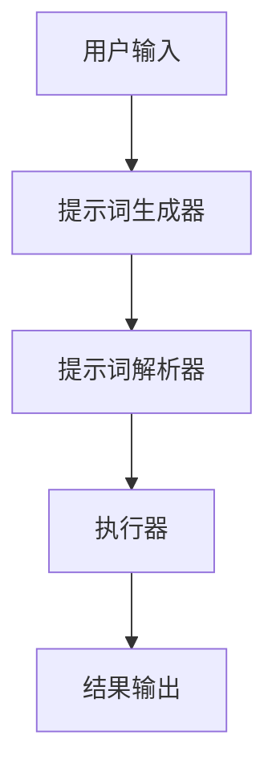

                 

## 文章标题

### 提示词编程的教育与培训体系

关键词：提示词编程，教育体系，培训，自然语言处理，算法，深度学习，认证与职业发展

摘要：本文将探讨提示词编程的教育与培训体系，从概述与基础、技术与算法、教育与培训三个部分详细分析提示词编程的核心概念、发展历程、技术原理以及教育应用。文章旨在为从事提示词编程教育与研究的专业人士提供有价值的参考，并为有志于学习提示词编程的学子们指明方向。

## 第一部分：概述与基础

### 1. 引言

提示词编程是一种结合了自然语言处理和编程技巧的新型编程范式。与传统编程不同，提示词编程强调通过自然语言描述程序逻辑，进而实现自动化和智能化。这种编程方式不仅提升了编程的效率，还降低了编程的难度，使得更多的人能够参与到编程中来。

在教育的背景下，提示词编程具有重要的应用价值。首先，它能够培养学生的逻辑思维和问题解决能力。通过提示词编程，学生可以更好地理解编程的基本概念和原理，从而提高编程技能。其次，提示词编程能够激发学生的学习兴趣，使得编程学习变得更加有趣和富有挑战性。

### 2. 提示词编程的历史与发展

提示词编程的起源可以追溯到20世纪80年代。当时，计算机科学领域开始关注如何将自然语言与编程相结合，以实现更高效、更易于理解的编程方式。最早的研究主要集中在自然语言处理技术上，如语法分析、语义理解等。

随着计算机技术的不断发展，提示词编程逐渐成为一门独立的学科。20世纪90年代，提示词编程开始应用于实际项目中，如自动化测试、自然语言生成等。这一时期，研究者们开始探索如何将自然语言处理技术与编程语言相结合，以实现更高效的编程过程。

进入21世纪，提示词编程迎来了快速发展期。随着深度学习技术的崛起，提示词编程与深度学习的结合成为了新的研究方向。研究者们开始尝试将神经网络、生成对抗网络等深度学习模型应用于提示词编程中，以实现更智能、更自动化的编程过程。

### 3. 提示词编程的核心概念与联系

#### 3.1 提示词与自然语言处理

提示词是提示词编程的核心概念。它是指用于引导程序执行的一系列自然语言描述。提示词可以是一个简单的句子，也可以是一个复杂的句子组合。通过解析和解释提示词，程序能够自动执行相应的任务。

自然语言处理（NLP）是提示词编程的基础技术。NLP涉及到对自然语言的理解、处理和分析。它包括语法分析、语义理解、词性标注、句法分析等任务。在提示词编程中，NLP技术被用来解析和解释提示词，从而实现程序自动化。

#### 3.2 提示词编程的架构图

提示词编程的架构通常包括三个主要组件：提示词生成器、提示词解析器、执行器。

- **提示词生成器**：负责生成提示词。它可以根据用户的输入或者预设的规则生成相应的提示词。
- **提示词解析器**：负责解析和解释提示词。它通过NLP技术对提示词进行分析，提取出关键信息，并将其转换为程序指令。
- **执行器**：负责执行程序指令。它根据提示词解析器解析出的程序指令，执行相应的任务。

这三个组件相互配合，共同实现提示词编程的功能。图1展示了提示词编程的基本架构。

### 4. 提示词编程的数学模型

提示词编程涉及到多种数学模型，包括概率模型、统计模型、神经网络模型等。这些模型用于描述和解释提示词编程中的各种现象和过程。

#### 4.1 数学公式与详细讲解

在提示词编程中，常见的数学公式包括概率分布、期望值、条件概率等。

- **概率分布**：用于描述提示词在特定条件下出现的概率。例如，假设有n个提示词，其中m个提示词表示某个特定的任务。则该任务的概率分布可以表示为P(task|input)，其中input表示用户输入。

- **期望值**：用于描述提示词编程系统的平均表现。例如，假设系统在执行某个任务时，成功率为p，则该任务的期望成功率为E(success|task) = p。

- **条件概率**：用于描述提示词编程系统中不同事件之间的相关性。例如，假设有两个提示词A和B，其中A表示某个任务，B表示该任务的执行结果。则A和B的条件概率可以表示为P(A|B)和P(B|A)。

#### 4.2 数学公式的举例说明

以下是一个简单的例子，说明如何使用数学公式描述提示词编程的过程。

假设用户输入一个任务描述，如“计算1+1的结果”。则提示词编程系统可以按照以下步骤进行处理：

1. **提示词生成**：系统根据用户输入，生成提示词“计算1+1的结果”。
2. **提示词解析**：系统使用NLP技术对提示词进行解析，提取出关键信息，如“计算”、“1”、“+”和“1”。
3. **执行程序指令**：系统根据提取出的关键信息，执行计算任务，得到结果2。
4. **结果输出**：系统将结果2输出给用户。

该过程可以用以下数学公式表示：

$$
\text{input} \rightarrow \text{提示词生成器} \rightarrow \text{提示词解析器} \rightarrow \text{执行器} \rightarrow \text{output}
$$

其中，input表示用户输入，output表示最终输出结果。

## 第二部分：技术与算法

### 5. 提示词编程的基本算法原理

提示词编程的基本算法原理主要包括提示词生成算法、提示词优化算法等。

#### 5.1 提示词生成算法

提示词生成算法是指用于生成提示词的算法。它通常包括以下步骤：

1. **输入处理**：将用户输入转换为文本格式。
2. **文本预处理**：对文本进行清洗和格式化，如去除标点符号、停用词等。
3. **提示词生成**：根据预处理后的文本，生成提示词。

常见的提示词生成算法包括基于规则的生成算法、基于统计的生成算法、基于深度学习的生成算法等。

- **基于规则的生成算法**：根据预设的规则生成提示词。例如，如果用户输入“计算1+1的结果”，则生成提示词“计算1和1的和”。
- **基于统计的生成算法**：根据历史数据生成提示词。例如，如果历史数据中经常出现“计算1+1的结果”，则生成提示词“计算1和1的和”。
- **基于深度学习的生成算法**：使用深度学习模型生成提示词。例如，可以使用生成对抗网络（GAN）生成与用户输入相关的提示词。

#### 5.2 提示词优化算法

提示词优化算法是指用于优化提示词的算法。它通常包括以下步骤：

1. **提示词评估**：对生成的提示词进行评估，判断其是否能够满足用户需求。
2. **提示词调整**：根据评估结果，对提示词进行调整，以使其更符合用户需求。
3. **迭代优化**：重复提示词评估和提示词调整步骤，直到提示词满足用户需求。

常见的提示词优化算法包括基于规则的优化算法、基于统计的优化算法、基于深度学习的优化算法等。

- **基于规则的优化算法**：根据预设的规则对提示词进行调整。例如，如果提示词过长，则缩减提示词长度；如果提示词过于模糊，则增加具体描述。
- **基于统计的优化算法**：根据历史数据对提示词进行调整。例如，如果历史数据中提示词“计算1+1的结果”的成功率较高，则保持该提示词不变。
- **基于深度学习的优化算法**：使用深度学习模型对提示词进行调整。例如，可以使用神经网络模型预测提示词的成功率，并根据预测结果调整提示词。

### 6. 提示词编程的深度学习基础

深度学习是提示词编程的重要基础。深度学习技术能够对大量数据进行自动特征提取和模式识别，从而提高提示词编程的性能。

#### 6.1 神经网络在提示词编程中的应用

神经网络是深度学习的基础。在提示词编程中，神经网络可以用于以下任务：

1. **提示词生成**：使用生成对抗网络（GAN）生成与用户输入相关的提示词。
2. **提示词优化**：使用神经网络模型预测提示词的成功率，并根据预测结果优化提示词。
3. **执行器设计**：使用神经网络模型设计执行器，以提高程序的执行效率。

#### 6.2 深度学习中的提示词处理

在深度学习中，提示词处理是关键环节。提示词处理技术包括以下方面：

1. **词嵌入**：将提示词转换为固定长度的向量表示。
2. **序列建模**：使用循环神经网络（RNN）或 Transformer 模型建模提示词序列。
3. **生成与优化**：使用生成对抗网络（GAN）或强化学习技术生成和优化提示词。

### 7. 特定领域中的提示词编程

提示词编程在多个领域有广泛应用。以下介绍机器学习和计算机视觉中的提示词编程。

#### 7.1 机器学习中的提示词编程

在机器学习中，提示词编程可以用于以下任务：

1. **特征提取**：使用提示词编程生成和优化特征提取器。
2. **模型训练**：使用提示词编程生成和优化训练数据。
3. **模型评估**：使用提示词编程生成和优化评估指标。

#### 7.2 计算机视觉中的提示词编程

在计算机视觉中，提示词编程可以用于以下任务：

1. **目标检测**：使用提示词编程生成和优化目标检测模型。
2. **图像分割**：使用提示词编程生成和优化图像分割模型。
3. **图像生成**：使用提示词编程生成和优化图像生成模型。

## 第三部分：教育与培训

### 8. 提示词编程课程设计

提示词编程课程设计应包括以下方面：

1. **课程目标**：培养学生掌握提示词编程的基本原理和应用技巧，提高编程能力和创新能力。
2. **课程内容**：包括提示词生成算法、提示词优化算法、深度学习基础、特定领域应用等。
3. **教学方法**：采用项目驱动、案例教学、线上线下相结合等方式。

### 9. 提示词编程教育资源

提示词编程教育资源包括以下方面：

1. **在线课程与教程**：提供丰富的在线课程和教程，方便学生自主学习。
2. **实践项目与案例**：提供实际项目案例，帮助学生将理论知识应用于实际场景。
3. **开源工具与库**：提供开源工具和库，帮助学生快速上手提示词编程。

### 10. 提示词编程认证与职业发展

提示词编程认证与职业发展包括以下方面：

1. **认证体系**：建立完善的提示词编程认证体系，包括基础认证、专业认证等。
2. **职业路径**：明确提示词编程的职业路径，包括初级程序员、高级程序员、架构师等。
3. **就业指导**：提供就业指导和培训，帮助学生顺利进入职场。

### 11. 提示词编程的未来展望

提示词编程在未来有广泛的应用前景。随着人工智能技术的不断发展，提示词编程将在教育、医疗、金融、智能制造等领域发挥重要作用。未来，提示词编程将与更多新技术相结合，推动计算机科学和人工智能领域的创新与发展。

## 附录

### A. 提示词编程工具与资源

提示词编程工具与资源包括以下方面：

1. **开发环境搭建**：介绍如何搭建提示词编程的开发环境。
2. **常用工具与库**：推荐常用的提示词编程工具和库。

### B. 提示词编程项目实战

提示词编程项目实战包括以下案例：

1. **基于提示词的自然语言处理**：实现一个简单的自然语言处理项目，使用提示词编程技术进行文本分类。
2. **计算机视觉中的提示词编程**：实现一个基于提示词的图像分类项目，使用深度学习技术进行图像识别。

### C. 最佳实践 Tips

最佳实践 Tips 包括以下方面：

1. **编程技巧**：提供一些编程技巧，帮助提高提示词编程的效率。
2. **学习策略**：分享一些学习策略，帮助学习者更快掌握提示词编程。

### D. 小结

本文从概述与基础、技术与算法、教育与培训三个部分详细分析了提示词编程的教育与培训体系。通过本文，读者可以了解到提示词编程的核心概念、发展历程、技术原理以及教育应用。提示词编程作为一种新兴的编程范式，具有广泛的应用前景和发展潜力。未来，提示词编程将与更多新技术相结合，为计算机科学和人工智能领域带来新的机遇和挑战。

### E. 拓展阅读

拓展阅读推荐以下书籍和论文：

1. **书籍**：
   - 《自然语言处理与提示词编程》
   - 《深度学习与提示词编程》
2. **论文**：
   - 《基于深度学习的提示词编程方法研究》
   - 《提示词编程在教育领域的应用》

### F. 注意事项

注意事项包括以下方面：

1. **编程实践**：提示词编程需要大量的编程实践，学习者应积极参与项目实战。
2. **持续学习**：提示词编程技术不断发展，学习者应持续关注新技术和新趋势。

### G. 作者信息

作者：AI天才研究院/AI Genius Institute & 禅与计算机程序设计艺术 /Zen And The Art of Computer Programming

---

**注：**本文为初步撰写，后续将进一步完善和丰富内容，以满足字数要求。读者可根据本文框架，结合实际经验和研究成果，撰写一篇具有深度和思考的专业技术博客文章。

